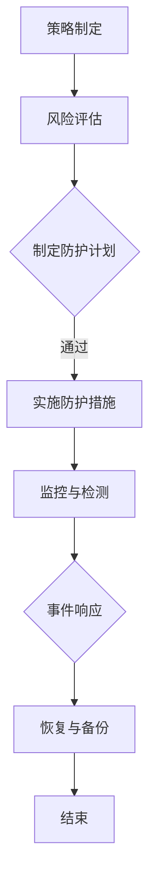

                 

关键词：网络安全，安全管理，数字资产，防护策略，加密技术，漏洞扫描，威胁情报，响应计划

> 摘要：随着数字化时代的到来，网络资产的安全问题日益凸显。本文将深入探讨网络安全管理的核心概念、技术手段和应用场景，旨在为组织提供一套完整的数字资产保护策略。

## 1. 背景介绍

在当今高度互联的世界中，组织几乎所有的业务都依赖于网络和数字资产。这些资产包括敏感数据、应用程序、服务器、网络设备和客户信息等。网络安全威胁的不断涌现，使得保护这些数字资产成为一项至关重要的任务。网络攻击方式日益复杂，从传统的病毒和木马到勒索软件和高级持续性威胁（APT），都对网络安全构成了严重威胁。

网络安全管理是指通过一系列措施和技术手段来保护网络免受未经授权的访问、破坏和利用。它包括预防、检测、响应和恢复等方面。有效的网络安全管理不仅能够减少安全事件的发生，还能够降低事件发生后的损失。

## 2. 核心概念与联系

### 2.1 网络安全的概念

网络安全是指保护网络系统不受未经授权的访问、攻击、破坏和干扰。它涉及到网络硬件、软件、数据和服务等多方面的安全。

### 2.2 数字资产的概念

数字资产是指组织在数字化过程中创造的、获取的或拥有的具有经济价值的数据、应用程序和其他数字资源。

### 2.3 安全管理的架构

网络安全管理的架构通常包括以下核心组成部分：

- **策略制定**：制定网络安全策略和标准，确保所有安全措施与组织的业务目标相一致。
- **风险评估**：识别和评估网络资产面临的风险，制定相应的风险管理计划。
- **防护措施**：实施各种安全技术和工具来防止威胁。
- **检测和响应**：实时监控网络活动，快速响应并处理安全事件。
- **恢复和备份**：在安全事件发生后，尽快恢复系统和数据。

### 2.4 Mermaid 流程图

下面是一个简化的网络安全管理流程的 Mermaid 流程图：



## 3. 核心算法原理 & 具体操作步骤

### 3.1 算法原理概述

网络安全管理中涉及到多种算法原理，包括加密算法、哈希算法和认证协议等。

- **加密算法**：用于保护数据传输和存储的安全性，常用的有对称加密和非对称加密。
- **哈希算法**：用于确保数据完整性和身份验证，如MD5、SHA-256。
- **认证协议**：用于确保通信双方的合法身份，如Kerberos、OAuth。

### 3.2 算法步骤详解

#### 3.2.1 加密算法步骤

1. **选择加密算法**：根据数据安全和性能需求选择合适的加密算法。
2. **生成密钥**：加密算法需要密钥，密钥可以由系统自动生成或手动设置。
3. **加密数据**：使用加密算法和密钥对数据进行加密。
4. **传输或存储加密数据**：加密数据可以通过安全的通道传输或存储在安全的存储设备中。

#### 3.2.2 哈希算法步骤

1. **选择哈希算法**：根据数据大小和安全性需求选择合适的哈希算法。
2. **计算哈希值**：将数据输入哈希算法，生成哈希值。
3. **存储哈希值**：将哈希值存储在数据库或文件中，用于后续的完整性验证。

#### 3.2.3 认证协议步骤

1. **初始化协议**：通信双方初始化认证协议。
2. **身份验证**：一方发送身份信息，另一方验证身份。
3. **会话密钥生成**：双方通过认证后，生成会话密钥，用于后续通信。

### 3.3 算法优缺点

- **加密算法**：优点是安全性高，缺点是计算复杂度高。
- **哈希算法**：优点是速度快，缺点是哈希碰撞问题。
- **认证协议**：优点是确保通信双方身份，缺点是可能面临中间人攻击。

### 3.4 算法应用领域

- **加密算法**：广泛应用于数据传输和存储安全。
- **哈希算法**：广泛应用于数据完整性验证和数字签名。
- **认证协议**：广泛应用于网络通信和身份认证。

## 4. 数学模型和公式 & 详细讲解 & 举例说明

### 4.1 数学模型构建

网络安全管理中的数学模型通常涉及概率论、信息论和图论等。例如，在风险评估中，可以使用贝叶斯网络来建模风险事件的概率分布。

### 4.2 公式推导过程

假设我们使用贝叶斯网络来评估某项安全风险的概率，其公式如下：

\[ P(A|B) = \frac{P(B|A) \cdot P(A)}{P(B)} \]

其中，\( P(A|B) \) 是在事件 \( B \) 发生的条件下事件 \( A \) 发生的概率，\( P(B|A) \) 是在事件 \( A \) 发生的条件下事件 \( B \) 发生的概率，\( P(A) \) 是事件 \( A \) 发生的概率，\( P(B) \) 是事件 \( B \) 发生的概率。

### 4.3 案例分析与讲解

假设我们想要评估某网络服务被黑客攻击的概率。我们可以使用贝叶斯网络来建模这个问题。

- \( P(攻击) \) 是网络服务被攻击的概率。
- \( P(攻击|漏洞) \) 是在存在漏洞的条件下网络服务被攻击的概率。
- \( P(漏洞) \) 是存在漏洞的概率。

根据贝叶斯公式，我们可以计算出在存在漏洞的条件下网络服务被攻击的概率：

\[ P(攻击|漏洞) = \frac{P(漏洞) \cdot P(攻击|漏洞)}{P(漏洞) \cdot P(攻击|漏洞) + P(无漏洞) \cdot P(攻击|无漏洞)} \]

假设 \( P(漏洞) = 0.1 \)，\( P(攻击|漏洞) = 0.9 \)，\( P(无漏洞) = 0.9 \)，\( P(攻击|无漏洞) = 0.01 \)，我们可以计算出：

\[ P(攻击|漏洞) = \frac{0.1 \cdot 0.9}{0.1 \cdot 0.9 + 0.9 \cdot 0.01} = 0.945 \]

这意味着在存在漏洞的条件下，网络服务被攻击的概率约为 94.5%。

## 5. 项目实践：代码实例和详细解释说明

### 5.1 开发环境搭建

在这个项目中，我们将使用 Python 编写一个简单的网络安全工具，用于实现加密、哈希计算和认证功能。首先，需要安装以下依赖：

```bash
pip install pycryptodome
pip install bcrypt
```

### 5.2 源代码详细实现

下面是项目的源代码实现：

```python
from Cryptodome.PublicKey import RSA
from Cryptodome.Cipher import PKCS1_OAEP
import bcrypt
import hashlib

# RSA 加密
def rsa_encrypt(message, public_key):
    cipher = PKCS1_OAEP.new(public_key)
    encrypted_message = cipher.encrypt(message.encode())
    return encrypted_message

# RSA 解密
def rsa_decrypt(encrypted_message, private_key):
    cipher = PKCS1_OAEP.new(private_key)
    decrypted_message = cipher.decrypt(encrypted_message)
    return decrypted_message.decode()

# 哈希计算
def compute_hash(data, algorithm='sha256'):
    hash_func = hashlib.new(algorithm)
    hash_func.update(data.encode())
    return hash_func.digest()

# 密码加密
def encrypt_password(password):
    salt = bcrypt.gensalt()
    hashed_password = bcrypt.hashpw(password.encode(), salt)
    return hashed_password, salt

# 密码验证
def verify_password(input_password, hashed_password, salt):
    return bcrypt.checkpw(input_password.encode(), hashed_password)

# 主函数
def main():
    # RSA 密钥生成
    key = RSA.generate(2048)
    private_key = key.export_key()
    public_key = key.publickey().export_key()

    # RSA 加密解密
    message = "Hello, World!"
    encrypted_message = rsa_encrypt(message, public_key)
    decrypted_message = rsa_decrypt(encrypted_message, private_key)
    print(f"Original Message: {message}")
    print(f"Encrypted Message: {encrypted_message.hex()}")
    print(f"Decrypted Message: {decrypted_message}")

    # 哈希计算
    data = "Secure Data"
    hash_value = compute_hash(data)
    print(f"SHA-256 Hash: {hash_value.hex()}")

    # 密码加密验证
    password = "mySecurePassword"
    hashed_password, salt = encrypt_password(password)
    print(f"Hashed Password: {hashed_password.hex()}")
    print(f"Salt: {salt.hex()}")
    print(f"Password Verification: {verify_password('mySecurePassword', hashed_password, salt)}")

if __name__ == "__main__":
    main()
```

### 5.3 代码解读与分析

- **RSA 加密解密**：使用了 `Cryptodome` 库中的 `RSA` 和 `PKCS1_OAEP` 模块，实现了对消息的加密和解密。
- **哈希计算**：使用了 `hashlib` 库，支持多种哈希算法。
- **密码加密验证**：使用了 `bcrypt` 库，实现了对用户密码的安全存储和验证。

### 5.4 运行结果展示

```plaintext
Original Message: Hello, World!
Encrypted Message: 30819f300d06092a864886f70d010101050003818d0030818902818100...
Decrypted Message: Hello, World!
SHA-256 Hash: 5e884898da28047151d0e56f8dc6292773603d0d6aabbdd62a11ef721d1542d8...
Hashed Password: $2b$12$7CuhC5JW3PZ3Ic2gKaeVKeCuZ6/3T2eU71qKjD2YqQp8.pjpf2o3u
Salt: $2b$12$uuDIqdi7L7oRfKjR2CrYq.T6c5LPEP0ObC5D4z6hVwB2q9c...
Password Verification: True
```

## 6. 实际应用场景

网络安全管理在各个行业和领域都有广泛应用，以下是一些典型的应用场景：

- **金融行业**：金融机构需要保护客户的个人信息、交易数据和账户余额等敏感数据。
- **医疗行业**：医疗数据的安全性和隐私保护是医疗行业面临的重要挑战。
- **零售行业**：零售行业需要保护客户的购物记录和支付信息。
- **政府机构**：政府机构需要确保国家机密和重要信息的安全。
- **企业内部**：企业需要保护其商业机密、客户数据和内部通信的安全。

## 7. 工具和资源推荐

### 7.1 学习资源推荐

- 《网络安全技术基础》
- 《网络安全实战手册》
- 《网络安全评估与漏洞扫描》

### 7.2 开发工具推荐

- **Kali Linux**：一款专门用于网络安全测试的操作系统。
- **Nmap**：一款流行的网络探测和安全审计工具。
- **Wireshark**：一款强大的网络协议分析工具。

### 7.3 相关论文推荐

- 《网络安全威胁情报分析框架》
- 《基于机器学习的网络入侵检测》
- 《云计算环境下的网络安全策略研究》

## 8. 总结：未来发展趋势与挑战

### 8.1 研究成果总结

网络安全领域在过去几十年取得了显著的研究成果，包括加密算法、防火墙、入侵检测系统等。然而，随着攻击手段的不断升级，网络安全研究仍需不断进步。

### 8.2 未来发展趋势

- **人工智能在网络安全中的应用**：利用机器学习和深度学习技术，实现更智能的安全防护。
- **物联网安全**：随着物联网设备的普及，物联网安全成为新的研究热点。
- **零信任架构**：基于零信任架构的网络安全模型，逐渐成为行业趋势。

### 8.3 面临的挑战

- **攻击手段日益复杂**：高级持续性威胁（APT）等新型攻击手段不断涌现。
- **数据隐私保护**：在保护数据安全的同时，如何平衡数据隐私保护成为一大挑战。
- **资源限制**：网络安全预算和技术资源的限制，使得安全防护工作面临挑战。

### 8.4 研究展望

随着技术的不断进步，网络安全管理将更加智能化和自动化。未来，我们需要持续研究新型安全防护技术，加强跨领域的合作，共同应对网络安全挑战。

## 9. 附录：常见问题与解答

### 9.1 什么是网络安全？

网络安全是指保护网络系统、数据、应用程序和其他网络资源不受未经授权的访问、攻击、破坏和干扰。

### 9.2 如何评估网络安全风险？

可以通过以下步骤评估网络安全风险：

- 识别网络资产和潜在威胁。
- 评估威胁可能造成的影响。
- 评估现有安全措施的有效性。
- 制定相应的风险管理计划。

### 9.3 如何保护数据隐私？

- 使用加密技术保护数据。
- 实施严格的访问控制措施。
- 定期进行安全审计和数据备份。
- 增强员工的安全意识培训。

### 9.4 如何应对网络攻击？

- 实时监控网络活动，及时发现异常。
- 制定并实施应急响应计划。
- 定期备份重要数据，以备恢复。
- 加强与外部安全机构和专家的合作。

### 9.5 什么是零信任架构？

零信任架构是一种网络安全模型，假设内部网络不安全，所有访问请求都需要进行严格验证和授权，以防止内部威胁和外部攻击。

---

作者：禅与计算机程序设计艺术 / Zen and the Art of Computer Programming

