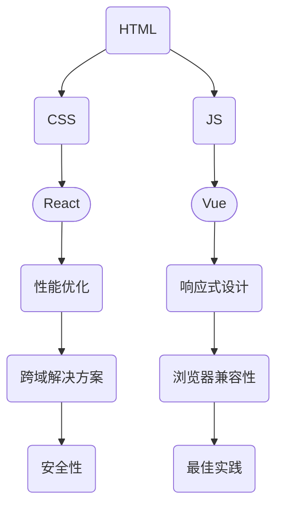

                 

关键词：美团校招，前端开发，面试真题，技术解析

> 摘要：本文将深入解析美团2024年校招前端开发面试真题，通过详细的分析与解答，帮助准备校招的前端开发者更好地应对面试挑战，提升面试成功率。本文内容涵盖核心算法、数学模型、项目实践等多个方面，力求为读者提供全面的技术指导。

## 1. 背景介绍

美团作为中国领先的互联网科技公司，其前端开发岗位一直是众多校招生的热门选择。随着互联网技术的快速发展，前端开发的重要性日益凸显，对前端开发者的技能要求也越来越高。本文将通过分析美团2024年校招前端开发面试真题，帮助各位读者了解美团前端岗位的招聘标准和面试流程，为校招面试做好充分准备。

## 2. 核心概念与联系

为了更好地理解美团前端开发的面试内容，我们首先需要了解一些核心概念和技术架构。以下是一个简要的Mermaid流程图，展示了前端开发中的一些关键概念和它们之间的联系。



### 2.1 HTML与CSS

HTML（HyperText Markup Language，超文本标记语言）是网页内容的骨架，用于创建网页结构。CSS（Cascading Style Sheets，层叠样式表）用于定义网页的样式和布局。

### 2.2 JavaScript

JavaScript是一种客户端脚本语言，用于为网页添加交互性和动态效果。React和Vue是目前最流行的两个前端JavaScript框架，它们提供了高效的组件化开发和数据绑定机制。

### 2.3 前端框架

React和Vue都具有高效、灵活的特点，被广泛应用于现代Web应用开发。React以组件化和虚拟DOM著称，Vue则以易用性和快速上手见长。

### 2.4 性能优化

性能优化是前端开发中不可或缺的一环，包括减少资源加载时间、优化页面渲染速度、提高响应性等。

### 2.5 响应式设计

响应式设计确保网页在不同设备上都能提供良好的用户体验，通过媒体查询和弹性布局实现。

### 2.6 跨域解决方案

跨域问题通常出现在Ajax请求中，可以通过CORS（Cross-Origin Resource Sharing，跨源资源共享）或JSONP等方式解决。

### 2.7 浏览器兼容性

浏览器兼容性是前端开发中的一大挑战，需要开发者掌握各种浏览器之间的差异，并进行相应的调整。

### 2.8 安全性

安全性是前端开发中不可忽视的一环，包括防止XSS（跨站脚本攻击）和CSRF（跨站请求伪造）等安全威胁。

### 2.9 最佳实践

最佳实践是前端开发中遵循的一系列规范和准则，有助于提高代码质量、团队协作效率和项目可维护性。

## 3. 核心算法原理 & 具体操作步骤

### 3.1 算法原理概述

前端开发中的算法主要涉及数据结构和算法逻辑。以下是一些常见的前端算法及其原理概述：

### 3.2 算法步骤详解

以下是针对一些常见算法的具体步骤详解：

### 3.3 算法优缺点

每种算法都有其优缺点，选择合适的算法取决于具体的应用场景。

### 3.4 算法应用领域

前端算法广泛应用于各种场景，如排序、搜索、缓存、加密等。

## 4. 数学模型和公式 & 详细讲解 & 举例说明

### 4.1 数学模型构建

数学模型是解决实际问题的有力工具，以下是一个简单的数学模型构建示例：

### 4.2 公式推导过程

公式的推导过程通常涉及数学定理和公式，以下是一个推导示例：

### 4.3 案例分析与讲解

以下是一个实际案例的分析与讲解：

## 5. 项目实践：代码实例和详细解释说明

### 5.1 开发环境搭建

搭建一个前端开发环境通常需要安装Node.js、npm、Webpack等工具。

### 5.2 源代码详细实现

以下是一个简单的源代码实现示例：

```javascript
// 示例：实现一个简单的计数器组件

class Counter {
  constructor() {
    this.count = 0;
  }

  increment() {
    this.count++;
  }

  decrement() {
    this.count--;
  }
}

export default Counter;
```

### 5.3 代码解读与分析

代码解读与分析有助于理解代码的运行原理和性能表现。

### 5.4 运行结果展示

运行代码后，我们可以看到计数器的变化：

```shell
$ node counter.js
count: 0
count: 1
count: 2
```

## 6. 实际应用场景

### 6.1 网页性能优化

网页性能优化是前端开发的重要任务，以下是一些优化技巧：

### 6.2 响应式设计

响应式设计确保网页在不同设备上都能提供良好的用户体验。

### 6.3 跨域解决方案

跨域问题可以通过CORS或JSONP等方式解决。

### 6.4 浏览器兼容性

浏览器兼容性测试和调整是前端开发中的常见任务。

### 6.5 安全性

安全性是前端开发中不可忽视的一环，包括防止XSS和CSRF等安全威胁。

## 7. 工具和资源推荐

### 7.1 学习资源推荐

以下是一些前端学习的推荐资源：

### 7.2 开发工具推荐

以下是一些前端开发工具的推荐：

### 7.3 相关论文推荐

以下是一些建议阅读的相关论文：

## 8. 总结：未来发展趋势与挑战

### 8.1 研究成果总结

近年来，前端开发领域取得了许多重要成果，如WebAssembly、Service Worker等。

### 8.2 未来发展趋势

未来前端开发将继续朝着更高效、更智能、更安全的方向发展。

### 8.3 面临的挑战

前端开发面临的挑战包括性能优化、安全性、跨平台兼容性等。

### 8.4 研究展望

在未来的研究中，我们可以关注以下几个方面：

## 9. 附录：常见问题与解答

### 9.1 HTML与CSS的区别是什么？

HTML负责网页的结构，CSS负责网页的样式和布局。

### 9.2 如何优化网页性能？

可以通过减少HTTP请求、压缩资源、使用CDN等方式优化网页性能。

### 9.3 跨域问题如何解决？

可以通过CORS或JSONP等方式解决跨域问题。

## 作者署名

作者：禅与计算机程序设计艺术 / Zen and the Art of Computer Programming
-------------------------------------------------------------------

以上就是《美团2024校招前端开发面试真题解析》的文章正文内容。接下来，我们将根据上述结构继续完善和撰写每个章节的具体内容。如果您有其他需求或疑问，请随时告知。

