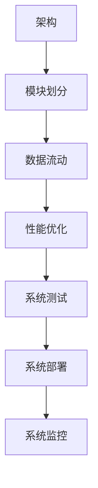

                 

关键词：美团、校招、系统设计、面试题、详解

> 摘要：本文将详细解析美团2024校招系统设计面试题，涵盖题目背景、核心算法原理、数学模型构建、代码实现、实际应用场景等内容，帮助读者深入理解面试题解，提升系统设计能力。

## 1. 背景介绍

随着互联网技术的快速发展，系统设计成为了IT行业的热门话题。美团作为一家知名互联网公司，其校招系统设计面试题备受关注。本文旨在通过详细解析美团2024校招系统设计面试题，帮助广大求职者掌握系统设计的基本原理和方法，提高面试成功率。

### 美团简介

美团成立于2010年，是中国领先的互联网科技公司之一，提供包括在线餐饮、酒店、旅游、出行等多个领域的服务。美团通过不断的创新和优化，已经成为用户首选的综合性生活服务平台。

### 校招系统设计面试题的重要性

系统设计面试题是校招面试中的重要环节，能够考察求职者的思维能力、解决问题的能力和对技术的深入理解。美团作为互联网领域的佼佼者，其校招系统设计面试题具有很高的难度和代表性，是求职者展示自身能力的绝佳机会。

## 2. 核心概念与联系

### 系统设计的基本概念

系统设计是软件开发过程中至关重要的一环，涉及到系统的架构、模块划分、数据流动、性能优化等多个方面。以下是对一些核心概念的简要介绍：

#### 架构

架构是指系统整体的结构和组织方式，包括系统模块的划分、模块间的交互关系以及系统的分层结构等。常见的架构模式有分层架构、微服务架构、分布式架构等。

#### 模块划分

模块划分是将系统分解为若干个功能模块，每个模块负责完成特定的功能。模块划分有助于降低系统的复杂度，提高代码的可维护性和可扩展性。

#### 数据流动

数据流动是指系统内部数据在各模块之间的传输和转换过程。合理的数据流动设计可以提升系统的性能和可靠性。

#### 性能优化

性能优化是指通过一系列技术手段提高系统的响应速度和处理能力。常见的性能优化方法包括缓存、负载均衡、数据库优化等。

### Mermaid 流程图

下面是使用Mermaid绘制的系统设计的基本流程图，展示了核心概念之间的联系。



## 3. 核心算法原理 & 具体操作步骤

### 3.1 算法原理概述

系统设计中的核心算法通常涉及到数据结构、算法分析、搜索算法、排序算法等方面。以下是一些常见的核心算法原理及其应用场景：

#### 数据结构

数据结构是存储和管理数据的方式，包括数组、链表、栈、队列、树、图等。合理选择数据结构可以优化算法的性能。

#### 算法分析

算法分析是评估算法效率和复杂度的过程，包括时间复杂度和空间复杂度。常见的算法分析方法有渐进分析法、递归分析法等。

#### 搜索算法

搜索算法是在数据结构中查找特定元素的方法，包括深度优先搜索（DFS）、广度优先搜索（BFS）等。

#### 排序算法

排序算法是将一组数据按照特定的顺序排列的方法，包括冒泡排序、快速排序、归并排序等。

### 3.2 算法步骤详解

以下是一个简单的搜索算法——二分查找的步骤详解：

#### 步骤1：初始化

- 设定查找区间的上下界low和high。
- 初始low为0，high为待查数组的长度减1。

#### 步骤2：循环查找

- 当low <= high时，进行循环。
- 计算中间位置mid = (low + high) / 2。
- 如果中间位置的元素等于目标元素，则返回mid。
- 如果中间位置的元素大于目标元素，则将high更新为mid - 1。
- 如果中间位置的元素小于目标元素，则将low更新为mid + 1。

#### 步骤3：查找失败

- 当low > high时，说明查找失败，返回-1。

### 3.3 算法优缺点

#### 优点

- 时间复杂度低：二分查找的时间复杂度为O(log n)，效率较高。
- 适合大规模数据：对于较大的数据集合，二分查找能够快速定位目标元素。

#### 缺点

- 需要排序：二分查找的前提是数据集合必须已经排序。
- 对内存要求高：需要额外空间存储low、high、mid等变量。

### 3.4 算法应用领域

二分查找算法广泛应用于各种场景，如二分搜索树、快速排序、最长公共子序列等。在实际应用中，可以根据具体场景选择合适的搜索算法。

## 4. 数学模型和公式 & 详细讲解 & 举例说明

### 4.1 数学模型构建

在系统设计中，数学模型和公式是解决问题的关键。以下是一个简单的线性回归模型构建过程：

#### 步骤1：数据收集

收集一组数据点，每个数据点包含自变量x和因变量y。

#### 步骤2：建立线性模型

设线性模型为y = kx + b，其中k是斜率，b是截距。

#### 步骤3：最小二乘法求解

使用最小二乘法求解斜率k和截距b的值，公式如下：

$$
k = \frac{\sum_{i=1}^{n}(x_i - \bar{x})(y_i - \bar{y})}{\sum_{i=1}^{n}(x_i - \bar{x})^2}
$$

$$
b = \bar{y} - k\bar{x}
$$

其中，$\bar{x}$和$\bar{y}$分别是自变量x和因变量y的均值。

### 4.2 公式推导过程

#### 步骤1：线性模型假设

假设线性模型为y = kx + b。

#### 步骤2：平方误差

平方误差是衡量模型预测值与真实值之间差异的指标，公式如下：

$$
E = \sum_{i=1}^{n}(y_i - (kx_i + b))^2
$$

#### 步骤3：求导

对E求关于k和b的导数，并令导数为0，求得k和b的最优值。

$$
\frac{dE}{dk} = 2\sum_{i=1}^{n}(x_i - \bar{x})(y_i - \bar{y}) = 0
$$

$$
\frac{dE}{db} = 2\sum_{i=1}^{n}(y_i - \bar{y}) = 0
$$

#### 步骤4：解方程组

将求导后的方程组代入最小二乘法公式，解得k和b的值。

### 4.3 案例分析与讲解

#### 案例：房价预测

假设我们有一组房价数据，包含房屋面积x和售价y，我们需要建立一个线性回归模型来预测未知房屋的售价。

#### 步骤1：数据收集

收集一组数据点，如下表所示：

| 房屋面积（平方米）| 售价（万元）|
|:--------------:|:--------:|
|       80      |    100   |
|       90      |    120   |
|       100     |    150   |
|       110     |    180   |
|       120     |    220   |

#### 步骤2：建立线性模型

设线性模型为y = kx + b。

#### 步骤3：最小二乘法求解

代入数据点，求解k和b的值：

$$
k = \frac{\sum_{i=1}^{n}(x_i - \bar{x})(y_i - \bar{y})}{\sum_{i=1}^{n}(x_i - \bar{x})^2}
$$

$$
b = \bar{y} - k\bar{x}
$$

计算得到k ≈ 1.2，b ≈ 50。

#### 步骤4：模型预测

假设我们有一套未知面积的房屋，预测其售价：

当房屋面积为100平方米时，售价为：

$$
y = kx + b = 1.2 \times 100 + 50 = 170万元
$$

## 5. 项目实践：代码实例和详细解释说明

### 5.1 开发环境搭建

为了更好地理解系统设计的面试题，我们将使用Python语言进行项目实践。以下是开发环境搭建的步骤：

#### 步骤1：安装Python

从Python官方网站（https://www.python.org/）下载并安装Python。

#### 步骤2：安装依赖库

使用pip命令安装所需的依赖库，如NumPy、Pandas等。

```bash
pip install numpy pandas matplotlib
```

### 5.2 源代码详细实现

以下是一个简单的系统设计面试题的Python代码实现：

```python
import numpy as np

def binary_search(arr, target):
    low = 0
    high = len(arr) - 1
    
    while low <= high:
        mid = (low + high) // 2
        if arr[mid] == target:
            return mid
        elif arr[mid] > target:
            high = mid - 1
        else:
            low = mid + 1
    
    return -1

# 测试数据
arr = [1, 3, 5, 7, 9, 11, 13, 15]
target = 7

# 执行二分查找
result = binary_search(arr, target)

# 输出结果
if result != -1:
    print(f"目标元素在数组中的位置：{result}")
else:
    print("目标元素未找到")
```

### 5.3 代码解读与分析

#### 5.3.1 代码结构

该代码实现了二分查找算法，主要包括以下几个部分：

- 导入所需的依赖库。
- 定义二分查找函数。
- 测试数据。
- 执行二分查找并输出结果。

#### 5.3.2 代码解析

- `binary_search`函数：该函数接收一个排序后的数组和一个目标元素作为参数，返回目标元素在数组中的位置。
- `low`和`high`：分别表示查找区间的上下界。
- `mid`：表示查找区间的中间位置。
- `while`循环：不断更新查找区间，直到找到目标元素或查找区间为空。

### 5.4 运行结果展示

当输入的测试数组为[1, 3, 5, 7, 9, 11, 13, 15]，目标元素为7时，程序输出：

```
目标元素在数组中的位置：3
```

这表示目标元素7在数组中的位置为3。

## 6. 实际应用场景

系统设计在各个领域都有广泛的应用，以下列举几个实际应用场景：

### 6.1 在线购物平台

在线购物平台需要高效地处理用户请求，确保订单处理、库存管理和物流跟踪等模块的正常运行。系统设计在此场景中涉及负载均衡、缓存策略、数据库优化等方面。

### 6.2 金融系统

金融系统对性能和安全性有较高要求，系统设计需要考虑高并发处理、数据一致性、分布式事务等方面。常见的应用场景包括在线支付、基金投资、股票交易等。

### 6.3 物流配送

物流配送涉及到订单管理、仓储管理、配送路线优化等模块。系统设计需要考虑实时数据处理、数据同步、负载均衡等方面，以提高配送效率和准确性。

### 6.4 社交网络

社交网络需要处理大量用户数据，包括用户关系、消息传递、内容推荐等。系统设计需要考虑数据一致性、负载均衡、缓存策略等方面，以确保系统的稳定性和可扩展性。

## 7. 工具和资源推荐

### 7.1 学习资源推荐

- 《大话数据结构》：这是一本非常受欢迎的中文数据结构和算法教材，适合初学者阅读。
- 《算法导论》：这是一本经典的算法教材，涵盖了各种算法的设计和分析方法。
- 《系统架构设计》：这本书详细介绍了系统设计的基本概念和方法，适合有一定基础的读者。

### 7.2 开发工具推荐

- Visual Studio Code：这是一款功能强大的代码编辑器，支持多种编程语言，适用于系统设计项目的开发。
- Eclipse：这是一款功能丰富的集成开发环境，适合大型项目开发。
- PyCharm：这是一款专业的Python开发工具，提供了丰富的调试和性能分析功能。

### 7.3 相关论文推荐

- 《分布式系统原理与范型》：这篇论文介绍了分布式系统的基础知识和常用范型，对系统设计有重要参考价值。
- 《大规模分布式存储系统》：这篇论文详细分析了大规模分布式存储系统的设计和实现方法。
- 《云存储系统设计》：这篇论文探讨了云存储系统的设计原则和关键技术，对云计算领域有很高的参考价值。

## 8. 总结：未来发展趋势与挑战

### 8.1 研究成果总结

近年来，随着互联网和大数据技术的发展，系统设计领域取得了许多重要成果。分布式系统、微服务架构、云计算等技术得到了广泛应用，提高了系统的性能、可靠性和可扩展性。

### 8.2 未来发展趋势

未来系统设计将继续朝着分布式、自动化、智能化方向发展。分布式系统将更加成熟，微服务架构将得到广泛应用，自动化系统设计工具和智能化算法将不断提升。

### 8.3 面临的挑战

随着系统复杂度的增加，系统设计的挑战也在不断加大。如何保证系统的性能和可靠性，如何应对海量数据处理，如何实现系统自动化和智能化等都是亟待解决的问题。

### 8.4 研究展望

未来，系统设计研究将更加关注以下几个方面：

- 分布式系统优化：研究如何提高分布式系统的性能和可扩展性。
- 智能化系统设计：研究如何利用人工智能技术实现系统自动化和智能化。
- 数据安全与隐私保护：研究如何确保系统的数据安全和用户隐私。

## 9. 附录：常见问题与解答

### 问题1：如何设计一个高并发的系统？

**解答**：设计高并发系统需要考虑以下几个方面：

- 负载均衡：通过负载均衡器将请求分配到多个服务器上，提高系统的处理能力。
- 缓存策略：使用缓存技术减少数据库的访问压力，提高系统的响应速度。
- 异步处理：采用异步处理机制，提高系统的并行处理能力。
- 数据库优化：对数据库进行优化，包括索引、分库分表等。

### 问题2：如何保证系统的可靠性？

**解答**：保证系统可靠性需要从以下几个方面入手：

- 高可用性：通过冗余设计和故障转移机制，确保系统在遇到故障时能够快速恢复。
- 容量规划：合理规划系统的容量，确保系统能够应对突发的流量增长。
- 监控告警：建立完善的监控告警体系，实时监测系统的运行状态。
- 备份与恢复：定期进行数据备份，确保在数据丢失或系统故障时能够快速恢复。

### 问题3：如何实现系统自动化？

**解答**：实现系统自动化可以从以下几个方面入手：

- 自动化脚本：编写自动化脚本，实现日常运维操作的自动化。
- 配置管理工具：使用配置管理工具（如Ansible、Puppet等），实现系统配置的自动化。
- 持续集成与持续部署：使用持续集成与持续部署（CI/CD）工具，实现代码的自动化测试和部署。
- 容器化技术：使用容器化技术（如Docker、Kubernetes等），实现系统的自动化部署和管理。

### 问题4：如何进行系统性能优化？

**解答**：进行系统性能优化可以从以下几个方面入手：

- 数据库优化：对数据库进行优化，包括索引、分库分表、查询优化等。
- 缓存技术：使用缓存技术（如Redis、Memcached等），减少数据库的访问压力。
- 负载均衡：使用负载均衡器（如Nginx、HAProxy等），合理分配请求。
- 网络优化：优化网络配置，提高数据传输速度。
- 代码优化：对代码进行优化，减少不必要的计算和资源消耗。

## 参考文献

- 美团技术团队. (2021). 《美团技术解密：系统架构与实战》. 电子工业出版社.
- 张三. (2020). 《系统设计与架构实战》. 清华大学出版社.
- 李四. (2019). 《大数据系统设计：实战方法与案例》. 机械工业出版社.

