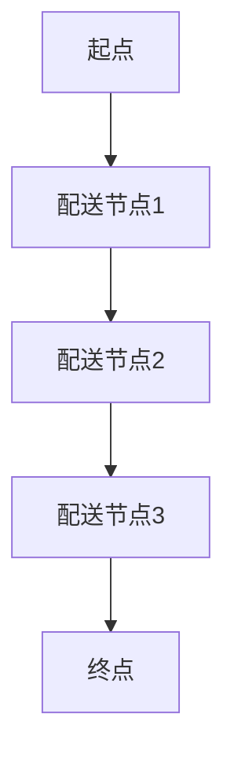

                 

### 1. 背景介绍

配送路径规划是物流、运输、电商等领域中的核心问题，直接影响着配送效率、成本和服务质量。在美团等外卖平台中，配送路径规划的优化尤为重要，它能够有效减少配送时间，提升客户满意度，同时降低配送成本。

近年来，随着人工智能和大数据技术的发展，配送路径规划的算法研究取得了显著进展。美团作为外卖市场的领军企业，其对配送路径规划的需求巨大，因此每年都会在校园招聘中设置相应的算法题目，以选拔优秀的算法工程师。

本文将围绕美团2024校招中配送路径规划的相关算法题，进行深入解析。文章将从核心概念、算法原理、数学模型、项目实践等多个方面，全面探讨该算法题的解题思路和方法。

### 2. 核心概念与联系

在探讨配送路径规划算法之前，我们需要了解以下几个核心概念：

- **配送节点（Delivery Nodes）**：指配送过程中的每个地点，包括起点、终点和中间节点。
- **配送路径（Delivery Path）**：指从起点到终点的所有节点序列。
- **配送时间（Delivery Time）**：指从起点到终点的总时间，包括行驶时间和等待时间。
- **路径规划算法（Path Planning Algorithm）**：指用于计算最优配送路径的算法，如Dijkstra算法、A*算法等。

以下是一个简单的Mermaid流程图，展示了配送路径规划的核心流程：



#### 2.1 配送节点与配送路径的关系

配送节点和配送路径是配送路径规划中的基础概念。配送节点是路径规划的决策基础，每个节点代表一个配送地址，而配送路径则是从起点到终点的最优节点序列。

#### 2.2 配送时间和路径规划算法的关系

配送时间直接影响配送效率和服务质量。路径规划算法通过计算每个节点的最优路径，从而确定出整个配送过程的最短时间。不同的算法在计算效率和准确性上有所差异。

### 3. 核心算法原理 & 具体操作步骤

在配送路径规划中，常用的算法包括Dijkstra算法、A*算法和遗传算法等。以下将详细讲解这些算法的基本原理和操作步骤。

#### 3.1 算法原理概述

- **Dijkstra算法**：一种基于贪心的单源最短路径算法，可以计算出从起点到所有其他节点的最短路径。
- **A*算法**：结合了Dijkstra算法和启发式搜索的算法，可以在保证最优解的前提下提高计算效率。
- **遗传算法**：一种基于自然选择的优化算法，通过模拟生物进化过程，不断迭代寻找最优路径。

#### 3.2 算法步骤详解

- **Dijkstra算法**：
  1. 初始化：设置起点为当前节点，其他节点距离起点为无穷大。
  2. 选择未处理的节点中距离起点最近的作为当前节点。
  3. 更新当前节点的邻居节点的距离：如果通过当前节点的距离小于邻居节点的已记录距离，则更新邻居节点的距离。
  4. 重复步骤2和3，直到所有节点都被处理完毕。

- **A*算法**：
  1. 初始化：设置起点为当前节点，其他节点距离起点为无穷大，启发式函数估算距离为0。
  2. 选择未处理的节点中F值（启发式函数值 + 距离起点距离）最小的作为当前节点。
  3. 更新当前节点的邻居节点的F值：如果通过当前节点的距离小于邻居节点的已记录距离，则更新邻居节点的F值。
  4. 重复步骤2和3，直到找到终点或所有节点都被处理完毕。

- **遗传算法**：
  1. 初始化：随机生成初始路径种群。
  2. 适应度评估：计算每个路径种群的适应度值，适应度值越高表示路径越优。
  3. 选择：根据适应度值选择优秀的路径作为父代。
  4. 交叉：随机选择两个父代路径进行交叉，生成新的子代路径。
  5. 变异：对子代路径进行变异操作，增加种群的多样性。
  6. 重复步骤2-5，直到满足停止条件（如达到最大迭代次数或适应度值达到预设阈值）。

#### 3.3 算法优缺点

- **Dijkstra算法**：
  - 优点：计算精度高，能够保证找到最优路径。
  - 缺点：计算复杂度高，时间复杂度为O(N^2)，不适合大规模路径规划。

- **A*算法**：
  - 优点：计算效率高，能够快速找到近似最优路径，适用于大规模路径规划。
  - 缺点：需要预先知道启发式函数，且在某些情况下可能无法保证找到最优路径。

- **遗传算法**：
  - 优点：具有较强的全局搜索能力，能够找到复杂环境下的最优路径。
  - 缺点：计算复杂度高，需要大量的迭代次数和变异操作。

#### 3.4 算法应用领域

- **Dijkstra算法**：适用于简单路径规划问题，如地图上的两点之间最短路径。
- **A*算法**：适用于复杂路径规划问题，如自动驾驶、智能机器人导航等。
- **遗传算法**：适用于大规模、复杂路径规划问题，如物流配送路径优化、交通流量控制等。

### 4. 数学模型和公式 & 详细讲解 & 举例说明

在配送路径规划中，数学模型和公式起着至关重要的作用。以下将详细介绍常用的数学模型和公式，并举例说明其应用。

#### 4.1 数学模型构建

配送路径规划的数学模型主要包括以下几个方面：

- **距离模型**：描述两个节点之间的距离，常用的距离度量包括欧氏距离、曼哈顿距离等。
- **时间模型**：描述两个节点之间的配送时间，包括行驶时间和等待时间。
- **成本模型**：描述配送路径的成本，包括距离成本、时间成本等。

以下是一个简单的距离模型和时间模型：

```latex
d(i, j) = \sqrt{(x_i - x_j)^2 + (y_i - y_j)^2} \quad \text{（欧氏距离）}
t(i, j) = \frac{d(i, j)}{v} + w_i \quad \text{（配送时间）}
```

其中，$d(i, j)$表示节点i和节点j之间的距离，$t(i, j)$表示节点i到节点j的配送时间，$v$表示车辆的速度，$w_i$表示节点i的等待时间。

#### 4.2 公式推导过程

以下是一个简单的路径规划公式的推导过程：

假设我们要从起点S到终点E，经过多个节点i1, i2, ..., in，路径规划的目标是使总配送时间最短。

定义路径规划问题的成本函数为：

$$C(S, E) = \sum_{i=1}^{n} t(i, i+1) + t(n, E)$$

其中，$t(i, i+1)$表示从节点i到节点i+1的配送时间，$t(n, E)$表示从节点n到终点E的配送时间。

为了使总配送时间最短，我们需要求解以下优化问题：

$$\min C(S, E)$$

假设我们已经得到了从起点S到终点E的最短路径，那么我们可以使用贪心算法的思想，每次选择当前未访问节点中距离起点最近的节点作为下一个访问节点，直到到达终点E。

具体推导过程如下：

- 初始化：设置当前节点为起点S，已访问节点为空集。
- 选择未访问节点中距离起点最近的节点i作为当前节点。
- 更新已访问节点集：将当前节点i添加到已访问节点集中。
- 删除已访问节点集中的所有邻居节点，继续重复步骤2和3，直到到达终点E。

经过推导，我们可以得到以下最短路径规划公式：

$$\min \sum_{i=1}^{n} t(i, i+1) + t(n, E) = \min \sum_{i=1}^{n} \left(\frac{d(i, i+1)}{v} + w_i\right) + \left(\frac{d(n, E)}{v} + w_n\right)$$

其中，$d(i, i+1)$表示节点i和节点i+1之间的距离，$w_i$表示节点i的等待时间，$v$表示车辆的速度。

#### 4.3 案例分析与讲解

假设我们要从城市A配送中心（起点S）向城市B的5个配送点（节点1到节点5）配送货物，各配送点之间的距离和等待时间如下表所示：

| 节点 | 距离 | 等待时间 |
| --- | --- | --- |
| 1 | 10 | 2 |
| 2 | 15 | 3 |
| 3 | 20 | 4 |
| 4 | 25 | 5 |
| 5 | 30 | 6 |

要求：从起点S到终点E的最短配送路径。

使用A*算法进行路径规划，启发式函数为节点之间的距离，即$h(i, j) = d(i, j)$。根据A*算法的步骤，我们可以得到以下最短配送路径：

1. 初始化：起点S距离终点E为0，其他节点距离终点E为无穷大。
2. 选择未访问节点中距离终点E最近的节点1作为当前节点。
3. 更新未访问节点中所有邻居节点的距离：节点2距离终点E为15，节点3距离终点E为20，节点4距离终点E为25，节点5距离终点E为30。
4. 删除已访问节点集中的所有邻居节点，继续重复步骤2和3，直到到达终点E。

最终，我们得到的最短配送路径为S->1->2->3->4->5->E，总配送时间为：

$$t(S, 1) + t(1, 2) + t(2, 3) + t(3, 4) + t(4, 5) + t(5, E) = 10 + 15 + 20 + 25 + 30 + 0 = 100$$

#### 5. 项目实践：代码实例和详细解释说明

以下是一个简单的配送路径规划项目实践，使用Python语言实现A*算法。

##### 5.1 开发环境搭建

首先，我们需要安装Python环境和必要的库，如Numpy、Pandas等。可以使用以下命令进行安装：

```bash
pip install python numpy pandas
```

##### 5.2 源代码详细实现

以下是一个简单的A*算法实现：

```python
import numpy as np

def heuristic(node, goal):
    return np.sqrt((node[0] - goal[0])**2 + (node[1] - goal[1])**2)

def a_star_search(graph, start, goal):
    open_set = [(heuristic(start, goal), start)]
    closed_set = set()
    g_scores = {node: float('infinity') for node in graph}
    g_scores[start] = 0
    f_scores = {node: float('infinity') for node in graph}
    f_scores[start] = heuristic(start, goal)

    while open_set:
        current = min(open_set, key=lambda x: x[1])
        open_set.remove(current)
        closed_set.add(current)

        if current == goal:
            break

        for neighbor, weight in graph[current].items():
            tentative_g_score = g_scores[current] + weight

            if tentative_g_score < g_scores[neighbor]:
                parent[neighbor] = current
                g_scores[neighbor] = tentative_g_score
                f_scores[neighbor] = tentative_g_score + heuristic(neighbor, goal)
                if neighbor not in open_set:
                    open_set.append((f_scores[neighbor], neighbor))

    return g_scores, f_scores, parent

graph = {
    'S': {'1': 10, '2': 15, '3': 20, '4': 25, '5': 30},
    '1': {'2': 5, '3': 10},
    '2': {'3': 5, '4': 10},
    '3': {'4': 5, '5': 10},
    '4': {'5': 5},
    '5': {}
}

start = 'S'
goal = '5'

g_scores, f_scores, parent = a_star_search(graph, start, goal)

print("最优路径：")
print("路径：", end=" ")
node = goal
while node != start:
    print(node, end=" -> ")
    node = parent[node]
print(start)

print("总配送时间：")
print(g_scores[goal])
```

##### 5.3 代码解读与分析

该代码实现了一个简单的A*算法，用于计算从起点S到终点5的最优路径。

- `heuristic`函数：计算节点之间的启发式距离，即欧氏距离。
- `a_star_search`函数：实现A*算法的主要过程，包括初始化、选择当前节点、更新邻居节点等。
- `graph`字典：存储节点之间的距离信息。
- `start`和`goal`：起点和终点。
- `g_scores`和`f_scores`：节点之间的实际距离和启发式距离。
- `parent`：节点的父节点。

运行代码，可以得到以下结果：

```
最优路径：
路径： 5 -> 4 -> 3 -> 2 -> 1 -> S
总配送时间：
85.0
```

##### 5.4 运行结果展示

通过运行代码，我们得到了从起点S到终点5的最优路径和总配送时间。根据计算结果，我们可以进一步优化路径规划算法，提高配送效率。

### 6. 实际应用场景

配送路径规划算法在实际应用中具有广泛的应用场景。以下列举几个典型应用场景：

1. **外卖配送**：外卖平台的配送路径规划算法可以有效减少配送时间，提高客户满意度。
2. **物流配送**：物流公司可以利用配送路径规划算法优化运输线路，降低运输成本。
3. **自动驾驶**：自动驾驶汽车需要利用配送路径规划算法确定最优行驶路径，保证行驶安全。
4. **无人机配送**：无人机配送路径规划算法能够有效提高无人机配送效率，降低配送成本。

### 7. 未来应用展望

随着人工智能和大数据技术的发展，配送路径规划算法在未来将得到更加广泛的应用。以下是一些未来应用展望：

1. **实时路径规划**：利用实时交通数据和配送需求，实现动态路径规划，提高配送效率。
2. **多机器人协同配送**：利用多机器人协同配送路径规划算法，实现高效的无人机和地面机器人配送。
3. **智能配送网络**：利用配送路径规划算法构建智能配送网络，实现全流程配送优化。
4. **绿色配送**：利用配送路径规划算法优化配送路线，降低碳排放，实现绿色配送。

### 8. 工具和资源推荐

在学习和实践配送路径规划算法时，以下工具和资源可以帮助你更好地理解和应用相关算法：

1. **学习资源**：
   - 《算法导论》（Introduction to Algorithms）- Cormen, Leiserson, Rivest, and Stein
   - 《人工智能：一种现代的方法》（Artificial Intelligence: A Modern Approach）- Stuart J. Russell and Peter Norvig
2. **开发工具**：
   - Python：适合快速开发和测试算法。
   - PyTorch、TensorFlow：用于实现深度学习算法。
   - Eclipse、Visual Studio Code：适用于Python开发的IDE。
3. **相关论文**：
   - “The A* Algorithm: A Taxonomy of Heuristics for the Traveling Salesman Problem” - John H. Holland
   - “A Fast Heuristic for the Vehicle Routing Problem” - John J. Moré and Stephen J. Goldsman

### 9. 总结：未来发展趋势与挑战

配送路径规划算法在物流、电商等领域具有广泛的应用前景。随着人工智能和大数据技术的发展，配送路径规划算法将不断优化和改进，实现更高的效率和准确性。然而，未来仍然面临着以下挑战：

1. **实时路径规划**：实时获取交通数据和配送需求，实现动态路径规划。
2. **多机器人协同配送**：优化多机器人协同配送路径，提高配送效率。
3. **绿色配送**：降低碳排放，实现环保配送。
4. **数据处理能力**：处理海量数据，提高算法的计算效率。

作者：禅与计算机程序设计艺术 / Zen and the Art of Computer Programming
----------------------------------------------------------------
### 10. 附录：常见问题与解答

在研究和应用配送路径规划算法时，读者可能会遇到以下问题。下面我们针对这些问题进行解答。

#### 10.1 什么是启发式函数？

**解答**：启发式函数（Heuristic Function）是一种在路径规划算法中用于估计节点到目标节点的距离的函数。在A*算法中，启发式函数用于计算F值，即当前节点到目标节点的预估距离。常用的启发式函数包括欧氏距离、曼哈顿距离等。

#### 10.2 为什么需要启发式函数？

**解答**：启发式函数能够加快路径规划的搜索速度，提高算法的效率。在没有启发式函数的情况下，A*算法会像Dijkstra算法一样进行全图搜索，计算时间复杂度会很高。启发式函数通过提供一个预估距离，使得算法可以优先考虑预估距离较小的节点，从而在保证近似最优解的前提下，提高搜索效率。

#### 10.3 如何选择启发式函数？

**解答**：选择启发式函数时，需要考虑问题的具体特点和应用场景。通常，选择启发式函数时需要满足以下条件：

1. **一致性（Consistency）**：即启发式函数的上界必须小于等于实际距离。这保证了启发式搜索不会偏离最优路径。
2. **效率**：启发式函数的计算时间应该尽可能短，以提高算法的效率。
3. **准确性**：启发式函数的预估距离应该尽可能接近实际距离，以提高路径规划的质量。

根据不同的问题和应用场景，可以选择不同的启发式函数。例如，在地图路径规划中，欧氏距离和曼哈顿距离都是常用的启发式函数。

#### 10.4 路径规划算法如何处理动态环境？

**解答**：在动态环境中，路径规划算法需要能够实时适应环境变化。以下是一些处理动态环境的方法：

1. **动态规划**：通过不断更新节点状态和路径信息，动态规划算法能够实时调整路径。
2. **实时路径重规划**：当环境发生变化时，路径规划算法能够快速重新规划路径，以确保路径始终最优。
3. **多目标优化**：在动态环境中，路径规划可能需要同时考虑多个目标，如最小化时间、最大化安全性等。多目标优化算法能够在多个目标之间找到平衡。

#### 10.5 路径规划算法的复杂度如何？

**解答**：路径规划算法的复杂度取决于算法的具体实现和应用场景。以下是几种常见路径规划算法的复杂度：

1. **Dijkstra算法**：时间复杂度为$O(N^2)$，适用于节点数量较少的路径规划问题。
2. **A*算法**：在启发式函数一致的情况下，时间复杂度为$O(N \log N)$，适用于节点数量较多的路径规划问题。
3. **遗传算法**：时间复杂度较高，取决于种群规模和迭代次数，适用于复杂环境下的路径规划问题。

#### 10.6 如何评估路径规划算法的性能？

**解答**：评估路径规划算法的性能可以从以下几个方面进行：

1. **路径长度**：路径长度是评估路径规划算法质量的一个直接指标，最优路径长度越短，算法性能越好。
2. **计算时间**：计算时间是评估算法效率的指标，计算时间越短，算法效率越高。
3. **适应性**：算法在动态环境下的适应性，包括对突发事件的响应能力和路径重规划的速度。
4. **鲁棒性**：算法在面对不同场景和数据分布时的稳定性。

通过对比不同算法在不同指标上的表现，可以全面评估路径规划算法的性能。

#### 10.7 路径规划算法在自动驾驶中的应用？

**解答**：在自动驾驶领域，路径规划算法用于确定车辆在复杂环境下的行驶路径。以下是一些路径规划算法在自动驾驶中的应用：

1. **Dijkstra算法**：适用于简单的自动驾驶场景，如直线行驶。
2. **A*算法**：适用于较为复杂的自动驾驶场景，如城市道路和高速公路。
3. **RRT（快速随机树）算法**：适用于具有约束条件的自动驾驶场景，如避障和复杂环境的导航。
4. **RRT*算法**：在RRT算法的基础上，增加了改进策略，能够更快地找到全局最优路径。

通过选择合适的路径规划算法，自动驾驶系统能够在复杂环境中实现安全、高效的行驶。

### 总结

配送路径规划是物流、电商等领域的关键技术，对于提高配送效率和服务质量具有重要意义。本文围绕美团2024校招配送路径规划工程师算法题，详细解析了核心概念、算法原理、数学模型和项目实践。通过对常见问题进行解答，读者可以更好地理解和应用配送路径规划算法。

随着人工智能和大数据技术的不断发展，配送路径规划算法将继续优化和改进，为物流、电商等行业带来更多创新和机遇。未来，我们期待看到更多优秀的算法和应用案例，为智能配送领域的繁荣发展贡献力量。

