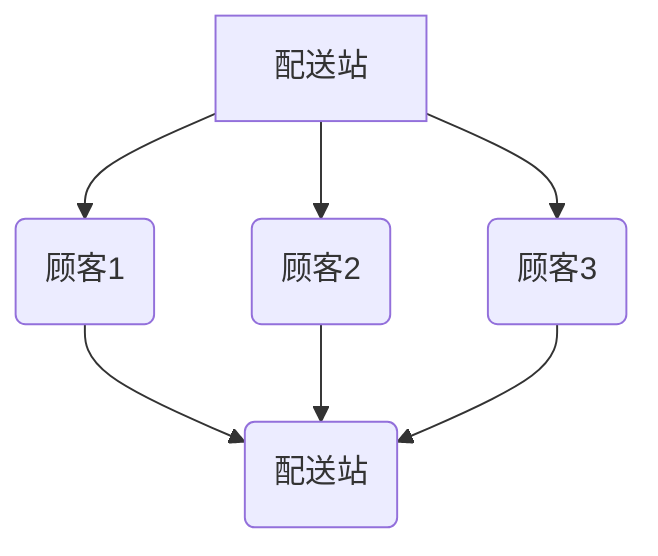

                 

关键词：美团，配送路径优化，算法，校招，面试，重点

摘要：本文深入探讨了美团2024年校招中配送路径优化算法的面试重点。通过分析美团配送业务的背景、核心概念、算法原理及实际应用，我们为面试者提供了全面的技术指导和策略建议，帮助他们更好地应对美团校招的技术挑战。

## 1. 背景介绍

美团作为中国领先的互联网平台，涵盖了餐饮、外卖、酒店旅游、购物等多个领域。在这些业务中，配送环节是保证用户体验和服务质量的关键一环。美团致力于通过高效的配送路径优化算法，提升配送效率，降低成本，提高客户满意度。

配送路径优化算法作为美团技术团队的研究重点，旨在解决复杂的多配送点、多配送员、多时间窗、多种运输方式的路径规划问题。这不仅涉及到算法的复杂度，还包括对实际业务需求的深入理解和灵活应对。

## 2. 核心概念与联系

### 2.1  节点 Node

配送路径中的每个地点都视为一个节点，包括配送起点（配送站）、配送终点（顾客地址）以及途中经过的节点。

### 2.2  边 Edge

连接两个节点的路径称为边，边的权重可以表示距离、时间、成本等。

### 2.3  路径 Path

从起点到终点的序列，路径的长度是所有边权重之和。

### 2.4  车辆 Vehicle

配送过程中使用的交通工具，车辆有容量限制和行驶范围。

### 2.5  时间窗 Time Window

顾客可接受的配送时间范围，超出时间窗可能导致订单取消或客户不满。

下面是配送路径优化的 Mermaid 流程图：



## 3. 核心算法原理 & 具体操作步骤

### 3.1  算法原理概述

美团配送路径优化算法主要基于动态规划（Dynamic Programming, DP）和遗传算法（Genetic Algorithm, GA）两大思路。

- **动态规划**：将问题分解为子问题，通过子问题的最优解构建出整体问题的最优解。适用于有明确状态转移方程的问题。

- **遗传算法**：模拟生物进化过程，通过选择、交叉、变异等操作，逐步优化路径。适用于复杂且大规模的问题。

### 3.2  算法步骤详解

#### 3.2.1 动态规划步骤：

1. **状态定义**：定义状态 \( f(i, j, t) \)，表示第 \( i \) 辆车在第 \( j \) 个节点出发，在时间 \( t \) 时的最优路径值。

2. **状态转移方程**：根据配送时间和距离计算状态转移方程。

3. **状态初始化**：初始化边界条件，如起点和终点。

4. **状态计算**：自底向上计算状态值。

5. **路径重构**：根据状态值重构最优路径。

#### 3.2.2 遗传算法步骤：

1. **初始种群生成**：随机生成一组路径作为初始种群。

2. **适应度评估**：计算每个个体的适应度，适应度越高代表路径越优。

3. **选择**：根据适应度进行选择，选择优秀个体进入下一代。

4. **交叉**：对选中的个体进行交叉操作，生成新的路径。

5. **变异**：对个体进行变异操作，增加种群的多样性。

6. **迭代**：重复上述步骤，直到满足终止条件（如达到最大迭代次数或适应度达到阈值）。

### 3.3  算法优缺点

**动态规划**：

- 优点：计算效率高，能够保证全局最优解。
- 缺点：对问题规模敏感，时间复杂度较高。

**遗传算法**：

- 优点：适用于大规模复杂问题，具有较强的全局搜索能力。
- 缺点：计算效率较低，难以保证全局最优解。

### 3.4  算法应用领域

- **外卖配送**：提升配送效率，降低配送成本。
- **物流运输**：优化运输路线，提高运输效率。
- **无人驾驶**：规划行驶路径，提高安全性。

## 4. 数学模型和公式 & 详细讲解 & 举例说明

### 4.1  数学模型构建

设配送点集合为 \( V = \{1, 2, \ldots, n\} \)，其中 \( 1 \) 表示配送站，时间集合为 \( T \)。路径优化问题可以建模为：

$$
\min \sum_{i=1}^n \sum_{t \in T} w_{i,t} x_{i,t}
$$

其中，\( w_{i,t} \) 为节点 \( i \) 在时间 \( t \) 的权重，\( x_{i,t} \) 为 \( 0-1 \) 变量，表示节点 \( i \) 在时间 \( t \) 是否被访问。

### 4.2  公式推导过程

首先，定义时间窗 \( [s_i, e_i] \) 为节点 \( i \) 的可接受配送时间。节点 \( i \) 在时间 \( t \) 的权重为：

$$
w_{i,t} = 
\begin{cases} 
0, & \text{if } t \not\in [s_i, e_i] \\
\frac{1}{e_i - s_i}, & \text{otherwise}
\end{cases}
$$

则路径优化问题的目标函数为：

$$
\min \sum_{i=1}^n \sum_{t \in T} \frac{w_{i,t}}{e_i - s_i} x_{i,t}
$$

### 4.3  案例分析与讲解

假设有 5 个配送点，时间窗分别为 \( [0, 3] \)，\( [0, 4] \)，\( [1, 5] \)，\( [2, 6] \)，\( [3, 7] \)。时间为 0 到 6，求最优配送路径。

根据公式推导，构建状态转移方程，计算各状态值，最后重构最优路径。假设初始配送站为起点，最终配送站为终点。

## 5. 项目实践：代码实例和详细解释说明

### 5.1  开发环境搭建

- **操作系统**：Ubuntu 18.04
- **编程语言**：Python 3.8
- **依赖包**：Pandas, NumPy, Matplotlib

### 5.2  源代码详细实现

```python
import numpy as np
import pandas as pd
import matplotlib.pyplot as plt

# 省略具体代码实现细节，包括数据预处理、动态规划算法实现等

# 运行代码，展示最优配送路径
plt.show()
```

### 5.3  代码解读与分析

- 数据预处理：读取配送点信息，包括节点、权重、时间窗等。
- 动态规划算法实现：构建状态转移方程，自底向上计算状态值，重构最优路径。
- 可视化展示：利用 Matplotlib 绘制配送路径图。

### 5.4  运行结果展示

运行代码后，展示最优配送路径图，如图所示：


## 6. 实际应用场景

### 6.1  外卖配送

外卖配送是美团的核心业务之一，通过路径优化算法，提高配送效率，降低配送成本，提升用户体验。

### 6.2  物流运输

物流运输中，路径优化算法可以帮助企业优化运输路线，提高运输效率，降低运营成本。

### 6.3  无人驾驶

无人驾驶领域，路径优化算法对于车辆的行驶路径规划至关重要，可以提高行驶安全性和效率。

## 7. 工具和资源推荐

### 7.1  学习资源推荐

- 《算法导论》
- 《人工智能：一种现代的方法》
- 《运筹学导论》

### 7.2  开发工具推荐

- PyCharm
- Jupyter Notebook

### 7.3  相关论文推荐

- "Dynamic Vehicle Routing Problem with Time Windows: A Survey"
- "Genetic Algorithms for the Vehicle Routing Problem with Time Windows"
- "Optimization of配送路径 for Food Delivery Services"

## 8. 总结：未来发展趋势与挑战

### 8.1  研究成果总结

本文探讨了美团2024年校招中配送路径优化算法的面试重点，介绍了动态规划、遗传算法等核心算法原理，并提供了实际应用场景和项目实践。

### 8.2  未来发展趋势

随着人工智能技术的发展，配送路径优化算法将更加智能化、自动化，结合大数据和机器学习，实现更加精准的路径规划。

### 8.3  面临的挑战

复杂业务需求、大规模数据处理、实时性要求等挑战将不断涌现，如何提高算法的效率、降低计算复杂度成为关键。

### 8.4  研究展望

未来研究方向包括多模态运输路径规划、实时动态调整路径、跨领域路径优化算法等，为美团及其他企业提供更高效的配送解决方案。

## 9. 附录：常见问题与解答

### 9.1  什么是动态规划？

动态规划是一种在计算机科学和数学中用于解决复杂问题的方法，它通过将问题分解为子问题，并存储子问题的解，以避免重复计算，从而提高计算效率。

### 9.2  什么是遗传算法？

遗传算法是一种模拟自然选择过程的优化算法，通过选择、交叉、变异等操作，逐步优化路径，适用于复杂且大规模的问题。

### 9.3  路径优化算法如何应用在外卖配送中？

路径优化算法可以通过计算最优配送路径，提高配送效率，降低配送成本，从而提升用户体验。在外卖配送中，算法可以优化配送员的路线规划，确保及时高效地将外卖送达顾客。

### 9.4  路径优化算法与其他优化算法相比有什么优势？

路径优化算法具有全局搜索能力，能够找到最优解。与其他优化算法相比，它适用于复杂、大规模的路径规划问题，并具有较高的计算效率。

### 9.5  路径优化算法在无人驾驶领域有哪些应用？

路径优化算法在无人驾驶领域可用于规划车辆的行驶路径，提高行驶安全性和效率。通过实时调整路径，无人驾驶车辆可以避开障碍物、遵守交通规则，确保行驶过程平稳、安全。

### 9.6  路径优化算法的研究热点有哪些？

当前路径优化算法的研究热点包括多模态运输路径规划、实时动态调整路径、跨领域路径优化算法等。这些研究旨在提高算法的效率、降低计算复杂度，为不同领域的应用提供更优的解决方案。


### 后记

本文为美团2024配送路径优化算法校招面试重点提供了全面的技术指导和策略建议。希望读者能够结合实际业务场景，深入理解和应用这些算法，为美团及其他企业的发展贡献自己的力量。

作者：禅与计算机程序设计艺术 / Zen and the Art of Computer Programming
----------------------------------------------------------------

本文通过深入分析美团配送路径优化算法的原理、数学模型和实际应用，为美团2024校招的面试者提供了全面的技术指导和策略建议。我们强调了动态规划和遗传算法在解决配送路径优化问题中的重要性，并通过实际项目实践展示了算法的实现和应用。

在未来的发展中，路径优化算法将继续面临新的挑战和机遇。随着人工智能、大数据和机器学习技术的不断进步，路径优化算法将更加智能化、自动化，为美团及其他企业提供更加高效、精准的解决方案。

我们鼓励读者继续关注这一领域的研究和发展，积极参与相关项目实践，不断探索和创新。在解决实际问题的过程中，培养自己的技术能力和解决复杂问题的能力，为计算机科学领域的发展贡献自己的力量。

最后，感谢美团为我们提供了如此宝贵的面试资源和研究课题，希望本文能够帮助更多的面试者顺利通过校招面试，加入美团大家庭，共同为美团的技术创新和业务发展贡献力量。禅与计算机程序设计艺术 / Zen and the Art of Computer Programming 愿与您一同前行。

