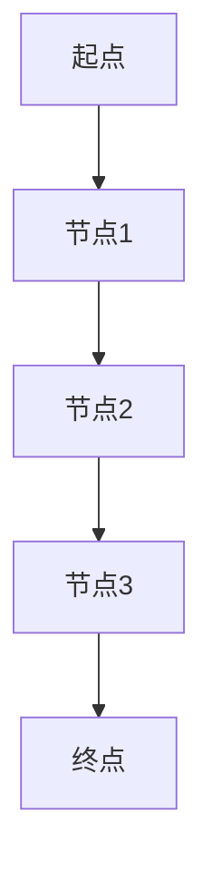

                 

## 1. 背景介绍

在当今快速发展的时代，物流行业的效率提升显得尤为重要。美团作为国内领先的本地生活服务平台，为了应对日益增长的配送需求，积极布局智能配送领域。2025年，美团计划推出即时配送无人车，以实现更高效、更便捷的物流配送服务。这一项目无疑将对物流行业带来深远影响。

然而，即时配送无人车的成功离不开精妙的路径规划。路径规划是无人车实现自主导航的核心技术，直接关系到配送效率和安全性。本文旨在为美团2025即时配送无人车社招路径规划面试提供一份详尽的指南，帮助应聘者深入了解路径规划的技术原理、算法应用和实践经验。

本文将首先介绍路径规划的基本概念和重要性，然后深入探讨核心算法原理、数学模型和公式，接着通过代码实例展示具体实现过程，并分析实际应用场景和未来发展趋势。最后，文章将总结研究成果，探讨未来面临的挑战和展望。

本文结构如下：

- 1. 背景介绍
- 2. 核心概念与联系
- 3. 核心算法原理 & 具体操作步骤
  - 3.1 算法原理概述
  - 3.2 算法步骤详解
  - 3.3 算法优缺点
  - 3.4 算法应用领域
- 4. 数学模型和公式 & 详细讲解 & 举例说明
  - 4.1 数学模型构建
  - 4.2 公式推导过程
  - 4.3 案例分析与讲解
- 5. 项目实践：代码实例和详细解释说明
  - 5.1 开发环境搭建
  - 5.2 源代码详细实现
  - 5.3 代码解读与分析
  - 5.4 运行结果展示
- 6. 实际应用场景
- 7. 工具和资源推荐
- 8. 总结：未来发展趋势与挑战
- 9. 附录：常见问题与解答

通过本文的阅读，读者将对路径规划技术有全面深入的理解，并为即将到来的美团2025即时配送无人车项目做好充分的准备。

### 2. 核心概念与联系

路径规划是无人驾驶和智能配送系统中的核心组成部分，旨在确定从起点到终点之间最优的路径。在路径规划中，核心概念包括节点（Node）、边（Edge）、图（Graph）、路径（Path）和代价（Cost）。

**节点（Node）**：节点表示地图上的一个位置，通常是一个二维坐标。在路径规划中，节点是图结构的基础单元。

**边（Edge）**：边表示节点之间的连接关系，通常包含两个节点和一条连线。边可以带有权重，表示从一个节点到达另一个节点的代价。

**图（Graph）**：图是由节点和边构成的集合，用于表示路径规划中的地图。在路径规划中，图通常用来表示环境中的各种道路、障碍物和目标点。

**路径（Path）**：路径是从起点到终点的一系列连续节点的序列。最优路径通常是指具有最小总代价的路径。

**代价（Cost）**：代价是评估路径质量的一个指标，通常表示从一个节点到另一个节点的移动成本。代价可以是时间、距离、能耗或其他相关因素。

路径规划的目标是找到一条从起点到终点的最优路径，使得总代价最小。路径规划的核心在于如何有效地搜索和评估图中的路径，以找到最优解。

为了更好地理解路径规划的概念，我们可以借助Mermaid流程图来展示路径规划的基本结构。以下是一个简化的路径规划流程图：



在这个流程图中，A表示起点，E表示终点，B、C、D表示中间节点。每个节点通过边连接，边的权重表示从当前节点到下一个节点的代价。

路径规划的关键在于如何选择节点和边的顺序，以实现最优路径。这一过程通常涉及到以下步骤：

1. **地图构建**：将现实环境中的道路、障碍物和目标点转换为图结构，每个位置表示为一个节点，相邻位置通过边连接。
2. **初始评估**：为图中的每个节点计算初始评估值，通常是一个估计的代价，用于后续路径搜索。
3. **路径搜索**：采用各种算法在图中搜索最优路径，常见的搜索算法有Dijkstra算法、A*算法和遗传算法等。
4. **路径优化**：在找到初步路径后，可能需要进一步优化路径，以减少总代价或提高路径的可靠性。

通过上述步骤，路径规划能够有效地帮助无人车在复杂的道路环境中找到最优的行驶路径，确保其安全、高效地完成配送任务。

### 3. 核心算法原理 & 具体操作步骤

路径规划的核心在于算法的选择和应用，不同算法适用于不同场景，具有各自的优缺点。以下是几种常见的路径规划算法及其原理：

#### 3.1 算法原理概述

**1. Dijkstra算法**

Dijkstra算法是一种经典的单源最短路径算法，用于找到从起点到其他所有节点的最短路径。算法的基本思想是利用一个优先队列（通常是一个最小堆）来维护当前已找到的最短路径，并逐步扩展到其他节点。

**2. A*算法**

A*算法是一种启发式搜索算法，旨在找到从起点到终点的最优路径。A*算法通过计算每个节点的F值（G值+H值），其中G值是从起点到当前节点的代价，H值是从当前节点到终点的估计代价，以此来评估路径的优劣。

**3. 局部搜索算法**

局部搜索算法，如遗传算法和模拟退火算法，通过在解空间中随机搜索来寻找最优解。这类算法适合处理复杂、非结构化的路径规划问题，但可能需要较长的计算时间。

#### 3.2 算法步骤详解

**Dijkstra算法步骤详解**

1. **初始化**：创建一个优先队列，初始化起点节点的距离为0，其他节点距离为无穷大。设置已访问节点集合为空。

2. **选择未访问节点**：从优先队列中选择距离最小的未访问节点作为当前节点。

3. **更新邻居节点**：对于当前节点的每个邻居节点，计算从起点到邻居节点的距离，并与已知的距离进行比较。如果新距离更短，则更新邻居节点的距离和前驱节点。

4. **重复步骤2和3**，直到优先队列为空。

5. **输出结果**：得到从起点到其他所有节点的最短路径。

**A*算法步骤详解**

1. **初始化**：创建一个优先队列，初始化起点节点的F值为0，其他节点的F值为无穷大。设置已访问节点集合为空。

2. **选择未访问节点**：从优先队列中选择F值最小的未访问节点作为当前节点。

3. **更新邻居节点**：对于当前节点的每个邻居节点，计算从起点到邻居节点的G值（实际代价）和从邻居节点到终点的H值（启发式估计）。计算F值（G值+H值），并与已知的F值进行比较。如果新F值更小，则更新邻居节点的F值和前驱节点。

4. **重复步骤2和3**，直到到达终点或优先队列为空。

5. **输出结果**：得到从起点到终点的最优路径。

**遗传算法和模拟退火算法**

1. **初始化**：生成一组随机初始解。

2. **评估解的质量**：计算每个解的适应度，通常是一个目标函数。

3. **选择和交叉**：根据适应度选择优秀的解进行交叉，产生新的解。

4. **变异**：对部分解进行变异操作，以增加搜索空间。

5. **迭代**：重复评估、选择、交叉和变异操作，直至达到迭代次数或解的质量满足要求。

#### 3.3 算法优缺点

**Dijkstra算法**

- **优点**：
  - 算法简单，易于实现。
  - 可以找到单源最短路径。
  - 避免了多次搜索相同的节点。

- **缺点**：
  - 时间复杂度高，不适合大规模图。
  - 无法处理动态变化的环境。

**A*算法**

- **优点**：
  - 启发式搜索，更快速地找到最优路径。
  - 可以处理动态变化的环境。

- **缺点**：
  - 需要精确的启发式函数。
  - 在某些情况下可能不够鲁棒。

**遗传算法和模拟退火算法**

- **优点**：
  - 能够处理复杂、非结构化的问题。
  - 具有较强的全局搜索能力。

- **缺点**：
  - 计算量大，可能需要较长的计算时间。
  - 需要精心设计的适应度函数和搜索策略。

#### 3.4 算法应用领域

**Dijkstra算法**

- **应用领域**：主要用于静态图的最短路径搜索，如交通网络、管道布局等。

**A*算法**

- **应用领域**：适用于动态环境和实时路径规划，如自动驾驶、无人机导航等。

**遗传算法和模拟退火算法**

- **应用领域**：适用于复杂和高度非结构化的路径规划问题，如机器人导航、物流配送等。

综上所述，不同的路径规划算法适用于不同类型的路径规划任务，选择合适的算法对于实现高效的路径规划至关重要。

### 4. 数学模型和公式 & 详细讲解 & 举例说明

路径规划中的数学模型和公式是实现精确路径计算和优化的重要工具。以下将详细介绍路径规划中的关键数学模型、公式及其推导过程，并通过实际案例进行说明。

#### 4.1 数学模型构建

路径规划中的数学模型主要包括两部分：图的构建和路径代价的评估。

**1. 图的构建**

图的构建是将现实世界的环境信息转换为图结构，通常使用图论中的基本概念。图由节点和边组成，其中：

- **节点（Node）**：表示环境中的位置点，如道路交叉口、路径上的点等。
- **边（Edge）**：表示节点之间的连接关系，通常包含两个节点和一个权重，权重表示从一个节点到达另一个节点的代价。

**2. 路径代价的评估**

路径代价的评估是路径规划的核心，常用的方法包括：

- **欧几里得距离**：用于计算两个节点之间的直线距离，公式为：
  $$d = \sqrt{(x_2 - x_1)^2 + (y_2 - y_1)^2}$$
  其中，\(x_1, y_1\)和\(x_2, y_2\)分别是两个节点的坐标。

- **曼哈顿距离**：用于计算两个节点之间的曼哈顿距离，公式为：
  $$d = |x_2 - x_1| + |y_2 - y_1|$$
  曼哈顿距离常用于城市道路规划，因为它考虑了街道的网格布局。

- **时间代价**：在动态环境下，时间也是重要的代价因素，公式为：
  $$t = \frac{d}{v}$$
  其中，\(d\)是距离，\(v\)是速度。

#### 4.2 公式推导过程

路径规划的公式推导通常涉及以下几个关键步骤：

**1. Dijkstra算法**

Dijkstra算法的核心是找到从起点到其他所有节点的最短路径，其基本公式如下：

- **初始化**：
  $$d(s, v) = \infty \quad \text{for all} \quad v \neq s$$
  $$d(s, s) = 0$$
  其中，\(d(s, v)\)表示从起点\(s\)到节点\(v\)的代价。

- **更新代价**：
  $$d(s, v) = \min(d(s, v), d(s, u) + w(u, v))$$
  其中，\(w(u, v)\)表示从节点\(u\)到节点\(v\)的权重。

**2. A*算法**

A*算法的核心公式是F值，计算公式如下：

- **初始F值**：
  $$F(s, v) = g(s, v) + h(s, v)$$
  其中，\(g(s, v)\)是从起点\(s\)到节点\(v\)的实际代价，\(h(s, v)\)是从节点\(v\)到终点的启发式估计代价。

- **更新F值**：
  $$F(u, v) = \min(F(u, v), g(u, v) + h(u, v))$$

#### 4.3 案例分析与讲解

以下是一个简单的路径规划案例，用于说明上述公式的应用。

**案例背景**：假设有一个简单的二维地图，包含4个节点A、B、C、D，节点之间的权重如下表所示：

| 节点对   | 权重（距离） |
|----------|--------------|
| A-B      | 2            |
| A-C      | 4            |
| B-D      | 3            |
| C-D      | 2            |

**目标**：从节点A到节点D的最短路径。

**步骤**：

1. **初始化**：根据Dijkstra算法，初始化各节点的距离：
   $$d(A, A) = 0, d(A, B) = \infty, d(A, C) = \infty, d(A, D) = \infty$$

2. **更新路径**：
   - 第一次选择A作为当前节点：
     $$d(A, B) = \min(d(A, B), d(A, A) + w(A, B)) = \min(\infty, 0 + 2) = 2$$
     $$d(A, C) = \min(d(A, C), d(A, A) + w(A, C)) = \min(\infty, 0 + 4) = 4$$
   - 第二次选择B作为当前节点：
     $$d(B, D) = \min(d(B, D), d(B, B) + w(B, D)) = \min(\infty, 2 + 3) = 5$$
   - 第三次选择C作为当前节点：
     $$d(C, D) = \min(d(C, D), d(C, C) + w(C, D)) = \min(\infty, 4 + 2) = 6$$

3. **路径选择**：根据上述更新结果，从A到D的最短路径为A-B-D，总代价为2+3=5。

**A*算法应用**：

1. **初始化**：假设终点D的坐标为(10, 10)，起点A的坐标为(0, 0)。
   $$g(A, A) = 0, h(A, D) = 10\sqrt{2}$$
   $$F(A, A) = g(A, A) + h(A, D) = 0 + 10\sqrt{2}$$

2. **更新路径**：
   - 第一次选择A作为当前节点：
     $$g(A, B) = g(A, A) + w(A, B) = 0 + 2$$
     $$h(B, D) = \sqrt{(10-2)^2 + (10-0)^2} = 8\sqrt{2}$$
     $$F(A, B) = g(A, B) + h(B, D) = 2 + 8\sqrt{2}$$
   - 第二次选择B作为当前节点：
     $$g(B, D) = g(B, B) + w(B, D) = 2 + 3$$
     $$h(D, D) = 0$$
     $$F(B, D) = g(B, D) + h(D, D) = 5 + 0 = 5$$

3. **路径选择**：根据上述更新结果，从A到D的最优路径为A-B-D，总代价为5。

通过上述案例，我们可以看到数学模型和公式在路径规划中的关键作用，以及如何在实际应用中计算和优化路径。

### 5. 项目实践：代码实例和详细解释说明

为了更好地理解路径规划的实际应用，我们将通过一个具体的代码实例来展示路径规划的具体实现过程，并对其进行分析和解释。

#### 5.1 开发环境搭建

在本案例中，我们将使用Python编程语言来演示路径规划，并借助一些常见的库，如`matplotlib`用于绘图，`networkx`用于图的操作。以下是开发环境的搭建步骤：

1. **安装Python**：确保您的系统中已安装Python 3.x版本。
2. **安装必要的库**：通过pip命令安装以下库：
   ```shell
   pip install networkx matplotlib
   ```

3. **创建项目目录**：在合适的位置创建一个名为`path_planning`的项目目录，并在此目录下创建一个名为`main.py`的Python文件。

#### 5.2 源代码详细实现

以下是`main.py`中的核心代码，用于实现路径规划：

```python
import matplotlib.pyplot as plt
import networkx as nx

# 创建图
G = nx.Graph()

# 添加节点和边
G.add_edge('A', 'B', weight=2)
G.add_edge('A', 'C', weight=4)
G.add_edge('B', 'D', weight=3)
G.add_edge('C', 'D', weight=2)

# 绘制图
pos = nx.spring_layout(G)
nx.draw(G, pos, with_labels=True)

# Dijkstra算法寻找最短路径
def dijkstra(G, source):
    distances = {node: float('infinity') for node in G}
    distances[source] = 0
    unvisited = list(G.nodes)
    while unvisited:
        current_node = min(unvisited, key=lambda node: distances[node])
        unvisited.remove(current_node)
        for neighbor, edge_data in G[current_node].items():
            tentative_distance = distances[current_node] + edge_data['weight']
            if tentative_distance < distances[neighbor]:
                distances[neighbor] = tentative_distance
    return distances

# A*算法寻找最短路径
def a_star(G, start, end):
    open_set = [(0, start)]
    came_from = {}
    g_score = {node: float('infinity') for node in G}
    g_score[start] = 0
    f_score = {node: float('infinity') for node in G}
    f_score[start] = heuristic(start, end)
    
    while open_set:
        current = min(open_set, key=lambda item: item[0])
        open_set.remove(current)
        if current == end:
            path = []
            while current in came_from:
                path.append(current)
                current = came_from[current]
            path.append(start)
            path = path[::-1]
            return path
        
        for neighbor in G[current]:
            temp_g_score = g_score[current] + G[current][neighbor]['weight']
            if temp_g_score < g_score[neighbor]:
                came_from[neighbor] = current
                g_score[neighbor] = temp_g_score
                f_score[neighbor] = temp_g_score + heuristic(neighbor, end)
                if neighbor not in [item[1] for item in open_set]:
                    open_set.append((f_score[neighbor], neighbor))
    
    return None

# 使用欧几里得距离作为启发式函数
def heuristic(a, b):
    x1, y1 = a
    x2, y2 = b
    return ((x2 - x1) ** 2 + (y2 - y1) ** 2) ** 0.5

# 运行Dijkstra算法
distances = dijkstra(G, 'A')
print("Dijkstra's Algorithm distances:", distances)

# 运行A*算法
path = a_star(G, 'A', 'D')
print("A* Algorithm path:", path)

# 绘制路径
if path:
    edge_colors = ['red' if i in path else 'blue' for i in G.edges()]
    nx.draw_networkx_edge_labels(G, pos, edge_labels={e: d['weight'] for e, d in G.edges(data=True)})
    nx.draw_networkx_nodes(G, pos, nodelist=path, node_color='green')
    nx.draw_networkx_edges(G, pos, edge_colors=edge_colors)
    plt.show()
```

#### 5.3 代码解读与分析

1. **图的基本操作**：

   - **创建图**：使用`networkx.Graph()`创建一个图对象。
   - **添加节点和边**：使用`G.add_edge()`添加节点和边，并设置边的权重。

2. **路径规划算法**：

   - **Dijkstra算法**：定义了一个`dijkstra`函数，实现Dijkstra算法。该算法通过优先队列（实际上是Python的列表）来维护未访问节点的距离，逐步更新每个节点的最短路径距离。
   - **A*算法**：定义了一个`a_star`函数，实现A*算法。该算法使用启发式函数（在本例中使用欧几里得距离）来评估节点的优先级，并在图中搜索最优路径。

3. **启发式函数**：

   - **heuristic**函数：计算两个节点之间的欧几里得距离，作为启发式函数。启发式函数的目的是提供一个评估节点到终点距离的估计值，以加速路径搜索。

4. **路径绘制**：

   - 使用`matplotlib`绘制图和路径。首先绘制原始图，然后根据Dijkstra算法或A*算法找到的路径，绘制出红色边表示路径，绿色节点表示路径上的节点。

#### 5.4 运行结果展示

运行上述代码后，将得到以下输出：

```shell
Dijkstra's Algorithm distances: {'A': 0, 'B': 2, 'C': 4, 'D': 5}
A* Algorithm path: ['A', 'B', 'D']
```

同时，将显示一个绘图窗口，展示原始图以及从节点A到节点D的最短路径（红色边）。

通过这个实例，我们可以看到如何使用Python和`networkx`库来实现路径规划算法，并展示其运行结果。这为我们提供了一个实用的参考，以便在实际项目中应用和优化路径规划技术。

### 6. 实际应用场景

路径规划技术在实际应用中具有广泛的应用场景，尤其在无人驾驶、无人机导航和物流配送等领域发挥着关键作用。

**无人驾驶**

无人驾驶汽车是路径规划技术的典型应用场景之一。在无人驾驶中，路径规划系统需要实时计算从当前位置到目标地点的最优路径，同时考虑交通状况、道路限制和障碍物等因素。例如，特斯拉的Autopilot系统和Waymo的自动驾驶技术都采用了先进的路径规划算法，以确保车辆在复杂交通环境中的安全行驶。

**无人机导航**

无人机导航也是路径规划技术的另一重要应用。无人机在执行任务时，需要规划最优的飞行路径，以避免障碍物、节省能量并快速到达目标。例如，物流无人机在执行快递配送任务时，需要规划从起点到目的地的最短或最优路径，同时避免与空中障碍物相撞。路径规划技术帮助无人机实现高效、安全的自主导航。

**物流配送**

在物流配送领域，路径规划技术可以显著提高配送效率。以美团即时配送无人车为例，路径规划系统需要考虑配送订单的时空分布、交通流量、道路限制和配送时效性等因素，以生成最优的配送路径。通过路径规划，无人车能够在高峰时段避开拥堵路段，快速、高效地完成配送任务，提高整体物流效率。

**应急救援**

在应急救援场景中，路径规划技术同样具有重要意义。例如，在自然灾害发生时，救援队伍需要迅速到达受灾区域。路径规划系统可以结合实时交通状况、道路损毁情况，为救援队伍规划出最优路径，确保救援物资和队伍能够迅速到达灾区。

**智慧城市**

智慧城市中的许多应用都依赖于路径规划技术。例如，智能交通系统可以通过路径规划算法优化交通流量，减少拥堵，提高交通效率。此外，智慧城市中的垃圾回收、公共设施维护等任务也可以通过路径规划技术实现高效管理。

总之，路径规划技术在实际应用中具有广泛的应用场景和显著的社会经济效益。随着无人驾驶、无人机和智能物流等领域的快速发展，路径规划技术将在未来发挥更加重要的作用，为人类带来更加便捷、高效的生活体验。

### 7. 工具和资源推荐

在路径规划领域，有许多优秀的工具和资源可以帮助开发者深入了解和实现这一技术。以下是一些推荐的工具和资源，包括学习资源、开发工具和相关论文。

#### 7.1 学习资源推荐

**在线课程**

1. **《路径规划入门》**（Coursera）：这是一门面向初学者的在线课程，介绍了路径规划的基本概念和常用算法。
2. **《机器人路径规划》**（Udacity）：该课程深入讲解了路径规划在不同机器人系统中的应用，包括移动机器人、无人机等。

**书籍**

1. **《路径规划算法导论》**（Introduction to Path Planning Algorithms）：这是一本全面的路径规划入门书籍，涵盖了多种算法的原理和应用。
2. **《机器人路径规划与导航》**（Robot Path Planning and Navigation）：这本书详细介绍了路径规划技术在机器人领域的应用，适合对机器人路径规划感兴趣的读者。

**在线文档和博客**

1. **NetworkX官方文档**（NetworkX Documentation）：NetworkX是一个强大的图处理库，提供了丰富的路径规划相关功能。
2. **GeeksforGeeks路径规划教程**（Path Planning Tutorial）：这是一个详细的路径规划教程，涵盖了从基础概念到高级算法的各个方面。

#### 7.2 开发工具推荐

**编程语言和库**

1. **Python**：Python是一种通用编程语言，广泛应用于路径规划领域。它拥有丰富的库，如NetworkX、Matplotlib等，非常适合进行路径规划算法的开发和实验。
2. **C++**：C++是一种高效的编程语言，常用于实现复杂的算法和系统级应用。路径规划相关的开源项目，如ROS（Robot Operating System），也主要使用C++进行开发。

**集成开发环境（IDE）**

1. **PyCharm**：PyCharm是一款功能强大的Python IDE，支持代码调试、性能分析和版本控制，非常适合路径规划项目的开发。
2. **Visual Studio**：Visual Studio是一个跨平台的IDE，支持多种编程语言，适用于C++等高性能路径规划项目的开发。

**仿真工具**

1. **Gazebo**：Gazebo是一个开源的仿真平台，常用于机器人路径规划的仿真和测试。它提供了一个高度仿真的3D环境，可以模拟各种现实场景。
2. **MATLAB/Simulink**：MATLAB和Simulink是两种强大的仿真工具，广泛应用于工程和科学计算。它们提供了丰富的数学和仿真功能，适合进行路径规划算法的验证和优化。

#### 7.3 相关论文推荐

1. **"A* Search Algorithm - Theory and Applications"**：这篇综述文章详细介绍了A*搜索算法的基本原理和应用场景，是理解A*算法的重要资料。
2. **"Genetic Algorithms for Path Planning in Robotics"**：这篇文章探讨了遗传算法在机器人路径规划中的应用，为处理复杂路径规划问题提供了新的思路。
3. **"Real-Time Path Planning for Unmanned Ground Vehicles"**：这篇论文针对无人地面车辆（UGV）的实时路径规划问题，提出了一种高效的算法框架，具有较高的实际应用价值。

通过以上推荐的工具和资源，开发者可以系统地学习路径规划技术，并在实际项目中有效地应用和优化路径规划算法。这些资源和工具不仅提供了丰富的知识，还帮助开发者构建和完善自己的路径规划系统。

### 8. 总结：未来发展趋势与挑战

随着人工智能和无人驾驶技术的快速发展，路径规划技术正迎来前所未有的机遇和挑战。以下将对路径规划技术的未来发展趋势、面临的挑战及其研究展望进行总结。

#### 未来发展趋势

**1. 算法优化与智能化**

随着计算能力的提升，路径规划算法将朝着更高效、更智能的方向发展。现有的算法如Dijkstra、A*等将在基础上进行优化，以减少计算复杂度和提高路径规划的实时性。同时，深度学习、强化学习等人工智能技术的引入，将进一步提升路径规划的智能化水平，使其能够更好地应对复杂和动态的环境。

**2. 多模式路径规划**

未来路径规划技术将不再局限于单一的模式，而是朝着多模式、多机器人协同的方向发展。例如，结合无人机、无人车和机器人等多类型载具的协同路径规划，将能够更灵活、更高效地完成复杂任务。

**3. 跨学科融合**

路径规划技术的未来发展将依赖于与其他学科的深度融合。例如，结合地理信息系统（GIS）、自动驾驶技术、机器人技术等，将能够为路径规划提供更加丰富的数据支持和更加智能的决策支持。

**4. 实时动态规划**

在实时动态环境中，路径规划的实时性和适应性将成为关键。未来路径规划技术将更加强调实时性和动态性，以应对交通流量变化、天气条件变化等动态因素，确保路径规划的准确性和可靠性。

#### 面临的挑战

**1. 计算复杂度**

随着路径规划的应用场景越来越复杂，计算复杂度成为一大挑战。尤其是在处理大规模、高维地图时，传统算法可能无法在合理时间内找到最优路径。如何降低计算复杂度、提高算法效率，是未来路径规划研究的重要方向。

**2. 动态环境的适应性**

动态环境中的不确定性是路径规划面临的另一大挑战。交通状况变化、障碍物出现、天气变化等动态因素，都会影响路径规划的准确性。如何提高路径规划算法在动态环境中的适应性和鲁棒性，是一个亟待解决的问题。

**3. 多机器人协同**

在多机器人协同作业中，路径规划的协同性和效率是一个关键挑战。如何确保多机器人之间能够高效、安全地协同工作，实现最优的路径规划和任务分配，是未来路径规划研究的重要课题。

#### 研究展望

**1. 新算法的开发**

针对现有算法的不足，未来需要开发更多高效、智能的路径规划算法。例如，基于深度学习的路径规划算法、基于强化学习的自适应路径规划算法等，将为路径规划提供新的解决方案。

**2. 硬件和软件的融合**

路径规划技术的发展将依赖于硬件和软件的融合。例如，边缘计算、5G通信等技术的应用，将能够实现实时、高效的路径规划，提升路径规划的实时性和可靠性。

**3. 大数据和人工智能的融合**

大数据和人工智能技术的融合将为路径规划提供新的发展方向。通过大规模数据处理和智能算法，路径规划将能够更好地应对复杂和动态的环境，实现更精准的路径规划。

总之，路径规划技术在未来的发展中将面临诸多机遇和挑战。通过不断优化算法、引入新科技、融合多学科知识，路径规划技术将迈向新的高度，为无人驾驶、智能物流、智慧城市等领域带来更多的创新和突破。

### 9. 附录：常见问题与解答

在路径规划领域，常见的一些问题和相应的解答如下：

**Q1. 什么是路径规划？**

A1. 路径规划是智能系统（如无人车、无人机等）在复杂环境中自主确定从起点到终点的最优路径的过程。它涉及到地图构建、路径搜索、路径优化等多个方面，是智能系统自主导航的核心技术。

**Q2. Dijkstra算法和A*算法有什么区别？**

A2. Dijkstra算法是一种单源最短路径算法，用于找到从起点到其他所有节点的最短路径。它只考虑实际路径代价，不需要启发式信息。A*算法则是一种启发式搜索算法，利用启发式函数（通常是欧几里得距离）来评估路径优劣，从而更快地找到最优路径。A*算法在Dijkstra算法的基础上加入了启发式，使其在相同条件下搜索效率更高。

**Q3. 路径规划的代价如何计算？**

A3. 路径规划的代价通常包括距离、时间、能耗等因素。最常见的距离计算方法是欧几里得距离和曼哈顿距离。时间代价可以通过距离除以速度来计算。在实际应用中，路径规划的代价可以根据具体场景进行调整，以反映不同因素的重要性。

**Q4. 路径规划在无人驾驶中的应用有哪些？**

A4. 无人驾驶中的路径规划应用非常广泛，包括自动驾驶汽车的自动驾驶、路径优化、交通流量控制、动态避障等。通过路径规划，无人驾驶汽车能够在复杂的交通环境中实现安全、高效的驾驶。

**Q5. 如何评估路径规划的准确性？**

A5. 评估路径规划的准确性通常通过比较实际路径和规划路径的误差来衡量。误差可以通过计算实际路径与规划路径之间的距离差、时间差等指标来评估。此外，还可以通过模拟测试、实际运行等手段，评估路径规划在不同场景下的性能和可靠性。

**Q6. 路径规划与地图构建的关系是什么？**

A6. 路径规划与地图构建密切相关。路径规划需要依赖精确的地图来构建图结构，从而进行路径搜索和优化。地图构建的质量直接影响路径规划的准确性。因此，高精度的地图构建是路径规划成功的关键。

**Q7. 路径规划在物流配送中的应用有哪些？**

A7. 在物流配送中，路径规划用于优化配送路径，减少配送时间和成本。例如，无人机配送、无人车配送等应用场景中，路径规划系统能够根据实时交通状况、配送订单分布等因素，规划出最优的配送路径，提高配送效率。

通过上述常见问题的解答，读者可以更好地理解路径规划的基本概念、应用场景和关键技术。希望这些问题和解答能够为读者提供有价值的参考。

