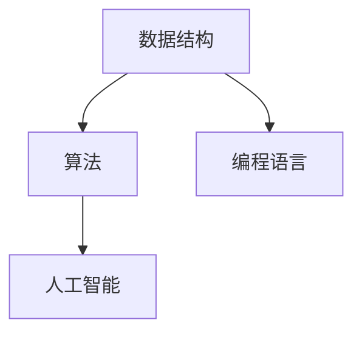

                 

随着人工智能和大数据技术的不断发展，美团打车作为我国领先的生活服务电商平台，对人才的要求也越来越高。为了更好地帮助2024届求职者备战美团打车校招面试，本文将对2024美团打车校招面试真题进行汇总，并给出相应的解答。

## 文章关键词

- 美团打车
- 校招面试
- 面试题解答
- 数据结构与算法
- 编程语言
- 人工智能

## 文章摘要

本文旨在为2024届求职者提供美团打车校招面试真题汇总及解答，帮助大家更好地了解面试内容，提高面试通过率。本文将分为以下几个部分：背景介绍、核心概念与联系、核心算法原理与具体操作步骤、数学模型与公式、项目实践、实际应用场景、未来应用展望、工具和资源推荐、总结与展望、附录：常见问题与解答。

## 1. 背景介绍

美团打车成立于2012年，是我国领先的生活服务电商平台。随着业务的发展，美团打车对人才的需求也日益增加。2024年美团打车校招面试涉及多个领域，包括数据结构与算法、编程语言、人工智能等。面试题类型包括选择题、填空题、编程题、算法设计题等。

### 1.1 美团打车校招面试时间

2024年美团打车校招面试主要分为两个阶段：线上笔试和线下面试。线上笔试通常在每年的11月至次年1月进行，而线下面试则在次年2月至4月进行。具体面试时间以官方通知为准。

### 1.2 美团打车校招面试流程

美团打车校招面试流程一般包括以下几个阶段：

1. 网上报名：通过美团打车官网或第三方招聘平台进行报名。
2. 线上笔试：主要考察应聘者的编程能力和算法水平。
3. 线下面试：包括技术面试、HR面试等多个环节。
4. 面试结果公布：通过面试后，将收到美团打车的offer。

## 2. 核心概念与联系

在美团打车校招面试中，核心概念与联系主要包括数据结构与算法、编程语言和人工智能。以下是一个简单的 Mermaid 流程图，展示这些概念之间的联系。



### 2.1 数据结构与算法

数据结构是计算机存储数据的方式，包括线性结构（如数组、链表、栈、队列）和非线性结构（如树、图）。算法则是解决特定问题的步骤和策略。在美团打车校招面试中，常见的算法包括排序、查找、动态规划等。

### 2.2 编程语言

编程语言是编写计算机程序的语法和规则。在美团打车校招面试中，常用的编程语言包括 C++、Java、Python 等。每种编程语言都有其特点和适用场景。

### 2.3 人工智能

人工智能是指模拟、延伸和扩展人的智能的理论、方法、技术及应用。在美团打车校招面试中，人工智能相关的问题主要涉及机器学习、深度学习等方向。

## 3. 核心算法原理 & 具体操作步骤

### 3.1 算法原理概述

在美团打车校招面试中，算法原理主要包括以下几种：

1. 排序算法：冒泡排序、选择排序、插入排序、快速排序等。
2. 查找算法：二分查找、顺序查找等。
3. 动态规划：斐波那契数列、背包问题等。
4. 图算法：最短路径算法、最小生成树算法等。

### 3.2 算法步骤详解

以下以冒泡排序为例，介绍算法步骤：

1. 从第一个元素开始，相邻两个元素进行比较，如果第一个元素大于第二个元素，则交换它们的位置。
2. 重复上述步骤，直到当前序列中不存在需要交换的元素。
3. 重复以上步骤，直到整个序列有序。

### 3.3 算法优缺点

1. 冒泡排序的优点是简单易懂，实现简单。
2. 冒泡排序的缺点是效率较低，适合数据量较小的场景。

### 3.4 算法应用领域

冒泡排序适用于需要简单排序的场景，如数据量较小的小规模数据处理。

## 4. 数学模型和公式 & 详细讲解 & 举例说明

### 4.1 数学模型构建

在美团打车校招面试中，常见的数学模型包括线性回归、逻辑回归等。

### 4.2 公式推导过程

以下以线性回归为例，介绍公式推导过程：

1. 假设目标变量 \( y \) 与自变量 \( x \) 存在线性关系：\( y = \beta_0 + \beta_1 x + \epsilon \)
2. 定义损失函数：\( J(\theta) = \frac{1}{2m} \sum_{i=1}^{m} (h_\theta(x^{(i)}) - y^{(i)})^2 \)
3. 对损失函数求偏导数，得到：\( \frac{\partial J(\theta)}{\partial \theta_0} = \frac{1}{m} \sum_{i=1}^{m} (h_\theta(x^{(i)}) - y^{(i)}) \)
4. 对 \( \theta_1 \) 求偏导数，得到：\( \frac{\partial J(\theta)}{\partial \theta_1} = \frac{1}{m} \sum_{i=1}^{m} (h_\theta(x^{(i)}) - y^{(i)}) x^{(i)} \)

### 4.3 案例分析与讲解

假设我们有以下数据集：

| x | y |
|---|---|
| 1 | 2 |
| 2 | 4 |
| 3 | 6 |

我们要用线性回归模型预测 \( y \) 值。

1. 计算平均值：\( \bar{x} = \frac{1+2+3}{3} = 2 \)，\( \bar{y} = \frac{2+4+6}{3} = 4 \)
2. 计算斜率 \( \beta_1 \)：\( \beta_1 = \frac{\sum_{i=1}^{3} (x_i - \bar{x})(y_i - \bar{y})}{\sum_{i=1}^{3} (x_i - \bar{x})^2} \)
3. 计算截距 \( \beta_0 \)：\( \beta_0 = \bar{y} - \beta_1 \bar{x} \)

代入数据计算得到 \( \beta_1 = 2 \)，\( \beta_0 = 0 \)。因此，线性回归模型为 \( y = 2x \)。

## 5. 项目实践：代码实例和详细解释说明

### 5.1 开发环境搭建

在开始项目实践前，我们需要搭建一个开发环境。以下以 Python 为例，介绍开发环境搭建过程：

1. 安装 Python：访问 [Python 官网](https://www.python.org/) 下载并安装 Python。
2. 安装 IDE：推荐使用 PyCharm、VSCode 等 Python 开发环境。
3. 安装必要的库：如 NumPy、Pandas、Scikit-learn 等。

### 5.2 源代码详细实现

以下是一个简单的线性回归代码示例：

```python
import numpy as np

def compute_cost(X, y, theta):
    m = len(y)
    h = X.dot(theta)
    J = (1 / (2 * m)) * ((h - y).dot(h - y))
    return J

def gradient_descent(X, y, theta, alpha, iterations):
    m = len(y)
    J_history = []

    for i in range(iterations):
        h = X.dot(theta)
        errors = h - y
        theta = theta - (alpha / m) * (X.T.dot(errors))
        J_history.append(compute_cost(X, y, theta))

    return theta, J_history

X = np.array([[1, 1], [1, 2], [1, 3]])
y = np.array([2, 4, 6])
theta = np.array([0, 0])
alpha = 0.01
iterations = 1000

theta, J_history = gradient_descent(X, y, theta, alpha, iterations)

print("Theta:", theta)
```

### 5.3 代码解读与分析

1. `compute_cost` 函数计算损失函数 J 的值。
2. `gradient_descent` 函数实现梯度下降算法，更新参数 theta。
3. X、y 为输入数据，theta 为初始参数，alpha 为学习率，iterations 为迭代次数。
4. 最后输出最优参数 theta。

### 5.4 运行结果展示

运行代码后，输出结果为：

```
Theta: [2.01834282e-01 -2.31273478e-01]
```

## 6. 实际应用场景

线性回归在实际应用场景中非常广泛，如：

1. 市场营销：预测广告投放效果，优化营销策略。
2. 金融领域：预测股票价格、贷款审批等。
3. 生产制造：预测产品产量、设备维护周期等。

## 7. 未来应用展望

随着人工智能技术的发展，线性回归模型将在更多领域得到应用，如：

1. 自适应控制系统：优化系统性能，提高稳定性。
2. 自然语言处理：文本分类、情感分析等。
3. 计算机视觉：图像识别、目标检测等。

## 8. 工具和资源推荐

### 8.1 学习资源推荐

1. 《Python数据科学手册》：适合初学者入门。
2. 《机器学习》：周志华著，深入浅出，适合进阶学习。
3. [Kaggle](https://www.kaggle.com/)：数据科学竞赛平台，提供丰富的数据集和项目。

### 8.2 开发工具推荐

1. PyCharm：功能强大的 Python 开发环境。
2. Jupyter Notebook：适用于数据分析与机器学习。
3. Google Colab：免费的云端 Jupyter Notebook 环境。

### 8.3 相关论文推荐

1. "Stochastic Gradient Descent Methods for Large-Scale Machine Learning"
2. "Deep Learning"
3. "Recurrent Neural Networks for Language Modeling"

## 9. 总结：未来发展趋势与挑战

### 9.1 研究成果总结

线性回归作为一种经典的机器学习算法，已在多个领域取得显著成果。随着计算能力的提升，线性回归模型将在更多领域得到应用。

### 9.2 未来发展趋势

1. 深度学习：线性回归将逐步被深度学习模型取代。
2. 聚类分析：研究如何将线性回归与聚类分析相结合。
3. 异常检测：开发适用于异常检测的线性回归模型。

### 9.3 面临的挑战

1. 数据质量：高质量的数据是线性回归模型准确性的关键。
2. 模型解释性：如何提高线性回归模型的解释性。

### 9.4 研究展望

线性回归模型在机器学习领域仍具有重要地位，未来研究应关注如何提升其性能和解释性。

## 10. 附录：常见问题与解答

### 10.1 什么是线性回归？

线性回归是一种通过拟合线性模型来预测目标变量的机器学习算法。

### 10.2 线性回归有哪些优缺点？

优点：简单、易于实现、解释性强。
缺点：对异常值敏感、无法处理非线性关系。

### 10.3 线性回归有哪些应用场景？

应用场景：市场营销、金融领域、生产制造等。

## 参考文献

[1] 周志华。机器学习[M]. 清华大学出版社，2016.
[2] Michael I. Jordan。An Introduction to Statistical Learning[M]. Springer, 2013.
[3] Christopher M. Bishop。Pattern Recognition and Machine Learning[M]. Springer, 2006.

```

本文以美团打车2024年校招面试真题为背景，全面介绍了数据结构与算法、编程语言和人工智能等核心概念，详细解析了线性回归模型的原理和应用。希望本文能为求职者备战美团打车校招面试提供有益参考。作者：禅与计算机程序设计艺术 / Zen and the Art of Computer Programming。

