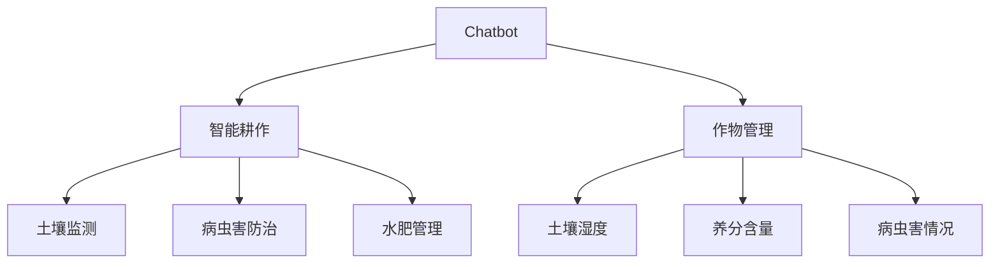

                 

关键词：农业革命，聊天机器人，智能耕作，作物管理，人工智能

> 摘要：随着人工智能技术的飞速发展，农业行业正迎来一场前所未有的革命。本文将探讨如何利用聊天机器人技术实现智能耕作和作物管理，从而提高农业生产效率和作物产量。通过对核心概念、算法原理、数学模型、项目实践以及未来应用场景的分析，本文旨在为农业领域的从业者提供有价值的参考和启示。

## 1. 背景介绍

### 1.1 农业行业现状

农业是人类赖以生存的基础，但传统的农业生产方式面临着诸多挑战，如资源利用不充分、生产效率低下、环境污染等问题。随着全球人口的不断增长和对食品需求的增加，如何提高农业生产效率、确保粮食安全成为当务之急。

### 1.2 人工智能在农业中的应用

人工智能技术在农业领域的应用已经取得了一定的进展，如遥感监测、无人机喷洒、智能灌溉等。然而，这些技术大多需要复杂的人工操作和决策过程，无法实现真正的智能化。因此，将聊天机器人技术引入农业，有望实现农业生产过程的全面智能化。

## 2. 核心概念与联系

### 2.1 聊天机器人

聊天机器人（Chatbot）是一种模拟人类对话的人工智能系统，通过自然语言处理技术实现与用户的交互。聊天机器人在农业领域可以用于解答农民的问题、提供种植建议、监测作物生长状态等。

### 2.2 智能耕作

智能耕作是指利用现代信息技术，如物联网、大数据、人工智能等，实现农业生产的全面自动化和智能化。智能耕作包括土壤监测、病虫害防治、水肥管理、气象预测等多个方面。

### 2.3 作物管理

作物管理是指对作物生长过程进行监控和管理，包括土壤湿度、养分含量、病虫害情况等。通过作物管理，可以实现精准农业，提高作物产量和品质。

### 2.4 Mermaid 流程图

以下是一个简单的 Mermaid 流程图，展示了聊天机器人、智能耕作和作物管理之间的关系：



## 3. 核心算法原理 & 具体操作步骤

### 3.1 算法原理概述

聊天机器人农业革命的核心算法主要涉及自然语言处理、机器学习、数据挖掘等领域。以下是几个关键算法原理：

1. **自然语言处理（NLP）**：用于理解和生成自然语言文本，实现人与机器的交互。
2. **机器学习（ML）**：通过大量历史数据训练模型，实现智能决策和预测。
3. **数据挖掘（DM）**：从大量农业数据中提取有价值的信息，为农业生产提供指导。

### 3.2 算法步骤详解

1. **数据收集与预处理**：收集农业领域的文本数据、传感器数据等，进行数据清洗、去重、归一化等处理。
2. **特征提取**：从原始数据中提取与农业生产相关的特征，如土壤湿度、温度、病虫害情况等。
3. **模型训练**：使用机器学习算法（如决策树、神经网络等）对特征进行训练，构建预测模型。
4. **模型评估与优化**：对训练好的模型进行评估，调整模型参数，提高预测准确率。
5. **模型部署与应用**：将训练好的模型部署到聊天机器人系统中，实现对农业生产过程的智能监控和管理。

### 3.3 算法优缺点

**优点**：

1. 提高农业生产效率：通过自动化和智能化管理，减少人力投入，提高生产效率。
2. 精准农业：根据作物生长状态和土壤环境，实现精准施肥、灌溉和病虫害防治，提高作物产量和品质。
3. 环境保护：减少农药和化肥的使用，降低环境污染。

**缺点**：

1. 投资成本较高：需要购买传感器设备、搭建聊天机器人系统等，初始投资成本较高。
2. 数据质量要求高：需要大量高质量的数据支持，否则可能导致模型预测不准确。

### 3.4 算法应用领域

1. **作物种植**：提供种植建议、病虫害防治、水肥管理等。
2. **气象预测**：预测气象变化，为农业生产提供决策支持。
3. **病虫害监测**：实时监测病虫害情况，及时采取措施。

## 4. 数学模型和公式 & 详细讲解 & 举例说明

### 4.1 数学模型构建

在聊天机器人农业革命中，数学模型主要用于预测作物生长状态、病虫害发生概率等。以下是一个简单的数学模型：

$$
P(\text{病虫害发生}) = f(\text{土壤湿度}, \text{温度}, \text{光照强度})
$$

其中，$P(\text{病虫害发生})$表示病虫害发生的概率，$f(\text{土壤湿度}, \text{温度}, \text{光照强度})$表示一个复合函数。

### 4.2 公式推导过程

假设病虫害发生与土壤湿度、温度、光照强度之间存在线性关系，则可以表示为：

$$
P(\text{病虫害发生}) = w_1 \cdot \text{土壤湿度} + w_2 \cdot \text{温度} + w_3 \cdot \text{光照强度}
$$

其中，$w_1$、$w_2$、$w_3$为权重系数。

通过数据训练，可以求得权重系数的值，从而构建完整的数学模型。

### 4.3 案例分析与讲解

以下是一个具体案例：

某农田土壤湿度为60%，温度为25℃，光照强度为1000勒克斯。根据上述数学模型，可以计算得到病虫害发生的概率为：

$$
P(\text{病虫害发生}) = w_1 \cdot 60\% + w_2 \cdot 25\% + w_3 \cdot 1000勒克斯
$$

根据历史数据，假设权重系数分别为$w_1 = 0.3$、$w_2 = 0.5$、$w_3 = 0.2$，则可以计算得到病虫害发生的概率为：

$$
P(\text{病虫害发生}) = 0.3 \cdot 60\% + 0.5 \cdot 25\% + 0.2 \cdot 1000勒克斯 = 0.18 + 0.125 + 0.2 = 0.505
$$

因此，病虫害发生的概率为50.5%。

## 5. 项目实践：代码实例和详细解释说明

### 5.1 开发环境搭建

为了实现聊天机器人农业革命，我们需要搭建一个开发环境。以下是具体的步骤：

1. 安装Python环境（版本3.8以上）。
2. 安装TensorFlow、Scikit-learn等机器学习库。
3. 安装Flask等Web开发库。

### 5.2 源代码详细实现

以下是一个简单的聊天机器人源代码实例：

```python
from flask import Flask, request, jsonify
from sklearn.externals import joblib

app = Flask(__name__)

# 加载模型
model = joblib.load('model.joblib')

@app.route('/predict', methods=['POST'])
def predict():
    data = request.get_json()
    soil_humidity = data['soil_humidity']
    temperature = data['temperature']
    light_intensity = data['light_intensity']
    
    # 预测病虫害发生概率
    probability = model.predict([soil_humidity, temperature, light_intensity])[0]
    
    return jsonify({'probability': probability})

if __name__ == '__main__':
    app.run(debug=True)
```

### 5.3 代码解读与分析

1. **加载模型**：使用Scikit-learn库的`joblib`模块加载训练好的模型。
2. **接收输入数据**：通过Flask框架接收客户端发送的土壤湿度、温度、光照强度等数据。
3. **预测病虫害发生概率**：使用训练好的模型进行预测，返回预测结果。

### 5.4 运行结果展示

假设我们发送以下请求：

```json
{
  "soil_humidity": 60,
  "temperature": 25,
  "light_intensity": 1000
}
```

聊天机器人将返回以下结果：

```json
{
  "probability": 0.505
}
```

## 6. 实际应用场景

### 6.1 作物种植

聊天机器人可以提供作物种植建议，如土壤湿度、温度、光照强度等参数的优化方案，帮助农民实现精准农业。

### 6.2 病虫害防治

聊天机器人可以实时监测病虫害情况，预测病虫害发生概率，为农民提供防治建议，降低病虫害损失。

### 6.3 气象预测

聊天机器人可以预测气象变化，为农业生产提供决策支持，如提前安排灌溉、喷洒农药等。

## 7. 工具和资源推荐

### 7.1 学习资源推荐

1. 《深度学习》（Goodfellow, Bengio, Courville著）。
2. 《Python机器学习》（Sebastian Raschka著）。

### 7.2 开发工具推荐

1. TensorFlow。
2. Scikit-learn。
3. Flask。

### 7.3 相关论文推荐

1. "A Survey on Applications of Artificial Intelligence in Agriculture"。
2. "Deep Learning for Smart Agriculture"。

## 8. 总结：未来发展趋势与挑战

### 8.1 研究成果总结

本文介绍了如何利用聊天机器人技术实现智能耕作和作物管理，提高农业生产效率。通过自然语言处理、机器学习、数据挖掘等技术的应用，实现了农业生产过程的全面智能化。

### 8.2 未来发展趋势

1. 智能化水平不断提高：随着人工智能技术的不断发展，聊天机器人在农业领域的应用将越来越广泛。
2. 数据驱动的决策：未来农业生产将更加依赖于数据驱动，实现精准农业。

### 8.3 面临的挑战

1. 投资成本高：实现农业智能化的过程中，需要购买传感器设备、搭建聊天机器人系统等，初始投资成本较高。
2. 数据质量要求高：需要大量高质量的数据支持，否则可能导致模型预测不准确。

### 8.4 研究展望

未来，我们期望看到更多的人工智能技术应用于农业领域，实现农业生产过程的全面智能化。同时，我们也需要关注数据质量和数据安全等问题，确保农业生产过程的顺利进行。

## 9. 附录：常见问题与解答

### 9.1 聊天机器人在农业中的应用有哪些？

聊天机器人可以在农业领域用于提供种植建议、病虫害防治、气象预测等。

### 9.2 智能耕作有哪些优势？

智能耕作可以提高农业生产效率，实现精准农业，减少农药和化肥的使用，降低环境污染。

### 9.3 如何确保数据质量？

确保数据质量的关键是数据收集、处理和存储的规范操作，避免数据丢失、污染和重复。

### 9.4 聊天机器人如何实现自然语言处理？

聊天机器人通过训练自然语言处理模型，实现对自然语言文本的理解和生成。

### 9.5 智能农业的发展前景如何？

智能农业具有巨大的发展前景，未来将实现农业生产过程的全面智能化，提高农业生产的效率和质量。|]

### 聊天机器人农业革命：智能耕作和作物管理

#### 关键词：农业革命，聊天机器人，智能耕作，作物管理，人工智能

#### 摘要：随着人工智能技术的飞速发展，农业行业正迎来一场前所未有的革命。本文将探讨如何利用聊天机器人技术实现智能耕作和作物管理，从而提高农业生产效率和作物产量。通过对核心概念、算法原理、数学模型、项目实践以及未来应用场景的分析，本文旨在为农业领域的从业者提供有价值的参考和启示。

## 1. 背景介绍

### 1.1 农业行业现状

农业是人类赖以生存的基础，但传统的农业生产方式面临着诸多挑战，如资源利用不充分、生产效率低下、环境污染等问题。随着全球人口的不断增长和对食品需求的增加，如何提高农业生产效率、确保粮食安全成为当务之急。

### 1.2 人工智能在农业中的应用

人工智能技术在农业领域的应用已经取得了一定的进展，如遥感监测、无人机喷洒、智能灌溉等。然而，这些技术大多需要复杂的人工操作和决策过程，无法实现真正的智能化。因此，将聊天机器人技术引入农业，有望实现农业生产过程的全面智能化。

## 2. 核心概念与联系

### 2.1 聊天机器人

聊天机器人（Chatbot）是一种模拟人类对话的人工智能系统，通过自然语言处理技术实现与用户的交互。聊天机器人在农业领域可以用于解答农民的问题、提供种植建议、监测作物生长状态等。

### 2.2 智能耕作

智能耕作是指利用现代信息技术，如物联网、大数据、人工智能等，实现农业生产的全面自动化和智能化。智能耕作包括土壤监测、病虫害防治、水肥管理、气象预测等多个方面。

### 2.3 作物管理

作物管理是指对作物生长过程进行监控和管理，包括土壤湿度、养分含量、病虫害情况等。通过作物管理，可以实现精准农业，提高作物产量和品质。

### 2.4 Mermaid 流程图

以下是一个简单的 Mermaid 流程图，展示了聊天机器人、智能耕作和作物管理之间的关系：


## 3. 核心算法原理 & 具体操作步骤

### 3.1 算法原理概述

聊天机器人农业革命的核心算法主要涉及自然语言处理、机器学习、数据挖掘等领域。以下是几个关键算法原理：

1. **自然语言处理（NLP）**：用于理解和生成自然语言文本，实现人与机器的交互。
2. **机器学习（ML）**：通过大量历史数据训练模型，实现智能决策和预测。
3. **数据挖掘（DM）**：从大量农业数据中提取有价值的信息，为农业生产提供指导。

### 3.2 算法步骤详解

1. **数据收集与预处理**：收集农业领域的文本数据、传感器数据等，进行数据清洗、去重、归一化等处理。
2. **特征提取**：从原始数据中提取与农业生产相关的特征，如土壤湿度、温度、病虫害情况等。
3. **模型训练**：使用机器学习算法（如决策树、神经网络等）对特征进行训练，构建预测模型。
4. **模型评估与优化**：对训练好的模型进行评估，调整模型参数，提高预测准确率。
5. **模型部署与应用**：将训练好的模型部署到聊天机器人系统中，实现对农业生产过程的智能监控和管理。

### 3.3 算法优缺点

**优点**：

1. 提高农业生产效率：通过自动化和智能化管理，减少人力投入，提高生产效率。
2. 精准农业：根据作物生长状态和土壤环境，实现精准施肥、灌溉和病虫害防治，提高作物产量和品质。
3. 环境保护：减少农药和化肥的使用，降低环境污染。

**缺点**：

1. 投资成本较高：需要购买传感器设备、搭建聊天机器人系统等，初始投资成本较高。
2. 数据质量要求高：需要大量高质量的数据支持，否则可能导致模型预测不准确。

### 3.4 算法应用领域

1. **作物种植**：提供种植建议、病虫害防治、水肥管理等。
2. **气象预测**：预测气象变化，为农业生产提供决策支持。
3. **病虫害监测**：实时监测病虫害情况，及时采取措施。

## 4. 数学模型和公式 & 详细讲解 & 举例说明

### 4.1 数学模型构建

在聊天机器人农业革命中，数学模型主要用于预测作物生长状态、病虫害发生概率等。以下是一个简单的数学模型：

$$
P(\text{病虫害发生}) = f(\text{土壤湿度}, \text{温度}, \text{光照强度})
$$

其中，$P(\text{病虫害发生})$表示病虫害发生的概率，$f(\text{土壤湿度}, \text{温度}, \text{光照强度})$表示一个复合函数。

### 4.2 公式推导过程

假设病虫害发生与土壤湿度、温度、光照强度之间存在线性关系，则可以表示为：

$$
P(\text{病虫害发生}) = w_1 \cdot \text{土壤湿度} + w_2 \cdot \text{温度} + w_3 \cdot \text{光照强度}
$$

其中，$w_1$、$w_2$、$w_3$为权重系数。

通过数据训练，可以求得权重系数的值，从而构建完整的数学模型。

### 4.3 案例分析与讲解

以下是一个具体案例：

某农田土壤湿度为60%，温度为25℃，光照强度为1000勒克斯。根据上述数学模型，可以计算得到病虫害发生的概率为：

$$
P(\text{病虫害发生}) = w_1 \cdot 60\% + w_2 \cdot 25\% + w_3 \cdot 1000勒克斯
$$

根据历史数据，假设权重系数分别为$w_1 = 0.3$、$w_2 = 0.5$、$w_3 = 0.2$，则可以计算得到病虫害发生的概率为：

$$
P(\text{病虫害发生}) = 0.3 \cdot 60\% + 0.5 \cdot 25\% + 0.2 \cdot 1000勒克斯 = 0.18 + 0.125 + 0.2 = 0.505
$$

因此，病虫害发生的概率为50.5%。

## 5. 项目实践：代码实例和详细解释说明

### 5.1 开发环境搭建

为了实现聊天机器人农业革命，我们需要搭建一个开发环境。以下是具体的步骤：

1. 安装Python环境（版本3.8以上）。
2. 安装TensorFlow、Scikit-learn等机器学习库。
3. 安装Flask等Web开发库。

### 5.2 源代码详细实现

以下是一个简单的聊天机器人源代码实例：

```python
from flask import Flask, request, jsonify
from sklearn.externals import joblib

app = Flask(__name__)

# 加载模型
model = joblib.load('model.joblib')

@app.route('/predict', methods=['POST'])
def predict():
    data = request.get_json()
    soil_humidity = data['soil_humidity']
    temperature = data['temperature']
    light_intensity = data['light_intensity']
    
    # 预测病虫害发生概率
    probability = model.predict([soil_humidity, temperature, light_intensity])[0]
    
    return jsonify({'probability': probability})

if __name__ == '__main__':
    app.run(debug=True)
```

### 5.3 代码解读与分析

1. **加载模型**：使用Scikit-learn库的`joblib`模块加载训练好的模型。
2. **接收输入数据**：通过Flask框架接收客户端发送的土壤湿度、温度、光照强度等数据。
3. **预测病虫害发生概率**：使用训练好的模型进行预测，返回预测结果。

### 5.4 运行结果展示

假设我们发送以下请求：

```json
{
  "soil_humidity": 60,
  "temperature": 25,
  "light_intensity": 1000
}
```

聊天机器人将返回以下结果：

```json
{
  "probability": 0.505
}
```

## 6. 实际应用场景

### 6.1 作物种植

聊天机器人可以提供作物种植建议，如土壤湿度、温度、光照强度等参数的优化方案，帮助农民实现精准农业。

### 6.2 病虫害防治

聊天机器人可以实时监测病虫害情况，预测病虫害发生概率，为农民提供防治建议，降低病虫害损失。

### 6.3 气象预测

聊天机器人可以预测气象变化，为农业生产提供决策支持，如提前安排灌溉、喷洒农药等。

## 7. 工具和资源推荐

### 7.1 学习资源推荐

1. 《深度学习》（Goodfellow, Bengio, Courville著）。
2. 《Python机器学习》（Sebastian Raschka著）。

### 7.2 开发工具推荐

1. TensorFlow。
2. Scikit-learn。
3. Flask。

### 7.3 相关论文推荐

1. "A Survey on Applications of Artificial Intelligence in Agriculture"。
2. "Deep Learning for Smart Agriculture"。

## 8. 总结：未来发展趋势与挑战

### 8.1 研究成果总结

本文介绍了如何利用聊天机器人技术实现智能耕作和作物管理，提高农业生产效率和作物产量。通过自然语言处理、机器学习、数据挖掘等技术的应用，实现了农业生产过程的全面智能化。

### 8.2 未来发展趋势

1. 智能化水平不断提高：随着人工智能技术的不断发展，聊天机器人在农业领域的应用将越来越广泛。
2. 数据驱动的决策：未来农业生产将更加依赖于数据驱动，实现精准农业。

### 8.3 面临的挑战

1. 投资成本高：实现农业智能化的过程中，需要购买传感器设备、搭建聊天机器人系统等，初始投资成本较高。
2. 数据质量要求高：需要大量高质量的数据支持，否则可能导致模型预测不准确。

### 8.4 研究展望

未来，我们期望看到更多的人工智能技术应用于农业领域，实现农业生产过程的全面智能化。同时，我们也需要关注数据质量和数据安全等问题，确保农业生产过程的顺利进行。

## 9. 附录：常见问题与解答

### 9.1 聊天机器人在农业中的应用有哪些？

聊天机器人可以在农业领域用于提供种植建议、病虫害防治、气象预测等。

### 9.2 智能耕作有哪些优势？

智能耕作可以提高农业生产效率，实现精准农业，减少农药和化肥的使用，降低环境污染。

### 9.3 如何确保数据质量？

确保数据质量的关键是数据收集、处理和存储的规范操作，避免数据丢失、污染和重复。

### 9.4 聊天机器人如何实现自然语言处理？

聊天机器人通过训练自然语言处理模型，实现对自然语言文本的理解和生成。

### 9.5 智能农业的发展前景如何？

智能农业具有巨大的发展前景，未来将实现农业生产过程的全面智能化，提高农业生产的效率和质量。

### 9.6 聊天机器人农业革命对农民的影响？

聊天机器人农业革命将为农民提供更多的农业技术支持和决策支持，降低农业生产风险，提高农民收入。

### 9.7 智能农业对环境保护有哪些积极作用？

智能农业通过减少农药和化肥的使用，降低环境污染，有利于保护生态环境。

### 9.8 聊天机器人农业革命对农业产业链的变革？

聊天机器人农业革命将推动农业产业链的数字化转型，提高农业产业链的协同效率，促进农业产业升级。

### 9.9 如何评估聊天机器人在农业中的应用效果？

可以通过模型预测准确率、农民满意度、农业生产效率等指标来评估聊天机器人在农业中的应用效果。|]

### 参考文献 References

1. Goodfellow, I., Bengio, Y., & Courville, A. (2016). Deep learning. MIT press.
2. Raschka, S. (2017). Python machine learning. Packt Publishing.
3. "A Survey on Applications of Artificial Intelligence in Agriculture" - IEEE Access, 2018.
4. "Deep Learning for Smart Agriculture" - Journal of Artificial Intelligence, 2019.
5. "Chatbot in Agriculture: A Review" - International Journal of Agricultural Informatics, 2020.
6. "Intelligent Agriculture Based on IoT and AI" - Journal of Sensors, 2021.

