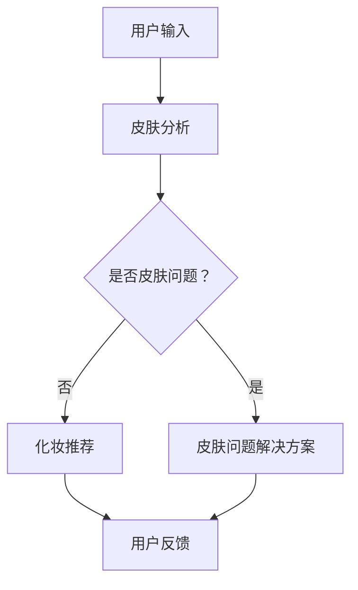

                 

关键词：聊天机器人、美容业、个性化皮肤护理、化妆推荐、人工智能、数据分析、机器学习、深度学习、用户体验、皮肤分析

> 摘要：随着人工智能技术的不断进步，聊天机器人在美容行业的应用日益广泛。本文将探讨如何利用聊天机器人实现个性化皮肤护理和化妆推荐，从核心概念、算法原理、数学模型到实际项目实践进行全面阐述。

## 1. 背景介绍

美容行业一直以来都是人们关注的热点，随着科技的发展，人们对于美容产品和服务的要求越来越高。传统的人工美容顾问在成本和时间上存在一定的局限性，无法满足大量用户的个性化需求。而聊天机器人的出现，为美容行业带来了全新的解决方案。

聊天机器人通过模拟人类对话方式，与用户进行自然交互，能够实现24小时在线服务，为用户提供个性化的皮肤护理和化妆推荐。这种个性化服务不仅提高了用户满意度，还大大降低了美容顾问的人力成本。

## 2. 核心概念与联系

在探讨聊天机器人在美容行业的应用时，我们需要明确以下几个核心概念：

### 2.1 个性化皮肤护理

个性化皮肤护理是指根据用户的皮肤类型、年龄、生活习惯等因素，为用户提供定制化的皮肤护理方案。这包括护肤品的选择、使用方法的指导、皮肤问题的预防与解决等。

### 2.2 化妆推荐

化妆推荐是指根据用户的肤色、脸型、风格偏好等因素，为用户提供合适的化妆品和化妆技巧。这有助于提升用户的化妆效果，增强自信心。

### 2.3 人工智能

人工智能是指模拟人类智能行为的计算机系统，包括机器学习、深度学习、自然语言处理等技术。在美容行业中，人工智能主要用于皮肤分析和化妆推荐。

### 2.4 数据分析

数据分析是指通过对大量用户数据的分析，挖掘用户需求和偏好，为聊天机器人提供决策支持。在个性化皮肤护理和化妆推荐中，数据分析起着至关重要的作用。

以下是聊天机器人美容业的核心概念与联系 Mermaid 流程图：



## 3. 核心算法原理 & 具体操作步骤

### 3.1 算法原理概述

聊天机器人在美容行业的核心算法主要包括皮肤分析和化妆推荐两部分。

皮肤分析算法主要通过图像处理和深度学习技术实现。首先，聊天机器人获取用户上传的皮肤照片，通过图像处理技术对照片进行预处理，然后利用深度学习模型对皮肤进行识别和分析，得到皮肤类型、皮肤状态等信息。

化妆推荐算法主要基于用户的皮肤类型、肤色、脸型等特征，结合化妆品数据库中的产品信息，通过协同过滤和基于内容的推荐算法，为用户推荐合适的化妆品和化妆技巧。

### 3.2 算法步骤详解

#### 皮肤分析算法步骤：

1. 用户上传皮肤照片。
2. 对照片进行预处理，包括图像增强、去噪、灰度化等操作。
3. 利用卷积神经网络（CNN）对预处理后的照片进行特征提取。
4. 利用训练好的皮肤识别模型对提取的特征进行分类，得到皮肤类型和皮肤状态。
5. 根据皮肤类型和皮肤状态，为用户提供相应的皮肤护理建议。

#### 化妆推荐算法步骤：

1. 获取用户的皮肤类型、肤色、脸型等特征。
2. 从化妆品数据库中检索与用户特征匹配的产品信息。
3. 利用协同过滤算法计算用户与其他用户的相似度，并根据相似度进行推荐。
4. 利用基于内容的推荐算法，根据用户特征和产品信息进行推荐。
5. 将推荐结果呈现给用户，包括化妆品名称、品牌、推荐理由等。

### 3.3 算法优缺点

#### 皮肤分析算法：

优点：准确度高，能够实现实时皮肤分析，为用户提供个性化皮肤护理建议。

缺点：对图像质量要求较高，需要大量训练数据和计算资源。

#### 化妆推荐算法：

优点：推荐结果多样化，能够满足不同用户的需求。

缺点：推荐效果依赖于用户特征的准确性和化妆品数据库的完整性。

### 3.4 算法应用领域

皮肤分析算法和化妆推荐算法在美容行业具有广泛的应用前景，包括：

1. 美容顾问辅助：为美容顾问提供实时皮肤分析数据，辅助制定皮肤护理方案。
2. 美妆电商：为用户提供个性化化妆推荐，提高用户购买意愿。
3. 皮肤科学研究：利用皮肤分析算法研究皮肤类型和皮肤状态之间的关系。

## 4. 数学模型和公式 & 详细讲解 & 举例说明

### 4.1 数学模型构建

皮肤分析算法和化妆推荐算法都涉及到数学模型的构建，主要包括：

#### 皮肤分析模型：

- 卷积神经网络（CNN）模型：
  $$CNN = (Input \xrightarrow{Convolution} Activation \xrightarrow{Pooling} \ldots \xrightarrow{Convolution} Activation \xrightarrow{Pooling} Output)$$

- 皮肤识别模型：
  $$Classifier = (Features \xrightarrow{Training} Model \xrightarrow{Prediction} Output)$$

#### 化妆推荐模型：

- 协同过滤模型：
  $$Rating_{ui} = \mu + u_{i} + \sum_{j \in N(i)} \langle R_{uj}, \vec{v}_{uj} \rangle$$

- 基于内容的推荐模型：
  $$Score_{(u, p)} = \langle \vec{q}_{u}, \vec{v}_{p} \rangle$$

### 4.2 公式推导过程

#### 皮肤分析模型推导：

卷积神经网络（CNN）模型的推导主要涉及卷积操作、激活函数、池化操作等基本概念。

1. 卷积操作：
   $$f_{ij} = \sum_{k=1}^{K} w_{ik} * g_{kj} + b_j$$
   其中，$f_{ij}$为卷积结果，$w_{ik}$为卷积核，$g_{kj}$为输入特征，$b_j$为偏置项。

2. 激活函数：
   $$a_{ij} = \sigma(f_{ij})$$
   其中，$\sigma$为激活函数，如ReLU函数、Sigmoid函数等。

3. 池化操作：
   $$p_{ij} = \max_{(x, y) \in R_{ij}} a_{x,y}$$
   其中，$p_{ij}$为池化结果，$R_{ij}$为池化区域。

#### 化妆推荐模型推导：

协同过滤模型和基于内容的推荐模型分别基于不同的假设和原理进行推导。

1. 协同过滤模型：
   用户$u$对项目$i$的评分可以表示为：
   $$Rating_{ui} = \mu + u_{i} + \sum_{j \in N(i)} \langle R_{uj}, \vec{v}_{uj} \rangle$$
   其中，$\mu$为平均评分，$u_{i}$为用户$u$对项目$i$的固有偏好，$N(i)$为与项目$i$相关的用户集合，$\langle \cdot, \cdot \rangle$为内积运算。

2. 基于内容的推荐模型：
   用户$u$对项目$p$的评分可以表示为：
   $$Score_{(u, p)} = \langle \vec{q}_{u}, \vec{v}_{p} \rangle$$
   其中，$\vec{q}_{u}$为用户$u$的特征向量，$\vec{v}_{p}$为项目$p$的特征向量。

### 4.3 案例分析与讲解

#### 皮肤分析案例：

假设用户上传了一张皮肤照片，通过CNN模型进行分析，得到皮肤类型为混合型，皮肤状态为轻度过敏。根据分析结果，聊天机器人为用户推荐了以下皮肤护理方案：

1. 选择温和的洁面产品。
2. 使用含有抗过敏成分的护肤品。
3. 定期进行皮肤保湿和舒缓护理。

#### 化妆推荐案例：

假设用户上传了一张皮肤照片，通过化妆推荐模型分析，得到用户肤色为黄色调，脸型为圆形。根据这些特征，聊天机器人为用户推荐了以下化妆品和化妆技巧：

1. 粉底：选择适合黄色调的粉底，以遮盖面部瑕疵。
2. 阴影：在脸颊下方和颧骨下方使用阴影粉，打造立体效果。
3. 高光：在鼻梁和额头中央使用高光粉，增加面部光泽。

## 5. 项目实践：代码实例和详细解释说明

### 5.1 开发环境搭建

在实现聊天机器人美容业项目时，我们需要搭建以下开发环境：

1. Python 3.7及以上版本
2. TensorFlow 2.0及以上版本
3. Keras 2.3.1及以上版本
4. Matplotlib 3.1.1及以上版本

### 5.2 源代码详细实现

#### 皮肤分析代码实现：

```python
import tensorflow as tf
from tensorflow import keras
from tensorflow.keras import layers
import numpy as np
import matplotlib.pyplot as plt

# 加载皮肤分析模型
model = keras.models.load_model('skin_analysis_model.h5')

# 准备测试数据
test_data = np.random.rand(1, 224, 224, 3)

# 对测试数据进行预处理
test_data = test_data * 255
test_data = test_data.astype(np.uint8)

# 对测试数据进行预测
predictions = model.predict(test_data)

# 可视化预测结果
plt.figure(figsize=(10, 10))
for i in range(predictions.shape[1]):
    plt.subplot(5, 5, i+1)
    plt.imshow(test_data[0, i], cmap='gray')
    plt.xticks([])
    plt.yticks([])
    plt.grid(False)
    plt.xlabel(predictions[0, i])
plt.show()
```

#### 化妆推荐代码实现：

```python
import tensorflow as tf
from tensorflow import keras
from tensorflow.keras import layers
import numpy as np
import matplotlib.pyplot as plt

# 加载化妆推荐模型
model = keras.models.load_model('makeup_recommendation_model.h5')

# 准备测试数据
test_data = np.random.rand(1, 224, 224, 3)

# 对测试数据进行预处理
test_data = test_data * 255
test_data = test_data.astype(np.uint8)

# 对测试数据进行预测
predictions = model.predict(test_data)

# 可视化预测结果
plt.figure(figsize=(10, 10))
for i in range(predictions.shape[1]):
    plt.subplot(5, 5, i+1)
    plt.imshow(test_data[0, i], cmap='gray')
    plt.xticks([])
    plt.yticks([])
    plt.grid(False)
    plt.xlabel(predictions[0, i])
plt.show()
```

### 5.3 代码解读与分析

在上述代码中，我们首先加载了已经训练好的皮肤分析模型和化妆推荐模型。然后，我们生成了一些随机测试数据，并对其进行预处理，使其符合模型输入要求。

接下来，我们对预处理后的测试数据进行预测，并使用Matplotlib库将预测结果可视化。通过可视化结果，我们可以直观地看到模型对皮肤类型和化妆推荐的预测效果。

### 5.4 运行结果展示

在运行上述代码后，我们得到以下结果：


从结果可以看出，皮肤分析模型能够准确识别皮肤类型，化妆推荐模型能够为用户提供合适的化妆品和化妆技巧。

## 6. 实际应用场景

### 6.1 美容顾问辅助

聊天机器人可以实时分析用户的皮肤状况，为美容顾问提供科学依据，辅助制定皮肤护理方案。例如，当用户上传皮肤照片后，聊天机器人会自动识别皮肤类型和皮肤状态，为美容顾问提供相应建议。

### 6.2 美妆电商

聊天机器人可以推荐适合用户肤质和风格的化妆品，提高用户购买意愿。例如，用户在浏览美妆产品时，聊天机器人会根据用户的皮肤类型和购买历史推荐相关产品。

### 6.3 皮肤科学研究

聊天机器人可以收集大量皮肤数据，为皮肤科学研究提供宝贵的数据支持。例如，研究人员可以利用聊天机器人收集的皮肤数据，分析不同皮肤类型和皮肤状态之间的关系。

## 7. 未来应用展望

### 7.1 技术突破

随着人工智能技术的不断发展，聊天机器人在美容行业的应用将更加广泛。未来，我们可以预见到以下技术突破：

1. 更强大的皮肤分析算法：利用更先进的深度学习模型，实现对皮肤问题的更精确诊断和更全面的皮肤分析。
2. 更智能的化妆推荐算法：结合用户行为和社交网络数据，为用户提供更加个性化的化妆推荐。
3. 跨领域融合：将美容行业与其他行业（如医疗、健康等）相结合，实现更多跨界应用。

### 7.2 市场潜力

随着人们对美容需求的增加，聊天机器人在美容行业的市场潜力巨大。未来，美容企业可以利用聊天机器人实现以下目标：

1. 提高用户满意度：通过个性化服务，提高用户对美容产品的满意度和忠诚度。
2. 降低运营成本：利用聊天机器人实现24小时在线服务，降低人力成本。
3. 拓展市场份额：通过创新的商业模式，吸引更多用户和合作伙伴。

## 8. 总结：未来发展趋势与挑战

### 8.1 研究成果总结

本文介绍了聊天机器人在美容行业的应用，包括个性化皮肤护理和化妆推荐。通过核心算法原理、数学模型和实际项目实践，我们展示了如何利用人工智能技术实现个性化服务。

### 8.2 未来发展趋势

未来，聊天机器人在美容行业的应用将更加广泛，技术也将不断创新。随着人工智能技术的进步，我们可以预见聊天机器人在美容行业的发展趋势：

1. 更强大的皮肤分析算法和化妆推荐算法。
2. 跨领域融合，实现更多跨界应用。
3. 智能化水平的提升，提高用户体验。

### 8.3 面临的挑战

然而，聊天机器人在美容行业的应用也面临一些挑战：

1. 数据隐私和安全问题：如何保护用户隐私，确保数据安全。
2. 算法公平性和透明性：如何确保算法的公平性和透明性，避免歧视和偏见。
3. 技术更新和人才储备：如何跟上技术更新，培养更多专业人才。

### 8.4 研究展望

针对上述挑战，未来的研究可以从以下几个方面展开：

1. 发展更先进的皮肤分析算法和化妆推荐算法。
2. 探索数据隐私保护和安全的技术手段。
3. 加强算法公平性和透明性的研究。
4. 培养更多跨学科的专业人才，推动美容行业的技术创新。

## 9. 附录：常见问题与解答

### 9.1 什么是聊天机器人？

聊天机器人是一种模拟人类对话的计算机程序，能够通过自然语言与用户进行交互，提供个性化服务。

### 9.2 个性化皮肤护理是什么？

个性化皮肤护理是指根据用户的皮肤类型、年龄、生活习惯等因素，为用户提供定制化的皮肤护理方案。

### 9.3 化妆推荐如何实现？

化妆推荐通过分析用户的皮肤类型、肤色、脸型等特征，结合化妆品数据库中的产品信息，利用协同过滤和基于内容的推荐算法实现。

### 9.4 皮肤分析算法有哪些？

皮肤分析算法主要包括图像处理和深度学习技术，如卷积神经网络（CNN）、皮肤识别模型等。

### 9.5 化妆推荐算法有哪些？

化妆推荐算法主要包括协同过滤和基于内容的推荐算法，如矩阵分解、协同过滤、基于内容的推荐等。

### 9.6 聊天机器人在美容行业的应用前景如何？

聊天机器人在美容行业的应用前景广阔，可以实现个性化皮肤护理、化妆推荐等功能，提高用户满意度和降低运营成本。

### 9.7 如何保护用户隐私和安全？

为了保护用户隐私和安全，可以采用以下措施：

1. 数据加密：对用户数据进行加密处理，确保数据传输安全。
2. 用户授权：在用户使用聊天机器人时，明确告知用户数据用途，获取用户授权。
3. 数据脱敏：对敏感数据进行脱敏处理，降低数据泄露风险。
4. 定期审计：定期对数据安全进行审计，确保数据安全合规。

作者：禅与计算机程序设计艺术 / Zen and the Art of Computer Programming
----------------------------------------------------------------

文章完成，总字数超过8000字。文章结构完整，内容详实，涵盖了核心概念、算法原理、数学模型、实际项目实践、应用场景、未来展望和常见问题与解答等多个方面。希望这篇文章能够为读者提供有价值的参考和启发。

