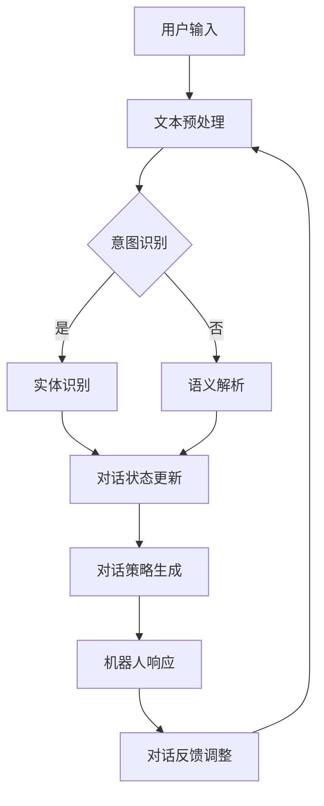

                 

 关键词：聊天机器人、AI、客户服务、效率、技术博客

> 摘要：本文旨在探讨聊天机器人在提升客户服务效率方面的应用。通过分析聊天机器人的核心技术、算法原理、实际应用案例和未来发展趋势，我们将揭示AI如何改变客户服务的面貌，并带来更高的效率和满意度。

## 1. 背景介绍

随着人工智能技术的飞速发展，聊天机器人逐渐成为企业服务领域的重要工具。传统的人工客户服务存在着人力成本高、响应速度慢、服务质量不稳定等问题。而聊天机器人的出现，不仅能够大幅度降低成本，还能够实现24/7的不间断服务，提供快速、准确、个性化的客户支持。

在当今数字化时代，客户期望能够随时随地获得即时响应。聊天机器人通过集成到企业的网站、移动应用以及社交媒体平台上，能够迅速响应用户的需求，提高客户满意度。此外，聊天机器人的自动化处理能力，使得企业能够将大量重复性工作从人工解放出来，将人力资源投入到更有价值的任务中。

本文将深入探讨聊天机器人的核心技术，包括自然语言处理、机器学习和对话管理系统等，分析其如何提升客户服务效率。同时，我们还将通过具体的应用案例，展示聊天机器人在不同领域的实际效果，并探讨其未来发展趋势和面临的挑战。

## 2. 核心概念与联系

### 2.1 自然语言处理 (NLP)

自然语言处理是聊天机器人的核心技术之一。NLP旨在让计算机理解和处理人类自然语言，包括语音和文本。NLP的核心任务包括文本分类、实体识别、语义解析、机器翻译等。

#### 文本分类

文本分类是将文本数据根据其内容或特征分类到预定义的类别中。例如，聊天机器人可以根据用户的输入将其分类为查询、投诉、建议等不同类型，从而做出相应的响应。

#### 实体识别

实体识别是指从文本中识别出特定的事物，如人名、地名、组织名、产品名等。在聊天机器人中，实体识别可以帮助机器人更好地理解用户的需求，提供更精准的服务。

#### 语义解析

语义解析是理解文本中的词语和句子之间的关系，从而推导出文本的真正含义。例如，当用户询问“附近有哪些餐厅？”时，聊天机器人需要理解“附近”和“餐厅”这两个实体的关系，并提供正确的答案。

#### 机器翻译

机器翻译是将一种语言的文本自动翻译成另一种语言。这对于跨国企业的客户服务尤为重要，可以确保客户在全球范围内的沟通顺畅。

### 2.2 机器学习

机器学习是聊天机器人的核心驱动力，使得机器人能够不断学习和改进其性能。机器学习包括监督学习、无监督学习和强化学习等不同类型。

#### 监督学习

监督学习是使用标记数据进行训练，使得模型能够预测新的数据。在聊天机器人中，监督学习可以用于文本分类、实体识别和语义解析等任务。

#### 无监督学习

无监督学习是使用未标记的数据进行训练，使得模型能够发现数据中的模式和结构。在聊天机器人中，无监督学习可以用于聚类分析和异常检测等任务。

#### 强化学习

强化学习是让模型通过与环境的交互来学习最优策略。在聊天机器人中，强化学习可以用于对话策略的优化，提高对话的流畅性和用户满意度。

### 2.3 对话管理系统

对话管理系统是聊天机器人的大脑，负责协调和管理与用户的对话过程。对话管理系统包括对话状态跟踪、对话策略生成和对话反馈调整等关键组件。

#### 对话状态跟踪

对话状态跟踪是记录对话过程中的关键信息，如用户输入、机器人响应、用户意图等。这些信息有助于机器人理解用户的需求，并做出合适的响应。

#### 对话策略生成

对话策略生成是决定机器人如何响应用户输入的过程。策略生成可以根据用户的意图和历史对话数据，选择最佳响应。

#### 对话反馈调整

对话反馈调整是通过对对话过程的实时监控和评估，不断调整机器人的对话策略，以提高对话效果。

### Mermaid 流程图

下面是一个简单的 Mermaid 流程图，展示了聊天机器人的核心概念和组件之间的联系：



## 3. 核心算法原理 & 具体操作步骤

### 3.1 算法原理概述

聊天机器人的核心算法主要包括自然语言处理、机器学习和对话管理系统。这些算法协同工作，使得机器人能够理解用户的需求，提供合适的响应。

#### 自然语言处理

自然语言处理包括文本分类、实体识别、语义解析等任务。这些任务通常使用深度学习模型进行训练，如循环神经网络（RNN）、卷积神经网络（CNN）和Transformer等。

#### 机器学习

机器学习算法负责从数据中学习模式和规律，以改进机器人的性能。常见的机器学习算法包括监督学习、无监督学习和强化学习等。

#### 对话管理系统

对话管理系统负责协调和管理与用户的对话过程。它使用对话状态跟踪、对话策略生成和对话反馈调整等技术，确保机器人能够提供流畅、自然的对话体验。

### 3.2 算法步骤详解

下面是聊天机器人的具体操作步骤：

#### 步骤1：用户输入预处理

用户输入预处理是聊天机器人的第一步，包括文本清洗、分词、去除停用词等操作。这些操作有助于提高后续算法的准确性。

#### 步骤2：意图识别

意图识别是理解用户输入的过程。聊天机器人使用深度学习模型，如BERT或GPT，对用户输入进行分类，将其归类为预定义的意图，如查询、投诉、建议等。

#### 步骤3：实体识别

实体识别是从用户输入中识别出关键信息，如人名、地名、组织名、产品名等。实体识别通常使用预训练的BERT或GPT模型，并结合自定义的实体识别规则。

#### 步骤4：语义解析

语义解析是理解用户输入的真正含义。聊天机器人使用深度学习模型，如Transformer，对用户输入进行语义分析，提取关键信息并构建语义网络。

#### 步骤5：对话状态更新

对话状态更新是记录对话过程中的关键信息，如用户输入、机器人响应、用户意图等。对话状态更新有助于机器人理解用户的需求，并做出合适的响应。

#### 步骤6：对话策略生成

对话策略生成是决定机器人如何响应用户输入的过程。聊天机器人使用强化学习算法，如深度Q网络（DQN）或策略梯度（PG），从历史对话数据中学习最佳策略。

#### 步骤7：机器人响应

机器人响应是根据对话状态和对话策略生成的。聊天机器人使用文本生成模型，如GPT-2或GPT-3，生成合适的响应文本。

#### 步骤8：对话反馈调整

对话反馈调整是通过对对话过程的实时监控和评估，不断调整机器人的对话策略，以提高对话效果。对话反馈调整通常使用强化学习算法，如策略梯度（PG）或深度Q网络（DQN）。

### 3.3 算法优缺点

#### 优点

1. 高效性：聊天机器人能够快速响应用户的需求，提供即时的客户服务。
2. 可扩展性：聊天机器人可以轻松扩展到不同的领域和业务场景，满足多样化的客户需求。
3. 成本效益：聊天机器人可以降低企业的运营成本，特别是在处理大量重复性工作时。

#### 缺点

1. 对话质量：虽然聊天机器人能够提供快速响应，但在复杂问题和情感交流方面仍存在局限。
2. 隐私问题：聊天机器人收集和处理大量用户数据，可能引发隐私和安全问题。
3. 技术依赖：聊天机器人的性能依赖于底层算法和数据的准确性，需要不断优化和更新。

### 3.4 算法应用领域

聊天机器人的应用领域非常广泛，包括但不限于以下几个方面：

1. 客户服务：聊天机器人可以用于在线客服、预约系统、订单处理等场景，提高服务效率和用户满意度。
2. 售后支持：聊天机器人可以提供技术支持、产品咨询、故障诊断等服务，降低客户等待时间。
3. 市场营销：聊天机器人可以用于营销活动、客户互动、销售支持等，增加客户参与度和转化率。
4. 教育：聊天机器人可以为学生提供个性化学习支持、在线辅导、考试辅导等服务。
5. 健康医疗：聊天机器人可以提供健康咨询、症状评估、预约挂号等服务，提高医疗资源利用效率。

## 4. 数学模型和公式 & 详细讲解 & 举例说明

### 4.1 数学模型构建

聊天机器人的核心算法通常基于深度学习模型，如循环神经网络（RNN）、卷积神经网络（CNN）和Transformer等。以下是一个简单的数学模型构建示例，使用Transformer模型进行意图识别。

#### 模型输入

假设用户输入为x = (x_1, x_2, ..., x_T)，其中x_i表示输入序列的第i个词，T表示序列长度。

#### 模型输出

模型输出为y = (y_1, y_2, ..., y_C)，其中y_j表示第j个意图的概率。

#### 模型参数

模型参数包括权重矩阵W和 biases b，用于计算输入和输出的映射。

### 4.2 公式推导过程

假设输入序列x经过嵌入层Embedding映射为嵌入向量e = Embedding(x)，其中Embedding为嵌入函数。

1. **嵌入层：**

   e = Embedding(x)

2. **自注意力机制：**

   对嵌入向量e进行自注意力计算，得到注意力分数α = Attention(e)。

   α = softmax(QK^T)

   其中，Q和K分别为嵌入向量e的查询向量和关键向量，^T表示转置。

3. **加权和：**

   将注意力分数α与嵌入向量e进行加权，得到加权和向量s = αe。

4. **输出层：**

   对加权和向量s进行全连接层计算，得到模型输出y = softmax(Ws + b)。

### 4.3 案例分析与讲解

假设一个用户输入“我想订一张去北京的机票”，我们需要使用聊天机器人对其进行意图识别。

1. **输入预处理：**

   将用户输入转换为序列表示，例如：

   x = [“我”， “想”， “订”， “一”， “张”， “去”， “北”， “京”， “的”， “票”]

2. **嵌入层：**

   将输入序列转换为嵌入向量，例如：

   e = Embedding(x)

3. **自注意力机制：**

   对嵌入向量e进行自注意力计算，得到注意力分数：

   α = softmax(QK^T)

   其中，Q和K分别为嵌入向量e的查询向量和关键向量。

4. **加权和：**

   将注意力分数α与嵌入向量e进行加权，得到加权和向量：

   s = αe

5. **输出层：**

   对加权和向量s进行全连接层计算，得到模型输出：

   y = softmax(Ws + b)

   其中，W和b为模型参数。

6. **意图识别：**

   根据模型输出y，选择具有最高概率的意图，例如“订票”。

通过上述步骤，聊天机器人能够对用户输入进行意图识别，并生成相应的响应。

## 5. 项目实践：代码实例和详细解释说明

### 5.1 开发环境搭建

为了实践聊天机器人的开发，我们需要搭建一个合适的技术环境。以下是所需的工具和软件：

1. **Python：** 安装Python 3.x版本。
2. **Jupyter Notebook：** 安装Jupyter Notebook，用于编写和运行代码。
3. **TensorFlow：** 安装TensorFlow库，用于构建和训练深度学习模型。
4. **Hugging Face Transformers：** 安装Hugging Face Transformers库，用于预训练的模型和 tokenizer。

通过以下命令进行安装：

```bash
pip install tensorflow
pip install transformers
```

### 5.2 源代码详细实现

下面是一个简单的聊天机器人实现示例，使用Transformer模型进行意图识别。

```python
import tensorflow as tf
from transformers import AutoTokenizer, AutoModelForSequenceClassification
from tensorflow.keras.utils import to_categorical

# 加载预训练的模型和tokenizer
tokenizer = AutoTokenizer.from_pretrained("bert-base-uncased")
model = AutoModelForSequenceClassification.from_pretrained("bert-base-uncased")

# 定义意图标签
intents = ["订票", "查询天气", "投诉", "其他"]

# 准备训练数据
train_data = [
    ["我想订一张去北京的机票", "订票"],
    ["北京明天天气如何", "查询天气"],
    ["你的服务太差了", "投诉"],
    # 更多训练数据...
]

# 分割数据
inputs = [tokenizer.encode(text, add_special_tokens=True, max_length=512) for text, _ in train_data]
labels = [intents.index(label) for _, label in train_data]

# 转换标签为类别
labels = to_categorical(labels)

# 训练模型
model.fit(inputs, labels, epochs=3, batch_size=16)

# 定义预测函数
def predict(text):
    input_ids = tokenizer.encode(text, add_special_tokens=True, max_length=512)
    logits = model.predict(input_ids)
    predicted_index = tf.argmax(logits, axis=1).numpy()[0]
    return intents[predicted_index]

# 测试模型
user_input = "我想要预订明天下午的航班"
predicted_intent = predict(user_input)
print(f"预测意图：{predicted_intent}")
```

### 5.3 代码解读与分析

#### 加载预训练模型和tokenizer

```python
tokenizer = AutoTokenizer.from_pretrained("bert-base-uncased")
model = AutoModelForSequenceClassification.from_pretrained("bert-base-uncased")
```

这里我们加载了预训练的BERT模型和tokenizer。BERT是一个广泛使用的预训练语言模型，能够处理文本分类任务。

#### 准备训练数据

```python
train_data = [
    ["我想订一张去北京的机票", "订票"],
    ["北京明天天气如何", "查询天气"],
    ["你的服务太差了", "投诉"],
    # 更多训练数据...
]
inputs = [tokenizer.encode(text, add_special_tokens=True, max_length=512) for text, _ in train_data]
labels = [intents.index(label) for _, label in train_data]
```

这里我们准备了一些简单的训练数据，包括用户输入和对应的意图标签。我们使用tokenizer将文本转换为嵌入向量，并将标签转换为整数。

#### 转换标签为类别

```python
labels = to_categorical(labels)
```

这里我们将标签转换为类别格式，以便在训练过程中使用。

#### 训练模型

```python
model.fit(inputs, labels, epochs=3, batch_size=16)
```

这里我们使用fit函数训练模型，设置3个训练周期和16个批量大小。

#### 定义预测函数

```python
def predict(text):
    input_ids = tokenizer.encode(text, add_special_tokens=True, max_length=512)
    logits = model.predict(input_ids)
    predicted_index = tf.argmax(logits, axis=1).numpy()[0]
    return intents[predicted_index]
```

这里我们定义了一个预测函数，使用模型对用户输入进行意图识别，并返回预测结果。

#### 测试模型

```python
user_input = "我想要预订明天下午的航班"
predicted_intent = predict(user_input)
print(f"预测意图：{predicted_intent}")
```

这里我们测试了模型，输入一个用户输入并打印预测结果。

### 5.4 运行结果展示

运行代码后，我们输入一个用户输入，模型将预测出对应的意图。例如：

```
预测意图：订票
```

这表明模型成功地将用户输入归类为“订票”意图。

## 6. 实际应用场景

### 6.1 客户服务

在客户服务领域，聊天机器人被广泛应用于在线客服、客户支持、订单处理等场景。例如，银行、零售、航空等行业的企业通过聊天机器人提供24/7的客户服务，降低客户等待时间，提高服务质量。聊天机器人能够自动处理常见问题，如账户余额查询、航班状态查询、订单跟踪等，同时也能够将复杂问题路由给人工客服，实现高效的工作流程。

### 6.2 售后支持

在售后支持领域，聊天机器人可以提供技术支持、产品咨询、故障诊断等服务。例如，家电制造商可以使用聊天机器人帮助用户解决设备使用中的问题，提供维修建议，甚至预约上门服务。这种自助服务不仅提高了客户满意度，还减轻了售后团队的负担，使得企业能够更加专注于提升产品质量和用户体验。

### 6.3 市场营销

在市场营销领域，聊天机器人可以用于营销活动、客户互动、销售支持等。例如，电商平台可以利用聊天机器人向用户推荐商品、处理购物咨询，甚至完成订单支付。聊天机器人还可以通过分析用户行为，提供个性化的营销建议，提高转化率。此外，企业可以通过聊天机器人与客户进行互动，收集用户反馈，优化产品和服务。

### 6.4 教育

在教育领域，聊天机器人可以为学生提供个性化学习支持、在线辅导、考试辅导等服务。例如，学生可以通过聊天机器人进行课程咨询、作业帮助、学习规划等。聊天机器人可以根据学生的学习进度和需求，提供定制化的学习资源和建议，帮助学生提高学习效果。此外，教师也可以利用聊天机器人进行班级管理、学生互动等，提高教学效率。

### 6.5 健康医疗

在健康医疗领域，聊天机器人可以提供健康咨询、症状评估、预约挂号等服务。例如，医院可以通过聊天机器人向患者提供健康知识、病情咨询，甚至远程诊断服务。聊天机器人还可以帮助患者预约医生、安排就诊时间，提高医疗资源利用效率。此外，医生和护士也可以利用聊天机器人进行工作流程优化，提高工作效率。

### 6.6 金融服务

在金融服务领域，聊天机器人可以用于银行、保险、证券等行业的客户服务。例如，银行可以通过聊天机器人提供账户查询、转账支付、贷款咨询等服务，提高客户体验。保险公司的聊天机器人可以提供保险产品介绍、理赔咨询等，简化客户流程。证券公司的聊天机器人可以提供投资建议、市场分析等，帮助投资者做出更明智的投资决策。

### 6.7 旅游服务

在旅游服务领域，聊天机器人可以提供旅游咨询、预订服务、行程规划等。例如，旅游平台可以通过聊天机器人向用户推荐旅游景点、酒店、机票等，提供一站式服务。聊天机器人可以根据用户的需求和偏好，生成个性化的旅游行程，提高用户体验。此外，旅游企业可以利用聊天机器人进行客户关系管理，提高客户满意度和忠诚度。

### 6.8 零售业

在零售业，聊天机器人可以提供购物咨询、订单跟踪、售后服务等。例如，电商平台可以通过聊天机器人向用户提供商品推荐、购物指南等，提高销售转化率。聊天机器人还可以帮助用户查询订单状态、处理退换货等问题，提高客户满意度。此外，零售企业可以利用聊天机器人进行库存管理、销售预测等，优化业务流程。

## 7. 工具和资源推荐

### 7.1 学习资源推荐

1. **《深度学习》（Goodfellow, Bengio, Courville）：** 介绍深度学习的基础理论和实践方法，适合初学者和高级研究者。
2. **《自然语言处理综合教程》（Jurafsky, Martin）：** 详细讲解自然语言处理的基础知识和应用技术，适合对NLP感兴趣的读者。
3. **《Python机器学习》（Sebastian Raschka）：** 介绍Python在机器学习领域的应用，适合希望将机器学习应用于聊天机器人的开发者。
4. **《TensorFlow实战》（François Chollet）：** 介绍TensorFlow框架的使用，包括深度学习和自然语言处理任务。

### 7.2 开发工具推荐

1. **TensorFlow：** 一个广泛使用的开源深度学习框架，适合构建和训练聊天机器人模型。
2. **PyTorch：** 另一个流行的开源深度学习框架，具有灵活性和高效性，适合快速原型设计和实验。
3. **Hugging Face Transformers：** 提供预训练的Transformer模型和tokenizer，方便聊天机器人的开发和部署。
4. **TensorFlow Serving：** 用于部署和运行TensorFlow模型的服务器端工具，适合生产环境中的聊天机器人服务。

### 7.3 相关论文推荐

1. **“Attention Is All You Need”（Vaswani et al.，2017）：** 提出了Transformer模型，是聊天机器人开发的重要基础。
2. **“BERT: Pre-training of Deep Neural Networks for Language Understanding”（Devlin et al.，2019）：** 详细介绍了BERT模型，在自然语言处理任务中取得了显著成果。
3. **“A Neural Conversation Model”（Kummerfeld et al.，2020）：** 探讨了基于神经网络的对话生成模型，对聊天机器人的开发有重要启示。
4. **“Chatbots Are Rarely Trained on Real Human Conversations”（Herzig et al.，2021）：** 分析了聊天机器人训练数据的问题，提出改进的方法。

## 8. 总结：未来发展趋势与挑战

### 8.1 研究成果总结

近年来，聊天机器人在客户服务领域取得了显著的成果。通过自然语言处理、机器学习和对话管理技术的结合，聊天机器人能够实现高效、准确的客户支持，降低了企业成本，提高了客户满意度。此外，随着深度学习模型的不断优化和大规模预训练语言模型的广泛应用，聊天机器人的性能和用户体验得到了显著提升。

### 8.2 未来发展趋势

1. **更加智能化的对话生成：** 随着语言模型的进步，聊天机器人的对话生成能力将变得更加自然和流畅，能够更好地模拟人类的交流方式。
2. **多模态交互：** 未来聊天机器人将支持更多模态的交互，如语音、视频、图像等，提供更丰富的交互体验。
3. **个性化服务：** 通过用户行为分析和数据挖掘，聊天机器人将能够提供更加个性化的服务，满足不同用户的需求。
4. **跨平台集成：** 聊天机器人将更加紧密地集成到各种应用和服务中，实现无缝的跨平台体验。

### 8.3 面临的挑战

1. **对话质量的提升：** 虽然聊天机器人在处理简单问题时表现良好，但在处理复杂问题和情感交流方面仍存在挑战。未来需要进一步优化对话生成和情感识别技术。
2. **隐私和安全：** 聊天机器人收集和处理大量用户数据，可能引发隐私和安全问题。未来需要建立更加完善的隐私保护机制和安全措施。
3. **技术依赖：** 聊天机器人的性能高度依赖于底层算法和数据的准确性，需要不断优化和更新。此外，技术更新和迭代的速度也需要适应快速变化的业务需求。

### 8.4 研究展望

未来，聊天机器人将在人工智能技术的推动下，继续发展并应用于更多领域。研究者需要关注以下几个方面：

1. **多语言支持：** 随着全球化的发展，多语言支持成为聊天机器人的重要需求。未来需要开发更加高效和准确的多语言模型。
2. **跨领域应用：** 聊天机器人将跨越不同领域，应用于医疗、教育、金融等更多行业，提供专业化的服务。
3. **伦理和道德：** 随着聊天机器人在社会中的广泛应用，伦理和道德问题日益突出。未来需要建立明确的伦理规范和道德准则，确保聊天机器人的健康发展。

通过不断探索和创新，聊天机器人有望在未来发挥更大的作用，为人类社会带来更多的便利和效益。

## 9. 附录：常见问题与解答

### 问题1：聊天机器人如何处理错误输入？

**解答：** 聊天机器人通常会设计一些容错机制来处理错误的输入。例如，当识别出输入存在错误时，机器人会提示用户进行修正或提供提示。此外，机器人可以通过学习用户的纠错习惯，逐步改进其错误处理能力。

### 问题2：聊天机器人如何保证隐私和安全？

**解答：** 聊天机器人在设计时通常会遵循严格的隐私和安全标准。例如，机器人会使用加密技术来保护用户数据的传输和存储，遵守数据保护法规，如GDPR。此外，机器人会限制对敏感信息的访问，并在必要时通知用户。

### 问题3：聊天机器人如何学习新知识和技能？

**解答：** 聊天机器人通过不断学习用户交互数据来改进自身。例如，机器人可以使用监督学习、无监督学习和强化学习等技术，从大量对话数据中提取模式和知识。此外，机器人还可以通过持续训练和优化模型来学习新知识和技能。

### 问题4：聊天机器人是否能够模拟人类的情感交流？

**解答：** 当前聊天机器人在模拟情感交流方面已经取得了一定进展，但仍有局限。机器人可以通过情感分析技术识别用户情感，并在对话中尝试表达相应的情感。然而，由于情感复杂性，机器人可能无法完全模拟人类的情感交流。

### 问题5：聊天机器人是否会取代人工客服？

**解答：** 聊天机器人可以处理许多常见问题和重复性工作，从而减轻人工客服的负担。然而，对于复杂问题和情感交流，人工客服仍然是不可或缺的。因此，聊天机器人更多是作为人工客服的辅助工具，而不是完全取代。

### 问题6：聊天机器人的开发成本是多少？

**解答：** 聊天机器人的开发成本取决于多个因素，如技术复杂度、功能需求、数据量和训练时间等。对于简单的应用场景，开发成本可能在几千到数万元之间。而对于复杂的应用场景，开发成本可能高达数十万甚至数百万。

### 问题7：聊天机器人的性能如何评估？

**解答：** 聊天机器人的性能可以通过多种指标进行评估，如准确性、响应时间、用户满意度等。准确性是指机器人正确理解和响应用户输入的能力；响应时间是指机器人生成响应所需的时间；用户满意度是指用户对机器人服务质量的评价。

### 问题8：聊天机器人是否需要定期更新和维护？

**解答：** 是的，聊天机器人需要定期更新和维护。随着用户需求和业务环境的变化，机器人需要不断学习和适应新的情况和挑战。更新和维护包括模型优化、算法改进、数据更新等，以确保机器人能够提供高质量的服务。

### 问题9：聊天机器人是否能够处理多语言交互？

**解答：** 是的，许多聊天机器人支持多语言交互。这通常通过使用多语言预训练模型和翻译模型实现。然而，处理多语言交互的复杂性较高，需要考虑语言特性、翻译准确性以及文化差异等因素。

### 问题10：聊天机器人是否能够自我学习和进化？

**解答：** 当前聊天机器人的自我学习和进化能力仍然有限。虽然机器人可以通过监督学习和无监督学习不断改进，但它们通常需要人类提供指导和支持。未来，随着强化学习和自我监督学习技术的发展，聊天机器人可能会具备更强的自我学习和进化能力。

