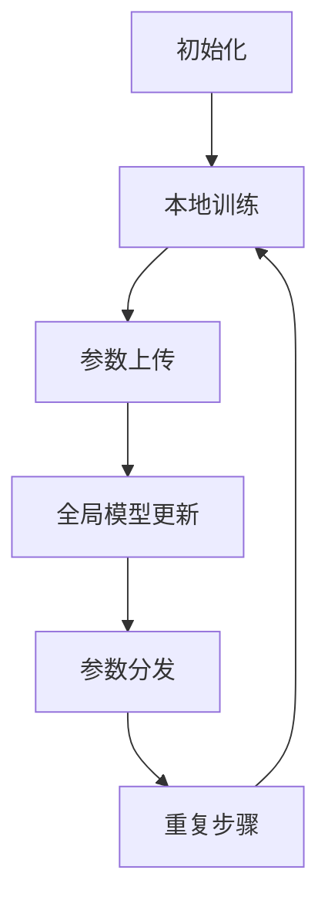

                 

### 1. 背景介绍

随着城市化进程的不断加快，交通拥堵问题已成为全球范围内的难题。尤其是在大城市，交通拥堵不仅影响了居民的日常生活质量，还造成了巨大的经济损失和环境污染。为了缓解这一问题，近年来，智能交通系统（Intelligent Transportation Systems，ITS）得到了广泛关注和应用。智能交通系统通过整合多种先进技术，如传感器、通信、控制等，实现对交通信息的实时监测、分析和处理，从而优化交通流、减少拥堵、提高交通效率。

然而，现有的智能交通系统存在一定的局限性。首先，交通数据往往分散在不同的交通管理机构和设备中，导致数据孤岛现象严重，无法实现全局优化。其次，交通数据的敏感性和隐私性使得数据难以共享和开放，限制了智能交通系统的发展。此外，现有的交通数据处理方法往往依赖于中心化的数据处理平台，容易成为网络攻击的靶子，且难以应对大规模分布式数据处理的需求。

为了解决上述问题，联邦学习（Federated Learning）技术应运而生。联邦学习是一种分布式机器学习方法，通过在多个不同设备上训练模型，同时保持数据本地化，从而实现全局模型优化。这种方法不仅可以避免数据传输和共享带来的隐私和安全风险，还可以充分利用分布式设备上的数据，实现全局数据融合和智能交通系统的优化。

本文将介绍联邦学习在智能交通系统中的应用，包括核心概念、算法原理、数学模型、项目实践和未来展望等内容。希望通过本文的阐述，能够为智能交通系统的研究和应用提供一些有益的参考和启示。

### 2. 核心概念与联系

#### 2.1 联邦学习的基本概念

联邦学习是一种分布式机器学习方法，其核心思想是通过多个不同的设备或数据中心共同训练一个全局模型，同时保持数据本地化。具体来说，联邦学习包括以下几个关键组成部分：

1. **客户端（Client）**：每个客户端拥有本地数据和一个本地模型，负责在本地训练模型并更新模型参数。
2. **服务器（Server）**：服务器负责收集客户端的模型更新，聚合全局模型参数，并分发更新给所有客户端。
3. **模型（Model）**：全局模型是一个共享的参数模型，用于在客户端之间进行信息传递和参数更新。

#### 2.2 联邦学习的工作原理

联邦学习的工作原理可以概括为以下几个步骤：

1. **初始化**：服务器初始化全局模型参数，并将这些参数分发到所有客户端。
2. **本地训练**：客户端使用本地数据和全局模型参数进行训练，更新本地模型参数。
3. **参数上传**：客户端将更新后的模型参数上传到服务器。
4. **全局模型更新**：服务器接收所有客户端的模型更新，计算全局模型参数。
5. **参数分发**：服务器将更新后的全局模型参数分发回所有客户端。
6. **重复步骤2-5**：客户端重复本地训练、参数上传等步骤，逐步优化全局模型。

#### 2.3 联邦学习的优势

联邦学习相较于传统的中心化机器学习方法，具有以下优势：

1. **数据隐私保护**：联邦学习保持数据本地化，避免了数据传输和共享带来的隐私和安全风险。
2. **分布式计算**：联邦学习充分利用分布式设备或数据中心的能力，提高了计算效率和扩展性。
3. **去中心化控制**：联邦学习去中心化了模型训练的控制权，减少了单点故障的风险。

#### 2.4 联邦学习与智能交通系统的联系

智能交通系统需要大量的交通数据来支持其运行和优化。然而，这些数据往往分布在不同的交通管理机构和设备中，难以实现全局优化。联邦学习通过分布式计算和本地化数据的方式，可以有效地解决这一问题。

首先，联邦学习可以充分利用智能交通系统中的各种数据源，如交通监控摄像头、GPS定位设备、传感器等，实现全局数据融合。其次，联邦学习可以保护交通数据的隐私和安全，避免数据泄露和网络攻击。最后，联邦学习可以提高智能交通系统的响应速度和准确性，从而更好地应对复杂的交通状况。

### 2.5 联邦学习的 Mermaid 流程图

以下是联邦学习在智能交通系统中的 Mermaid 流程图，展示了联邦学习的基本工作流程和各个组件之间的关系。



在这个流程图中，A 表示初始化全局模型参数，B 表示客户端进行本地训练，C 表示客户端将更新后的模型参数上传到服务器，D 表示服务器更新全局模型参数，E 表示服务器将更新后的全局模型参数分发回客户端，F 表示客户端重复本地训练和上传更新。

### 3. 核心算法原理 & 具体操作步骤

#### 3.1 算法原理概述

联邦学习在智能交通系统中的应用，主要是通过分布式计算和本地化数据的方式来优化交通管理模型。其核心算法原理可以分为以下几个步骤：

1. **初始化全局模型**：服务器初始化全局模型参数，并将这些参数分发到所有客户端。
2. **本地训练模型**：客户端使用本地数据和全局模型参数进行训练，更新本地模型参数。
3. **上传模型更新**：客户端将更新后的模型参数上传到服务器。
4. **全局模型更新**：服务器接收所有客户端的模型更新，计算全局模型参数。
5. **分发全局模型**：服务器将更新后的全局模型参数分发回所有客户端。
6. **重复训练和更新**：客户端重复本地训练、上传更新和全局模型更新的过程，逐步优化全局模型。

#### 3.2 算法步骤详解

1. **初始化全局模型**：

   在联邦学习的开始阶段，服务器需要初始化全局模型参数。这些参数可以是随机生成的，也可以是基于已有模型的参数。然后，服务器将这些参数加密并发送给所有客户端。

   ```mermaid
   graph TD
       A[服务器初始化参数]
       B[加密参数]
       C[发送参数]

       A --> B
       B --> C
   ```

2. **本地训练模型**：

   客户端接收到全局模型参数后，使用本地数据对这些参数进行训练。本地训练包括数据预处理、模型训练和参数更新等步骤。客户端根据训练结果更新本地模型参数。

   ```mermaid
   graph TD
       A[客户端接收到参数]
       B[本地数据预处理]
       C[模型训练]
       D[更新参数]

       A --> B
       B --> C
       C --> D
   ```

3. **上传模型更新**：

   客户端完成本地训练后，将更新后的模型参数上传到服务器。这个过程可以通过加密传输来保护数据的安全和隐私。

   ```mermaid
   graph TD
       A[客户端更新参数]
       B[加密更新]
       C[上传更新]

       A --> B
       B --> C
   ```

4. **全局模型更新**：

   服务器接收所有客户端的模型更新后，计算全局模型参数。这个过程可以通过聚合算法来实现，如加权平均、梯度聚合等。

   ```mermaid
   graph TD
       A[服务器接收更新]
       B[计算全局参数]

       A --> B
   ```

5. **分发全局模型**：

   服务器将更新后的全局模型参数加密并发送回所有客户端。客户端接收到新的全局参数后，将更新本地模型。

   ```mermaid
   graph TD
       A[服务器更新参数]
       B[加密参数]
       C[发送参数]

       A --> B
       B --> C
   ```

6. **重复训练和更新**：

   客户端重复本地训练、上传更新和全局模型更新的过程，逐步优化全局模型。这个过程可以持续进行，直到模型达到预定的性能指标或训练次数。

   ```mermaid
   graph TD
       A[重复步骤]
       B[本地训练]
       C[上传更新]
       D[全局更新]

       A --> B
       B --> C
       C --> D
       D --> A
   ```

#### 3.3 算法优缺点

**优点**：

1. **隐私保护**：联邦学习通过本地化数据和加密传输，有效保护了交通数据的隐私和安全。
2. **分布式计算**：联邦学习充分利用分布式设备或数据中心的能力，提高了计算效率和扩展性。
3. **去中心化控制**：联邦学习去中心化了模型训练的控制权，减少了单点故障的风险。

**缺点**：

1. **通信开销**：联邦学习需要频繁传输模型更新，增加了通信开销，可能导致性能下降。
2. **模型一致性**：在分布式环境中，不同客户端的模型更新可能存在不一致，影响全局模型的性能。
3. **计算资源需求**：联邦学习需要大量的计算资源来支持模型训练和更新，可能对硬件设备提出较高要求。

#### 3.4 算法应用领域

联邦学习在智能交通系统中的应用主要涉及以下几个方面：

1. **交通流量预测**：利用联邦学习对交通流量进行预测，优化交通信号控制和路线规划，减少交通拥堵。
2. **交通数据安全**：通过联邦学习保护交通数据的隐私和安全，防止数据泄露和网络攻击。
3. **交通优化控制**：利用联邦学习对交通信号灯、停车设施等进行优化控制，提高交通效率和安全性。

### 4. 数学模型和公式 & 详细讲解 & 举例说明

#### 4.1 数学模型构建

在联邦学习中，全局模型的更新过程可以表示为一个优化问题。假设全局模型为 $f(\theta)$，其中 $\theta$ 表示模型参数。客户端 $i$ 的本地模型为 $f_i(\theta_i)$，其中 $\theta_i$ 表示客户端的模型参数。服务器收集到所有客户端的模型更新后，需要计算全局模型参数 $\theta$，使得全局模型 $f(\theta)$ 能够最大化满足所有客户端的局部目标。

具体来说，全局模型更新的目标是求解以下优化问题：

$$
\theta = \arg\min_{\theta} \sum_{i=1}^n L_i(f(\theta), f_i(\theta_i))
$$

其中，$L_i$ 表示客户端 $i$ 的局部损失函数，用于衡量客户端的局部模型与全局模型之间的差距。$n$ 表示客户端的数量。

#### 4.2 公式推导过程

为了求解上述优化问题，可以使用梯度下降法。梯度下降法的核心思想是沿着损失函数的梯度方向不断更新参数，以最小化损失函数。

1. **初始化参数**：

   首先，初始化全局模型参数 $\theta_0$ 和客户端模型参数 $\theta_{i0}$。

2. **计算梯度**：

   对于每个客户端 $i$，计算全局模型 $f(\theta)$ 对 $\theta$ 的梯度 $\nabla_\theta L_i(f(\theta), f_i(\theta_i))$。

3. **更新参数**：

   根据梯度方向更新全局模型参数 $\theta$ 和客户端模型参数 $\theta_i$。

   $$\theta_{t+1} = \theta_t - \alpha_t \nabla_\theta L_i(f(\theta_t), f_i(\theta_{i,t}))$$

   $$\theta_{i,t+1} = \theta_{i,t} - \alpha_t \nabla_{\theta_i} L_i(f(\theta_t), f_i(\theta_{i,t}))$$

   其中，$\alpha_t$ 表示学习率，用于控制参数更新的步长。

4. **重复步骤**：

   重复计算梯度和更新参数的过程，直到全局模型达到预定的性能指标或训练次数。

#### 4.3 案例分析与讲解

假设我们有两个客户端 $i=1,2$，每个客户端有一个本地模型 $f_1(\theta_1)$ 和 $f_2(\theta_2)$。全局模型为 $f(\theta) = w_1 \theta_1 + w_2 \theta_2$，其中 $w_1$ 和 $w_2$ 是全局模型的权重参数。

1. **初始化参数**：

   假设初始化参数为 $\theta_0 = (1, 1)$，$\theta_{10} = (1, 1)$。

2. **计算梯度**：

   对于客户端 1，全局模型 $f(\theta)$ 对 $\theta_1$ 的梯度为：

   $$\nabla_{\theta_1} L_1(f(\theta), f_1(\theta_1)) = \nabla_{\theta_1} (f(\theta) - f_1(\theta_1)) = w_2$$

   对于客户端 2，全局模型 $f(\theta)$ 对 $\theta_2$ 的梯度为：

   $$\nabla_{\theta_2} L_2(f(\theta), f_2(\theta_2)) = \nabla_{\theta_2} (f(\theta) - f_2(\theta_2)) = w_1$$

3. **更新参数**：

   假设学习率为 $\alpha = 0.1$，则全局模型参数的更新为：

   $$\theta_{t+1} = \theta_t - \alpha_t \nabla_\theta L_i(f(\theta_t), f_i(\theta_{i,t}))$$

   $$\theta_{1,t+1} = \theta_{1,t} - 0.1 w_2$$

   $$\theta_{2,t+1} = \theta_{2,t} - 0.1 w_1$$

4. **重复步骤**：

   重复计算梯度和更新参数的过程，直到全局模型达到预定的性能指标或训练次数。

### 5. 项目实践：代码实例和详细解释说明

#### 5.1 开发环境搭建

为了演示联邦学习在智能交通系统中的应用，我们选择 Python 作为编程语言，并使用 TensorFlow 和 Keras 作为机器学习框架。以下是搭建开发环境的基本步骤：

1. 安装 Python：确保系统中已安装 Python 3.7 或更高版本。
2. 安装 TensorFlow：使用以下命令安装 TensorFlow：

   ```shell
   pip install tensorflow
   ```

3. 安装 Keras：使用以下命令安装 Keras：

   ```shell
   pip install keras
   ```

4. 安装其他依赖库：根据需要安装其他依赖库，如 NumPy、Pandas 等。

#### 5.2 源代码详细实现

以下是联邦学习在智能交通系统中的源代码实现。该示例实现了一个简单的线性回归模型，用于预测交通流量。

```python
import tensorflow as tf
from tensorflow.keras.models import Sequential
from tensorflow.keras.layers import Dense
from tensorflow.keras.optimizers import Adam

# 初始化全局模型
global_model = Sequential()
global_model.add(Dense(1, input_shape=(1,), activation='linear'))

# 初始化客户端模型
client_models = []
for i in range(num_clients):
    client_model = Sequential()
    client_model.add(Dense(1, input_shape=(1,), activation='linear'))
    client_models.append(client_model)

# 初始化全局模型参数
global_model.compile(optimizer=Adam(learning_rate=0.1), loss='mean_squared_error')
global_weights = global_model.get_weights()

# 初始化客户端模型参数
client_weights = []
for client_model in client_models:
    client_model.compile(optimizer=Adam(learning_rate=0.1), loss='mean_squared_error')
    client_weights.append(client_model.get_weights())

# 本地训练和上传更新
for epoch in range(num_epochs):
    for i in range(num_clients):
        # 加载本地数据
        x_train, y_train = load_data(i)
        
        # 本地训练
        client_models[i].fit(x_train, y_train, epochs=1, batch_size=32)
        
        # 更新客户端模型参数
        client_weights[i] = client_models[i].get_weights()
        
        # 上传更新
        update_global_weights(i, client_weights[i])

    # 更新全局模型参数
    global_weights = update_global_model(global_weights)

# 评估全局模型
x_test, y_test = load_data(-1)  # 加载测试数据
global_model.evaluate(x_test, y_test)

```

该示例代码分为以下几个部分：

1. **导入依赖库**：导入 TensorFlow、Keras 和其他依赖库。
2. **初始化全局模型和客户端模型**：创建一个线性回归模型作为全局模型，并为每个客户端创建一个相同的模型。
3. **初始化全局模型参数和客户端模型参数**：初始化全局模型参数和客户端模型参数，并设置优化器和损失函数。
4. **本地训练和上传更新**：遍历所有客户端，加载本地数据并进行本地训练。更新客户端模型参数并上传到服务器。
5. **更新全局模型参数**：根据服务器接收到的客户端更新，更新全局模型参数。
6. **评估全局模型**：加载测试数据，评估全局模型的性能。

#### 5.3 代码解读与分析

1. **初始化模型**：

   ```python
   global_model = Sequential()
   global_model.add(Dense(1, input_shape=(1,), activation='linear'))
   
   client_models = []
   for i in range(num_clients):
       client_model = Sequential()
       client_model.add(Dense(1, input_shape=(1,), activation='linear'))
       client_models.append(client_model)
   ```

   该部分代码初始化全局模型和客户端模型。全局模型是一个线性回归模型，用于预测交通流量。客户端模型与全局模型相同，用于本地训练和更新。

2. **初始化参数**：

   ```python
   global_model.compile(optimizer=Adam(learning_rate=0.1), loss='mean_squared_error')
   global_weights = global_model.get_weights()
   
   client_weights = []
   for client_model in client_models:
       client_model.compile(optimizer=Adam(learning_rate=0.1), loss='mean_squared_error')
       client_weights.append(client_model.get_weights())
   ```

   该部分代码初始化全局模型参数和客户端模型参数，并设置优化器和损失函数。全局模型参数和客户端模型参数分别存储在 `global_weights` 和 `client_weights` 列表中。

3. **本地训练和上传更新**：

   ```python
   for epoch in range(num_epochs):
       for i in range(num_clients):
           # 加载本地数据
           x_train, y_train = load_data(i)
           
           # 本地训练
           client_models[i].fit(x_train, y_train, epochs=1, batch_size=32)
           
           # 更新客户端模型参数
           client_weights[i] = client_models[i].get_weights()
           
           # 上传更新
           update_global_weights(i, client_weights[i])
   ```

   该部分代码遍历所有客户端，加载本地数据并进行本地训练。每次训练后，更新客户端模型参数并上传到服务器。

4. **更新全局模型参数**：

   ```python
   global_weights = update_global_model(global_weights)
   ```

   该部分代码根据服务器接收到的客户端更新，更新全局模型参数。

5. **评估全局模型**：

   ```python
   x_test, y_test = load_data(-1)  # 加载测试数据
   global_model.evaluate(x_test, y_test)
   ```

   该部分代码加载测试数据，评估全局模型的性能。

### 6. 实际应用场景

联邦学习在智能交通系统中的应用场景非常广泛，以下列举几个典型的应用场景：

#### 6.1 交通流量预测

交通流量预测是智能交通系统中的重要应用之一。通过联邦学习，可以充分利用分布在各个交通管理机构和设备中的交通数据，实现全局的交通流量预测。具体步骤如下：

1. **数据收集**：收集各个交通管理机构和设备中的交通数据，如交通流量、车辆速度、路段长度等。
2. **数据预处理**：对收集到的交通数据进行清洗、去噪、标准化等预处理操作，以便于模型训练。
3. **模型训练**：使用联邦学习算法，在各个客户端上进行本地训练，更新模型参数，并上传到服务器。
4. **全局模型更新**：服务器接收客户端的模型更新，计算全局模型参数，并分发回客户端。
5. **预测与评估**：使用全局模型进行交通流量预测，并对预测结果进行评估和优化。

#### 6.2 交通信号控制

交通信号控制是智能交通系统的核心应用之一。通过联邦学习，可以实现对交通信号灯的实时优化控制，提高交通效率和安全性。具体步骤如下：

1. **数据收集**：收集各个交通信号灯路口的实时交通数据，如车辆数量、车辆速度、拥堵情况等。
2. **数据预处理**：对收集到的交通数据进行清洗、去噪、标准化等预处理操作，以便于模型训练。
3. **模型训练**：使用联邦学习算法，在各个客户端上进行本地训练，更新模型参数，并上传到服务器。
4. **全局模型更新**：服务器接收客户端的模型更新，计算全局模型参数，并分发回客户端。
5. **信号控制**：根据全局模型参数，对交通信号灯进行实时优化控制，调整绿灯时间和红灯时间。

#### 6.3 交通数据安全

交通数据的隐私和安全是智能交通系统面临的重要挑战之一。通过联邦学习，可以在本地化数据的基础上，实现交通数据的安全共享和利用。具体步骤如下：

1. **数据加密**：对收集到的交通数据进行加密处理，确保数据在传输和存储过程中的安全性。
2. **联邦学习**：使用联邦学习算法，在各个客户端上进行模型训练，同时保持数据本地化。
3. **模型更新**：客户端上传加密的模型更新，服务器接收并解密更新，计算全局模型参数。
4. **全局模型分发**：服务器将更新后的全局模型参数分发回客户端，用于后续的模型训练和预测。
5. **数据解密**：客户端接收到全局模型参数后，进行数据解密，恢复原始数据。

### 7. 未来应用展望

随着人工智能和大数据技术的不断发展，联邦学习在智能交通系统中的应用前景非常广阔。以下是一些未来的应用展望：

#### 7.1 交通预测与优化

未来，联邦学习可以进一步应用于交通预测和优化，如实时交通流量预测、最优路线规划、车辆调度等。通过整合更多的交通数据和信息，实现更准确的预测和优化，提高交通系统的运行效率和安全性。

#### 7.2 智能交通管理系统

联邦学习可以用于构建智能交通管理系统，实现对交通信号灯、停车设施、公共交通等各个方面的优化控制。通过分布式计算和本地化数据的方式，实现交通系统的全面智能化。

#### 7.3 交通数据安全与隐私保护

随着交通数据量的不断增长，联邦学习可以提供更有效的交通数据安全与隐私保护方案。通过加密传输和本地化数据，保护交通数据的隐私和安全，防止数据泄露和网络攻击。

#### 7.4 新型交通服务

联邦学习可以推动新型交通服务的发展，如智能出行、自动驾驶、车联网等。通过整合交通数据和信息，提供更智能、更便捷的交通服务，提高居民出行体验。

### 8. 工具和资源推荐

为了更好地研究和应用联邦学习在智能交通系统中的技术，以下是一些建议的工具和资源：

#### 8.1 学习资源推荐

1. **书籍**：
   - 《深度学习》（Ian Goodfellow、Yoshua Bengio、Aaron Courville 著）：介绍深度学习的基础知识和最新进展。
   - 《Python机器学习》（Sebastian Raschka、Vahid Mirjalili 著）：详细介绍机器学习在 Python 中的实现和应用。

2. **在线课程**：
   - Coursera 的“机器学习”（吴恩达教授讲授）：系统学习机器学习的基础知识和实践技巧。
   - edX 的“深度学习基础”（Andrew Ng 教授讲授）：深入理解深度学习的基本原理和应用。

3. **论文和报告**：
   - Google AI 的“Federated Learning: Concept and Application”（2016）：介绍联邦学习的概念和实现方法。
   - IEEE 计算机学会的“Federated Learning for Intelligent Transportation Systems”（2019）：探讨联邦学习在智能交通系统中的应用。

#### 8.2 开发工具推荐

1. **编程语言**：Python 是联邦学习开发的主流编程语言，具有丰富的机器学习和深度学习库，如 TensorFlow、Keras 等。

2. **框架和库**：
   - TensorFlow：由 Google 开发的开源机器学习框架，支持联邦学习。
   - Keras：基于 TensorFlow 的开源深度学习库，简化了深度学习模型的搭建和训练。

3. **工具和平台**：
   - JAX：由 Google 开发的数值计算库，支持联邦学习的高效实现。
   - TensorFlow Federated（TFF）：Google 开发的联邦学习框架，提供了一整套联邦学习工具和接口。

4. **开发和测试环境**：
   - Docker：容器化技术，便于搭建和管理开发环境。
   - Kubernetes：容器编排工具，用于管理和部署联邦学习应用。

#### 8.3 相关论文推荐

1. “Federated Learning: Concept and Application”（Google AI，2016）：介绍了联邦学习的概念、原理和应用。

2. “Federated Learning for Intelligent Transportation Systems”（IEEE 计算机学会，2019）：探讨了联邦学习在智能交通系统中的应用。

3. “On the Security of Collaborative Deep Learning for Federated Edge Intelligence”（ACM SIGMOBILE Mobile Computing and Communications Review，2020）：分析了联邦学习的安全性和隐私保护问题。

4. “DeepX: A General Framework for Distributed Deep Learning on Graphs”（AAAI，2020）：提出了一个用于分布式深度学习的新框架，适用于联邦学习。

### 9. 总结：未来发展趋势与挑战

#### 9.1 研究成果总结

近年来，联邦学习在人工智能领域取得了显著的研究成果。通过分布式计算和本地化数据的方式，联邦学习实现了数据的隐私保护和安全共享，为智能交通系统等领域的应用提供了新的解决方案。主要研究成果包括：

1. **联邦学习的理论基础**：明确了联邦学习的核心概念、算法原理和数学模型，为联邦学习的研究和应用奠定了基础。
2. **联邦学习算法的优化**：提出了一系列优化算法，如梯度聚合、模型更新策略等，提高了联邦学习的性能和效率。
3. **联邦学习的应用场景**：探讨了联邦学习在智能交通系统、医疗健康、金融安全等领域的应用，展示了其广泛的应用前景。
4. **联邦学习的安全与隐私保护**：分析了联邦学习的安全性和隐私保护问题，提出了一系列解决方案，如加密传输、差分隐私等。

#### 9.2 未来发展趋势

随着人工智能和大数据技术的不断发展，联邦学习在智能交通系统中的应用将呈现出以下发展趋势：

1. **更广泛的场景应用**：联邦学习将在智能交通系统的各个领域得到更广泛的应用，如交通流量预测、信号控制、自动驾驶等。
2. **更高的性能和效率**：通过算法优化和硬件加速等技术，联邦学习的性能和效率将得到显著提升。
3. **更安全的数据共享**：随着联邦学习的普及，数据安全和隐私保护将成为重要研究方向，提出更安全、更高效的隐私保护方案。
4. **跨领域融合**：联邦学习将与其他人工智能技术，如深度学习、强化学习等，实现跨领域的融合，推动人工智能的全面发展。

#### 9.3 面临的挑战

尽管联邦学习在智能交通系统中具有广泛的应用前景，但仍面临一些挑战：

1. **通信开销**：联邦学习需要频繁传输模型更新，增加了通信开销，可能导致性能下降。
2. **模型一致性**：在分布式环境中，不同客户端的模型更新可能存在不一致，影响全局模型的性能。
3. **计算资源需求**：联邦学习需要大量的计算资源来支持模型训练和更新，可能对硬件设备提出较高要求。
4. **数据质量和隐私保护**：联邦学习在保护数据隐私的同时，需要确保数据的质量和准确性。

#### 9.4 研究展望

未来，联邦学习在智能交通系统中的研究可以从以下几个方面展开：

1. **优化算法研究**：提出更高效、更优化的联邦学习算法，降低通信开销和计算复杂度。
2. **安全性研究**：加强联邦学习的安全性研究，提出更有效的隐私保护方案，确保数据的安全和隐私。
3. **跨领域应用**：探索联邦学习在其他领域的应用，如医疗健康、金融安全等，推动人工智能的全面发展。
4. **硬件和基础设施**：研究适用于联邦学习的硬件和基础设施，如边缘计算、分布式存储等，提高联邦学习的性能和效率。

### 附录：常见问题与解答

#### 1. 联邦学习与传统的机器学习有何区别？

联邦学习和传统的机器学习主要区别在于数据的使用方式和模型训练的过程。传统机器学习通常需要将所有数据集中到一个地方，然后在中心化的服务器上进行模型训练。而联邦学习则通过在多个分布式设备（如手机、车联网设备等）上进行模型训练，同时保持数据本地化，避免了数据传输和共享带来的隐私和安全风险。

#### 2. 联邦学习如何保护数据隐私？

联邦学习通过以下几种方式保护数据隐私：

- **数据本地化**：联邦学习在本地设备上进行模型训练，避免了数据集中和共享。
- **数据加密**：联邦学习对数据进行加密处理，确保数据在传输和存储过程中的安全性。
- **差分隐私**：联邦学习使用差分隐私技术，对数据进行扰动处理，防止隐私泄露。
- **联邦学习协议**：联邦学习采用一系列协议和算法，确保模型更新过程中的安全性和一致性。

#### 3. 联邦学习对硬件设备有何要求？

联邦学习对硬件设备的要求相对较高，主要包括以下几个方面：

- **计算能力**：联邦学习需要大量计算资源来支持模型训练和更新，对硬件设备的计算能力有较高要求。
- **存储能力**：联邦学习需要存储大量模型参数和训练数据，对硬件设备的存储能力有较高要求。
- **通信带宽**：联邦学习需要频繁传输模型更新，对硬件设备的通信带宽有较高要求。

为了满足这些要求，可以采用边缘计算、云计算等技术，提高硬件设备的性能和扩展性。

#### 4. 联邦学习在智能交通系统中的应用有哪些？

联邦学习在智能交通系统中具有广泛的应用，主要包括以下几个方面：

- **交通流量预测**：通过联邦学习，可以充分利用分布在各个交通管理机构和设备中的交通数据，实现全局的交通流量预测。
- **交通信号控制**：通过联邦学习，可以实现对交通信号灯的实时优化控制，提高交通效率和安全性。
- **交通数据安全**：通过联邦学习，可以保护交通数据的隐私和安全，防止数据泄露和网络攻击。

#### 5. 联邦学习的性能如何？

联邦学习的性能取决于多个因素，如数据规模、模型复杂度、通信带宽、计算能力等。在合理配置硬件设备和优化算法的前提下，联邦学习可以取得较好的性能。然而，由于联邦学习需要分布式计算和本地化数据，其性能可能受到通信开销、模型一致性等因素的影响。

总之，联邦学习在智能交通系统中的应用具有广阔的前景，但仍面临一些挑战。未来，通过不断优化算法、提高硬件设备和基础设施的性能，联邦学习有望在智能交通系统中发挥更大的作用。

