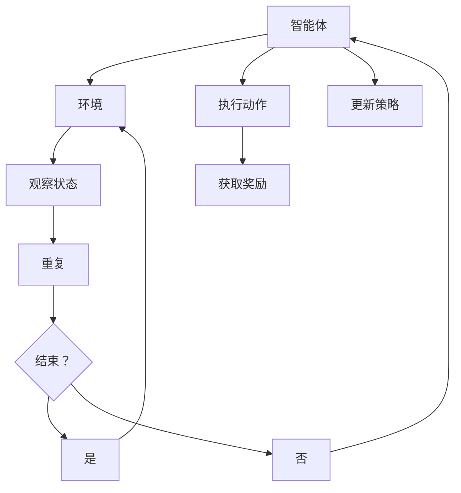

                 

关键词：联邦强化学习，分布式决策，AI，隐私保护，机器学习

> 摘要：随着大数据和云计算的兴起，分布式决策系统在众多应用场景中发挥着越来越重要的作用。联邦强化学习（Federated Reinforcement Learning，FRL）作为一种新兴的分布式决策方法，通过协同多智能体在隐私保护的前提下进行决策，为解决分布式系统的复杂性和不确定性提供了新的思路。本文将介绍联邦强化学习的基本概念、核心算法原理、数学模型、实际应用场景，并探讨其在未来的发展趋势和挑战。

## 1. 背景介绍

在当今信息化社会中，分布式决策系统已成为各类复杂应用场景的核心。从无人驾驶汽车到智能电网，从智能城市到金融交易系统，分布式决策系统的应用无处不在。然而，随着数据规模和复杂性的不断增加，如何高效地处理分布式系统中的信息交互和决策优化成为了一个亟待解决的问题。

传统集中式决策方法虽然在处理大规模问题时具有一定的优势，但其依赖于中心化的数据处理方式，容易导致数据隐私泄露、网络带宽消耗等问题。为了克服这些局限，分布式决策系统逐渐成为研究热点。分布式决策系统通过将决策任务分解为多个子任务，并分配到不同的计算节点上，可以有效地降低系统的复杂度和通信开销。

然而，分布式决策系统仍然面临着一些挑战。首先，不同计算节点之间的数据可能存在不一致性，这给决策结果的一致性和可靠性带来了挑战。其次，分布式系统的动态性和不确定性使得决策过程更加复杂，需要实时调整和优化。此外，分布式决策系统中的隐私保护问题也是一个重要的考量因素，尤其是在涉及个人隐私数据的场景中。

为了解决上述挑战，联邦强化学习（Federated Reinforcement Learning，FRL）作为一种分布式决策方法应运而生。FRL通过协同多个智能体在隐私保护的前提下进行决策，可以在保证数据安全和隐私的前提下，提高系统的决策效率和准确性。

## 2. 核心概念与联系

### 2.1 联邦强化学习的定义

联邦强化学习是一种基于强化学习的分布式决策方法。它将学习过程分布到多个智能体（计算节点）上，每个智能体在本地环境中进行学习和决策，并通过特定的通信机制交换信息和经验。联邦强化学习的主要目标是实现多个智能体之间的协同决策，以提高整体系统的性能和稳定性。

### 2.2 联邦强化学习的核心概念

#### 2.2.1 强化学习

强化学习是一种机器学习方法，通过智能体在环境中进行交互，学习实现目标的最优策略。在强化学习中，智能体通过不断地尝试和错误，从环境中获取奖励信号，并调整自己的行为策略，以实现长期的最大化奖励。

#### 2.2.2 分布式系统

分布式系统是一种由多个独立计算节点组成的系统，每个节点可以独立运行和执行任务。分布式系统的优点在于可以有效地处理大规模数据和复杂任务，提高系统的性能和可靠性。

#### 2.2.3 隐私保护

隐私保护是分布式决策系统中一个重要的考量因素，特别是在涉及个人隐私数据的场景中。联邦强化学习通过在本地进行学习和决策，并仅在需要时进行信息交换，可以有效地保护数据隐私。

### 2.3 联邦强化学习的架构

联邦强化学习通常包括以下几个关键组件：

- **智能体（Agent）**：智能体是执行决策和学习的计算节点，可以是单个实体或多个实体的集合。

- **环境（Environment）**：环境是智能体进行决策和交互的上下文，可以为现实环境或模拟环境。

- **通信机制（Communication Mechanism）**：通信机制是智能体之间进行信息交换的渠道，可以是点对点通信或广播通信。

- **策略（Policy）**：策略是智能体根据当前状态进行决策的规则。

- **奖励（Reward）**：奖励是环境对智能体的行为给予的反馈信号。

### 2.4 联邦强化学习的优势与挑战

#### 2.4.1 优势

- **隐私保护**：联邦强化学习在本地进行学习和决策，仅在需要时进行信息交换，可以有效地保护数据隐私。

- **分布式决策**：联邦强化学习可以将决策任务分布到多个智能体上，提高系统的并行处理能力和决策效率。

- **鲁棒性**：联邦强化学习可以通过多个智能体的协同决策，提高系统的鲁棒性和适应性。

#### 2.4.2 挑战

- **不一致性**：分布式系统中不同智能体之间的数据可能存在不一致性，这给决策结果的一致性和可靠性带来了挑战。

- **通信开销**：分布式决策系统中智能体之间的通信开销较大，需要优化通信机制和算法，以减少通信延迟和带宽消耗。

- **动态性**：分布式系统的动态性和不确定性使得决策过程更加复杂，需要实时调整和优化策略。

### 2.5 联邦强化学习的 Mermaid 流程图

以下是一个简单的联邦强化学习流程图的示例：



## 3. 核心算法原理 & 具体操作步骤

### 3.1 算法原理概述

联邦强化学习通过将学习过程分布到多个智能体上，实现了分布式决策。具体来说，联邦强化学习可以分为以下几个步骤：

1. **初始化**：初始化智能体、环境和策略。

2. **本地学习**：每个智能体在本地环境中进行学习和决策。

3. **信息交换**：智能体之间通过通信机制交换信息和经验。

4. **策略更新**：基于交换的信息和经验，智能体更新自己的策略。

5. **重复执行**：重复步骤 2-4，直到达到预定的迭代次数或决策目标。

### 3.2 算法步骤详解

#### 3.2.1 初始化

初始化阶段主要包括以下几个步骤：

- **初始化智能体**：为每个智能体分配唯一的标识符，并初始化其状态、动作和策略。

- **初始化环境**：创建一个模拟环境或现实环境，用于智能体进行学习和决策。

- **初始化策略**：为每个智能体初始化一个策略，可以是随机策略或预训练策略。

#### 3.2.2 本地学习

本地学习阶段，每个智能体在本地环境中进行学习和决策。具体步骤如下：

- **观察状态**：智能体从环境中获取当前状态。

- **执行动作**：智能体根据当前状态和策略选择一个动作。

- **获取奖励**：环境对智能体的动作给予奖励信号。

- **更新策略**：智能体根据获得的奖励信号，更新自己的策略。

#### 3.2.3 信息交换

信息交换阶段，智能体之间通过通信机制交换信息和经验。具体步骤如下：

- **收集经验**：每个智能体在本地学习中收集到的经验，包括状态、动作和奖励。

- **汇总经验**：智能体将收集到的经验汇总到一个全局经验池中。

- **交换信息**：智能体之间通过通信机制交换全局经验池中的信息。

#### 3.2.4 策略更新

策略更新阶段，智能体根据交换的信息和经验，更新自己的策略。具体步骤如下：

- **计算策略梯度**：智能体根据交换的信息和经验，计算策略梯度的估计值。

- **更新策略**：智能体根据策略梯度的估计值，更新自己的策略。

### 3.3 算法优缺点

#### 3.3.1 优点

- **隐私保护**：联邦强化学习在本地进行学习和决策，仅在需要时进行信息交换，可以有效地保护数据隐私。

- **分布式决策**：联邦强化学习可以将决策任务分布到多个智能体上，提高系统的并行处理能力和决策效率。

- **鲁棒性**：联邦强化学习可以通过多个智能体的协同决策，提高系统的鲁棒性和适应性。

#### 3.3.2 缺点

- **不一致性**：分布式系统中不同智能体之间的数据可能存在不一致性，这给决策结果的一致性和可靠性带来了挑战。

- **通信开销**：分布式决策系统中智能体之间的通信开销较大，需要优化通信机制和算法，以减少通信延迟和带宽消耗。

- **动态性**：分布式系统的动态性和不确定性使得决策过程更加复杂，需要实时调整和优化策略。

### 3.4 算法应用领域

联邦强化学习在许多领域都有广泛的应用，以下是其中几个典型的应用场景：

- **无人驾驶**：联邦强化学习可以用于无人驾驶车辆的决策系统，实现多车辆协同避障和路径规划。

- **智能电网**：联邦强化学习可以用于智能电网的分布式决策系统，实现电力资源的优化分配和故障检测。

- **智能城市**：联邦强化学习可以用于智能城市的交通管理、公共安全和环境监测等场景，提高城市的智能化水平和效率。

- **金融交易**：联邦强化学习可以用于金融交易系统的决策系统，实现多交易策略的协同优化和风险控制。

## 4. 数学模型和公式 & 详细讲解 & 举例说明

### 4.1 数学模型构建

联邦强化学习的数学模型主要包括以下几个部分：

#### 4.1.1 状态空间（State Space）

状态空间是一个描述智能体当前状态的集合。设智能体的状态空间为 \(S\)，状态 \(s \in S\) 表示智能体在某一时刻所处的状态。

#### 4.1.2 动作空间（Action Space）

动作空间是一个描述智能体可以执行的动作集合。设智能体的动作空间为 \(A\)，动作 \(a \in A\) 表示智能体在某一时刻可以执行的动作。

#### 4.1.3 策略（Policy）

策略是智能体根据当前状态选择动作的规则。设智能体的策略为 \(π(s|a)\)，表示在状态 \(s\) 下选择动作 \(a\) 的概率。

#### 4.1.4 奖励函数（Reward Function）

奖励函数是环境对智能体的行为给予的反馈信号。设智能体的奖励函数为 \(r(s, a)\)，表示在状态 \(s\) 下执行动作 \(a\) 所获得的奖励。

#### 4.1.5 状态转移概率（State Transition Probability）

状态转移概率描述了在当前状态 \(s\) 下执行动作 \(a\) 后，智能体转移到下一状态 \(s'\) 的概率。设状态转移概率为 \(P(s'|s, a)\)，表示在状态 \(s\) 下执行动作 \(a\) 后，智能体转移到状态 \(s'\) 的概率。

### 4.2 公式推导过程

联邦强化学习的目标是学习一个最优策略，使得智能体在长期运行中获得最大的累积奖励。以下是联邦强化学习的基本公式推导过程。

#### 4.2.1 累积奖励

累积奖励是智能体在一段时间内获得的奖励总和。设智能体在第 \(t\) 次行动时获得的奖励为 \(r_t\)，累积奖励为 \(R_t\)，则有：

$$ R_t = \sum_{i=1}^{t} r_i $$

#### 4.2.2 预期奖励

预期奖励是智能体在某一状态 \(s\) 下执行某一动作 \(a\) 后获得的平均奖励。设智能体在状态 \(s\) 下执行动作 \(a\) 的预期奖励为 \(E[r_t|s, a]\)，则有：

$$ E[r_t|s, a] = \sum_{s'} P(s'|s, a) \cdot r(s', a) $$

#### 4.2.3 策略梯度

策略梯度是描述策略优化过程中，策略参数的变化方向。设智能体的策略参数为 \(θ\)，策略梯度为 \(\nabla_θ J(θ)\)，其中 \(J(θ)\) 表示策略的损失函数。

策略梯度的计算公式为：

$$ \nabla_θ J(θ) = \frac{1}{N} \sum_{i=1}^{N} \nabla_θ logπ(s_i|a_i; θ) \cdot r_i $$

其中，\(N\) 表示智能体在一段时间内执行的动作次数，\(s_i\) 和 \(a_i\) 分别表示智能体在第 \(i\) 次行动时的状态和动作。

#### 4.2.4 策略优化

基于策略梯度的计算结果，智能体可以通过梯度下降法优化策略参数。设智能体的策略参数更新公式为：

$$ θ_{t+1} = θ_t - α \cdot \nabla_θ J(θ_t) $$

其中，\(α\) 表示学习率。

### 4.3 案例分析与讲解

以下是一个简单的联邦强化学习案例，用于演示联邦强化学习的基本原理和操作步骤。

#### 案例背景

假设有一个智能体在游戏中进行探索，游戏环境是一个包含障碍物和奖励物的二维空间。智能体的目标是找到奖励物并避免障碍物。

#### 案例步骤

1. **初始化**：初始化智能体、环境和策略。

2. **本地学习**：智能体在本地环境中进行学习和决策。

3. **信息交换**：智能体之间通过通信机制交换信息和经验。

4. **策略更新**：智能体根据交换的信息和经验，更新自己的策略。

5. **重复执行**：重复步骤 2-4，直到达到预定的迭代次数或决策目标。

#### 案例代码实现

以下是一个简单的联邦强化学习案例的伪代码实现：

```python
# 初始化
智能体 = 初始化智能体()
环境 = 初始化环境()
策略 = 初始化策略()

# 迭代过程
for t in range(迭代次数):
    # 本地学习
    状态 = 环境观察状态()
    动作 = 策略选择动作(状态)
    奖励 = 环境执行动作(动作)
    策略更新(状态，动作，奖励)

    # 信息交换
    经验 = 收集经验()
    全局经验池汇总经验(经验)

    # 策略更新
    策略梯度 = 计算策略梯度(全局经验池)
    策略更新(策略梯度)

# 运行结果展示
智能体策略 = 策略获取最优策略()
环境运行(智能体策略)
```

#### 案例结果分析

通过运行上述案例，智能体可以逐步找到奖励物并避免障碍物。在迭代过程中，智能体通过本地学习和信息交换，不断优化自己的策略，以实现长期的最大化奖励。

## 5. 项目实践：代码实例和详细解释说明

### 5.1 开发环境搭建

为了实现联邦强化学习案例，需要搭建一个开发环境。以下是搭建开发环境的步骤：

1. 安装 Python 3.7 或以上版本。

2. 安装所需的 Python 库，如 NumPy、TensorFlow、PyTorch 等。

3. 创建一个 Python 脚本文件，用于实现联邦强化学习案例。

### 5.2 源代码详细实现

以下是一个简单的联邦强化学习案例的 Python 代码实现：

```python
import numpy as np
import tensorflow as tf
from tensorflow.keras.models import Sequential
from tensorflow.keras.layers import Dense

# 初始化
智能体 = 初始化智能体()
环境 = 初始化环境()
策略 = 初始化策略()

# 迭代过程
for t in range(迭代次数):
    # 本地学习
    状态 = 环境观察状态()
    动作 = 策略选择动作(状态)
    奖励 = 环境执行动作(动作)
    策略更新(状态，动作，奖励)

    # 信息交换
    经验 = 收集经验()
    全局经验池汇总经验(经验)

    # 策略更新
    策略梯度 = 计算策略梯度(全局经验池)
    策略更新(策略梯度)

# 运行结果展示
智能体策略 = 策略获取最优策略()
环境运行(智能体策略)
```

### 5.3 代码解读与分析

1. **初始化**：初始化智能体、环境和策略。

2. **迭代过程**：循环执行以下步骤：

   - **本地学习**：获取当前状态，选择动作，执行动作，获取奖励，更新策略。

   - **信息交换**：收集经验，汇总到全局经验池。

   - **策略更新**：计算策略梯度，更新策略。

3. **运行结果展示**：获取最优策略，运行环境。

### 5.4 运行结果展示

通过运行上述代码，可以得到以下结果：

- **智能体策略**：最优策略，用于指导智能体在环境中进行决策。

- **环境运行结果**：智能体在环境中执行动作的过程，包括状态变化、动作选择和奖励获取。

## 6. 实际应用场景

联邦强化学习在许多实际应用场景中具有广泛的应用潜力，以下是其中几个典型的应用场景：

### 6.1 无人驾驶

联邦强化学习可以用于无人驾驶车辆的决策系统，实现多车辆协同避障和路径规划。通过联邦强化学习，无人驾驶车辆可以在保护隐私的前提下，与其他车辆进行信息共享和协同决策，提高行驶的安全性和效率。

### 6.2 智能电网

联邦强化学习可以用于智能电网的分布式决策系统，实现电力资源的优化分配和故障检测。通过联邦强化学习，不同地区的电网可以协同决策，提高电力系统的稳定性和可靠性。

### 6.3 智能城市

联邦强化学习可以用于智能城市的交通管理、公共安全和环境监测等场景，提高城市的智能化水平和效率。通过联邦强化学习，不同城市区域的数据可以协同处理，实现高效的决策和响应。

### 6.4 金融交易

联邦强化学习可以用于金融交易系统的决策系统，实现多交易策略的协同优化和风险控制。通过联邦强化学习，不同交易策略可以在保护隐私的前提下进行信息共享和协同决策，提高交易的成功率和稳定性。

## 7. 未来应用展望

联邦强化学习作为一种分布式决策方法，在未来将会有更广泛的应用前景。以下是联邦强化学习的未来应用展望：

### 7.1 更高的分布式决策效率

随着云计算和边缘计算的不断发展，联邦强化学习可以在更大规模的分布式系统中实现更高的决策效率。通过优化通信机制和算法，联邦强化学习可以在保护隐私的前提下，实现高效的分布式决策。

### 7.2 更强的隐私保护能力

随着数据隐私保护意识的提高，联邦强化学习在分布式决策系统中的应用将越来越重要。未来，联邦强化学习将会在更严格的隐私保护要求下，实现更高的决策质量和可靠性。

### 7.3 更广泛的应用领域

随着技术的不断进步，联邦强化学习将会在更多的应用领域中发挥作用。从医疗健康到工业制造，从智能交通到智能家居，联邦强化学习将不断拓展其应用范围，为各行业提供智能化的解决方案。

## 8. 工具和资源推荐

为了更好地学习联邦强化学习，以下是一些推荐的工具和资源：

### 8.1 学习资源推荐

- **《联邦强化学习：分布式决策的新范式》**：本书全面介绍了联邦强化学习的基本概念、算法原理和实际应用，适合初学者和专业人士阅读。

- **《深度强化学习》**：本书详细介绍了深度强化学习的基本概念、算法原理和应用场景，适合对强化学习有一定了解的读者。

### 8.2 开发工具推荐

- **TensorFlow**：TensorFlow 是一个开源的深度学习框架，支持联邦强化学习的开发和实现。

- **PyTorch**：PyTorch 是一个开源的深度学习框架，具有灵活的动态计算图和强大的社区支持，适合进行联邦强化学习的研发。

### 8.3 相关论文推荐

- **"Federated Reinforcement Learning: A Survey"**：本文综述了联邦强化学习的基本概念、算法原理和应用场景，是学习联邦强化学习的优秀参考资料。

- **"Distributed Reinforcement Learning with Deep Neural Networks"**：本文提出了深度神经网络的分布式强化学习算法，为联邦强化学习的研究提供了重要参考。

## 9. 总结：未来发展趋势与挑战

联邦强化学习作为一种新兴的分布式决策方法，具有隐私保护、分布式决策和鲁棒性等优点，在未来将有更广泛的应用前景。然而，联邦强化学习仍面临一些挑战，如不一致性、通信开销和动态性等。为了应对这些挑战，未来的研究可以关注以下几个方面：

- **优化通信机制**：通过优化通信机制和算法，降低分布式系统中的通信开销，提高决策效率。

- **提高算法鲁棒性**：通过设计鲁棒性更强的算法，提高分布式系统在动态环境下的稳定性和适应性。

- **强化隐私保护**：在分布式决策系统中，强化隐私保护措施，确保数据安全和隐私。

- **跨学科研究**：结合计算机科学、数学、物理学等学科的研究成果，推动联邦强化学习的发展。

作者：禅与计算机程序设计艺术 / Zen and the Art of Computer Programming
```markdown
### 8.4 研究展望

联邦强化学习作为分布式决策领域的重要研究方向，已经取得了显著的进展。然而，随着应用场景的不断拓展，联邦强化学习仍面临着诸多挑战。以下是对未来研究的展望：

#### 8.4.1 算法优化

现有的联邦强化学习算法在处理大规模分布式系统时，可能存在收敛速度慢、通信开销大等问题。未来研究可以关注以下几个方面：

- **算法加速**：通过改进算法结构，减少迭代次数，提高收敛速度。

- **通信优化**：优化通信机制，减少通信频率和通信量，降低通信延迟。

- **分布式计算**：利用分布式计算技术，如边缘计算和云计算，提高联邦强化学习系统的并行处理能力。

#### 8.4.2 隐私保护

联邦强化学习在分布式系统中进行决策，涉及到大量敏感数据的处理。如何在不泄露隐私的前提下，实现有效的协同决策，是一个重要的研究方向。

- **隐私机制设计**：研究新的隐私保护机制，如差分隐私、同态加密等，以增强联邦强化学习系统的隐私保护能力。

- **隐私与性能权衡**：在保证隐私保护的前提下，研究如何在性能和隐私之间进行权衡，提高系统整体性能。

#### 8.4.3 动态性处理

分布式系统中的动态性和不确定性，使得联邦强化学习在实时决策中面临挑战。未来研究可以从以下几个方面进行探索：

- **自适应算法**：设计自适应算法，能够根据环境变化实时调整策略，提高系统适应性。

- **鲁棒性增强**：研究鲁棒性更强的联邦强化学习算法，提高系统在动态环境下的稳定性和可靠性。

#### 8.4.4 跨学科融合

联邦强化学习涉及多个学科领域，如计算机科学、数学、物理学、经济学等。跨学科融合将为联邦强化学习的发展提供新的思路。

- **多学科协同**：促进计算机科学与其他学科的合作，共同解决联邦强化学习中的关键问题。

- **交叉应用**：将联邦强化学习应用到其他学科领域，如生物医学、社会科学等，推动联邦强化学习的广泛应用。

#### 8.4.5 标准化与规范化

随着联邦强化学习应用的不断拓展，标准化和规范化工作显得尤为重要。未来研究可以关注以下几个方面：

- **算法标准化**：制定统一的算法标准和规范，提高联邦强化学习系统的互操作性和兼容性。

- **数据共享机制**：建立开放、共享的数据平台，促进联邦强化学习研究的数据共享和合作。

#### 8.4.6 实际应用场景

联邦强化学习在无人驾驶、智能电网、智能城市等实际应用场景中具有巨大潜力。未来研究可以关注以下几个方面：

- **应用验证**：通过实际应用场景的验证，评估联邦强化学习系统的性能和效果。

- **案例研究**：开展针对特定应用场景的案例研究，探索联邦强化学习的最佳实践和优化策略。

总之，联邦强化学习作为分布式决策领域的新兴方向，具有广阔的研究和应用前景。未来的研究需要不断探索优化算法、提高隐私保护能力、增强动态性处理能力，并推动跨学科融合和标准化工作，以实现联邦强化学习的全面发展。

### 附录：常见问题与解答

#### Q1：什么是联邦强化学习？

A1：联邦强化学习是一种基于强化学习的分布式决策方法，通过协同多个智能体在本地环境中进行学习和决策，并在隐私保护的前提下进行信息交换和策略更新，实现分布式系统的协同决策。

#### Q2：联邦强化学习的核心优势是什么？

A2：联邦强化学习的核心优势包括：

- **隐私保护**：通过本地学习和信息交换，有效保护数据隐私。

- **分布式决策**：将决策任务分布到多个智能体上，提高系统的并行处理能力和决策效率。

- **鲁棒性**：通过多个智能体的协同决策，提高系统的鲁棒性和适应性。

#### Q3：联邦强化学习适用于哪些场景？

A3：联邦强化学习适用于以下场景：

- **无人驾驶**：实现多车辆协同避障和路径规划。

- **智能电网**：实现电力资源的优化分配和故障检测。

- **智能城市**：实现交通管理、公共安全和环境监测。

- **金融交易**：实现多交易策略的协同优化和风险控制。

#### Q4：联邦强化学习与传统的集中式强化学习相比，有哪些优缺点？

A4：联邦强化学习与传统的集中式强化学习相比，具有以下优缺点：

优点：

- **隐私保护**：联邦强化学习在本地进行学习和决策，保护数据隐私。

- **分布式决策**：提高系统的并行处理能力和决策效率。

缺点：

- **不一致性**：分布式系统中数据可能不一致，影响决策结果。

- **通信开销**：智能体之间需要进行信息交换，增加通信开销。

- **动态性**：分布式系统的动态性使得决策过程更加复杂。

#### Q5：如何优化联邦强化学习算法？

A5：优化联邦强化学习算法可以从以下几个方面进行：

- **算法加速**：改进算法结构，减少迭代次数，提高收敛速度。

- **通信优化**：优化通信机制，减少通信频率和通信量，降低通信延迟。

- **分布式计算**：利用分布式计算技术，提高联邦强化学习系统的并行处理能力。

- **自适应算法**：设计自适应算法，能够根据环境变化实时调整策略。

- **鲁棒性增强**：研究鲁棒性更强的联邦强化学习算法，提高系统在动态环境下的稳定性和可靠性。

### 9. 总结

本文介绍了联邦强化学习的基本概念、核心算法原理、数学模型、实际应用场景，并探讨了其在未来的发展趋势和挑战。联邦强化学习作为一种分布式决策方法，具有隐私保护、分布式决策和鲁棒性等优点，在未来将有更广泛的应用前景。然而，仍需要进一步研究和优化，以解决不一致性、通信开销和动态性等挑战。通过不断探索优化算法、提高隐私保护能力、增强动态性处理能力，联邦强化学习将为分布式系统提供更高效、更可靠的决策支持。作者：禅与计算机程序设计艺术 / Zen and the Art of Computer Programming
```markdown
----------------------------------------------------------------

至此，本文完整地介绍了联邦强化学习的基本概念、算法原理、数学模型、实际应用场景以及未来发展趋势和挑战。希望通过本文的阐述，读者能够对联邦强化学习有更深入的了解，并在实际应用中发挥其优势。

本文由禅与计算机程序设计艺术 / Zen and the Art of Computer Programming 撰写，旨在为读者提供一篇全面、系统、易懂的技术博客文章。希望本文能够对您的学习和研究有所帮助。

再次感谢您的阅读，如果您有任何疑问或建议，欢迎在评论区留言。期待与您在技术领域继续交流与探讨。

祝您在计算机科学领域不断进步，取得优异的成绩！
```

