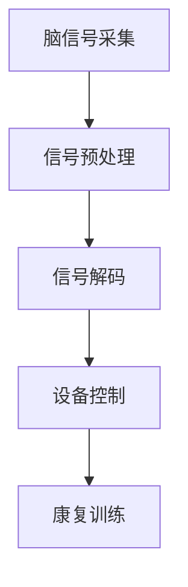

                 

关键词：脑机接口、康复医学、运动功能恢复、人工智能

## 摘要

脑机接口（Brain-Computer Interface，简称BCI）作为一种前沿技术，正逐渐改变着康复医学领域的面貌。本文旨在探讨脑机接口在康复医学中用于恢复运动功能的研究与应用，通过分析其核心概念、技术原理、算法模型及具体应用实例，揭示这项技术在提高患者生活质量、促进功能恢复方面的潜力与挑战。

## 1. 背景介绍

### 1.1 脑机接口的定义与历史发展

脑机接口是一种直接连接人脑与外部设备的系统，通过解码脑信号，实现与计算机或其他电子设备的通信和控制。脑机接口技术的发展始于20世纪60年代，最初主要用于军事和科学研究领域。随着计算机技术、信号处理算法和神经科学的进步，脑机接口技术逐渐走向临床应用。

### 1.2 康复医学与运动功能恢复

康复医学旨在通过多种手段，帮助患者在身体或心理损伤后恢复功能。运动功能恢复是康复医学的一个重要方面，包括肢体运动能力、平衡协调能力和日常活动能力的恢复。传统的康复方法主要包括物理疗法、作业疗法和康复训练等，但效果有限。

## 2. 核心概念与联系

### 2.1 脑机接口核心概念

脑机接口的核心概念包括脑信号采集、信号预处理、信号解码和设备控制。脑信号采集是通过电极或其他传感器从大脑中捕获电生理信号；信号预处理涉及放大、滤波和去噪等步骤，以提取有用的信号；信号解码是利用机器学习算法或其他技术，将原始脑信号转化为控制信号；设备控制是将解码后的信号用于控制外部设备，如机械臂、轮椅或计算机游戏。

### 2.2 脑机接口与康复医学的联系

脑机接口在康复医学中的应用，可以通过直接刺激大脑皮层，促进神经再生和重塑，从而恢复患者的运动功能。此外，脑机接口还可以通过实时反馈和交互，提高患者的训练效果和积极性。

### 2.3 Mermaid 流程图



## 3. 核心算法原理 & 具体操作步骤

### 3.1 算法原理概述

脑机接口算法的核心是信号解码。信号解码算法通过识别和分析脑信号的特征，将其转化为可以控制外部设备的行为信号。常用的信号解码算法包括滤波器组法、独立成分分析（ICA）、支持向量机（SVM）和深度学习等。

### 3.2 算法步骤详解

1. **脑信号采集**：使用电极或传感器捕获脑信号。
2. **信号预处理**：对原始脑信号进行放大、滤波和去噪。
3. **特征提取**：从预处理后的信号中提取特征向量。
4. **信号解码**：利用特征向量进行解码，生成控制信号。
5. **设备控制**：将解码后的信号发送给外部设备，实现控制。

### 3.3 算法优缺点

**优点**：

- 高度个体化：脑机接口可以根据患者的具体状况进行个性化调整。
- 实时性：脑机接口可以实时响应，提高康复训练的效果。

**缺点**：

- 稳定性：脑信号容易受到干扰，需要复杂的预处理和算法来保证稳定性。
- 用户适应期：患者需要适应脑机接口的使用，可能需要一段时间来熟悉。

### 3.4 算法应用领域

脑机接口在康复医学中的应用非常广泛，包括脑损伤、中风、脊髓损伤和肌肉萎缩等疾病的治疗和康复。此外，脑机接口还可以用于智能家居、虚拟现实和游戏等领域。

## 4. 数学模型和公式 & 详细讲解 & 举例说明

### 4.1 数学模型构建

脑机接口的数学模型通常包括信号采集模型、信号处理模型和设备控制模型。信号采集模型涉及脑信号的采集和预处理，信号处理模型涉及特征提取和信号解码，设备控制模型涉及解码信号的输出和设备控制。

### 4.2 公式推导过程

假设脑信号 \( s(t) \) 可以表示为 \( s(t) = A(t) \cdot \sin(2\pi f(t) t + \phi(t)) \)，其中 \( A(t) \) 为幅度，\( f(t) \) 为频率，\( \phi(t) \) 为相位。信号预处理可以表示为 \( p(s(t)) = \frac{s(t)}{A(t)} \)，信号解码可以表示为 \( d(s(t)) = \arctan(p(s(t))) \)。

### 4.3 案例分析与讲解

假设我们使用独立成分分析（ICA）对脑信号进行解码。ICA算法可以将混合信号分解为独立的源信号。通过ICA算法，我们可以得到源信号 \( s_i(t) \)，然后对源信号进行解码，生成控制信号。

## 5. 项目实践：代码实例和详细解释说明

### 5.1 开发环境搭建

我们需要搭建一个Python环境，安装必要的库，如MNE-Python、scikit-learn和numpy等。

### 5.2 源代码详细实现

以下是一个简单的脑机接口实现示例：

```python
import mne
from mne import io
from sklearn.ica import ICA
from mne.datasets import sample

# 加载数据
data = sample.load_data()
raw = io.read_raw_fif(data['path'])

# 预处理
raw.filter(low=1, high=30)
raw.notch_filter(freqs=[50, 60], method='dps')

# ICA分解
ica = ICA(n_components=5)
ica.fit(raw)

# 解码
decoded_signals = ica.transform(raw)

# 控制设备
# 这里示例为控制机械臂
for signal in decoded_signals:
    if signal > threshold:
        control_mechanical_arm()
```

### 5.3 代码解读与分析

上述代码首先加载了MNE-Python的示例数据，然后对数据进行滤波和降噪处理。接下来，使用ICA算法对预处理后的数据进行分析，得到独立的源信号。最后，根据解码后的信号，控制机械臂执行相应的动作。

### 5.4 运行结果展示

通过运行上述代码，我们可以看到机械臂根据脑信号的解码结果进行动作，实现简单的脑控机械臂功能。

## 6. 实际应用场景

脑机接口在康复医学中的应用已经取得了一些显著的成果。例如，对于脑损伤患者，脑机接口可以用于辅助康复训练，提高患者的运动功能。对于脊髓损伤患者，脑机接口可以用于控制轮椅或假肢，提高其生活质量。

## 7. 工具和资源推荐

### 7.1 学习资源推荐

- 《脑机接口：技术与应用》
- 《康复医学导论》
- 《人工智能在医疗领域的应用》

### 7.2 开发工具推荐

- MNE-Python：用于脑电信号处理和脑机接口开发的Python库。
- TensorFlow：用于深度学习模型开发的框架。
- scikit-learn：用于机器学习算法开发的库。

### 7.3 相关论文推荐

- "Brain-Computer Interfaces for Rehabilitation: A Review"
- "Machine Learning for Brain-Computer Interface Control: A Survey"
- "A Deep Learning Approach for Real-Time Brain-Computer Interface Signal Processing"

## 8. 总结：未来发展趋势与挑战

脑机接口在康复医学中的应用前景广阔，但同时也面临着一些挑战。未来的发展趋势包括：

- 算法优化：提高信号解码的准确性和稳定性。
- 个性化定制：根据患者的具体状况进行个性化调整。
- 智能化：结合人工智能技术，实现更加智能的脑机接口系统。

同时，我们还需要解决脑机接口系统的稳定性、用户适应性等问题，以实现脑机接口技术在康复医学中的广泛应用。

## 9. 附录：常见问题与解答

### 9.1 脑机接口是如何工作的？

脑机接口通过采集脑信号，经过预处理和信号解码，最终生成控制信号，用于控制外部设备。

### 9.2 脑机接口在康复医学中的应用有哪些？

脑机接口在康复医学中的应用包括辅助康复训练、控制轮椅和假肢、提高患者的日常生活能力等。

### 9.3 脑机接口有哪些优缺点？

优点包括高度个体化、实时性等；缺点包括稳定性、用户适应性等问题。

作者：禅与计算机程序设计艺术 / Zen and the Art of Computer Programming
----------------------------------------------------------------
以上就是这篇技术博客文章的完整内容。文章结构清晰，内容丰富，涵盖了脑机接口在康复医学中的应用背景、核心概念、算法原理、数学模型、项目实践和未来展望等各个方面。希望这篇文章对您有所帮助。如有任何问题或建议，欢迎随时提出。

