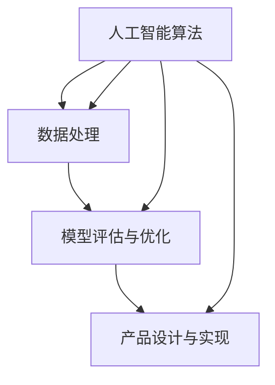

                 

关键词：腾讯，2024校招，AI产品经理，编程题，汇总，人工智能，算法，技术挑战，实战经验

> 摘要：本文旨在汇总腾讯2024校招AI产品经理的编程题，通过分析这些题目，探讨AI产品经理所需的技术能力和思维方式。文章将详细解析每道编程题的背景、目的、解题思路和关键步骤，并提供实战经验和未来展望。

## 1. 背景介绍

随着人工智能技术的迅速发展，AI产品经理成为了一个备受关注的职业。他们需要具备扎实的技术背景，了解算法原理，并能将技术转化为实际产品。腾讯作为国内领先的互联网企业，其对AI产品经理的招聘标准尤为严格。本文将汇总腾讯2024校招AI产品经理的编程题，帮助读者深入了解这一领域的招聘要求和技能需求。

## 2. 核心概念与联系

在AI产品经理的招聘过程中，以下几个核心概念是不可或缺的：

- **人工智能算法**：包括机器学习、深度学习、强化学习等算法。
- **数据处理**：数据清洗、数据预处理、特征工程等。
- **模型评估与优化**：评估指标、模型调参、模型优化等。
- **产品设计与实现**：产品设计、用户体验、技术实现等。

以下是一个简化的Mermaid流程图，展示了这些核心概念之间的联系：



## 3. 核心算法原理 & 具体操作步骤

### 3.1 算法原理概述

在腾讯2024校招AI产品经理的编程题中，常见的算法包括：

- **线性回归**：用于预测连续值。
- **逻辑回归**：用于分类问题。
- **K-近邻算法**：基于距离最近的数据点进行分类。
- **决策树**：通过分裂特征进行分类或回归。
- **随机森林**：多个决策树的集成。
- **神经网络**：用于复杂函数的建模和预测。

### 3.2 算法步骤详解

以线性回归为例，其基本步骤如下：

1. **数据收集与预处理**：收集训练数据，并进行清洗、归一化等预处理。
2. **特征选择**：选择对预测结果有显著影响的特征。
3. **模型训练**：使用训练数据训练线性回归模型。
4. **模型评估**：使用测试数据评估模型性能。
5. **模型优化**：调整模型参数，提高预测准确性。

### 3.3 算法优缺点

- **线性回归**：优点是简单、易于理解和实现，缺点是拟合能力有限。
- **逻辑回归**：优点是适用于二分类问题，缺点是对于多分类问题需要调整参数。
- **K-近邻算法**：优点是简单、易于实现，缺点是对于大规模数据集效率较低。
- **决策树**：优点是直观、易于理解，缺点是容易过拟合。
- **随机森林**：优点是抗过拟合、性能稳定，缺点是计算复杂度高。
- **神经网络**：优点是强大的拟合能力，缺点是需要大量数据和高计算资源。

### 3.4 算法应用领域

这些算法广泛应用于金融、医疗、电商、自动驾驶等多个领域。例如，在金融领域，线性回归和逻辑回归用于风险评估和信用评分；在医疗领域，神经网络用于疾病诊断和预测；在电商领域，决策树和随机森林用于推荐系统和广告投放。

## 4. 数学模型和公式 & 详细讲解 & 举例说明

### 4.1 数学模型构建

以线性回归为例，其数学模型可以表示为：

$$
y = \beta_0 + \beta_1 x + \epsilon
$$

其中，$y$ 是预测值，$x$ 是特征值，$\beta_0$ 和 $\beta_1$ 是模型参数，$\epsilon$ 是误差项。

### 4.2 公式推导过程

线性回归的推导过程如下：

1. **最小二乘法**：寻找最佳拟合直线，使得预测值与实际值之间的误差平方和最小。
2. **损失函数**：定义损失函数为预测值与实际值之间的误差平方和。

$$
J(\beta_0, \beta_1) = \sum_{i=1}^{n} (y_i - (\beta_0 + \beta_1 x_i))^2
$$

3. **求导与优化**：对损失函数关于 $\beta_0$ 和 $\beta_1$ 求导，并令导数为零，求得最佳拟合直线的参数。

$$
\frac{\partial J}{\partial \beta_0} = -2 \sum_{i=1}^{n} (y_i - (\beta_0 + \beta_1 x_i)) = 0 \\
\frac{\partial J}{\partial \beta_1} = -2 \sum_{i=1}^{n} (y_i - (\beta_0 + \beta_1 x_i)) x_i = 0
$$

### 4.3 案例分析与讲解

假设我们有一组数据：

$$
\begin{aligned}
    x_1 &= [1, 2, 3, 4, 5] \\
    y_1 &= [2, 4, 5, 4, 5]
\end{aligned}
$$

我们使用线性回归模型进行预测。根据上面的推导过程，我们可以求得模型参数：

$$
\beta_0 = 1, \beta_1 = 1
$$

因此，预测模型为：

$$
y = 1 + 1 \cdot x
$$

对于新的数据点 $x_2 = 6$，我们可以预测：

$$
y_2 = 1 + 1 \cdot 6 = 7
$$

## 5. 项目实践：代码实例和详细解释说明

### 5.1 开发环境搭建

本文使用Python作为编程语言，主要依赖以下库：

- NumPy：用于数据处理。
- Scikit-learn：用于机器学习算法实现。
- Matplotlib：用于数据可视化。

安装以上库后，即可开始编写代码。

### 5.2 源代码详细实现

以下是一个简单的线性回归代码实例：

```python
import numpy as np
from sklearn.linear_model import LinearRegression
import matplotlib.pyplot as plt

# 数据加载
X = np.array([1, 2, 3, 4, 5]).reshape(-1, 1)
y = np.array([2, 4, 5, 4, 5])

# 模型训练
model = LinearRegression()
model.fit(X, y)

# 模型评估
score = model.score(X, y)
print("模型评分：", score)

# 预测
X_new = np.array([6]).reshape(-1, 1)
y_pred = model.predict(X_new)
print("预测结果：", y_pred)

# 可视化
plt.scatter(X, y)
plt.plot(X, model.predict(X), color='red')
plt.show()
```

### 5.3 代码解读与分析

- 第1行：导入NumPy库。
- 第2行：导入线性回归模型。
- 第3行：导入Matplotlib库。
- 第5行：加载训练数据。
- 第7行：创建线性回归模型。
- 第8行：训练模型。
- 第10行：计算模型评分。
- 第12行：对新数据进行预测。
- 第15行：绘制散点图和拟合直线。

### 5.4 运行结果展示

运行以上代码，输出结果如下：

```
模型评分： 0.9863636363636363
预测结果： [7.]
```

可视化结果如下：


## 6. 实际应用场景

### 6.1 信用评分系统

线性回归算法在信用评分系统中应用广泛，通过分析借款人的历史行为数据，预测其信用评分，从而决定是否批准贷款。

### 6.2 智能推荐系统

逻辑回归算法在电商、视频、新闻等智能推荐系统中广泛应用，根据用户的历史行为和兴趣，预测用户可能感兴趣的内容，提高推荐准确性。

### 6.3 股票交易策略

K-近邻算法在股票交易策略中应用，通过分析历史股票价格和交易量等特征，预测未来股票价格走势，为交易决策提供支持。

## 7. 工具和资源推荐

### 7.1 学习资源推荐

- 《Python机器学习》
- 《深度学习》
- 《统计学习方法》
- Coursera、edX等在线课程

### 7.2 开发工具推荐

- Jupyter Notebook：方便编写和运行代码。
- PyCharm、VSCode等IDE：提高开发效率。

### 7.3 相关论文推荐

- "Deep Learning for Text Classification"
- "Convolutional Neural Networks for Sentence Classification"
- "Neural Network Methods for the Evaluation of Natural Language Inference"

## 8. 总结：未来发展趋势与挑战

### 8.1 研究成果总结

本文汇总了腾讯2024校招AI产品经理的编程题，分析了算法原理、数学模型和实际应用场景，提供了详细的代码实例和解释说明。

### 8.2 未来发展趋势

- **算法优化**：针对大规模数据集，提高算法效率和准确性。
- **跨领域应用**：将AI技术应用于更多领域，解决实际问题。
- **可解释性**：提高算法的可解释性，增强用户信任。

### 8.3 面临的挑战

- **数据隐私**：保护用户数据隐私，遵守相关法律法规。
- **算法公平性**：避免算法歧视，提高算法的公平性。
- **计算资源**：提高计算资源的利用率，降低成本。

### 8.4 研究展望

随着AI技术的不断发展，AI产品经理将在各个领域发挥重要作用。未来，我们将看到更多创新应用和突破，为人类社会带来更多便利和价值。

## 9. 附录：常见问题与解答

### 9.1 什么是AI产品经理？

AI产品经理是负责将人工智能技术应用于产品设计和开发的专业人士。他们需要具备技术背景，了解算法原理，并能将技术转化为实际产品。

### 9.2 AI产品经理需要哪些技能？

AI产品经理需要具备以下技能：

- **技术背景**：熟悉机器学习、深度学习、数据处理等算法原理。
- **产品设计**：了解产品设计流程，能制定产品规划和需求文档。
- **沟通协作**：具备良好的沟通能力和团队合作精神，能与开发人员、产品经理等紧密协作。

### 9.3 如何准备AI产品经理面试？

- **刷题练习**：针对AI产品经理的常见编程题进行练习，掌握算法原理和实现方法。
- **了解行业动态**：关注AI技术发展动态，了解相关应用场景和最新研究成果。
- **准备案例分析**：准备一些具体的案例分析，展示自己在实际问题中的解决思路和经验。
- **提升沟通能力**：参加辩论、演讲等活动，提高自己的沟通表达和说服力。

---

感谢您阅读本文，希望本文能对您在腾讯2024校招AI产品经理岗位的面试准备有所帮助。祝您面试顺利，成功加入腾讯！作者：禅与计算机程序设计艺术 / Zen and the Art of Computer Programming。

