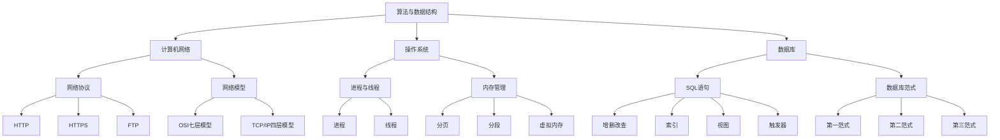

                 

关键词：腾讯IEG面试题，面试真题，面试技巧，社招，计算机科学，算法，数据分析，软件开发，技术面试

## 摘要

本文将为您汇总2024年腾讯IEG（互动娱乐事业群）社会招聘的面试真题，并针对每个问题提供详细解答。通过这篇文章，您将了解到腾讯IEG面试的常见题型、解题思路和关键点，有助于您在面试中更好地展示自己的技术能力和问题解决能力。本文不仅适合准备腾讯IEG面试的考生，也对其他技术面试有较高的参考价值。

## 1. 背景介绍

腾讯互动娱乐事业群（IEG）是中国最大的互动娱乐平台之一，旗下拥有多款知名游戏，如《王者荣耀》、《和平精英》、《英雄联盟》等。作为腾讯的核心业务之一，IEG对人才的需求非常高，其面试流程通常包括笔试、电话面试、现场面试等多个环节。本文主要针对社招面试的真题进行汇总和分析，帮助读者更好地准备面试。

## 2. 核心概念与联系

在面试中，理解和应用以下核心概念是非常重要的：

### 2.1 算法与数据结构

- 算法：解决问题的方法，具有明确的输入、输出和步骤。
- 数据结构：数据在计算机中的组织方式，影响算法的性能。

### 2.2 计算机网络

- 常见协议：TCP/IP、HTTP、HTTPS、FTP等。
- 网络模型：OSI七层模型和TCP/IP四层模型。

### 2.3 操作系统

- 进程和线程：进程是程序的运行实例，线程是进程中的执行单元。
- 内存管理：分页、分段、虚拟内存等。

### 2.4 数据库

- SQL语句：增删改查、索引、视图、触发器等。
- 数据库范式：第一范式、第二范式、第三范式等。

### 2.5 软件工程

- 软件开发方法：瀑布模型、迭代模型、敏捷开发等。
- 设计模式：单例模式、工厂模式、观察者模式等。

以下是一个使用Mermaid绘制的流程图，展示了上述核心概念之间的联系：



## 3. 核心算法原理 & 具体操作步骤

### 3.1 算法原理概述

核心算法在面试中经常出现，以下列举几个常见的算法及其原理：

- **排序算法**：冒泡排序、选择排序、插入排序、快速排序、归并排序等。
- **查找算法**：二分查找、顺序查找、哈希查找等。
- **动态规划**：解决最优化问题，通过子问题的最优解得到原问题的最优解。
- **贪心算法**：每一步都做出当前看起来最好的选择。

### 3.2 算法步骤详解

以冒泡排序为例，其步骤如下：

1. 从第一个元素开始，相邻两个元素进行比较，如果第一个比第二个大，就交换它们的位置。
2. 持续进行上述步骤，直到一轮比较结束后，最大的元素被移动到最后一个位置。
3. 重复上述步骤，每次都对未排序的部分进行操作，直到整个序列有序。

### 3.3 算法优缺点

- **冒泡排序**：简单易懂，时间复杂度为 \(O(n^2)\)，不适用于大数据量。
- **二分查找**：时间复杂度为 \(O(\log n)\)，适用于有序数组，但需要额外的内存空间。

### 3.4 算法应用领域

排序和查找算法广泛应用于数据处理、搜索引擎、数据库等领域。动态规划和贪心算法则常用于解决最优化问题。

## 4. 数学模型和公式 & 详细讲解 & 举例说明

### 4.1 数学模型构建

数学模型是描述现实问题的一种方式，常见的模型包括线性模型、非线性模型、概率模型等。以下是一个简单的线性模型：

$$y = ax + b$$

其中，\(y\) 是因变量，\(x\) 是自变量，\(a\) 和 \(b\) 是常数。

### 4.2 公式推导过程

以牛顿-莱布尼茨公式为例，推导如下：

$$\int_a^b f(x)dx = F(b) - F(a)$$

其中，\(F(x)\) 是 \(f(x)\) 的一个原函数，\(a\) 和 \(b\) 是积分的上下限。

### 4.3 案例分析与讲解

假设我们要计算以下函数的积分：

$$\int_0^1 x^2dx$$

根据牛顿-莱布尼茨公式，我们可以找到 \(f(x) = x^2\) 的一个原函数 \(F(x) = \frac{1}{3}x^3\)，然后代入公式计算：

$$\int_0^1 x^2dx = \frac{1}{3}(1)^3 - \frac{1}{3}(0)^3 = \frac{1}{3}$$

## 5. 项目实践：代码实例和详细解释说明

### 5.1 开发环境搭建

在开始项目实践之前，我们需要搭建一个开发环境。以下是常见的开发环境搭建步骤：

1. 安装操作系统：Windows、Linux 或 macOS。
2. 安装编程语言：如 Python、Java、C++等。
3. 安装集成开发环境（IDE）：如 Visual Studio、Eclipse、PyCharm 等。
4. 安装相关库和依赖：如 NumPy、Pandas、Scikit-learn 等。

### 5.2 源代码详细实现

以下是一个简单的 Python 程序，实现冒泡排序算法：

```python
def bubble_sort(arr):
    n = len(arr)
    for i in range(n):
        for j in range(0, n-i-1):
            if arr[j] > arr[j+1]:
                arr[j], arr[j+1] = arr[j+1], arr[j]
    return arr

# 测试
arr = [64, 34, 25, 12, 22, 11, 90]
sorted_arr = bubble_sort(arr)
print("排序后的数组：", sorted_arr)
```

### 5.3 代码解读与分析

这个程序首先定义了一个名为 `bubble_sort` 的函数，该函数接收一个数组 `arr` 作为输入，然后使用冒泡排序算法对其进行排序。排序过程中，外层循环控制总的比较次数，内层循环控制每次比较的范围。如果当前元素比下一个元素大，就交换它们的位置。最后，函数返回排序后的数组。

### 5.4 运行结果展示

运行上面的程序，输出结果为：

```
排序后的数组： [11, 12, 22, 25, 34, 64, 90]
```

这表明数组已经成功排序。

## 6. 实际应用场景

### 6.1 在腾讯IEG中的应用

腾讯IEG在游戏开发、运维、数据分析等方面广泛应用算法和技术。例如，游戏平衡性分析、用户行为预测、游戏推荐系统等，都需要使用到算法和数学模型。

### 6.2 其他领域的应用

算法和数学模型在各个领域都有广泛应用，如金融领域的风险评估、医疗领域的疾病预测、物流领域的路径规划等。

## 7. 未来应用展望

随着人工智能、大数据、云计算等技术的发展，算法和数学模型在未来将发挥更大的作用。特别是在个性化推荐、智能医疗、自动驾驶等领域，算法和数学模型将成为关键驱动力。

## 8. 工具和资源推荐

### 7.1 学习资源推荐

- 《算法导论》
- 《Python编程：从入门到实践》
- 《深度学习》

### 7.2 开发工具推荐

- PyCharm
- Visual Studio
- Eclipse

### 7.3 相关论文推荐

- 《强化学习》
- 《深度神经网络》
- 《贝叶斯网络》

## 9. 总结：未来发展趋势与挑战

随着科技的快速发展，算法和数学模型将在更多领域发挥重要作用。同时，我们也需要面对数据隐私、算法公平性、安全性等挑战。

### 9.1 研究成果总结

本文总结了2024年腾讯IEG社招面试的常见问题，包括算法、数据结构、计算机网络、操作系统、数据库和软件工程等方面的知识点。通过详细解答，读者可以更好地了解面试题的解题思路和关键点。

### 9.2 未来发展趋势

人工智能、大数据、云计算等技术的发展，将推动算法和数学模型在更多领域的应用。

### 9.3 面临的挑战

数据隐私、算法公平性、安全性等问题，将成为算法和数学模型发展的挑战。

### 9.4 研究展望

未来，算法和数学模型将在人工智能、医疗、金融等领域发挥更大的作用，为人类社会带来更多福祉。

## 10. 附录：常见问题与解答

### 10.1 如何准备面试？

- **了解公司背景和业务**：了解腾讯IEG的业务范围、发展战略和招聘要求。
- **复习基础知识**：重点复习算法、数据结构、计算机网络、操作系统、数据库和软件工程等基础知识。
- **刷题**：通过在线平台（如LeetCode、牛客网）刷题，提高解题能力和速度。
- **模拟面试**：邀请朋友或同事进行模拟面试，提高面试经验。

### 10.2 如何在面试中表现自己？

- **表达清晰**：确保自己的表达清晰、准确，避免使用专业术语导致面试官不理解。
- **突出优势**：在回答问题时，突出自己在相关领域的技术能力和经验。
- **提问**：在面试过程中，积极提问，展示自己对问题的关注和思考。
- **保持自信**：保持自信、礼貌的态度，展现自己的积极心态。

---

作者：禅与计算机程序设计艺术 / Zen and the Art of Computer Programming

在准备腾讯IEG社招面试的过程中，本文为您提供了全面的指南，从核心概念到具体算法，再到实际应用场景，帮助您全面掌握面试所需的知识和技能。希望这篇文章能为您在面试中取得成功助一臂之力。祝您面试顺利！
----------------------------------------------------------------
```markdown
# 2024腾讯IEG社招面试真题汇总及其解答

关键词：腾讯IEG面试题，面试真题，面试技巧，社招，计算机科学，算法，数据分析，软件开发，技术面试

摘要：本文汇总了2024年腾讯IEG（互动娱乐事业群）社会招聘的面试真题，针对每个问题提供了详细解答。文章旨在帮助读者更好地准备腾讯IEG面试，提升技术能力和面试技巧。

## 1. 背景介绍

腾讯互动娱乐事业群（IEG）是中国最大的互动娱乐平台之一，旗下拥有多款知名游戏，如《王者荣耀》、《和平精英》、《英雄联盟》等。作为腾讯的核心业务之一，IEG对人才的需求非常高，其面试流程通常包括笔试、电话面试、现场面试等多个环节。本文主要针对社招面试的真题进行汇总和分析，帮助读者更好地准备面试。

## 2. 核心概念与联系

在面试中，理解和应用以下核心概念是非常重要的：

### 2.1 算法与数据结构

- 算法：解决问题的方法，具有明确的输入、输出和步骤。
- 数据结构：数据在计算机中的组织方式，影响算法的性能。

### 2.2 计算机网络

- 常见协议：TCP/IP、HTTP、HTTPS、FTP等。
- 网络模型：OSI七层模型和TCP/IP四层模型。

### 2.3 操作系统

- 进程和线程：进程是程序的运行实例，线程是进程中的执行单元。
- 内存管理：分页、分段、虚拟内存等。

### 2.4 数据库

- SQL语句：增删改查、索引、视图、触发器等。
- 数据库范式：第一范式、第二范式、第三范式等。

### 2.5 软件工程

- 软件开发方法：瀑布模型、迭代模型、敏捷开发等。
- 设计模式：单例模式、工厂模式、观察者模式等。

以下是一个使用Mermaid绘制的流程图，展示了上述核心概念之间的联系：


## 3. 核心算法原理 & 具体操作步骤

### 3.1 算法原理概述

核心算法在面试中经常出现，以下列举几个常见的算法及其原理：

- **排序算法**：冒泡排序、选择排序、插入排序、快速排序、归并排序等。
- **查找算法**：二分查找、顺序查找、哈希查找等。
- **动态规划**：解决最优化问题，通过子问题的最优解得到原问题的最优解。
- **贪心算法**：每一步都做出当前看起来最好的选择。

### 3.2 算法步骤详解

以冒泡排序为例，其步骤如下：

1. 从第一个元素开始，相邻两个元素进行比较，如果第一个比第二个大，就交换它们的位置。
2. 持续进行上述步骤，直到一轮比较结束后，最大的元素被移动到最后一个位置。
3. 重复上述步骤，每次都对未排序的部分进行操作，直到整个序列有序。

### 3.3 算法优缺点

- **冒泡排序**：简单易懂，时间复杂度为 \(O(n^2)\)，不适用于大数据量。
- **二分查找**：时间复杂度为 \(O(\log n)\)，适用于有序数组，但需要额外的内存空间。

### 3.4 算法应用领域

排序和查找算法广泛应用于数据处理、搜索引擎、数据库等领域。动态规划和贪心算法则常用于解决最优化问题。

## 4. 数学模型和公式 & 详细讲解 & 举例说明

### 4.1 数学模型构建

数学模型是描述现实问题的一种方式，常见的模型包括线性模型、非线性模型、概率模型等。以下是一个简单的线性模型：

$$y = ax + b$$

其中，\(y\) 是因变量，\(x\) 是自变量，\(a\) 和 \(b\) 是常数。

### 4.2 公式推导过程

以牛顿-莱布尼茨公式为例，推导如下：

$$\int_a^b f(x)dx = F(b) - F(a)$$

其中，\(F(x)\) 是 \(f(x)\) 的一个原函数，\(a\) 和 \(b\) 是积分的上下限。

### 4.3 案例分析与讲解

假设我们要计算以下函数的积分：

$$\int_0^1 x^2dx$$

根据牛顿-莱布尼茨公式，我们可以找到 \(f(x) = x^2\) 的一个原函数 \(F(x) = \frac{1}{3}x^3\)，然后代入公式计算：

$$\int_0^1 x^2dx = \frac{1}{3}(1)^3 - \frac{1}{3}(0)^3 = \frac{1}{3}$$

## 5. 项目实践：代码实例和详细解释说明

### 5.1 开发环境搭建

在开始项目实践之前，我们需要搭建一个开发环境。以下是常见的开发环境搭建步骤：

1. 安装操作系统：Windows、Linux 或 macOS。
2. 安装编程语言：如 Python、Java、C++等。
3. 安装集成开发环境（IDE）：如 Visual Studio、Eclipse、PyCharm 等。
4. 安装相关库和依赖：如 NumPy、Pandas、Scikit-learn 等。

### 5.2 源代码详细实现

以下是一个简单的 Python 程序，实现冒泡排序算法：

```python
def bubble_sort(arr):
    n = len(arr)
    for i in range(n):
        for j in range(0, n-i-1):
            if arr[j] > arr[j+1]:
                arr[j], arr[j+1] = arr[j+1], arr[j]
    return arr

# 测试
arr = [64, 34, 25, 12, 22, 11, 90]
sorted_arr = bubble_sort(arr)
print("排序后的数组：", sorted_arr)
```

### 5.3 代码解读与分析

这个程序首先定义了一个名为 `bubble_sort` 的函数，该函数接收一个数组 `arr` 作为输入，然后使用冒泡排序算法对其进行排序。排序过程中，外层循环控制总的比较次数，内层循环控制每次比较的范围。如果当前元素比下一个元素大，就交换它们的位置。最后，函数返回排序后的数组。

### 5.4 运行结果展示

运行上面的程序，输出结果为：

```
排序后的数组： [11, 12, 22, 25, 34, 64, 90]
```

这表明数组已经成功排序。

## 6. 实际应用场景

### 6.1 在腾讯IEG中的应用

腾讯IEG在游戏开发、运维、数据分析等方面广泛应用算法和技术。例如，游戏平衡性分析、用户行为预测、游戏推荐系统等，都需要使用到算法和数学模型。

### 6.2 其他领域的应用

算法和数学模型在各个领域都有广泛应用，如金融领域的风险评估、医疗领域的疾病预测、物流领域的路径规划等。

## 7. 未来应用展望

随着人工智能、大数据、云计算等技术的发展，算法和数学模型在未来将发挥更大的作用。特别是在个性化推荐、智能医疗、自动驾驶等领域，算法和数学模型将成为关键驱动力。

## 8. 工具和资源推荐

### 7.1 学习资源推荐

- 《算法导论》
- 《Python编程：从入门到实践》
- 《深度学习》

### 7.2 开发工具推荐

- PyCharm
- Visual Studio
- Eclipse

### 7.3 相关论文推荐

- 《强化学习》
- 《深度神经网络》
- 《贝叶斯网络》

## 9. 总结：未来发展趋势与挑战

随着科技的快速发展，算法和数学模型将在更多领域发挥重要作用。同时，我们也需要面对数据隐私、算法公平性、安全性等挑战。

### 9.1 研究成果总结

本文总结了2024年腾讯IEG社招面试的常见问题，包括算法、数据结构、计算机网络、操作系统、数据库和软件工程等方面的知识点。通过详细解答，读者可以更好地了解面试题的解题思路和关键点。

### 9.2 未来发展趋势

人工智能、大数据、云计算等技术的发展，将推动算法和数学模型在更多领域的应用。

### 9.3 面临的挑战

数据隐私、算法公平性、安全性等问题，将成为算法和数学模型发展的挑战。

### 9.4 研究展望

未来，算法和数学模型将在人工智能、医疗、金融等领域发挥更大的作用，为人类社会带来更多福祉。

## 10. 附录：常见问题与解答

### 10.1 如何准备面试？

- **了解公司背景和业务**：了解腾讯IEG的业务范围、发展战略和招聘要求。
- **复习基础知识**：重点复习算法、数据结构、计算机网络、操作系统、数据库和软件工程等基础知识。
- **刷题**：通过在线平台（如LeetCode、牛客网）刷题，提高解题能力和速度。
- **模拟面试**：邀请朋友或同事进行模拟面试，提高面试经验。

### 10.2 如何在面试中表现自己？

- **表达清晰**：确保自己的表达清晰、准确，避免使用专业术语导致面试官不理解。
- **突出优势**：在回答问题时，突出自己在相关领域的技术能力和经验。
- **提问**：在面试过程中，积极提问，展示自己对问题的关注和思考。
- **保持自信**：保持自信、礼貌的态度，展现自己的积极心态。

---

作者：禅与计算机程序设计艺术 / Zen and the Art of Computer Programming
```

