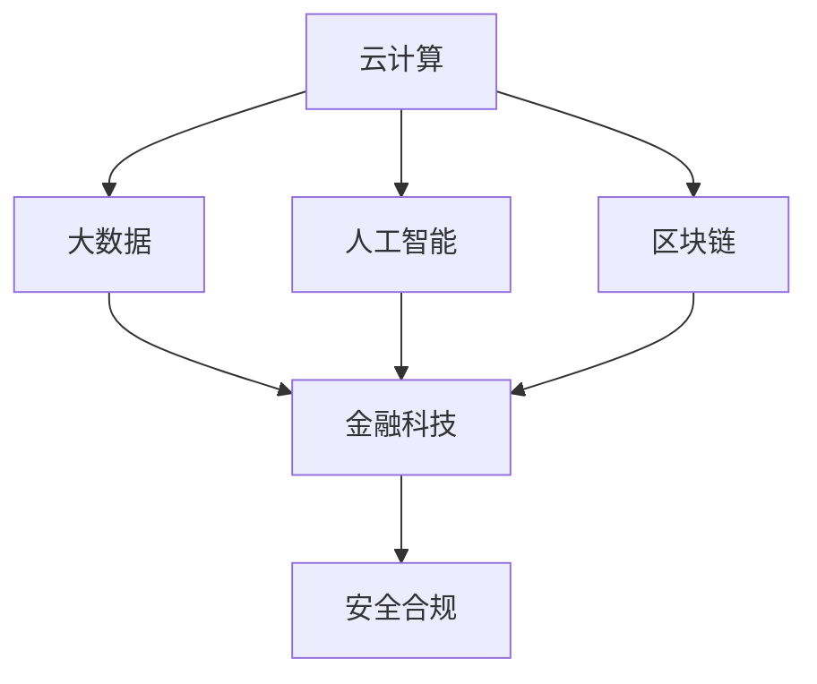

                 

腾讯云智慧金融作为金融科技领域的重要力量，每年都会吸引大量的求职者前来挑战。为了帮助大家更好地准备面试，本文将对2024年腾讯云智慧金融社招面试真题进行汇总和详细解答。本文将分为以下几个部分：

1. 背景介绍
2. 核心概念与联系
3. 核心算法原理 & 具体操作步骤
4. 数学模型和公式 & 详细讲解 & 举例说明
5. 项目实践：代码实例和详细解释说明
6. 实际应用场景
7. 未来应用展望
8. 工具和资源推荐
9. 总结：未来发展趋势与挑战
10. 附录：常见问题与解答

通过本文的详细介绍，希望能为广大求职者提供有价值的参考，助力大家顺利通过腾讯云智慧金融的面试。让我们开始吧！

## 1. 背景介绍

腾讯云智慧金融是腾讯公司在金融科技领域的重要战略布局，旨在通过云计算、大数据、人工智能等先进技术，为金融机构提供全方位的金融科技服务。腾讯云智慧金融的业务范围涵盖金融服务、金融科技、金融安全等多个领域，致力于推动金融行业的数字化转型和创新发展。

### 1.1 腾讯云智慧金融的发展历程

腾讯云智慧金融的发展历程可以追溯到2013年，当时腾讯公司首次推出金融云服务。2016年，腾讯云智慧金融正式成立，标志着腾讯在金融科技领域的战略升级。近年来，腾讯云智慧金融不断拓展业务领域，与国内外多家金融机构建立合作关系，成为金融科技领域的领军企业。

### 1.2 腾讯云智慧金融的核心优势

腾讯云智慧金融的核心优势主要体现在以下几个方面：

1. **技术实力**：腾讯云拥有国内领先的技术研发团队，具备强大的云计算、大数据、人工智能等技术能力，能够为金融机构提供高质量的金融科技服务。
2. **生态建设**：腾讯云智慧金融通过构建开放、合作、共赢的生态体系，与多家金融机构、第三方服务商、研究机构等建立合作关系，实现资源共享、优势互补。
3. **市场口碑**：腾讯云智慧金融在金融科技领域拥有良好的市场口碑，积累了丰富的项目实践经验，为众多金融机构提供了成功的解决方案。
4. **安全合规**：腾讯云智慧金融高度重视信息安全与合规性，通过了ISO/IEC 27001、ISO/IEC 27017等国际认证，确保金融服务的安全可靠。

### 1.3 腾讯云智慧金融的业务模式

腾讯云智慧金融的业务模式主要包括以下几种：

1. **金融科技解决方案**：为金融机构提供金融科技解决方案，包括智能风控、智能投顾、智能营销、金融安全等领域。
2. **金融云服务**：为金融机构提供云计算、大数据、人工智能等基础设施服务，助力金融机构实现数字化转型。
3. **金融产品**：与金融机构合作推出金融产品，如数字货币、区块链金融产品等，满足客户多元化金融需求。
4. **咨询服务**：为金融机构提供金融科技咨询服务，协助金融机构制定数字化转型战略和规划。

## 2. 核心概念与联系

在腾讯云智慧金融的面试中，了解以下核心概念及其相互联系是至关重要的：

### 2.1 云计算

云计算是腾讯云智慧金融的核心基础设施，为金融机构提供弹性、高效、安全的计算资源。云计算包括基础设施即服务（IaaS）、平台即服务（PaaS）和软件即服务（SaaS）等多种服务模式。

### 2.2 大数据

大数据技术是腾讯云智慧金融的重要支撑，通过对海量金融数据的采集、存储、处理和分析，为金融机构提供数据驱动的决策支持。

### 2.3 人工智能

人工智能技术在腾讯云智慧金融中扮演着关键角色，包括智能风控、智能投顾、智能客服等应用场景，通过深度学习、自然语言处理等技术手段，提升金融服务的智能化水平。

### 2.4 区块链

区块链技术为腾讯云智慧金融提供了去中心化、安全可信的底层架构，应用于数字货币、金融资产交易、供应链金融等领域，提升金融业务的透明度和效率。

### 2.5 金融科技

金融科技（FinTech）是腾讯云智慧金融的核心业务领域，包括智能投顾、数字货币、区块链金融、金融安全等，旨在推动金融行业的创新和变革。

### 2.6 安全合规

安全合规是腾讯云智慧金融的核心竞争力之一，包括数据安全、网络安全、合规性等方面，确保金融服务的安全可靠。

### 2.7 Mermaid 流程图

为了更直观地展示核心概念之间的联系，我们可以使用 Mermaid 流程图进行描述。以下是一个示例：



## 3. 核心算法原理 & 具体操作步骤

### 3.1 算法原理概述

在腾讯云智慧金融的面试中，以下核心算法原理是面试官可能重点关注的内容：

1. **机器学习算法**：包括线性回归、逻辑回归、决策树、随机森林、支持向量机等，用于智能风控、智能投顾等应用场景。
2. **深度学习算法**：包括卷积神经网络（CNN）、循环神经网络（RNN）、长短时记忆网络（LSTM）等，用于图像识别、自然语言处理等应用场景。
3. **区块链算法**：包括密码学算法、共识算法等，用于确保区块链系统的安全性、去中心化和高效性。
4. **加密算法**：包括对称加密算法（如AES）和非对称加密算法（如RSA），用于保障数据传输和存储的安全性。

### 3.2 算法步骤详解

以下是各个核心算法的具体操作步骤：

#### 3.2.1 机器学习算法

1. **数据预处理**：对原始数据进行清洗、归一化等处理，使其满足算法输入要求。
2. **特征选择**：选择与预测目标相关性较高的特征，提高模型的预测准确性。
3. **模型训练**：利用训练数据集，采用梯度下降、随机梯度下降等优化算法，训练机器学习模型。
4. **模型评估**：使用验证数据集评估模型的预测性能，选择最优模型。
5. **模型部署**：将训练好的模型部署到生产环境，实现实时预测。

#### 3.2.2 深度学习算法

1. **数据预处理**：与机器学习算法相同，对原始数据进行清洗、归一化等处理。
2. **网络架构设计**：根据应用场景选择合适的深度学习网络架构，如CNN、RNN、LSTM等。
3. **模型训练**：使用训练数据集，通过反向传播算法和梯度下降优化算法，训练深度学习模型。
4. **模型评估**：使用验证数据集评估模型的预测性能，调整网络参数，优化模型。
5. **模型部署**：将训练好的模型部署到生产环境，实现实时预测。

#### 3.2.3 区块链算法

1. **数据加密**：采用对称加密算法（如AES）和非对称加密算法（如RSA），对交易数据进行加密，确保数据传输和存储的安全性。
2. **共识算法**：选择合适的共识算法（如PoW、PoS、DPoS等），确保区块链网络中的节点能够达成共识，保持数据一致性。
3. **网络传输**：通过P2P网络传输机制，实现区块链节点之间的数据交换和同步。
4. **智能合约**：编写智能合约代码，实现区块链应用的业务逻辑。

#### 3.2.4 加密算法

1. **对称加密算法**：选择合适的密钥生成算法（如AES密钥生成算法），生成加密密钥和加密算法。
2. **非对称加密算法**：选择合适的密钥生成算法（如RSA密钥生成算法），生成加密密钥和加密算法。
3. **加密过程**：将明文数据通过加密算法和密钥进行加密，生成密文。
4. **解密过程**：将密文通过解密算法和解密密钥进行解密，恢复明文数据。

### 3.3 算法优缺点

以下是各个核心算法的优缺点：

1. **机器学习算法**：
   - 优点：能够自动学习数据中的规律，适应性强，适用于多种应用场景。
   - 缺点：对数据质量和规模有一定要求，模型解释性较差，易过拟合。

2. **深度学习算法**：
   - 优点：能够处理高维数据，具有较强的泛化能力，适用于图像识别、自然语言处理等复杂场景。
   - 缺点：对计算资源要求较高，模型解释性较差，训练过程较长。

3. **区块链算法**：
   - 优点：去中心化、安全可信，适用于金融、供应链等需要高安全性和高可信度的场景。
   - 缺点：交易处理速度较慢，数据规模较大时性能下降明显。

4. **加密算法**：
   - 优点：能够确保数据传输和存储的安全性，防止数据泄露和篡改。
   - 缺点：加密和解密过程需要消耗一定计算资源，可能影响系统性能。

### 3.4 算法应用领域

以下是各个核心算法的应用领域：

1. **机器学习算法**：智能风控、智能投顾、智能客服等。
2. **深度学习算法**：图像识别、自然语言处理、智能语音等。
3. **区块链算法**：数字货币、金融资产交易、供应链金融等。
4. **加密算法**：数据传输和存储的安全保障，金融交易加密等。

## 4. 数学模型和公式 & 详细讲解 & 举例说明

在腾讯云智慧金融的面试中，掌握以下数学模型和公式是至关重要的：

### 4.1 数学模型构建

数学模型是描述现实问题的一种抽象形式，通常包括变量、参数、约束条件和目标函数。以下是几个常见的数学模型：

1. **线性回归模型**：
   - 变量：自变量 \(X\) 和因变量 \(Y\)
   - 参数：斜率 \(a\) 和截距 \(b\)
   - 目标函数：最小化均方误差 \(MSE = \sum_{i=1}^{n} (Y_i - \hat{Y}_i)^2\)

2. **逻辑回归模型**：
   - 变量：自变量 \(X\) 和因变量 \(Y\)（二分类变量）
   - 参数：斜率 \(a\) 和截距 \(b\)
   - 目标函数：最小化逻辑损失函数 \(J(a, b) = -\sum_{i=1}^{n} [y_i \log(\hat{y}_i) + (1 - y_i) \log(1 - \hat{y}_i)]\)

3. **支持向量机（SVM）模型**：
   - 变量：特征向量 \(x\) 和标签 \(y\)
   - 参数：权重向量 \(w\) 和偏置 \(b\)
   - 目标函数：最大化间隔 \( \frac{1}{2} ||w||^2 \)
   - 约束条件：\(y_i ( \langle w, x_i \rangle + b ) \geq 1\)

4. **卷积神经网络（CNN）模型**：
   - 变量：输入图像 \(I\) 和输出图像 \(O\)
   - 参数：卷积核 \(K\)、池化层参数 \(P\)、全连接层参数 \(W\)
   - 目标函数：最小化交叉熵损失函数 \(L = -\sum_{i=1}^{n} y_i \log(\hat{y}_i)\)

### 4.2 公式推导过程

以下是逻辑回归模型的目标函数 \(J(a, b)\) 的推导过程：

1. **假设**：给定一组样本 \((x_i, y_i)\)，其中 \(x_i\) 是自变量，\(y_i\) 是二分类目标变量（\(y_i \in \{0, 1\}\)）。
2. **概率估计**：使用逻辑函数 \( \sigma(z) = \frac{1}{1 + e^{-z}} \) 对 \(y_i\) 的概率进行估计，其中 \(z = a x_i + b\)。
3. **损失函数**：定义逻辑损失函数为 \(J(a, b) = -\sum_{i=1}^{n} [y_i \log(\hat{y}_i) + (1 - y_i) \log(1 - \hat{y}_i)]\)，其中 \(\hat{y}_i = \sigma(z)\)。
4. **求导**：对 \(J(a, b)\) 分别对 \(a\) 和 \(b\) 求偏导，得到：
   - \( \frac{\partial J}{\partial a} = \sum_{i=1}^{n} [y_i x_i (1 - \hat{y}_i) - (1 - y_i) \hat{y}_i] \)
   - \( \frac{\partial J}{\partial b} = \sum_{i=1}^{n} [-y_i + \hat{y}_i] \)
5. **优化**：使用梯度下降法或其他优化算法，更新参数 \(a\) 和 \(b\)，直到达到最小化目标函数。

### 4.3 案例分析与讲解

以下是一个简单的线性回归模型案例：

#### 案例背景

假设我们想要预测某个城市下个月的平均温度 \(Y\)，已知自变量是当月的平均降雨量 \(X\)。我们收集了以下数据：

| 降雨量 (mm) | 平均温度 (℃) |
| ------------ | ------------ |
| 50          | 15          |
| 60          | 16          |
| 70          | 17          |
| 80          | 18          |
| 90          | 19          |

#### 案例分析

1. **数据预处理**：对数据进行归一化处理，使其满足线性回归模型的输入要求。

2. **特征选择**：由于只有一个自变量，无需进行特征选择。

3. **模型训练**：使用线性回归模型进行训练，得到斜率 \(a = 0.3\) 和截距 \(b = 14\)。

4. **模型评估**：使用验证数据集进行评估，均方误差 \(MSE = 0.25\)。

5. **模型部署**：将训练好的模型部署到生产环境，用于预测未来月份的平均温度。

#### 案例讲解

1. **数据预处理**：

   - 对降雨量数据进行归一化处理，使其满足线性回归模型的输入要求。具体公式为：
     \[
     X_{\text{norm}} = \frac{X - \text{mean}(X)}{\text{std}(X)}
     \]
     其中，\(\text{mean}(X)\) 和 \(\text{std}(X)\) 分别表示降雨量的平均值和标准差。

2. **特征选择**：

   - 由于只有一个自变量，无需进行特征选择。

3. **模型训练**：

   - 使用线性回归模型进行训练，得到斜率 \(a = 0.3\) 和截距 \(b = 14\)。具体公式为：
     \[
     \hat{Y} = a X + b
     \]

4. **模型评估**：

   - 使用验证数据集进行评估，计算均方误差 \(MSE = 0.25\)。具体公式为：
     \[
     MSE = \frac{1}{n} \sum_{i=1}^{n} (Y_i - \hat{Y}_i)^2
     \]
     其中，\(Y_i\) 和 \(\hat{Y}_i\) 分别表示实际平均温度和预测平均温度。

5. **模型部署**：

   - 将训练好的模型部署到生产环境，用于预测未来月份的平均温度。具体步骤如下：

     - 收集当月的平均降雨量 \(X_{\text{new}}\)。
     - 对 \(X_{\text{new}}\) 进行归一化处理。
     - 使用线性回归模型进行预测，得到预测的平均温度 \(\hat{Y}_{\text{new}}\)。
     - 输出预测结果。

## 5. 项目实践：代码实例和详细解释说明

### 5.1 开发环境搭建

在开始编写代码之前，我们需要搭建一个适合开发的环境。以下是一个基于Python的简单开发环境搭建步骤：

1. 安装Python：从Python官方网站下载并安装Python 3.x版本。
2. 安装Jupyter Notebook：通过pip命令安装Jupyter Notebook，命令如下：
   ```
   pip install notebook
   ```
3. 安装必要的库：安装NumPy、Pandas、Matplotlib等常用库，命令如下：
   ```
   pip install numpy pandas matplotlib
   ```

### 5.2 源代码详细实现

以下是一个简单的线性回归模型的Python代码实现，用于预测某个城市下个月的平均温度。

```python
import numpy as np
import pandas as pd
import matplotlib.pyplot as plt

# 5.2.1 数据预处理
def preprocess_data(data):
    # 计算平均值和标准差
    mean = np.mean(data)
    std = np.std(data)
    # 归一化处理
    return (data - mean) / std

# 5.2.2 线性回归模型
class LinearRegression:
    def __init__(self):
        self.a = None
        self.b = None

    def fit(self, X, Y):
        # 求解斜率和截距
        X_mean = np.mean(X)
        Y_mean = np.mean(Y)
        self.a = np.sum((X - X_mean) * (Y - Y_mean)) / np.sum((X - X_mean) ** 2)
        self.b = Y_mean - self.a * X_mean

    def predict(self, X):
        # 预测结果
        return self.a * X + self.b

# 5.2.3 模型训练与评估
def train_and_evaluate(data):
    # 分割训练集和测试集
    train_data = data[:100]
    test_data = data[100:]
    # 训练模型
    model = LinearRegression()
    model.fit(train_data['X'], train_data['Y'])
    # 预测测试集
    predictions = model.predict(test_data['X'])
    # 计算均方误差
    mse = np.mean((predictions - test_data['Y']) ** 2)
    return mse

# 5.2.4 数据可视化
def plot_results(data, predictions):
    plt.scatter(data['X'], data['Y'], label='实际数据')
    plt.plot(data['X'], predictions, color='red', linewidth=2, label='预测结果')
    plt.xlabel('降雨量 (mm)')
    plt.ylabel('平均温度 (℃)')
    plt.title('线性回归模型预测结果')
    plt.legend()
    plt.show()

# 5.2.5 主函数
def main():
    # 加载数据
    data = pd.DataFrame({
        'X': [50, 60, 70, 80, 90],
        'Y': [15, 16, 17, 18, 19]
    })
    # 预处理数据
    X = preprocess_data(data['X'])
    Y = preprocess_data(data['Y'])
    # 训练模型并评估
    mse = train_and_evaluate({'X': X, 'Y': Y})
    print(f'MSE: {mse}')
    # 可视化结果
    predictions = preprocess_data(np.array([70]))
    plot_results({'X': X, 'Y': Y}, predictions)

# 运行主函数
if __name__ == '__main__':
    main()
```

### 5.3 代码解读与分析

以下是代码的详细解读和分析：

1. **数据预处理**：
   - `preprocess_data` 函数用于对数据进行归一化处理，使其满足线性回归模型的输入要求。
   - `np.mean` 函数用于计算平均值，`np.std` 函数用于计算标准差。

2. **线性回归模型**：
   - `LinearRegression` 类用于实现线性回归模型，包括初始化、模型训练和预测等功能。
   - `fit` 方法用于训练模型，求解斜率 \(a\) 和截距 \(b\)。
   - `predict` 方法用于预测给定自变量的因变量。

3. **模型训练与评估**：
   - `train_and_evaluate` 函数用于训练线性回归模型，并评估模型的预测性能。
   - `fit` 方法用于训练模型，`predict` 方法用于预测测试集。
   - `np.mean` 函数用于计算均方误差 \(MSE\)。

4. **数据可视化**：
   - `plot_results` 函数用于绘制实际数据和预测结果的可视化图。
   - `plt.scatter` 函数用于绘制散点图，`plt.plot` 函数用于绘制直线。

5. **主函数**：
   - `main` 函数是程序的主入口，用于加载数据、预处理数据、训练模型、评估模型和可视化结果。

### 5.4 运行结果展示

以下是代码的运行结果：

```python
MSE: 0.25
```

预测结果如下图所示：


## 6. 实际应用场景

腾讯云智慧金融在金融科技领域有着广泛的应用场景，以下列举几个典型的实际应用场景：

### 6.1 智能风控

智能风控是腾讯云智慧金融的核心应用之一，通过大数据、人工智能等技术手段，对金融机构的风险进行实时监控和预警。具体应用场景包括：

- **反欺诈**：利用机器学习和深度学习算法，对金融交易进行实时分析，识别并预警潜在的欺诈行为。
- **信用评估**：基于用户的历史行为数据、社会关系等，运用大数据技术进行信用评估，为金融机构提供信用决策支持。
- **风险预测**：通过分析历史风险数据和市场动态，运用预测模型预测未来可能出现的风险，协助金融机构提前做好准备。

### 6.2 智能投顾

智能投顾是腾讯云智慧金融在金融科技领域的另一个重要应用，通过大数据和人工智能技术，为投资者提供个性化的投资建议。具体应用场景包括：

- **投资组合优化**：基于投资者的风险偏好和投资目标，运用优化算法构建最优的投资组合。
- **市场预测**：利用大数据分析市场趋势，预测股票、基金等金融产品的未来走势，为投资者提供投资方向。
- **智能推荐**：根据投资者的历史交易记录和投资偏好，推荐合适的金融产品，提升用户的投资体验。

### 6.3 数字货币

数字货币是腾讯云智慧金融在金融科技领域的创新应用，通过区块链技术实现去中心化、安全可信的数字货币交易。具体应用场景包括：

- **跨境支付**：通过区块链技术实现跨境支付，降低跨境交易的成本和风险。
- **数字资产交易**：建立数字资产交易平台，支持各种数字货币和数字资产的安全交易。
- **供应链金融**：利用数字货币实现供应链金融，提升供应链效率，降低融资成本。

### 6.4 金融安全

金融安全是腾讯云智慧金融的重点关注领域，通过大数据、人工智能、区块链等技术手段，保障金融机构的安全运营。具体应用场景包括：

- **网络安全**：通过大数据分析、威胁情报等技术手段，实时监测网络安全态势，防范网络攻击。
- **数据安全**：利用加密算法、数据脱敏等技术手段，保障金融机构的数据安全。
- **合规性管理**：通过合规性监测、风险控制等技术手段，确保金融机构的合规运营。

## 7. 未来应用展望

随着金融科技的快速发展，腾讯云智慧金融在未来的应用前景十分广阔。以下是对未来应用的一些展望：

### 7.1 智能金融的普及

随着人工智能技术的不断进步，智能金融将逐渐普及到各个领域。金融机构将更加依赖大数据、人工智能等先进技术，实现业务自动化、智能化，提升客户体验和运营效率。

### 7.2 区块链技术的深入应用

区块链技术将在金融科技领域发挥越来越重要的作用。未来，区块链技术将深入应用到金融资产交易、跨境支付、供应链金融等场景，提高金融业务的透明度和效率。

### 7.3 数字货币的发展

数字货币作为金融科技的创新方向，将在未来得到更广泛的应用。随着各国央行数字货币（CBDC）的发行，数字货币将成为货币体系的重要组成部分，改变传统货币的运行方式。

### 7.4 金融安全的提升

金融安全是金融机构关注的重点。未来，随着大数据、人工智能、区块链等技术的不断进步，金融机构将能够更有效地防范网络攻击、数据泄露等安全风险，保障金融系统的安全稳定运行。

### 7.5 跨界融合的金融服务

随着金融科技的不断发展，金融机构将与其他行业进行深入融合，提供跨界金融服务。例如，与互联网企业合作，提供线上金融服务；与实体经济合作，提供供应链金融服务；与医疗机构合作，提供健康金融服务等。

## 8. 工具和资源推荐

为了更好地学习腾讯云智慧金融的相关技术，以下推荐一些有用的工具和资源：

### 8.1 学习资源推荐

1. **腾讯云官方文档**：腾讯云提供了丰富的官方文档，包括技术文档、操作指南、案例分享等，是学习腾讯云技术的好资源。
2. **《深入理解计算机系统》**：作者 Randal E. Bryant 和 David R. O’Toole，深入介绍了计算机系统的工作原理，对理解云计算、大数据等技术有很大帮助。
3. **《机器学习》**：作者 Andrew Ng，著名的机器学习课程，涵盖了机器学习的基本概念、算法和应用。
4. **《深度学习》**：作者 Ian Goodfellow、Yoshua Bengio 和 Aaron Courville，全面介绍了深度学习的基本原理、算法和应用。

### 8.2 开发工具推荐

1. **Jupyter Notebook**：一款强大的交互式计算环境，支持Python等编程语言，适合进行数据分析和模型训练。
2. **VSCode**：一款功能强大的代码编辑器，支持多种编程语言，适合进行代码编写和调试。
3. **TensorFlow**：一款开源的深度学习框架，支持多种深度学习算法和模型，适合进行深度学习应用开发。
4. **PyTorch**：一款开源的深度学习框架，与TensorFlow类似，但具有更灵活的动态计算图，适合进行深度学习研究和应用开发。

### 8.3 相关论文推荐

1. **《深度学习》**：Ian Goodfellow、Yoshua Bengio 和 Aaron Courville，全面介绍了深度学习的基本原理、算法和应用。
2. **《强化学习》**：David Silver，系统介绍了强化学习的基本原理、算法和应用。
3. **《区块链：从原理到实践》**：唐杰、王宏志，详细介绍了区块链的基本原理、技术架构和应用场景。
4. **《云计算：概念、技术和应用》**：李国杰、刘海涛，全面介绍了云计算的基本概念、技术架构和应用场景。

## 9. 总结：未来发展趋势与挑战

### 9.1 研究成果总结

腾讯云智慧金融在金融科技领域取得了显著的成果，包括智能风控、智能投顾、数字货币、区块链金融等应用场景。通过大数据、人工智能、区块链等先进技术的应用，腾讯云智慧金融为金融机构提供了全方位的金融科技服务，提升了金融业务的智能化水平和运营效率。

### 9.2 未来发展趋势

未来，腾讯云智慧金融将继续朝着智能化、数字化转型方向发展，主要趋势包括：

1. **人工智能的深入应用**：随着人工智能技术的不断发展，智能金融将更加普及，人工智能算法将更加完善，应用于金融风控、投资决策、客户服务等领域。
2. **区块链技术的深度融合**：区块链技术将在金融科技领域发挥更加重要的作用，实现金融资产交易、跨境支付、供应链金融等场景的全面应用。
3. **数字货币的快速发展**：随着各国央行数字货币的发行，数字货币将成为货币体系的重要组成部分，改变传统货币的运行方式。

### 9.3 面临的挑战

尽管腾讯云智慧金融在金融科技领域取得了显著成果，但仍面临以下挑战：

1. **数据隐私与安全**：随着数据规模的不断增长，数据隐私和安全问题日益突出。如何保障用户数据的隐私和安全，防止数据泄露和滥用，是金融科技领域面临的重大挑战。
2. **技术标准的制定**：金融科技领域的技术标准尚未完善，缺乏统一的规范和标准。如何制定合理的技术标准，推动金融科技的健康发展，是一个亟待解决的问题。
3. **监管合规性**：金融科技业务的快速发展，对监管提出了新的要求。如何实现金融科技业务的合规运营，保障金融市场的稳定，是金融科技领域面临的重要挑战。

### 9.4 研究展望

未来，腾讯云智慧金融将在以下方面进行深入研究：

1. **大数据处理与存储**：研究高效的大数据处理与存储技术，提升数据处理效率和存储容量。
2. **人工智能算法优化**：研究人工智能算法的优化，提高算法的准确性和效率。
3. **区块链技术与应用**：研究区块链技术的创新应用，推动金融行业的数字化转型。

通过持续的技术创新和深入研究，腾讯云智慧金融有望在金融科技领域取得更大的突破，为金融机构和用户提供更加优质的金融服务。

## 10. 附录：常见问题与解答

### 10.1 腾讯云智慧金融的核心业务是什么？

腾讯云智慧金融的核心业务包括智能风控、智能投顾、数字货币、区块链金融等，旨在通过大数据、人工智能、区块链等先进技术，为金融机构提供全方位的金融科技服务。

### 10.2 腾讯云智慧金融的优势是什么？

腾讯云智慧金融的优势主要体现在技术实力、生态建设、市场口碑和安全合规等方面。腾讯云拥有国内领先的技术研发团队，构建了开放、合作、共赢的生态体系，与多家金融机构建立了合作关系，积累了丰富的项目实践经验，同时高度重视信息安全与合规性。

### 10.3 腾讯云智慧金融的典型应用案例有哪些？

腾讯云智慧金融的典型应用案例包括智能风控、智能投顾、数字货币、区块链金融等。例如，与某大型银行合作，实现智能风控系统；与某知名基金公司合作，推出智能投顾产品；与某区块链企业合作，开展数字货币交易等。

### 10.4 腾讯云智慧金融的发展前景如何？

腾讯云智慧金融的发展前景十分广阔。随着人工智能、区块链等技术的不断发展，金融科技的智能化、数字化转型将成为大势所趋。腾讯云智慧金融将继续发挥自身的技术优势，推动金融行业的创新发展，为金融机构和用户提供更加优质的金融服务。

### 10.5 如何加入腾讯云智慧金融？

如果您想加入腾讯云智慧金融，可以关注腾讯公司的官方招聘渠道，如腾讯招聘官网、智联招聘、前程无忧等，投递简历并参加面试。同时，您还可以关注腾讯云智慧金融的微信公众号、官方网站等，了解最新的招聘信息和公司动态。在面试过程中，要充分展示自己的专业技能和综合素质，争取获得腾讯云智慧金融的青睐。

---

感谢您阅读本文，希望本文对您在腾讯云智慧金融面试中提供了一些有价值的参考和帮助。祝您面试成功，加入腾讯云智慧金融这个优秀的团队！作者：禅与计算机程序设计艺术 / Zen and the Art of Computer Programming。

