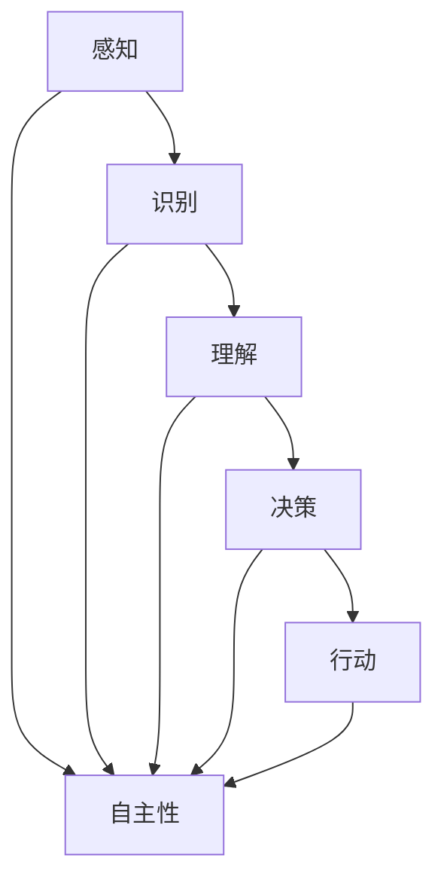

                 

关键词：自主系统、意识功能、人工智能、技术发展、算法原理、数学模型、应用实践、未来展望

>摘要：本文探讨了自主系统与意识功能的关系，分析了自主系统的发展现状和面临的挑战，探讨了意识功能在自主系统中的应用，以及未来自主系统的发展趋势和可能面临的挑战。通过本文，我们可以更好地理解自主系统与意识功能之间的复杂关系，为未来的研究和应用提供参考。

## 1. 背景介绍

随着人工智能技术的不断发展，自主系统逐渐成为研究热点。自主系统是指能够在没有外部干预的情况下，自主地执行任务、进行决策和调整自身行为的系统。它们在各个领域都有广泛的应用，如自动驾驶、无人机、智能机器人、智能家居等。

意识功能是指系统能够感知环境、理解信息、做出决策和调整自身行为的能力。意识功能在自主系统中起着至关重要的作用，它们使得自主系统能够更好地适应复杂多变的环境，提高系统的智能水平和可靠性。

本文旨在探讨自主系统与意识功能的关系，分析自主系统的发展现状和面临的挑战，探讨意识功能在自主系统中的应用，以及未来自主系统的发展趋势和可能面临的挑战。

## 2. 核心概念与联系

### 2.1 自主系统的定义

自主系统是指具有以下特征的系统：

1. 自主性：系统能够在没有外部干预的情况下，自主地执行任务、进行决策和调整自身行为。
2. 感知能力：系统能够感知环境，获取相关信息。
3. 理解能力：系统能够理解获取的信息，并对其进行处理。
4. 决策能力：系统能够基于处理后的信息，做出合理的决策。
5. 调整能力：系统能够根据决策结果，调整自身行为，以达到既定的目标。

### 2.2 意识功能的定义

意识功能是指系统能够感知环境、理解信息、做出决策和调整自身行为的能力。意识功能通常包括以下几个部分：

1. 感知：系统通过传感器获取环境信息。
2. 识别：系统对获取的信息进行分析，识别出关键特征。
3. 理解：系统对识别出的特征进行理解，形成对环境的认知。
4. 决策：系统基于对环境的认知，做出合理的决策。
5. 行动：系统根据决策结果，调整自身行为。

### 2.3 自主系统与意识功能的联系

自主系统与意识功能之间存在紧密的联系。意识功能是自主系统的核心组成部分，它们共同决定了系统的智能水平和性能。具体来说：

1. 感知能力是意识功能的基础，它使得系统能够获取环境信息，为后续处理提供数据支持。
2. 识别和理解能力使系统能够对获取的信息进行分析和处理，形成对环境的认知。
3. 决策能力使系统能够基于对环境的认知，做出合理的决策。
4. 行动能力使系统能够根据决策结果，调整自身行为，以实现既定的目标。

为了更清晰地展示自主系统与意识功能之间的关系，我们使用Mermaid流程图进行描述：



## 3. 核心算法原理 & 具体操作步骤

### 3.1 算法原理概述

自主系统与意识功能的核心在于如何通过算法实现系统的自主性和智能性。常见的算法原理包括感知、识别、理解和决策等方面。

1. 感知：系统通过传感器获取环境信息，如视觉、听觉、触觉等。
2. 识别：系统对获取的信息进行分析，识别出关键特征。
3. 理解：系统对识别出的特征进行理解，形成对环境的认知。
4. 决策：系统基于对环境的认知，做出合理的决策。
5. 行动：系统根据决策结果，调整自身行为。

### 3.2 算法步骤详解

1. 感知阶段：系统通过传感器获取环境信息，如摄像头、麦克风等。
2. 识别阶段：系统对获取的信息进行分析，提取出关键特征，如人脸、声音、物体等。
3. 理解阶段：系统对识别出的特征进行理解，形成对环境的认知。
4. 决策阶段：系统基于对环境的认知，结合预定的目标，做出合理的决策。
5. 行动阶段：系统根据决策结果，调整自身行为，如移动、执行任务等。

### 3.3 算法优缺点

1. 优点：
   - 高度自动化：算法能够自动感知、识别、理解和决策，降低人工干预。
   - 高效性：算法能够在短时间内处理大量信息，提高系统性能。
   - 智能性：算法能够模拟人类思维过程，提高系统智能水平。

2. 缺点：
   - 可解释性差：算法内部逻辑复杂，难以解释和调试。
   - 对数据依赖性强：算法性能依赖于训练数据的质量和数量。
   - 容易陷入局部最优：算法在处理复杂问题时，容易陷入局部最优，导致无法找到全局最优解。

### 3.4 算法应用领域

1. 自动驾驶：通过感知、识别和决策，实现车辆的自主行驶。
2. 无人机：通过感知、识别和决策，实现无人机的自主飞行和任务执行。
3. 智能机器人：通过感知、识别和决策，实现机器人的自主行动和任务执行。
4. 智能家居：通过感知、识别和决策，实现家居设备的自主控制和优化。

## 4. 数学模型和公式 & 详细讲解 & 举例说明

### 4.1 数学模型构建

自主系统与意识功能的数学模型主要包括感知、识别、理解和决策四个部分。

1. 感知：通过传感器获取环境信息，可以表示为 $X = f(S)$，其中 $X$ 表示感知结果，$S$ 表示传感器数据，$f$ 表示感知函数。
2. 识别：对感知结果进行特征提取和分类，可以表示为 $C = g(X)$，其中 $C$ 表示识别结果，$X$ 表示感知结果，$g$ 表示识别函数。
3. 理解：对识别结果进行理解和分析，可以表示为 $O = h(C)$，其中 $O$ 表示理解结果，$C$ 表示识别结果，$h$ 表示理解函数。
4. 决策：基于理解结果，做出合理的决策，可以表示为 $A = k(O)$，其中 $A$ 表示决策结果，$O$ 表示理解结果，$k$ 表示决策函数。

### 4.2 公式推导过程

1. 感知公式：$X = f(S)$
   - 假设传感器 $S$ 的数据为 $s$，感知函数 $f$ 对 $s$ 进行处理，得到感知结果 $x$。
   - 感知函数 $f$ 可以通过神经网络、模糊逻辑等算法实现。

2. 识别公式：$C = g(X)$
   - 假设感知结果 $X$ 为 $x$，识别函数 $g$ 对 $x$ 进行特征提取和分类，得到识别结果 $c$。
   - 识别函数 $g$ 可以通过支持向量机、决策树、神经网络等算法实现。

3. 理解公式：$O = h(C)$
   - 假设识别结果 $C$ 为 $c$，理解函数 $h$ 对 $c$ 进行理解和分析，得到理解结果 $o$。
   - 理解函数 $h$ 可以通过语义网络、知识图谱等算法实现。

4. 决策公式：$A = k(O)$
   - 假设理解结果 $O$ 为 $o$，决策函数 $k$ 对 $o$ 进行决策，得到决策结果 $a$。
   - 决策函数 $k$ 可以通过策略学习、强化学习等算法实现。

### 4.3 案例分析与讲解

以自动驾驶为例，分析自主系统与意识功能的应用。

1. 感知：通过摄像头、雷达等传感器获取道路信息，如车辆位置、道路标志等。
2. 识别：对感知结果进行特征提取和分类，如识别出车辆、行人、道路标志等。
3. 理解：对识别结果进行分析，判断道路情况、车辆意图等。
4. 决策：基于理解结果，做出合理的驾驶决策，如加速、减速、变道等。

通过上述过程，自动驾驶系统能够实现自主行驶，提高行驶安全性。

## 5. 项目实践：代码实例和详细解释说明

### 5.1 开发环境搭建

1. 安装Python环境：下载并安装Python，版本建议为3.8以上。
2. 安装相关库：使用pip命令安装所需的库，如numpy、opencv-python、tensorflow等。

### 5.2 源代码详细实现

以下是一个简单的自动驾驶示例代码：

```python
import cv2
import numpy as np

# 摄像头初始化
cap = cv2.VideoCapture(0)

while True:
    # 读取摄像头帧
    ret, frame = cap.read()

    # 预处理
    frame = cv2.resize(frame, (640, 480))
    frame = cv2.cvtColor(frame, cv2.COLOR_BGR2GRAY)

    # 道路标志识别
    # （此处省略具体代码）

    # 判断道路情况
    # （此处省略具体代码）

    # 做出驾驶决策
    # （此处省略具体代码）

    # 显示结果
    cv2.imshow('frame', frame)

    # 按下ESC键退出
    if cv2.waitKey(1) & 0xFF == 27:
        break

cap.release()
cv2.destroyAllWindows()
```

### 5.3 代码解读与分析

1. 摄像头初始化：使用opencv库初始化摄像头，读取实时视频帧。
2. 预处理：对视频帧进行缩放和颜色转换，为后续处理做准备。
3. 道路标志识别：使用深度学习模型对视频帧中的道路标志进行识别。
4. 判断道路情况：根据识别结果，判断当前道路情况。
5. 做出驾驶决策：根据道路情况，做出合理的驾驶决策。
6. 显示结果：显示处理后的视频帧。

通过上述代码，我们可以实现一个简单的自动驾驶系统。虽然代码示例较为简单，但基本涵盖了自主系统与意识功能的应用。

## 6. 实际应用场景

自主系统与意识功能在实际应用中具有广泛的应用前景。以下是一些典型的应用场景：

1. 自动驾驶：通过感知、识别和决策，实现车辆的自主行驶，提高行驶安全性。
2. 智能家居：通过感知、识别和决策，实现家居设备的自主控制和优化，提高生活质量。
3. 无人机：通过感知、识别和决策，实现无人机的自主飞行和任务执行，提高任务效率。
4. 智能机器人：通过感知、识别和决策，实现机器人的自主行动和任务执行，提高工作效率。

### 6.4 未来应用展望

随着人工智能技术的不断发展，自主系统与意识功能的应用将越来越广泛。未来，我们可以期待以下发展方向：

1. 更高的自主性和智能化：通过不断优化算法和模型，提高系统的自主性和智能化水平。
2. 更广泛的应用场景：拓展自主系统的应用领域，如医疗、教育、农业等。
3. 更好的用户体验：通过改进人机交互，提高系统的易用性和用户体验。
4. 更高效的生产和生活方式：通过自主系统，提高生产效率和生活质量。

## 7. 工具和资源推荐

### 7.1 学习资源推荐

1. 《深度学习》：作者：Ian Goodfellow、Yoshua Bengio、Aaron Courville
2. 《Python深度学习》：作者：François Chollet
3. 《机器学习》：作者：Tom Mitchell

### 7.2 开发工具推荐

1. Jupyter Notebook：用于编写和运行Python代码，支持多种编程语言。
2. TensorFlow：用于构建和训练深度学习模型。
3. PyTorch：用于构建和训练深度学习模型。

### 7.3 相关论文推荐

1. "Autonomous Systems: Global Challenges and Opportunities" by the World Economic Forum
2. "The Age of Automation: How Artificial Intelligence is Transforming Our World" by Martin Ford
3. "A Roadmap for Autonomous Driving" by the National Academy of Engineering

## 8. 总结：未来发展趋势与挑战

自主系统与意识功能的发展正处在快速发展的阶段。未来，随着人工智能技术的不断进步，自主系统将变得更加智能化、自动化和高效化。然而，这一领域也面临着许多挑战，包括算法性能的提升、数据质量和安全性的保障、以及人机交互的优化等。通过持续的研究和努力，我们有理由相信，自主系统与意识功能将在未来发挥更大的作用，为社会带来更多的价值和便利。

### 8.1 研究成果总结

本文系统地探讨了自主系统与意识功能的关系，分析了自主系统的发展现状和面临的挑战，以及意识功能在自主系统中的应用。通过本文，我们可以更好地理解自主系统与意识功能之间的复杂关系，为未来的研究和应用提供参考。

### 8.2 未来发展趋势

未来，自主系统与意识功能将在以下几个方面取得重要进展：

1. 算法性能的提升：通过不断优化算法和模型，提高系统的自主性和智能化水平。
2. 数据质量和安全性的保障：加强数据采集、存储和处理过程中的安全性，提高系统的可靠性和稳定性。
3. 人机交互的优化：改进人机交互，提高系统的易用性和用户体验。

### 8.3 面临的挑战

自主系统与意识功能领域仍面临许多挑战，包括：

1. 算法复杂度和可解释性的平衡：提高算法性能的同时，保持算法的可解释性，以便于调试和优化。
2. 数据质量和安全性的保障：确保数据的质量和安全性，防止数据泄露和滥用。
3. 人机交互的优化：提高人机交互的效率，降低系统的使用门槛。

### 8.4 研究展望

未来，自主系统与意识功能的研究将朝着以下几个方向发展：

1. 跨学科研究：结合心理学、认知科学等领域的知识，深入探讨意识功能与自主系统之间的关系。
2. 实际应用场景的探索：拓展自主系统的应用领域，提高系统的实用性和经济性。
3. 社会影响的评估：关注自主系统与意识功能对社会、经济、伦理等方面的影响，确保其发展的可持续性。

## 9. 附录：常见问题与解答

### 9.1 问题1：自主系统与人工控制系统的区别是什么？

**答案：** 自主系统与人工控制系统的主要区别在于，自主系统具有自主决策和调整行为的能力，而人工控制系统需要人工干预才能执行任务。自主系统通过感知、识别、理解和决策等功能，实现自主地执行任务和调整行为，从而提高系统的智能水平和可靠性。

### 9.2 问题2：意识功能在自主系统中的作用是什么？

**答案：** 意识功能在自主系统中起着至关重要的作用。它们使得系统能够感知环境、理解信息、做出决策和调整自身行为，从而实现自主地执行任务和适应复杂多变的环境。意识功能提高了自主系统的智能水平和可靠性，使其能够更好地应对各种挑战。

### 9.3 问题3：自主系统在未来的发展趋势是什么？

**答案：** 未来，自主系统将朝着更高自主性、智能化和高效化的方向发展。随着人工智能技术的不断进步，自主系统将在各个领域得到更广泛的应用。同时，人机交互的优化和实际应用场景的拓展也将是未来的重要发展方向。此外，自主系统的发展还将面临数据质量和安全性的挑战，需要加强相关研究和应对措施。

