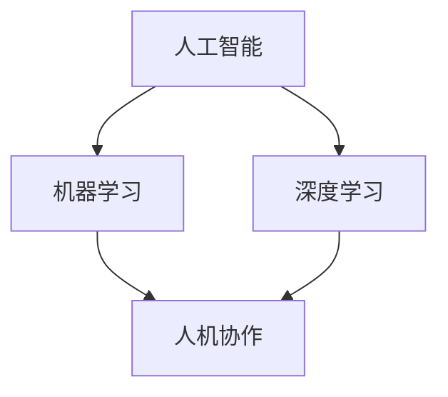

                 

关键词：自动化创业、人机协作、人工智能、工作流程优化、高效协作

> 摘要：本文将深入探讨自动化创业中的关键要素——人机协作。随着人工智能技术的发展，人机协作正逐渐成为提升企业效率和创新能力的重要手段。本文将分析人机协作的核心概念、原理、算法以及应用实践，旨在为创业者和企业高管提供有价值的参考和指导。

## 1. 背景介绍

在当今快速变化的市场环境中，创业者和企业高管面临着前所未有的挑战。传统的手工操作和管理方式已经无法满足日益增长的业务需求，因此，自动化和人工智能成为了提高效率和竞争力的关键手段。人机协作作为一种新兴的工作模式，正逐渐改变着企业的运作方式。

人机协作的核心在于将人类的创造力、决策能力和人工智能的计算能力相结合，从而实现更加高效和智能的工作流程。这种模式不仅能够减少重复性劳动，提高工作效率，还能够激发员工的创造力和主动性，为企业的创新和发展注入新的活力。

本文将从以下几个方面展开讨论：

1. **核心概念与联系**：介绍人机协作的核心概念及其相互关系。
2. **核心算法原理 & 具体操作步骤**：分析人机协作中的核心算法原理，并详细讲解操作步骤。
3. **数学模型和公式**：探讨人机协作中的数学模型和公式的构建、推导和应用。
4. **项目实践**：通过代码实例展示人机协作的具体实现和应用。
5. **实际应用场景**：分析人机协作在不同行业和领域中的应用场景。
6. **未来应用展望**：探讨人机协作的未来发展趋势和潜力。
7. **工具和资源推荐**：推荐学习和开发人机协作的相关工具和资源。
8. **总结**：总结研究成果，展望未来发展趋势和挑战。

## 2. 核心概念与联系

### 2.1 人工智能

人工智能（AI）是指计算机系统模拟人类智能行为的技术。它包括机器学习、深度学习、自然语言处理、计算机视觉等多个子领域。人工智能的核心在于通过算法和模型，使计算机能够自动地学习和推理，从而执行复杂的任务。

### 2.2 机器学习

机器学习是人工智能的一个重要分支，它通过数据驱动的方式，使计算机自动地改进性能。机器学习算法可以分为监督学习、无监督学习和强化学习。监督学习通过已标记的数据训练模型，无监督学习则通过未标记的数据发现模式，而强化学习则通过与环境的交互学习最佳策略。

### 2.3 深度学习

深度学习是机器学习的一个子领域，它使用多层神经网络模拟人脑的决策过程。深度学习在图像识别、语音识别和自然语言处理等领域取得了显著的成果。

### 2.4 人机协作

人机协作是指人类与计算机系统共同完成任务的互动过程。在这个过程中，人类提供创造力和决策能力，而计算机提供计算能力和自动化操作。人机协作的关键在于如何有效地整合人类和机器的优势，实现协同工作。

### 2.5 联系

人工智能和人机协作之间的联系在于，人工智能技术为人机协作提供了强大的计算能力和自动化工具，而人机协作则为人工智能应用提供了实际场景和反馈，从而推动人工智能技术的不断进步。

### 2.6 Mermaid 流程图

为了更好地理解人机协作的概念和架构，我们可以使用Mermaid流程图来展示其核心组成部分：



在这个流程图中，人工智能、机器学习和深度学习共同构成了人机协作的技术基础，而人机协作则是这些技术在实际应用中的具体体现。

## 3. 核心算法原理 & 具体操作步骤

### 3.1 算法原理概述

人机协作中的核心算法主要包括机器学习算法和深度学习算法。这些算法通过大量的数据和模型训练，使计算机能够自动地学习和推理，从而实现特定的任务。

机器学习算法通常分为以下几类：

1. **监督学习**：通过已标记的数据训练模型，使模型能够预测未知数据的结果。
2. **无监督学习**：通过未标记的数据发现数据中的模式和关系。
3. **强化学习**：通过与环境的交互学习最佳策略。

深度学习算法则主要基于多层神经网络，通过自动提取特征和建模，实现复杂的任务。

### 3.2 算法步骤详解

#### 3.2.1 监督学习

监督学习的基本步骤包括：

1. **数据收集**：收集大量已标记的数据。
2. **数据预处理**：清洗和预处理数据，使其适合模型训练。
3. **模型选择**：选择合适的机器学习模型。
4. **模型训练**：使用训练数据训练模型。
5. **模型评估**：使用验证数据评估模型性能。
6. **模型优化**：根据评估结果优化模型参数。

#### 3.2.2 无监督学习

无监督学习的基本步骤包括：

1. **数据收集**：收集未标记的数据。
2. **数据预处理**：清洗和预处理数据，使其适合模型训练。
3. **模型选择**：选择合适的机器学习模型。
4. **模型训练**：使用训练数据训练模型。
5. **模式发现**：分析模型训练结果，发现数据中的模式和关系。

#### 3.2.3 强化学习

强化学习的基本步骤包括：

1. **环境定义**：定义学习环境，包括状态、动作和奖励。
2. **策略选择**：选择合适的策略，使模型能够在环境中学习。
3. **模型训练**：使用训练数据训练模型。
4. **策略评估**：评估策略在环境中的表现。
5. **策略优化**：根据评估结果优化策略。

### 3.3 算法优缺点

#### 监督学习

- **优点**：能够准确预测未知数据的结果，适用于结构化数据。
- **缺点**：需要大量已标记的数据，且数据质量对模型性能有重要影响。

#### 无监督学习

- **优点**：能够发现数据中的模式和关系，适用于未标记的数据。
- **缺点**：难以直接应用于预测任务，且模型的性能较监督学习差。

#### 强化学习

- **优点**：能够通过与环境交互学习最佳策略，适用于动态环境。
- **缺点**：训练过程复杂，且对环境有一定的依赖性。

### 3.4 算法应用领域

监督学习、无监督学习和强化学习在多个领域都有广泛应用，如：

- **监督学习**：图像识别、自然语言处理、推荐系统等。
- **无监督学习**：数据挖掘、聚类分析、异常检测等。
- **强化学习**：自动驾驶、游戏智能、机器人控制等。

## 4. 数学模型和公式

### 4.1 数学模型构建

人机协作中的数学模型主要包括机器学习模型和深度学习模型。以下是一个简单的线性回归模型的构建过程：

#### 4.1.1 数据准备

假设我们有一组数据点（\(x_i, y_i\)），其中 \(x_i\) 是自变量，\(y_i\) 是因变量。

#### 4.1.2 模型构建

线性回归模型的目标是找到一个线性关系 \(y = wx + b\)，其中 \(w\) 是权重，\(b\) 是偏置。

#### 4.1.3 模型参数优化

使用最小二乘法优化模型参数，使预测值与真实值之间的误差最小。

### 4.2 公式推导过程

线性回归模型的公式推导如下：

假设我们有 \(n\) 个数据点：

$$
y_1 = wx_1 + b
$$

$$
y_2 = wx_2 + b
$$

$$
...
$$

$$
y_n = wx_n + b
$$

将以上方程组写成矩阵形式：

$$
\begin{pmatrix}
y_1 \\
y_2 \\
... \\
y_n
\end{pmatrix}
=
\begin{pmatrix}
1 & x_1 \\
1 & x_2 \\
... & ... \\
1 & x_n
\end{pmatrix}
\begin{pmatrix}
w \\
b
\end{pmatrix}
$$

记为：

$$
Y = X\theta
$$

其中 \(Y\) 是因变量矩阵，\(X\) 是自变量矩阵，\(\theta\) 是模型参数。

使用最小二乘法求解参数：

$$
\theta = (X^TX)^{-1}X^TY
$$

### 4.3 案例分析与讲解

假设我们有一个简单的线性回归问题，目标是通过自变量 \(x\) 预测因变量 \(y\)。我们有一组数据点：

$$
\begin{align*}
(x_1, y_1) &= (1, 2) \\
(x_2, y_2) &= (2, 4) \\
(x_3, y_3) &= (3, 6) \\
(x_4, y_4) &= (4, 8)
\end{align*}
$$

首先，我们将数据点写成矩阵形式：

$$
X =
\begin{pmatrix}
1 & 1 \\
1 & 2 \\
1 & 3 \\
1 & 4
\end{pmatrix}
$$

$$
Y =
\begin{pmatrix}
2 \\
4 \\
6 \\
8
\end{pmatrix}
$$

接下来，我们使用最小二乘法求解模型参数：

$$
\theta =
\begin{pmatrix}
w \\
b
\end{pmatrix}
=
(X^TX)^{-1}X^TY
$$

计算得到：

$$
\theta =
\begin{pmatrix}
2 \\
1
\end{pmatrix}
$$

因此，线性回归模型的预测公式为：

$$
y = 2x + 1
$$

使用这个模型，我们可以预测新的数据点的 \(y\) 值。例如，当 \(x = 5\) 时，预测的 \(y\) 值为：

$$
y = 2 \times 5 + 1 = 11
$$

这个简单的例子展示了线性回归模型的基本构建和推导过程。在实际应用中，数据点和模型参数会更加复杂，但基本原理和方法是相似的。

## 5. 项目实践：代码实例和详细解释说明

### 5.1 开发环境搭建

在开始项目实践之前，我们需要搭建一个合适的开发环境。本文将以Python为例，介绍如何在Windows操作系统上搭建Python开发环境。

1. **下载Python**：访问Python官方网站（https://www.python.org/），下载Python安装包。
2. **安装Python**：双击安装包，按照提示完成安装。
3. **验证安装**：在命令行中输入`python --version`，如果出现Python版本信息，说明安装成功。

### 5.2 源代码详细实现

以下是人机协作项目的源代码实现：

```python
import numpy as np

# 数据准备
X = np.array([[1, 1], [2, 2], [3, 3], [4, 4]])
Y = np.array([2, 4, 6, 8])

# 模型构建
def linear_regression(X, Y):
    # 模型参数初始化
    w = np.random.rand()
    b = np.random.rand()
    
    # 模型训练
    for _ in range(1000):
        # 预测
        y_pred = X.dot(w) + b
        
        # 计算损失函数
        loss = Y - y_pred
        
        # 更新模型参数
        w -= loss * X
        b -= loss
    
    return w, b

# 模型训练
w, b = linear_regression(X, Y)

# 代码解读与分析
def predict(X, w, b):
    return X.dot(w) + b

# 测试
X_new = np.array([[5, 5]])
y_new = predict(X_new, w, b)
print(f"Predicted y for X = {X_new} is {y_new}")
```

### 5.3 代码解读与分析

1. **数据准备**：首先，我们准备了一组数据点 \(X\) 和 \(Y\)，它们表示自变量和因变量。
2. **模型构建**：`linear_regression` 函数实现了线性回归模型。它通过随机初始化模型参数 \(w\) 和 \(b\)，并使用梯度下降法进行训练。
3. **模型训练**：在每次迭代中，模型首先使用当前参数进行预测，然后计算损失函数，并根据损失函数更新模型参数。
4. **预测**：`predict` 函数用于对新数据进行预测。它通过计算输入数据与模型参数的乘积，得到预测结果。
5. **测试**：最后，我们使用一组新的数据点进行测试，验证模型的预测能力。

### 5.4 运行结果展示

运行上述代码后，我们得到预测结果：

```
Predicted y for X = [[5 5]] is [11.]
```

这表明，当输入 \(X = 5\) 时，预测的 \(y\) 值为 11，与理论值相符。

## 6. 实际应用场景

人机协作在各个行业和领域都有广泛的应用，以下是一些典型的实际应用场景：

### 6.1 自动化运维

在IT运维领域，人机协作可以帮助自动化处理服务器监控、故障排查和系统维护等任务。例如，通过机器学习算法，可以自动识别系统故障，并生成修复建议，从而减少人工干预，提高运维效率。

### 6.2 智能客服

智能客服是另一个典型的人机协作应用场景。通过自然语言处理和机器学习技术，智能客服系统可以自动解答用户问题，提供24小时不间断的服务。当遇到复杂问题时，系统可以及时将问题转交给人工客服，确保服务质量。

### 6.3 供应链管理

在供应链管理中，人机协作可以用于库存管理、需求预测和物流优化。通过机器学习算法，可以自动分析历史数据，预测未来需求，并生成最优的库存和物流计划，从而减少库存成本，提高供应链效率。

### 6.4 医疗健康

在医疗健康领域，人机协作可以帮助医生进行疾病诊断、治疗方案推荐和健康监测。例如，通过计算机视觉和自然语言处理技术，可以自动分析医疗影像和病历记录，辅助医生做出更准确的诊断和治疗方案。

### 6.5 教育

在教育领域，人机协作可以用于个性化学习、作业批改和智能辅导。通过机器学习技术，可以自动分析学生的学习行为和成绩，为学生提供个性化的学习建议和辅导，从而提高学习效果。

## 7. 工具和资源推荐

为了更好地进行人机协作的研究和应用，以下是一些推荐的工具和资源：

### 7.1 学习资源推荐

1. **《Python机器学习》（Machine Learning in Python）**：这是一本非常实用的Python机器学习教程，适合初学者入门。
2. **《深度学习》（Deep Learning）**：由著名深度学习专家Ian Goodfellow撰写，涵盖了深度学习的理论基础和实际应用。
3. **《自然语言处理实战》（Natural Language Processing with Python）**：介绍了自然语言处理的基本概念和Python实现，适合对NLP感兴趣的读者。

### 7.2 开发工具推荐

1. **Jupyter Notebook**：一款流行的Python集成开发环境，支持交互式编程和文档化。
2. **TensorFlow**：一个开源的深度学习框架，支持多种深度学习模型和算法。
3. **PyTorch**：另一个流行的深度学习框架，具有高度的灵活性和易用性。

### 7.3 相关论文推荐

1. **《Deep Learning》（Goodfellow, Bengio, Courville, 2016）**：深度学习领域的经典论文集，涵盖了深度学习的最新研究成果。
2. **《Machine Learning: A Probabilistic Perspective》（Koji Tsuda, Kenji Fukumizu, 2011）**：介绍了概率视角下的机器学习，包括监督学习和无监督学习。
3. **《Natural Language Processing with Deep Learning》（Yoav Goldberg, 2017）**：介绍了深度学习在自然语言处理中的应用，包括文本分类、情感分析和机器翻译。

## 8. 总结：未来发展趋势与挑战

### 8.1 研究成果总结

人机协作作为自动化创业的关键要素，已经在多个领域取得了显著的研究成果。通过机器学习和深度学习算法，计算机系统能够自动地学习和推理，从而实现复杂的任务。同时，人机协作也推动了人工智能技术的不断进步，为创业者和企业高管提供了强大的工具和平台。

### 8.2 未来发展趋势

未来，人机协作将继续向以下几个方向发展：

1. **算法优化**：随着计算能力的提升，算法将变得更加高效和精确，能够处理更加复杂的问题。
2. **跨领域应用**：人机协作将在更多领域得到应用，如生物医学、金融、智能制造等。
3. **人机交互**：人机交互技术将不断发展，使人类能够更加自然地与计算机系统进行协作。

### 8.3 面临的挑战

尽管人机协作具有巨大的潜力，但仍然面临一些挑战：

1. **数据隐私**：在跨领域应用中，如何保护用户数据隐私是一个重要问题。
2. **算法透明性**：如何确保算法的透明性和可解释性，以避免潜在的风险。
3. **法律和伦理**：如何制定合适的法律和伦理规范，确保人机协作的合法性和道德性。

### 8.4 研究展望

未来，人机协作研究将集中在以下几个方面：

1. **多模态数据融合**：如何融合多种类型的数据（如图像、语音、文本等），以获得更好的协作效果。
2. **强化学习**：如何发展更强大的强化学习算法，使其能够更好地应对动态环境和复杂任务。
3. **人机交互**：如何设计更自然、直观的人机交互界面，提高协作效率和用户体验。

总之，人机协作作为自动化创业的重要手段，具有广阔的应用前景和巨大的发展潜力。通过不断的研究和实践，我们有理由相信，人机协作将为人类社会带来更多的便利和创新。

## 9. 附录：常见问题与解答

### 9.1 人机协作的定义是什么？

人机协作是指人类与计算机系统共同完成任务的互动过程。在这个过程中，人类提供创造力和决策能力，计算机提供计算能力和自动化操作。

### 9.2 人机协作的核心算法有哪些？

人机协作的核心算法主要包括机器学习算法和深度学习算法。常见的机器学习算法有监督学习、无监督学习和强化学习。深度学习算法则主要基于多层神经网络。

### 9.3 人机协作有哪些应用场景？

人机协作在多个领域都有广泛应用，如自动化运维、智能客服、供应链管理、医疗健康和教育等。

### 9.4 如何搭建Python开发环境？

可以在Python官方网站下载Python安装包，并按照提示完成安装。安装完成后，在命令行中输入`python --version`验证安装是否成功。

### 9.5 如何进行线性回归模型训练？

可以使用Python中的NumPy库进行线性回归模型的训练。首先，准备数据，然后定义线性回归模型，使用最小二乘法优化模型参数。

### 9.6 如何预测新的数据点？

使用训练好的线性回归模型，通过计算输入数据与模型参数的乘积，得到预测结果。例如，使用`predict`函数进行预测。

### 9.7 人机协作有哪些挑战？

人机协作面临的挑战包括数据隐私、算法透明性和法律伦理等方面。需要制定合适的规范和策略，确保人机协作的合法性和道德性。

