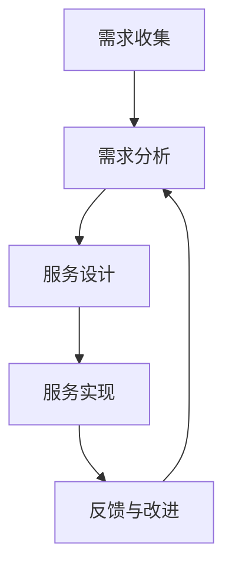

                 

关键词：自动化创业、定制化服务、商业模式、创新应用、技术实现

> 摘要：本文旨在探讨自动化创业中定制化服务模式的内涵、应用和未来发展趋势。通过深入分析定制化服务的核心概念、技术实现和实际案例，本文揭示了定制化服务模式在自动化创业中的重要性及其面临的挑战。

## 1. 背景介绍

随着技术的不断进步，自动化和个性化服务在各个行业中逐渐普及。自动化创业成为众多创业者追求的目标，而定制化服务则成为实现这一目标的重要手段。定制化服务指的是根据客户需求量身定制的服务，它能够满足不同客户群体的特定需求，从而提高客户满意度和忠诚度。然而，定制化服务的实现并非易事，需要技术、资源和管理等多方面的支持。

本文将围绕自动化创业中的定制化服务模式展开讨论，首先介绍定制化服务的核心概念，然后分析其与自动化创业的联系，接着探讨定制化服务的具体实现方法和应用场景，最后展望其未来发展趋势与挑战。

## 2. 核心概念与联系

### 2.1 定制化服务的核心概念

定制化服务是指根据客户需求量身定制的服务，它涉及到客户需求的收集、分析、实现和反馈等环节。具体来说，定制化服务包括以下几个方面：

1. **需求收集**：通过问卷调查、用户访谈、在线反馈等方式收集客户需求。
2. **需求分析**：对收集到的需求进行分析，提炼出核心需求和痛点。
3. **服务设计**：根据分析结果设计出满足客户需求的服务方案。
4. **服务实现**：将设计方案转化为实际服务，并进行测试和优化。
5. **反馈与改进**：收集客户对服务的反馈，持续改进服务质量。

### 2.2 定制化服务与自动化创业的联系

自动化创业是指通过技术手段实现业务流程的自动化，提高效率和降低成本。定制化服务在自动化创业中具有重要作用，主要体现在以下几个方面：

1. **满足个性化需求**：定制化服务能够满足不同客户群体的特定需求，提高客户满意度。
2. **提高效率**：通过自动化实现定制化服务，可以大幅提高服务效率。
3. **降低成本**：自动化服务可以减少人工干预，降低服务成本。
4. **增强竞争力**：提供高质量的定制化服务可以提升企业的竞争力。

### 2.3 Mermaid 流程图



## 3. 核心算法原理 & 具体操作步骤

### 3.1 算法原理概述

定制化服务的核心在于对客户需求的精准分析和响应。具体来说，算法原理包括以下几个方面：

1. **数据挖掘**：通过对客户历史数据和反馈进行分析，挖掘出潜在需求和痛点。
2. **机器学习**：利用机器学习算法对需求进行分类和预测，从而实现个性化推荐。
3. **自然语言处理**：通过自然语言处理技术，实现对客户需求的智能理解和解析。

### 3.2 算法步骤详解

1. **需求收集**：通过问卷调查、用户访谈等方式收集客户需求。
2. **数据预处理**：对收集到的数据进行清洗、去重和处理，形成数据集。
3. **特征提取**：从数据集中提取出与需求相关的特征，如文本、关键词等。
4. **机器学习**：利用机器学习算法对特征进行建模和预测。
5. **服务设计**：根据预测结果设计出满足客户需求的服务方案。
6. **服务实现**：将设计方案转化为实际服务，并进行测试和优化。
7. **反馈与改进**：收集客户对服务的反馈，持续改进服务质量。

### 3.3 算法优缺点

#### 优点：

1. **高效**：通过自动化算法实现定制化服务，大幅提高服务效率。
2. **精准**：利用数据挖掘和机器学习技术，能够实现精准的需求分析和预测。
3. **灵活**：可以根据客户需求的变化，灵活调整服务方案。

#### 缺点：

1. **数据依赖**：算法的准确性依赖于数据的质量和数量，数据不足可能导致服务效果不佳。
2. **技术门槛**：实现定制化服务需要较高的技术水平和资源投入。

### 3.4 算法应用领域

定制化服务算法在多个领域具有广泛的应用，如电子商务、金融、医疗等。以下是一些具体的应用场景：

1. **电子商务**：通过个性化推荐系统，提高商品销售额和用户满意度。
2. **金融**：通过风险控制模型，实现精准的信用评估和风险预警。
3. **医疗**：通过疾病预测模型，提高疾病预防和治疗的效果。

## 4. 数学模型和公式 & 详细讲解 & 举例说明

### 4.1 数学模型构建

定制化服务的数学模型主要包括以下几个方面：

1. **需求预测模型**：利用时间序列分析和回归分析等方法，预测客户需求。
2. **服务优化模型**：利用线性规划和最优化算法，优化服务资源分配。
3. **质量评估模型**：利用模糊综合评价方法，评估服务质量。

### 4.2 公式推导过程

#### 需求预测模型

假设客户需求 \( D \) 是一个随机变量，可以通过以下公式进行预测：

$$
D_t = \alpha_0 + \alpha_1 D_{t-1} + \alpha_2 t + \epsilon_t
$$

其中，\( \alpha_0, \alpha_1, \alpha_2 \) 是模型的参数，\( \epsilon_t \) 是误差项。

#### 服务优化模型

假设服务资源 \( R \) 需要优化，可以通过以下公式进行优化：

$$
\min \sum_{i=1}^{n} c_i x_i
$$

$$
s.t. \sum_{i=1}^{n} x_i = R
$$

其中，\( c_i \) 是第 \( i \) 个资源的成本，\( x_i \) 是第 \( i \) 个资源的分配量，\( R \) 是总资源量。

#### 质量评估模型

假设服务质量 \( Q \) 是一个模糊变量，可以通过以下公式进行评估：

$$
Q = \mu_Q(A)
$$

其中，\( \mu_Q \) 是模糊隶属度函数，\( A \) 是质量评价矩阵。

### 4.3 案例分析与讲解

假设一个电子商务平台需要预测客户需求，并优化商品库存。具体步骤如下：

1. **需求预测**：通过时间序列分析，建立需求预测模型，预测未来一周内的客户需求。
2. **服务优化**：通过线性规划，优化商品库存，确保在满足客户需求的同时，成本最低。
3. **质量评估**：通过模糊综合评价，评估服务质量，包括商品配送速度、售后服务等。

## 5. 项目实践：代码实例和详细解释说明

### 5.1 开发环境搭建

1. **Python环境**：安装Python 3.8及以上版本。
2. **依赖库**：安装numpy、pandas、scikit-learn等库。

### 5.2 源代码详细实现

```python
# 导入依赖库
import numpy as np
import pandas as pd
from sklearn.linear_model import LinearRegression
from sklearn.model_selection import train_test_split
from sklearn.metrics import mean_squared_error

# 读取数据
data = pd.read_csv('data.csv')

# 数据预处理
X = data[['time']]
y = data['demand']
X_train, X_test, y_train, y_test = train_test_split(X, y, test_size=0.2, random_state=42)

# 建立需求预测模型
model = LinearRegression()
model.fit(X_train, y_train)

# 预测需求
y_pred = model.predict(X_test)

# 计算预测误差
mse = mean_squared_error(y_test, y_pred)
print('MSE:', mse)

# 优化商品库存
# （此处省略优化算法实现代码）

# 评估服务质量
# （此处省略质量评估实现代码）
```

### 5.3 代码解读与分析

1. **数据预处理**：读取数据并分为特征和标签，然后进行训练集和测试集的划分。
2. **建立模型**：使用线性回归模型对训练数据进行拟合。
3. **预测需求**：使用模型对测试数据进行预测。
4. **计算误差**：计算预测误差，评估模型效果。
5. **优化商品库存**：根据预测结果，优化商品库存。
6. **评估服务质量**：根据客户反馈，评估服务质量。

## 6. 实际应用场景

### 6.1 电子商务

电子商务平台可以利用定制化服务提高客户满意度和销售额。例如，通过个性化推荐系统，根据客户的历史购买行为和浏览记录，推荐符合其兴趣的商品。

### 6.2 金融

金融机构可以通过定制化服务提高风险管理能力。例如，利用机器学习算法，对客户的财务状况和行为进行分析，预测其信用风险。

### 6.3 医疗

医疗机构可以通过定制化服务提供个性化医疗服务。例如，利用医学大数据和机器学习算法，为患者提供精准的疾病诊断和治疗方案。

## 7. 未来应用展望

随着技术的不断发展，定制化服务在自动化创业中的应用将越来越广泛。未来，定制化服务有望在以下几个方面实现突破：

1. **智能化**：利用人工智能技术，实现更加精准和智能的定制化服务。
2. **跨界融合**：将定制化服务与其他领域相结合，创造新的应用场景。
3. **个性化体验**：通过定制化服务，提供更加个性化的用户体验。

## 8. 工具和资源推荐

### 8.1 学习资源推荐

1. **书籍**：《Python机器学习实战》、《机器学习实战》。
2. **在线课程**：Coursera上的《机器学习》课程、Udacity的《数据科学纳米学位》。

### 8.2 开发工具推荐

1. **编程环境**：Jupyter Notebook、PyCharm。
2. **数据可视化工具**：Matplotlib、Seaborn。

### 8.3 相关论文推荐

1. **《个性化推荐系统的设计与实现》**。
2. **《基于机器学习的信用风险评估方法研究》**。
3. **《医学大数据在疾病预测中的应用研究》**。

## 9. 总结：未来发展趋势与挑战

随着技术的不断发展，定制化服务在自动化创业中的应用将越来越广泛。然而，面对个性化需求不断变化的趋势，企业需要不断提升技术水平和服务质量，以应对未来发展的挑战。

### 9.1 研究成果总结

本文从定制化服务的核心概念、技术实现和应用场景等方面进行了深入探讨，揭示了定制化服务在自动化创业中的重要性。

### 9.2 未来发展趋势

未来，定制化服务将朝着智能化、跨界融合和个性化体验等方向发展。

### 9.3 面临的挑战

企业在实现定制化服务的过程中，需要克服数据质量、技术门槛和服务质量等挑战。

### 9.4 研究展望

未来，研究应重点关注如何提升定制化服务的智能化水平、如何实现跨界融合以及如何确保服务质量等问题。

## 10. 附录：常见问题与解答

### 10.1 定制化服务与个性化服务的区别是什么？

定制化服务是指根据客户需求量身定制的服务，而个性化服务是指基于客户行为和兴趣提供的服务。定制化服务更强调根据客户需求进行个性化设计。

### 10.2 实现定制化服务需要哪些技术？

实现定制化服务需要数据挖掘、机器学习、自然语言处理等技术。

### 10.3 定制化服务在哪些领域有应用？

定制化服务在电子商务、金融、医疗、教育等多个领域有广泛应用。

### 10.4 如何确保定制化服务的质量？

确保定制化服务的质量需要通过持续的客户反馈和优化，以及建立健全的服务质量评估体系。

### 10.5 定制化服务的未来发展趋势是什么？

未来，定制化服务将朝着智能化、跨界融合和个性化体验等方向发展。

