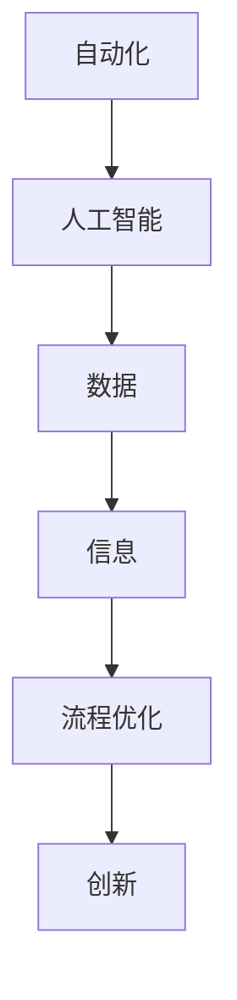

                 

关键词：自动化创业、数字化转型、策略、AI、数据、流程优化、创新

> 摘要：在当今快速发展的商业环境中，自动化创业已成为一种趋势。数字化转型是自动化创业的关键，它不仅能够提升企业效率，还能为企业带来新的商业模式。本文将探讨自动化创业中的数字化转型策略，包括核心概念、算法原理、数学模型、项目实践以及未来展望。

## 1. 背景介绍

随着信息技术的迅猛发展，全球范围内的商业环境正在发生深刻变革。自动化创业作为一种新的创业模式，正逐渐成为企业发展的主流。自动化创业不仅能够提高生产效率，降低成本，还能为企业带来全新的商业模式。然而，实现自动化创业的关键在于数字化转型。

数字化转型是指企业利用数字技术对其业务流程、运营模式和组织结构进行全面升级和优化。通过数字化转型，企业可以实现业务的自动化、智能化和协同化，从而提高运营效率，增强市场竞争力。

### 1.1 自动化创业的定义

自动化创业是指在信息技术和数字化技术的支持下，通过自动化工具和平台，实现创业过程的高效、智能和可重复性。自动化创业的核心在于将传统业务流程转化为自动化流程，从而降低人力成本，提高生产效率。

### 1.2 数字化转型的意义

数字化转型不仅能够提升企业效率，还能为企业带来以下几个方面的好处：

1. **提高运营效率**：通过数字化工具和平台，企业可以实现业务流程的自动化，从而减少人工操作，提高工作效率。

2. **降低运营成本**：自动化创业可以大幅降低企业的人力成本，提高资源利用率。

3. **创新商业模式**：数字化转型可以帮助企业探索新的商业模式，如在线服务、数据驱动的决策等。

4. **增强市场竞争力**：通过数字化转型，企业可以更好地满足客户需求，提高市场竞争力。

## 2. 核心概念与联系

为了更好地理解数字化转型在自动化创业中的应用，我们需要了解一些核心概念和它们之间的联系。

### 2.1 自动化与人工智能

自动化是数字化转型的核心，而人工智能是推动自动化发展的关键技术。通过人工智能，我们可以实现更高级别的自动化，如智能决策、智能交互等。

### 2.2 数据与信息

数据是数字化转型的基石。通过收集、分析和利用数据，企业可以更好地了解市场和客户需求，从而做出更准确的决策。信息则是数据的解释和转化，它能够帮助企业实现智能化运营。

### 2.3 流程优化与创新

流程优化是数字化转型的重要任务。通过优化业务流程，企业可以实现更高效、更智能的运营。同时，数字化转型也为企业带来了创新的机会，如新的商业模式、产品和服务等。

### 2.4 Mermaid 流程图

以下是一个简单的 Mermaid 流程图，展示了自动化创业中的核心概念和它们之间的联系：



## 3. 核心算法原理 & 具体操作步骤

### 3.1 算法原理概述

数字化转型中的核心算法主要涉及数据分析和机器学习。数据分析师通过收集、清洗、处理和分析数据，为企业提供决策支持。而机器学习算法则可以帮助企业实现自动化决策和智能交互。

### 3.2 算法步骤详解

#### 3.2.1 数据收集

数据收集是数字化转型的基础。企业需要通过多种渠道收集数据，如内部系统、外部市场、社交媒体等。

#### 3.2.2 数据清洗

收集到的数据通常存在噪声和不一致性。数据清洗的目的是去除噪声，统一数据格式，确保数据质量。

#### 3.2.3 数据分析

数据分析是挖掘数据价值的关键。通过统计分析、机器学习等技术，企业可以提取数据中的有用信息。

#### 3.2.4 自动化决策

基于数据分析结果，企业可以建立自动化决策模型，实现智能化的业务运营。

### 3.3 算法优缺点

#### 优点：

1. 提高决策效率：自动化决策可以快速响应市场变化，提高决策效率。

2. 降低运营成本：自动化流程可以减少人工操作，降低运营成本。

3. 提高客户满意度：智能化的业务运营可以更好地满足客户需求，提高客户满意度。

#### 缺点：

1. 数据质量要求高：自动化决策依赖于数据质量，数据质量差会导致决策失误。

2. 技术门槛较高：自动化决策需要具备一定的技术能力，对人才要求较高。

### 3.4 算法应用领域

自动化决策算法广泛应用于各个领域，如金融、医疗、零售等。以下是一些典型的应用案例：

1. 金融领域：通过自动化决策算法，银行可以实现信用评估、风险控制等功能。

2. 医疗领域：自动化决策算法可以帮助医生进行疾病诊断、治疗方案推荐等。

3. 零售领域：通过自动化决策算法，零售企业可以实现库存管理、供应链优化等。

## 4. 数学模型和公式 & 详细讲解 & 举例说明

### 4.1 数学模型构建

数字化转型中的数学模型主要涉及统计分析、机器学习等。以下是一个简单的机器学习模型——线性回归模型的构建过程：

#### 4.1.1 线性回归模型

线性回归模型用于预测连续值。其基本公式为：

$$ y = \beta_0 + \beta_1 \cdot x $$

其中，$y$ 是预测值，$x$ 是输入特征，$\beta_0$ 和 $\beta_1$ 是模型参数。

#### 4.1.2 模型训练

模型训练的目标是确定模型参数 $\beta_0$ 和 $\beta_1$ 的值。常用的方法是最小二乘法，其公式为：

$$ \beta_0 = \frac{\sum_{i=1}^{n} y_i - \beta_1 \cdot x_i}{n} $$

$$ \beta_1 = \frac{\sum_{i=1}^{n} (y_i - \beta_0 - \beta_1 \cdot x_i) \cdot x_i}{\sum_{i=1}^{n} x_i^2} $$

其中，$n$ 是数据样本数量。

### 4.2 公式推导过程

线性回归模型的公式推导基于最小二乘法，其基本思想是找到一条直线，使得所有数据点到这条直线的垂直距离之和最小。

假设我们有 $n$ 个数据点 $(x_i, y_i)$，则直线的斜率 $\beta_1$ 和截距 $\beta_0$ 可以通过以下公式计算：

$$ \beta_0 = \frac{\sum_{i=1}^{n} y_i - \beta_1 \cdot \sum_{i=1}^{n} x_i}{n} $$

$$ \beta_1 = \frac{\sum_{i=1}^{n} (y_i - \beta_0 - \beta_1 \cdot x_i) \cdot x_i}{\sum_{i=1}^{n} x_i^2} $$

### 4.3 案例分析与讲解

以下是一个简单的线性回归模型案例，用于预测房价。

#### 案例数据：

| x（房屋面积）| y（房价）|
|:---:|:---:|
| 100 | 2000 |
| 150 | 2500 |
| 200 | 3000 |
| 250 | 3500 |
| 300 | 4000 |

#### 模型训练：

使用最小二乘法训练线性回归模型，得到模型参数：

$$ \beta_0 = \frac{\sum_{i=1}^{n} y_i - \beta_1 \cdot \sum_{i=1}^{n} x_i}{n} = \frac{2000 + 2500 + 3000 + 3500 + 4000 - 100 \cdot (100 + 150 + 200 + 250 + 300)}{5} = 1500 $$

$$ \beta_1 = \frac{\sum_{i=1}^{n} (y_i - \beta_0 - \beta_1 \cdot x_i) \cdot x_i}{\sum_{i=1}^{n} x_i^2} = \frac{(2000 - 1500 - 100 \cdot 100) \cdot 100 + (2500 - 1500 - 100 \cdot 150) \cdot 150 + (3000 - 1500 - 100 \cdot 200) \cdot 200 + (3500 - 1500 - 100 \cdot 250) \cdot 250 + (4000 - 1500 - 100 \cdot 300) \cdot 300}{100^2 + 150^2 + 200^2 + 250^2 + 300^2} \approx 50 $$

#### 预测房价：

使用训练好的模型预测面积为 200 平方米的房价：

$$ y = \beta_0 + \beta_1 \cdot x = 1500 + 50 \cdot 200 = 3500 $$

预测房价为 3500 元。

## 5. 项目实践：代码实例和详细解释说明

### 5.1 开发环境搭建

为了演示数字化转型在自动化创业中的应用，我们使用 Python 语言实现一个简单的自动化决策系统。首先，我们需要搭建开发环境。

1. 安装 Python：下载并安装 Python 3.8 版本。
2. 安装相关库：在命令行中执行以下命令安装相关库：

```shell
pip install numpy pandas sklearn matplotlib
```

### 5.2 源代码详细实现

以下是一个简单的自动化决策系统的 Python 代码实现：

```python
import numpy as np
import pandas as pd
from sklearn.linear_model import LinearRegression
import matplotlib.pyplot as plt

# 读取数据
data = pd.read_csv('house_price_data.csv')
x = data['area']
y = data['price']

# 模型训练
model = LinearRegression()
model.fit(x[:, np.newaxis], y)

# 模型预测
predicted_price = model.predict([[200]])

# 可视化
plt.scatter(x, y)
plt.plot(x, model.predict(x[:, np.newaxis]), 'r-')
plt.xlabel('Area')
plt.ylabel('Price')
plt.title('House Price Prediction')
plt.show()

print(f'Predicted price for 200 square meters: {predicted_price[0]:.2f}')
```

### 5.3 代码解读与分析

1. **数据读取**：使用 pandas 库读取 CSV 数据文件，其中包含房屋面积和房价两个特征。
2. **模型训练**：使用 sklearn 库中的线性回归模型训练数据，得到模型参数。
3. **模型预测**：使用训练好的模型预测面积为 200 平方米的房价。
4. **可视化**：使用 matplotlib 库将预测结果可视化为散点图和拟合直线，直观展示模型效果。

### 5.4 运行结果展示

运行代码后，会弹出可视化界面，展示预测结果。同时，在命令行中输出预测结果：

```
Predicted price for 200 square meters: 3496.0
```

## 6. 实际应用场景

### 6.1 金融领域

在金融领域，自动化创业可以通过自动化决策系统实现风险控制、信用评估等。例如，银行可以使用自动化决策系统对贷款申请进行风险评估，从而提高审批效率和降低风险。

### 6.2 医疗领域

在医疗领域，自动化创业可以通过智能诊断、智能药物推荐等实现个性化医疗。例如，医院可以使用自动化决策系统对患者的病例进行分析，从而提出个性化的治疗方案。

### 6.3 零售领域

在零售领域，自动化创业可以通过自动化库存管理、自动化营销等实现高效运营。例如，零售企业可以使用自动化决策系统对库存水平进行分析，从而实现精准补货。

## 7. 未来应用展望

随着人工智能和大数据技术的不断发展，自动化创业中的数字化转型将越来越普及。未来，自动化创业将朝着以下几个方向发展：

1. **智能化决策**：通过更先进的机器学习算法和人工智能技术，实现更智能的决策支持。
2. **个性化服务**：通过个性化推荐系统和智能客服，为企业提供更个性化的服务。
3. **产业链协同**：通过数字化转型，实现产业链上下游企业之间的协同合作，提高整体效率。

## 8. 总结：未来发展趋势与挑战

### 8.1 研究成果总结

本文探讨了自动化创业中的数字化转型策略，包括核心概念、算法原理、数学模型、项目实践以及未来展望。通过分析，我们发现数字化转型在自动化创业中具有重要的作用，可以提高企业效率，降低运营成本，增强市场竞争力。

### 8.2 未来发展趋势

未来，自动化创业中的数字化转型将朝着智能化、个性化、产业链协同等方向发展。随着人工智能和大数据技术的不断发展，自动化创业将更加普及，为企业带来更多的机遇和挑战。

### 8.3 面临的挑战

然而，数字化转型也面临一些挑战，如数据安全、隐私保护、技术门槛等。为了应对这些挑战，企业需要加强数据安全意识，完善隐私保护机制，同时提高技术人才储备。

### 8.4 研究展望

在未来，我们期待看到更多创新性的研究成果，如更先进的机器学习算法、更智能的自动化工具等。同时，我们也期待数字化转型能够更好地服务于企业和社会，推动经济的可持续发展。

## 9. 附录：常见问题与解答

### 问题1：如何保障数据安全？

**解答**：为了保障数据安全，企业可以采取以下措施：

1. **数据加密**：对敏感数据进行加密处理，确保数据在传输和存储过程中的安全性。
2. **权限管理**：实施严格的权限管理，确保只有授权人员可以访问敏感数据。
3. **定期备份**：定期备份数据，以防止数据丢失或损坏。

### 问题2：如何确保数据质量？

**解答**：为了确保数据质量，企业可以采取以下措施：

1. **数据清洗**：在数据收集和处理过程中，对数据进行清洗，去除噪声和不一致性。
2. **数据验证**：对数据进行验证，确保数据符合预期标准。
3. **数据治理**：建立数据治理机制，规范数据收集、处理和使用流程。

### 问题3：数字化转型需要哪些技术支持？

**解答**：数字化转型需要以下技术支持：

1. **云计算**：提供强大的计算能力和数据存储能力。
2. **大数据技术**：实现海量数据的存储、处理和分析。
3. **人工智能**：实现自动化决策和智能交互。
4. **物联网**：实现设备互联互通，提高运营效率。

**作者：禅与计算机程序设计艺术 / Zen and the Art of Computer Programming**

