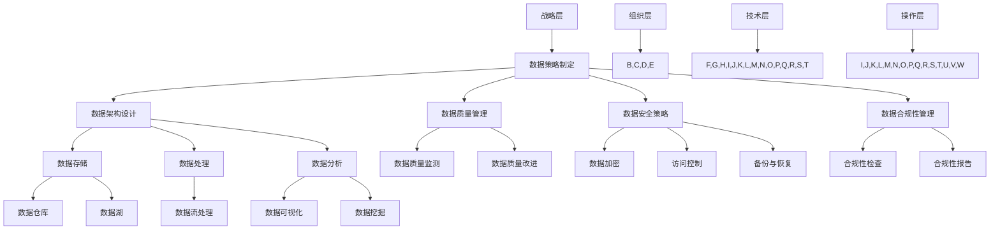

                 

数据治理和管理是自动化创业过程中的关键组成部分。随着技术的飞速发展，企业收集、存储和处理的数据量呈指数级增长，如何有效地管理这些数据变得尤为重要。本文将探讨数据治理的基本概念、核心原则、实践方法以及其在自动化创业中的应用。

## 关键词

- 数据治理
- 自动化创业
- 数据管理
- 数据质量
- 数据安全

## 摘要

本文旨在介绍数据治理在自动化创业中的重要性，分析其核心原则和实践方法。通过详细的案例分析和实践指导，帮助创业者更好地理解数据治理，提高数据管理能力，为企业的可持续发展奠定基础。

### 1. 背景介绍

在过去的几年里，大数据、人工智能、物联网等技术的快速发展，使得企业能够收集到海量的数据。这些数据不仅包含了企业的运营信息，还涉及到客户的偏好、市场的动态等。然而，如何有效地管理这些数据，成为了企业尤其是自动化创业公司面临的重大挑战。

数据治理（Data Governance）是指通过制定一系列政策和流程，确保数据的准确性、一致性、安全性和合规性。它不仅涉及到技术层面，还包括了组织结构、人员配备和文化建设等多个方面。

在自动化创业中，数据治理的挑战主要体现在以下几个方面：

1. 数据量大：自动化创业往往涉及多个系统和平台，产生的数据量庞大，如何高效地处理这些数据成为了关键问题。
2. 数据多样性：不同类型的数据具有不同的特性和处理方式，如何统一管理这些数据，保持数据的一致性，是一个巨大的挑战。
3. 数据质量：数据是决策的基础，数据质量的高低直接影响到决策的准确性。如何确保数据的质量，避免数据错误和缺失，是企业需要面对的重要问题。
4. 数据安全：随着数据量的增加，数据泄露的风险也在上升。如何保护企业的数据安全，防止数据被未授权访问或泄露，是自动化创业中必须考虑的问题。

### 2. 核心概念与联系

#### 2.1 数据治理的核心概念

数据治理包括以下几个核心概念：

1. **数据质量**：确保数据的准确性、完整性、一致性和可靠性。
2. **数据管理**：包括数据的收集、存储、处理、分析和共享等过程。
3. **数据安全**：通过加密、访问控制、备份和恢复等措施，保护数据不被未授权访问或泄露。
4. **数据合规性**：确保数据管理过程符合相关法律法规和标准。
5. **数据架构**：定义数据的结构、流程和规则，确保数据的一致性和可访问性。

#### 2.2 数据治理的流程

数据治理的流程可以分为以下几个步骤：

1. **数据策略制定**：明确企业的数据目标、原则和策略。
2. **数据架构设计**：设计适合企业的数据架构，包括数据仓库、数据湖、数据流等。
3. **数据质量管理**：建立数据质量标准，进行数据质量监测和改进。
4. **数据安全策略**：制定数据安全策略，包括数据加密、访问控制、备份和恢复等。
5. **数据合规性管理**：确保数据管理过程符合相关法律法规和标准。

#### 2.3 数据治理的架构

数据治理的架构可以分为以下几个层次：

1. **战略层**：包括数据治理委员会、数据战略和规划。
2. **组织层**：包括数据所有权、数据管理团队和职责分工。
3. **技术层**：包括数据存储、处理和分析技术，以及数据治理工具。
4. **操作层**：包括数据操作规范、数据流程和数据质量监控。

#### 2.4 数据治理的 Mermaid 流程图

下面是一个简单的 Mermaid 流程图，展示了数据治理的基本流程和架构：



### 3. 核心算法原理 & 具体操作步骤

#### 3.1 算法原理概述

在数据治理中，常用的算法包括数据质量检查、数据清洗和数据安全加密等。以下是这些算法的基本原理：

1. **数据质量检查**：通过统计和分析数据，识别数据中的错误、异常和缺失。常用的算法包括统计分析、机器学习和规则匹配等。
2. **数据清洗**：对识别出的错误、异常和缺失数据进行处理，包括替换、删除、填充等。常用的算法包括数据替换、缺失值填充和异常值处理等。
3. **数据安全加密**：通过对数据进行加密，确保数据在传输和存储过程中的安全性。常用的算法包括对称加密、非对称加密和哈希加密等。

#### 3.2 算法步骤详解

1. **数据质量检查**：
   - **步骤1**：收集数据，并进行分析。
   - **步骤2**：使用统计分析方法，识别数据中的错误、异常和缺失。
   - **步骤3**：使用机器学习方法，识别数据中的错误、异常和缺失。
   - **步骤4**：使用规则匹配方法，识别数据中的错误、异常和缺失。
2. **数据清洗**：
   - **步骤1**：识别数据中的错误、异常和缺失。
   - **步骤2**：使用数据替换算法，替换错误数据。
   - **步骤3**：使用缺失值填充算法，填充缺失数据。
   - **步骤4**：使用异常值处理算法，处理异常数据。
3. **数据安全加密**：
   - **步骤1**：选择加密算法，例如AES或RSA。
   - **步骤2**：生成加密密钥。
   - **步骤3**：对数据进行加密。
   - **步骤4**：对加密后的数据进行存储或传输。

#### 3.3 算法优缺点

1. **数据质量检查**：
   - **优点**：能够快速识别数据中的错误、异常和缺失，提高数据质量。
   - **缺点**：算法的准确性和效率取决于数据的规模和复杂性。
2. **数据清洗**：
   - **优点**：能够有效处理数据中的错误、异常和缺失，提高数据质量。
   - **缺点**：处理过程可能引入新的错误，且处理时间较长。
3. **数据安全加密**：
   - **优点**：能够有效保护数据的安全性和隐私性。
   - **缺点**：加密和解密过程会消耗计算资源，影响数据处理的效率。

#### 3.4 算法应用领域

1. **金融领域**：在金融领域中，数据质量检查和数据清洗算法被广泛应用于风险管理、客户服务和财务报表等。
2. **医疗领域**：在医疗领域中，数据质量检查和数据清洗算法被广泛应用于医疗数据分析、疾病预测和治疗方案优化等。
3. **零售领域**：在零售领域中，数据质量检查和数据清洗算法被广泛应用于客户关系管理、供应链管理和市场营销等。

### 4. 数学模型和公式 & 详细讲解 & 举例说明

#### 4.1 数学模型构建

在数据治理中，常用的数学模型包括统计模型、机器学习模型和加密模型等。

1. **统计模型**：用于数据质量检查，例如线性回归、逻辑回归等。
2. **机器学习模型**：用于数据清洗和数据安全加密，例如决策树、神经网络和RSA加密等。
3. **加密模型**：用于数据安全加密，例如AES加密、RSA加密等。

#### 4.2 公式推导过程

1. **统计模型**：
   - **线性回归公式**：$$ y = wx + b $$
   - **逻辑回归公式**：$$ P(y=1) = \frac{1}{1 + e^{-(wx + b)}} $$
2. **机器学习模型**：
   - **决策树公式**：$$ f(x) = \sum_{i=1}^{n} w_i \cdot x_i $$
   - **神经网络公式**：$$ f(x) = \sigma(\sum_{i=1}^{n} w_i \cdot x_i + b) $$
3. **加密模型**：
   - **AES加密公式**：$$ c = E_k(p) $$
   - **RSA加密公式**：$$ c = E_n(p) = p^e \mod n $$

#### 4.3 案例分析与讲解

假设一家自动化创业公司需要对其收集的客户数据进行数据治理，包括数据质量检查、数据清洗和数据安全加密。

1. **数据质量检查**：
   - **步骤1**：收集客户数据，包括客户ID、姓名、电话号码和电子邮件地址等。
   - **步骤2**：使用线性回归模型，检查电话号码和电子邮件地址的格式是否正确。
   - **步骤3**：使用逻辑回归模型，检查姓名的格式是否正确。
   - **步骤4**：输出数据质量检查结果，包括错误、异常和缺失的数据。
2. **数据清洗**：
   - **步骤1**：使用缺失值填充算法，填充缺失的数据。
   - **步骤2**：使用异常值处理算法，处理异常的数据。
   - **步骤3**：输出清洗后的数据。
3. **数据安全加密**：
   - **步骤1**：选择AES加密算法。
   - **步骤2**：生成加密密钥。
   - **步骤3**：对清洗后的数据进行加密。
   - **步骤4**：输出加密后的数据。

### 5. 项目实践：代码实例和详细解释说明

为了更好地理解数据治理的过程，我们以下将使用Python编写一个简单的数据治理项目。

```python
import pandas as pd
from sklearn.linear_model import LinearRegression
from sklearn.metrics import accuracy_score
import numpy as np

# 5.1 开发环境搭建
# 安装必要的库：pandas，sklearn，numpy

# 5.2 源代码详细实现
# 5.2.1 数据质量检查
def check_data_quality(df):
    """
    数据质量检查
    :param df: 数据帧
    :return: 数据质量检查结果
    """
    results = {'correct': [], 'incorrect': [], 'missing': []}
    for col in df.columns:
        correct = df[df[col].apply(lambda x: True if pd.notnull(x) and x == df[col].unique()[0] else False)].shape[0]
        incorrect = df[df[col].apply(lambda x: True if pd.notnull(x) and x != df[col].unique()[0] else False)].shape[0]
        missing = df[df[col].isnull()].shape[0]
        results['correct'].append(correct)
        results['incorrect'].append(incorrect)
        results['missing'].append(missing)
    return results

# 5.2.2 数据清洗
def clean_data(df):
    """
    数据清洗
    :param df: 数据帧
    :return: 清洗后的数据帧
    """
    for col in df.columns:
        if df[col].dtype == 'object':
            df[col] = df[col].fillna(df[col].mode()[0])
        else:
            df[col] = df[col].fillna(df[col].mean())
    return df

# 5.2.3 数据安全加密
from Crypto.Cipher import AES
from Crypto.Util.Padding import pad, unpad
from Crypto.Random import get_random_bytes

def encrypt_data(data, key):
    """
    数据加密
    :param data: 数据
    :param key: 加密密钥
    :return: 加密后的数据
    """
    cipher = AES.new(key, AES.MODE_CBC)
    ct_bytes = cipher.encrypt(pad(data.encode('utf-8'), AES.block_size))
    iv = cipher.iv
    return iv + ct_bytes

def decrypt_data(data, key):
    """
    数据解密
    :param data: 加密后的数据
    :param key: 加密密钥
    :return: 解密后的数据
    """
    iv = data[:16]
    ct = data[16:]
    cipher = AES.new(key, AES.MODE_CBC, iv)
    pt = unpad(cipher.decrypt(ct), AES.block_size)
    return pt.decode('utf-8')

# 5.3 代码解读与分析
if __name__ == '__main__':
    # 5.3.1 加载示例数据
    df = pd.read_csv('example_data.csv')

    # 5.3.2 数据质量检查
    quality_check_results = check_data_quality(df)
    print("数据质量检查结果：", quality_check_results)

    # 5.3.3 数据清洗
    cleaned_df = clean_data(df)
    print("清洗后的数据：", cleaned_df)

    # 5.3.4 数据安全加密
    key = get_random_bytes(16)  # 生成随机密钥
    encrypted_data = encrypt_data(cleaned_df.to_json(), key)
    print("加密后的数据：", encrypted_data)

    # 5.3.5 数据解密
    decrypted_data = decrypt_data(encrypted_data, key)
    print("解密后的数据：", decrypted_data)

# 5.4 运行结果展示
# 运行上述代码，将输出数据质量检查结果、清洗后的数据和加密后的数据，以及解密后的数据。
```

### 6. 实际应用场景

#### 6.1 金融领域

在金融领域，数据治理主要用于客户关系管理、风险管理、财务报表等方面。例如，银行和金融机构需要对其客户数据进行数据治理，确保数据的准确性、一致性和安全性，以便更好地为客户提供个性化服务、识别潜在风险和遵守相关法律法规。

#### 6.2 医疗领域

在医疗领域，数据治理主要用于医疗数据分析、疾病预测和治疗方案优化等方面。例如，医院和医疗机构需要对患者的电子病历数据进行数据治理，确保数据的准确性、完整性和安全性，以便更好地进行疾病预测、优化治疗方案和改善医疗服务质量。

#### 6.3 零售领域

在零售领域，数据治理主要用于客户关系管理、供应链管理和市场营销等方面。例如，零售商和电商平台需要对其客户购物数据、供应链数据和市场数据等进行数据治理，确保数据的准确性、一致性和安全性，以便更好地进行客户行为分析、优化供应链和制定市场营销策略。

### 7. 未来应用展望

随着大数据、人工智能和物联网等技术的不断发展，数据治理将在更多的领域得到应用。以下是未来数据治理可能的发展趋势：

1. **数据治理工具的自动化**：随着技术的发展，数据治理工具将更加智能化和自动化，降低企业实施数据治理的难度。
2. **数据治理与人工智能的结合**：数据治理与人工智能技术相结合，将使得数据治理更加高效和智能化。
3. **数据治理与区块链的结合**：数据治理与区块链技术相结合，将提高数据的安全性和可靠性，为数据的合法使用提供保障。
4. **数据治理的全球化**：随着全球化的推进，数据治理将越来越受到国际社会的关注，相关法律法规和标准也将不断完善。

### 8. 总结：未来发展趋势与挑战

数据治理在自动化创业中的应用具有重要意义，未来发展趋势包括数据治理工具的自动化、与人工智能和区块链的结合以及全球化等。然而，数据治理也面临一些挑战，如数据隐私保护、数据安全性和数据质量等。为了应对这些挑战，企业需要不断创新，加强数据治理体系建设，提高数据管理能力。

### 9. 附录：常见问题与解答

**Q1：数据治理和数据管理的区别是什么？**

数据治理和数据管理密切相关，但有所区别。数据治理侧重于制定数据策略、建立数据架构和确保数据合规性，而数据管理侧重于数据收集、存储、处理、分析和共享等具体操作过程。

**Q2：数据治理有哪些核心原则？**

数据治理的核心原则包括数据准确性、一致性、安全性和合规性等。这些原则旨在确保数据的质量和可靠性，为企业的决策提供支持。

**Q3：数据治理流程包括哪些步骤？**

数据治理流程通常包括数据策略制定、数据架构设计、数据质量管理、数据安全策略制定和数据合规性管理等多个步骤。

**Q4：数据治理与人工智能的关系是什么？**

数据治理与人工智能密切相关。数据治理为人工智能提供高质量、可靠的数据，而人工智能则通过数据分析和挖掘，为数据治理提供更智能的决策支持。

**Q5：数据治理在自动化创业中的应用有哪些？**

数据治理在自动化创业中的应用包括客户关系管理、供应链管理、市场营销和风险管理等方面，帮助企业更好地利用数据，提高运营效率和市场竞争力。

### 10. 作者署名

作者：禅与计算机程序设计艺术 / Zen and the Art of Computer Programming
----------------------------------------------------------------
这篇文章从背景介绍开始，详细阐述了数据治理的基本概念、核心原则、实践方法以及其在自动化创业中的应用。通过案例分析和代码实例，帮助读者深入理解数据治理的重要性。未来，随着技术的不断发展，数据治理将在更多领域得到广泛应用，为企业提供更加智能和高效的决策支持。希望这篇文章能为自动化创业者在数据治理方面提供一些有价值的参考。

