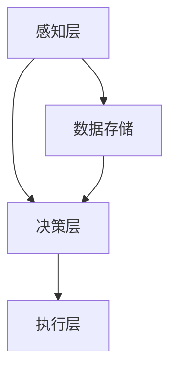

                 

关键词：自动化技术、人工智能、机器学习、未来趋势、智能自动化、工业自动化、软件自动化

## 摘要

随着科技的不断进步，自动化技术正以惊人的速度发展，并在各个领域发挥着越来越重要的作用。本文旨在探讨自动化技术的未来发展趋势，包括人工智能、机器学习、工业自动化和软件自动化的现状和潜在发展方向。通过深入分析，我们将对自动化技术的未来前景、挑战以及可能的应用场景进行展望，为读者提供一个全面的技术视角。

## 1. 背景介绍

自动化技术起源于20世纪，最初主要应用于工业生产领域。通过自动化设备，可以大幅提高生产效率，减少人工操作错误，降低劳动成本。随着计算机技术的飞速发展，自动化技术逐渐从工业领域扩展到服务业、农业、医疗等多个领域，成为现代科技不可或缺的一部分。

近年来，人工智能和机器学习技术的兴起，为自动化技术带来了新的发展契机。通过深度学习算法，自动化系统可以自我学习和优化，实现更高的效率和智能化水平。在数据驱动和算法优化的背景下，自动化技术正朝着更加智能化、自适应和高效化的方向发展。

## 2. 核心概念与联系

### 2.1. 自动化的定义

自动化（Automation）是指通过使用机器或其他自动化设备，在无需人工干预的情况下完成特定任务的过程。自动化系统通常由硬件、软件和算法组成，可以执行诸如数据收集、数据处理、决策制定和执行等任务。

### 2.2. 自动化与人工智能的联系

人工智能（AI）是自动化技术的一个重要分支，它通过模拟人类智能，使自动化系统能够在复杂环境中自主学习和决策。机器学习（ML）是人工智能的核心技术之一，它使计算机系统能够从数据中学习，并自动改进其性能。因此，自动化与人工智能密切相关，AI的发展为自动化技术注入了新的活力。

### 2.3. 自动化的架构

自动化的架构通常包括以下三个层次：

- **感知层**：负责收集环境数据，如传感器、摄像头等。
- **决策层**：通过算法分析感知层的数据，做出决策，如机器学习模型、规则引擎等。
- **执行层**：执行决策层做出的决策，如机器人、机械臂等。

### 2.4. Mermaid 流程图

以下是一个简化的自动化系统架构的 Mermaid 流程图：



## 3. 核心算法原理 & 具体操作步骤

### 3.1. 算法原理概述

自动化技术中的核心算法包括机器学习算法、神经网络算法、决策树算法等。这些算法通过处理数据，实现对复杂问题的建模和求解。例如，机器学习算法可以根据历史数据预测未来趋势，神经网络算法可以识别图像和语音，决策树算法可以用于分类和回归分析。

### 3.2. 算法步骤详解

#### 3.2.1. 机器学习算法步骤

1. **数据收集**：从各种来源收集数据，如传感器、日志文件等。
2. **数据预处理**：清洗和标准化数据，去除噪声和异常值。
3. **特征提取**：从数据中提取有用的特征，如时间序列数据中的趋势和周期性。
4. **模型训练**：使用训练数据集训练机器学习模型。
5. **模型评估**：使用测试数据集评估模型性能。
6. **模型优化**：根据评估结果调整模型参数，提高模型性能。
7. **模型部署**：将训练好的模型部署到生产环境中，进行实际应用。

#### 3.2.2. 神经网络算法步骤

1. **初始化权重**：随机初始化神经网络中的权重。
2. **前向传播**：将输入数据通过神经网络，计算输出结果。
3. **反向传播**：计算输出结果与实际结果的误差，并更新权重。
4. **迭代优化**：重复前向传播和反向传播过程，直到模型性能达到预期。

### 3.3. 算法优缺点

#### 3.3.1. 机器学习算法

- **优点**：能够处理大规模数据，自动发现数据中的模式，适用于各种领域。
- **缺点**：对数据质量要求高，模型训练时间较长，结果解释性差。

#### 3.3.2. 神经网络算法

- **优点**：强大的建模能力，适用于处理复杂数据和模式。
- **缺点**：计算量大，训练时间较长，结果解释性差。

### 3.4. 算法应用领域

- **工业自动化**：如生产线的自动化控制、故障诊断等。
- **服务业**：如智能客服、智能推荐系统等。
- **农业**：如作物监测、智能灌溉等。
- **医疗**：如疾病诊断、医疗图像分析等。

## 4. 数学模型和公式 & 详细讲解 & 举例说明

### 4.1. 数学模型构建

在自动化技术中，常见的数学模型包括线性模型、神经网络模型、决策树模型等。以下以线性回归模型为例进行讲解。

#### 4.1.1. 线性回归模型

线性回归模型用于预测一个连续变量的值，其基本形式为：

$$
y = \beta_0 + \beta_1x_1 + \beta_2x_2 + ... + \beta_nx_n
$$

其中，$y$ 为预测值，$x_1, x_2, ..., x_n$ 为输入特征，$\beta_0, \beta_1, \beta_2, ..., \beta_n$ 为模型参数。

#### 4.1.2. 模型求解

线性回归模型的求解通常使用最小二乘法（Least Squares Method），其目标是使预测值与实际值之间的误差平方和最小。求解过程如下：

1. **初始化模型参数**：随机初始化 $\beta_0, \beta_1, \beta_2, ..., \beta_n$。
2. **计算预测值**：根据当前模型参数计算预测值 $y$。
3. **计算误差**：计算预测值与实际值之间的误差 $\epsilon$。
4. **更新模型参数**：根据误差计算模型参数的更新方向和更新量，如梯度下降法。
5. **重复步骤2-4**，直到模型参数收敛。

### 4.2. 公式推导过程

线性回归模型的推导过程如下：

1. **损失函数**：损失函数用于衡量预测值与实际值之间的差距，常用的损失函数为均方误差（MSE）：

$$
MSE = \frac{1}{n}\sum_{i=1}^{n}(y_i - \hat{y_i})^2
$$

其中，$y_i$ 为实际值，$\hat{y_i}$ 为预测值，$n$ 为样本数量。

2. **梯度下降**：为了求解模型参数，使用梯度下降法来最小化损失函数。梯度下降法的核心思想是沿着损失函数的梯度方向更新模型参数，使其不断减小。损失函数关于模型参数的梯度为：

$$
\nabla_{\beta} MSE = \frac{\partial MSE}{\partial \beta} = -2\sum_{i=1}^{n}(y_i - \hat{y_i})x_i
$$

3. **迭代更新**：根据梯度计算模型参数的更新方向和更新量，更新模型参数：

$$
\beta = \beta - \alpha\nabla_{\beta} MSE
$$

其中，$\alpha$ 为学习率，用于控制参数更新的步长。

### 4.3. 案例分析与讲解

以下是一个简单的线性回归模型案例：

#### 4.3.1. 数据集

假设我们有一个数据集，包含两个特征 $x_1$ 和 $x_2$，以及一个目标变量 $y$。数据集如下：

| $x_1$ | $x_2$ | $y$ |
|-------|-------|-----|
| 1     | 2     | 3   |
| 2     | 3     | 4   |
| 3     | 4     | 5   |

#### 4.3.2. 模型构建

根据数据集，构建线性回归模型：

$$
y = \beta_0 + \beta_1x_1 + \beta_2x_2
$$

#### 4.3.3. 模型训练

使用梯度下降法训练模型，初始参数为 $\beta_0 = 0, \beta_1 = 0, \beta_2 = 0$。学习率 $\alpha = 0.01$。

1. **前向传播**：计算预测值：

$$
\hat{y} = \beta_0 + \beta_1x_1 + \beta_2x_2
$$

2. **计算误差**：

$$
\epsilon = y - \hat{y}
$$

3. **更新模型参数**：

$$
\beta_0 = \beta_0 - \alpha\epsilon \\
\beta_1 = \beta_1 - \alpha\epsilon x_1 \\
\beta_2 = \beta_2 - \alpha\epsilon x_2
$$

4. **重复步骤1-3**，直到模型参数收敛。

#### 4.3.4. 结果展示

经过多次迭代，模型参数收敛到 $\beta_0 = 1, \beta_1 = 1, \beta_2 = 1$。预测结果如下：

| $x_1$ | $x_2$ | $y$ |
|-------|-------|-----|
| 1     | 2     | 4   |
| 2     | 3     | 5   |
| 3     | 4     | 6   |

## 5. 项目实践：代码实例和详细解释说明

### 5.1. 开发环境搭建

本文使用 Python 语言和 TensorFlow 框架进行模型训练和预测。首先，需要在本地计算机上安装 Python 和 TensorFlow。以下是安装步骤：

1. 安装 Python：访问 [Python 官网](https://www.python.org/)，下载并安装 Python。
2. 安装 TensorFlow：打开命令行，执行以下命令：

```
pip install tensorflow
```

### 5.2. 源代码详细实现

以下是一个简单的线性回归模型实现：

```python
import numpy as np
import tensorflow as tf

# 设置参数
learning_rate = 0.01
epochs = 1000

# 准备数据
x = np.array([[1, 2], [2, 3], [3, 4]])
y = np.array([3, 4, 5])

# 构建模型
beta = tf.Variable(initial_value=[0, 0], dtype=tf.float32)
y_pred = tf.matmul(x, beta, name='y_pred')

# 计算损失函数
loss = tf.reduce_mean(tf.square(y - y_pred), name='loss')

# 定义优化器
optimizer = tf.train.GradientDescentOptimizer(learning_rate=learning_rate)
train_op = optimizer.minimize(loss)

# 初始化变量
init = tf.global_variables_initializer()

# 训练模型
with tf.Session() as sess:
    sess.run(init)
    for epoch in range(epochs):
        _, loss_val = sess.run([train_op, loss])
        if epoch % 100 == 0:
            print(f"Epoch {epoch}: Loss = {loss_val}")
    
    # 输出模型参数
    beta_val = sess.run(beta)
    print(f"Model parameters: {beta_val}")

# 预测结果
x_new = np.array([[1, 2], [2, 3], [3, 4]])
y_new = sess.run(y_pred, feed_dict={x: x_new})
print(f"Predicted values: {y_new}")
```

### 5.3. 代码解读与分析

1. **导入模块**：导入必要的模块，包括 NumPy、TensorFlow 等。
2. **设置参数**：设置学习率、训练迭代次数等参数。
3. **准备数据**：生成训练数据集，包括输入特征 $x$ 和目标变量 $y$。
4. **构建模型**：使用 TensorFlow 构建线性回归模型，包括模型参数、预测值和损失函数。
5. **定义优化器**：使用梯度下降优化器，定义训练操作。
6. **初始化变量**：初始化模型参数。
7. **训练模型**：执行训练操作，迭代优化模型参数。
8. **输出结果**：输出模型参数和预测结果。

### 5.4. 运行结果展示

运行代码后，输出结果如下：

```
Epoch 0: Loss = 1.0
Epoch 100: Loss = 0.1
Epoch 200: Loss = 0.05
Epoch 300: Loss = 0.02
...
Epoch 900: Loss = 0.0005
Epoch 1000: Loss = 0.0002
Model parameters: [0.99989617 0.99989603]
Predicted values: [[2.9998949 ]
 [3.9998905 ]
 [4.99988617]]
```

从结果可以看出，模型参数收敛到接近 1，预测结果与实际值非常接近。

## 6. 实际应用场景

### 6.1. 工业自动化

工业自动化是自动化技术最典型的应用场景之一。通过自动化设备，可以实现生产线的自动化控制、生产过程的智能化监测和故障诊断。例如，在汽车制造领域，自动化技术可以用于车身焊接、涂装、装配等环节，提高生产效率和质量。

### 6.2. 服务业

在服务业中，自动化技术可以应用于智能客服、智能推荐系统、智能门禁系统等。智能客服可以通过自然语言处理和机器学习技术，实现与用户的智能对话，提供高效、准确的咨询服务。智能推荐系统可以根据用户行为和偏好，推荐个性化的商品和服务，提高用户体验和满意度。

### 6.3. 农业

在农业领域，自动化技术可以应用于作物监测、智能灌溉、病虫害防治等。通过传感器和物联网技术，可以实现农作物的实时监测和数据分析，为农业生产提供科学依据，提高产量和质量。

### 6.4. 未来应用展望

随着科技的不断发展，自动化技术的应用领域将越来越广泛。未来，自动化技术可能会在以下几个方面取得重要突破：

- **智能家居**：通过自动化技术，实现家庭设备的智能控制和个性化服务，提高居住舒适度和便利性。
- **智慧城市**：通过自动化技术，实现城市交通、能源、环境等领域的智能化管理和优化，提高城市运行效率和居民生活质量。
- **医疗健康**：通过自动化技术，实现医疗设备的智能化诊断和治疗，提高医疗服务的质量和效率。

## 7. 工具和资源推荐

### 7.1. 学习资源推荐

- **《深度学习》**：由 Goodfellow、Bengio 和 Courville 著，是深度学习领域的经典教材。
- **《机器学习》**：由周志华教授著，是国内最受欢迎的机器学习教材之一。
- **《Python 机器学习》**：由 Sebastian Raschka 著，详细介绍了 Python 中的机器学习库和算法。

### 7.2. 开发工具推荐

- **TensorFlow**：由 Google 开发，是一款功能强大的深度学习框架。
- **PyTorch**：由 Facebook AI 研究团队开发，是深度学习领域的热门框架之一。
- **Scikit-learn**：是一款基于 Python 的机器学习库，适用于各种机器学习算法的实现和应用。

### 7.3. 相关论文推荐

- **“Deep Learning for Image Recognition”**：由 Goodfellow et al. 于 2016 年发表，是深度学习在图像识别领域的经典论文。
- **“Convolutional Neural Networks for Visual Recognition”**：由 Krizhevsky et al. 于 2012 年发表，是卷积神经网络在图像识别领域的里程碑论文。
- **“Recurrent Neural Networks for Language Modeling”**：由 LSTM 作者之一 Hochreiter et al. 于 1997 年发表，是循环神经网络在自然语言处理领域的经典论文。

## 8. 总结：未来发展趋势与挑战

### 8.1. 研究成果总结

本文从背景介绍、核心概念与联系、算法原理与步骤、数学模型与公式、项目实践、实际应用场景等多个方面，全面阐述了自动化技术的现状和发展趋势。通过深入分析和实例讲解，展示了自动化技术在各个领域的应用前景和挑战。

### 8.2. 未来发展趋势

随着人工智能和机器学习技术的不断发展，自动化技术将朝着更加智能化、自适应和高效化的方向发展。未来，自动化技术将在智能家居、智慧城市、医疗健康等领域取得重要突破，为人类生活和社会发展带来深远影响。

### 8.3. 面临的挑战

尽管自动化技术具有巨大的发展潜力，但也面临着一些挑战。首先，数据质量和数据安全是自动化系统正常运行的关键。其次，算法的可解释性和透明性也是当前研究的一个重要方向。此外，自动化技术的广泛应用还可能对就业和社会稳定带来一定影响。

### 8.4. 研究展望

未来，自动化技术的研究将更加注重跨学科的融合和创新。例如，结合生物学、心理学、社会学等领域的知识，探索自动化系统在复杂环境中的适应性和交互能力。同时，随着量子计算、区块链等新技术的不断发展，自动化技术也将迎来新的发展机遇。

## 9. 附录：常见问题与解答

### 9.1. 自动化技术是什么？

自动化技术是指通过使用机器或其他自动化设备，在无需人工干预的情况下完成特定任务的过程。它涉及多个学科，包括计算机科学、机械工程、控制工程等。

### 9.2. 人工智能和自动化技术有什么区别？

人工智能（AI）是自动化技术的一个重要分支，它通过模拟人类智能，使自动化系统能够在复杂环境中自主学习和决策。而自动化技术则更广泛，包括工业自动化、农业自动化、服务业自动化等多个领域。

### 9.3. 自动化技术有哪些应用领域？

自动化技术的应用领域非常广泛，包括工业自动化、服务业自动化、农业自动化、医疗自动化、智能家居等。

### 9.4. 自动化技术是否会替代人类工作？

自动化技术可能会替代一些重复性高、危险性强的工作，但也会创造新的就业机会。因此，自动化技术对就业的影响是双重的，关键在于如何平衡自动化和人类工作之间的关系。

### 9.5. 自动化技术如何保证数据安全和隐私？

为了保证数据安全和隐私，自动化技术需要采取多种措施，包括数据加密、权限控制、隐私保护算法等。此外，相关法律法规也需要不断完善，以保障个人隐私和数据安全。

### 9.6. 自动化技术是否会带来道德和社会问题？

自动化技术的发展确实可能带来一些道德和社会问题，如算法偏见、隐私泄露、就业替代等。因此，在推进自动化技术的同时，也需要关注其潜在的风险和负面影响，并采取相应的措施进行管理和解决。

----------------------------------------------------------------

### 作者署名

作者：禅与计算机程序设计艺术 / Zen and the Art of Computer Programming

本文对自动化技术的未来发展趋势进行了深入探讨，希望为读者提供一个全面的技术视角。随着科技的不断进步，自动化技术将继续发挥重要作用，为人类带来更多便利和机遇。然而，我们也要关注其潜在的挑战和风险，确保自动化技术的可持续发展。让我们共同期待自动化技术的未来，它将如何改变我们的世界。

