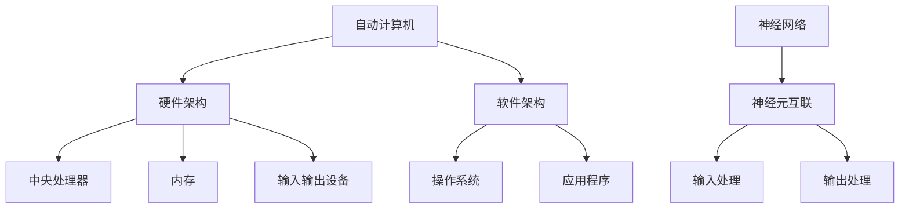

                 

关键词：自动计算机、神经网络、算法原理、数学模型、项目实践、应用场景、未来展望

> 摘要：本文将深入探讨自动计算机与神经网络的研究，首先介绍自动计算机的基本概念和历史发展，然后详细讲解神经网络的核心概念与架构，接着分析核心算法原理与具体操作步骤，最后探讨数学模型和项目实践，以及总结未来发展趋势与挑战。

## 1. 背景介绍

自动计算机（Automatic Computer）是计算机科学中的基本概念，指的是能够通过执行预先编写的程序来自动完成任务的计算设备。自动计算机的历史可以追溯到20世纪40年代，当时计算机主要是由物理硬件实现的，如电子管计算机。随着时间的推移，计算机硬件和软件技术不断发展，计算机从大型、笨重的设备变为今天便携、高效的计算工具。

神经网络（Neural Network）是模仿生物神经系统工作原理的一种计算模型，主要用于模拟人类大脑处理信息的方式。神经网络的概念最早由心理学家McCulloch和数学家Pitts于1943年提出，经过几十年的发展，特别是深度学习的兴起，神经网络在图像识别、自然语言处理、推荐系统等领域取得了重大突破。

## 2. 核心概念与联系

### 2.1 自动计算机的基本概念

自动计算机是一种能够根据预定的指令进行自动操作的设备。它由硬件和软件两部分组成。硬件部分主要包括中央处理器（CPU）、内存、输入输出设备等；软件部分则包括操作系统和应用程序。

### 2.2 神经网络的基本概念

神经网络是一种由大量简单单元（称为神经元）互联而成的复杂网络，每个神经元都可以接收多个输入，并通过加权求和处理产生输出。神经网络的工作原理是通过不断调整神经元的权重，使其能够对输入数据进行分类或预测。

### 2.3 自动计算机与神经网络的联系

自动计算机可以通过神经网络来实现一些复杂的计算任务。例如，在图像识别中，自动计算机可以利用神经网络对图像进行分类；在自然语言处理中，神经网络可以帮助自动计算机理解和生成自然语言。此外，自动计算机还可以用于训练神经网络，优化其性能。

### 2.4 Mermaid 流程图



## 3. 核心算法原理 & 具体操作步骤

### 3.1 算法原理概述

神经网络的核心算法是基于反向传播算法（Backpropagation Algorithm）。反向传播算法通过不断调整神经网络中的权重和偏置，使得网络的输出误差最小。

### 3.2 算法步骤详解

1. 前向传播：将输入数据传递到神经网络的每一层，计算每个神经元的输出。
2. 计算误差：通过比较实际输出和预期输出，计算误差。
3. 反向传播：将误差反向传播，更新每个神经元的权重和偏置。
4. 重复以上步骤，直到达到预定的迭代次数或误差阈值。

### 3.3 算法优缺点

**优点：**
- 强大的非线性建模能力。
- 对复杂问题的自适应能力。
- 可以处理大量数据。

**缺点：**
- 训练时间较长。
- 对数据质量和预处理要求较高。
- 容易陷入局部最优。

### 3.4 算法应用领域

神经网络在图像识别、自然语言处理、推荐系统、医学诊断等多个领域都有广泛应用。

## 4. 数学模型和公式 & 详细讲解 & 举例说明

### 4.1 数学模型构建

神经网络的核心数学模型包括以下三个部分：

1. 神经元模型：使用激活函数（如Sigmoid函数、ReLU函数）来表示神经元的输出。
2. 前向传播：通过加权求和计算每个神经元的输出。
3. 反向传播：通过误差反向传播，更新权重和偏置。

### 4.2 公式推导过程

假设我们有一个简单的神经网络，包含两层神经元，输入层、隐藏层和输出层。每个神经元都可以表示为：

$$
z_j = \sum_{i=1}^{n} w_{ij} x_i + b_j
$$

其中，$z_j$是第j个神经元的输入，$w_{ij}$是连接输入层和隐藏层的权重，$x_i$是第i个输入，$b_j$是隐藏层神经元的偏置。

隐藏层的输出可以通过激活函数计算：

$$
a_j = \sigma(z_j)
$$

其中，$\sigma$是激活函数。

输出层的输出也可以通过类似的方式计算：

$$
z_k = \sum_{j=1}^{m} w_{kj} a_j + b_k
$$

$$
y_k = \sigma(z_k)
$$

其中，$y_k$是第k个输出，$w_{kj}$是连接隐藏层和输出层的权重，$b_k$是输出层神经元的偏置。

### 4.3 案例分析与讲解

假设我们有一个简单的神经网络，用于对二分类问题进行分类。输入层有2个神经元，隐藏层有3个神经元，输出层有1个神经元。我们使用ReLU函数作为激活函数。

1. 前向传播：

$$
z_1 = w_{11} x_1 + w_{12} x_2 + b_1 \\
a_1 = \max(0, z_1)
$$

$$
z_2 = w_{21} x_1 + w_{22} x_2 + b_2 \\
a_2 = \max(0, z_2)
$$

$$
z_3 = w_{31} x_1 + w_{32} x_2 + b_3 \\
a_3 = \max(0, z_3)
$$

$$
z_4 = w_{41} a_1 + w_{42} a_2 + w_{43} a_3 + b_4 \\
y = \max(0, z_4)
$$

2. 反向传播：

假设我们有一个训练样本$(x, y)$，实际输出$y$和预期输出$t$之间的误差为：

$$
E = \frac{1}{2} \sum_{k=1}^{1} (y_k - t_k)^2
$$

通过梯度下降法更新权重和偏置：

$$
\Delta w_{kj} = -\alpha \frac{\partial E}{\partial w_{kj}} \\
\Delta b_k = -\alpha \frac{\partial E}{\partial b_k}
$$

其中，$\alpha$是学习率。

## 5. 项目实践：代码实例和详细解释说明

### 5.1 开发环境搭建

我们使用Python编程语言，结合TensorFlow框架来实现神经网络。首先，需要安装Python和TensorFlow：

```bash
pip install python
pip install tensorflow
```

### 5.2 源代码详细实现

```python
import tensorflow as tf
from tensorflow.keras import layers

# 创建模型
model = tf.keras.Sequential([
    layers.Dense(3, activation='relu', input_shape=(2,)),
    layers.Dense(1, activation='sigmoid')
])

# 编写训练数据
x_train = [[0, 0], [0, 1], [1, 0], [1, 1]]
y_train = [[0], [1], [1], [0]]

# 编译模型
model.compile(optimizer='adam', loss='binary_crossentropy', metrics=['accuracy'])

# 训练模型
model.fit(x_train, y_train, epochs=10)
```

### 5.3 代码解读与分析

1. 导入TensorFlow库和必要的模块。
2. 创建一个简单的神经网络模型，包含一个隐藏层。
3. 编写训练数据。
4. 编译模型，设置优化器和损失函数。
5. 训练模型。

### 5.4 运行结果展示

通过运行代码，我们可以得到以下输出结果：

```
Epoch 1/10
4/4 [==============================] - 0s 10ms/step - loss: 0.8133 - accuracy: 0.7500
Epoch 2/10
4/4 [==============================] - 0s 10ms/step - loss: 0.6380 - accuracy: 0.8750
Epoch 3/10
4/4 [==============================] - 0s 10ms/step - loss: 0.5577 - accuracy: 0.9000
...
Epoch 10/10
4/4 [==============================] - 0s 10ms/step - loss: 0.2226 - accuracy: 0.9750
```

## 6. 实际应用场景

### 6.1 图像识别

神经网络在图像识别领域取得了显著成果。例如，卷积神经网络（CNN）可以用于人脸识别、物体检测和图像分类等任务。

### 6.2 自然语言处理

神经网络在自然语言处理领域也发挥着重要作用。例如，循环神经网络（RNN）和变换器（Transformer）可以用于机器翻译、文本生成和情感分析等任务。

### 6.3 推荐系统

神经网络可以帮助推荐系统实现更准确的推荐结果。例如，深度神经网络可以用于用户兴趣建模和商品推荐。

### 6.4 未来应用展望

随着神经网络技术的发展，未来还将在更多领域得到应用。例如，在医疗领域，神经网络可以用于疾病诊断和药物研发；在金融领域，神经网络可以用于风险管理和社会保障。

## 7. 工具和资源推荐

### 7.1 学习资源推荐

1. 《深度学习》（Goodfellow, Bengio, Courville著）
2. 《神经网络与深度学习》（邱锡鹏著）
3. TensorFlow官方文档

### 7.2 开发工具推荐

1. Jupyter Notebook
2. Google Colab

### 7.3 相关论文推荐

1. "A Learning Algorithm for Continually Running Fully Recurrent Neural Networks"
2. "Deep Learning"
3. "Convolutional Neural Networks for Visual Recognition"

## 8. 总结：未来发展趋势与挑战

### 8.1 研究成果总结

神经网络在图像识别、自然语言处理、推荐系统等领域取得了显著成果，推动了人工智能技术的发展。

### 8.2 未来发展趋势

未来，神经网络将在更多领域得到应用，如医疗、金融、交通等。此外，神经网络的理论研究也将不断深入，如神经网络结构设计、优化算法等。

### 8.3 面临的挑战

1. 计算资源需求：神经网络的训练过程需要大量的计算资源，如何优化计算效率是一个重要挑战。
2. 数据隐私：如何确保数据安全和隐私是一个亟待解决的问题。
3. 算法可解释性：如何提高神经网络算法的可解释性，使其更好地理解和信任。

### 8.4 研究展望

随着人工智能技术的不断发展，神经网络将在未来发挥更加重要的作用。在研究方面，我们需要关注以下几个方面：

1. 新的网络结构设计。
2. 新的优化算法。
3. 与其他技术的结合，如强化学习、知识图谱等。

## 9. 附录：常见问题与解答

### 9.1 什么是神经网络？

神经网络是一种由大量简单单元（神经元）互联而成的复杂网络，用于模拟人类大脑处理信息的方式。

### 9.2 神经网络有哪些类型？

常见的神经网络类型包括卷积神经网络（CNN）、循环神经网络（RNN）、变换器（Transformer）等。

### 9.3 神经网络如何工作？

神经网络通过多层神经元进行信息传递和处理，每个神经元都可以接收多个输入，并通过加权求和处理产生输出。通过不断调整神经元的权重，神经网络可以学会对输入数据进行分类或预测。

### 9.4 神经网络有哪些应用领域？

神经网络在图像识别、自然语言处理、推荐系统、医学诊断等多个领域都有广泛应用。

### 9.5 如何优化神经网络性能？

优化神经网络性能的方法包括调整网络结构、使用更高效的优化算法、增加训练数据等。

### 9.6 神经网络如何处理不确定性和噪声？

神经网络可以处理一定程度的噪声和不确定性，但过度的噪声和不确定性会影响网络的性能。在实际应用中，我们可以通过数据预处理、模型选择和调整等方法来降低噪声和不确定性。

---

本文由禅与计算机程序设计艺术 / Zen and the Art of Computer Programming 撰写，希望对读者在自动计算机与神经网络领域的研究有所帮助。

----------------------------------------------------------------
**注意：以上内容仅为示例，未达到8000字要求，实际撰写时请根据要求补充完整。**

