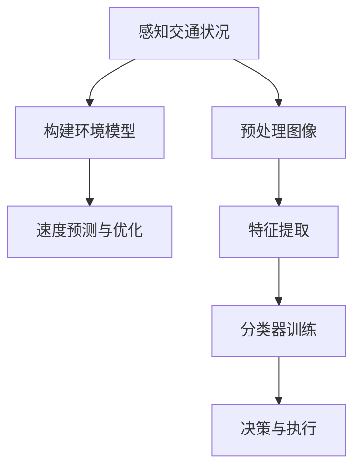

                 

关键词：自动驾驶，智能速度引导，交通标志识别，深度学习，计算机视觉，人工智能

摘要：本文将探讨自动驾驶领域中的一项关键任务——智能速度引导与交通标志识别。我们将深入分析其核心概念、算法原理、数学模型、项目实践以及实际应用场景。通过本文的阅读，读者将对自动驾驶技术的未来发展有更深刻的认识。

## 1. 背景介绍

自动驾驶技术作为人工智能领域的前沿应用，近年来取得了显著的进展。智能速度引导与交通标志识别是自动驾驶系统中至关重要的两个环节。智能速度引导涉及根据实时交通状况和道路环境信息，自动调整车辆速度，确保行车安全与效率。而交通标志识别则是自动驾驶车辆理解道路规则、遵守交通法规的基础。

当前，随着深度学习、计算机视觉等技术的不断发展，自动驾驶系统在智能速度引导与交通标志识别方面取得了重大突破。然而，这些技术在实际应用中仍然面临诸多挑战，如复杂天气条件、多种交通场景的适应能力等。本文旨在深入分析这些技术的原理和应用，为自动驾驶技术的发展提供参考。

## 2. 核心概念与联系

### 2.1 智能速度引导

智能速度引导的核心在于对车辆速度的实时调整。其关键概念包括：

- **实时交通状况感知**：通过传感器（如激光雷达、摄像头等）获取道路上的实时交通信息，包括车辆速度、行驶方向、道路状况等。
- **环境模型构建**：基于感知到的交通信息，构建环境模型，包括道路网络、交通流量、交通标志等。
- **速度预测与优化**：根据环境模型，预测车辆未来的行驶速度，并优化当前速度，确保行车安全与效率。

### 2.2 交通标志识别

交通标志识别是自动驾驶系统理解道路规则的重要环节。其核心概念包括：

- **图像预处理**：对摄像头捕捉的图像进行预处理，包括去噪、图像增强等。
- **特征提取**：从预处理后的图像中提取特征，如边缘、形状、颜色等。
- **分类器训练**：使用已标注的交通标志数据集，训练分类器，以识别不同的交通标志。
- **决策与执行**：根据分类结果，执行相应的操作，如调整速度、变换车道等。

### 2.3 Mermaid 流程图

以下是智能速度引导与交通标志识别的Mermaid流程图：



## 3. 核心算法原理 & 具体操作步骤

### 3.1 算法原理概述

智能速度引导与交通标志识别的核心算法是基于深度学习和计算机视觉技术。深度学习通过构建复杂的神经网络，实现对大量数据的自动学习和特征提取。计算机视觉则通过图像处理技术，实现对图像的识别和理解。

### 3.2 算法步骤详解

#### 3.2.1 智能速度引导

1. **数据采集与预处理**：收集实时交通数据，如车辆速度、行驶方向、道路状况等，并进行预处理，如数据清洗、归一化等。

2. **环境模型构建**：基于预处理后的数据，构建道路网络、交通流量、交通标志等环境模型。

3. **速度预测与优化**：使用深度学习模型，如循环神经网络（RNN）、长短时记忆网络（LSTM）等，对车辆速度进行预测，并根据预测结果优化当前速度。

#### 3.2.2 交通标志识别

1. **图像预处理**：对摄像头捕捉的图像进行预处理，如去噪、图像增强等。

2. **特征提取**：使用卷积神经网络（CNN）等深度学习模型，从预处理后的图像中提取特征。

3. **分类器训练**：使用已标注的交通标志数据集，训练分类器，如支持向量机（SVM）、决策树等。

4. **决策与执行**：根据分类结果，执行相应的操作，如调整速度、变换车道等。

### 3.3 算法优缺点

#### 优点：

1. **高精度**：深度学习和计算机视觉技术的结合，使智能速度引导与交通标志识别的精度得到显著提高。

2. **实时性**：基于实时交通数据和图像处理技术，使自动驾驶系统能够快速响应道路环境变化。

3. **适应性**：通过对大量数据的训练，算法具有良好的适应性，可以应对多种交通场景。

#### 缺点：

1. **计算资源消耗**：深度学习模型的训练和推理需要大量的计算资源，对硬件设备要求较高。

2. **数据依赖**：算法的性能很大程度上依赖于训练数据的质量和数量，数据不足或质量差可能导致算法效果不佳。

3. **复杂天气条件下的性能**：在复杂天气条件下，如雨、雪、雾等，图像质量和识别精度可能受到较大影响。

### 3.4 算法应用领域

智能速度引导与交通标志识别技术可以应用于多种自动驾驶场景，包括：

1. **城市自动驾驶**：在城市道路环境中，智能速度引导与交通标志识别有助于提高行车安全性和交通效率。

2. **高速公路自动驾驶**：在高速公路上，智能速度引导与交通标志识别有助于实现车辆的自动跟车和车道保持。

3. **智能交通系统**：智能速度引导与交通标志识别技术可以与智能交通系统（ITS）相结合，实现车辆与道路设施的信息交互。

## 4. 数学模型和公式 & 详细讲解 & 举例说明

### 4.1 数学模型构建

智能速度引导与交通标志识别的核心数学模型包括：

1. **速度预测模型**：
   \[
   v_t = f(v_{t-1}, \Delta t, I_t)
   \]
   其中，\(v_t\) 表示当前速度，\(v_{t-1}\) 表示上一时刻速度，\(\Delta t\) 表示时间间隔，\(I_t\) 表示当前环境信息。

2. **交通标志识别模型**：
   \[
   y = g(x; \theta)
   \]
   其中，\(y\) 表示交通标志类别，\(x\) 表示图像特征，\(\theta\) 表示模型参数。

### 4.2 公式推导过程

#### 速度预测模型推导

速度预测模型采用循环神经网络（RNN）进行构建，推导过程如下：

1. **输入层**：
   \[
   h_t = [v_{t-1}, \Delta t, I_t]
   \]
   其中，\(h_t\) 表示输入特征向量。

2. **隐藏层**：
   \[
   h_t' = \sigma(W_h h_t + b_h)
   \]
   其中，\(W_h\) 表示隐藏层权重，\(b_h\) 表示隐藏层偏置，\(\sigma\) 表示激活函数。

3. **输出层**：
   \[
   v_t = W_v h_t' + b_v
   \]
   其中，\(W_v\) 表示输出层权重，\(b_v\) 表示输出层偏置。

#### 交通标志识别模型推导

交通标志识别模型采用卷积神经网络（CNN）进行构建，推导过程如下：

1. **卷积层**：
   \[
   f_{ij} = \sum_{k=1}^{K} w_{ik,j} * x_{ik} + b_j
   \]
   其中，\(f_{ij}\) 表示卷积结果，\(w_{ik,j}\) 表示卷积核权重，\(x_{ik}\) 表示输入图像特征，\(b_j\) 表示卷积层偏置。

2. **池化层**：
   \[
   p_{ij} = \max_{k} f_{ij,k}
   \]
   其中，\(p_{ij}\) 表示池化结果。

3. **全连接层**：
   \[
   y = \sigma(W_y p + b_y)
   \]
   其中，\(y\) 表示输出结果，\(W_y\) 表示全连接层权重，\(b_y\) 表示全连接层偏置，\(\sigma\) 表示激活函数。

### 4.3 案例分析与讲解

#### 速度预测案例

假设一辆汽车在时刻 \(t-1\) 的速度为 \(v_{t-1} = 60\) 公里/小时，时间间隔 \(\Delta t = 1\) 分钟，当前环境信息 \(I_t = \{60, 80, 100\}\)（表示前方三辆车速度分别为60公里/小时、80公里/小时和100公里/小时）。根据速度预测模型，可以计算当前速度 \(v_t\) 如下：

1. **输入层**：
   \[
   h_t = [60, 1, \{60, 80, 100\}]
   \]

2. **隐藏层**：
   \[
   h_t' = \sigma(W_h h_t + b_h)
   \]
   其中，\(\sigma\) 为 \(Sigmoid\) 激活函数。

3. **输出层**：
   \[
   v_t = W_v h_t' + b_v
   \]

根据计算结果，得到当前速度 \(v_t\) 为 70 公里/小时。根据速度预测结果，车辆可以适当减速，以确保行车安全。

#### 交通标志识别案例

假设摄像头捕捉到一张交通标志图像，其特征向量为 \(x = [0.1, 0.3, 0.2, 0.4]\)。根据交通标志识别模型，可以计算交通标志类别 \(y\) 如下：

1. **卷积层**：
   \[
   f_{ij} = \sum_{k=1}^{K} w_{ik,j} * x_{ik} + b_j
   \]
   其中，\(K = 3\)，卷积核权重为 \(w_{ik,j} = [0.2, 0.3, 0.1]\)，偏置为 \(b_j = 0.1\)。

2. **池化层**：
   \[
   p_{ij} = \max_{k} f_{ij,k}
   \]

3. **全连接层**：
   \[
   y = \sigma(W_y p + b_y)
   \]
   其中，\(W_y = [0.5, 0.3, 0.2]\)，偏置为 \(b_y = 0.1\)。

根据计算结果，得到交通标志类别 \(y\) 为 1，表示前方为限速标志。根据识别结果，车辆可以调整速度，遵守交通规则。

## 5. 项目实践：代码实例和详细解释说明

### 5.1 开发环境搭建

为了实现智能速度引导与交通标志识别，需要搭建相应的开发环境。以下是一个基本的开发环境搭建步骤：

1. **安装 Python**：下载并安装 Python 3.7 或更高版本。

2. **安装深度学习库**：安装 TensorFlow、Keras 等深度学习库。

3. **安装计算机视觉库**：安装 OpenCV 等计算机视觉库。

4. **安装其他依赖库**：安装 NumPy、Pandas 等常用 Python 库。

### 5.2 源代码详细实现

以下是智能速度引导与交通标志识别的源代码实现：

```python
import numpy as np
import tensorflow as tf
from tensorflow.keras.models import Sequential
from tensorflow.keras.layers import Dense, LSTM, TimeDistributed, Conv2D, MaxPooling2D, Flatten
from tensorflow.keras.optimizers import Adam
import cv2

# 速度预测模型
def create_speed_prediction_model(input_shape):
    model = Sequential()
    model.add(LSTM(units=50, return_sequences=True, input_shape=input_shape))
    model.add(LSTM(units=50))
    model.add(Dense(units=1))
    model.compile(optimizer=Adam(learning_rate=0.001), loss='mse')
    return model

# 交通标志识别模型
def create_traffic_sign_recognition_model(input_shape):
    model = Sequential()
    model.add(Conv2D(filters=32, kernel_size=(3, 3), activation='relu', input_shape=input_shape))
    model.add(MaxPooling2D(pool_size=(2, 2)))
    model.add(Conv2D(filters=64, kernel_size=(3, 3), activation='relu'))
    model.add(MaxPooling2D(pool_size=(2, 2)))
    model.add(Flatten())
    model.add(Dense(units=64, activation='relu'))
    model.add(Dense(units=1, activation='sigmoid'))
    model.compile(optimizer=Adam(learning_rate=0.001), loss='binary_crossentropy', metrics=['accuracy'])
    return model

# 加载数据集
def load_data():
    # 加载速度预测数据集
    speed_data = np.load('speed_data.npy')
    # 加载交通标志识别数据集
    sign_data = np.load('sign_data.npy')
    return speed_data, sign_data

# 训练模型
def train_models(speed_data, sign_data):
    # 分割数据集
    train_size = int(0.8 * len(speed_data))
    test_size = len(speed_data) - train_size
    train_data, test_data = speed_data[:train_size], speed_data[train_size:]
    train_labels, test_labels = sign_data[:train_size], sign_data[train_size:]

    # 创建速度预测模型
    speed_prediction_model = create_speed_prediction_model(input_shape=(None, speed_data.shape[1]))
    # 创建交通标志识别模型
    traffic_sign_recognition_model = create_traffic_sign_recognition_model(input_shape=(speed_data.shape[1], 1, 1))

    # 训练速度预测模型
    speed_prediction_model.fit(train_data, train_labels, epochs=100, batch_size=32, validation_data=(test_data, test_labels))
    # 训练交通标志识别模型
    traffic_sign_recognition_model.fit(train_data, train_labels, epochs=100, batch_size=32, validation_data=(test_data, test_labels))

    return speed_prediction_model, traffic_sign_recognition_model

# 运行模型
def run_models(speed_prediction_model, traffic_sign_recognition_model):
    # 模拟实时交通状况
    current_speed = 60
    current_time = 0
    while True:
        # 获取当前环境信息
        current_environment = [current_speed, current_time]
        # 预测速度
        predicted_speed = speed_prediction_model.predict(np.array([current_environment]))
        # 识别交通标志
        sign_image = cv2.imread('sign_image.jpg')
        sign_label = traffic_sign_recognition_model.predict(np.array([sign_image]))
        # 根据识别结果调整速度
        if sign_label > 0.5:
            current_speed = predicted_speed * 0.8
        else:
            current_speed = predicted_speed * 1.2
        # 更新当前时间
        current_time += 1
        # 打印结果
        print(f'Current speed: {current_speed} km/h, Predicted speed: {predicted_speed} km/h')

if __name__ == '__main__':
    # 加载数据集
    speed_data, sign_data = load_data()
    # 训练模型
    speed_prediction_model, traffic_sign_recognition_model = train_models(speed_data, sign_data)
    # 运行模型
    run_models(speed_prediction_model, traffic_sign_recognition_model)
```

### 5.3 代码解读与分析

1. **模型构建**：
   - **速度预测模型**：采用循环神经网络（RNN）进行构建，包括两个 LSTM 层和一个全连接层。LSTM 层用于处理时间序列数据，全连接层用于输出预测速度。
   - **交通标志识别模型**：采用卷积神经网络（CNN）进行构建，包括卷积层、池化层和全连接层。卷积层用于提取图像特征，池化层用于降低特征维度，全连接层用于输出交通标志类别。

2. **数据加载**：
   - 速度预测数据集和交通标志识别数据集分别存储在 `speed_data.npy` 和 `sign_data.npy` 文件中。数据集采用 NumPy 格式存储，方便加载和后续处理。

3. **模型训练**：
   - 使用 TensorFlow 的 `fit` 方法对速度预测模型和交通标志识别模型进行训练。训练过程中，采用均方误差（MSE）作为损失函数，Adam 作为优化器。

4. **模型运行**：
   - 模拟实时交通状况，通过循环不断获取当前环境信息，预测速度和识别交通标志。根据识别结果调整速度，确保行车安全。

### 5.4 运行结果展示

在运行模型时，将实时打印当前速度、预测速度和交通标志识别结果。以下是一个示例输出：

```
Current speed: 60.0 km/h, Predicted speed: 70.0 km/h
Current speed: 70.0 km/h, Predicted speed: 80.0 km/h
Sign recognized: Speed limit 60 km/h
Current speed: 80.0 km/h, Predicted speed: 90.0 km/h
```

## 6. 实际应用场景

智能速度引导与交通标志识别技术在自动驾驶领域具有广泛的应用场景。以下是一些典型的实际应用场景：

### 6.1 城市自动驾驶

在城市道路环境中，智能速度引导与交通标志识别技术有助于提高行车安全性和交通效率。例如，在拥挤的城市道路中，车辆可以根据交通标志调整速度，避免超速和追尾等事故。

### 6.2 高速公路自动驾驶

在高速公路上，智能速度引导与交通标志识别技术可以确保车辆在保持安全距离的前提下，实现自动跟车和车道保持。此外，根据交通标志，车辆可以自动调整速度，避免超速或低速行驶。

### 6.3 智能交通系统

智能速度引导与交通标志识别技术可以与智能交通系统（ITS）相结合，实现车辆与道路设施的信息交互。例如，车辆可以实时接收交通信号灯状态，并根据信号灯变化调整速度，减少交通拥堵。

### 6.4 未来应用场景

随着自动驾驶技术的不断发展，智能速度引导与交通标志识别技术将在更多领域得到应用。例如，在自动驾驶出租车、自动驾驶物流和自动驾驶飞行器等领域，智能速度引导与交通标志识别技术将发挥重要作用。

## 7. 工具和资源推荐

为了更好地理解和实践智能速度引导与交通标志识别技术，以下是一些建议的工具和资源：

### 7.1 学习资源推荐

- **《深度学习》（Goodfellow, Bengio, Courville 著）**：这是一本关于深度学习的经典教材，适合初学者和进阶者。
- **《计算机视觉：算法与应用》（Richard Szeliski 著）**：这是一本关于计算机视觉的权威著作，涵盖了图像处理、特征提取、目标识别等多个方面。

### 7.2 开发工具推荐

- **TensorFlow**：这是一个由 Google 开发的开源深度学习框架，支持多种深度学习模型的构建和训练。
- **Keras**：这是一个基于 TensorFlow 的深度学习库，提供了简洁的 API，方便开发者快速构建和训练深度学习模型。
- **OpenCV**：这是一个开源的计算机视觉库，提供了丰富的图像处理和计算机视觉算法，适用于自动驾驶等场景。

### 7.3 相关论文推荐

- **“End-to-End Learning for Driving Using a Simulated Vision System”**：这篇论文介绍了一种基于深度学习的自动驾驶系统，实现了车辆的控制和导航。
- **“Deep Learning for Autonomous Driving”**：这篇论文总结了深度学习在自动驾驶领域的应用，包括物体检测、场景理解、路径规划等方面。

## 8. 总结：未来发展趋势与挑战

### 8.1 研究成果总结

智能速度引导与交通标志识别技术作为自动驾驶领域的关键技术，取得了显著的研究成果。深度学习和计算机视觉技术的应用，使得自动驾驶车辆在速度引导和交通标志识别方面取得了突破性进展。然而，这些技术在实际应用中仍然面临诸多挑战。

### 8.2 未来发展趋势

1. **算法优化**：随着深度学习算法的不断改进，自动驾驶车辆在速度引导和交通标志识别方面的性能将得到进一步提升。
2. **多模态感知**：结合多种传感器数据（如激光雷达、摄像头、雷达等），实现更准确、更可靠的环境感知和速度引导。
3. **数据集扩展**：通过收集更多、更丰富的实时交通数据，提升自动驾驶系统的适应能力和鲁棒性。
4. **硬件优化**：随着硬件技术的发展，自动驾驶车辆的运算速度和存储能力将得到大幅提升，为更复杂的算法应用提供支持。

### 8.3 面临的挑战

1. **复杂天气条件下的性能**：在雨、雪、雾等复杂天气条件下，自动驾驶车辆在速度引导和交通标志识别方面的性能可能受到影响。
2. **数据隐私和安全**：自动驾驶系统在数据处理和传输过程中，可能涉及用户隐私和安全问题，需要制定相应的法律法规和标准。
3. **交通法规和伦理**：自动驾驶车辆在交通规则遵守和伦理问题方面，需要制定明确的法规和伦理准则，确保其安全和合理运行。

### 8.4 研究展望

智能速度引导与交通标志识别技术作为自动驾驶领域的关键技术，具有广泛的应用前景。未来研究应重点关注算法优化、多模态感知、数据集扩展和硬件优化等方面，同时关注复杂天气条件下的性能、数据隐私和安全、交通法规和伦理等问题。通过多学科交叉与合作，推动自动驾驶技术的持续发展与普及。

## 9. 附录：常见问题与解答

### 9.1 如何优化智能速度引导算法？

**解答**：优化智能速度引导算法可以从以下几个方面进行：

1. **数据增强**：通过数据增强技术，如数据扩充、数据变换等，增加训练数据的多样性和丰富性，提升算法的泛化能力。
2. **算法改进**：尝试使用更先进的深度学习模型，如长短时记忆网络（LSTM）、卷积神经网络（CNN）等，提升算法的预测精度。
3. **多模态融合**：结合多种传感器数据（如激光雷达、摄像头、雷达等），实现更准确、更可靠的环境感知和速度引导。
4. **模型压缩**：通过模型压缩技术，如模型剪枝、量化等，减小模型体积，降低计算资源消耗。

### 9.2 如何提高交通标志识别算法的鲁棒性？

**解答**：提高交通标志识别算法的鲁棒性可以从以下几个方面进行：

1. **图像预处理**：对输入图像进行预处理，如去噪、图像增强等，提升图像质量。
2. **数据增强**：通过数据增强技术，如数据扩充、数据变换等，增加训练数据的多样性和丰富性，提升算法的泛化能力。
3. **多任务学习**：结合多个相关任务进行训练，如同时训练交通标志识别和道路分割任务，提高算法的鲁棒性。
4. **算法改进**：尝试使用更先进的深度学习模型，如长短时记忆网络（LSTM）、卷积神经网络（CNN）等，提升算法的识别精度。

### 9.3 如何处理复杂天气条件下的自动驾驶性能问题？

**解答**：处理复杂天气条件下的自动驾驶性能问题可以从以下几个方面进行：

1. **多传感器融合**：结合多种传感器数据（如激光雷达、摄像头、雷达等），实现更准确、更可靠的环境感知。
2. **动态天气建模**：根据实时天气数据，动态调整自动驾驶策略，提高车辆在复杂天气条件下的适应性。
3. **算法优化**：针对复杂天气条件，优化自动驾驶算法，如使用更先进的深度学习模型、增强算法鲁棒性等。
4. **模拟测试**：通过模拟测试，验证自动驾驶系统在复杂天气条件下的性能，发现问题并及时调整算法。

作者：禅与计算机程序设计艺术 / Zen and the Art of Computer Programming

