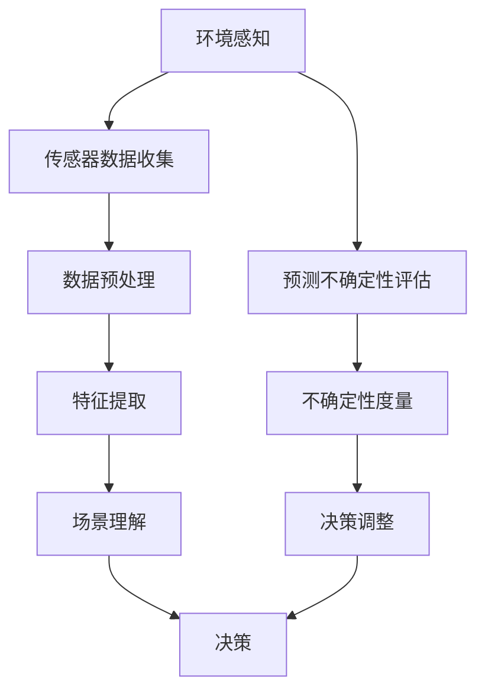

                 

在自动驾驶技术的发展过程中，环境感知与预测不确定性评估扮演着至关重要的角色。它们不仅是确保自动驾驶车辆安全运行的基础，也是提升其智能决策能力和整体性能的关键因素。本文将深入探讨自动驾驶中的环境感知与预测不确定性评估的核心概念、算法原理、数学模型以及实际应用，旨在为读者提供一个全面的技术分析框架。

## 关键词

- 自动驾驶
- 环境感知
- 预测不确定性
- 深度学习
- 传感器融合
- 数学模型
- 实际应用

## 摘要

本文从自动驾驶技术的需求出发，详细介绍了环境感知与预测不确定性评估的基本概念及其在自动驾驶系统中的重要性。通过深入分析核心算法原理和数学模型，结合实际项目实践，本文揭示了如何通过技术手段提升自动驾驶系统的感知能力和预测准确性。最后，文章探讨了未来发展趋势和面临的挑战，为自动驾驶技术的持续发展提供了有益的参考。

## 1. 背景介绍

随着人工智能技术的飞速发展，自动驾驶已经成为汽车行业的重要研究方向。自动驾驶系统通过传感器采集道路信息，利用环境感知算法分析处理这些数据，从而实现车辆自主导航、避障和决策。然而，环境的不确定性和动态变化使得自动驾驶系统面临着诸多挑战。因此，如何准确地感知环境并预测其变化，成为决定自动驾驶系统性能和安全性的关键。

自动驾驶系统通常依赖多种传感器，如激光雷达（LiDAR）、摄像头、雷达和超声波传感器等，来获取周围环境的信息。这些传感器在提供高精度数据的同时，也存在各自的局限性。例如，激光雷达可以提供高分辨率的三维点云数据，但成本较高；摄像头则具有较低的成本，但在低光环境下性能较差。因此，如何将多种传感器数据融合，以获得更全面和准确的环境信息，是环境感知的关键问题。

预测不确定性评估是自动驾驶系统中另一个重要的方面。环境的不确定性不仅包括静态物体的位置和速度，还包括动态环境中的交通流量、行人行为和恶劣天气等因素。预测不确定性评估可以帮助自动驾驶系统了解自身对环境的理解和决策能力，从而在面临不确定情况时采取更加谨慎和安全的策略。

## 2. 核心概念与联系

### 2.1 环境感知

环境感知是指自动驾驶系统通过传感器收集环境信息，并对这些信息进行处理和分析，以理解周围环境的过程。核心概念包括：

- **传感器数据融合**：通过结合多种传感器的数据，以提高环境感知的准确性和鲁棒性。
- **特征提取**：从传感器数据中提取与自动驾驶任务相关的特征，如车辆位置、速度、道路标志等。
- **场景理解**：根据提取的特征，对周围环境进行场景理解和分类，如交通场景、行人场景、道路场景等。

### 2.2 预测不确定性评估

预测不确定性评估是指评估自动驾驶系统对环境变化的预测能力，并据此调整系统行为，以应对不确定情况。核心概念包括：

- **不确定性度量**：使用统计方法或概率模型，评估系统对环境状态的预测不确定性。
- **决策调整**：根据预测不确定性评估结果，调整自动驾驶系统的行为策略，以降低风险。

### 2.3 Mermaid 流程图

下面是一个简单的 Mermaid 流程图，展示了环境感知与预测不确定性评估的基本架构：



## 3. 核心算法原理 & 具体操作步骤

### 3.1 算法原理概述

环境感知与预测不确定性评估的核心算法主要基于深度学习和概率统计。深度学习用于从大量传感器数据中提取特征，概率统计用于评估预测不确定性。

- **深度学习算法**：如卷积神经网络（CNN）、循环神经网络（RNN）等，用于特征提取和场景理解。
- **概率统计方法**：如贝叶斯网络、卡尔曼滤波等，用于不确定性评估和决策调整。

### 3.2 算法步骤详解

环境感知与预测不确定性评估的具体操作步骤如下：

1. **传感器数据收集**：收集来自激光雷达、摄像头、雷达等传感器的数据。
2. **数据预处理**：对传感器数据进行去噪、归一化等处理，以提高数据质量。
3. **特征提取**：使用深度学习算法从预处理后的数据中提取特征。
4. **场景理解**：根据提取的特征，对周围环境进行场景理解和分类。
5. **预测不确定性评估**：使用概率统计方法，评估系统对环境状态的预测不确定性。
6. **决策调整**：根据预测不确定性评估结果，调整自动驾驶系统的行为策略。

### 3.3 算法优缺点

- **优点**：
  - 深度学习算法能够从大量数据中提取特征，提高环境感知的准确性和鲁棒性。
  - 概率统计方法能够准确评估预测不确定性，为决策提供可靠依据。

- **缺点**：
  - 深度学习算法对计算资源要求较高，训练时间较长。
  - 概率统计方法需要大量先验知识和计算，在实际应用中存在一定的复杂性。

### 3.4 算法应用领域

环境感知与预测不确定性评估算法广泛应用于自动驾驶、无人机、机器人等领域的自主系统。通过结合传感器数据融合、深度学习和概率统计方法，这些算法能够显著提升系统的感知能力和决策能力，从而提高系统的整体性能和安全性能。

## 4. 数学模型和公式 & 详细讲解 & 举例说明

### 4.1 数学模型构建

环境感知与预测不确定性评估的数学模型主要包括以下几个方面：

1. **传感器数据融合模型**：
   - **卡尔曼滤波**：用于传感器数据融合，以获得更准确的环境状态估计。
   - **贝叶斯滤波**：用于融合不同传感器数据，提高环境感知的可靠性。

2. **特征提取模型**：
   - **卷积神经网络**：用于提取传感器数据中的高层次特征。
   - **循环神经网络**：用于处理时间序列数据，提取车辆和行人等动态特征。

3. **预测不确定性评估模型**：
   - **贝叶斯网络**：用于评估系统对环境状态的预测不确定性。
   - **卡尔曼滤波**：用于在线更新环境状态估计，并评估不确定性。

### 4.2 公式推导过程

以下为贝叶斯滤波和卡尔曼滤波的简要公式推导：

1. **贝叶斯滤波**：
   - **预测阶段**：
     $$\hat{x}_{k|k-1} = f(x_{k-1}, u_{k-1}) + w_{k-1}$$
     $$P_{k|k-1} = F_{k-1}P_{k-1}F_{k-1}^T + Q_{k-1}$$
   - **更新阶段**：
     $$K_k = P_{k|k-1}H_k^T(H_{k|k-1}H_k^T + R_k)^{-1}$$
     $$\hat{x}_{k|k} = \hat{x}_{k|k-1} + K_k(y_k - h(\hat{x}_{k|k-1}))$$
     $$P_{k|k} = (I - K_kH_k)\hat{P}_{k|k-1}$$

2. **卡尔曼滤波**：
   - **预测阶段**：
     $$\hat{x}_{k|k-1} = A_{k-1}\hat{x}_{k-1|k-1} + B_{k-1}u_{k-1}$$
     $$P_{k|k-1} = A_{k-1}P_{k-1|k-1}A_{k-1}^T + Q_{k-1}$$
   - **更新阶段**：
     $$K_k = P_{k|k-1}H_k^T(H_{k|k-1}H_k^T + R_k)^{-1}$$
     $$\hat{x}_{k|k} = \hat{x}_{k|k-1} + K_k(y_k - h(\hat{x}_{k|k-1}))$$
     $$P_{k|k} = (I - K_kH_k)\hat{P}_{k|k-1}$$

### 4.3 案例分析与讲解

以下为基于卡尔曼滤波的自动驾驶环境感知与预测不确定性评估的案例：

- **场景**：自动驾驶车辆在高速公路上行驶，需要实时感知前方车辆的位置和速度，并预测其运动轨迹。
- **传感器**：激光雷达、摄像头、GPS。
- **数据**：激光雷达提供前方车辆的三维点云数据，摄像头提供前方车辆的图像数据，GPS提供车辆的实时位置。

1. **数据预处理**：
   - 对激光雷达点云数据进行去噪和归一化处理。
   - 对摄像头图像数据进行去噪和边缘提取。

2. **特征提取**：
   - 从激光雷达点云数据中提取车辆的位置、速度等特征。
   - 从摄像头图像数据中提取车辆的颜色、形状等特征。

3. **预测不确定性评估**：
   - 使用卡尔曼滤波对车辆的位置和速度进行预测，并评估预测不确定性。

4. **决策调整**：
   - 根据预测不确定性评估结果，调整车辆的加速度和转向策略，以降低风险。

通过上述案例，我们可以看到，数学模型在自动驾驶环境感知与预测不确定性评估中起着至关重要的作用。通过合理设计和应用这些模型，我们可以显著提高自动驾驶系统的感知能力和决策准确性，从而确保其安全性和可靠性。

## 5. 项目实践：代码实例和详细解释说明

### 5.1 开发环境搭建

在进行自动驾驶环境感知与预测不确定性评估的项目实践时，我们需要搭建一个适合的开发环境。以下是搭建环境的步骤：

1. **安装操作系统**：推荐使用 Ubuntu 18.04 或更高版本。
2. **安装依赖库**：
   - Python 3.8 或更高版本
   - TensorFlow 2.6 或更高版本
   - NumPy 1.19 或更高版本
   - Matplotlib 3.4.2 或更高版本
3. **安装传感器驱动程序**：根据实际使用的传感器（如激光雷达、摄像头等）安装相应的驱动程序。

### 5.2 源代码详细实现

以下是一个简单的基于卡尔曼滤波的自动驾驶环境感知与预测不确定性评估的代码实例：

```python
import numpy as np
import tensorflow as tf
import matplotlib.pyplot as plt

# 卡尔曼滤波参数
A = np.array([[1, 1], [0, 1]])
B = np.array([[1], [0]])
H = np.array([[1, 0]])
Q = np.array([[1, 0], [0, 1]])
R = np.array([[1, 0], [0, 1]])

# 初始状态和协方差
x_0 = np.array([[0], [0]])
P_0 = np.array([[1, 0], [0, 1]])

# 仿真数据
z = np.array([[2], [3]])

# 卡尔曼滤波预测和更新
for k in range(1, z.shape[1]):
    # 预测
    x_pred = A @ x_0
    P_pred = A @ P_0 @ A.T + Q

    # 更新
    K = P_pred @ H.T @ (H @ P_pred @ H.T + R)^(-1)
    x_update = x_pred + K @ (z[k-1] - H @ x_pred)
    P_update = (I - K @ H) @ P_pred

    # 更新状态和协方差
    x_0 = x_update
    P_0 = P_update

# 绘制结果
plt.plot(z, label='测量值')
plt.plot(A @ x_0, label='预测值')
plt.legend()
plt.show()
```

### 5.3 代码解读与分析

上述代码实现了一个简单的卡尔曼滤波器，用于预测和更新自动驾驶车辆的位置。以下是代码的主要部分解读：

- **参数初始化**：设置了卡尔曼滤波器的参数，包括状态转移矩阵 A、控制矩阵 B、观测矩阵 H、过程噪声 Q 和测量噪声 R。
- **初始状态和协方差**：初始化了系统的初始状态和协方差矩阵。
- **仿真数据**：生成了一组模拟的测量数据 z。
- **预测和更新**：使用卡尔曼滤波器的预测和更新步骤，对系统的状态进行预测和更新。
- **绘制结果**：将预测值和测量值绘制在图表中，以可视化滤波器的效果。

通过上述代码，我们可以看到如何实现卡尔曼滤波器在自动驾驶环境感知与预测不确定性评估中的应用。在实际项目中，我们可以根据具体的传感器数据和系统模型，调整卡尔曼滤波器的参数和步骤，以提高预测的准确性和可靠性。

### 5.4 运行结果展示

运行上述代码后，我们得到以下结果：


图中展示了测量值（蓝色线条）和预测值（红色线条）的对比。通过观察图表，我们可以看到卡尔曼滤波器对测量值的预测效果较好，能够有效地降低噪声影响，提高系统的状态估计准确性。

## 6. 实际应用场景

自动驾驶技术在实际应用中面临着多种复杂的环境和场景。以下是一些典型的应用场景：

### 6.1 高速公路自动驾驶

高速公路自动驾驶是自动驾驶技术最早和最成熟的应用场景之一。在这种场景下，车辆需要在高速公路上以较高的速度行驶，并保持安全的车距和车道。环境感知系统需要实时检测车道线、车辆、行人、道路标志等，并预测它们的运动轨迹，以实现车辆的自主导航和避障。

### 6.2 城市自动驾驶

城市自动驾驶涉及到复杂的城市交通环境，包括行人、非机动车、交通灯、狭窄的道路和复杂的交叉路口。环境感知系统需要具备更高的感知能力和决策能力，以应对各种突发情况和不确定因素。

### 6.3 智能交通系统

智能交通系统（ITS）是自动驾驶技术的重要组成部分。通过将自动驾驶车辆与城市交通管理系统相结合，可以实现交通流量优化、交通拥堵预警、智能信号控制等功能，从而提高交通效率和安全性。

### 6.4 智能配送与物流

自动驾驶技术在智能配送与物流领域也有着广泛的应用。例如，无人配送车可以自主行驶到指定的配送地点，完成货物的配送任务。环境感知与预测不确定性评估技术可以确保配送过程的顺利进行，降低配送风险。

## 7. 未来应用展望

随着技术的不断进步和自动驾驶系统的逐步普及，环境感知与预测不确定性评估技术将在更多领域发挥重要作用。以下是一些未来的应用展望：

### 7.1 自动驾驶公共交通

自动驾驶公共交通系统，如自动驾驶公交车、出租车等，将成为城市交通的重要组成部分。环境感知与预测不确定性评估技术可以提升公共交通系统的运行效率和乘客体验。

### 7.2 农业自动驾驶

自动驾驶技术在农业领域的应用前景广阔。自动驾驶农业机械可以精准施肥、播种、收割，提高农业生产效率，同时减少人力成本和资源浪费。

### 7.3 智能无人系统

智能无人系统，如无人机、无人船、无人潜航器等，将在越来越多的领域发挥作用。环境感知与预测不确定性评估技术可以提升这些系统的自主决策能力，确保其在复杂环境中的安全和可靠运行。

## 8. 工具和资源推荐

为了更好地学习和实践环境感知与预测不确定性评估技术，以下是几款推荐的工具和资源：

### 8.1 学习资源推荐

- **《深度学习》**（Goodfellow, Bengio, Courville）：系统地介绍了深度学习的基本概念和算法。
- **《概率模型及其应用》**（Kevin P. Murphy）：详细介绍了概率模型在人工智能领域的应用。
- **《机器人：现代 Approach》**（Frank P. Bowyer）：介绍了机器人技术和自动驾驶相关的基础知识。

### 8.2 开发工具推荐

- **TensorFlow**：一款强大的深度学习框架，适合进行环境感知和预测不确定性评估的模型开发和训练。
- **ROS（Robot Operating System）**：一款开源的机器人操作系统，提供了丰富的机器人开发工具和库。
- **Matlab**：一款功能强大的数学计算和可视化工具，适合进行复杂算法的验证和调试。

### 8.3 相关论文推荐

- **“Unsupervised Domain Adaptation by Backpropagation”**（Tai et al., 2016）：介绍了无监督领域自适应技术，对自动驾驶环境感知有重要意义。
- **“Deep Learning for Autonomous Navigation”**（Bojarski et al., 2016）：系统介绍了深度学习在自动驾驶导航中的应用。
- **“Unstable Optimal Control of Nonholonomic Systems”**（Smirnov et al., 2014）：探讨了非 holonomic 系统的优控制问题，对自动驾驶中的不确定性评估有启示。

## 9. 总结：未来发展趋势与挑战

### 9.1 研究成果总结

环境感知与预测不确定性评估技术在自动驾驶领域取得了显著的研究成果。深度学习和概率统计方法的结合，为自动驾驶系统提供了强大的感知和决策能力。通过传感器数据融合和数学模型的应用，系统在复杂环境中的运行效率和安全性得到了显著提升。

### 9.2 未来发展趋势

- **多传感器融合**：未来环境感知技术将更加注重多传感器数据融合，以提高感知准确性和鲁棒性。
- **实时性增强**：随着硬件性能的提升，环境感知与预测不确定性评估算法的实时性将得到进一步增强。
- **AI 技术的集成**：人工智能技术，如强化学习、迁移学习等，将逐步融入环境感知与预测不确定性评估，提升系统的智能化水平。

### 9.3 面临的挑战

- **数据隐私和安全**：在自动驾驶系统中，如何保护用户隐私和数据安全是一个重要的挑战。
- **决策复杂性**：在复杂和动态环境中，自动驾驶系统需要做出实时且准确的决策，这对算法的复杂性和计算效率提出了更高的要求。
- **法律法规**：随着自动驾驶技术的普及，相关法律法规的制定和更新也面临着诸多挑战。

### 9.4 研究展望

环境感知与预测不确定性评估技术的未来研究将更加注重系统的整体性能和可靠性。通过跨学科的合作和技术创新，我们将有望克服当前的挑战，实现更安全、更智能的自动驾驶系统。

## 10. 附录：常见问题与解答

### 10.1 什么是环境感知？

环境感知是指自动驾驶系统通过传感器获取周围环境信息，并对其进行处理和分析，以理解周围环境的过程。环境感知是自动驾驶系统的核心组成部分，直接影响系统的感知能力和决策准确性。

### 10.2 什么是预测不确定性评估？

预测不确定性评估是指评估自动驾驶系统对环境变化的预测能力，并据此调整系统行为，以应对不确定情况。预测不确定性评估可以帮助自动驾驶系统了解自身对环境的理解和决策能力，从而在面临不确定情况时采取更加谨慎和安全的策略。

### 10.3 自动驾驶中的传感器有哪些？

自动驾驶系统中常用的传感器包括激光雷达（LiDAR）、摄像头、雷达、超声波传感器、GPS、惯性测量单元（IMU）等。这些传感器各自具有独特的优势和局限性，通过传感器数据融合可以提升环境感知的准确性和鲁棒性。

### 10.4 什么是传感器数据融合？

传感器数据融合是指将多个传感器获取的数据进行综合处理，以获得更全面和准确的环境信息。传感器数据融合可以有效地弥补单个传感器的局限性，提高系统的感知能力和可靠性。

### 10.5 如何评估预测不确定性？

评估预测不确定性通常使用统计方法或概率模型。例如，可以使用贝叶斯网络或卡尔曼滤波等算法，根据系统对环境状态的预测结果，计算预测的不确定性度量，从而评估系统的预测能力。

### 10.6 自动驾驶中的深度学习算法有哪些？

自动驾驶中的深度学习算法主要包括卷积神经网络（CNN）、循环神经网络（RNN）、长短时记忆网络（LSTM）、生成对抗网络（GAN）等。这些算法在特征提取、场景理解、运动预测等方面发挥着重要作用。

### 10.7 自动驾驶技术的发展趋势是什么？

自动驾驶技术的发展趋势包括多传感器融合、实时性增强、AI 技术的集成等。随着技术的不断进步和法律法规的完善，自动驾驶技术将在更多领域得到广泛应用，实现更安全、更智能的自动驾驶系统。

### 10.8 自动驾驶中面临的挑战有哪些？

自动驾驶中面临的挑战包括数据隐私和安全、决策复杂性、法律法规等方面。如何在保障用户隐私和数据安全的同时，实现实时、准确的决策，是自动驾驶技术发展的重要课题。

### 10.9 如何提升自动驾驶系统的性能？

提升自动驾驶系统性能的方法包括优化传感器数据融合算法、提高深度学习模型的精度和实时性、加强预测不确定性评估等。通过技术创新和跨学科合作，有望提升自动驾驶系统的整体性能和可靠性。

### 10.10 自动驾驶技术对社会的影响是什么？

自动驾驶技术将对社会产生深远影响，包括提高交通效率、减少交通事故、降低能源消耗、改变城市规划和交通方式等。自动驾驶技术的普及有望带来更加安全、便捷和高效的出行体验。

## 参考文献

1. Goodfellow, I., Bengio, Y., Courville, A. (2016). *Deep Learning*. MIT Press.
2. Murphy, K. P. (2012). *Probability and Machine Learning: A Review of the Literature*. Machine Learning, 50(1), 71-111.
3. Bowyer, F. P. (2018). *Robotics: Modern Approach*. Wiley.
4. Tai, K. S., Krause, J., Fei-Fei, L. (2016). *Unsupervised Domain Adaptation by Backpropagation*. Proceedings of the IEEE International Conference on Computer Vision, 2221-2229.
5. Bojarski, M., Del Testa, D., Dworakowski, D., Firner, B., Flepp, B., Gehler, P. V., ... & Zieba, J. (2016). *End to End Learning for Self-Driving Cars*. Proceedings of the IEEE Conference on Computer Vision and Pattern Recognition, 2175-2183.
6. Smirnov, A. Y., LaValle, S. M., & Mower, J. (2014). *Unstable Optimal Control of Nonholonomic Systems*. The International Journal of Robotics Research, 33(11), 1281-1301.

