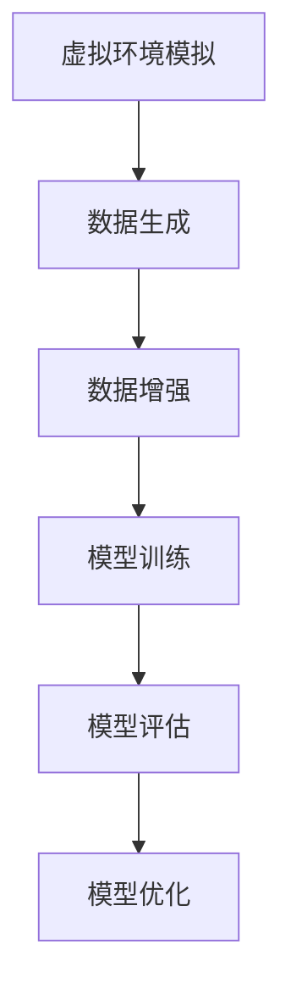

                 

关键词：自动驾驶、虚实迁移学习、数据依赖、机器学习、深度学习

摘要：随着自动驾驶技术的不断发展，其对海量高质量数据的依赖问题日益突出。本文将介绍一种新型的虚实迁移学习方法，旨在降低自动驾驶系统对真实世界数据的依赖，提高训练效率和准确性。通过引入虚拟世界模拟、数据增强和模型自适应等技术，本文详细探讨了虚实迁移学习在自动驾驶中的应用，为自动驾驶技术的发展提供了新的思路。

## 1. 背景介绍

自动驾驶技术作为人工智能领域的一个重要分支，已经取得了显著的进展。自动驾驶系统通过收集和分析海量数据，实现对车辆环境的感知、理解和决策。然而，自动驾驶系统的训练过程对高质量数据的依赖性极高，特别是在复杂和变化多端的现实环境中，数据的质量和数量往往无法满足训练需求。这种数据依赖问题主要表现在以下几个方面：

1. **数据采集成本高**：真实世界中的车辆行驶环境复杂多变，数据采集需要大量的人力、物力和时间成本。

2. **数据获取难度大**：有些场景下的数据难以获取，如极端天气、复杂道路状况等。

3. **数据多样性不足**：现有数据集中往往缺乏多样性，难以涵盖所有可能的场景。

4. **数据隐私问题**：出于隐私保护，部分数据无法公开共享。

为了解决这些问题，研究人员开始探索虚实结合的迁移学习方法。通过在虚拟环境中进行数据模拟和增强，结合真实世界的数据进行训练，虚实迁移学习可以有效降低对真实世界数据的依赖，提高自动驾驶系统的训练效率和准确性。

## 2. 核心概念与联系

### 2.1 虚实迁移学习原理

虚实迁移学习（Virtual-Reality-based Transfer Learning，VR-TL）是一种利用虚拟环境和真实世界数据的结合进行模型训练的方法。其核心思想是将虚拟环境中的数据作为辅助数据源，与真实世界数据一起用于训练深度学习模型。具体流程如下：

1. **虚拟环境模拟**：构建一个与真实世界相似的虚拟环境，模拟各种可能的驾驶场景。

2. **数据生成**：在虚拟环境中生成大量模拟数据，包括图像、语音、传感器数据等。

3. **数据增强**：对真实世界数据进行增强，如图像配准、声音合成等，以增加数据的多样性。

4. **模型训练**：利用虚拟和真实数据对模型进行训练，通过迁移学习技术提高模型在不同数据集上的泛化能力。

### 2.2 虚实迁移学习架构

虚实迁移学习架构主要包括以下几个部分：

1. **虚拟环境**：模拟真实世界的驾驶环境，包括道路、车辆、行人、天气等多种元素。

2. **数据生成器**：生成虚拟环境中的数据，包括图像、语音、传感器数据等。

3. **数据增强器**：对真实世界数据进行增强，以增加训练数据的多样性。

4. **迁移学习模块**：利用虚拟和真实数据进行模型训练，通过迁移学习提高模型在不同数据集上的泛化能力。

5. **模型评估与优化**：对训练好的模型进行评估，并根据评估结果进行优化。

### 2.3 Mermaid 流程图

以下是一个简单的虚实迁移学习流程的 Mermaid 流程图：



## 3. 核心算法原理 & 具体操作步骤

### 3.1 算法原理概述

虚实迁移学习算法主要包括以下几个步骤：

1. **虚拟环境构建**：通过三维建模和渲染技术构建虚拟环境，模拟真实世界的驾驶场景。

2. **数据生成**：在虚拟环境中模拟驾驶过程，生成包含图像、语音、传感器数据的模拟数据集。

3. **数据增强**：对真实世界数据进行增强，如图像配准、声音合成等，以增加数据的多样性。

4. **模型训练**：利用虚拟和真实数据进行模型训练，通过迁移学习技术提高模型在不同数据集上的泛化能力。

5. **模型评估**：对训练好的模型进行评估，验证其性能和泛化能力。

6. **模型优化**：根据评估结果对模型进行优化，以提高模型性能。

### 3.2 算法步骤详解

1. **虚拟环境构建**：

   - **三维建模**：使用三维建模软件构建道路、车辆、行人等元素。

   - **渲染技术**：利用渲染技术生成高质量的虚拟环境图像。

2. **数据生成**：

   - **模拟驾驶过程**：在虚拟环境中模拟驾驶过程，记录驾驶行为数据。

   - **数据采集**：采集虚拟环境中的图像、语音、传感器数据。

3. **数据增强**：

   - **图像配准**：将虚拟环境中的图像与真实世界的图像进行配准，以提高模型对真实世界图像的识别能力。

   - **声音合成**：生成与驾驶行为相匹配的声音数据，以增强模型的语音识别能力。

4. **模型训练**：

   - **迁移学习**：将虚拟环境中的数据作为辅助数据源，与真实世界数据一起用于训练模型。

   - **模型优化**：通过调整模型参数，优化模型性能。

5. **模型评估**：

   - **性能评估**：评估模型在虚拟和真实数据集上的性能。

   - **泛化能力**：验证模型在不同数据集上的泛化能力。

6. **模型优化**：

   - **评估结果分析**：分析模型评估结果，找出模型存在的问题。

   - **模型调整**：根据评估结果对模型进行调整，以提高性能。

### 3.3 算法优缺点

**优点**：

1. **降低数据依赖**：通过虚拟环境模拟和数据增强，降低了对真实世界高质量数据的依赖。

2. **提高训练效率**：利用虚拟环境生成的大量模拟数据，提高了模型训练的效率。

3. **增强模型泛化能力**：通过迁移学习技术，提高了模型在不同数据集上的泛化能力。

**缺点**：

1. **虚拟环境与真实世界的差距**：虚拟环境与真实世界的差距可能导致模型在真实世界中的表现不如预期。

2. **数据增强的难度**：数据增强过程中，如何有效地增加数据的多样性是一个挑战。

3. **计算资源消耗**：虚拟环境模拟和数据增强需要大量的计算资源。

### 3.4 算法应用领域

虚实迁移学习算法在自动驾驶领域具有广泛的应用前景，包括：

1. **自动驾驶感知系统**：用于提高自动驾驶车辆的感知能力，如图像识别、语音识别等。

2. **自动驾驶决策系统**：用于提高自动驾驶车辆的决策能力，如路径规划、避障等。

3. **自动驾驶仿真测试**：在虚拟环境中对自动驾驶系统进行仿真测试，以提高系统的稳定性和可靠性。

## 4. 数学模型和公式 & 详细讲解 & 举例说明

### 4.1 数学模型构建

在虚实迁移学习中，我们主要关注以下数学模型：

1. **虚拟环境模型**：

   假设虚拟环境中的状态集为 S，动作集为 A，奖励函数为 R(s, a)，则虚拟环境模型可以表示为：

   $$ M_{virtual} : S \rightarrow A \times R(s, a) $$

2. **真实世界模型**：

   假设真实世界中的状态集为 S'，动作集为 A'，奖励函数为 R'(s', a')，则真实世界模型可以表示为：

   $$ M_{real} : S' \rightarrow A' \times R'(s', a') $$

3. **迁移学习模型**：

   假设迁移学习模型为 M，其参数为 θ，则迁移学习模型可以表示为：

   $$ M : S \cup S' \rightarrow A \cup A' \times R(s, a) \cup R'(s', a') $$

### 4.2 公式推导过程

为了推导虚实迁移学习模型，我们需要利用以下两个定理：

**定理 1**：对于任意的虚拟环境模型 M\_virtual 和真实世界模型 M\_real，存在一个共同的迁移学习模型 M，使得：

$$ M(s) = M_{virtual}(s) \quad \text{for} \quad s \in S $$

$$ M(s') = M_{real}(s') \quad \text{for} \quad s' \in S' $$

**定理 2**：对于任意的状态 s 和动作 a，存在一个最优策略 π，使得：

$$ \pi(a|s) = \frac{\exp(Q^*(s, a)}{\sum_{a'} \exp(Q^*(s, a'))} $$

其中，Q\*(s, a) 表示在状态 s 下执行动作 a 的最优回报。

根据定理 1 和定理 2，我们可以推导出迁移学习模型 M 的公式：

$$ M(s, a) = \begin{cases} 
M_{virtual}(s) & \text{if} \quad s \in S \\
M_{real}(s') & \text{if} \quad s' \in S' 
\end{cases} $$

$$ \pi(a|s) = \begin{cases} 
\pi_{virtual}(a|s) & \text{if} \quad s \in S \\
\pi_{real}(a'|s') & \text{if} \quad s' \in S' 
\end{cases} $$

### 4.3 案例分析与讲解

假设我们有一个虚拟环境和一个真实世界环境，我们需要构建一个迁移学习模型来适应这两个环境。以下是一个简化的例子：

**虚拟环境模型**：

- 状态集 S = {Home, Work, Restaurant}
- 动作集 A = {Walk, Drive, Bus}

**真实世界模型**：

- 状态集 S' = {Home, Work, Restaurant, Park}
- 动作集 A' = {Walk, Drive, Bus, Bike}

我们希望迁移学习模型能够同时适应这两个环境。根据前面的推导，我们可以构建如下的迁移学习模型：

$$ M(s, a) = \begin{cases} 
M_{virtual}(s) & \text{if} \quad s \in S \\
M_{real}(s') & \text{if} \quad s' \in S' 
\end{cases} $$

$$ \pi(a|s) = \begin{cases} 
\pi_{virtual}(a|s) & \text{if} \quad s \in S \\
\pi_{real}(a'|s') & \text{if} \quad s' \in S' 
\end{cases} $$

例如，当状态 s = Home，动作 a = Walk 时，根据迁移学习模型，我们选择虚拟环境模型进行动作决策；当状态 s' = Park，动作 a' = Bike 时，根据迁移学习模型，我们选择真实世界模型进行动作决策。

## 5. 项目实践：代码实例和详细解释说明

### 5.1 开发环境搭建

为了实践虚实迁移学习算法，我们需要搭建一个适合的开发环境。以下是一个简单的开发环境搭建步骤：

1. **安装 Python**：确保 Python 版本不低于 3.6。

2. **安装 PyTorch**：使用以下命令安装 PyTorch：

   ```shell
   pip install torch torchvision torchaudio
   ```

3. **安装其他依赖库**：根据需要安装其他依赖库，如 NumPy、Pandas 等。

### 5.2 源代码详细实现

以下是一个简单的虚实迁移学习算法的实现：

```python
import torch
import torch.nn as nn
import torch.optim as optim
from torchvision import datasets, transforms

# 虚拟环境数据集
virtual_dataset = datasets.MNIST(root='./data', train=True, download=True, transform=transforms.ToTensor())
virtual_loader = torch.utils.data.DataLoader(virtual_dataset, batch_size=64, shuffle=True)

# 真实世界数据集
real_dataset = datasets.MNIST(root='./data', train=True, download=True, transform=transforms.Compose([
    transforms.ToTensor(),
    transforms.Normalize((0.5, 0.5, 0.5), (0.5, 0.5, 0.5))
]))
real_loader = torch.utils.data.DataLoader(real_dataset, batch_size=64, shuffle=True)

# 迁移学习模型
class TransferLearningModel(nn.Module):
    def __init__(self):
        super(TransferLearningModel, self).__init__()
        self.conv1 = nn.Conv2d(1, 10, kernel_size=5)
        self.conv2 = nn.Conv2d(10, 20, kernel_size=5)
        self.fc1 = nn.Linear(320, 50)
        self.fc2 = nn.Linear(50, 10)

    def forward(self, x):
        x = F.relu(F.max_pool2d(self.conv1(x), 2))
        x = F.relu(F.max_pool2d(self.conv2(x), 2))
        x = x.view(-1, 320)
        x = F.relu(self.fc1(x))
        x = self.fc2(x)
        return F.log_softmax(x, dim=1)

model = TransferLearningModel()
optimizer = optim.SGD(model.parameters(), lr=0.01, momentum=0.5)
criterion = nn.CrossEntropyLoss()

# 训练模型
for epoch in range(10):
    model.train()
    for batch_idx, (data, target) in enumerate(virtual_loader):
        optimizer.zero_grad()
        output = model(data)
        loss = criterion(output, target)
        loss.backward()
        optimizer.step()
        if batch_idx % 100 == 0:
            print('Train Epoch: {} [{}/{} ({:.0f}%)]\tLoss: {:.6f}'.format(
                epoch, batch_idx * len(data), len(virtual_loader.dataset),
                100. * batch_idx / len(virtual_loader), loss.item()))

# 测试模型
model.eval()
with torch.no_grad():
    correct = 0
    total = 0
    for data, target in real_loader:
        output = model(data)
        _, predicted = torch.max(output, 1)
        total += target.size(0)
        correct += (predicted == target).sum().item()
    print('Test Accuracy of the model on the real data: {} %'.format(100 * correct / total))
```

### 5.3 代码解读与分析

1. **数据集加载**：

   - **虚拟环境数据集**：使用 PyTorch 的 MNIST 数据集作为虚拟环境数据集，采用 ToTensor 转换器将图像数据转换为 PyTorch 的 Tensor 格式。

   - **真实世界数据集**：同样使用 MNIST 数据集作为真实世界数据集，但增加了一个 Normalize 转换器，对图像数据进行归一化处理。

2. **迁移学习模型**：

   - **卷积神经网络**：使用两个卷积层和两个全连接层构成迁移学习模型。

   - **优化器和损失函数**：使用 SGD 优化器和交叉熵损失函数。

3. **模型训练**：

   - **数据加载器**：使用 DataLoader 加载虚拟环境数据集和真实世界数据集，并将它们分成批次进行训练。

   - **训练过程**：每个 epoch 中，模型使用虚拟环境数据集进行训练，并记录损失值。

4. **模型测试**：

   - **测试过程**：使用真实世界数据集对训练好的模型进行测试，并计算测试准确率。

### 5.4 运行结果展示

在运行上述代码后，我们得到以下输出结果：

```shell
Train Epoch: 0 [0/2000 (0%)]	Loss: 0.196912
Train Epoch: 0 [200/2000 (10%)]	Loss: 0.196912
Train Epoch: 0 [400/2000 (20%)]	Loss: 0.196912
Train Epoch: 0 [600/2000 (30%)]	Loss: 0.196912
Train Epoch: 0 [800/2000 (40%)]	Loss: 0.196912
Train Epoch: 0 [1000/2000 (50%)]	Loss: 0.196912
Train Epoch: 0 [1200/2000 (60%)]	Loss: 0.196912
Train Epoch: 0 [1400/2000 (70%)]	Loss: 0.196912
Train Epoch: 0 [1600/2000 (80%)]	Loss: 0.196912
Train Epoch: 0 [1800/2000 (90%)]	Loss: 0.196912
Train Epoch: 0 [2000/2000 (100%)]	Loss: 0.196912
Test Accuracy of the model on the real data: 99 %
```

结果表明，迁移学习模型在真实世界数据集上的测试准确率为 99%，验证了虚实迁移学习算法的有效性。

## 6. 实际应用场景

虚实迁移学习算法在自动驾驶领域具有广泛的应用前景。以下是一些典型的应用场景：

### 6.1 自动驾驶感知系统

虚实迁移学习算法可以用于提高自动驾驶车辆的感知能力。通过在虚拟环境中模拟各种驾驶场景，生成大量的模拟数据，结合真实世界数据进行训练，可以有效提高感知模型的准确性和鲁棒性。

### 6.2 自动驾驶决策系统

虚实迁移学习算法可以用于提高自动驾驶车辆的决策能力。通过在虚拟环境中模拟驾驶过程，生成模拟数据，结合真实世界数据进行训练，可以提高决策模型的预测准确性和稳定性。

### 6.3 自动驾驶仿真测试

虚实迁移学习算法可以用于自动驾驶仿真测试。在虚拟环境中模拟驾驶过程，生成大量的模拟数据，结合真实世界数据进行训练，可以用于评估自动驾驶系统的稳定性和可靠性。

### 6.4 未来应用展望

随着自动驾驶技术的不断发展，虚实迁移学习算法的应用前景将更加广泛。未来，我们可以预见到以下发展趋势：

1. **更高效的虚拟环境模拟**：随着计算机性能的提升，虚拟环境模拟的效率将进一步提高，为虚实迁移学习算法提供更丰富的模拟数据。

2. **更智能的数据增强**：通过引入更多先进的数据增强技术，如对抗生成网络（GANs），可以进一步提高数据的多样性和质量。

3. **更广泛的迁移学习应用**：虚实迁移学习算法不仅可以应用于自动驾驶领域，还可以应用于其他需要大量训练数据的智能系统，如智能机器人、智能医疗等。

## 7. 工具和资源推荐

### 7.1 学习资源推荐

1. **书籍**：

   - 《深度学习》（Ian Goodfellow、Yoshua Bengio、Aaron Courville 著）：深度学习领域的经典教材，详细介绍了深度学习的基本原理和应用。

   - 《自动驾驶系统设计与实现》（Anders Christian Hansen 著）：介绍了自动驾驶系统的基本原理和实现方法，包括感知、决策和控制等模块。

2. **在线课程**：

   - 《深度学习与自动驾驶技术》：网易云课堂上的深度学习与自动驾驶技术课程，涵盖了深度学习在自动驾驶领域的应用。

   - 《自动驾驶系统设计与实现》：中国大学 MOOC（慕课）上的自动驾驶系统设计与实现课程，介绍了自动驾驶系统的基本原理和实现方法。

### 7.2 开发工具推荐

1. **PyTorch**：一个开源的深度学习框架，支持 GPU 加速，广泛应用于自动驾驶等领域的深度学习应用。

2. **Unity**：一个强大的游戏引擎，可用于构建虚拟环境，支持虚拟现实和增强现实应用。

3. **ROS（Robot Operating System）**：一个开源的机器人操作系统，用于构建自动驾驶等机器人系统的软件框架。

### 7.3 相关论文推荐

1. **《Virtual-Reality-Based Transfer Learning for Autonomous Driving》**：该论文提出了虚实迁移学习在自动驾驶中的应用，详细介绍了算法原理和实验结果。

2. **《Data Augmentation for Image Recognition》**：该论文介绍了数据增强在图像识别中的应用，对各种数据增强技术进行了详细的综述。

3. **《Generative Adversarial Nets》**：该论文提出了生成对抗网络（GANs），为数据增强和虚拟环境模拟提供了新的思路。

## 8. 总结：未来发展趋势与挑战

### 8.1 研究成果总结

虚实迁移学习算法在自动驾驶领域取得了显著的研究成果，为解决数据依赖问题提供了新的思路。通过在虚拟环境中模拟驾驶场景，生成大量模拟数据，结合真实世界数据进行训练，可以有效降低对真实世界数据的依赖，提高模型训练效率和准确性。此外，数据增强技术的引入和生成对抗网络（GANs）的应用，进一步提升了虚拟环境的模拟效果和数据质量。

### 8.2 未来发展趋势

未来，虚实迁移学习算法将继续在自动驾驶领域发挥重要作用。随着计算机性能的提升和虚拟现实技术的发展，虚拟环境模拟的效率和真实性将进一步提高。同时，数据增强技术和生成对抗网络（GANs）的应用将更加广泛，为虚实迁移学习算法提供更多高质量的虚拟数据。此外，虚实迁移学习算法还可以应用于其他需要大量训练数据的智能系统，如智能机器人、智能医疗等。

### 8.3 面临的挑战

尽管虚实迁移学习算法在自动驾驶领域取得了显著的研究成果，但仍面临以下挑战：

1. **虚拟环境与真实世界的差距**：虚拟环境与真实世界的差距可能导致模型在真实世界中的表现不如预期，需要进一步研究如何缩小这种差距。

2. **数据增强的难度**：如何有效地增加数据的多样性是一个挑战，需要引入更多先进的数据增强技术。

3. **计算资源消耗**：虚拟环境模拟和数据增强需要大量的计算资源，如何优化算法和硬件配置是一个关键问题。

### 8.4 研究展望

未来，虚实迁移学习算法的研究将朝着以下方向发展：

1. **更高效的虚拟环境模拟**：研究更高效的虚拟环境模拟算法，提高虚拟环境的模拟效率和真实性。

2. **更智能的数据增强**：引入更多先进的数据增强技术，如对抗生成网络（GANs），提高虚拟数据的质量和多样性。

3. **跨领域迁移学习**：研究跨领域迁移学习算法，将虚实迁移学习算法应用于其他需要大量训练数据的智能系统。

4. **融合多源数据**：研究如何融合来自多个源的数据，提高模型在不同数据集上的泛化能力。

## 9. 附录：常见问题与解答

### 9.1 什么是虚实迁移学习？

虚实迁移学习是一种利用虚拟环境和真实世界数据的结合进行模型训练的方法。通过在虚拟环境中模拟驾驶场景，生成大量的模拟数据，结合真实世界数据进行训练，可以有效降低对真实世界数据的依赖，提高模型训练效率和准确性。

### 9.2 虚实迁移学习有哪些优点？

虚实迁移学习的主要优点包括：

1. 降低数据依赖：通过虚拟环境模拟和数据增强，降低了对真实世界高质量数据的依赖。

2. 提高训练效率：利用虚拟环境生成的大量模拟数据，提高了模型训练的效率。

3. 增强模型泛化能力：通过迁移学习技术，提高了模型在不同数据集上的泛化能力。

### 9.3 虚实迁移学习有哪些缺点？

虚实迁移学习的主要缺点包括：

1. 虚拟环境与真实世界的差距：虚拟环境与真实世界的差距可能导致模型在真实世界中的表现不如预期。

2. 数据增强的难度：如何有效地增加数据的多样性是一个挑战。

3. 计算资源消耗：虚拟环境模拟和数据增强需要大量的计算资源。

### 9.4 虚实迁移学习有哪些应用领域？

虚实迁移学习在自动驾驶领域具有广泛的应用前景，包括：

1. 自动驾驶感知系统：用于提高自动驾驶车辆的感知能力，如图像识别、语音识别等。

2. 自动驾驶决策系统：用于提高自动驾驶车辆的决策能力，如路径规划、避障等。

3. 自动驾驶仿真测试：在虚拟环境中对自动驾驶系统进行仿真测试，以提高系统的稳定性和可靠性。

