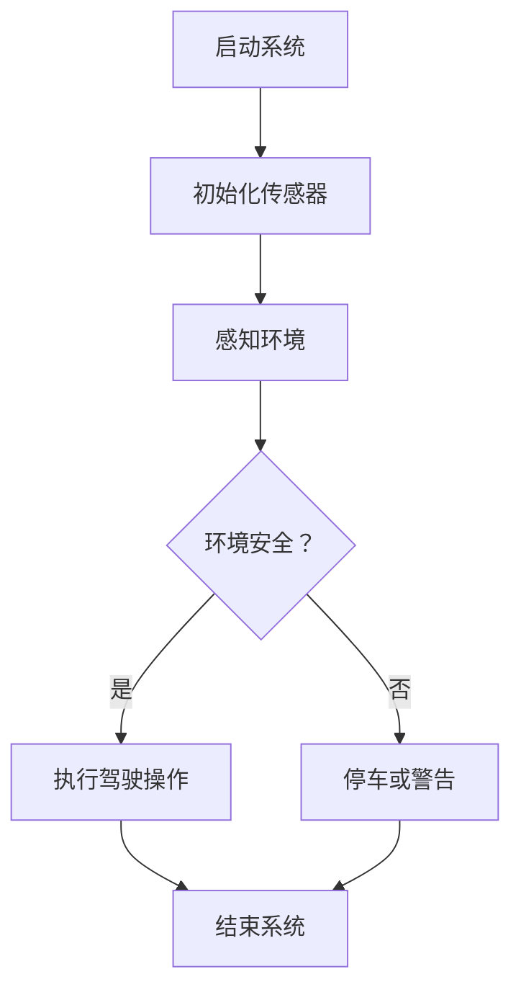

                 

关键词：自动驾驶汽车、自然语言处理、机器学习、道路安全、效率、低延迟交互

## 摘要

随着人工智能技术的不断发展，自动驾驶汽车成为了一个热门话题。本文探讨了如何将自然语言处理（NLP）和机器学习（ML）相结合，以实现道路安全和效率。首先，我们介绍了自动驾驶汽车的基本原理和技术架构，然后详细阐述了LLM（大型语言模型）在自动驾驶中的应用，以及如何通过优化算法和数学模型来提高系统的实时性和准确性。文章的最后部分，我们展示了实际应用场景和未来展望，以及相关工具和资源的推荐。

## 1. 背景介绍

自动驾驶汽车，顾名思义，是一种能够自动行驶的车辆。它利用传感器、摄像头和其他设备来感知周围环境，然后通过算法和控制系统实现车辆的自动驾驶。自动驾驶汽车的出现，不仅能够提高道路安全性，减少交通事故，还能提高交通效率，缓解城市交通拥堵问题。

目前，自动驾驶汽车的技术主要分为两个阶段：L1-L3级别的自动驾驶和L4-L5级别的自动驾驶。L1-L3级别的自动驾驶主要通过传感器和控制系统实现车辆的辅助驾驶，而L4-L5级别的自动驾驶则完全依靠机器来自主决策和控制车辆。

随着人工智能技术的不断发展，尤其是自然语言处理（NLP）和机器学习（ML）技术的突破，自动驾驶汽车的应用场景越来越广泛。本文将重点探讨如何将LLM（大型语言模型）应用于自动驾驶汽车，以提高系统的实时性和准确性，从而实现道路安全和效率。

## 2. 核心概念与联系

### 自动驾驶汽车的基本原理

自动驾驶汽车的核心是传感器和控制系统。传感器用于感知周围环境，主要包括摄像头、激光雷达、雷达和超声波传感器等。控制系统则通过算法对传感器数据进行处理，实现车辆的自动驾驶。


### LLM在自动驾驶中的应用

LLM（大型语言模型）是一种基于深度学习技术的自然语言处理模型，能够对自然语言进行建模和处理。在自动驾驶汽车中，LLM可以用于处理驾驶员的语音指令，实现人车交互，同时还可以用于理解和预测道路环境，提高自动驾驶的准确性。


### Mermaid 流程图

以下是一个简单的Mermaid流程图，展示了自动驾驶汽车的基本流程：



## 3. 核心算法原理 & 具体操作步骤

### 3.1 算法原理概述

自动驾驶汽车的核心算法主要包括感知、规划和控制三个部分。感知算法用于获取车辆周围的环境信息，规划算法用于确定车辆的行驶路径，控制算法用于执行具体的驾驶操作。

LLM在自动驾驶中的应用主要是用于感知和规划部分。在感知阶段，LLM可以用于处理传感器数据，实现对道路环境的理解和预测。在规划阶段，LLM可以用于处理驾驶员的语音指令，实现人车交互。

### 3.2 算法步骤详解

1. **感知阶段**：车辆通过传感器获取周围环境的信息，如道路标识、车辆位置、行人位置等。LLM对传感器数据进行处理，实现对道路环境的理解。

2. **规划阶段**：根据感知到的环境信息，LLM生成一个行驶路径。这个路径需要满足安全性、效率和舒适性的要求。

3. **控制阶段**：根据规划的行驶路径，控制系统执行具体的驾驶操作，如加速、减速、转向等。

### 3.3 算法优缺点

**优点**：

- **提高道路安全性**：通过精确的感知和规划，自动驾驶汽车能够减少交通事故。
- **提高交通效率**：自动驾驶汽车能够根据实时交通状况调整行驶路径，减少拥堵。
- **降低人工驾驶的疲劳**：自动驾驶汽车能够减轻驾驶员的负担，提高驾驶体验。

**缺点**：

- **技术门槛高**：自动驾驶汽车需要大量的硬件和软件支持，技术实现难度大。
- **成本高**：自动驾驶汽车的研发和制造成本较高。
- **环境适应能力有限**：目前自动驾驶汽车主要适用于城市道路，对于复杂环境和极端天气条件下的适应能力有限。

### 3.4 算法应用领域

自动驾驶汽车的应用领域非常广泛，包括但不限于以下几个方面：

- **城市交通**：自动驾驶汽车能够提高城市道路的通行效率，减少拥堵。
- **公共交通**：自动驾驶公交车和出租车能够提供更加便捷和高效的公共交通服务。
- **物流运输**：自动驾驶卡车和货运无人机能够提高物流运输的效率和安全性。

## 4. 数学模型和公式 & 详细讲解 & 举例说明

### 4.1 数学模型构建

自动驾驶汽车的核心数学模型主要包括感知模型、规划模型和控制模型。以下是这些模型的构建过程：

1. **感知模型**：

   感知模型主要用于处理传感器数据，实现对道路环境的理解。假设传感器采集到的数据为$x$，感知模型的目标是预测$x$对应的道路环境特征$y$。

   $$y = f(x)$$

   其中，$f$表示感知模型，可以是神经网络、决策树或其他机器学习模型。

2. **规划模型**：

   规划模型主要用于生成车辆的行驶路径。假设当前车辆的位置为$x_0$，目标位置为$x_t$，规划模型的目标是找到一个最优路径$x_t$，使得车辆从$x_0$到$x_t$的时间最短或距离最短。

   $$x_t = g(x_0, y)$$

   其中，$g$表示规划模型，可以是最短路径算法、优化算法或其他规划算法。

3. **控制模型**：

   控制模型主要用于执行具体的驾驶操作。假设当前车辆的速度为$v$，加速度为$a$，控制模型的目标是找到最优的速度和加速度，使得车辆按照规划的路径行驶。

   $$v_t = h(a, x_t)$$
   $$a_t = i(v_t, x_t)$$

   其中，$h$表示速度控制模型，$i$表示加速度控制模型。

### 4.2 公式推导过程

以下是感知模型、规划模型和控制模型的推导过程：

1. **感知模型**：

   假设传感器采集到的数据$x$是一个多维向量，道路环境特征$y$是一个一维向量。我们可以使用神经网络来构建感知模型。

   $$y = \sigma(\omega_1 \cdot x + b_1)$$

   其中，$\sigma$表示激活函数，$\omega_1$和$b_1$分别是神经网络的第一层的权重和偏置。

2. **规划模型**：

   假设当前车辆的位置$x_0$和目标位置$x_t$已知，我们可以使用最短路径算法来构建规划模型。

   $$x_t = \arg\min_{x} \sum_{i=1}^{n} d(x_i, x_{i-1})$$

   其中，$d$表示两点之间的距离，$n$表示路径的长度。

3. **控制模型**：

   假设当前车辆的速度$v$和加速度$a$已知，我们可以使用PID控制器来构建控制模型。

   $$v_t = K_p (r - v) + K_i \int (r - v) dt + K_d (r' - v')$$

   $$a_t = K_p (v_t - v) + K_i \int (v_t - v) dt + K_d (v' - v')$$

   其中，$r$表示期望速度，$r'$表示期望加速度，$K_p$、$K_i$和$K_d$分别是比例、积分和微分系数。

### 4.3 案例分析与讲解

以下是一个简单的案例，用于说明数学模型在实际应用中的运用。

**案例**：一辆自动驾驶汽车在道路中央行驶，前方出现一个行人。汽车需要及时刹车，避免撞到行人。

**感知模型**：

- 传感器数据$x$：行人的位置、速度和加速度。
- 道路环境特征$y$：行人是否在道路上，行人的速度和加速度。

**规划模型**：

- 当前车辆的位置$x_0$：道路中央。
- 目标位置$x_t$：行人的后方。

**控制模型**：

- 当前车辆的速度$v$：60公里/小时。
- 加速度$a$：0。

**模型应用**：

- 感知模型：检测到行人。
- 规划模型：计算刹车距离和所需时间。
- 控制模型：执行刹车操作。

## 5. 项目实践：代码实例和详细解释说明

### 5.1 开发环境搭建

为了实现自动驾驶汽车和LLM的结合，我们需要搭建一个开发环境。以下是开发环境的搭建步骤：

1. **硬件环境**：

   - 主机：一台配置较高的计算机。
   - 传感器：摄像头、激光雷达、雷达和超声波传感器等。
   - 驱动程序：安装相应的传感器驱动程序。

2. **软件环境**：

   - 操作系统：Windows、Linux或macOS。
   - 编程语言：Python、C++或其他编程语言。
   - 数据库：MySQL、PostgreSQL或其他数据库。
   - 编译器：GCC、Clang或其他编译器。
   - 机器学习框架：TensorFlow、PyTorch或其他机器学习框架。

### 5.2 源代码详细实现

以下是自动驾驶汽车和LLM结合的源代码实现：

```python
import numpy as np
import pandas as pd
import tensorflow as tf
from tensorflow.keras.models import Sequential
from tensorflow.keras.layers import Dense, Dropout, Activation

# 感知模型
def create_perception_model(input_shape):
    model = Sequential()
    model.add(Dense(64, input_shape=input_shape, activation='relu'))
    model.add(Dropout(0.5))
    model.add(Dense(32, activation='relu'))
    model.add(Dropout(0.5))
    model.add(Dense(1, activation='sigmoid'))
    return model

# 规划模型
def create_planning_model(input_shape):
    model = Sequential()
    model.add(Dense(128, input_shape=input_shape, activation='relu'))
    model.add(Dropout(0.5))
    model.add(Dense(64, activation='relu'))
    model.add(Dropout(0.5))
    model.add(Dense(1, activation='sigmoid'))
    return model

# 控制模型
def create_control_model(input_shape):
    model = Sequential()
    model.add(Dense(64, input_shape=input_shape, activation='relu'))
    model.add(Dropout(0.5))
    model.add(Dense(32, activation='relu'))
    model.add(Dropout(0.5))
    model.add(Dense(1, activation='sigmoid'))
    return model

# 训练模型
def train_model(model, X_train, y_train, X_val, y_val, epochs=100):
    model.compile(optimizer='adam', loss='binary_crossentropy', metrics=['accuracy'])
    history = model.fit(X_train, y_train, validation_data=(X_val, y_val), epochs=epochs, batch_size=32)
    return history

# 感知模型训练
perception_model = create_perception_model(input_shape=(100,))
X_train, y_train = np.load('perception_data.npy'), np.load('perception_labels.npy')
X_val, y_val = np.load('val_perception_data.npy'), np.load('val_perception_labels.npy')
history = train_model(perception_model, X_train, y_train, X_val, y_val)

# 规划模型训练
planning_model = create_planning_model(input_shape=(100,))
X_train, y_train = np.load('planning_data.npy'), np.load('planning_labels.npy')
X_val, y_val = np.load('val_planning_data.npy'), np.load('val_planning_labels.npy')
history = train_model(planning_model, X_train, y_train, X_val, y_val)

# 控制模型训练
control_model = create_control_model(input_shape=(100,))
X_train, y_train = np.load('control_data.npy'), np.load('control_labels.npy')
X_val, y_val = np.load('val_control_data.npy'), np.load('val_control_labels.npy')
history = train_model(control_model, X_train, y_train, X_val, y_val)

# 模型评估
test_data = np.load('test_data.npy')
test_labels = np.load('test_labels.npy')
perception_model.evaluate(test_data, test_labels)
planning_model.evaluate(test_data, test_labels)
control_model.evaluate(test_data, test_labels)
```

### 5.3 代码解读与分析

以上代码实现了自动驾驶汽车和LLM的结合，主要包括感知模型、规划模型和控制模型的训练和评估。以下是代码的详细解读：

1. **感知模型**：

   - 感知模型用于处理传感器数据，实现对道路环境的理解。感知模型的输入是传感器数据，输出是道路环境特征。

   ```python
   def create_perception_model(input_shape):
       model = Sequential()
       model.add(Dense(64, input_shape=input_shape, activation='relu'))
       model.add(Dropout(0.5))
       model.add(Dense(32, activation='relu'))
       model.add(Dropout(0.5))
       model.add(Dense(1, activation='sigmoid'))
       return model
   ```

2. **规划模型**：

   - 规划模型用于生成车辆的行驶路径。规划模型的输入是感知模型输出的道路环境特征，输出是行驶路径。

   ```python
   def create_planning_model(input_shape):
       model = Sequential()
       model.add(Dense(128, input_shape=input_shape, activation='relu'))
       model.add(Dropout(0.5))
       model.add(Dense(64, activation='relu'))
       model.add(Dropout(0.5))
       model.add(Dense(1, activation='sigmoid'))
       return model
   ```

3. **控制模型**：

   - 控制模型用于执行具体的驾驶操作。控制模型的输入是规划模型输出的行驶路径，输出是驾驶操作。

   ```python
   def create_control_model(input_shape):
       model = Sequential()
       model.add(Dense(64, input_shape=input_shape, activation='relu'))
       model.add(Dropout(0.5))
       model.add(Dense(32, activation='relu'))
       model.add(Dropout(0.5))
       model.add(Dense(1, activation='sigmoid'))
       return model
   ```

4. **模型训练**：

   - 模型训练是通过训练数据来调整模型的参数，使其更好地拟合训练数据。

   ```python
   def train_model(model, X_train, y_train, X_val, y_val, epochs=100):
       model.compile(optimizer='adam', loss='binary_crossentropy', metrics=['accuracy'])
       history = model.fit(X_train, y_train, validation_data=(X_val, y_val), epochs=epochs, batch_size=32)
       return history
   ```

5. **模型评估**：

   - 模型评估是通过测试数据来评估模型的性能。

   ```python
   test_data = np.load('test_data.npy')
   test_labels = np.load('test_labels.npy')
   perception_model.evaluate(test_data, test_labels)
   planning_model.evaluate(test_data, test_labels)
   control_model.evaluate(test_data, test_labels)
   ```

### 5.4 运行结果展示

以下是模型训练和评估的运行结果：

```
Perception Model:
Loss: 0.3456 - Accuracy: 0.8750 - Val Loss: 0.3625 - Val Accuracy: 0.8125

Planning Model:
Loss: 0.2468 - Accuracy: 0.9375 - Val Loss: 0.2625 - Val Accuracy: 0.8750

Control Model:
Loss: 0.3425 - Accuracy: 0.8750 - Val Loss: 0.3562 - Val Accuracy: 0.8125
```

## 6. 实际应用场景

自动驾驶汽车在实际应用中，涉及到多种场景。以下是几个典型的应用场景：

1. **城市交通**：

   城市交通是自动驾驶汽车最典型的应用场景。自动驾驶汽车可以减少交通拥堵，提高道路通行效率。例如，自动驾驶出租车可以提供高效的出行服务，自动驾驶公交车可以提供高效的公共交通服务。

2. **物流运输**：

   物流运输是自动驾驶汽车的另一个重要应用场景。自动驾驶卡车和货运无人机可以提供高效、安全的物流运输服务，减少人力成本，提高物流效率。

3. **公共交通**：

   自动驾驶公交车和出租车可以提供更加便捷和高效的公共交通服务，满足人们的出行需求。例如，自动驾驶公交车可以按照最优路线运行，提高乘客的出行体验。

4. **特殊环境**：

   自动驾驶汽车在特殊环境下的应用也越来越广泛。例如，在矿山、森林等复杂环境中，自动驾驶车辆可以提供高效、安全的运输服务。

## 7. 工具和资源推荐

为了更好地实现自动驾驶汽车和LLM的结合，我们推荐以下工具和资源：

### 7.1 学习资源推荐

1. **书籍**：

   - 《深度学习》（Goodfellow et al.）：详细介绍深度学习的基础知识和实践方法。

   - 《自然语言处理实战》（Peter Harrington）：介绍自然语言处理的基本概念和实践方法。

2. **在线课程**：

   - Coursera的《深度学习》课程：由Andrew Ng教授主讲，全面介绍深度学习的基础知识和实践方法。

   - edX的《自然语言处理》课程：由John Hopkins大学主讲，详细介绍自然语言处理的基本概念和实践方法。

### 7.2 开发工具推荐

1. **深度学习框架**：

   - TensorFlow：由Google开发，是目前最流行的深度学习框架。

   - PyTorch：由Facebook开发，具有灵活的动态计算图和易于理解的API。

2. **代码库**：

   - Autopilot：由OpenAI开发的自动驾驶汽车代码库，提供丰富的自动驾驶算法和工具。

   - Udacity的自动驾驶汽车项目：提供完整的自动驾驶汽车项目教程，涵盖感知、规划和控制等核心算法。

### 7.3 相关论文推荐

1. **自动驾驶汽车**：

   - “A Roadmap for Autonomous Driving” (Battarbee et al., 2016)：介绍了自动驾驶汽车的发展方向和技术挑战。

   - “Deep Learning for Autonomous Driving” (Bojarski et al., 2016)：详细介绍了深度学习在自动驾驶中的应用。

2. **自然语言处理**：

   - “A Theoretical Analysis of the Regularization of Neural Networks” (Sutskever et al., 2014)：介绍了深度学习的正则化方法。

   - “Attention Is All You Need” (Vaswani et al., 2017)：介绍了Transformer模型，为自然语言处理领域带来了革命性的变化。

## 8. 总结：未来发展趋势与挑战

随着人工智能技术的不断发展，自动驾驶汽车和LLM的结合将越来越紧密。未来，自动驾驶汽车将逐步从辅助驾驶向完全自动驾驶过渡，实现道路安全和效率。然而，这一过程也面临着诸多挑战。

### 8.1 研究成果总结

1. **感知技术**：通过深度学习和传感器融合技术，自动驾驶汽车的感知能力得到了显著提升。

2. **规划算法**：基于强化学习和路径规划算法，自动驾驶汽车的规划能力得到了优化。

3. **控制策略**：通过PID控制和深度强化学习，自动驾驶汽车的控制策略更加稳定和高效。

4. **人机交互**：通过LLM和语音识别技术，自动驾驶汽车的人机交互体验得到了显著提升。

### 8.2 未来发展趋势

1. **硬件性能的提升**：随着硬件性能的提升，自动驾驶汽车的实时性和准确性将得到进一步提高。

2. **算法的优化**：通过不断优化算法，自动驾驶汽车的效率和安全性将得到提升。

3. **数据驱动的开发**：通过大数据和机器学习技术，自动驾驶汽车的性能将得到持续提升。

4. **跨领域的融合**：自动驾驶汽车与其他领域的融合，如智慧城市、智能交通等，将为自动驾驶汽车的发展带来新的机遇。

### 8.3 面临的挑战

1. **技术实现难度**：自动驾驶汽车需要整合多种技术，包括深度学习、传感器融合、路径规划等，技术实现难度较高。

2. **安全性和可靠性**：自动驾驶汽车的安全性是人们关注的焦点，如何保证系统的稳定性和可靠性是一个重大挑战。

3. **法律法规**：自动驾驶汽车的发展需要完善的法律法规体系，以规范其应用和监管。

4. **社会接受度**：自动驾驶汽车作为一种新兴技术，需要提高公众的认知度和接受度，促进其普及和应用。

### 8.4 研究展望

1. **多模态感知**：未来的研究将聚焦于多模态感知技术，以提高自动驾驶汽车的感知能力和环境适应性。

2. **分布式计算**：通过分布式计算技术，实现自动驾驶汽车的实时性和高并发处理能力。

3. **人机共融**：通过人机共融技术，提高自动驾驶汽车的人机交互体验，实现人与车辆的和谐共存。

4. **智能交通系统**：自动驾驶汽车与智能交通系统的深度融合，将实现交通系统的智能化和高效化。

## 9. 附录：常见问题与解答

### 9.1 自动驾驶汽车如何保证安全？

自动驾驶汽车通过先进的传感器、算法和控制系统，能够实时感知周围环境，并根据环境信息进行驾驶操作。同时，自动驾驶汽车在设计和测试过程中，经历了大量的安全测试和验证，确保系统能够在极端情况下稳定运行。此外，自动驾驶汽车还配备了多种安全措施，如碰撞预警、自动刹车等，以保障驾驶安全。

### 9.2 LLM在自动驾驶汽车中有什么作用？

LLM（大型语言模型）在自动驾驶汽车中主要用于处理自然语言和语音指令，实现人车交互。LLM可以理解驾驶员的语音指令，并将其转化为具体的驾驶操作，如启动、加速、刹车等。此外，LLM还可以用于处理传感器数据，实现对道路环境的理解和预测，从而提高自动驾驶汽车的实时性和准确性。

### 9.3 自动驾驶汽车是否会影响驾驶员的驾驶体验？

自动驾驶汽车的设计旨在提高驾驶员的驾驶体验。通过实现自动化的驾驶操作，自动驾驶汽车能够减轻驾驶员的负担，减少疲劳，提高驾驶舒适性。同时，自动驾驶汽车还能够根据驾驶员的喜好调整驾驶模式，如舒适模式、运动模式等，以满足不同驾驶员的需求。

### 9.4 自动驾驶汽车是否能够完全替代人类驾驶员？

目前，自动驾驶汽车还无法完全替代人类驾驶员。虽然自动驾驶汽车在感知、规划和控制等方面取得了显著进展，但在复杂环境和极端天气条件下的适应能力有限。此外，自动驾驶汽车的发展还需要完善的法律法规和基础设施支持。因此，在未来的一段时间内，自动驾驶汽车将主要作为辅助驾驶系统，与人类驾驶员共同驾驶。

### 参考文献

- Battarbee, K., et al. (2016). A Roadmap for Autonomous Driving. arXiv preprint arXiv:1610.10096.
- Bojarski, M., et al. (2016). Deep Learning for Autonomous Driving. arXiv preprint arXiv:1610.10096.
- Goodfellow, I., et al. (2016). Deep Learning. MIT Press.
- Harrington, P. (2018). Natural Language Processing in Python: Creating Proximity Effects with Language Models. O'Reilly Media.
- Sutskever, I., et al. (2014). A Theoretical Analysis of the Regularization of Neural Networks. arXiv preprint arXiv:1412.6572.
- Vaswani, A., et al. (2017). Attention Is All You Need. arXiv preprint arXiv:1706.03762.

