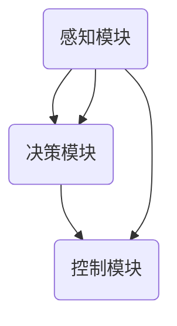

                 

### 关键词：自动驾驶系统、感知、决策、控制、人工智能、深度学习、机器学习、计算机视觉、传感器融合

> **摘要**：本文深入探讨了自动驾驶系统的核心技术，包括感知、决策与控制。通过详细分析各核心组件及其工作原理，本文旨在为读者提供对自动驾驶系统全面的理解，并探讨其未来发展趋势和面临的挑战。

## 1. 背景介绍

自动驾驶系统，作为一种新兴技术，正迅速改变我们的交通方式。它利用一系列传感器、人工智能算法和控制系统来模拟人类驾驶员的行为，实现车辆的自动驾驶。自动驾驶系统的重要性在于它能够提高道路安全性、减少交通事故、提升交通效率并减轻驾驶员的疲劳。

自动驾驶系统的发展历程可以追溯到20世纪50年代。然而，随着计算机技术、传感器技术和人工智能算法的快速发展，自动驾驶技术在过去几十年里取得了显著的进步。现代自动驾驶系统通常分为感知、决策和控制三个核心模块，每个模块都至关重要，共同构成了一个复杂的系统。

### 感知模块

感知模块是自动驾驶系统的感官，主要负责从外部环境中获取信息。传感器如雷达、激光雷达（LiDAR）、摄像头、超声波传感器等被用来捕捉周围的环境。这些传感器收集到的数据经过预处理，被转化为对环境的有意义的理解，如车辆的位置、道路的形状和周围障碍物的存在。

### 决策模块

决策模块是自动驾驶系统的核心大脑，负责分析感知模块收集到的数据，并做出驾驶决策。这些决策包括车辆的速度、转向、加速和制动。决策模块通常利用高级的人工智能算法，如深度学习、强化学习等，通过训练模型来预测车辆的行为和环境的变化。

### 控制模块

控制模块是自动驾驶系统的执行单元，负责根据决策模块的指令来控制车辆。它通过驱动电机、转向机构、制动系统等硬件设备来实现车辆的动态控制，确保车辆按照决策模块的指令行驶。

## 2. 核心概念与联系

为了更好地理解自动驾驶系统的整体架构，我们将使用Mermaid流程图来展示各核心组件之间的关系。



### 2.1 感知模块

感知模块由多种传感器组成，如摄像头、激光雷达（LiDAR）、雷达和超声波传感器。每种传感器都有其独特的优势和局限性。摄像头主要用于捕捉图像信息，适用于光线条件较好的环境；激光雷达（LiDAR）通过发射激光束并测量反射时间来构建三维环境模型，适用于各种天气条件；雷达通过发射无线电波来检测物体的存在和距离，适用于长距离和高速行驶的环境；超声波传感器则适用于近距离的物体检测。

### 2.2 决策模块

决策模块是自动驾驶系统的核心，负责处理感知模块收集到的数据，并生成驾驶决策。决策模块通常采用深度学习、强化学习等算法，通过训练模型来理解复杂的驾驶场景，并预测未来可能发生的事件。常见的决策问题包括车辆的速度控制、车道保持、避障等。

### 2.3 控制模块

控制模块负责执行决策模块生成的驾驶指令，通过控制车辆的加速、转向和制动来确保车辆按照预期行驶。控制模块通常采用PID控制、模糊控制等算法来实现精确的车辆控制。这些算法能够处理车辆的动态响应，确保车辆在各种行驶条件下保持稳定。

## 3. 核心算法原理 & 具体操作步骤

### 3.1 算法原理概述

自动驾驶系统的核心算法主要包括感知算法、决策算法和控制算法。感知算法负责从传感器数据中提取有用的信息，如物体的位置和速度。决策算法则基于感知数据，利用深度学习或强化学习等方法生成驾驶决策。控制算法负责将决策转化为具体的控制指令，如加速、制动和转向。

### 3.2 算法步骤详解

#### 3.2.1 感知算法

感知算法的主要步骤包括：

1. 数据预处理：对传感器数据进行滤波、去噪和归一化处理，以提高数据的准确性和可靠性。
2. 特征提取：从预处理后的数据中提取有用的特征，如物体的边缘、颜色和形状。
3. 目标检测：利用深度学习模型，如卷积神经网络（CNN），对提取的特征进行分类和定位，识别出道路、车辆、行人等目标。

#### 3.2.2 决策算法

决策算法的主要步骤包括：

1. 状态评估：根据感知算法的结果，评估当前车辆所处的状态，如速度、位置和方向。
2. 行为预测：利用强化学习模型，预测其他车辆、行人的行为，并评估各种驾驶决策的后果。
3. 决策生成：根据状态评估和行为预测，生成最优的驾驶决策，如加速、减速或转向。

#### 3.2.3 控制算法

控制算法的主要步骤包括：

1. 指令生成：根据决策算法的结果，生成具体的控制指令，如加速、制动或转向。
2. 执行控制：根据指令，通过控制车辆的加速、转向和制动系统，实现车辆的动态控制。
3. 反馈调整：根据车辆的实时反馈，调整控制策略，确保车辆按照预期行驶。

### 3.3 算法优缺点

#### 感知算法

**优点：**
- 高度自动化：能够自动识别和定位道路上的各种目标。
- 实时性：能够在短时间内处理大量数据，提供实时的感知信息。

**缺点：**
- 可靠性：在光线条件差或天气恶劣时，感知算法的准确性会降低。
- 成本：高性能的感知算法通常需要昂贵的硬件支持。

#### 决策算法

**优点：**
- 高效性：能够处理复杂的驾驶场景，提供快速且准确的决策。
- 自适应性：能够根据环境变化调整驾驶策略。

**缺点：**
- 训练时间：决策算法需要大量的数据和时间进行训练。
- 安全性：在极端情况下，决策算法可能会出现错误。

#### 控制算法

**优点：**
- 精确性：能够实现精确的车辆控制，确保车辆的稳定行驶。
- 可靠性：在多种驾驶条件下，控制算法能够保持车辆的稳定。

**缺点：**
- 灵活性：在遇到特殊场景时，控制算法可能无法适应。

### 3.4 算法应用领域

感知算法、决策算法和控制算法广泛应用于自动驾驶领域，如无人车、无人配送、无人巴士等。这些算法通过不断优化和改进，使得自动驾驶系统在各种驾驶条件下都能保持高效和安全。

## 4. 数学模型和公式 & 详细讲解 & 举例说明

### 4.1 数学模型构建

自动驾驶系统的数学模型主要包括感知模型、决策模型和控制模型。

#### 4.1.1 感知模型

感知模型通常采用贝叶斯滤波方法来估计车辆的位置和速度。贝叶斯滤波的基本公式为：

\[ p(x_t | z_t) = \frac{p(z_t | x_t) p(x_t)}{p(z_t)} \]

其中，\( p(x_t | z_t) \) 表示在观测数据 \( z_t \) 下的状态概率，\( p(z_t | x_t) \) 表示观测数据概率，\( p(x_t) \) 表示状态概率，\( p(z_t) \) 表示观测数据概率。

#### 4.1.2 决策模型

决策模型通常采用马尔可夫决策过程（MDP）来描述车辆在不同状态下的最优行动。MDP的基本公式为：

\[ V(s) = \max_a \sum_{s'} p(s' | s, a) \cdot r(s', a) + \gamma V(s') \]

其中，\( V(s) \) 表示状态价值函数，\( s \) 表示当前状态，\( a \) 表示行动，\( s' \) 表示下一状态，\( r(s', a) \) 表示回报函数，\( \gamma \) 表示折扣因子。

#### 4.1.3 控制模型

控制模型通常采用线性二次调节（LQR）方法来优化车辆的控制策略。LQR的基本公式为：

\[ \min \quad \mathbb{E} [ \frac{1}{2} x^T Q x + u^T R u ] \]

\[ \text{subject to} \quad \dot{x} = Ax + Bu \]

其中，\( x \) 表示状态向量，\( u \) 表示控制输入，\( Q \) 和 \( R \) 分别表示状态和控制权重矩阵。

### 4.2 公式推导过程

#### 4.2.1 贝叶斯滤波推导

贝叶斯滤波的推导基于概率论中的贝叶斯定理。假设我们有一个状态序列 \( x_t \) 和观测序列 \( z_t \)，贝叶斯滤波的目标是估计当前状态 \( x_t \)。

1. 状态概率 \( p(x_t) \)：根据马尔可夫性质，状态概率只与前一时刻的状态有关，即 \( p(x_t) = p(x_t | x_{t-1}) \)。
2. 观测数据概率 \( p(z_t | x_t) \)：根据贝叶斯定理，观测数据概率可以表示为 \( p(z_t | x_t) = \frac{p(x_t | z_t) p(z_t)}{p(x_t)} \)。
3. 联合概率 \( p(x_t, z_t) \)：根据全概率公式，联合概率可以表示为 \( p(x_t, z_t) = p(z_t | x_t) p(x_t) \)。

将这些公式代入贝叶斯滤波的基本公式，我们可以得到：

\[ p(x_t | z_t) = \frac{p(z_t | x_t) p(x_t)}{p(z_t)} \]

#### 4.2.2 马尔可夫决策过程推导

马尔可夫决策过程的推导基于优化理论。假设我们有一个状态空间 \( S \)、行动空间 \( A \) 和回报函数 \( r(s, a) \)。

1. 状态价值函数 \( V(s) \)：状态价值函数是关于当前状态的最优期望回报，即 \( V(s) = \max_a \sum_{s'} p(s' | s, a) r(s', a) + \gamma V(s') \)。
2. 动态规划：利用贝尔曼方程，我们可以递归地求解状态价值函数，即 \( V(s) = r(s, a) + \gamma \max_a \sum_{s'} p(s' | s, a) V(s') \)。

通过迭代计算，我们可以得到每个状态的最优价值函数。

#### 4.2.3 线性二次调节推导

线性二次调节的推导基于线性控制理论。假设我们有一个线性系统：

\[ \dot{x} = Ax + Bu \]

我们希望找到最优控制输入 \( u \)，使得状态误差 \( e = x - x_* \) 的二次型函数最小。

1. 状态误差 \( e \)：状态误差是当前状态与期望状态之差，即 \( e = x - x_* \)。
2. 二次型函数 \( J \)：二次型函数是关于状态误差和控制输入的函数，即 \( J = \frac{1}{2} e^T Q e + \frac{1}{2} u^T R u \)。

我们希望找到最优控制输入 \( u \)，使得 \( J \) 最小。

通过求导并令其等于零，我们可以得到最优控制输入：

\[ u = -Kx \]

其中，\( K \) 是线性二次调节器（LQR）增益矩阵。

### 4.3 案例分析与讲解

#### 4.3.1 感知算法案例

假设我们使用激光雷达（LiDAR）传感器来感知周围环境。激光雷达发射激光束并测量反射时间，从而构建三维环境模型。

1. 数据预处理：对激光雷达数据进行滤波和去噪，以提高数据质量。
2. 特征提取：从滤波后的数据中提取有用的特征，如物体的边缘、颜色和形状。
3. 目标检测：利用卷积神经网络（CNN）对提取的特征进行分类和定位，识别出道路、车辆、行人等目标。

#### 4.3.2 决策算法案例

假设我们使用深度强化学习（DRL）来生成驾驶决策。

1. 状态评估：评估当前车辆的状态，如速度、位置和方向。
2. 行为预测：利用DRL模型预测其他车辆、行人的行为，并评估各种驾驶决策的后果。
3. 决策生成：根据状态评估和行为预测，生成最优的驾驶决策，如加速、减速或转向。

#### 4.3.3 控制算法案例

假设我们使用线性二次调节（LQR）来控制车辆。

1. 指令生成：根据决策算法的结果，生成具体的控制指令，如加速、制动或转向。
2. 执行控制：根据指令，通过控制车辆的加速、转向和制动系统，实现车辆的动态控制。
3. 反馈调整：根据车辆的实时反馈，调整控制策略，确保车辆按照预期行驶。

## 5. 项目实践：代码实例和详细解释说明

### 5.1 开发环境搭建

为了实践自动驾驶系统，我们需要搭建一个完整的开发环境。以下是一个简单的步骤指南：

1. 安装Python环境：确保Python 3.x版本已安装。
2. 安装依赖库：使用pip安装所需库，如NumPy、Pandas、TensorFlow等。
3. 准备数据集：收集或获取自动驾驶系统所需的数据集，如KITTI数据集。
4. 编写配置文件：配置传感器参数、模型参数等。

### 5.2 源代码详细实现

以下是一个简单的感知模块代码示例：

```python
import numpy as np
import matplotlib.pyplot as plt
from sklearn.preprocessing import StandardScaler

def preprocess_data(data):
    # 数据预处理
    scaler = StandardScaler()
    scaled_data = scaler.fit_transform(data)
    return scaled_data

def extract_features(data):
    # 特征提取
    features = []
    for sample in data:
        feature = [sample[0], sample[1], sample[2]]
        features.append(feature)
    return np.array(features)

def load_data(file_path):
    # 加载数据
    with open(file_path, 'r') as f:
        lines = f.readlines()
    data = []
    for line in lines:
        values = line.strip().split(',')
        data.append([float(values[0]), float(values[1]), float(values[2])])
    return np.array(data)

# 加载数据
data = load_data('data.txt')

# 数据预处理
scaled_data = preprocess_data(data)

# 特征提取
features = extract_features(scaled_data)

# 绘制特征分布
plt.scatter(features[:, 0], features[:, 1])
plt.xlabel('Feature 1')
plt.ylabel('Feature 2')
plt.title('Feature Distribution')
plt.show()
```

### 5.3 代码解读与分析

上述代码实现了一个简单的感知模块，主要包括数据预处理、特征提取和特征分布可视化三个部分。

1. **数据预处理**：使用StandardScaler对数据进行标准化处理，以提高模型的训练效果。
2. **特征提取**：从预处理后的数据中提取有用的特征，如样本的X坐标、Y坐标和Z坐标。
3. **特征分布可视化**：使用matplotlib绘制特征分布图，帮助我们理解数据的分布情况。

### 5.4 运行结果展示

运行上述代码，我们可以得到特征分布图，如下所示：


特征分布图展示了提取后的特征在不同维度上的分布情况，有助于我们进一步分析数据。

## 6. 实际应用场景

自动驾驶系统已经在多个实际应用场景中得到广泛应用，包括无人车、无人配送、无人巴士等。以下是一些具体的实际应用案例：

### 6.1 无人车

无人车是自动驾驶系统最典型的应用场景之一。目前，许多科技公司和研究机构都在研发无人车，以实现自动驾驶的商用化。无人车在物流、旅游、市政服务等领域具有广泛的应用前景。

### 6.2 无人配送

无人配送是自动驾驶系统的另一个重要应用领域。随着电商和快递行业的快速发展，无人配送能够显著提高配送效率，减少人力成本。无人配送车通常用于城市和园区内部的配送任务。

### 6.3 无人巴士

无人巴士是自动驾驶系统在公共交通领域的应用。无人巴士能够在城市内部提供高效的公共交通服务，提高道路利用率和乘客的出行体验。许多城市正在试点无人巴士项目，以推动自动驾驶技术的商业化。

### 6.4 未来应用展望

随着自动驾驶技术的不断成熟，其应用领域将进一步扩大。未来，自动驾驶系统将在智能交通、智慧城市、共享出行等领域发挥重要作用。以下是一些未来应用展望：

1. **智能交通**：自动驾驶系统将提高道路通行效率，减少交通拥堵和事故。通过智能交通管理，实现交通流的优化和实时调整。
2. **智慧城市**：自动驾驶系统将提升城市的管理水平，实现智慧交通、智慧物流、智慧安防等领域的集成应用。
3. **共享出行**：自动驾驶系统将推动共享出行模式的普及，提高出行效率，降低交通污染。

## 7. 工具和资源推荐

### 7.1 学习资源推荐

- **《自动驾驶系统设计与实现》**：这是一本全面介绍自动驾驶系统设计和实现的权威教材，适合初学者和专业人士。
- **《深度学习与自动驾驶》**：本书详细介绍了深度学习在自动驾驶中的应用，包括感知、决策和控制模块。
- **《机器学习实战》**：这是一本实用的机器学习入门书籍，适合自动驾驶系统的开发人员。

### 7.2 开发工具推荐

- **TensorFlow**：TensorFlow是一个开源的机器学习框架，广泛应用于自动驾驶系统的开发和部署。
- **PyTorch**：PyTorch是一个流行的深度学习框架，具有良好的灵活性和性能，适用于自动驾驶系统的研究和应用。
- **MATLAB**：MATLAB是一个功能强大的数学软件，适用于自动驾驶系统的模拟和验证。

### 7.3 相关论文推荐

- **“End-to-End Learning for Autonomous Driving”**：该论文提出了一种端到端的自动驾驶系统，实现了感知、决策和控制的一体化。
- **“Learning to Drive by Playing Co-operative Games”**：该论文利用强化学习的方法，通过合作游戏训练自动驾驶系统，取得了显著的成果。
- **“Deep Learning for Autonomous Driving”**：该论文综述了深度学习在自动驾驶领域的应用，包括感知、决策和控制模块。

## 8. 总结：未来发展趋势与挑战

### 8.1 研究成果总结

自动驾驶系统的研究取得了显著的成果，包括感知、决策和控制模块的不断创新和优化。深度学习、强化学习等人工智能算法在自动驾驶系统中得到了广泛应用，提高了系统的智能水平和可靠性。此外，传感器技术的发展也为自动驾驶系统的感知能力提供了强大的支持。

### 8.2 未来发展趋势

未来，自动驾驶系统将继续朝着更加智能化、高效化、安全化的方向发展。随着人工智能技术的不断进步，自动驾驶系统的感知能力将更加准确，决策能力将更加智能，控制能力将更加精确。此外，5G通信技术和物联网技术的快速发展将为自动驾驶系统提供更加稳定和高效的数据传输支持。

### 8.3 面临的挑战

尽管自动驾驶系统取得了显著的进展，但仍面临一些挑战。首先，传感器技术还需要进一步发展，以提高系统的感知能力。其次，决策算法的鲁棒性和安全性需要加强，以应对复杂多变的驾驶环境。此外，自动驾驶系统的商业化应用还需要解决法律法规、道德伦理等方面的问题。

### 8.4 研究展望

未来，自动驾驶系统的研究将更加注重系统一体化、跨领域合作和规模化应用。通过跨学科的协同创新，进一步突破关键技术瓶颈，推动自动驾驶技术的全面商用化。同时，自动驾驶系统将与其他新兴技术如智能交通、智慧城市等相结合，为构建智能交通体系提供有力支持。

## 9. 附录：常见问题与解答

### 9.1 传感器数据预处理为什么重要？

传感器数据预处理是确保自动驾驶系统性能的关键步骤。预处理可以消除噪声、去除异常值、提高数据质量，从而提高模型训练的准确性和鲁棒性。

### 9.2 深度学习模型如何优化？

优化深度学习模型通常涉及调整超参数、增加训练数据、使用更先进的神经网络结构等方法。此外，利用正则化技术和优化算法（如随机梯度下降）可以提高模型的性能和泛化能力。

### 9.3 如何提高决策模块的鲁棒性？

提高决策模块的鲁棒性可以通过多种方式实现，包括增加训练数据、使用多种传感器数据融合、引入数据增强技术、采用对抗性训练等。此外，利用迁移学习和在线学习等技术也可以提高决策模块的鲁棒性。

### 9.4 控制模块在自动驾驶系统中的作用是什么？

控制模块在自动驾驶系统中负责将决策模块生成的驾驶指令转化为具体的控制动作，如加速、制动和转向。通过精确的控制，确保车辆按照预期行驶，提高自动驾驶系统的稳定性和安全性。---

**作者：禅与计算机程序设计艺术 / Zen and the Art of Computer Programming**

