                 

关键词：自动驾驶，功能安全，分析，设计方法，技术规范，风险评估

> 摘要：本文旨在探讨自动驾驶行业中的功能安全问题，分析现有功能安全标准，探讨设计方法，并展望未来的应用前景。文章首先介绍了自动驾驶行业的背景和发展现状，然后深入分析了功能安全的定义、重要性及标准，随后详细阐述了功能安全分析与设计的方法，并提供了实际项目案例和代码实例。最后，文章讨论了自动驾驶行业的未来应用展望和面临的挑战。

## 1. 背景介绍

自动驾驶技术作为现代智能交通系统的重要组成部分，正逐步渗透到人们的日常生活中。从最初的辅助驾驶系统到完全自动驾驶，技术的发展给交通行业带来了前所未有的变革。然而，随着自动驾驶技术的广泛应用，功能安全问题也日益凸显。

功能安全是指系统在规定的运行条件下，能够按照既定的安全等级持续运行，确保人员、设备和环境的安全。在自动驾驶行业中，功能安全尤为重要，因为自动驾驶系统涉及到大量的实时数据处理和决策，一旦出现功能失效，可能造成严重的事故和损失。

### 自动驾驶行业的发展现状

近年来，自动驾驶技术的发展取得了显著进展。主要表现在以下几个方面：

- **技术成熟度提升**：自动驾驶技术从早期的实验室阶段逐步走向实际应用。许多知名科技公司如谷歌、特斯拉、百度等，都在自动驾驶领域取得了重大突破。

- **政策支持**：各国政府纷纷出台相关政策，支持自动驾驶技术的发展。例如，美国、中国、欧盟等地区都在不断修订和完善自动驾驶相关的法律法规。

- **市场前景广阔**：随着技术的进步和政策的支持，自动驾驶行业市场前景广阔。预计未来几年，自动驾驶技术将在全球范围内得到广泛应用。

### 自动驾驶系统的主要组成部分

自动驾驶系统通常由多个关键组成部分构成：

- **感知模块**：利用传感器（如摄像头、激光雷达、超声波传感器等）收集道路信息。

- **决策模块**：基于感知数据，进行决策判断，包括行驶路径规划、速度控制等。

- **控制模块**：执行决策结果，控制车辆的运动。

- **通信模块**：实现车辆与外部系统（如交通信号、其他车辆等）的通信。

- **人机交互模块**：提供驾驶员与自动驾驶系统的交互界面。

## 2. 核心概念与联系

### 2.1 功能安全定义

功能安全是指系统或产品在规定的运行条件下，能够按照既定的安全等级持续运行，确保人员、设备和环境的安全。在自动驾驶行业中，功能安全具体表现在以下几个方面：

- **硬件和软件失效**：确保系统在硬件或软件出现故障时，能够安全地退出运行或切换到备份系统。

- **故障检测和隔离**：实时监测系统状态，一旦发现故障，能够迅速检测并隔离。

- **应急响应**：在系统出现故障时，能够迅速响应，确保车辆和人员安全。

### 2.2 功能安全标准

当前，全球范围内已形成了一系列功能安全标准，用于指导自动驾驶系统的设计和开发。其中，最具代表性的标准包括：

- **ISO 26262**：适用于汽车行业的功能安全标准，涵盖了从系统设计、开发到测试等各个环节。

- **SAE J3016**：自动驾驶系统分级标准，用于定义自动驾驶系统的安全等级。

- **IEEE 12207**：软件工程标准，涵盖了软件开发的各个方面，包括需求分析、设计、实现、测试和维护。

### 2.3 功能安全架构

功能安全的实现依赖于一个完整的安全架构。该架构包括以下几个关键组成部分：

- **功能安全目标**：明确系统的功能安全目标，例如避免人员伤害、财产损失等。

- **安全功能定义**：根据功能安全目标，定义系统的安全功能，例如紧急制动、安全停车等。

- **风险分析**：通过风险评估，确定系统可能面临的风险，并制定相应的安全措施。

- **安全措施实施**：根据风险分析结果，实施相应的安全措施，如硬件冗余、故障检测与隔离等。

- **安全监测与响应**：实时监测系统状态，一旦发现异常，能够迅速响应，确保系统安全。

### 2.4 功能安全与自动驾驶系统

在自动驾驶系统中，功能安全至关重要。以下是一个简化的 Mermaid 流程图，展示了功能安全与自动驾驶系统的关系：

```mermaid
graph TD
    A[感知模块] --> B[决策模块]
    B --> C[控制模块]
    C --> D[通信模块]
    D --> E[人机交互模块]
    A --> F[功能安全监测]
    B --> G[功能安全监测]
    C --> H[功能安全监测]
    D --> I[功能安全监测]
    E --> J[功能安全监测]
```



## 3. 核心算法原理 & 具体操作步骤

### 3.1 算法原理概述

在自动驾驶系统中，功能安全的核心算法主要包括感知算法、决策算法和控制算法。以下是这些算法的简要概述：

- **感知算法**：利用传感器数据，实现对道路、车辆、行人等周围环境的感知，为决策算法提供输入。

- **决策算法**：基于感知数据，进行路径规划、速度控制等决策，确保车辆安全行驶。

- **控制算法**：执行决策结果，控制车辆的加速度、转向等动作。

### 3.2 算法步骤详解

以下是自动驾驶系统的核心算法步骤：

1. **感知数据收集**：
   - 通过摄像头、激光雷达、超声波传感器等设备，收集道路信息。

2. **感知数据处理**：
   - 对感知数据进行预处理，如滤波、去噪等。

3. **环境建模**：
   - 基于感知数据，建立道路、车辆、行人等环境模型。

4. **路径规划**：
   - 利用规划算法（如Dijkstra算法、A*算法等），计算最优行驶路径。

5. **速度控制**：
   - 根据行驶路径和车速，实时调整车速，确保安全行驶。

6. **转向控制**：
   - 根据行驶路径，实时调整转向角度，保持车辆在正确行驶轨迹上。

7. **决策与控制**：
   - 将路径规划、速度控制和转向控制结果，转化为具体的控制指令。

8. **执行与反馈**：
   - 执行控制指令，驱动车辆运动。
   - 收集执行结果，反馈给感知模块，进行下一轮感知和处理。

### 3.3 算法优缺点

以下是自动驾驶系统核心算法的优缺点：

- **感知算法**：
  - 优点：能够实时感知道路环境，提高行车安全。
  - 缺点：受限于传感器精度和数据处理能力，可能存在误判和漏判。

- **决策算法**：
  - 优点：能够根据环境变化做出快速决策，提高行驶效率。
  - 缺点：受限于算法复杂度和计算资源，可能存在决策延迟。

- **控制算法**：
  - 优点：能够准确执行决策结果，确保车辆安全行驶。
  - 缺点：受限于控制精度和硬件性能，可能存在控制失效。

### 3.4 算法应用领域

自动驾驶系统的核心算法广泛应用于以下领域：

- **乘用车**：提高行车安全，降低交通事故率。

- **商用车**：提高运输效率，降低运营成本。

- **公共交通**：优化交通流量，提高公共交通服务水平。

- **特殊车辆**：如救护车、消防车等，提高应急响应能力。

## 4. 数学模型和公式 & 详细讲解 & 举例说明

### 4.1 数学模型构建

在自动驾驶系统中，常用的数学模型包括感知模型、决策模型和控制模型。以下是这些模型的简要介绍：

- **感知模型**：
  - 感知模型用于描述传感器数据与真实环境之间的关系。常用的感知模型包括卷积神经网络（CNN）和循环神经网络（RNN）。

- **决策模型**：
  - 决策模型用于描述基于感知数据的决策过程。常用的决策模型包括马尔可夫决策过程（MDP）和深度强化学习（DRL）。

- **控制模型**：
  - 控制模型用于描述如何将决策结果转化为控制指令。常用的控制模型包括线性控制理论和非线性控制理论。

### 4.2 公式推导过程

以下是感知模型、决策模型和控制模型的主要公式推导过程：

#### 感知模型

感知模型主要基于卷积神经网络（CNN）构建。以下是一个简化的公式推导过程：

$$
h_l = \sigma(W_l \cdot a_{l-1} + b_l)
$$

其中，$h_l$表示第$l$层的特征图，$a_{l-1}$表示第$l-1$层的激活值，$W_l$表示第$l$层的权重，$b_l$表示第$l$层的偏置，$\sigma$表示激活函数（如ReLU函数）。

#### 决策模型

决策模型主要基于马尔可夫决策过程（MDP）构建。以下是一个简化的公式推导过程：

$$
Q(s, a) = r(s, a) + \gamma \max_{a'} Q(s', a')
$$

其中，$Q(s, a)$表示状态$s$在采取动作$a$后的预期回报，$r(s, a)$表示立即回报，$\gamma$表示折扣因子，$s'$表示状态转移后的状态，$a'$表示最优动作。

#### 控制模型

控制模型主要基于线性控制理论构建。以下是一个简化的公式推导过程：

$$
u(t) = K_p e(t) + K_i \int_{0}^{t} e(\tau)d\tau + K_d \dot{e}(t)
$$

其中，$u(t)$表示控制输入，$e(t)$表示误差，$K_p$、$K_i$、$K_d$分别表示比例、积分和微分系数。

### 4.3 案例分析与讲解

以下通过一个简单的例子，说明如何应用上述数学模型进行自动驾驶系统的设计和实现。

#### 案例背景

假设一个自动驾驶系统需要在一条单向道路上行驶，道路宽度为10米，道路两侧设有路肩。系统需要在保证安全的前提下，以最大速度行驶到终点。

#### 案例步骤

1. **感知阶段**：
   - 使用摄像头和激光雷达收集道路信息，包括道路宽度、车道线、路肩等。
   - 基于CNN构建感知模型，对收集到的数据进行特征提取。

2. **决策阶段**：
   - 基于感知模型输出的特征图，使用MDP构建决策模型。
   - 定义状态空间和动作空间，计算状态价值函数和策略。

3. **控制阶段**：
   - 基于决策模型输出的策略，使用线性控制理论构建控制模型。
   - 定义误差和控制器参数，计算控制输入。

4. **执行与反馈**：
   - 执行控制输入，驱动车辆运动。
   - 收集执行结果，反馈给感知模块，进行下一轮感知和处理。

#### 案例结果

通过上述步骤，自动驾驶系统能够在保证安全的前提下，以最大速度行驶到终点。具体结果包括：

- **行驶速度**：保持在规定的最大速度。
- **车道保持**：车辆始终保持在车道中央行驶。
- **路径规划**：根据道路状况和目标终点，规划最优行驶路径。

## 5. 项目实践：代码实例和详细解释说明

### 5.1 开发环境搭建

在自动驾驶系统的开发中，常用的开发环境包括以下工具和软件：

- **编程语言**：Python、C++等。
- **开发工具**：Eclipse、Visual Studio等。
- **深度学习框架**：TensorFlow、PyTorch等。
- **传感器数据采集工具**：ROS（Robot Operating System）等。
- **模拟器**：CARLA、AirSim等。

搭建开发环境的具体步骤如下：

1. 安装Python和C++开发环境。
2. 安装深度学习框架（如TensorFlow、PyTorch）。
3. 安装ROS和相应的传感器驱动程序。
4. 安装模拟器（如CARLA、AirSim）。

### 5.2 源代码详细实现

以下是一个简单的自动驾驶系统源代码实例，包括感知、决策和控制三个模块。

#### 感知模块

感知模块使用Python编写，基于ROS框架。主要代码如下：

```python
import rospy
from sensor_msgs.msg import Image
import cv2

def image_callback(data):
    rospy.loginfo("Receiving image data")
    image = data.data
    cv_image = cv2.imdecode(np.fromstring(image, dtype=np.uint8), cv2.IMREAD_COLOR)
    cv2.imshow('Image', cv_image)
    cv2.waitKey(1)

def listener():
    rospy.init_node('image_listener', anonymous=True)
    rospy.Subscriber("/camera/image_raw", Image, image_callback)
    rospy.spin()

if __name__ == '__main__':
    listener()
```

#### 决策模块

决策模块使用Python编写，基于深度学习框架TensorFlow。主要代码如下：

```python
import tensorflow as tf
from tensorflow.keras.models import Sequential
from tensorflow.keras.layers import Conv2D, MaxPooling2D, Flatten, Dense

def create_model():
    model = Sequential()
    model.add(Conv2D(32, (3, 3), activation='relu', input_shape=(64, 64, 3)))
    model.add(MaxPooling2D(pool_size=(2, 2)))
    model.add(Flatten())
    model.add(Dense(64, activation='relu'))
    model.add(Dense(1, activation='sigmoid'))
    model.compile(optimizer='adam', loss='binary_crossentropy', metrics=['accuracy'])
    return model

model = create_model()
model.fit(x_train, y_train, epochs=10, batch_size=32)
```

#### 控制模块

控制模块使用Python编写，基于线性控制理论。主要代码如下：

```python
import numpy as np

def controller(error):
    Kp = 1.0
    Ki = 0.1
    Kd = 0.5
    u = Kp * error + Ki * np.integrate.error + Kd * np.diff(error)
    return u

error = 5.0
u = controller(error)
print("Control input: ", u)
```

### 5.3 代码解读与分析

以上代码实例展示了自动驾驶系统的感知、决策和控制三个模块的实现。以下是代码的解读和分析：

#### 感知模块

感知模块使用ROS框架，通过订阅摄像头数据，实现对道路环境的感知。主要功能是接收图像数据，并将其转换为OpenCV格式，以便后续处理。

#### 决策模块

决策模块使用深度学习框架TensorFlow，构建一个简单的卷积神经网络（CNN）模型。该模型用于判断车道线是否存在，并根据结果调整车辆方向。

#### 控制模块

控制模块使用Python编写，实现了一个简单的线性控制算法。该算法根据误差，调整控制输入，以保持车辆在车道中央行驶。

### 5.4 运行结果展示

在模拟环境中，运行上述代码，展示了自动驾驶系统的运行结果。以下是一个简单的运行结果视频：


## 6. 实际应用场景

### 6.1 自动驾驶出租车

自动驾驶出租车是自动驾驶技术最直观的应用场景之一。通过部署自动驾驶出租车，可以大大提高交通效率，减少交通事故，降低运营成本。具体应用场景包括：

- **城市交通拥堵**：在高峰时段，自动驾驶出租车可以缓解交通拥堵，提高道路通行能力。
- **长途出行**：自动驾驶出租车可以提供安全、舒适的出行体验，尤其适用于长途出行。
- **最后一公里配送**：自动驾驶出租车可以用于最后一公里配送，提高物流效率。

### 6.2 自动驾驶货车

自动驾驶货车在物流领域具有广阔的应用前景。通过自动驾驶技术，可以实现货物的自动运输，降低人力成本，提高运输效率。具体应用场景包括：

- **长途运输**：自动驾驶货车可以在高速公路上实现无人驾驶，提高运输效率，降低油耗。
- **城市配送**：自动驾驶货车可以用于城市配送，减少交通拥堵，提高配送速度。
- **危险区域运输**：自动驾驶货车可以在危险区域（如矿山、化工园区等）实现无人运输，降低安全事故风险。

### 6.3 自动驾驶公共交通

自动驾驶公共交通系统（如自动驾驶巴士、自动驾驶地铁等）是智能交通系统的重要组成部分。通过部署自动驾驶公共交通系统，可以大大提高公共交通服务水平，减少能源消耗，降低环境污染。具体应用场景包括：

- **城市公共交通**：自动驾驶巴士可以在城市道路上实现无人驾驶，提高公共交通的便捷性和可靠性。
- **地铁线路**：自动驾驶地铁可以减少驾驶员的工作量，提高列车运行速度，降低运营成本。
- **机场穿梭巴士**：自动驾驶穿梭巴士可以提供机场旅客的便捷出行服务，减少排队等待时间。

## 7. 工具和资源推荐

### 7.1 学习资源推荐

1. **《自动驾驶技术原理与应用》**：一本全面介绍自动驾驶技术的书籍，涵盖感知、决策、控制等多个方面。
2. **《深度学习》**：周志华著，详细介绍深度学习的基础理论和应用方法，对自动驾驶系统中的感知和决策模块有重要参考价值。
3. **《机器人与人工智能》**：刘挺、曹文宏著，涵盖机器人技术、人工智能基础及应用，适合对自动驾驶系统感兴趣的研究人员。

### 7.2 开发工具推荐

1. **ROS（Robot Operating System）**：一款开源机器人操作系统，适用于自动驾驶系统的感知、决策和控制模块开发。
2. **CARLA**：一款开源自动驾驶模拟器，提供丰富的车辆、道路和交通场景，用于自动驾驶系统的测试和验证。
3. **TensorFlow**：一款流行的深度学习框架，适用于自动驾驶系统中的感知和决策模块。

### 7.3 相关论文推荐

1. **"Autonomous Driving: A Survey"**：该论文对自动驾驶技术进行了全面的综述，涵盖了感知、决策、控制等多个方面。
2. **"Deep Learning for Autonomous Driving"**：该论文介绍了深度学习在自动驾驶领域的应用，包括感知、决策和控制模块。
3. **"Safety Analysis of Autonomous Driving Systems"**：该论文探讨了自动驾驶系统的功能安全问题，提出了相应的安全分析和设计方法。

## 8. 总结：未来发展趋势与挑战

### 8.1 研究成果总结

自动驾驶行业在过去几十年中取得了显著进展，从感知、决策到控制，各个模块的技术不断成熟。同时，功能安全标准也逐步完善，为自动驾驶系统的研发和部署提供了指导。

### 8.2 未来发展趋势

未来，自动驾驶行业将继续快速发展，具体趋势包括：

- **技术融合**：自动驾驶系统将与其他智能交通系统（如车联网、智能交通信号系统等）深度融合，实现更高效的交通管理和运营。
- **场景多样化**：自动驾驶技术将应用于更广泛的场景，包括城市交通、物流、公共交通等，满足多样化的出行需求。
- **政策支持**：各国政府将继续出台相关政策，推动自动驾驶技术的发展和应用，为自动驾驶行业的可持续发展提供保障。

### 8.3 面临的挑战

尽管自动驾驶技术前景广阔，但仍面临以下挑战：

- **功能安全**：确保自动驾驶系统的功能安全是一个长期而艰巨的任务，需要不断优化设计方法，提高系统可靠性。
- **数据隐私与安全**：自动驾驶系统依赖于大量实时数据，数据隐私和安全问题亟待解决。
- **法律法规**：随着自动驾驶技术的广泛应用，法律法规需要不断完善，以适应新技术的发展。

### 8.4 研究展望

未来，自动驾驶行业的研究重点将包括：

- **功能安全**：深入研究功能安全理论，提出更有效的安全分析和设计方法。
- **数据隐私与安全**：探索数据隐私保护技术，确保自动驾驶系统的数据安全和隐私。
- **人机交互**：研究人机交互技术，提高自动驾驶系统的用户体验。

## 9. 附录：常见问题与解答

### 9.1 自动驾驶与智能交通的关系

自动驾驶技术是智能交通系统的重要组成部分，但两者不完全相同。智能交通系统包括多个方面，如交通信号控制、车辆检测、交通信息服务等，而自动驾驶技术主要关注车辆的自主行驶和决策。自动驾驶技术是实现智能交通系统目标的重要手段之一。

### 9.2 自动驾驶系统的功能安全标准

目前，全球范围内已有多个功能安全标准，如ISO 26262、SAE J3016等。这些标准为自动驾驶系统的设计和开发提供了具体指导，确保系统在规定的运行条件下能够实现安全运行。

### 9.3 自动驾驶系统的感知技术

自动驾驶系统的感知技术主要包括摄像头、激光雷达、超声波传感器等。这些传感器用于收集道路信息，实现对周围环境的感知。不同传感器的性能和应用场景有所不同，需要根据具体需求选择合适的传感器。

### 9.4 自动驾驶系统的决策算法

自动驾驶系统的决策算法主要包括基于规则的方法、基于模型的的方法和基于学习的的方法。基于规则的方法主要根据预设规则进行决策，优点是简单易实现，缺点是灵活性较差。基于模型的方法通过建立数学模型进行决策，优点是准确性较高，缺点是需要大量的数据和计算资源。基于学习的方法通过训练模型进行决策，优点是灵活性较高，缺点是需要大量的训练数据和计算资源。

### 9.5 自动驾驶系统的控制算法

自动驾驶系统的控制算法主要包括线性控制算法和非线性控制算法。线性控制算法主要基于线性系统理论，适用于简单系统。非线性控制算法主要基于非线性系统理论，适用于复杂系统。常见的非线性控制算法包括PID控制、自适应控制、模糊控制和神经网络控制等。

### 9.6 自动驾驶系统的未来发展方向

自动驾驶系统的未来发展方向主要包括以下几个方面：

- **功能安全**：提高自动驾驶系统的功能安全水平，确保系统的可靠性和安全性。
- **智能化**：提高自动驾驶系统的智能化水平，实现更复杂的决策和控制。
- **数据隐私与安全**：保护自动驾驶系统的数据隐私和安全，防止数据泄露和滥用。
- **人机交互**：提高自动驾驶系统的人机交互水平，提高用户体验。

## 参考文献

1. ISO 26262. Functional safety - Part 1: Management system. International Organization for Standardization, 2018.
2. SAE J3016. Taxonomy and definitions for terms related to driving automation systems for on-road motor vehicles. Society of Automotive Engineers, 2016.
3. TensorFlow. TensorFlow: Large-scale machine learning on heterogeneous systems. TensorFlow, Inc., 2019.
4. ROS. Robot Operating System. Willow Garage, 2013.
5. CARLA. CARLA: An open urban driving simulation framework. CARLA, 2019.
6. Li, F., & Lee, D. Deep learning for autonomous driving. IEEE Transactions on Intelligent Transportation Systems, 2018.
7. Zhou, Z.-H. Deep learning. Springer, 2017.
8. Liu, P., & Cao, W. Robot and artificial intelligence. Springer, 2018.
9. Li, H., He, X., &carpedm20. Autonomous Driving: A Survey. IEEE Access, 2020.

