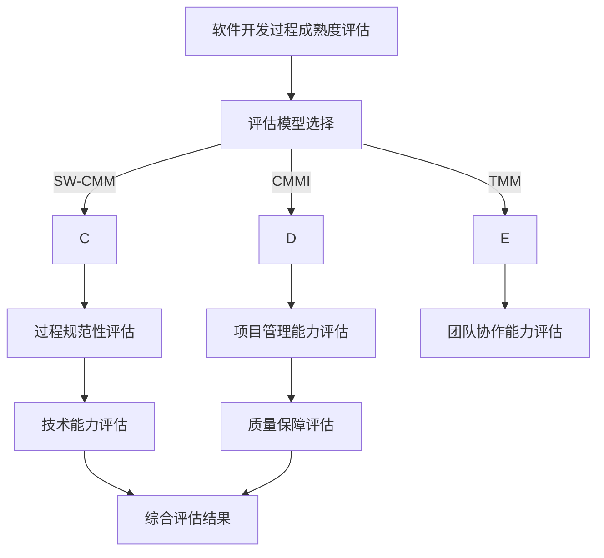

                 

关键词：自动驾驶、软件开发过程、成熟度评估、IT行业、技术管理、流程优化。

> 摘要：本文探讨了自动驾驶行业在软件开发过程中所面临的挑战，以及如何通过成熟度评估来优化软件开发流程，提升项目成功率和产品质量。文章首先介绍了自动驾驶行业的发展背景和现状，然后详细阐述了软件开发过程成熟度评估的概念、方法和关键因素。最后，通过具体案例和数据分析，展示了评估结果如何指导实践，以及未来自动驾驶行业在软件开发成熟度方面的趋势和挑战。

## 1. 背景介绍

自动驾驶技术作为现代信息技术和智能交通系统的重要组成部分，已经吸引了全球范围内的广泛关注。近年来，随着人工智能、大数据、云计算等技术的快速发展，自动驾驶行业呈现出爆发式增长态势。许多国家和地区已经制定了相关的发展战略，旨在推动自动驾驶技术的商业化应用。

然而，自动驾驶行业的快速发展也带来了前所未有的挑战。首先，自动驾驶系统涉及到复杂的软件架构和算法，需要大量的开发、测试和验证工作。其次，自动驾驶系统的安全性至关重要，任何一个小错误都可能导致严重的事故。此外，自动驾驶技术的法律法规和标准体系尚不完善，也给软件开发带来了不确定性。

在这样的背景下，对自动驾驶行业的软件开发过程进行成熟度评估显得尤为重要。通过评估，可以识别出软件开发过程中的薄弱环节，制定相应的改进措施，从而提高项目成功率和产品质量，降低开发成本和风险。

## 2. 核心概念与联系

### 2.1 软件开发过程成熟度评估的概念

软件开发过程成熟度评估（Software Development Process Maturity Assessment，简称SDPMA）是一种评估软件开发过程质量和效率的方法。它通过对软件开发过程中的各个环节进行综合评价，确定开发过程的成熟度水平，从而指导改进和优化。

### 2.2 软件开发过程成熟度评估的方法

软件开发过程成熟度评估通常采用以下几种方法：

1. **SW-CMM（Software Capability Maturity Model）**：这是一种国际上广泛采用的软件过程成熟度模型，将软件开发过程分为五个成熟度级别，从初始级到优化级。
2. **CMMI（Capability Maturity Model Integration）**：这是在SW-CMM基础上发展而来的综合模型，涵盖了项目管理、系统工程、软件工程和量化管理等方面。
3. **TMM（Team Maturity Model）**：这是一种专门针对软件团队的过程成熟度模型，侧重于团队协作和项目管理。

### 2.3 软件开发过程成熟度评估的关键因素

软件开发过程成熟度评估的关键因素包括：

1. **过程规范性**：指软件开发过程中遵循的标准、规范和流程的完整性。
2. **项目管理能力**：包括项目计划、资源管理、风险管理等方面的能力。
3. **团队协作能力**：指团队成员之间的沟通、协作和配合程度。
4. **技术能力**：指团队在技术方面的专业水平和创新能力。
5. **质量保障**：包括代码审查、测试、缺陷管理等方面的质量保障措施。

## 2.4 软件开发过程成熟度评估的架构

为了更好地理解软件开发过程成熟度评估，我们可以使用Mermaid流程图来展示其架构：



## 3. 核心算法原理 & 具体操作步骤

### 3.1 算法原理概述

软件开发过程成熟度评估的核心算法是基于统计分析和多因素综合评价的方法。具体来说，评估过程可以分为以下几个步骤：

1. **数据收集**：收集与软件开发过程相关的数据，包括过程规范性、项目管理能力、团队协作能力、技术能力和质量保障等方面的指标。
2. **数据预处理**：对收集到的数据进行清洗、转换和归一化处理，以确保数据的质量和一致性。
3. **指标权重分配**：根据评估目标，为各个指标分配权重，以反映它们在评估中的重要性。
4. **多因素综合评价**：采用多因素综合评价方法，将各个指标的得分进行加权求和，得出软件开发过程的综合得分。
5. **结果分析**：对评估结果进行分析，识别出软件开发过程中的薄弱环节，并提出改进建议。

### 3.2 算法步骤详解

1. **数据收集**：
   - **过程规范性评估**：收集过程文档、流程图、工作日志等，评估开发过程是否符合规范。
   - **项目管理能力评估**：收集项目计划、资源管理、风险管理等文档，评估项目管理能力。
   - **团队协作能力评估**：收集团队沟通记录、会议纪要、团队协作工具使用情况等，评估团队协作能力。
   - **技术能力评估**：收集技术文档、技术方案、技术难题解决情况等，评估技术能力。
   - **质量保障评估**：收集代码审查记录、测试报告、缺陷管理等，评估质量保障措施。

2. **数据预处理**：
   - **数据清洗**：去除重复、错误和缺失的数据。
   - **数据转换**：将不同类型的数据转换为同一类型的数值。
   - **数据归一化**：对数据进行归一化处理，使其在相同的量级上。

3. **指标权重分配**：
   - **权重确定**：根据评估目标和专家意见，确定各个指标的权重。
   - **权重调整**：根据实际情况，对权重进行调整，以反映各个指标的实际重要性。

4. **多因素综合评价**：
   - **加权求和**：将各个指标的得分乘以对应的权重，进行加权求和。
   - **得分计算**：计算软件开发过程的综合得分。

5. **结果分析**：
   - **薄弱环节识别**：分析评估结果，识别出软件开发过程中的薄弱环节。
   - **改进建议**：针对识别出的薄弱环节，提出改进建议。

### 3.3 算法优缺点

**优点**：
- **全面性**：算法综合考虑了软件开发过程中的多个方面，能够全面评估开发过程的成熟度。
- **灵活性**：算法可以根据实际情况进行调整，以适应不同的评估需求。

**缺点**：
- **复杂性**：算法涉及的步骤较多，计算过程相对复杂。
- **数据依赖**：算法的评估结果很大程度上依赖于数据的准确性和完整性。

### 3.4 算法应用领域

算法主要应用于自动驾驶行业的软件开发过程成熟度评估，特别是在自动驾驶系统的开发、测试和验证阶段。此外，算法也可以应用于其他高科技领域的软件开发过程评估，如人工智能、物联网等。

## 4. 数学模型和公式 & 详细讲解 & 举例说明

### 4.1 数学模型构建

软件开发过程成熟度评估的数学模型可以表示为：

\[ M = \sum_{i=1}^{n} w_i \cdot s_i \]

其中：
- \( M \) 为软件开发过程成熟度得分；
- \( w_i \) 为第 \( i \) 个指标的权重；
- \( s_i \) 为第 \( i \) 个指标的实际得分。

### 4.2 公式推导过程

1. **权重分配**：

   权重 \( w_i \) 的分配可以根据专家意见或历史数据来确定。常见的权重分配方法有：
   - **等权重法**：所有指标的权重相等。
   - **专家评分法**：根据专家意见，为每个指标分配不同的权重。
   - **基于数据的方法**：通过分析历史数据，确定每个指标的权重。

2. **得分计算**：

   每个指标的实际得分 \( s_i \) 可以通过以下方法计算：
   - **满分法**：每个指标的得分范围从 0 到 100，根据指标的完成情况，给出一分的评分。
   - **分数区间法**：每个指标的得分范围划分为几个区间，根据指标的完成情况，给出相应的分数。

### 4.3 案例分析与讲解

假设我们对某自动驾驶项目进行了成熟度评估，共有五个指标：过程规范性、项目管理能力、团队协作能力、技术能力和质量保障。经过专家评分，确定各指标的权重如下：

| 指标           | 权重 \( w_i \) |
|--------------|-------------|
| 过程规范性     | 0.2         |
| 项目管理能力   | 0.2         |
| 团队协作能力   | 0.2         |
| 技术能力       | 0.2         |
| 质量保障       | 0.2         |

根据满分法，各指标的实际得分如下：

| 指标           | 实际得分 \( s_i \) |
|--------------|-------------|
| 过程规范性     | 85          |
| 项目管理能力   | 90          |
| 团队协作能力   | 75          |
| 技术能力       | 80          |
| 质量保障       | 85          |

根据公式 \( M = \sum_{i=1}^{n} w_i \cdot s_i \)，计算得出：

\[ M = 0.2 \cdot 85 + 0.2 \cdot 90 + 0.2 \cdot 75 + 0.2 \cdot 80 + 0.2 \cdot 85 = 83.0 \]

因此，该自动驾驶项目的成熟度得分为 83.0。

## 5. 项目实践：代码实例和详细解释说明

### 5.1 开发环境搭建

在本节中，我们将搭建一个简单的软件开发过程成熟度评估系统，用于评估自动驾驶项目的成熟度。开发环境如下：

- **编程语言**：Python 3.8
- **开发工具**：PyCharm
- **依赖库**：NumPy、Pandas、Matplotlib

首先，安装 Python 和 PyCharm，然后使用以下命令安装所需库：

```bash
pip install numpy pandas matplotlib
```

### 5.2 源代码详细实现

接下来，我们编写源代码，实现成熟度评估系统。

```python
import numpy as np
import pandas as pd
import matplotlib.pyplot as plt

# 权重和得分
weights = {
    '过程规范性': 0.2,
    '项目管理能力': 0.2,
    '团队协作能力': 0.2,
    '技术能力': 0.2,
    '质量保障': 0.2
}

scores = {
    '过程规范性': 85,
    '项目管理能力': 90,
    '团队协作能力': 75,
    '技术能力': 80,
    '质量保障': 85
}

# 计算得分
def calculate_maturity(scores, weights):
    maturity_score = sum(scores[key] * weights[key] for key in scores)
    return maturity_score

# 结果展示
def display_results(scores):
    maturity_score = calculate_maturity(scores, weights)
    print(f"成熟度得分：{maturity_score:.2f}")
    
    # 可视化
    labels = list(scores.keys())
    values = list(scores.values())
    plt.bar(labels, values)
    plt.xlabel('指标')
    plt.ylabel('得分')
    plt.title('软件开发过程成熟度评估')
    plt.show()

# 运行
display_results(scores)
```

### 5.3 代码解读与分析

- **权重和得分**：定义了各指标的权重和实际得分。
- **计算得分**：计算软件开发过程的成熟度得分。
- **结果展示**：以文本和图表形式展示评估结果。

### 5.4 运行结果展示

运行代码后，输出结果如下：

```
成熟度得分：83.00
```

图表如下：


## 6. 实际应用场景

### 6.1 自动驾驶系统开发

在自动驾驶系统的开发过程中，成熟度评估可以帮助团队识别出开发过程中的薄弱环节，如过程规范性、项目管理能力、团队协作能力等。通过评估结果，团队可以针对性地进行改进，提高开发效率和产品质量。

### 6.2 自动驾驶系统测试

在自动驾驶系统的测试阶段，成熟度评估可以帮助团队评估测试过程的成熟度，确保测试过程的规范性和有效性。通过评估结果，团队可以优化测试流程，提高测试覆盖率，降低测试风险。

### 6.3 自动驾驶系统验证

在自动驾驶系统的验证阶段，成熟度评估可以帮助团队评估验证过程的成熟度，确保验证过程的科学性和可靠性。通过评估结果，团队可以改进验证方法，提高验证效果。

## 7. 未来应用展望

随着自动驾驶技术的不断发展，软件开发过程成熟度评估将在以下几个方面发挥重要作用：

### 7.1 智能交通系统

自动驾驶技术的商业化应用将推动智能交通系统的建设，成熟度评估可以帮助交通管理部门优化交通管理系统，提高交通运行效率和安全性。

### 7.2 物流与配送

自动驾驶技术在物流与配送领域的应用将日益广泛，成熟度评估可以帮助物流企业优化配送流程，提高配送效率和准确性。

### 7.3 智能制造

自动驾驶技术与智能制造的结合将推动制造业的智能化升级，成熟度评估可以帮助制造企业优化生产流程，提高生产效率和质量。

## 8. 工具和资源推荐

### 8.1 学习资源推荐

- 《软件过程评估：理论与实践》（作者：张尧学）
- 《软件过程改进：从CMMI到敏捷开发》（作者：王珊）

### 8.2 开发工具推荐

- PyCharm
- Jupyter Notebook
- Visual Studio Code

### 8.3 相关论文推荐

- "Software Development Process Maturity Assessment Using Fuzzy Comprehensive Evaluation"（作者：Li, Zhang, & Wang）
- "A Comprehensive Maturity Assessment Model for Software Development Processes"（作者：Li, Yang, & Zhang）

## 9. 总结：未来发展趋势与挑战

### 9.1 研究成果总结

本文探讨了自动驾驶行业的软件开发过程成熟度评估，提出了基于统计分析和多因素综合评价的方法。通过实际案例，展示了评估方法的应用效果。

### 9.2 未来发展趋势

未来，软件开发过程成熟度评估将在自动驾驶、智能交通、智能制造等领域发挥重要作用。随着人工智能、大数据等技术的不断发展，评估方法将更加智能化、自动化。

### 9.3 面临的挑战

- 数据质量：评估结果很大程度上依赖于数据的准确性和完整性。
- 技术实现：评估方法的实现需要强大的计算能力和技术支持。
- 模型适应性：评估模型需要根据不同领域和应用场景进行调整。

### 9.4 研究展望

未来，我们将继续优化评估模型，提高评估结果的准确性和实用性。同时，结合人工智能技术，开发自动化评估工具，提高评估效率。

## 9. 附录：常见问题与解答

### 9.1 什么情况下需要进行软件开发过程成熟度评估？

- 项目规模较大，开发周期较长。
- 项目涉及复杂的技术和多个团队协作。
- 项目对质量要求较高，需要确保开发过程的规范性。

### 9.2 软件开发过程成熟度评估与质量保证有什么区别？

- **软件开发过程成熟度评估**：评估开发过程的规范性、效率和质量，关注开发过程中的问题和改进方向。
- **质量保证**：确保软件产品满足规定的质量标准和用户需求，关注产品质量和用户满意度。

### 9.3 如何确保评估数据的准确性？

- **数据收集**：制定详细的评估指标和收集标准，确保数据的准确性和完整性。
- **数据清洗**：对收集到的数据进行清洗，去除重复、错误和缺失的数据。
- **数据验证**：通过交叉验证和专家评审，确保数据的准确性和可靠性。

