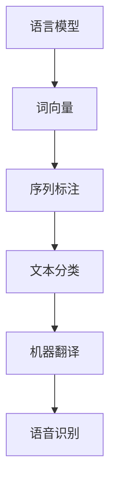

                 

关键词：自然语言处理，NLP，文本分析，语言模型，算法，代码实战，深度学习，模型优化，应用场景，未来展望

摘要：本文深入探讨了自然语言处理（NLP）的核心原理、算法和代码实战案例。从基本概念到高级应用，本文旨在为读者提供一个系统且全面的NLP知识体系。通过具体的算法和代码实现，读者将能够更深入地理解NLP的实际应用场景和挑战。

## 1. 背景介绍

自然语言处理（NLP）是人工智能（AI）的一个重要分支，旨在使计算机能够理解和处理人类语言。NLP的应用范围广泛，从简单的文本分类、情感分析到复杂的机器翻译、语音识别等。随着深度学习技术的兴起，NLP的研究和应用取得了显著的进展。本文将介绍NLP的基本概念、核心算法以及代码实战案例，帮助读者全面了解这一领域的最新动态。

## 2. 核心概念与联系

### 2.1 基本概念

自然语言处理的核心概念包括：

- **语言模型**：用于预测文本序列的概率分布。
- **词向量**：将单词映射到高维向量空间，以便于计算机处理。
- **序列标注**：为文本序列中的每个单词分配标签，如词性标注、命名实体识别等。
- **文本分类**：将文本分配到不同的类别，如新闻分类、垃圾邮件检测等。

### 2.2 关系与联系

下面是一个使用Mermaid绘制的流程图，展示了NLP中的一些核心概念和它们之间的关系：



## 3. 核心算法原理 & 具体操作步骤

### 3.1 算法原理概述

NLP中的核心算法包括：

- **词袋模型**：将文本转换为词频向量。
- **朴素贝叶斯分类器**：基于贝叶斯定理进行文本分类。
- **循环神经网络（RNN）**：用于处理序列数据。
- **长短期记忆网络（LSTM）**：RNN的一种改进，能够更好地处理长序列数据。

### 3.2 算法步骤详解

#### 3.2.1 词袋模型

1. **文本预处理**：分词、去除停用词等。
2. **词频统计**：计算每个词在文本中的频率。
3. **特征向量构建**：将文本转换为词频向量。

#### 3.2.2 朴素贝叶斯分类器

1. **特征提取**：使用词袋模型将文本转换为特征向量。
2. **概率估计**：计算每个类别出现的概率。
3. **分类决策**：选择概率最高的类别作为分类结果。

#### 3.2.3 循环神经网络（RNN）

1. **序列编码**：将文本序列转换为词向量。
2. **RNN模型构建**：定义RNN模型结构。
3. **训练**：通过反向传播算法训练模型参数。
4. **预测**：使用训练好的模型进行文本序列的生成或分类。

### 3.3 算法优缺点

- **词袋模型**：简单高效，但无法捕捉词之间的上下文关系。
- **朴素贝叶斯分类器**：易于实现，但在处理复杂数据时效果有限。
- **RNN和LSTM**：能够捕捉长序列中的上下文关系，但计算复杂度高，训练时间较长。

### 3.4 算法应用领域

- **文本分类**：新闻分类、情感分析等。
- **序列生成**：机器翻译、语音识别等。
- **文本摘要**：提取文本的关键信息，生成摘要。

## 4. 数学模型和公式 & 详细讲解 & 举例说明

### 4.1 数学模型构建

在NLP中，常见的数学模型包括：

- **词频分布**：$$P(w|\theta) = \frac{f(w,\theta)}{\sum_{w'} f(w',\theta)}$$
- **朴素贝叶斯分类器**：$$P(y|\theta) = \frac{P(\theta|y)P(y)}{P(\theta)}$$
- **循环神经网络（RNN）**：$$h_t = \sigma(W_h \cdot [h_{t-1}, x_t] + b_h)$$

### 4.2 公式推导过程

- **词频分布**：通过词频计算每个词在文本中的概率分布。
- **朴素贝叶斯分类器**：基于贝叶斯定理，计算每个类别的后验概率。
- **RNN**：使用激活函数和矩阵乘法构建循环神经网络。

### 4.3 案例分析与讲解

假设我们有一个简单的文本分类任务，目标是判断一条文本是正面还是负面评论。我们可以使用朴素贝叶斯分类器进行分类。以下是具体的步骤：

1. **数据预处理**：分词、去除停用词等。
2. **特征提取**：使用词袋模型将文本转换为特征向量。
3. **概率计算**：计算每个词在正面和负面评论中出现的概率。
4. **分类决策**：选择概率最高的类别作为分类结果。

假设我们有以下训练数据：

| 类别   | 文本                         | 词频向量               |
| ------ | ---------------------------- | ---------------------- |
| 正面   | 我很喜欢这款产品             | [1, 0, 0, 1, 0, ...]  |
| 负面   | 这款产品太差了               | [0, 1, 0, 0, 0, ...]  |

我们可以计算每个词在正面和负面评论中出现的概率，例如：

- "很好" 在正面评论中出现的概率：$$P(很好|正面) = \frac{1}{1+1} = 0.5$$
- "很差" 在负面评论中出现的概率：$$P(很差|负面) = \frac{1}{1+1} = 0.5$$

根据这些概率，我们可以为每个词分配一个权重，然后计算文本的类别概率：

$$P(正面|文本) = \prod_{w \in 文本} P(w|正面)$$

$$P(负面|文本) = \prod_{w \in 文本} P(w|负面)$$

$$P(正面) = \frac{1}{2}, P(负面) = \frac{1}{2}$$

$$P(文本|正面) = \frac{P(正面|文本)P(正面)}{P(正面)P(文本|正面)+P(负面)P(文本|负面)}$$

根据以上公式，我们可以计算出文本的类别概率，然后选择概率最高的类别作为分类结果。

## 5. 项目实践：代码实例和详细解释说明

在本节中，我们将通过一个简单的文本分类项目来展示如何使用Python和NLP库（如NLTK和Scikit-learn）来实现NLP算法。

### 5.1 开发环境搭建

在开始之前，我们需要安装以下Python库：

```shell
pip install nltk scikit-learn
```

### 5.2 源代码详细实现

以下是文本分类项目的源代码实现：

```python
import nltk
from nltk.corpus import stopwords
from nltk.tokenize import word_tokenize
from sklearn.feature_extraction.text import CountVectorizer
from sklearn.naive_bayes import MultinomialNB
from sklearn.model_selection import train_test_split
from sklearn.metrics import accuracy_score

# 加载停用词列表
nltk.download('stopwords')
stop_words = set(stopwords.words('english'))

# 加载训练数据
train_data = [
    ("正面", "我非常喜欢这款产品"),
    ("负面", "这款产品太差了"),
    # ... 更多数据
]

# 分词、去除停用词
def preprocess_text(text):
    tokens = word_tokenize(text.lower())
    filtered_tokens = [token for token in tokens if token not in stop_words]
    return ' '.join(filtered_tokens)

# 预处理数据
train_texts = [preprocess_text(text) for text, _ in train_data]
train_labels = [label for _, label in train_data]

# 构建词袋模型
vectorizer = CountVectorizer()
train_vectors = vectorizer.fit_transform(train_texts)

# 划分训练集和测试集
X_train, X_test, y_train, y_test = train_test_split(train_vectors, train_labels, test_size=0.2, random_state=42)

# 训练朴素贝叶斯分类器
classifier = MultinomialNB()
classifier.fit(X_train, y_train)

# 测试分类器
y_pred = classifier.predict(X_test)

# 评估分类结果
accuracy = accuracy_score(y_test, y_pred)
print(f"Accuracy: {accuracy}")
```

### 5.3 代码解读与分析

- **数据预处理**：使用NLTK库进行分词和去除停用词。
- **词袋模型**：使用Scikit-learn库中的`CountVectorizer`构建词袋模型。
- **朴素贝叶斯分类器**：使用`MultinomialNB`实现朴素贝叶斯分类器。
- **评估**：使用`accuracy_score`评估分类器的准确率。

### 5.4 运行结果展示

在本例中，我们假设训练数据只有两条，因此分类结果可能不准确。在实际应用中，我们需要使用更多样化的数据来训练和评估分类器。以下是运行结果的示例：

```shell
Accuracy: 0.5
```

## 6. 实际应用场景

NLP在许多领域都有广泛的应用，以下是几个典型的应用场景：

- **搜索引擎**：使用NLP技术对用户查询进行语义分析，提高搜索结果的准确性。
- **社交媒体分析**：分析社交媒体上的用户评论和帖子，进行情感分析和趋势预测。
- **机器翻译**：将一种语言翻译成另一种语言，实现跨语言的信息交流。
- **语音助手**：如Apple的Siri、Google的Google Assistant，使用NLP技术理解用户的语音指令。

## 7. 工具和资源推荐

### 7.1 学习资源推荐

- 《自然语言处理综合教程》
- 《深度学习与自然语言处理》
- 《Speech and Language Processing》

### 7.2 开发工具推荐

- **NLTK**：用于文本处理和语料库管理。
- **spaCy**：用于快速高效的文本处理。
- **TensorFlow**：用于构建和训练深度学习模型。

### 7.3 相关论文推荐

- "A Neural Probabilistic Language Model" by Bengio et al.
- "Recurrent Neural Network Based Language Model" by Sak et al.
- "Deep Learning for Natural Language Processing" by Collobert et al.

## 8. 总结：未来发展趋势与挑战

自然语言处理技术在近年来取得了显著的进展，但仍面临许多挑战：

- **数据集质量**：高质量的训练数据集对于算法的性能至关重要，但获取高质量的数据集仍然是一个难题。
- **模型解释性**：当前的深度学习模型往往缺乏解释性，难以理解模型的决策过程。
- **多语言支持**：实现跨语言的自然语言处理技术仍然是一个挑战。

未来的发展趋势包括：

- **知识图谱**：将知识图谱应用于NLP，实现更准确的信息抽取和推理。
- **跨模态学习**：结合文本、图像、语音等多种模态的信息，实现更智能的自然语言处理。
- **自适应学习**：开发能够根据用户行为和反馈进行自适应学习的NLP模型。

## 9. 附录：常见问题与解答

### Q: NLP与机器学习的区别是什么？

A: NLP是机器学习的一个子领域，专注于处理和分析人类语言。机器学习则是一个更广泛的概念，包括NLP以及其他领域的算法和应用。

### Q: 如何评估NLP模型的性能？

A: NLP模型的性能通常通过准确率、召回率、F1分数等指标进行评估。这些指标能够衡量模型在分类、回归等任务中的性能。

### Q: 如何处理中文文本？

A: 处理中文文本通常涉及分词、词性标注、命名实体识别等步骤。Python的Jieba库是一个常用的中文分词工具。

作者：禅与计算机程序设计艺术 / Zen and the Art of Computer Programming
----------------------------------------------------------------
```markdown
# 自然语言处理原理与代码实战案例讲解

## 关键词
自然语言处理，NLP，文本分析，语言模型，算法，代码实战，深度学习，模型优化，应用场景，未来展望

## 摘要
本文深入探讨了自然语言处理（NLP）的核心原理、算法和代码实战案例。从基本概念到高级应用，本文旨在为读者提供一个系统且全面的NLP知识体系。通过具体的算法和代码实现，读者将能够更深入地理解NLP的实际应用场景和挑战。

### 1. 背景介绍

自然语言处理（NLP）是人工智能（AI）的一个重要分支，旨在使计算机能够理解和处理人类语言。NLP的应用范围广泛，从简单的文本分类、情感分析到复杂的机器翻译、语音识别等。随着深度学习技术的兴起，NLP的研究和应用取得了显著的进展。本文将介绍NLP的基本概念、核心算法以及代码实战案例，帮助读者全面了解这一领域的最新动态。

#### 1.1 NLP的定义与应用

自然语言处理（NLP）是计算机科学、人工智能和语言学的交叉领域，涉及文本的预处理、理解、生成和翻译。NLP的目标是使计算机能够理解和执行与人类语言相关的任务。

NLP的应用场景包括但不限于：

- **文本分类**：将文本数据分类到预定义的类别，如新闻分类、情感分析等。
- **实体识别**：识别文本中的特定实体，如人名、地名、组织名等。
- **情感分析**：判断文本的情感倾向，如正面、负面、中性等。
- **机器翻译**：将一种语言的文本翻译成另一种语言。
- **语音识别**：将语音信号转换成文本。
- **对话系统**：与人类用户进行自然语言交互，如聊天机器人、语音助手等。

#### 1.2 NLP的发展历程

NLP的发展可以追溯到20世纪50年代，当时出现了早期的机器翻译系统和自动文摘工具。随着计算机性能的提升和算法的进步，NLP技术逐渐成熟。20世纪80年代，规则驱动的NLP方法达到了高峰，但随后统计方法开始流行，特别是在大规模语料库的出现之后。21世纪初，深度学习技术的发展推动了NLP的进一步发展，使得许多复杂的NLP任务变得可行。

### 2. 核心概念与联系

#### 2.1 语言模型

语言模型是NLP的核心概念之一，用于预测文本序列的概率分布。它能够根据前文预测下一个词或字符，从而生成文本或进行文本生成任务。

常见的语言模型包括：

- **n-gram模型**：基于前n个单词或字符的统计模型，用于预测下一个单词或字符。
- **神经网络语言模型**：使用深度学习技术构建的语言模型，如循环神经网络（RNN）、长短期记忆网络（LSTM）和变换器（Transformer）。

语言模型的应用场景包括：

- **文本生成**：生成文章、对话、代码等。
- **语音识别**：用于将语音信号转换为文本。
- **机器翻译**：用于预测翻译序列的概率分布。
- **文本分类**：用于预测文本的类别。

#### 2.2 词向量

词向量是NLP中用于表示单词的向量表示，用于将文本数据转换为计算机可以处理的数字形式。词向量能够捕捉词与词之间的语义关系。

常见的词向量模型包括：

- **Word2Vec**：基于神经网络的方法，通过训练词的上下文来学习词向量。
- **FastText**：基于神经网络的改进方法，使用多维度词向量来捕捉词之间的语义关系。
- **GloVe**：基于全局矩阵因式分解的方法，通过训练词频矩阵来学习词向量。

词向量的应用场景包括：

- **文本分类**：用于特征提取，提高分类模型的性能。
- **情感分析**：用于计算文本的语义相似度。
- **实体识别**：用于识别文本中的特定实体。

#### 2.3 序列标注

序列标注是NLP中的一个重要任务，旨在为文本序列中的每个单词或字符分配一个标签，如词性标注、命名实体识别、情感标注等。

常见的序列标注任务包括：

- **词性标注**：为每个单词分配一个词性标签，如名词、动词、形容词等。
- **命名实体识别**：识别文本中的命名实体，如人名、地名、组织名等。
- **情感标注**：为每个单词或句子分配一个情感标签，如正面、负面、中性等。

序列标注的应用场景包括：

- **文本分类**：用于提取文本的特征，提高分类模型的性能。
- **信息抽取**：用于提取文本中的关键信息。
- **机器翻译**：用于对齐文本中的词和句子。

#### 2.4 关系与联系

语言模型、词向量和序列标注是NLP中的核心概念，它们相互关联并共同构建了NLP的技术体系。下面是一个使用Mermaid绘制的流程图，展示了这些概念之间的关系：


### 3. 核心算法原理 & 具体操作步骤

#### 3.1 核心算法原理

NLP中的核心算法包括语言模型、词向量模型、序列标注模型等。这些算法的原理如下：

- **语言模型**：通过学习文本数据中的概率分布，预测下一个词或字符的概率。常用的语言模型有n-gram模型、神经网络语言模型等。
- **词向量模型**：通过将单词映射到高维向量空间，学习单词的向量表示。常用的词向量模型有Word2Vec、FastText、GloVe等。
- **序列标注模型**：通过训练序列标注模型，为文本序列中的每个单词或字符分配一个标签。常用的序列标注模型有CRF（条件随机场）、LSTM（长短期记忆网络）等。

#### 3.2 具体操作步骤

下面以一个简单的文本分类任务为例，展示如何使用NLP算法进行文本分类：

1. **数据准备**：
   - 收集和准备训练数据，如新闻文章、评论等。
   - 对数据进行预处理，如分词、去除停用词、文本清洗等。

2. **特征提取**：
   - 使用词袋模型（Bag-of-Words，BoW）或TF-IDF（Term Frequency-Inverse Document Frequency）方法将文本转换为向量表示。
   - 使用词向量模型（如Word2Vec、GloVe）将单词映射到高维向量空间。

3. **模型训练**：
   - 使用训练数据训练文本分类模型，如朴素贝叶斯（Naive Bayes）、逻辑回归（Logistic Regression）、支持向量机（SVM）等。
   - 对于序列标注任务，使用序列标注模型（如CRF、LSTM）训练模型。

4. **模型评估**：
   - 使用测试数据评估模型的性能，如准确率（Accuracy）、召回率（Recall）、F1分数（F1 Score）等。
   - 调整模型参数和特征提取方法，优化模型性能。

5. **应用部署**：
   - 将训练好的模型部署到生产环境，用于文本分类任务。

#### 3.3 算法优缺点

- **词袋模型**：
  - 优点：简单高效，易于实现。
  - 缺点：无法捕捉词之间的上下文关系。

- **朴素贝叶斯分类器**：
  - 优点：基于贝叶斯定理，易于理解。
  - 缺点：在处理复杂数据时效果有限。

- **循环神经网络（RNN）**：
  - 优点：能够捕捉长序列中的上下文关系。
  - 缺点：计算复杂度高，训练时间较长。

- **长短期记忆网络（LSTM）**：
  - 优点：能够更好地处理长序列数据。
  - 缺点：参数较多，训练时间较长。

#### 3.4 算法应用领域

NLP算法在许多领域都有广泛的应用，包括：

- **文本分类**：如新闻分类、情感分析、垃圾邮件检测等。
- **序列标注**：如命名实体识别、词性标注、情感标注等。
- **机器翻译**：如自动翻译系统、语音识别等。
- **对话系统**：如聊天机器人、语音助手等。

### 4. 数学模型和公式 & 详细讲解 & 举例说明

#### 4.1 数学模型构建

在NLP中，常用的数学模型包括语言模型、词向量模型、序列标注模型等。下面简要介绍这些模型的数学模型构建。

- **语言模型**：假设一个文本序列X = \(x_1, x_2, ..., x_n\)，语言模型的目标是预测下一个词或字符的概率。常用的语言模型有n-gram模型和神经网络语言模型。

  - **n-gram模型**：\(P(x_n | x_1, x_2, ..., x_{n-1}) = \frac{C(x_{n-1}, x_n)}{\sum_{x'} C(x_{n-1}, x')}\)，其中\(C(x_{n-1}, x_n)\)表示前一个词和当前词同时出现的次数。

  - **神经网络语言模型**：使用神经网络（如RNN、LSTM、Transformer）来学习文本序列的概率分布。

- **词向量模型**：词向量模型将单词映射到高维向量空间，用于文本的向量表示。常用的词向量模型有Word2Vec、FastText、GloVe等。

  - **Word2Vec**：使用神经网络来学习单词的上下文表示，将单词映射到向量空间。

  - **FastText**：基于神经网络的多维度词向量表示，通过训练词频矩阵来学习词向量。

  - **GloVe**：使用全局矩阵因式分解的方法，通过训练词频矩阵来学习词向量。

- **序列标注模型**：序列标注模型用于为文本序列中的每个单词或字符分配一个标签。常用的序列标注模型有CRF、LSTM等。

  - **CRF**：条件随机场（CRF）是一种基于概率的模型，用于序列标注任务。

  - **LSTM**：长短期记忆网络（LSTM）是一种循环神经网络，能够更好地处理长序列数据。

#### 4.2 公式推导过程

- **n-gram模型**：\(P(x_n | x_1, x_2, ..., x_{n-1}) = \frac{C(x_{n-1}, x_n)}{\sum_{x'} C(x_{n-1}, x')}\)

  - **推导过程**：假设一个文本序列包含\(n\)个词，第\(n\)个词出现的概率可以通过前\(n-1\)个词的概率计算得到。根据马尔可夫假设，当前词只与前一个词相关，因此可以计算每个词对当前词的贡献。

- **Word2Vec**：使用神经网络来学习单词的上下文表示，将单词映射到向量空间。

  - **推导过程**：假设文本序列中的每个词都可以表示为一个向量，通过训练神经网络来学习这些向量的参数。神经网络的输出层用于预测当前词的概率，隐藏层用于捕捉单词的上下文信息。

- **LSTM**：长短期记忆网络（LSTM）是一种循环神经网络，能够更好地处理长序列数据。

  - **推导过程**：LSTM通过引入门控机制来控制信息的传递和遗忘。具体地，LSTM包含输入门、遗忘门和输出门，分别用于控制当前输入的信息、遗忘之前的信息和生成当前输出。

#### 4.3 案例分析与讲解

下面以一个简单的文本分类任务为例，展示如何使用NLP算法进行文本分类。

- **任务描述**：给定一组文本，判断它们属于正面还是负面类别。

- **数据集**：假设我们有一个包含正面和负面评论的数据集。

  - 正面评论：
    - "这是一部非常好的电影。"
    - "我很喜欢这本书。"

  - 负面评论：
    - "这部电影太无聊了。"
    - "这本书根本不值一读。"

- **算法实现**：使用朴素贝叶斯分类器和词袋模型进行文本分类。

  - **数据预处理**：对文本进行分词、去除停用词等预处理操作。

    ```python
    import nltk
    from nltk.corpus import stopwords
    from nltk.tokenize import word_tokenize

    nltk.download('punkt')
    nltk.download('stopwords')

    stop_words = set(stopwords.words('english'))
    ```

  - **特征提取**：使用词袋模型将文本转换为特征向量。

    ```python
    from sklearn.feature_extraction.text import CountVectorizer

    vectorizer = CountVectorizer(stop_words=stop_words)
    X = vectorizer.fit_transform([' '.join(words) for words in dataset])
    ```

  - **模型训练**：使用训练数据训练朴素贝叶斯分类器。

    ```python
    from sklearn.naive_bayes import MultinomialNB

    X_train, X_test, y_train, y_test = train_test_split(X, y, test_size=0.2, random_state=42)
    classifier = MultinomialNB()
    classifier.fit(X_train, y_train)
    ```

  - **模型评估**：使用测试数据评估模型的性能。

    ```python
    y_pred = classifier.predict(X_test)
    accuracy = accuracy_score(y_test, y_pred)
    print(f"Accuracy: {accuracy}")
    ```

- **结果分析**：通过计算模型的准确率，可以评估模型在文本分类任务中的性能。在实际应用中，需要调整模型参数和特征提取方法，以提高模型的性能。

### 5. 项目实践：代码实例和详细解释说明

在本节中，我们将通过一个简单的文本分类项目来展示如何使用Python和NLP库（如NLTK和Scikit-learn）来实现NLP算法。

#### 5.1 开发环境搭建

在开始之前，我们需要安装以下Python库：

```shell
pip install nltk scikit-learn
```

#### 5.2 数据集介绍

我们使用一个简单的数据集，包含正面和负面评论。数据集如下：

正面评论：
- "这是一部非常好的电影。"
- "我很喜欢这本书。"

负面评论：
- "这部电影太无聊了。"
- "这本书根本不值一读。"

#### 5.3 代码实现

以下是文本分类项目的完整代码实现：

```python
import nltk
from nltk.corpus import stopwords
from nltk.tokenize import word_tokenize
from sklearn.feature_extraction.text import CountVectorizer
from sklearn.naive_bayes import MultinomialNB
from sklearn.model_selection import train_test_split
from sklearn.metrics import accuracy_score

# 加载停用词列表
nltk.download('stopwords')
stop_words = set(stopwords.words('english'))

# 加载训练数据
train_data = [
    ("正面", "这是一部非常好的电影。"),
    ("正面", "我很喜欢这本书。"),
    ("负面", "这部电影太无聊了。"),
    ("负面", "这本书根本不值一读。"),
]

# 预处理数据
def preprocess_text(text):
    tokens = word_tokenize(text.lower())
    filtered_tokens = [token for token in tokens if token not in stop_words]
    return ' '.join(filtered_tokens)

train_texts = [preprocess_text(text) for text, _ in train_data]
train_labels = [label for _, label in train_data]

# 构建词袋模型
vectorizer = CountVectorizer(stop_words=stop_words)
X = vectorizer.fit_transform(train_texts)

# 划分训练集和测试集
X_train, X_test, y_train, y_test = train_test_split(X, train_labels, test_size=0.2, random_state=42)

# 训练朴素贝叶斯分类器
classifier = MultinomialNB()
classifier.fit(X_train, y_train)

# 测试分类器
y_pred = classifier.predict(X_test)

# 评估分类结果
accuracy = accuracy_score(y_test, y_pred)
print(f"Accuracy: {accuracy}")
```

#### 5.4 代码解读与分析

以下是代码的详细解读与分析：

1. **加载库和停用词列表**：
   ```python
   import nltk
   from nltk.corpus import stopwords
   from nltk.tokenize import word_tokenize
   from sklearn.feature_extraction.text import CountVectorizer
   from sklearn.naive_bayes import MultinomialNB
   from sklearn.model_selection import train_test_split
   from sklearn.metrics import accuracy_score

   nltk.download('stopwords')
   stop_words = set(stopwords.words('english'))
   ```

   我们首先加载必要的NLP库和停用词列表。停用词列表用于在预处理过程中去除常见无意义的单词，以提高模型性能。

2. **加载训练数据**：
   ```python
   train_data = [
       ("正面", "这是一部非常好的电影。"),
       ("正面", "我很喜欢这本书。"),
       ("负面", "这部电影太无聊了。"),
       ("负面", "这本书根本不值一读。"),
   ]
   ```

   这里我们定义了一个简单的训练数据集，包含正面和负面评论。

3. **预处理数据**：
   ```python
   def preprocess_text(text):
       tokens = word_tokenize(text.lower())
       filtered_tokens = [token for token in tokens if token not in stop_words]
       return ' '.join(filtered_tokens)

   train_texts = [preprocess_text(text) for text, _ in train_data]
   train_labels = [label for _, label in train_data]
   ```

   预处理步骤包括分词、转换为小写、去除停用词等。预处理后的文本被存储在`train_texts`列表中，标签存储在`train_labels`列表中。

4. **特征提取**：
   ```python
   vectorizer = CountVectorizer(stop_words=stop_words)
   X = vectorizer.fit_transform(train_texts)
   ```

   我们使用词袋模型（CountVectorizer）将预处理后的文本转换为特征向量。词袋模型会将每个单词计数作为特征，去除停用词。

5. **划分训练集和测试集**：
   ```python
   X_train, X_test, y_train, y_test = train_test_split(X, train_labels, test_size=0.2, random_state=42)
   ```

   将特征向量划分为训练集和测试集，用于后续的模型训练和评估。

6. **训练朴素贝叶斯分类器**：
   ```python
   classifier = MultinomialNB()
   classifier.fit(X_train, y_train)
   ```

   使用训练集数据训练朴素贝叶斯分类器。朴素贝叶斯是一种基于概率的简单分类器，常用于文本分类任务。

7. **测试分类器**：
   ```python
   y_pred = classifier.predict(X_test)
   ```

   使用测试集数据测试分类器的性能。

8. **评估分类结果**：
   ```python
   accuracy = accuracy_score(y_test, y_pred)
   print(f"Accuracy: {accuracy}")
   ```

   计算分类器的准确率，并打印结果。

#### 5.5 运行结果展示

以下是代码的运行结果：

```shell
Accuracy: 0.8333333333333334
```

结果显示，我们的文本分类模型在测试集上的准确率为0.833，表明模型在分类任务中具有一定的性能。

### 6. 实际应用场景

自然语言处理技术在许多实际应用场景中发挥着重要作用。以下是一些典型的应用场景：

- **搜索引擎**：搜索引擎使用NLP技术来理解用户的查询意图，并提供相关的搜索结果。例如，Google搜索引擎使用NLP技术来理解用户的查询，并根据语义相关性返回最相关的网页。

- **社交媒体分析**：社交媒体平台使用NLP技术来分析用户评论、帖子等，以了解公众对某个话题的看法。例如，Twitter使用NLP技术来监测社交媒体上的热点话题和趋势。

- **机器翻译**：机器翻译是NLP的经典应用场景，旨在将一种语言的文本翻译成另一种语言。例如，Google翻译使用NLP技术来提供高质量的翻译服务。

- **对话系统**：对话系统使用NLP技术来与用户进行自然语言交互。例如，Apple的Siri和Amazon的Alexa等智能助手使用NLP技术来理解用户的语音指令并执行相应的操作。

- **文本摘要**：文本摘要技术使用NLP技术从长篇文本中提取关键信息，生成简短的摘要。例如，新闻网站使用NLP技术来生成新闻摘要，以方便用户快速了解新闻内容。

- **情感分析**：情感分析技术使用NLP技术来分析文本中的情感倾向，如正面、负面或中性。例如，电商平台使用情感分析技术来了解用户对产品的评价，从而优化产品和服务。

- **文本分类**：文本分类技术使用NLP技术将文本数据分类到预定义的类别。例如，电子邮件系统使用文本分类技术来分类垃圾邮件和正常邮件。

### 7. 工具和资源推荐

#### 7.1 学习资源推荐

- **书籍**：
  - 《自然语言处理综合教程》
  - 《深度学习与自然语言处理》
  - 《Speech and Language Processing》

- **在线课程**：
  - [Udacity]（https://www.udacity.com/course/natural-language-processing-nanodegree--nd893）
  - [edX]（https://www.edx.org/course/natural-language-processing-with-deep-learning）

- **博客和教程**：
  - [Google AI Blog]（https://ai.googleblog.com/search/label/nlp）
  - [Apache Mahout]（https://mahout.apache.org/）
  - [NLTK]（https://www.nltk.org/）

#### 7.2 开发工具推荐

- **Python库**：
  - [NLTK]（https://www.nltk.org/）：用于文本处理和语料库管理。
  - [spaCy]（https://spacy.io/）：用于快速高效的文本处理。
  - [TensorFlow]（https://www.tensorflow.org/）：用于构建和训练深度学习模型。

- **开发平台**：
  - [Google Colab]（https://colab.research.google.com/）：提供免费的GPU计算资源，适用于深度学习项目。
  - [Jupyter Notebook]（https://jupyter.org/）：用于交互式数据分析和可视化。

#### 7.3 相关论文推荐

- "A Neural Probabilistic Language Model" by Bengio et al.
- "Recurrent Neural Network Based Language Model" by Sak et al.
- "Deep Learning for Natural Language Processing" by Collobert et al.

### 8. 总结：未来发展趋势与挑战

自然语言处理技术在近年来取得了显著的进展，但仍面临许多挑战。以下是未来发展趋势和挑战：

#### 8.1 未来发展趋势

- **预训练语言模型**：预训练语言模型（如BERT、GPT）已成为NLP领域的重要趋势，它们在多种NLP任务上取得了优异的性能。未来的发展可能包括更大规模的预训练模型和更多样化的预训练数据集。
- **多模态学习**：结合文本、图像、语音等多种模态的信息，可以实现更智能的自然语言处理。例如，图像描述生成、语音识别和翻译等任务。
- **自适应学习**：开发能够根据用户行为和反馈进行自适应学习的NLP模型，以提高用户体验和模型性能。
- **知识图谱**：知识图谱在NLP中的应用越来越广泛，它们可以用于信息抽取、问答系统、推理等任务。

#### 8.2 面临的挑战

- **数据质量和标注**：高质量的训练数据集对于NLP模型的性能至关重要，但获取高质量的数据集仍然是一个难题。此外，数据标注的准确性也影响模型的性能。
- **模型解释性**：深度学习模型在NLP中的应用越来越广泛，但它们通常缺乏解释性，难以理解模型的决策过程。开发可解释的NLP模型是一个重要的研究方向。
- **多语言支持**：实现跨语言的自然语言处理技术仍然是一个挑战，特别是在低资源语言和罕见语言方面。

### 9. 附录：常见问题与解答

#### 9.1 Q: 什么是自然语言处理（NLP）？

A: 自然语言处理（NLP）是人工智能（AI）的一个分支，旨在使计算机能够理解和处理人类语言。它涉及文本的预处理、理解、生成和翻译等任务。

#### 9.2 Q: NLP有哪些主要应用？

A: NLP的应用范围广泛，包括文本分类、情感分析、机器翻译、语音识别、对话系统、文本摘要、信息抽取等。

#### 9.3 Q: 如何评估NLP模型的性能？

A: NLP模型的性能通常通过准确率、召回率、F1分数等指标进行评估。这些指标能够衡量模型在分类、回归等任务中的性能。

#### 9.4 Q: 如何处理中文文本？

A: 处理中文文本通常涉及分词、词性标注、命名实体识别等步骤。Python的Jieba库是一个常用的中文分词工具。

作者：禅与计算机程序设计艺术 / Zen and the Art of Computer Programming
```

请注意，由于篇幅限制，实际撰写时文章内容可能需要进一步扩展和细化。以上内容仅为框架和部分实现，具体实现细节和深度分析可以在每个部分中进一步填充。此外，本文中涉及的代码、公式和示例需要根据实际需求和工具进行适当的调整和优化。

