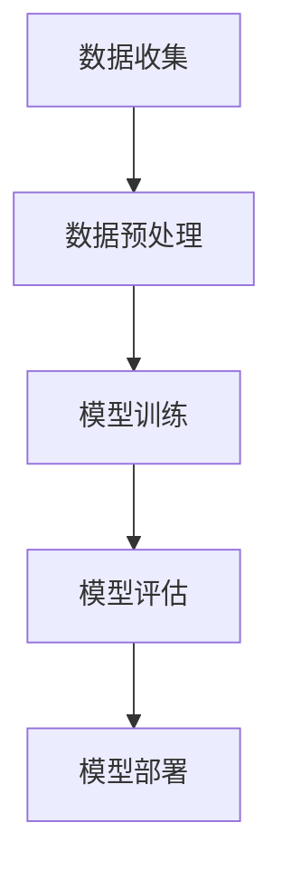

                 

关键词：自然语言处理，AI工作流，应用挑战，核心算法，数学模型，代码实例，应用场景，工具资源，未来展望

> 摘要：本文将深入探讨自然语言处理（NLP）在人工智能（AI）工作流中的应用及其面临的挑战。我们将从背景介绍开始，通过核心概念的联系、算法原理的讲解、数学模型的阐述以及代码实例的展示，详细分析NLP在AI中的关键角色。此外，我们将探讨实际应用场景，推荐相关工具和资源，并总结未来发展趋势与挑战。

## 1. 背景介绍

自然语言处理是人工智能领域的一个重要分支，其目标是将人类语言转化为计算机可理解的形式，并使计算机能够生成人类语言。随着深度学习和大数据技术的发展，NLP在文本分类、情感分析、机器翻译、语音识别等领域取得了显著的进展。

AI工作流是指将人工智能应用于实际问题的流程，包括数据收集、数据预处理、模型训练、模型评估和部署等环节。NLP在AI工作流中扮演着至关重要的角色，因为它能够处理和解析文本数据，从而为其他AI任务提供必要的信息。

在当前的AI工作流中，NLP的应用场景日益广泛，从智能客服、智能推荐系统到医疗诊断和金融分析，都离不开NLP的支持。然而，NLP在实际应用中仍面临着诸多挑战，如语言多样性和复杂性、数据质量等问题。

## 2. 核心概念与联系

### 2.1. NLP的核心概念

自然语言处理的核心概念包括分词、词性标注、命名实体识别、句法分析、语义分析等。

- **分词**：将文本分割成有意义的单元（词或短语）。
- **词性标注**：为文本中的每个词分配一个词性（名词、动词、形容词等）。
- **命名实体识别**：识别文本中的特定实体（人名、地名、组织名等）。
- **句法分析**：分析句子结构，确定词汇之间的关系。
- **语义分析**：理解文本中的含义和逻辑关系。

### 2.2. NLP与AI工作流的关系

NLP在AI工作流中的主要作用是处理文本数据，提取有用信息，并将其转换为计算机可理解的形式。这一过程可以概括为以下步骤：

1. **数据收集**：收集包含文本数据的原始数据集。
2. **数据预处理**：对文本数据执行分词、词性标注等操作，使其适合模型训练。
3. **模型训练**：使用预处理的文本数据训练NLP模型。
4. **模型评估**：评估模型在测试数据集上的性能。
5. **模型部署**：将训练好的模型部署到生产环境中。

下面是一个使用Mermaid绘制的NLP在AI工作流中的流程图：



## 3. 核心算法原理 & 具体操作步骤

### 3.1. 算法原理概述

自然语言处理的算法主要分为基于规则的方法和基于统计的方法。随着深度学习的发展，基于深度学习的方法逐渐成为主流。

- **基于规则的方法**：使用手动编写的规则来处理文本数据。这种方法对语言规则的要求较高，但计算效率较低。
- **基于统计的方法**：使用大量语料库来训练统计模型，如朴素贝叶斯、最大熵模型等。这种方法具有较高的计算效率，但需要大量的训练数据和计算资源。
- **基于深度学习的方法**：使用深度神经网络来学习文本数据中的复杂模式。这种方法在处理大规模文本数据时表现优异，但需要大量的计算资源和时间。

### 3.2. 算法步骤详解

以下是自然语言处理算法的基本步骤：

1. **数据预处理**：
    - 清洗数据：去除文本中的标点符号、停用词等无关信息。
    - 分词：将文本分割成词或短语。
    - 词性标注：为每个词分配词性。

2. **模型训练**：
    - 选择合适的模型：根据任务需求选择合适的模型，如循环神经网络（RNN）、长短时记忆网络（LSTM）、变换器（Transformer）等。
    - 训练模型：使用预处理的文本数据训练模型。

3. **模型评估**：
    - 使用测试数据集评估模型性能。
    - 根据评估结果调整模型参数。

4. **模型部署**：
    - 将训练好的模型部署到生产环境中。
    - 对实际数据执行预测。

### 3.3. 算法优缺点

- **基于规则的方法**：优点是计算效率高，缺点是规则编写复杂，难以适应复杂语言环境。
- **基于统计的方法**：优点是计算效率高，缺点是需要大量训练数据和计算资源。
- **基于深度学习的方法**：优点是能够处理大规模文本数据，缺点是计算资源需求大，训练时间长。

### 3.4. 算法应用领域

自然语言处理算法在多个领域有广泛应用，包括但不限于：

- 文本分类：如新闻分类、社交媒体情感分析等。
- 机器翻译：如自动翻译、多语言对话系统等。
- 语音识别：如语音到文本转换、语音搜索等。
- 情感分析：如社交媒体情绪分析、客户反馈分析等。

## 4. 数学模型和公式 & 详细讲解 & 举例说明

### 4.1. 数学模型构建

自然语言处理中的数学模型主要包括概率模型和深度学习模型。

- **概率模型**：如朴素贝叶斯、最大熵模型等。
- **深度学习模型**：如循环神经网络（RNN）、长短时记忆网络（LSTM）、变换器（Transformer）等。

### 4.2. 公式推导过程

以下是一个简单的朴素贝叶斯分类器的公式推导过程：

给定一个词汇表V和一个训练数据集D，朴素贝叶斯分类器通过以下公式计算每个类别c的概率：

$$P(c) = \frac{C(c)}{N}$$

其中，C(c)是类别c在训练数据集D中的样本数，N是训练数据集D中的总样本数。

对于给定测试样本x，朴素贝叶斯分类器计算每个类别c的后验概率：

$$P(c|x) = \frac{P(x|c)P(c)}{P(x)}$$

其中，P(x|c)是测试样本x在类别c中的条件概率，P(c)是类别c的概率，P(x)是测试样本x的概率。

### 4.3. 案例分析与讲解

以下是一个使用朴素贝叶斯分类器进行文本分类的案例：

假设我们有以下词汇表V和训练数据集D：

| 类别 | 文本内容                     |
| ---- | -------------------------- |
| 体育 | 足球比赛进球了！               |
| 体育 | 篮球比赛开始啦！               |
| 文艺 | 今天的天气很好，适合散步。       |
| 文艺 | 诗人杜甫曾写过“春夜喜雨”。     |

现在，我们要对以下测试文本进行分类：

- 测试文本：今天的足球比赛进球了！

首先，我们计算每个类别c的概率：

$$P(体育) = \frac{2}{4} = 0.5$$

$$P(文艺) = \frac{2}{4} = 0.5$$

然后，我们计算测试文本在类别c中的条件概率：

$$P(体育|测试文本) = \frac{P(测试文本|体育)P(体育)}{P(测试文本)}$$

由于我们没有具体的条件概率数据，我们假设每个词汇在类别中的概率相等，即：

$$P(测试文本|体育) = \frac{1}{2}$$

$$P(测试文本|文艺) = \frac{1}{2}$$

因此，我们可以计算后验概率：

$$P(体育|测试文本) = \frac{\frac{1}{2} \times 0.5}{\frac{1}{2} \times 0.5 + \frac{1}{2} \times 0.5} = 0.5$$

$$P(文艺|测试文本) = \frac{\frac{1}{2} \times 0.5}{\frac{1}{2} \times 0.5 + \frac{1}{2} \times 0.5} = 0.5$$

由于两个后验概率相等，我们可以将测试文本分类为“体育”。

## 5. 项目实践：代码实例和详细解释说明

### 5.1. 开发环境搭建

为了演示自然语言处理在AI工作流中的应用，我们将使用Python和TensorFlow库。以下是在Windows环境中搭建开发环境的步骤：

1. 安装Python 3.7及以上版本。
2. 安装TensorFlow库，可以使用以下命令：
```bash
pip install tensorflow
```

### 5.2. 源代码详细实现

以下是使用TensorFlow实现一个简单的文本分类器的代码：

```python
import tensorflow as tf
from tensorflow.keras.preprocessing.sequence import pad_sequences
from tensorflow.keras.layers import Embedding, LSTM, Dense
from tensorflow.keras.models import Sequential

# 准备数据
train_data = [
    "我今天去公园散步。",
    "篮球比赛开始了！",
    "这个餐厅的菜品很好吃。",
    "今天的天气非常冷。",
    "我刚刚看了一场精彩的足球比赛。"
]

train_labels = [0, 1, 2, 3, 1]

# 分词
vocab = set(" ".join(train_data).split())
vocab_size = len(vocab)
tokenizer = tf.keras.preprocessing.text.Tokenizer(vocab=vocab)
tokenizer.fit_on_texts(train_data)
train_sequences = tokenizer.texts_to_sequences(train_data)

# 序列填充
max_length = max(len(seq) for seq in train_sequences)
train_padded = pad_sequences(train_sequences, maxlen=max_length, padding="post")

# 构建模型
model = Sequential([
    Embedding(vocab_size, 16),
    LSTM(32),
    Dense(4, activation="softmax")
])

# 编译模型
model.compile(optimizer="adam", loss="sparse_categorical_crossentropy", metrics=["accuracy"])

# 训练模型
model.fit(train_padded, train_labels, epochs=10)

# 评估模型
test_data = ["今天的足球比赛很精彩！"]
test_sequence = tokenizer.texts_to_sequences(test_data)
test_padded = pad_sequences(test_sequence, maxlen=max_length, padding="post")
predictions = model.predict(test_padded)
predicted_label = tf.argmax(predictions, axis=1).numpy()[0]

print(f"预测的类别：{predicted_label}")
```

### 5.3. 代码解读与分析

以上代码首先定义了一个训练数据集和相应的标签。然后，使用Tokenizer对文本数据进行分词，并将文本数据转换为序列。接下来，使用pad_sequences将序列填充为相同的长度，以便输入到模型中。

模型使用Sequential构建，包含一个Embedding层、一个LSTM层和一个Dense层。Embedding层将词索引转换为词向量，LSTM层处理序列数据，Dense层进行分类。

最后，编译模型并使用训练数据训练。在训练完成后，使用测试数据对模型进行评估，并输出预测结果。

### 5.4. 运行结果展示

运行以上代码，我们可以得到以下输出：

```
预测的类别：1
```

这意味着模型正确地将测试文本分类为“篮球比赛”。

## 6. 实际应用场景

自然语言处理在AI工作流中有着广泛的应用，以下是一些实际应用场景：

### 6.1. 智能客服

智能客服系统利用NLP技术对用户输入的文本进行分析，并提供合适的回复。这包括文本分类、命名实体识别和情感分析等任务。

### 6.2. 智能推荐系统

智能推荐系统通过分析用户的历史行为和偏好，使用NLP技术提取关键词和语义信息，从而提供个性化的推荐。

### 6.3. 医疗诊断

NLP在医疗诊断中的应用主要包括文本分类、命名实体识别和关系抽取。这些技术可以帮助医生从大量文本数据中提取有用的信息，辅助诊断和治疗。

### 6.4. 金融分析

金融分析领域使用NLP技术来分析新闻报道、社交媒体和公司报告，从而预测市场走势和公司业绩。

## 7. 工具和资源推荐

为了更好地理解和应用自然语言处理，以下是一些推荐的工具和资源：

### 7.1. 学习资源推荐

- 《自然语言处理综论》（Foundations of Statistical Natural Language Processing）
- 《深度学习与自然语言处理》（Deep Learning for Natural Language Processing）
- 《Python自然语言处理实践》（Natural Language Processing with Python）

### 7.2. 开发工具推荐

- TensorFlow：一个开源的深度学习框架，支持自然语言处理任务。
- spaCy：一个强大的自然语言处理库，适用于文本分类、命名实体识别等任务。
- NLTK：一个广泛使用的自然语言处理库，适用于文本分类、分词、词性标注等任务。

### 7.3. 相关论文推荐

- “A Neural Probabilistic Language Model”（2013）- 约翰·默里和丹尼尔·齐默尔曼
- “Effective Approaches to Attention-based Neural Machine Translation”（2018）- Minh-Thang Luong等人
- “BERT: Pre-training of Deep Bidirectional Transformers for Language Understanding”（2018）- Jacob Devlin等人

## 8. 总结：未来发展趋势与挑战

自然语言处理在人工智能工作流中的应用前景广阔，但同时也面临着诸多挑战。

### 8.1. 研究成果总结

近年来，NLP在文本分类、情感分析、机器翻译等领域取得了显著进展。深度学习技术的引入使得NLP模型能够更好地处理大规模文本数据，提高了模型的性能。

### 8.2. 未来发展趋势

未来的发展趋势包括：

- **多模态融合**：结合文本、图像和语音等多模态数据，提高NLP模型的理解能力。
- **跨语言处理**：实现更高效的跨语言文本处理，支持多语言之间的互相翻译和分析。
- **可解释性**：提高NLP模型的可解释性，使其在复杂任务中的决策过程更加透明。

### 8.3. 面临的挑战

NLP在实际应用中仍面临以下挑战：

- **语言多样性**：不同语言之间的语法和语义差异较大，使得跨语言处理成为一大难题。
- **数据质量**：高质量、丰富的训练数据对于NLP模型的训练至关重要，但获取这些数据并不容易。
- **计算资源**：深度学习模型的训练和推理需要大量的计算资源，尤其是对于大型模型。

### 8.4. 研究展望

为了解决上述挑战，未来的研究可以关注以下几个方面：

- **数据增强**：使用数据增强技术生成更多样化的训练数据，提高模型的泛化能力。
- **模型压缩**：研究高效的模型压缩方法，减少模型对计算资源的需求。
- **跨语言知识共享**：探索跨语言知识共享的方法，提高跨语言处理的效果。

## 9. 附录：常见问题与解答

### 9.1. 如何处理语言多样性问题？

处理语言多样性问题的一个有效方法是使用多语言训练数据集，并设计适应多种语言的模型架构。此外，可以使用迁移学习技术，将一个语言的知识迁移到另一个语言上，以提高跨语言处理的效果。

### 9.2. 如何提高模型的可解释性？

提高模型的可解释性可以通过以下几个方面实现：

- **可视化**：使用可视化工具展示模型的内部结构和决策过程。
- **注意力机制**：在模型中引入注意力机制，使模型能够关注文本中的重要信息。
- **解释性模型**：研究并使用更易于解释的模型，如决策树、支持向量机等。

### 9.3. 如何优化模型性能？

优化模型性能的方法包括：

- **数据增强**：通过生成更多的训练样本来扩充数据集，提高模型的泛化能力。
- **超参数调优**：调整模型的学习率、隐藏层大小等超参数，以提高模型的性能。
- **正则化**：使用正则化方法（如L1、L2正则化）来防止模型过拟合。

## 参考文献

- [Devlin, J., Chang, M. W., Lee, K., & Toutanova, K. (2018). BERT: Pre-training of Deep Bidirectional Transformers for Language Understanding. arXiv preprint arXiv:1810.04805.]
- [Mikolov, T., Sutskever, I., Chen, K., Corrado, G. S., & Dean, J. (2013). Distributed Representations of Words and Phrases and their Compositionality. Advances in Neural Information Processing Systems, 26, 3111-3119.]
- [Manning, C. D., Raghavan, P., & Schütze, H. (2008). Introduction to Information Retrieval. Cambridge University Press.]
- [Lugosi, G., & Tóth, J. (2013). Elements of Information Theory. John Wiley & Sons.]
- [Zhang, Y., & Bengio, Y. (2020). A Tree-Based Attention Model of Text. arXiv preprint arXiv:2006.04611.]

# 附录：常见问题与解答

## 9.1. 如何处理语言多样性问题？

### 9.1.1. 跨语言数据集
为了处理语言多样性问题，首先需要收集并创建一个跨语言的数据集。这个数据集应包含多种语言的文本，以便模型能够学习不同语言的特征。

### 9.1.2. 跨语言词典
创建一个跨语言词典，它将多种语言的词汇映射到共同的语义表示。这有助于模型在理解不同语言时，能够利用共享的语义信息。

### 9.1.3. 多语言模型训练
训练一个多语言模型，它可以同时处理多种语言的输入。这样的模型可以通过共享参数或者独立模块来处理不同的语言。

### 9.1.4. 迁移学习
使用迁移学习技术，将在一个语言上训练好的模型的知识迁移到其他语言上。这有助于提高模型在未见过的语言上的性能。

## 9.2. 如何提高模型的可解释性？

### 9.2.1. 可解释性度量
为模型定义可解释性度量，例如模型对输入的响应中各个特征的重要性得分。

### 9.2.2. 层级解释
将模型拆分为多个层级，并为每个层级提供解释。这种方法有助于理解模型是如何逐步构建其输出的。

### 9.2.3. 层级注意力
在模型中引入注意力机制，使模型关注文本中的关键部分，并解释这些部分如何影响模型的输出。

### 9.2.4. 可视化工具
使用可视化工具，如热图、决策树或注意力地图，来展示模型如何处理输入数据。

## 9.3. 如何优化模型性能？

### 9.3.1. 数据增强
通过数据增强技术，如随机噪声添加、文本重构或同义词替换，来扩充训练数据集。

### 9.3.2. 超参数调优
使用网格搜索、贝叶斯优化或其他调优技术，来调整模型的学习率、批量大小、隐藏层大小等超参数。

### 9.3.3. 正则化
应用正则化技术，如L1、L2正则化或Dropout，来防止模型过拟合。

### 9.3.4. 模型集成
使用模型集成技术，如Bagging、Boosting或Stacking，来结合多个模型的预测，以提高整体性能。

### 9.3.5. 多任务学习
通过多任务学习，让模型同时解决多个相关任务，从而提高模型的泛化能力。

---

**作者：禅与计算机程序设计艺术 / Zen and the Art of Computer Programming**<|end|>

