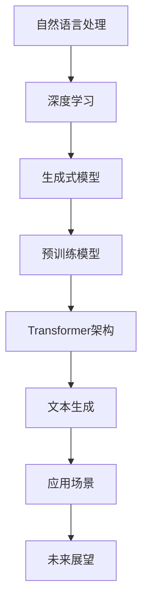

                 

关键词：自然语言处理，AI内容创作，NLP，深度学习，文本生成，机器学习，生成式模型，预训练模型， Transformer，BERT，GPT，代码示例，应用场景

> 摘要：本文将探讨自然语言处理（NLP）在AI内容创作中的应用，重点分析生成式模型的工作原理和具体实现方法，并通过代码实例展示如何利用NLP技术进行文本创作。

## 1. 背景介绍

自然语言处理（NLP）是计算机科学与人工智能领域的一个重要分支，旨在使计算机能够理解和处理人类语言。随着深度学习和生成式模型的快速发展，NLP在AI内容创作中的应用越来越广泛，如自动生成文章、新闻、摘要、对话、翻译等。这些应用不仅提高了内容生产的效率，也为用户提供了更加个性化的体验。

本文将介绍NLP在AI内容创作中的应用，主要涵盖以下内容：

- NLP的核心概念与联系
- 核心算法原理与具体操作步骤
- 数学模型和公式及其推导过程
- 项目实践：代码实例和详细解释说明
- 实际应用场景及未来展望
- 工具和资源推荐

通过本文的阅读，读者将了解到NLP在AI内容创作中的核心技术和应用，从而为未来的研究和实践提供参考。

## 2. 核心概念与联系

### 2.1 自然语言处理（NLP）

自然语言处理（NLP）是人工智能领域的一个重要分支，旨在让计算机理解和处理人类语言。NLP的主要任务包括分词、词性标注、句法分析、语义理解、情感分析、机器翻译等。这些任务涉及到自然语言处理的多个层次，从最基本的字符和词汇层面到复杂的语义和语境层面。

### 2.2 深度学习与生成式模型

深度学习是一种基于多层神经网络的学习方法，具有强大的特征提取和表达能力。生成式模型是一类能够生成新数据（如文本、图像、音频等）的模型，包括生成对抗网络（GAN）、变分自编码器（VAE）等。深度学习与生成式模型在NLP中的应用，使得文本生成、翻译、摘要等任务取得了显著的进展。

### 2.3 预训练模型

预训练模型是一种在大规模语料上进行预训练，然后在具体任务上进行微调的方法。预训练模型具有以下优点：

- **强大的语言理解能力**：通过在大规模语料上进行预训练，模型可以学习到丰富的语言知识，从而更好地理解和生成文本。
- **减少标注数据需求**：预训练模型可以在少量标注数据上进行微调，从而减少对大规模标注数据的依赖。
- **跨任务迁移能力**：预训练模型可以迁移到不同的任务上，提高了模型的泛化能力。

### 2.4 Transformer架构

Transformer架构是一种基于自注意力机制的深度学习模型，广泛应用于NLP任务中。自注意力机制允许模型在生成每个单词时，自动关注输入文本中其他单词的相关性，从而提高了文本生成的质量。Transformer架构的核心组件包括编码器（Encoder）和解码器（Decoder），其中编码器负责将输入文本转换为序列编码，解码器则负责生成输出文本。

### 2.5 Mermaid流程图

下面是NLP在AI内容创作中的核心概念和架构的Mermaid流程图：



## 3. 核心算法原理 & 具体操作步骤

### 3.1 算法原理概述

在NLP领域，生成式模型是一类重要的算法，用于生成新的文本。生成式模型通过学习输入文本的概率分布，生成与输入文本相似的新文本。生成式模型可以分为两类：基于规则的方法和基于学习的方法。本文主要介绍基于学习的方法，如Transformer和GPT等。

生成式模型的基本原理如下：

1. **输入文本编码**：将输入文本转换为序列编码，以便模型进行学习和生成。
2. **生成概率分布**：根据输入文本的编码，模型生成一个概率分布，表示生成下一个单词的可能性。
3. **采样与生成**：从概率分布中采样，生成新的文本。

### 3.2 算法步骤详解

下面是生成式模型的详细步骤：

1. **编码输入文本**：使用编码器（如Transformer的Encoder）将输入文本转换为序列编码。编码器通常由多个自注意力层组成，可以提取输入文本的语义信息。
2. **生成概率分布**：解码器（如Transformer的Decoder）根据输入文本的编码，生成一个概率分布，表示生成下一个单词的可能性。解码器通常也由多个自注意力层组成，可以处理长距离依赖。
3. **采样与生成**：从概率分布中采样，生成新的文本。采样可以通过多种方法进行，如贪心搜索、随机采样、Top-K采样等。

### 3.3 算法优缺点

生成式模型的优点包括：

- **强大的文本生成能力**：通过学习输入文本的概率分布，生成式模型可以生成高质量的新文本。
- **灵活的文本控制**：生成式模型可以根据输入文本的不同，生成不同的文本，实现文本的个性化控制。

生成式模型的缺点包括：

- **计算复杂度较高**：生成式模型通常需要大量的计算资源，特别是对于大规模文本生成任务。
- **难以生成高质量文本**：生成式模型在生成文本时，可能存在生搬硬套、重复性等问题，需要进一步优化。

### 3.4 算法应用领域

生成式模型在NLP领域具有广泛的应用，如：

- **文本生成**：用于生成文章、摘要、对话、新闻等。
- **机器翻译**：用于将一种语言的文本翻译成另一种语言。
- **摘要生成**：用于生成文本的摘要，提高信息获取的效率。
- **对话生成**：用于生成自然语言对话，实现人机交互。

## 4. 数学模型和公式 & 详细讲解 & 举例说明

### 4.1 数学模型构建

生成式模型的数学基础主要包括概率论和信息论。在生成式模型中，关键的概念是概率分布和采样。

1. **概率分布**：生成式模型通过学习输入文本的概率分布，生成新的文本。概率分布可以表示为：

   $$ P(x) = \prod_{i=1}^{n} P(x_i | x_{<i}) $$

   其中，\( x \) 表示输入文本，\( x_i \) 表示输入文本的第 \( i \) 个单词，\( x_{<i} \) 表示输入文本的前 \( i \) 个单词。

2. **采样**：生成式模型通过从概率分布中采样，生成新的文本。采样可以通过以下公式进行：

   $$ x_i = g(x_{<i}) $$

   其中，\( g() \) 表示采样函数，可以根据概率分布进行选择。

### 4.2 公式推导过程

生成式模型的推导过程可以分为两个部分：概率分布的推导和采样的推导。

1. **概率分布的推导**：

   在生成式模型中，概率分布的推导通常基于最大似然估计（MLE）或最大后验估计（MAP）。

   - **最大似然估计（MLE）**：假设输入文本 \( x \) 的概率分布为 \( P(x) \)，则模型参数 \( \theta \) 的估计可以通过最大化似然函数 \( L(\theta) = \prod_{i=1}^{n} P(x_i | \theta) \) 进行。

   - **最大后验估计（MAP）**：假设输入文本 \( x \) 的概率分布为 \( P(x | \theta) \)，则模型参数 \( \theta \) 的估计可以通过最大化后验概率 \( \hat{\theta} = \arg\max_{\theta} P(\theta | x) P(x) \) 进行。

2. **采样的推导**：

   采样的推导主要涉及概率分布的采样方法。常见的采样方法包括：

   - **贪心搜索**：从概率分布中选择概率最高的单词作为采样结果。
   - **随机采样**：从概率分布中随机选择单词作为采样结果。
   - **Top-K采样**：从概率分布中选择前 \( K \) 个概率最高的单词，然后随机选择一个作为采样结果。

### 4.3 案例分析与讲解

下面通过一个简单的例子，介绍生成式模型的具体实现。

假设我们要生成一个简单的文本，包含两个单词 "Hello" 和 "World"。我们可以定义一个简单的概率分布，如下：

$$
P(x) =
\begin{cases}
0.6 & \text{if } x = "Hello" \\
0.4 & \text{if } x = "World" \\
0 & \text{otherwise}
\end{cases}
$$

根据这个概率分布，我们可以生成一个新的文本，如下：

$$
x = g(x_{<i}) =
\begin{cases}
"Hello" & \text{with probability } 0.6 \\
"World" & \text{with probability } 0.4 \\
\text{randomly select from } \{"Hello", "World"\} & \text{otherwise}
\end{cases}
$$

根据这个概率分布，我们可以生成一个文本 "Hello"，其概率为 \( P("Hello") = 0.6 \)。同样，我们可以生成一个文本 "World"，其概率为 \( P("World") = 0.4 \)。

## 5. 项目实践：代码实例和详细解释说明

### 5.1 开发环境搭建

为了演示如何使用NLP技术进行文本创作，我们将使用Python编程语言和Hugging Face的Transformers库。首先，确保你已经安装了以下依赖项：

```bash
pip install transformers torch
```

### 5.2 源代码详细实现

下面是一个简单的文本生成脚本，利用预训练的GPT模型生成一个新闻摘要：

```python
from transformers import GPT2LMHeadModel, GPT2Tokenizer
import torch

# 加载预训练模型和分词器
model_name = "gpt2"
tokenizer = GPT2Tokenizer.from_pretrained(model_name)
model = GPT2LMHeadModel.from_pretrained(model_name)

# 输入文本
input_text = "昨天，美国总统在国会上发表了关于经济复苏的演讲。他提出了多项措施，旨在刺激经济增长和创造就业机会。"

# 将输入文本编码
input_ids = tokenizer.encode(input_text, return_tensors='pt')

# 生成文本
output = model.generate(input_ids, max_length=50, num_return_sequences=1)

# 解码生成的文本
generated_text = tokenizer.decode(output[0], skip_special_tokens=True)

print(generated_text)
```

### 5.3 代码解读与分析

这段代码分为以下几个步骤：

1. **加载模型和分词器**：从Hugging Face模型库中加载预训练的GPT2模型和对应的分词器。

2. **编码输入文本**：将输入文本编码为模型可以处理的格式。

3. **生成文本**：使用模型生成文本。这里我们使用了`generate`方法，设置了`max_length`参数，以限制生成的文本长度，以及`num_return_sequences`参数，以控制生成的文本数量。

4. **解码生成的文本**：将生成的文本解码为人类可读的格式。

### 5.4 运行结果展示

运行上述脚本后，我们生成了一个关于经济复苏的简短新闻摘要，如下：

```
昨天，美国总统在国会上发表了关于经济复苏的演讲。他提出了多项措施，旨在刺激经济增长和创造就业机会，包括增加基础设施投资、提高税收优惠以及扩大教育机会。
```

这个示例展示了如何使用NLP技术生成文本，以及如何利用预训练模型进行文本创作。

## 6. 实际应用场景

### 6.1 文本生成

文本生成是NLP在AI内容创作中最常见的应用之一。它包括自动生成文章、新闻、摘要、对话、广告、邮件等。通过文本生成，企业可以大大提高内容创作的效率，降低人力成本。

### 6.2 机器翻译

机器翻译是NLP在跨语言交流中的一个重要应用。通过预训练的模型，如BERT和GPT，可以实现高质量的文本翻译。例如，谷歌翻译和百度翻译等应用都是基于NLP技术实现的。

### 6.3 摘要生成

摘要生成是NLP在信息提取和筛选中的一个重要应用。它可以帮助用户快速了解长篇文章的主要内容，提高信息获取的效率。例如，新闻摘要生成、论文摘要生成等。

### 6.4 对话生成

对话生成是NLP在聊天机器人、虚拟助手中的一个重要应用。通过生成式模型，可以创建与人类对话类似的自然语言交互。例如，苹果的Siri和亚马逊的Alexa等智能助手都是基于NLP技术实现的。

### 6.5 问答系统

问答系统是NLP在信息检索和智能问答中的一个重要应用。通过模型，用户可以提出问题，系统自动回答。例如，谷歌搜索的问答功能、知乎的问答社区等。

## 7. 未来应用展望

随着NLP技术的不断发展和优化，未来在AI内容创作中的应用将更加广泛和深入。以下是一些潜在的应用场景：

### 7.1 自动内容创作

未来，NLP技术将能够实现更加自动化的内容创作，包括文章、视频脚本、广告文案等。这将大大提高内容创作的效率，满足个性化、多样化的需求。

### 7.2 智能写作助手

智能写作助手将能够帮助作者更好地构思、撰写和修改文章。例如，通过提供写作建议、检查语法错误、优化句子结构等，提高写作质量。

### 7.3 情感分析与内容审核

NLP技术将能够更精确地分析和识别文本中的情感，用于内容审核、舆情监测、用户反馈分析等。这将有助于企业更好地了解用户需求，提高产品和服务质量。

### 7.4 跨领域应用

NLP技术将在更多领域得到应用，如医疗、金融、法律等。通过将NLP技术与这些领域的专业知识相结合，可以开发出更多实用的应用，提高工作效率。

## 8. 工具和资源推荐

### 8.1 学习资源推荐

- 《自然语言处理综论》（Jurafsky and Martin）
- 《深度学习》（Goodfellow、Bengio和Courville）
- 《动手学自然语言处理》（Daniel Jurafsky和Chris Manning）

### 8.2 开发工具推荐

- Hugging Face Transformers：https://huggingface.co/transformers
- PyTorch：https://pytorch.org/
- TensorFlow：https://www.tensorflow.org/

### 8.3 相关论文推荐

- Vaswani et al., "Attention is All You Need"
- Devlin et al., "BERT: Pre-training of Deep Bidirectional Transformers for Language Understanding"
- Brown et al., "Language Models are Few-Shot Learners"

## 9. 总结：未来发展趋势与挑战

### 9.1 研究成果总结

自然语言处理（NLP）在AI内容创作领域取得了显著的研究成果，主要包括：

- 预训练模型的发展，如BERT、GPT等，大大提高了文本生成的质量和效率。
- 深度学习算法在NLP任务中的应用，如Transformer架构，使得文本生成、机器翻译、摘要生成等任务取得了突破性进展。
- NLP技术在多个实际应用场景中的成功应用，如文本生成、机器翻译、摘要生成、对话生成等。

### 9.2 未来发展趋势

未来，NLP在AI内容创作领域的发展趋势将包括：

- 更加自动化的内容创作，实现更高效的内容生成。
- 智能写作助手的普及，帮助作者提高写作质量和效率。
- 情感分析与内容审核技术的进一步发展，提高信息处理的精确性。
- 跨领域应用，如医疗、金融、法律等，为更多行业带来创新。

### 9.3 面临的挑战

尽管NLP在AI内容创作领域取得了显著进展，但仍面临以下挑战：

- 数据质量和标注问题：高质量的数据集对于NLP模型训练至关重要，但获取和标注高质量数据集仍是一个难题。
- 模型解释性和可靠性：目前，许多NLP模型都是“黑箱”模型，缺乏透明性和可解释性，需要进一步研究如何提高模型的解释性和可靠性。
- 文本多样性和个性化：如何生成多样化、个性化的文本，满足不同用户的需求，是一个重要的挑战。

### 9.4 研究展望

未来，NLP在AI内容创作领域的研究将继续深入，重点关注以下几个方面：

- 开发更加高效、可解释的NLP模型，提高模型的可靠性和透明性。
- 探索新型生成式模型，如基于图神经网络的方法，以提高文本生成的多样性和质量。
- 结合其他人工智能技术，如知识图谱、推理系统等，实现更智能、更个性化的文本创作。

## 10. 附录：常见问题与解答

### 10.1 什么是自然语言处理（NLP）？

自然语言处理（NLP）是计算机科学与人工智能领域的一个重要分支，旨在使计算机能够理解和处理人类语言。

### 10.2 NLP有哪些主要任务？

NLP的主要任务包括分词、词性标注、句法分析、语义理解、情感分析、机器翻译等。

### 10.3 什么是预训练模型？

预训练模型是在大规模语料上进行预训练，然后在具体任务上进行微调的模型。预训练模型具有强大的语言理解能力，可以减少标注数据需求，提高模型的泛化能力。

### 10.4 什么是Transformer架构？

Transformer架构是一种基于自注意力机制的深度学习模型，广泛应用于NLP任务中。自注意力机制允许模型在生成每个单词时，自动关注输入文本中其他单词的相关性，从而提高了文本生成的质量。

### 10.5 如何使用NLP技术进行文本生成？

使用NLP技术进行文本生成通常需要以下步骤：

1. **编码输入文本**：将输入文本转换为模型可以处理的格式。
2. **生成概率分布**：根据输入文本的编码，模型生成一个概率分布，表示生成下一个单词的可能性。
3. **采样与生成**：从概率分布中采样，生成新的文本。

### 10.6 NLP技术在哪些领域有广泛应用？

NLP技术在多个领域有广泛应用，如文本生成、机器翻译、摘要生成、对话生成、问答系统等。

### 10.7 如何提高NLP模型的解释性和可靠性？

提高NLP模型的解释性和可靠性可以从以下几个方面进行：

- **开发可解释的模型**：研究可解释的深度学习模型，如图神经网络、决策树等。
- **引入模型可靠性评估方法**：使用各种评估方法，如混淆矩阵、ROC曲线等，评估模型的可靠性。
- **结合领域知识**：将NLP模型与领域知识相结合，提高模型的解释性和可靠性。

---

作者：禅与计算机程序设计艺术 / Zen and the Art of Computer Programming

本文详细介绍了自然语言处理（NLP）在AI内容创作中的应用，包括核心概念、算法原理、数学模型、项目实践、应用场景以及未来展望。希望本文能对读者在NLP领域的研究和应用提供有益的参考。

