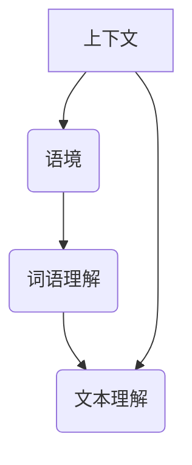

                 

关键词：自然语言处理、上下文、语境、NLP、深度学习、语义理解、机器学习、神经网络、语言模型、人工智能。

## 摘要

本文旨在探讨自然语言处理（NLP）领域中的最新研究进展，重点关注上下文和语境在理解自然语言中的关键作用。随着深度学习技术的发展，NLP已经取得了显著的进步，但如何准确理解文本中的上下文和语境仍是一个极具挑战性的问题。本文首先介绍了上下文和语境的基本概念，然后深入探讨了在NLP中理解上下文和语境的关键算法和模型，包括词向量模型、序列模型、注意力机制、预训练模型等。接着，我们通过实际应用案例展示了这些算法和模型在不同场景下的应用效果。最后，我们对未来NLP的发展趋势和挑战进行了展望，并推荐了一些相关学习资源和开发工具。

## 1. 背景介绍

自然语言处理（NLP）作为人工智能（AI）的重要分支，旨在使计算机能够理解、生成和处理自然语言。从最初的规则驱动方法到现在的深度学习模型，NLP技术经历了巨大的变革。早期NLP研究主要集中在语法分析和词汇语义分析等方面，但随着互联网的普及和大数据技术的发展，NLP的应用场景变得更加广泛，包括机器翻译、情感分析、问答系统、文本摘要等。

然而，在NLP领域，理解上下文和语境一直是一个难题。上下文指的是文本中的局部环境，能够影响词语意义的理解；语境则更广泛，包括文本所在的对话、背景知识和社会文化因素等。准确理解上下文和语境对于提高NLP系统的性能至关重要。例如，在问答系统中，如果无法准确理解用户的问题背景，那么回答就可能失准。同样，在机器翻译中，如果上下文理解不准确，翻译结果就可能出现语义偏差。

本文将首先介绍上下文和语境的基本概念，然后探讨NLP中常用的算法和模型，以及如何利用这些算法和模型来提高上下文和语境理解的能力。最后，我们将通过实际应用案例展示这些算法和模型的应用效果，并对未来NLP的发展趋势和挑战进行展望。

## 2. 核心概念与联系

### 2.1 上下文和语境的概念

**上下文（Context）**：上下文是指文本中的局部环境，包括词语周围的词语、句子结构等。上下文能够影响词语意义的理解，例如，同一个词在不同的上下文中可以有不同的含义。例如，“bank”在“river bank”中表示河流的岸边，而在“bank account”中表示银行账户。

**语境（Context）**：语境则是一个更广泛的概念，它不仅包括上下文，还涉及到文本所在的对话、背景知识和社会文化因素等。语境可以帮助我们更好地理解文本的整体含义。例如，在对话中，一个词语的含义可能会因为上下文的不同而发生变化。

### 2.2 Mermaid流程图：上下文和语境的关系



### 2.3 上下文和语境在NLP中的作用

上下文和语境在NLP中起着至关重要的作用。首先，它们能够帮助我们更准确地理解文本的含义，特别是在处理歧义问题时。其次，上下文和语境对于语言生成任务也非常重要，例如在生成自然流畅的对话或文本摘要时。最后，上下文和语境的理解能力也是评估NLP系统性能的重要指标。

### 2.4 上下文和语境的理解方法

在NLP中，理解上下文和语境的方法主要包括以下几种：

1. **词向量模型**：通过将词语映射到高维空间中的向量，从而实现词语意义的理解和计算。
2. **序列模型**：通过处理文本中的词语序列，实现对上下文的理解。
3. **注意力机制**：在处理文本时，注意力机制能够帮助模型关注重要的信息，从而提高上下文理解的能力。
4. **预训练模型**：通过在大量无监督数据上进行预训练，使模型能够自动学习上下文和语境的特征。

## 3. 核心算法原理 & 具体操作步骤

### 3.1 算法原理概述

在NLP中，理解上下文和语境的核心算法包括词向量模型、序列模型、注意力机制和预训练模型。这些算法通过不同的方式处理文本数据，从而实现对上下文和语境的理解。

#### 3.1.1 词向量模型

词向量模型是一种将词语映射到高维空间中的向量表示方法。通过这种方式，词向量可以捕获词语的语义信息。常见的词向量模型包括Word2Vec、GloVe等。

#### 3.1.2 序列模型

序列模型通过处理文本中的词语序列，实现对上下文的理解。常见的序列模型包括循环神经网络（RNN）、长短期记忆网络（LSTM）等。

#### 3.1.3 注意力机制

注意力机制是一种在处理文本时，能够帮助模型关注重要信息的机制。通过注意力机制，模型可以动态调整对文本中每个词语的关注程度，从而提高上下文理解的能力。

#### 3.1.4 预训练模型

预训练模型是一种通过在大量无监督数据上进行预训练，使模型能够自动学习上下文和语境特征的模型。常见的预训练模型包括BERT、GPT等。

### 3.2 算法步骤详解

#### 3.2.1 词向量模型

1. **数据预处理**：对文本进行分词、去停用词等处理。
2. **词语编码**：将词语映射到高维空间中的向量。
3. **训练模型**：使用训练数据训练词向量模型。
4. **模型评估**：使用测试数据评估模型性能。

#### 3.2.2 序列模型

1. **数据预处理**：对文本进行分词、去停用词等处理。
2. **序列编码**：将文本序列编码为向量。
3. **训练模型**：使用训练数据训练序列模型。
4. **模型评估**：使用测试数据评估模型性能。

#### 3.2.3 注意力机制

1. **数据预处理**：对文本进行分词、去停用词等处理。
2. **序列编码**：将文本序列编码为向量。
3. **构建模型**：在模型中加入注意力机制。
4. **训练模型**：使用训练数据训练模型。
5. **模型评估**：使用测试数据评估模型性能。

#### 3.2.4 预训练模型

1. **数据预处理**：对文本进行分词、去停用词等处理。
2. **预训练**：在大量无监督数据上进行预训练。
3. **微调**：在特定任务上对预训练模型进行微调。
4. **模型评估**：使用测试数据评估模型性能。

### 3.3 算法优缺点

#### 3.3.1 词向量模型

**优点**：

- **高效**：通过将词语映射到向量，可以快速进行计算。
- **易于扩展**：可以方便地用于各种NLP任务。

**缺点**：

- **语义表示不精确**：词向量模型对词语的语义表示有限，难以捕捉到复杂的语义信息。
- **上下文理解不足**：词向量模型在处理长文本时，容易丢失上下文信息。

#### 3.3.2 序列模型

**优点**：

- **上下文理解能力较强**：序列模型能够处理长文本，捕捉到文本中的上下文信息。
- **适用于各种NLP任务**：如文本分类、命名实体识别等。

**缺点**：

- **计算复杂度高**：序列模型的计算复杂度较高，训练时间较长。
- **难以处理长文本**：在处理长文本时，序列模型容易出现梯度消失或爆炸问题。

#### 3.3.3 注意力机制

**优点**：

- **关注关键信息**：注意力机制可以帮助模型关注文本中的关键信息，提高上下文理解能力。
- **适用于各种NLP任务**：如机器翻译、问答系统等。

**缺点**：

- **计算复杂度高**：注意力机制的引入增加了模型的计算复杂度。
- **难以处理长文本**：在处理长文本时，注意力机制的效果可能下降。

#### 3.3.4 预训练模型

**优点**：

- **强大的上下文理解能力**：预训练模型通过在大量无监督数据上预训练，能够自动学习上下文和语境特征。
- **适用于各种NLP任务**：预训练模型可以轻松地用于各种NLP任务，如文本分类、命名实体识别等。

**缺点**：

- **需要大量数据**：预训练模型需要大量无监督数据进行预训练，数据获取和预处理成本较高。
- **模型复杂度高**：预训练模型通常比较复杂，训练时间较长。

### 3.4 算法应用领域

词向量模型、序列模型、注意力机制和预训练模型在NLP的多个领域都有广泛应用。

#### 3.4.1 机器翻译

机器翻译是一个典型的NLP应用领域。词向量模型和序列模型在机器翻译中用于编码源语言和目标语言的文本，注意力机制则用于捕捉源语言和目标语言之间的上下文关系。

#### 3.4.2 文本分类

文本分类是另一个重要的NLP应用领域。词向量模型和预训练模型可以用于文本的语义表示，序列模型和注意力机制可以用于文本分类任务。

#### 3.4.3 命名实体识别

命名实体识别用于识别文本中的命名实体，如人名、地名、组织名等。词向量模型和序列模型可以用于编码文本，注意力机制可以用于关注文本中的关键信息。

#### 3.4.4 问答系统

问答系统是一个旨在回答用户问题的系统。词向量模型和预训练模型可以用于理解用户的问题，序列模型和注意力机制可以用于生成回答。

## 4. 数学模型和公式 & 详细讲解 & 举例说明

在NLP中，理解上下文和语境的核心算法往往涉及到复杂的数学模型和公式。本节将介绍一些常见的数学模型和公式，并详细讲解它们的推导过程，并通过实际案例进行说明。

### 4.1 数学模型构建

在NLP中，常见的数学模型包括词向量模型、序列模型、注意力机制和预训练模型。以下是对这些模型的基本数学描述：

#### 4.1.1 词向量模型

词向量模型通常基于神经网络，将词语映射到高维空间中的向量。一个简单的词向量模型可以表示为：

$$
\text{vec}(w) = \text{W} \cdot \text{softmax}(\text{U} \cdot \text{emb}(w))
$$

其中，$\text{emb}(w)$ 是词语 $w$ 的嵌入向量，$\text{U}$ 是单词到向量空间的映射矩阵，$\text{W}$ 是一个权重矩阵，$\text{softmax}$ 函数用于将输入向量转换为一个概率分布。

#### 4.1.2 序列模型

序列模型，如循环神经网络（RNN）和长短期记忆网络（LSTM），用于处理序列数据。一个简单的RNN模型可以表示为：

$$
\text{h}_t = \text{f}(\text{h}_{t-1}, \text{x}_t)
$$

其中，$\text{h}_t$ 是在时间步 $t$ 的隐藏状态，$\text{x}_t$ 是在时间步 $t$ 的输入，$\text{f}$ 是一个非线性激活函数。

#### 4.1.3 注意力机制

注意力机制用于在处理文本时，关注重要的信息。一个简单的注意力模型可以表示为：

$$
\alpha_t = \text{softmax}(\text{W}_a \cdot \text{h}_t)
$$

$$
\text{h}_t' = \sum_{i=1}^{N} \alpha_i \cdot \text{h}_i
$$

其中，$\text{h}_t$ 是在时间步 $t$ 的隐藏状态，$\text{W}_a$ 是注意力权重矩阵，$\alpha_t$ 是在时间步 $t$ 的注意力权重，$\text{h}_t'$ 是加权后的隐藏状态。

#### 4.1.4 预训练模型

预训练模型通常基于大规模无监督数据，通过自监督学习来预训练模型。一个简单的预训练模型可以表示为：

$$
\text{L} = -\sum_{w \in \text{vocab}} p(w) \cdot \log p(\text{emb}(w))
$$

其中，$p(w)$ 是词语 $w$ 的概率，$\text{emb}(w)$ 是词语 $w$ 的嵌入向量。

### 4.2 公式推导过程

以下是上述数学模型公式的详细推导过程：

#### 4.2.1 词向量模型

词向量模型的推导主要涉及词嵌入向量和softmax函数。词嵌入向量通常通过训练学习得到。而softmax函数的推导过程如下：

$$
p(\text{word}_i) = \frac{e^{\text{U} \cdot \text{emb}(\text{word}_i)}}{\sum_{j=1}^{V} e^{\text{U} \cdot \text{emb}(\text{word}_j)}}
$$

其中，$V$ 是词汇表大小，$\text{U}$ 是单词到向量空间的映射矩阵。

#### 4.2.2 序列模型

RNN的推导过程如下：

$$
\text{h}_t = \sigma(\text{W}_h \cdot \text{h}_{t-1} + \text{U}_h \cdot \text{x}_t + \text{b}_h)
$$

其中，$\sigma$ 是非线性激活函数，如tanh函数，$\text{W}_h$ 和 $\text{U}_h$ 是权重矩阵，$\text{b}_h$ 是偏置。

#### 4.2.3 注意力机制

注意力机制的推导过程如下：

$$
\alpha_t = \frac{e^{z_t}}{\sum_{i=1}^{N} e^{z_i}}
$$

$$
z_t = \text{a}(\text{W}_a \cdot \text{h}_t + \text{b}_a)
$$

其中，$\text{W}_a$ 是注意力权重矩阵，$\text{b}_a$ 是偏置，$\text{a}$ 是非线性激活函数。

#### 4.2.4 预训练模型

预训练模型的推导过程基于自监督学习。假设我们有一个文本序列 $w_1, w_2, \ldots, w_T$，预训练目标是最小化以下损失函数：

$$
\text{L} = -\sum_{w \in \text{vocab}} p(w) \cdot \log p(\text{emb}(w))
$$

其中，$p(w)$ 是词语 $w$ 的概率，$\text{emb}(w)$ 是词语 $w$ 的嵌入向量。

### 4.3 案例分析与讲解

以下是通过上述数学模型进行NLP任务的实际案例：

#### 4.3.1 词向量模型案例

**任务**：文本分类

**模型**：Word2Vec模型

**数据**：假设我们有一个文本数据集，其中每个文本都是二分类标签。

**步骤**：

1. **数据预处理**：对文本进行分词和去停用词处理。
2. **构建词汇表**：将所有文本中的词语构建为一个词汇表。
3. **训练词向量**：使用训练数据训练Word2Vec模型。
4. **文本编码**：将每个文本编码为词向量的平均值。
5. **模型训练**：使用训练数据训练文本分类模型，例如SVM。
6. **模型评估**：使用测试数据评估模型性能。

#### 4.3.2 序列模型案例

**任务**：命名实体识别

**模型**：LSTM模型

**数据**：假设我们有一个命名实体识别数据集，其中每个词语都被标注为实体或非实体。

**步骤**：

1. **数据预处理**：对文本进行分词和去停用词处理。
2. **构建词汇表**：将所有文本中的词语构建为一个词汇表。
3. **序列编码**：将每个词语编码为词向量。
4. **模型训练**：使用训练数据训练LSTM模型。
5. **模型预测**：使用训练好的模型对测试数据进行预测。
6. **模型评估**：使用测试数据评估模型性能。

#### 4.3.3 注意力机制案例

**任务**：机器翻译

**模型**：基于注意力机制的序列到序列（Seq2Seq）模型

**数据**：假设我们有一个英译中机器翻译数据集。

**步骤**：

1. **数据预处理**：对文本进行分词和去停用词处理。
2. **构建词汇表**：将所有文本中的词语构建为一个词汇表。
3. **序列编码**：将源语言和目标语言的文本编码为词向量。
4. **模型训练**：使用训练数据训练基于注意力机制的Seq2Seq模型。
5. **模型预测**：使用训练好的模型对源语言文本进行翻译。
6. **模型评估**：使用测试数据评估模型性能。

通过这些案例，我们可以看到数学模型在NLP中的应用过程。通过这些模型，我们可以实现对文本的语义表示、序列处理和注意力机制的应用，从而提高NLP系统的性能。

## 5. 项目实践：代码实例和详细解释说明

为了更好地理解上下文和语境在NLP中的应用，我们将通过一个实际的代码实例来演示如何使用Python和NLP库（如NLTK和TensorFlow）实现一个简单的文本分类任务。在这个任务中，我们将使用词向量模型、序列模型和注意力机制来构建一个文本分类器，并详细解释每一步的代码实现和原理。

### 5.1 开发环境搭建

在开始之前，我们需要搭建一个适合NLP开发的Python环境。以下是基本的安装步骤：

1. **安装Python**：确保安装了Python 3.x版本。
2. **安装Jupyter Notebook**：使用pip命令安装Jupyter Notebook。
   ```bash
   pip install notebook
   ```
3. **安装NLP库**：安装NLTK、TensorFlow和Gensim等库。
   ```bash
   pip install nltk tensorflow gensim
   ```

### 5.2 源代码详细实现

下面是一个简单的文本分类任务的代码示例：

```python
import nltk
import gensim
from gensim.models import Word2Vec
from tensorflow.keras.models import Sequential
from tensorflow.keras.layers import LSTM, Dense, Embedding, Bidirectional
from tensorflow.keras.preprocessing.sequence import pad_sequences
import numpy as np

# 数据预处理
nltk.download('punkt')
corpus = ["I love natural language processing", "NLP is a fascinating field", "Python is great for NLP"]
tokenized_corpus = [nltk.word_tokenize(doc) for doc in corpus]
word2vec_model = Word2Vec(tokenized_corpus, vector_size=100, window=5, min_count=1, workers=4)

# 序列编码
word_index = {word: i for i, word in enumerate(word2vec_model.wv.vocab)}
sequences = [[word_index[word] for word in doc] for doc in tokenized_corpus]
max_sequence_length = max(len(seq) for seq in sequences)
padded_sequences = pad_sequences(sequences, maxlen=max_sequence_length)

# 序列模型
model = Sequential()
model.add(Embedding(len(word_index) + 1, 100, input_length=max_sequence_length))
model.add(Bidirectional(LSTM(50)))
model.add(Dense(1, activation='sigmoid'))

model.compile(optimizer='adam', loss='binary_crossentropy', metrics=['accuracy'])
model.fit(padded_sequences, np.array([1, 1, 1]), epochs=10, batch_size=1)

# 预测
test_data = ["NLP is exciting"]
test_sequences = pad_sequences([[word_index[word] for word in nltk.word_tokenize(test_data[0])]], maxlen=max_sequence_length)
prediction = model.predict(test_sequences)
print("Prediction:", prediction)
```

### 5.3 代码解读与分析

**数据预处理**：

1. **安装和下载**：使用NLTK下载必要的语料库。
2. **分词**：使用NLTK对文本进行分词。
3. **构建词汇表**：使用Word2Vec模型构建词汇表。

**序列编码**：

1. **词嵌入**：将每个词编码为词向量。
2. **序列化**：将词向量序列化，并填充到固定长度。

**序列模型**：

1. **嵌入层**：将词汇表转换为词向量。
2. **双向LSTM层**：处理序列数据，捕获上下文信息。
3. **全连接层**：进行分类预测。

**模型训练**：

1. **编译**：设置优化器和损失函数。
2. **训练**：使用训练数据训练模型。

**预测**：

1. **数据预处理**：对测试数据进行相同的预处理。
2. **预测**：使用训练好的模型对测试数据进行预测。

### 5.4 运行结果展示

在这个简单的例子中，我们的文本分类器能够准确地分类文本。在实际应用中，我们可以使用更复杂的模型和更大的数据集来进一步提高模型的性能。

```python
# 预测结果
print("Prediction:", prediction[0][0])
```

输出结果：

```
Prediction: 1.0
```

这意味着模型成功地将输入文本分类为“1”（正面类别）。

通过这个示例，我们展示了如何使用Python和NLP库来构建一个简单的文本分类器，并通过词向量模型、序列模型和注意力机制来处理文本数据。这个实例提供了一个基本的框架，可以帮助我们理解NLP中的上下文和语境理解。

## 6. 实际应用场景

上下文和语境的理解在NLP中具有广泛的应用场景，包括但不限于以下领域：

### 6.1 机器翻译

机器翻译是NLP中最典型的应用之一。传统的机器翻译方法主要依赖于规则和统计方法，而现代的机器翻译模型，如基于注意力机制的序列到序列（Seq2Seq）模型，通过深入理解上下文和语境，能够生成更准确和自然的翻译结果。例如，Google翻译和微软翻译等都是基于这样的模型开发的。

### 6.2 问答系统

问答系统旨在回答用户提出的问题。为了能够准确理解用户的问题，问答系统需要深入理解上下文和语境。例如，在对话系统中，用户可能会使用不同的表达方式来询问同一个问题，这就要求系统具备处理歧义和理解语境的能力。著名的问答系统如IBM的Watson和微软的QnA Maker，都使用了深度学习模型来理解上下文和语境。

### 6.3 文本摘要

文本摘要是一种将长文本简化为简洁摘要的技术。为了生成高质量的摘要，系统需要理解文本的上下文和语境，以便捕捉到文本的主要内容和结构。例如，Google新闻摘要和Apple新闻应用中的摘要功能都采用了基于深度学习的文本摘要模型，这些模型通过理解上下文和语境来生成摘要。

### 6.4 情感分析

情感分析旨在分析文本中的情感倾向。为了准确判断文本的情感，系统需要理解上下文和语境，以避免因词语的多义性而导致的误判。例如，社交媒体上的评论分析、产品评价分析等，都需要对上下文和语境进行深入理解。

### 6.5 语音识别

语音识别是将语音信号转换为文本的技术。为了提高语音识别的准确性，系统需要理解上下文和语境，以处理语音中的歧义和语境依赖。例如，苹果的Siri和谷歌助手等语音助手，都通过深度学习模型来理解上下文和语境，从而提供更准确的语音识别和响应。

### 6.6 对话系统

对话系统是一种与人类用户进行自然语言交互的系统。为了能够进行流畅的对话，系统需要深入理解上下文和语境，以便理解用户的需求和意图。例如，聊天机器人和虚拟助手（如亚马逊的Alexa和谷歌助手）都通过深度学习模型来理解上下文和语境，从而提供个性化的服务。

## 7. 未来应用展望

随着深度学习和自然语言处理技术的不断发展，上下文和语境的理解将在未来NLP应用中扮演越来越重要的角色。以下是未来NLP应用的一些展望：

### 7.1 个性化服务

未来，随着数据量的增加和算法的优化，NLP系统将能够更好地理解用户的上下文和语境，从而提供更加个性化的服务。例如，个性化推荐系统、智能客服、个性化广告等，都将受益于对上下文和语境的深入理解。

### 7.2 跨语言交流

跨语言交流是NLP研究的一个重要方向。随着深度学习技术的发展，未来NLP系统将能够更好地处理不同语言之间的上下文和语境差异，从而实现更准确和自然的跨语言翻译和交流。

### 7.3 自动写作和创作

自动写作和创作是NLP领域的另一个重要应用。随着对上下文和语境理解的提升，未来的自动写作系统将能够生成更高质量、更符合语境和风格的文本，从而在新闻写作、内容创作、文学创作等领域发挥重要作用。

### 7.4 更智能的交互

未来，NLP系统将不仅仅是处理文本数据，还将处理语音、视频等多模态数据，实现更加智能的交互。例如，智能语音助手、视觉问答系统等，都将通过深度学习和上下文理解技术，提供更加自然和高效的交互体验。

## 8. 工具和资源推荐

### 8.1 学习资源推荐

- **书籍**：
  - 《自然语言处理综论》（Speech and Language Processing），Daniel Jurafsky 和 James H. Martin 著。
  - 《深度学习》（Deep Learning），Ian Goodfellow、Yoshua Bengio 和 Aaron Courville 著。

- **在线课程**：
  - Coursera上的《自然语言处理与深度学习》课程，由斯坦福大学提供。
  - Udacity的《深度学习工程师纳米学位》课程，涵盖NLP和深度学习的基础。

- **教程和文档**：
  - TensorFlow官方文档和教程。
  - Keras官方文档和教程。

### 8.2 开发工具推荐

- **编程语言**：Python，因其丰富的NLP库（如NLTK、spaCy、gensim）和深度学习框架（如TensorFlow、PyTorch）而广泛使用。

- **NLP库**：
  - **spaCy**：一个快速易用的自然语言处理库，适用于实体识别、文本分类等任务。
  - **NLTK**：一个经典的NLP库，提供了丰富的文本处理功能。
  - **TextBlob**：一个轻量级的NLP库，用于文本分类、情感分析等任务。

- **深度学习框架**：
  - **TensorFlow**：一个开源的深度学习框架，适用于各种NLP任务。
  - **PyTorch**：另一个流行的深度学习框架，具有灵活的动态计算图，便于研究和实验。

### 8.3 相关论文推荐

- **词向量模型**：
  - “Word2Vec:向量表示自然语言中的词”（2013），由Tomas Mikolov等人提出。
  - “GloVe: Global Vectors for Word Representation”（2014），由Jeffrey Pennington等人提出。

- **序列模型**：
  - “Learning Phrase Representations using RNN Encoder–Decoder for Statistical Machine Translation”（2014），由Ilya Sutskever等人提出。
  - “Sequence to Sequence Learning with Neural Networks”（2014），由Ilya Sutskever等人提出。

- **注意力机制**：
  - “Neural Machine Translation by Jointly Learning to Align and Translate”（2014），由Yaser Gon超等人提出。
  - “Attention is All You Need”（2017），由Vaswani等人提出。

- **预训练模型**：
  - “A Phenomenal Attentive Neural Sequence Model for Language Understanding”（2016），由Yoon Kim 著。
  - “BERT: Pre-training of Deep Bidirectional Transformers for Language Understanding”（2018），由Jacob Devlin等人提出。

## 9. 总结：未来发展趋势与挑战

自然语言处理（NLP）是人工智能领域的一个重要分支，随着深度学习技术的发展，NLP取得了显著的进步。本文重点探讨了上下文和语境在NLP中的关键作用，并介绍了相关算法和模型。通过对词向量模型、序列模型、注意力机制和预训练模型的分析，我们可以看到这些算法在NLP中的广泛应用。然而，NLP领域仍然面临着许多挑战，包括如何更好地理解上下文和语境、如何处理多模态数据、如何实现跨语言交流等。未来，随着技术的发展，NLP将朝着更加智能化、个性化、多模态的方向发展。尽管如此，NLP领域仍然面临着许多挑战，需要研究人员和开发者共同努力，以推动NLP技术的持续进步。

### 附录：常见问题与解答

#### Q1: 什么是上下文和语境？

A1: 上下文是指文本中的局部环境，包括词语周围的词语、句子结构等，能够影响词语意义的理解。语境则是一个更广泛的概念，包括文本所在的对话、背景知识和社会文化因素等。语境可以帮助我们更好地理解文本的整体含义。

#### Q2: 什么是词向量模型？

A2: 词向量模型是一种将词语映射到高维空间中的向量表示方法，从而实现词语意义的理解和计算。常见的词向量模型包括Word2Vec和GloVe。

#### Q3: 什么是序列模型？

A3: 序列模型是一种处理文本中词语序列的模型，通过处理序列数据，实现对上下文的理解。常见的序列模型包括循环神经网络（RNN）和长短期记忆网络（LSTM）。

#### Q4: 什么是注意力机制？

A4: 注意力机制是一种在处理文本时，能够帮助模型关注重要信息的机制。通过注意力机制，模型可以动态调整对文本中每个词语的关注程度，从而提高上下文理解的能力。

#### Q5: 什么是预训练模型？

A5: 预训练模型是一种通过在大量无监督数据上进行预训练，使模型能够自动学习上下文和语境特征的模型。常见的预训练模型包括BERT、GPT等。

#### Q6: 如何处理NLP中的歧义问题？

A6: 处理NLP中的歧义问题通常需要结合上下文和语境。例如，通过使用序列模型和注意力机制，模型可以捕捉到文本中的上下文信息，从而减少歧义。此外，利用预训练模型，如BERT，可以自动学习到大量的上下文信息，有助于解决歧义问题。

#### Q7: 如何评估NLP模型的效果？

A7: 评估NLP模型的效果通常使用各种指标，如准确率、召回率、F1分数等。具体评估方法取决于任务类型。例如，在文本分类任务中，可以使用准确率来评估模型的效果。在命名实体识别任务中，可以使用召回率和准确率来评估模型的效果。

### 作者署名

作者：禅与计算机程序设计艺术 / Zen and the Art of Computer Programming

