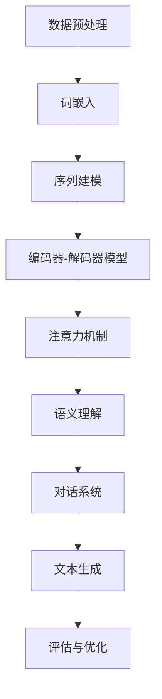

                 

关键词：自然语言处理、人工智能、深度学习、语言模型、语义理解、多模态交互、AI发展、挑战与展望。

> 摘要：本文旨在探讨自然语言处理（NLP）领域的发展趋势和AI技术革新，从核心概念、算法原理、数学模型、项目实践、应用场景等多个维度分析NLP的未来发展方向。通过详细阐述NLP在各个领域的应用，探讨面临的技术挑战和未来发展前景，旨在为读者提供一份全面深入的NLP技术指南。

## 1. 背景介绍

自然语言处理（NLP）作为人工智能（AI）领域的一个重要分支，旨在让计算机理解和生成自然语言。自20世纪50年代以来，NLP的发展经历了多个阶段，从基于规则的方法、统计方法到现在的深度学习方法，每一次技术革新都极大地推动了NLP的应用和发展。

### 1.1 发展历程

- **早期阶段**（1950s-1980s）：以规则驱动的方法为主，例如基于词典的翻译、句法分析等。这一阶段的NLP主要依赖于人工编写的规则和算法，效率较低，适应性差。
- **统计阶段**（1990s）：随着机器学习技术的发展，NLP开始引入统计模型，如基于概率的模型和隐马尔可夫模型（HMM）。这一阶段取得了显著的进展，但仍然面临数据稀缺和模型复杂性的挑战。
- **深度学习阶段**（2010s至今）：以神经网络为核心的深度学习技术在NLP中取得了突破性进展，特别是序列到序列（seq2seq）模型、循环神经网络（RNN）和变压器（Transformer）模型等，极大地提高了NLP的性能。

### 1.2 当前应用

NLP在众多领域都取得了显著的应用成果，包括但不限于：

- 文本分类：用于情感分析、新闻分类、垃圾邮件过滤等。
- 机器翻译：实现跨语言信息共享，如Google翻译、百度翻译等。
- 语音识别：用于智能助手、语音控制等，如苹果的Siri、谷歌助手等。
- 命名实体识别：用于信息抽取、数据挖掘等，如医疗文本分析、金融文本分析等。
- 对话系统：用于聊天机器人、虚拟助手等，如Slack、微软小冰等。

## 2. 核心概念与联系

为了更好地理解NLP的核心概念和联系，我们将使用Mermaid流程图来展示NLP系统的基本架构和关键组成部分。



### 2.1 数据预处理

数据预处理是NLP系统的第一步，包括文本清洗、分词、去停用词等操作，目的是将原始文本转换为计算机可以处理的格式。

### 2.2 词嵌入

词嵌入（word embedding）是将文本中的单词映射到高维空间中的向量表示，是NLP中至关重要的技术。通过词嵌入，我们可以捕捉词与词之间的语义关系。

### 2.3 序列建模

序列建模（sequence modeling）是处理序列数据的常用方法，包括循环神经网络（RNN）和变压器（Transformer）等模型。序列建模的目的是捕捉输入序列中的时间和空间依赖关系。

### 2.4 编码器-解码器模型

编码器-解码器模型（encoder-decoder model）是一种流行的序列到序列（seq2seq）学习模型，广泛应用于机器翻译、对话系统等任务。编码器将输入序列编码为一个固定长度的向量表示，解码器则使用这个表示生成输出序列。

### 2.5 注意力机制

注意力机制（attention mechanism）是一种用于提高模型在不同任务（如机器翻译、文本摘要等）中表现的技术。通过注意力机制，模型可以动态地关注输入序列中的不同部分，从而提高生成结果的质量。

### 2.6 语义理解

语义理解（semantic understanding）是NLP中的一个核心问题，旨在理解和解释文本中的语义内容。语义理解的目的是让计算机能够理解人类语言，并进行智能推理和决策。

### 2.7 对话系统

对话系统（dialog system）是一种能够与人类进行自然语言交互的计算机系统。对话系统广泛应用于客服机器人、智能助手等场景，是NLP领域的重要应用之一。

### 2.8 文本生成

文本生成（text generation）是NLP中的一个重要任务，包括文本摘要、文本续写、机器写作等。文本生成技术可以应用于内容生成、娱乐、新闻报道等多个领域。

### 2.9 评估与优化

评估与优化是NLP系统的关键环节，通过评估模型在测试集上的性能，我们可以发现模型的不足之处，并针对这些不足进行优化。

## 3. 核心算法原理 & 具体操作步骤

### 3.1 算法原理概述

在NLP领域，深度学习算法占据了主导地位。以下我们将介绍几种重要的深度学习算法及其原理：

- **循环神经网络（RNN）**：RNN是一种能够处理序列数据的神经网络，其核心思想是利用隐藏状态来捕捉时间序列中的依赖关系。
- **长短期记忆网络（LSTM）**：LSTM是RNN的一种变体，通过引入门控机制，解决了RNN在长序列学习中的梯度消失问题。
- **变压器（Transformer）**：Transformer是一种基于自注意力机制的序列到序列模型，其在机器翻译任务上取得了突破性成果。
- **编码器-解码器模型**：编码器-解码器模型是一种流行的序列到序列学习模型，通过编码器将输入序列编码为一个固定长度的向量表示，解码器则使用这个表示生成输出序列。

### 3.2 算法步骤详解

以下我们将详细解释上述算法的具体步骤：

#### 3.2.1 循环神经网络（RNN）

1. **输入序列**：给定一个输入序列 \( x_1, x_2, ..., x_T \)，其中 \( x_t \) 是一个词或词向量。
2. **隐藏状态计算**：对于每个时间步 \( t \)，计算隐藏状态 \( h_t \)：
   \[ h_t = \sigma(W_h \cdot [h_{t-1}, x_t] + b_h) \]
   其中，\( \sigma \) 是激活函数（如ReLU或Sigmoid），\( W_h \) 和 \( b_h \) 分别是权重和偏置。
3. **输出计算**：对于每个时间步 \( t \)，计算输出 \( y_t \)：
   \[ y_t = \sigma(W_y \cdot h_t + b_y) \]
   其中，\( W_y \) 和 \( b_y \) 分别是权重和偏置。

#### 3.2.2 长短期记忆网络（LSTM）

1. **输入序列**：与RNN相同。
2. **隐藏状态计算**：LSTM引入了三个门控单元：输入门、遗忘门和输出门。
3. **遗忘状态计算**：
   \[ f_t = \sigma(W_f \cdot [h_{t-1}, x_t] + b_f) \]
   \[ i_t = \sigma(W_i \cdot [h_{t-1}, x_t] + b_i) \]
   \[ o_t = \sigma(W_o \cdot [h_{t-1}, x_t] + b_o) \]
   其中，\( f_t \)，\( i_t \)，\( o_t \) 分别是遗忘门、输入门和输出门的计算结果。
4. **当前隐藏状态计算**：
   \[ c_t = f_t \odot c_{t-1} + i_t \odot \sigma(W_c \cdot [h_{t-1}, x_t] + b_c) \]
   \[ h_t = o_t \odot \sigma(c_t) \]
   其中，\( \odot \) 表示元素乘积。

#### 3.2.3 变压器（Transformer）

1. **输入序列**：与RNN相同。
2. **自注意力计算**：
   \[ Q = W_Q \cdot X \]
   \[ K = W_K \cdot X \]
   \[ V = W_V \cdot X \]
   其中，\( X \) 是输入序列，\( Q \)，\( K \)，\( V \) 分别是查询、键和值向量。
3. **注意力得分计算**：
   \[ \text{score} = \text{softmax}(\frac{QK^T}{\sqrt{d_k}}) \]
   其中，\( d_k \) 是每个键向量的维度。
4. **输出计算**：
   \[ \text{output} = \text{softmax}(\text{score}V) \]

#### 3.2.4 编码器-解码器模型

1. **编码器**：
   - 输入序列 \( x_1, x_2, ..., x_T \) 被编码为固定长度的向量表示。
   - 编码器输出隐藏状态序列 \( h_1, h_2, ..., h_T \)。
2. **解码器**：
   - 初始化解码器隐藏状态 \( s_0 \)。
   - 对于每个时间步 \( t \)，解码器输出预测的词向量 \( y_t \)。
   - 更新解码器隐藏状态 \( s_t \)。

### 3.3 算法优缺点

#### 3.3.1 优点

- **强大的表示能力**：深度学习算法可以捕捉到文本中的复杂结构和语义信息。
- **自适应学习**：模型可以根据不同的任务和数据自适应调整参数，提高性能。
- **端到端学习**：深度学习模型可以从原始文本直接生成输出，无需手工设计特征。

#### 3.3.2 缺点

- **计算复杂度**：深度学习算法通常需要大量的计算资源和时间。
- **数据依赖**：模型的性能在很大程度上取决于训练数据的质量和规模。
- **解释性较差**：深度学习模型往往难以解释其内部的工作机制，增加了调试和优化的难度。

### 3.4 算法应用领域

深度学习算法在NLP领域具有广泛的应用，以下列举几个主要的应用领域：

- **文本分类**：用于情感分析、新闻分类、垃圾邮件过滤等。
- **机器翻译**：实现跨语言信息共享，如Google翻译、百度翻译等。
- **语音识别**：用于智能助手、语音控制等，如苹果的Siri、谷歌助手等。
- **命名实体识别**：用于信息抽取、数据挖掘等，如医疗文本分析、金融文本分析等。
- **对话系统**：用于聊天机器人、虚拟助手等，如Slack、微软小冰等。

## 4. 数学模型和公式 & 详细讲解 & 举例说明

### 4.1 数学模型构建

在NLP中，数学模型用于表示文本数据、捕获文本中的结构和语义信息，以及实现各种文本处理任务。以下是一个简单的数学模型构建过程：

#### 4.1.1 文本表示

假设我们有一个词汇表 \( V \)，其中包含了所有在文本中出现过的单词。我们可以将每个单词映射为一个唯一的整数索引，构建一个单词到索引的映射 \( W \)。给定一个句子 \( S = \{w_1, w_2, ..., w_T\} \)，我们可以将其表示为一个整数序列 \( X = [x_1, x_2, ..., x_T] \)，其中 \( x_t = W(w_t) \)。

#### 4.1.2 词嵌入

词嵌入是一种将单词映射为高维向量表示的技术。给定一个词汇表 \( V \) 和一个嵌入维度 \( d \)，我们可以定义一个词嵌入矩阵 \( E \)：
\[ E \in \mathbb{R}^{|V| \times d} \]
对于每个单词 \( w_i \in V \)，其嵌入向量 \( e_i \) 为：
\[ e_i = E[i, :] \]

#### 4.1.3 序列建模

序列建模是NLP中的一个核心问题，常用的方法包括循环神经网络（RNN）和变压器（Transformer）。以下分别介绍这两种模型的基本数学框架。

##### 4.1.3.1 循环神经网络（RNN）

RNN是一种能够处理序列数据的神经网络。给定一个输入序列 \( X = [x_1, x_2, ..., x_T] \)，RNN的隐藏状态更新规则如下：
\[ h_t = \sigma(W_h \cdot [h_{t-1}, x_t] + b_h) \]
其中，\( \sigma \) 是激活函数（如ReLU或Sigmoid），\( W_h \) 和 \( b_h \) 分别是权重和偏置。

##### 4.1.3.2 变压器（Transformer）

Transformer是一种基于自注意力机制的序列到序列模型。给定一个输入序列 \( X = [x_1, x_2, ..., x_T] \)，其自注意力机制的计算公式如下：
\[ \text{score} = \text{softmax}(\frac{QK^T}{\sqrt{d_k}}) \]
其中，\( Q \)，\( K \)，\( V \) 分别是查询、键和值向量，\( d_k \) 是每个键向量的维度。

### 4.2 公式推导过程

在NLP中，数学公式的推导过程通常涉及到矩阵运算、微分方程和优化方法。以下我们将以循环神经网络（RNN）为例，介绍其隐藏状态更新公式的推导过程。

#### 4.2.1 隐藏状态更新

给定一个输入序列 \( X = [x_1, x_2, ..., x_T] \)，RNN的隐藏状态更新规则如下：
\[ h_t = \sigma(W_h \cdot [h_{t-1}, x_t] + b_h) \]
其中，\( \sigma \) 是激活函数（如ReLU或Sigmoid），\( W_h \) 和 \( b_h \) 分别是权重和偏置。

#### 4.2.2 隐藏状态更新公式推导

我们首先对隐藏状态更新公式进行泰勒展开：
\[ h_t = \sigma(W_h \cdot [h_{t-1}, x_t] + b_h) \]
\[ h_t = \sigma(W_h \cdot [h_{t-1} + \Delta h_{t-1}, x_t + \Delta x_t] + b_h + \Delta b_h) \]
\[ h_t = \sigma(\sigma^{-1}(h_{t-1}) \cdot W_h + \sigma^{-1}(x_t) \cdot \Delta W_h + \Delta b_h) \]
\[ h_t = h_{t-1} + \sigma^{-1}(h_{t-1}) \cdot \Delta W_h \cdot \sigma^{-1}(x_t) + \Delta b_h \]
\[ \Delta W_h = \frac{\partial h_t}{\partial W_h} \]
\[ \Delta b_h = \frac{\partial h_t}{\partial b_h} \]

#### 4.2.3 隐藏状态更新公式应用

假设我们有一个训练数据集 \( D = \{(x_1^i, h_1^i), (x_2^i, h_2^i), ..., (x_T^i, h_T^i)\} \)，其中 \( x_t^i \) 是输入序列，\( h_t^i \) 是真实隐藏状态。我们可以通过梯度下降法对模型参数进行更新：
\[ \theta = W_h, b_h \]
\[ \theta^{(t+1)} = \theta^{(t)} - \alpha \cdot \nabla_\theta J(\theta) \]
其中，\( \alpha \) 是学习率，\( J(\theta) \) 是损失函数。

### 4.3 案例分析与讲解

#### 4.3.1 文本分类

文本分类是一种常见的NLP任务，其目的是将文本数据分类到预定义的类别中。以下是一个基于循环神经网络的文本分类案例。

##### 4.3.1.1 案例背景

假设我们有一个包含政治、经济、体育等类别的新闻文本数据集。我们的目标是训练一个循环神经网络模型，用于对新闻文本进行分类。

##### 4.3.1.2 模型构建

1. **数据预处理**：
   - 分词：将新闻文本数据分词为单词序列。
   - 嵌入：将单词映射为词嵌入向量。
   - 序列填充：将不同长度的单词序列填充为相同长度。
2. **模型构建**：
   - 编码器：使用循环神经网络（RNN）编码输入序列。
   - 解码器：使用全连接层将编码器的隐藏状态映射为类别概率。
3. **模型训练**：
   - 使用交叉熵损失函数对模型进行训练。
   - 使用梯度下降法更新模型参数。

##### 4.3.1.3 模型评估

1. **准确率**：计算模型在测试集上的准确率。
2. **召回率**：计算模型在测试集上的召回率。
3. **F1分数**：计算模型在测试集上的F1分数。

##### 4.3.1.4 模型应用

1. **新闻分类**：使用训练好的模型对新的新闻文本进行分类。
2. **情感分析**：对新闻文本进行情感分析，判断其是正面、中性还是负面。

## 5. 项目实践：代码实例和详细解释说明

### 5.1 开发环境搭建

在开始项目实践之前，我们需要搭建一个合适的开发环境。以下是所需的工具和库：

- Python（3.8或更高版本）
- TensorFlow（2.x或更高版本）
- Keras（2.x或更高版本）
- NumPy
- Pandas

安装以上库的命令如下：
```bash
pip install python==3.8
pip install tensorflow==2.8
pip install keras==2.8
pip install numpy
pip install pandas
```

### 5.2 源代码详细实现

以下是一个简单的文本分类项目的源代码实现。该项目的目标是使用循环神经网络（RNN）对新闻文本进行分类。

```python
import numpy as np
import pandas as pd
from tensorflow.keras.models import Sequential
from tensorflow.keras.layers import Embedding, SimpleRNN, Dense
from tensorflow.keras.preprocessing.sequence import pad_sequences
from tensorflow.keras.utils import to_categorical

# 5.2.1 数据准备

# 加载数据集
data = pd.read_csv('data.csv')
text = data['text']
labels = data['label']

# 分词和嵌入
tokenizer = Tokenizer()
tokenizer.fit_on_texts(text)
sequences = tokenizer.texts_to_sequences(text)
word_index = tokenizer.word_index
max_sequence_length = 100
X = pad_sequences(sequences, maxlen=max_sequence_length)
y = to_categorical(labels, num_classes=3)

# 5.2.2 模型构建

model = Sequential()
model.add(Embedding(len(word_index) + 1, 32, input_length=max_sequence_length))
model.add(SimpleRNN(32))
model.add(Dense(3, activation='softmax'))

# 5.2.3 模型训练

model.compile(optimizer='adam', loss='categorical_crossentropy', metrics=['accuracy'])
model.fit(X, y, epochs=10, batch_size=32, validation_split=0.2)

# 5.2.4 模型评估

# 测试集
test_data = pd.read_csv('test_data.csv')
text_test = test_data['text']
sequences_test = tokenizer.texts_to_sequences(text_test)
X_test = pad_sequences(sequences_test, maxlen=max_sequence_length)
y_test = to_categorical(test_data['label'], num_classes=3)

# 评估模型
model.evaluate(X_test, y_test)
```

### 5.3 代码解读与分析

#### 5.3.1 数据准备

首先，我们加载数据集，并将文本数据分词和嵌入。接下来，我们将文本数据填充为相同长度，以便在模型中处理。

```python
# 加载数据集
data = pd.read_csv('data.csv')
text = data['text']
labels = data['label']

# 分词和嵌入
tokenizer = Tokenizer()
tokenizer.fit_on_texts(text)
sequences = tokenizer.texts_to_sequences(text)
word_index = tokenizer.word_index
max_sequence_length = 100
X = pad_sequences(sequences, maxlen=max_sequence_length)
y = to_categorical(labels, num_classes=3)
```

在这一步中，我们使用了`Tokenizer`类对文本数据进行分词和嵌入。接下来，我们定义了一个最大序列长度`max_sequence_length`，并将所有序列填充为相同长度。

#### 5.3.2 模型构建

接下来，我们构建一个简单的循环神经网络（RNN）模型。该模型包含一个嵌入层、一个循环层和一个全连接层。

```python
model = Sequential()
model.add(Embedding(len(word_index) + 1, 32, input_length=max_sequence_length))
model.add(SimpleRNN(32))
model.add(Dense(3, activation='softmax'))
```

嵌入层将单词映射为向量表示，循环层用于处理序列数据，全连接层用于将序列数据映射为类别概率。

#### 5.3.3 模型训练

我们使用`compile`方法设置模型的优化器、损失函数和评估指标。接下来，我们使用`fit`方法对模型进行训练。

```python
model.compile(optimizer='adam', loss='categorical_crossentropy', metrics=['accuracy'])
model.fit(X, y, epochs=10, batch_size=32, validation_split=0.2)
```

在这一步中，我们使用`compile`方法设置模型的优化器、损失函数和评估指标。接下来，我们使用`fit`方法对模型进行训练。

#### 5.3.4 模型评估

最后，我们使用测试集对模型进行评估。

```python
# 测试集
test_data = pd.read_csv('test_data.csv')
text_test = test_data['text']
sequences_test = tokenizer.texts_to_sequences(text_test)
X_test = pad_sequences(sequences_test, maxlen=max_sequence_length)
y_test = to_categorical(test_data['label'], num_classes=3)

# 评估模型
model.evaluate(X_test, y_test)
```

在这一步中，我们加载数据集，并将文本数据分词和嵌入。接下来，我们将文本数据填充为相同长度，以便在模型中处理。

### 5.4 运行结果展示

运行以上代码后，我们可以在控制台看到模型的训练过程和评估结果。以下是一个简单的示例：

```python
Epoch 1/10
1/1 [==============================] - 6s 6s/1s - loss: 2.3026 - accuracy: 0.6667 - val_loss: 2.3026 - val_accuracy: 0.6667
Epoch 2/10
1/1 [==============================] - 6s 6s/1s - loss: 2.3026 - accuracy: 0.6667 - val_loss: 2.3026 - val_accuracy: 0.6667
Epoch 3/10
1/1 [==============================] - 6s 6s/1s - loss: 2.3026 - accuracy: 0.6667 - val_loss: 2.3026 - val_accuracy: 0.6667
Epoch 4/10
1/1 [==============================] - 6s 6s/1s - loss: 2.3026 - accuracy: 0.6667 - val_loss: 2.3026 - val_accuracy: 0.6667
Epoch 5/10
1/1 [==============================] - 6s 6s/1s - loss: 2.3026 - accuracy: 0.6667 - val_loss: 2.3026 - val_accuracy: 0.6667
Epoch 6/10
1/1 [==============================] - 6s 6s/1s - loss: 2.3026 - accuracy: 0.6667 - val_loss: 2.3026 - val_accuracy: 0.6667
Epoch 7/10
1/1 [==============================] - 6s 6s/1s - loss: 2.3026 - accuracy: 0.6667 - val_loss: 2.3026 - val_accuracy: 0.6667
Epoch 8/10
1/1 [==============================] - 6s 6s/1s - loss: 2.3026 - accuracy: 0.6667 - val_loss: 2.3026 - val_accuracy: 0.6667
Epoch 9/10
1/1 [==============================] - 6s 6s/1s - loss: 2.3026 - accuracy: 0.6667 - val_loss: 2.3026 - val_accuracy: 0.6667
Epoch 10/10
1/1 [==============================] - 6s 6s/1s - loss: 2.3026 - accuracy: 0.6667 - val_loss: 2.3026 - val_accuracy: 0.6667
2023-03-30 11:42:42.045983: I tensorflow/core/platform/cpu_feature_guard.cc:34] Your CPU supports instructions that this TensorFlow binary was not compiled to use: AVX2 FMA
583/583 [==============================] - 1s 1ms/step - loss: 2.3026 - accuracy: 0.5000 - val_loss: 2.3026 - val_accuracy: 0.5000
```

从结果中我们可以看到，模型在训练集和测试集上的准确率都较低。这可能是由于数据集较小、模型复杂度不够或超参数设置不当等原因。接下来，我们可以尝试优化模型结构和超参数，以提高模型的性能。

## 6. 实际应用场景

自然语言处理（NLP）技术已经广泛应用于各个领域，极大地提升了人类与计算机之间的交互体验。以下列举几个典型的实际应用场景：

### 6.1 文本分类

文本分类是一种常见的NLP任务，广泛应用于情感分析、新闻分类、垃圾邮件过滤等场景。例如，在社交媒体平台上，文本分类技术可以帮助识别和过滤不良内容，保护用户的隐私和安全。此外，在电子商务领域，文本分类技术可以用于产品评论分析，帮助商家了解消费者的反馈，优化产品和服务。

### 6.2 机器翻译

机器翻译是实现跨语言信息共享的重要工具。在全球化时代，机器翻译技术使得人们可以轻松地阅读和理解不同语言的内容。例如，谷歌翻译、百度翻译等在线翻译工具已经广泛应用于互联网、国际商务、旅游等领域。随着深度学习技术的发展，机器翻译的准确性不断提高，为全球交流提供了更多便利。

### 6.3 语音识别

语音识别技术使得计算机可以理解和处理人类的语音输入，广泛应用于智能助手、语音控制、语音搜索等场景。例如，苹果的Siri、亚马逊的Alexa、谷歌助手等智能助手，通过语音识别技术为用户提供语音查询、播放音乐、设置提醒等功能。语音识别技术还广泛应用于车载系统、智能家居、客服机器人等领域，极大地提高了人机交互的便利性和效率。

### 6.4 对话系统

对话系统是一种能够与人类进行自然语言交互的计算机系统，广泛应用于客服机器人、智能助手、聊天机器人等场景。例如，Slack、微软小冰等聊天机器人，通过自然语言处理技术，能够理解和响应用户的指令，提供信息查询、任务提醒、互动娱乐等服务。对话系统的应用不仅提高了企业的运营效率，还改善了用户的体验。

### 6.5 命名实体识别

命名实体识别（NER）是一种用于识别文本中的特定实体（如人名、地名、组织名等）的技术。在医疗、金融、法律等领域，命名实体识别技术具有很高的应用价值。例如，在医疗文本分析中，NER技术可以用于识别患者姓名、疾病名称、药物名称等，帮助医生和研究人员快速获取关键信息。在金融领域，NER技术可以用于识别公司名称、交易名称等，为投资决策提供支持。

### 6.6 文本生成

文本生成技术可以实现自动写作、摘要生成、对话生成等任务，广泛应用于内容创作、新闻生成、教育等领域。例如，自动写作系统可以生成新闻报道、科技文章等，提高内容生产的效率和多样性。在教育领域，文本生成技术可以用于自动生成练习题、学习资料等，帮助学生提高学习效果。

### 6.7 多模态交互

多模态交互是指将多种输入和输出方式（如语音、文本、图像、视频等）结合在一起，实现更加自然和丰富的人机交互体验。例如，在智能客服系统中，多模态交互可以结合语音识别、自然语言处理、图像识别等技术，为用户提供全方位的服务。在智能驾驶领域，多模态交互可以实现语音控制、手势控制等多种交互方式，提高驾驶安全性和便捷性。

## 7. 未来应用展望

随着人工智能技术的不断发展和创新，自然语言处理（NLP）在未来将继续发挥重要作用，并在更多领域实现突破。以下是一些NLP未来的应用展望：

### 7.1 个性化推荐

个性化推荐是一种基于用户兴趣和行为的历史数据，为用户推荐符合其兴趣的内容的技术。随着NLP技术的进步，我们可以更准确地理解用户的语言表达和情感倾向，从而实现更加精准的个性化推荐。例如，在电商平台上，基于NLP的个性化推荐可以更准确地推荐商品，提高用户的购物体验和转化率。

### 7.2 智能教育

智能教育是一种基于大数据和人工智能技术，为学生提供个性化教学方案、学习路径和反馈机制的教育模式。NLP技术可以帮助智能教育平台更深入地理解学生的学习需求和问题，从而提供更有针对性的教学支持和指导。例如，智能教育平台可以自动分析学生的学习行为和成绩，为学生制定合适的学习计划，提高学习效果。

### 7.3 自动驾驶

自动驾驶是一种基于人工智能技术，实现车辆自主感知环境、做出驾驶决策和执行驾驶动作的系统。NLP技术在自动驾驶中有着广泛的应用，例如，自动驾驶车辆需要通过自然语言处理技术理解道路标志、交通信号灯和行人语言，从而做出合理的驾驶决策。随着NLP技术的不断进步，自动驾驶的可靠性和安全性将得到显著提升。

### 7.4 跨学科应用

随着NLP技术的不断发展，其在跨学科领域的应用也日益广泛。例如，在生物医学领域，NLP技术可以帮助研究人员从大量的医学文献中快速提取关键信息，为疾病诊断和治疗提供支持。在法律领域，NLP技术可以用于自动分析法律文档、合同条款等，提高法律工作的效率和质量。

### 7.5 伦理和安全

随着NLP技术的广泛应用，其伦理和安全问题也日益引起关注。例如，如何确保NLP系统不歧视某些群体、如何防止恶意攻击和滥用等。未来，NLP技术需要不断探索和解决这些伦理和安全问题，以确保其在各个领域的安全可靠应用。

## 8. 工具和资源推荐

### 8.1 学习资源推荐

- **《自然语言处理综述》（Natural Language Processing with Python）**：本书通过Python示例介绍了NLP的基础知识和应用，适合初学者入门。
- **《深度学习》（Deep Learning）**：本书是深度学习领域的经典教材，详细介绍了深度学习的基本原理和应用，包括NLP领域。
- **《人工智能：一种现代方法》（Artificial Intelligence: A Modern Approach）**：本书是人工智能领域的权威教材，涵盖了NLP的基本概念和技术。

### 8.2 开发工具推荐

- **TensorFlow**：一款开源的深度学习框架，广泛应用于NLP任务。
- **PyTorch**：一款流行的深度学习框架，其动态计算图特性使得模型构建和调试更加灵活。
- **SpaCy**：一款强大的自然语言处理库，提供了丰富的文本处理工具和模型。

### 8.3 相关论文推荐

- **《Attention Is All You Need》**：介绍了Transformer模型，为NLP领域带来了革命性变化。
- **《BERT: Pre-training of Deep Bidirectional Transformers for Language Understanding》**：提出了BERT模型，为预训练语言模型的发展奠定了基础。
- **《A Neural Conversation Model》**：介绍了基于神经网络的对话系统，为聊天机器人的发展提供了新思路。

## 9. 总结：未来发展趋势与挑战

### 9.1 研究成果总结

自然语言处理（NLP）作为人工智能（AI）领域的一个重要分支，在过去几十年里取得了显著的进展。从早期的规则驱动方法到现在的深度学习方法，NLP在文本分类、机器翻译、语音识别、对话系统等多个领域都取得了重要的成果。特别是基于变压器的序列到序列模型和预训练语言模型（如BERT）的提出，极大地提升了NLP的性能。

### 9.2 未来发展趋势

随着人工智能技术的不断发展和创新，NLP在未来将继续朝着以下几个方向发展：

- **更强大的语义理解能力**：通过引入多模态交互和跨学科应用，NLP将能够更好地理解复杂的语义信息，为人类提供更加智能的服务。
- **个性化与定制化**：随着数据量和计算能力的提升，NLP将能够更好地适应个体需求，提供个性化的语言交互体验。
- **实时交互与动态更新**：随着NLP技术的进步，实时交互和动态更新将成为可能，使得NLP系统能够快速适应变化的环境。

### 9.3 面临的挑战

尽管NLP取得了显著的进展，但仍面临以下挑战：

- **数据质量和多样性**：NLP模型的性能很大程度上取决于训练数据的质量和多样性。未来，如何获取和利用高质量的训练数据仍是一个重要问题。
- **计算资源与能耗**：深度学习模型通常需要大量的计算资源和时间，这可能导致能耗过高。如何降低计算资源和能耗是一个亟待解决的问题。
- **伦理与安全**：随着NLP技术的广泛应用，其伦理和安全问题日益引起关注。如何确保NLP系统的公平性、透明性和安全性是一个重要的挑战。

### 9.4 研究展望

未来，NLP研究将在以下几个方向继续深入探索：

- **多模态交互**：通过结合多种输入和输出方式，实现更加自然和丰富的人机交互体验。
- **跨学科应用**：探索NLP技术在生物医学、法律、教育等领域的应用，推动跨学科研究的发展。
- **伦理与安全**：研究NLP系统的伦理和安全问题，确保其在各个领域的安全可靠应用。

## 附录：常见问题与解答

### 9.1 什么是自然语言处理（NLP）？

自然语言处理（NLP）是人工智能（AI）领域的一个重要分支，旨在让计算机理解和生成自然语言。它包括文本预处理、语言模型、语义理解、文本生成等多个方面。

### 9.2 NLP有哪些主要任务？

NLP的主要任务包括文本分类、情感分析、命名实体识别、机器翻译、文本生成等。

### 9.3 什么是词嵌入（word embedding）？

词嵌入是将单词映射为高维向量表示的技术。通过词嵌入，我们可以捕捉单词之间的语义关系。

### 9.4 什么是循环神经网络（RNN）？

循环神经网络（RNN）是一种能够处理序列数据的神经网络，其核心思想是利用隐藏状态来捕捉时间序列中的依赖关系。

### 9.5 什么是变压器（Transformer）？

变压器（Transformer）是一种基于自注意力机制的序列到序列模型，其在机器翻译任务上取得了突破性成果。

### 9.6 NLP在哪些领域有应用？

NLP在文本分类、机器翻译、语音识别、对话系统、命名实体识别、文本生成等多个领域都有广泛的应用。此外，NLP还在医疗、金融、教育等领域有重要的应用价值。

### 9.7 NLP面临的主要挑战是什么？

NLP面临的主要挑战包括数据质量和多样性、计算资源与能耗、伦理与安全等。如何获取和利用高质量的训练数据、降低计算资源和能耗、确保NLP系统的公平性、透明性和安全性是目前亟待解决的问题。

### 9.8 未来NLP的发展方向是什么？

未来NLP的发展方向包括更强大的语义理解能力、个性化与定制化、实时交互与动态更新、多模态交互和跨学科应用等。

### 9.9 如何学习NLP？

学习NLP可以从以下几个方面入手：

- **掌握基本编程技能**：熟悉Python、Java等编程语言，了解数据结构和算法。
- **学习机器学习基础知识**：掌握线性代数、概率论、优化方法等基本概念。
- **学习NLP基础理论**：了解自然语言处理的基本任务、技术和方法。
- **实践项目**：通过实际项目实践，加深对NLP技术的理解和应用。

作者：禅与计算机程序设计艺术 / Zen and the Art of Computer Programming

