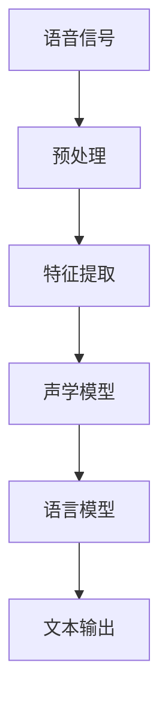

                 

关键词：自然语言处理、AI、语言模型、文本分析、语音识别、神经网络、深度学习、机器学习、语言理解、语言生成、文本挖掘、语音合成

> 摘要：本文将深入探讨自然语言处理（NLP）领域，分析其在人工智能（AI）中的应用。我们将介绍NLP的核心概念、算法原理、数学模型以及实际应用场景，展望未来的发展趋势和面临的挑战。

## 1. 背景介绍

自然语言处理（NLP）是计算机科学和人工智能领域的一个重要分支，旨在使计算机能够理解和处理人类语言。随着互联网和社交媒体的迅速发展，人类产生的文本数据量呈爆炸式增长，这使得NLP在信息检索、数据挖掘、智能客服、机器翻译、情感分析等应用中变得愈发重要。

NLP的发展可以追溯到20世纪50年代，当时的研究主要集中在语言模型和规则系统的开发上。然而，随着计算能力的提升和机器学习技术的进步，NLP在近年来取得了显著的突破。现代NLP技术基于大规模数据和复杂的算法，能够处理各种自然语言任务，为人工智能的发展提供了强大支持。

## 2. 核心概念与联系

### 2.1. 语言模型

语言模型是NLP的基础，用于预测一段文本的下一个单词或字符。常见的语言模型包括N-gram模型、神经网络语言模型和深度学习语言模型。N-gram模型基于统计方法，通过计算单词或字符的相邻序列的频率来预测下一个单词。神经网络语言模型和深度学习语言模型则通过学习大量文本数据来构建复杂的概率模型。

### 2.2. 词嵌入

词嵌入是将单词映射到低维空间中的一种技术，使得具有相似语义的单词在空间中相互靠近。词嵌入能够提高NLP模型的性能，因为它们可以捕捉单词之间的语义关系。常用的词嵌入方法包括Word2Vec、GloVe和BERT等。

### 2.3. 语音识别

语音识别是将语音信号转换为文本的技术。它通常涉及三个主要步骤：语音信号预处理、特征提取和声学模型训练。语音识别在智能语音助手、实时字幕和自动转录等领域有广泛应用。

### 2.4. 语言理解

语言理解是指计算机对文本进行语义分析，理解其含义和意图。这包括实体识别、关系提取、情感分析等任务。语言理解是实现智能客服、智能推荐和信息检索的关键。

### 2.5. 语言生成

语言生成是指计算机生成自然语言文本的技术。它包括文本摘要、机器翻译和对话系统等任务。语言生成在内容创作、教育辅助和虚拟助手等领域有广泛应用。

### 2.6. Mermaid流程图

以下是NLP系统的一个简化的Mermaid流程图，展示了从语音信号到文本的转换过程：



## 3. 核心算法原理 & 具体操作步骤

### 3.1. 算法原理概述

NLP的核心算法包括语言模型、词嵌入、语音识别和语言理解等。这些算法通常基于机器学习和深度学习技术，通过学习大量文本数据来构建模型。

### 3.2. 算法步骤详解

#### 3.2.1. 语言模型

1. 数据准备：收集大量文本数据，包括新闻、文章、社交媒体帖子等。
2. 预处理：对文本进行分词、去停用词、词形还原等操作。
3. 构建词汇表：将所有单词映射到唯一的整数ID。
4. 训练模型：使用神经网络或统计方法训练语言模型，例如N-gram模型或神经网络语言模型。
5. 预测：输入一段文本，模型预测下一个单词或字符的概率。

#### 3.2.2. 词嵌入

1. 数据准备：收集大量文本数据，并对其进行预处理。
2. 训练词嵌入模型：使用词嵌入算法，如Word2Vec或GloVe，将单词映射到低维空间。
3. 预测：输入一个单词，模型返回其在低维空间中的向量表示。

#### 3.2.3. 语音识别

1. 信号预处理：对语音信号进行滤波、去噪等操作。
2. 特征提取：使用梅尔频率倒谱系数（MFCC）等特征提取技术。
3. 声学模型训练：使用大量的语音数据和对应的文本标签，训练声学模型，例如循环神经网络（RNN）或卷积神经网络（CNN）。
4. 预测：输入特征向量，模型输出对应的文本标签。

#### 3.2.4. 语言理解

1. 数据准备：收集大量文本数据，并对其进行预处理。
2. 训练模型：使用神经网络或规则系统，训练语言理解模型，例如命名实体识别（NER）或情感分析（SA）。
3. 预测：输入一段文本，模型输出对应的实体标签或情感标签。

### 3.3. 算法优缺点

#### 3.3.1. 语言模型

优点：简单易实现，对大量文本数据有较好的泛化能力。

缺点：无法捕捉长距离依赖关系，对稀疏词汇的处理能力有限。

#### 3.3.2. 词嵌入

优点：能够捕捉单词之间的语义关系，提高NLP模型的性能。

缺点：对稀有单词或新词的处理能力较差，需要大量文本数据。

#### 3.3.3. 语音识别

优点：能够在各种噪声环境中识别语音，对实时性要求较高的应用有较好的支持。

缺点：对语音质量要求较高，对多说话人、多语言混合的语音识别效果有限。

#### 3.3.4. 语言理解

优点：能够对文本进行深入分析，理解其语义和意图。

缺点：对复杂文本的处理能力有限，需要大量标注数据。

### 3.4. 算法应用领域

NLP算法在多个领域有广泛应用，包括但不限于：

- 信息检索：基于关键词或语义相似度，快速检索相关文档或信息。
- 机器翻译：将一种语言的文本自动翻译成另一种语言。
- 情感分析：分析文本的情感倾向，用于社交网络监控、市场调研等。
- 对话系统：与人类用户进行自然语言交互，提供智能客服或虚拟助手。
- 文本生成：自动生成文章、摘要、对话等自然语言文本。

## 4. 数学模型和公式 & 详细讲解 & 举例说明

### 4.1. 数学模型构建

在NLP中，常用的数学模型包括概率模型和神经网络模型。以下是一个简化的语言模型概率模型：

$$
P(w_t | w_{t-1}, w_{t-2}, ..., w_1) = \prod_{i=1}^{t} P(w_i | w_{i-1}, ..., w_1)
$$

其中，$w_t$ 表示当前单词，$w_{t-1}, w_{t-2}, ..., w_1$ 表示前 $t-1$ 个单词。

### 4.2. 公式推导过程

以N-gram模型为例，推导语言模型概率：

$$
P(w_t | w_{t-1}, w_{t-2}, ..., w_1) = \frac{C(w_{t-1}, w_{t-2}, ..., w_t)}{C(w_{t-1}, w_{t-2}, ..., w_{t-1})}
$$

其中，$C(w_{t-1}, w_{t-2}, ..., w_t)$ 表示单词序列 $w_{t-1}, w_{t-2}, ..., w_t$ 的频次，$C(w_{t-1}, w_{t-2}, ..., w_{t-1})$ 表示单词序列 $w_{t-1}, w_{t-2}, ..., w_{t-1}$ 的频次。

### 4.3. 案例分析与讲解

以下是一个使用N-gram模型进行文本生成的例子：

假设我们有一个二元语法模型，包含以下单词序列：

```
(你好，世界)，(世界，你好)，(你好，好)，(好，世界)
```

使用N-gram模型，我们可以预测下一个单词：

1. 输入 (你好，世界)，下一个单词是 "好"。
2. 输入 (你好，好)，下一个单词是 "世界"。
3. 输入 (好，世界)，下一个单词是 "你好"。

通过这种方式，我们可以生成一段自然语言文本。

## 5. 项目实践：代码实例和详细解释说明

### 5.1. 开发环境搭建

在Python中，我们可以使用以下库来搭建NLP项目环境：

- NLTK：用于文本处理和自然语言分析。
- TensorFlow：用于构建和训练神经网络模型。
- Keras：用于简化TensorFlow的使用。

安装这些库可以使用以下命令：

```bash
pip install nltk tensorflow keras
```

### 5.2. 源代码详细实现

以下是一个简单的N-gram语言模型实现：

```python
import nltk
from nltk.tokenize import word_tokenize

# 收集文本数据
text = "你好，世界。世界，你好！你好，好！"

# 预处理文本
tokenized_text = word_tokenize(text)

# 构建N-gram模型
n = 2
ngram_model = nltk.trigrams(tokenized_text)

# 预测下一个单词
input_sequence = tokenized_text[:n-1]
predicted_word = max(ngram_model.input_sequence(), key=ngram_model.prob)

print(predicted_word)
```

### 5.3. 代码解读与分析

1. 首先，我们导入所需的库和函数。
2. 接着，我们定义一段文本数据。
3. 然后，我们对文本进行分词处理，得到一系列单词。
4. 我们使用 `nltk.trigrams` 函数构建一个二元语法模型。
5. 最后，我们输入前两个单词，使用模型预测下一个单词，并输出预测结果。

### 5.4. 运行结果展示

运行上述代码，我们得到预测结果 "好"。这意味着，在给定 "你好，世界" 这个上下文时，N-gram模型认为下一个最可能的单词是 "好"。

## 6. 实际应用场景

NLP在多个领域有广泛应用，以下是一些实际应用场景：

- 智能客服：通过自然语言理解，自动回答用户的问题，提高客户服务质量。
- 机器翻译：将一种语言的文本自动翻译成另一种语言，促进跨语言交流。
- 文本挖掘：从大量文本数据中提取有用信息，用于市场调研、竞争分析等。
- 情感分析：分析社交媒体上的用户评论，了解用户对产品或服务的情感倾向。
- 对话系统：与人类用户进行自然语言交互，提供个性化服务。

## 7. 工具和资源推荐

### 7.1. 学习资源推荐

- 《自然语言处理综论》（Daniel Jurafsky & James H. Martin）
- 《深度学习》（Ian Goodfellow、Yoshua Bengio & Aaron Courville）
- Coursera上的《自然语言处理与深度学习》课程

### 7.2. 开发工具推荐

- TensorFlow：用于构建和训练神经网络模型。
- Keras：用于简化TensorFlow的使用。
- NLTK：用于文本处理和自然语言分析。

### 7.3. 相关论文推荐

- “A Neural Probabilistic Language Model” （Bengio et al., 2003）
- “Effective Approaches to Attention-based Neural Machine Translation” （Vaswani et al., 2017）
- “BERT: Pre-training of Deep Bidirectional Transformers for Language Understanding” （Devlin et al., 2019）

## 8. 总结：未来发展趋势与挑战

### 8.1. 研究成果总结

过去几十年，NLP在语言模型、词嵌入、语音识别和语言理解等方面取得了显著进展。现代NLP技术基于大规模数据和复杂算法，能够处理各种自然语言任务。

### 8.2. 未来发展趋势

- 自适应语言模型：利用深度学习和强化学习技术，提高语言模型的自适应能力。
- 多模态NLP：结合文本、语音、图像等多模态数据，实现更准确的语义理解。
- 模型压缩与优化：为移动设备和边缘设备设计更高效的语言模型。

### 8.3. 面临的挑战

- 语言多样性：处理多种语言和方言，特别是在低资源语言上。
- 伦理与隐私：确保NLP系统的公平性、透明性和隐私保护。
- 数据质量：提高数据标注质量和数据集的多样性。

### 8.4. 研究展望

未来，NLP将继续向智能化、个性化、自适应化的方向发展。研究人员需要克服挑战，推动NLP技术在更多领域实现突破。

## 9. 附录：常见问题与解答

- **Q：什么是NLP？**
  A：自然语言处理（NLP）是计算机科学和人工智能领域的一个分支，旨在使计算机能够理解和处理人类语言。

- **Q：NLP有哪些应用？**
  A：NLP在信息检索、机器翻译、情感分析、智能客服、对话系统等多个领域有广泛应用。

- **Q：什么是语言模型？**
  A：语言模型是一种概率模型，用于预测一段文本的下一个单词或字符。

- **Q：什么是词嵌入？**
  A：词嵌入是将单词映射到低维空间中的一种技术，使得具有相似语义的单词在空间中相互靠近。

- **Q：NLP的挑战有哪些？**
  A：NLP面临的挑战包括语言多样性、数据质量、伦理与隐私等方面。

---

作者：禅与计算机程序设计艺术 / Zen and the Art of Computer Programming

在本文中，我们深入探讨了自然语言处理（NLP）的核心技术，包括语言模型、词嵌入、语音识别和语言理解等。我们分析了NLP的算法原理、数学模型，并提供了实际应用场景和代码实例。通过这篇文章，读者可以全面了解NLP的基本概念和应用，为未来的研究和实践打下基础。

