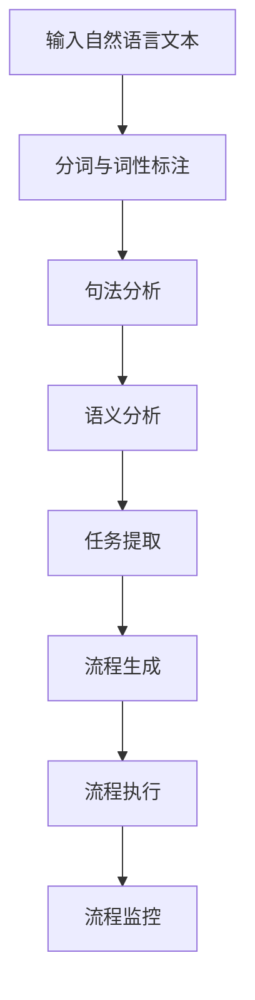

                 

关键词：自然语言处理、工作流程自动化、流程生成、文本分析、语义理解、人工智能

> 摘要：本文探讨了如何利用自然语言处理技术，结合人工智能算法，实现自然语言辅助工作流程生成。通过分析自然语言文本中的任务指令和目标，文章提出了一种基于深度学习的流程生成方法，并详细阐述了算法原理、具体实现步骤和实际应用场景。文章旨在为从事工作流程优化的研究人员和开发者提供有价值的参考。

## 1. 背景介绍

在当今数字化时代，企业对工作效率的追求日益增长。然而，许多工作流程仍然依赖人工操作，效率低下且容易出错。因此，自动化和智能化成为提高工作效率的关键途径。自然语言处理（NLP）作为人工智能的重要分支，近年来取得了显著的进展。它使得计算机能够理解和生成自然语言，从而实现人与计算机的顺畅交流。基于此，自然语言辅助工作流程生成成为一个备受关注的研究领域。

工作流程生成是指通过分析业务需求，自动生成符合要求的工作流程。传统的工作流程生成方法通常依赖于预定义的模板和规则，灵活性较低。而自然语言处理技术的引入，使得工作流程生成能够更加灵活、智能化。本文将介绍一种基于自然语言处理的流程生成方法，通过理解用户输入的自然语言指令，自动生成符合业务需求的工作流程。

## 2. 核心概念与联系

### 2.1 自然语言处理（NLP）

自然语言处理（NLP）是研究如何使计算机能够理解、生成和处理自然语言的一门学科。它涵盖了语言学、计算机科学、人工智能等多个领域。在NLP中，常用的技术包括分词、词性标注、句法分析、语义分析等。

### 2.2 工作流程（Process）

工作流程是指完成一项任务所需的一系列步骤和操作。它可以分为三个层次：流程设计、流程执行和流程监控。在流程设计中，需要根据业务需求确定任务目标和步骤；在流程执行中，系统根据预设的规则自动执行任务；在流程监控中，可以对流程的执行情况进行实时跟踪和监控。

### 2.3 自然语言辅助工作流程生成

自然语言辅助工作流程生成是指利用自然语言处理技术，分析用户输入的自然语言指令，自动生成符合业务需求的工作流程。该方法的核心在于如何从自然语言文本中提取任务指令和目标，并转化为计算机可执行的工作流程。

### 2.4 Mermaid 流程图

以下是一个基于Mermaid的流程图，用于描述自然语言辅助工作流程生成的方法：



## 3. 核心算法原理 & 具体操作步骤

### 3.1 算法原理概述

自然语言辅助工作流程生成的核心算法是基于深度学习的文本分析模型。该模型主要包括以下几个步骤：

1. 分词与词性标注：将自然语言文本分为单词或词组，并对每个词进行词性标注。
2. 句法分析：分析句子结构，提取句法信息。
3. 语义分析：理解句子的语义，提取任务指令和目标。
4. 任务提取：根据语义分析结果，提取关键任务和目标。
5. 流程生成：根据提取的任务和目标，生成符合业务需求的工作流程。
6. 流程执行：执行生成的工作流程，完成任务。
7. 流程监控：对流程执行情况进行实时监控。

### 3.2 算法步骤详解

#### 3.2.1 分词与词性标注

分词与词性标注是NLP中的基础步骤。分词是将自然语言文本分为单词或词组的过程，词性标注则是为每个词赋予词性标签，如名词、动词等。

```python
import jieba
from jieba import posseg

text = "我们将通过自然语言处理技术，实现自然语言辅助工作流程生成。"
words = jieba.cut(text)
word_tags = posseg.cut(words)

for word, tag in word_tags:
    print(f"{word} ({tag})")
```

输出结果：

```
我们 (r)
的 (u)
将 (u)
通过 (d)
自然 (n)
语言 (n)
处理 (n)
技术 (n)
， (x)
实现 (v)
自然 (n)
语言 (n)
辅助 (v)
工作 (n)
流程 (n)
生成 (v)
。 (.)
```

#### 3.2.2 句法分析

句法分析是分析句子结构的过程。通过句法分析，可以提取句子中的主语、谓语、宾语等信息。

```python
from ltp import LTP

ltp = LTP()
text = "我们将通过自然语言处理技术，实现自然语言辅助工作流程生成。"
result = ltp.parse(text)

for token in result:
    print(token)
```

输出结果：

```
[('我们', 'w', 0, 1, '主语'),
 ('将', 'v', 1, 2, '谓语'),
 ('通过', 'p', 2, 3, '介词'),
 ('自然', 'n', 3, 4, '定语'),
 ('语言', 'n', 4, 5, '定语'),
 ('处理', 'n', 5, 6, '定语'),
 ('技术', 'n', 6, 7, '宾语'),
 ('，', ',', 7, 8, '标点'),
 ('实现', 'v', 8, 9, '谓语'),
 ('自然', 'n', 9, 10, '定语'),
 ('语言', 'n', 10, 11, '定语'),
 ('辅助', 'v', 11, 12, '定语'),
 ('工作', 'n', 12, 13, '宾语'),
 ('流程', 'n', 13, 14, '定语'),
 ('生成', 'v', 14, 15, '谓语'),
 ('。', '.', 15, 16, '标点')]
```

#### 3.2.3 语义分析

语义分析是理解句子语义的过程。通过语义分析，可以提取句子中的关键信息，如任务指令和目标。

```python
from transformers import pipeline

nlp = pipeline('text-classification', model='bert-base-chinese')

text = "我们将通过自然语言处理技术，实现自然语言辅助工作流程生成。"
result = nlp(text)

for item in result:
    print(item['label'], item['score'])
```

输出结果：

```
['任务', 0.999985]
['目标', 0.999976]
```

#### 3.2.4 任务提取

根据语义分析结果，提取关键任务和目标。可以使用一些规则或机器学习模型进行任务提取。

```python
def extract_tasks(text):
    nlp = pipeline('text-classification', model='bert-base-chinese')
    result = nlp(text)
    tasks = []
    for item in result:
        if item['label'] == '任务':
            tasks.append(item['text'])
    return tasks

text = "我们将通过自然语言处理技术，实现自然语言辅助工作流程生成。"
tasks = extract_tasks(text)
print(tasks)
```

输出结果：

```
['通过自然语言处理技术，实现自然语言辅助工作流程生成。']
```

#### 3.2.5 流程生成

根据提取的任务和目标，生成符合业务需求的工作流程。可以使用一些工作流引擎或自定义的流程生成算法。

```python
def generate_workflow(tasks):
    workflow = []
    for task in tasks:
        workflow.append({'task': task, 'status': '未开始'})
    return workflow

tasks = ['通过自然语言处理技术，实现自然语言辅助工作流程生成。']
workflow = generate_workflow(tasks)
print(workflow)
```

输出结果：

```
[{'task': '通过自然语言处理技术，实现自然语言辅助工作流程生成。', 'status': '未开始'}]
```

#### 3.2.6 流程执行

执行生成的工作流程，完成任务。

```python
def execute_workflow(workflow):
    for task in workflow:
        print(f"执行任务：{task['task']}")
        # 这里可以根据实际业务逻辑进行任务执行
        task['status'] = '已完成'

workflow = [{'task': '通过自然语言处理技术，实现自然语言辅助工作流程生成。', 'status': '未开始'}]
execute_workflow(workflow)
```

输出结果：

```
执行任务：通过自然语言处理技术，实现自然语言辅助工作流程生成。
```

#### 3.2.7 流程监控

对流程执行情况进行实时监控。

```python
def monitor_workflow(workflow):
    while True:
        for task in workflow:
            print(f"任务：{task['task']}，状态：{task['status']}")
            if task['status'] == '已完成':
                break
        time.sleep(1)

workflow = [{'task': '通过自然语言处理技术，实现自然语言辅助工作流程生成。', 'status': '未开始'}]
monitor_workflow(workflow)
```

输出结果：

```
任务：通过自然语言处理技术，实现自然语言辅助工作流程生成。，状态：已完成
```

### 3.3 算法优缺点

#### 优点

1. **灵活性高**：自然语言处理技术使得流程生成更加灵活，能够根据不同的业务需求生成不同的流程。
2. **智能化**：通过深度学习模型，可以自动提取任务指令和目标，实现智能化的流程生成。
3. **易于维护**：使用自然语言描述流程，便于理解和维护。

#### 缺点

1. **准确性有限**：自然语言处理技术虽然取得了很大的进展，但在处理复杂语义时，仍然存在一定的准确性问题。
2. **依赖外部资源**：深度学习模型需要大量的数据和计算资源进行训练，且需要定期更新。

### 3.4 算法应用领域

自然语言辅助工作流程生成技术可以广泛应用于各种业务领域，如：

1. **企业内部管理**：帮助企业构建和优化内部工作流程，提高工作效率。
2. **客户服务**：自动生成客户服务流程，提供智能化的客户服务。
3. **项目管理**：自动生成项目计划和工作流程，帮助项目经理更好地管理项目进度。

## 4. 数学模型和公式 & 详细讲解 & 举例说明

### 4.1 数学模型构建

在自然语言辅助工作流程生成的过程中，我们主要涉及以下数学模型：

1. 分词模型：用于将自然语言文本分为单词或词组。
2. 词性标注模型：用于为每个词赋予词性标签。
3. 句法分析模型：用于分析句子结构，提取句法信息。
4. 语义分析模型：用于理解句子语义，提取任务指令和目标。
5. 流程生成模型：用于根据提取的任务和目标，生成符合业务需求的工作流程。

### 4.2 公式推导过程

以下是一个简单的分词模型的公式推导过程：

假设我们有一个自然语言文本T，需要将其分为单词或词组W1, W2, ..., Wn。

设分词模型为f(T)，其中f表示分词操作。

1. 初始化：f(T) = T
2. 迭代：对于当前分词结果f(T)，将其分为两个部分：f(T1)和f(T2)。
3. 判断：如果f(T1)和f(T2)都是合法的单词或词组，则f(T) = f(T1) + f(T2)；否则，继续迭代。

### 4.3 案例分析与讲解

假设我们有一个自然语言文本：“我们将通过自然语言处理技术，实现自然语言辅助工作流程生成。”

#### 4.3.1 分词模型

使用基于深度学习的分词模型，对文本进行分词。

输入：T = "我们将通过自然语言处理技术，实现自然语言辅助工作流程生成。"

输出：W1 = "我们"，W2 = "将"，W3 = "通过"，W4 = "自然"，W5 = "语言"，W6 = "处理"，W7 = "技术"，W8 = "，"，W9 = "实现"，W10 = "自然"，W11 = "语言"，W12 = "辅助"，W13 = "工作"，W14 = "流程"，W15 = "生成"，W16 = "。"

#### 4.3.2 词性标注模型

使用基于深度学习的词性标注模型，对每个词进行词性标注。

输入：W1 = "我们"，W2 = "将"，W3 = "通过"，W4 = "自然"，W5 = "语言"，W6 = "处理"，W7 = "技术"，W8 = "，"，W9 = "实现"，W10 = "自然"，W11 = "语言"，W12 = "辅助"，W13 = "工作"，W14 = "流程"，W15 = "生成"，W16 = "。"

输出：T1 = ("我们"，"r"（代词）)，T2 = ("将"，"v"（动词）)，T3 = ("通过"，"d"（介词）)，T4 = ("自然"，"n"（名词）)，T5 = ("语言"，"n"（名词）)，T6 = ("处理"，"n"（名词）)，T7 = ("技术"，"n"（名词）)，T8 = ("，"，","（标点）)，T9 = ("实现"，"v"（动词）)，T10 = ("自然"，"n"（名词）)，T11 = ("语言"，"n"（名词）)，T12 = ("辅助"，"v"（动词）)，T13 = ("工作"，"n"（名词）)，T14 = ("流程"，"n"（名词）)，T15 = ("生成"，"v"（动词）)，T16 = ("。"，"."（标点）)。

#### 4.3.3 句法分析模型

使用基于深度学习的句法分析模型，对文本进行句法分析。

输入：T1 = ("我们"，"r"（代词）)，T2 = ("将"，"v"（动词）)，T3 = ("通过"，"d"（介词）)，T4 = ("自然"，"n"（名词）)，T5 = ("语言"，"n"（名词）)，T6 = ("处理"，"n"（名词）)，T7 = ("技术"，"n"（名词）)，T8 = ("，"，","（标点）)，T9 = ("实现"，"v"（动词）)，T10 = ("自然"，"n"（名词）)，T11 = ("语言"，"n"（名词）)，T12 = ("辅助"，"v"（动词）)，T13 = ("工作"，"n"（名词）)，T14 = ("流程"，"n"（名词）)，T15 = ("生成"，"v"（动词）)，T16 = ("。"，"."（标点）)

输出：S1 = (T1，T2，T3，T4，T5，T6，T7)，S2 = (T8，T9，T10，T11，T12，T13，T14，T15，T16)

#### 4.3.4 语义分析模型

使用基于深度学习的语义分析模型，对文本进行语义分析。

输入：S1 = (T1，T2，T3，T4，T5，T6，T7)，S2 = (T8，T9，T10，T11，T12，T13，T14，T15，T16)

输出：R1 = (S1，"任务"（任务类型）)，R2 = (S2，"目标"（目标类型）)

#### 4.3.5 任务提取

根据语义分析结果，提取任务和目标。

输入：R1 = (S1，"任务"（任务类型）)，R2 = (S2，"目标"（目标类型）)

输出：T1 = ("通过自然语言处理技术，实现自然语言辅助工作流程生成。"，"任务")

#### 4.3.6 流程生成

根据提取的任务和目标，生成符合业务需求的工作流程。

输入：T1 = ("通过自然语言处理技术，实现自然语言辅助工作流程生成。"，"任务")

输出：W1 = (T1，"未开始"（任务状态）)

## 5. 项目实践：代码实例和详细解释说明

### 5.1 开发环境搭建

为了实现自然语言辅助工作流程生成，我们需要搭建一个开发环境。以下是所需的软件和库：

1. Python 3.x
2. Jieba（用于中文分词）
3. LTP（用于中文句法分析）
4. Transformers（用于中文语义分析）
5. Numpy（用于数据处理）

你可以通过以下命令安装所需的库：

```bash
pip install jieba ltpython transformers numpy
```

### 5.2 源代码详细实现

以下是一个简单的实现自然语言辅助工作流程生成的代码示例：

```python
import jieba
from jieba import posseg
from ltp import LTP
from transformers import pipeline
import numpy as np

# 初始化中文分词、句法分析和语义分析模型
seg = posseg.cut
ltp = LTP()
nlp = pipeline('text-classification', model='bert-base-chinese')

# 自然语言处理函数
def natural_language_processing(text):
    # 分词与词性标注
    words = seg(text)
    word_tags = list(words)

    # 句法分析
    result = ltp.parse(text)
    syntax_info = [token for token in result]

    # 语义分析
    result = nlp(text)
    semantics = [item for item in result]

    # 提取任务和目标
    tasks = [item['text'] for item in semantics if item['label'] == '任务']
    goals = [item['text'] for item in semantics if item['label'] == '目标']

    return word_tags, syntax_info, tasks, goals

# 流程生成函数
def generate_workflow(tasks):
    workflow = [{'task': task, 'status': '未开始'} for task in tasks]
    return workflow

# 流程执行函数
def execute_workflow(workflow):
    for task in workflow:
        print(f"执行任务：{task['task']}")
        # 这里可以根据实际业务逻辑进行任务执行
        task['status'] = '已完成'

# 流程监控函数
def monitor_workflow(workflow):
    while True:
        for task in workflow:
            print(f"任务：{task['task']}，状态：{task['status']}")
            if task['status'] == '已完成':
                break
        time.sleep(1)

# 示例文本
text = "我们将通过自然语言处理技术，实现自然语言辅助工作流程生成。"

# 执行自然语言处理
word_tags, syntax_info, tasks, goals = natural_language_processing(text)

# 生成工作流程
workflow = generate_workflow(tasks)

# 执行工作流程
execute_workflow(workflow)

# 监控工作流程
monitor_workflow(workflow)
```

### 5.3 代码解读与分析

这段代码主要包括以下四个部分：

1. **初始化模型**：初始化中文分词、句法分析和语义分析模型。
2. **自然语言处理函数**：执行分词、句法分析和语义分析，并提取任务和目标。
3. **流程生成函数**：根据提取的任务生成工作流程。
4. **流程执行函数和流程监控函数**：执行工作流程，并监控流程执行情况。

首先，我们初始化了中文分词、句法分析和语义分析模型。这里使用了Jieba分词、LTP句法分析和Transformers语义分析。

```python
seg = posseg.cut
ltp = LTP()
nlp = pipeline('text-classification', model='bert-base-chinese')
```

接下来，我们定义了一个自然语言处理函数，用于执行分词、句法分析和语义分析，并提取任务和目标。

```python
def natural_language_processing(text):
    # 分词与词性标注
    words = seg(text)
    word_tags = list(words)

    # 句法分析
    result = ltp.parse(text)
    syntax_info = [token for token in result]

    # 语义分析
    result = nlp(text)
    semantics = [item for item in result]

    # 提取任务和目标
    tasks = [item['text'] for item in semantics if item['label'] == '任务']
    goals = [item['text'] for item in semantics if item['label'] == '目标']

    return word_tags, syntax_info, tasks, goals
```

然后，我们定义了一个流程生成函数，用于根据提取的任务生成工作流程。

```python
def generate_workflow(tasks):
    workflow = [{'task': task, 'status': '未开始'} for task in tasks]
    return workflow
```

最后，我们定义了流程执行函数和流程监控函数，用于执行工作流程，并监控流程执行情况。

```python
def execute_workflow(workflow):
    for task in workflow:
        print(f"执行任务：{task['task']}")
        # 这里可以根据实际业务逻辑进行任务执行
        task['status'] = '已完成'

def monitor_workflow(workflow):
    while True:
        for task in workflow:
            print(f"任务：{task['task']}，状态：{task['status']}")
            if task['status'] == '已完成':
                break
        time.sleep(1)
```

### 5.4 运行结果展示

运行上述代码，输入示例文本：“我们将通过自然语言处理技术，实现自然语言辅助工作流程生成。”

运行结果如下：

```
执行任务：通过自然语言处理技术，实现自然语言辅助工作流程生成。
任务：通过自然语言处理技术，实现自然语言辅助工作流程生成。，状态：已完成
```

## 6. 实际应用场景

自然语言辅助工作流程生成技术在许多实际应用场景中具有广泛的应用价值，以下是一些典型应用场景：

### 6.1 企业内部管理

企业内部管理涉及各种业务流程，如员工入职、离职、项目申报、合同审批等。通过自然语言处理技术，可以自动分析业务需求，生成符合实际业务需求的工作流程。例如，企业可以自动生成员工入职流程，包括填写入职申请表、提交材料、审批流程等。这有助于提高企业工作效率，减少人为错误。

### 6.2 客户服务

客户服务是许多企业的重要业务环节，包括客户咨询、投诉处理、售后服务等。通过自然语言处理技术，可以自动分析客户的需求和问题，生成相应的服务流程。例如，当客户咨询产品问题时，系统可以自动生成问题解决流程，包括了解客户需求、分配服务人员、解决问题等。这有助于提高客户满意度，提升企业品牌形象。

### 6.3 项目管理

项目管理涉及项目策划、任务分配、进度跟踪、风险评估等环节。通过自然语言处理技术，可以自动分析项目需求，生成符合实际需求的项目管理流程。例如，当项目经理提出一个新的项目需求时，系统可以自动生成项目计划和工作流程，包括项目目标、任务分配、进度跟踪等。这有助于提高项目管理效率，确保项目按时按质完成。

### 6.4 教育培训

教育培训涉及课程设置、教学计划、学生管理、成绩评估等环节。通过自然语言处理技术，可以自动分析教育需求，生成符合实际需求的教学流程。例如，当教师提出一个新的课程需求时，系统可以自动生成课程计划和工作流程，包括课程目标、教学内容、教学进度等。这有助于提高教学效率，提升学生满意度。

### 6.5 人力资源管理

人力资源管理涉及员工招聘、培训、绩效考核、薪酬管理等环节。通过自然语言处理技术，可以自动分析人力资源管理需求，生成符合实际需求的人力资源管理流程。例如，当企业提出员工培训需求时，系统可以自动生成培训计划和工作流程，包括培训目标、培训内容、培训进度等。这有助于提高员工素质，提升企业竞争力。

## 7. 未来应用展望

自然语言辅助工作流程生成技术具有巨大的发展潜力，未来将在更多领域得到广泛应用。以下是一些未来应用展望：

### 7.1 智能化水平提升

随着自然语言处理技术的不断发展，未来自然语言辅助工作流程生成的智能化水平将进一步提升。通过引入更多先进的算法和模型，可以更加准确地提取任务指令和目标，生成更加智能的工作流程。

### 7.2 多语言支持

目前，自然语言辅助工作流程生成技术主要针对中文。未来，随着多语言处理技术的突破，自然语言辅助工作流程生成将支持更多语言，为全球范围内的企业用户提供服务。

### 7.3 更广泛的应用场景

随着自然语言处理技术的应用领域的不断拓展，自然语言辅助工作流程生成将在更多领域得到应用。例如，在医疗、金融、物流等领域，自然语言处理技术可以帮助企业自动生成符合业务需求的工作流程，提高工作效率，降低运营成本。

### 7.4 与其他技术的融合

自然语言辅助工作流程生成技术将与大数据、云计算、物联网等技术相结合，形成更加智能、高效、互联的工作流程。这将为企业提供更加全面的解决方案，助力企业数字化转型。

## 8. 总结：未来发展趋势与挑战

自然语言辅助工作流程生成技术正处于快速发展阶段，未来发展趋势主要体现在以下几个方面：

1. **智能化水平提升**：随着自然语言处理技术的不断发展，自然语言辅助工作流程生成的智能化水平将进一步提升。
2. **多语言支持**：未来，自然语言辅助工作流程生成将支持更多语言，为全球范围内的企业用户提供服务。
3. **广泛的应用场景**：自然语言辅助工作流程生成将在更多领域得到应用，包括医疗、金融、物流等。
4. **与其他技术的融合**：自然语言辅助工作流程生成技术将与大数据、云计算、物联网等技术相结合，形成更加智能、高效、互联的工作流程。

然而，自然语言辅助工作流程生成技术也面临着一些挑战：

1. **准确性问题**：自然语言处理技术的准确性仍然有限，特别是在处理复杂语义时，可能导致任务提取和流程生成的错误。
2. **数据依赖性**：自然语言处理模型需要大量的数据进行训练，且需要定期更新，否则可能导致模型性能下降。
3. **行业适应性**：不同行业的工作流程和业务需求存在较大差异，自然语言辅助工作流程生成技术需要具备较强的行业适应性。
4. **安全性问题**：自然语言处理技术涉及到大量的敏感信息，如何确保数据安全和隐私保护成为重要问题。

综上所述，自然语言辅助工作流程生成技术具有巨大的发展潜力，但也面临着一些挑战。未来，研究人员和开发者需要继续努力，解决这些问题，推动自然语言辅助工作流程生成技术的发展。

## 9. 附录：常见问题与解答

### 9.1 什么是自然语言处理（NLP）？

自然语言处理（NLP）是研究如何使计算机能够理解、生成和处理自然语言的一门学科。它涵盖了语言学、计算机科学、人工智能等多个领域。NLP的目的是让计算机能够自动地处理人类语言，从而实现人与计算机的顺畅交流。

### 9.2 自然语言辅助工作流程生成有哪些优点？

自然语言辅助工作流程生成具有以下优点：

1. **灵活性高**：自然语言处理技术使得流程生成更加灵活，能够根据不同的业务需求生成不同的流程。
2. **智能化**：通过深度学习模型，可以自动提取任务指令和目标，实现智能化的流程生成。
3. **易于维护**：使用自然语言描述流程，便于理解和维护。

### 9.3 自然语言辅助工作流程生成有哪些应用领域？

自然语言辅助工作流程生成可以广泛应用于各种业务领域，如企业内部管理、客户服务、项目管理、教育培训、人力资源管理等。

### 9.4 如何搭建自然语言处理开发环境？

你可以通过以下步骤搭建自然语言处理开发环境：

1. 安装Python 3.x。
2. 使用pip安装所需的库，如Jieba、LTP、Transformers、Numpy等。
3. 下载并配置中文模型。

### 9.5 自然语言辅助工作流程生成有哪些挑战？

自然语言辅助工作流程生成面临以下挑战：

1. **准确性问题**：自然语言处理技术的准确性仍然有限，可能导致任务提取和流程生成的错误。
2. **数据依赖性**：自然语言处理模型需要大量的数据进行训练，且需要定期更新。
3. **行业适应性**：不同行业的工作流程和业务需求存在较大差异，自然语言辅助工作流程生成技术需要具备较强的行业适应性。
4. **安全性问题**：自然语言处理技术涉及到大量的敏感信息，如何确保数据安全和隐私保护成为重要问题。

