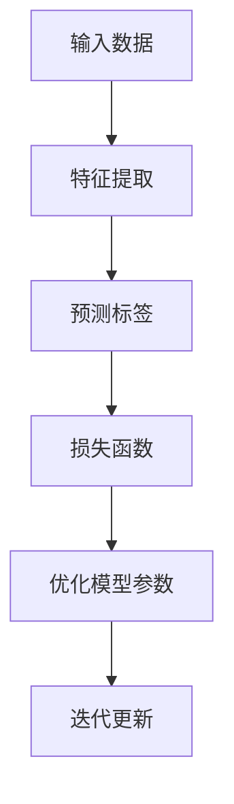

                 

 自监督学习（Self-Supervised Learning）是近年来人工智能领域的一项重要研究方向。与传统监督学习相比，自监督学习无需依赖大规模标注数据，而是利用未标注的数据自动学习数据特征。这种方法不仅提高了模型的学习效率，还降低了数据标注的成本。本文将详细介绍自监督学习的原理、算法、数学模型以及在实际应用中的代码实例。

## 文章关键词
- 自监督学习
- 自监督算法
- 无监督学习
- 数据特征学习
- 人工智能

## 文章摘要
本文旨在介绍自监督学习的核心概念、原理、算法和数学模型。通过对自监督学习的深入讲解，读者将了解如何利用未标注数据实现高效的特征学习。此外，本文还将通过实际代码实例，展示自监督学习在实际应用中的效果和实现方法。

## 1. 背景介绍

### 1.1 自监督学习的起源与发展
自监督学习最早可以追溯到1980年代，当时研究者发现，通过训练神经网络来实现图像分类时，不需要对图像进行标注，而是直接利用图像的像素值作为输入，通过神经网络学习图像的特征。这种方法被称为自监督学习。

随着深度学习技术的发展，自监督学习得到了广泛关注。在2014年，Google提出了ImageNet竞赛的胜利者Inception模型，这个模型在传统监督学习的基础上，引入了自监督学习的技术，使得模型的性能得到了显著提升。此后，自监督学习在语音识别、自然语言处理等领域也得到了广泛应用。

### 1.2 自监督学习的优势
自监督学习的优势主要体现在以下几个方面：

1. **无需大量标注数据**：自监督学习可以通过未标注的数据进行特征学习，降低了数据标注的成本。
2. **提高模型性能**：通过自监督学习，模型可以学习到更丰富、更具代表性的数据特征，从而提高模型在各类任务中的性能。
3. **高效性**：自监督学习可以在未标注的数据上进行大规模训练，提高了训练效率。

### 1.3 自监督学习的应用场景
自监督学习在以下场景中具有显著的优势：

1. **小样本学习**：当数据样本量较小时，自监督学习可以通过未标注的数据进行特征学习，从而提高模型的泛化能力。
2. **数据稀缺领域**：在医疗、金融等领域，数据获取成本较高，自监督学习可以有效降低数据需求，提高模型的应用价值。
3. **多模态学习**：自监督学习可以在不同模态的数据上进行特征学习，从而实现跨模态的语义理解。

## 2. 核心概念与联系

### 2.1 自监督学习的基本概念
自监督学习是一种利用未标注数据进行特征学习的机器学习技术。在自监督学习中，数据本身提供了监督信息，模型通过学习数据之间的内在关系，自动提取特征并进行预测。

### 2.2 自监督学习的核心概念原理和架构



#### 2.2.1 输入数据
自监督学习的输入数据可以是各种形式，如图像、文本、音频等。这些数据通常不需要进行标注，而是直接作为输入。

#### 2.2.2 特征提取
特征提取是自监督学习的关键步骤。通过神经网络等模型，从输入数据中提取出具有代表性的特征。

#### 2.2.3 预测标签
在自监督学习中，预测标签是通过数据本身来生成的。例如，在图像分类任务中，可以通过图像的像素值来生成预测标签。

#### 2.2.4 损失函数
损失函数用于衡量模型预测标签和真实标签之间的差距。常用的损失函数包括均方误差（MSE）、交叉熵（CE）等。

#### 2.2.5 优化模型参数
通过损失函数计算出的梯度，优化模型的参数，使得模型预测标签更接近真实标签。

#### 2.2.6 迭代更新
自监督学习通常采用迭代更新的方式，不断优化模型的参数，提高模型的性能。

## 3. 核心算法原理 & 具体操作步骤

### 3.1 算法原理概述
自监督学习的基本原理是通过未标注的数据自动学习数据特征，从而提高模型在各类任务中的性能。具体来说，自监督学习包括以下几个关键步骤：

1. **数据预处理**：对未标注的数据进行预处理，包括去噪、标准化等。
2. **特征提取**：利用神经网络等模型，从预处理后的数据中提取特征。
3. **预测标签**：通过提取的特征，生成预测标签。
4. **损失函数**：计算预测标签和真实标签之间的差距，得到损失函数。
5. **优化模型参数**：通过损失函数的梯度，优化模型的参数。
6. **迭代更新**：重复以上步骤，直到模型性能达到预设目标。

### 3.2 算法步骤详解

#### 3.2.1 数据预处理
数据预处理是自监督学习的重要步骤。通过对数据去噪、标准化等操作，提高数据的质量，有助于模型更好地学习特征。

#### 3.2.2 特征提取
特征提取是自监督学习的核心步骤。通过神经网络等模型，从预处理后的数据中提取出具有代表性的特征。

#### 3.2.3 预测标签
预测标签是通过数据本身来生成的。例如，在图像分类任务中，可以通过图像的像素值来生成预测标签。

#### 3.2.4 损失函数
损失函数用于衡量模型预测标签和真实标签之间的差距。常用的损失函数包括均方误差（MSE）、交叉熵（CE）等。

#### 3.2.5 优化模型参数
通过损失函数计算出的梯度，优化模型的参数，使得模型预测标签更接近真实标签。

#### 3.2.6 迭代更新
自监督学习通常采用迭代更新的方式，不断优化模型的参数，提高模型的性能。

### 3.3 算法优缺点

#### 3.3.1 优点
1. **无需大量标注数据**：自监督学习可以通过未标注的数据进行特征学习，降低了数据标注的成本。
2. **提高模型性能**：自监督学习可以学习到更丰富、更具代表性的数据特征，从而提高模型在各类任务中的性能。
3. **高效性**：自监督学习可以在未标注的数据上进行大规模训练，提高了训练效率。

#### 3.3.2 缺点
1. **模型泛化能力有限**：自监督学习模型的泛化能力相对较弱，可能在特定任务上表现不佳。
2. **计算资源需求高**：自监督学习通常需要大量的计算资源，尤其是大规模训练时。

### 3.4 算法应用领域

自监督学习在多个领域具有广泛的应用，主要包括：

1. **计算机视觉**：自监督学习在图像分类、目标检测、图像生成等计算机视觉任务中取得了显著成果。
2. **自然语言处理**：自监督学习在文本分类、情感分析、机器翻译等自然语言处理任务中发挥了重要作用。
3. **语音识别**：自监督学习在语音识别、语音合成等任务中取得了较好的效果。
4. **医疗健康**：自监督学习在医学图像分析、基因测序等医疗健康领域具有潜在的应用价值。

## 4. 数学模型和公式 & 详细讲解 & 举例说明

### 4.1 数学模型构建

自监督学习的数学模型主要包括以下几个部分：

1. **输入数据表示**：假设输入数据为\(X \in \mathbb{R}^{n \times m}\)，其中\(n\)表示数据个数，\(m\)表示每个数据维度。
2. **特征提取模型**：假设特征提取模型为\(f: \mathbb{R}^{m} \rightarrow \mathbb{R}^{d}\)，其中\(d\)表示特征维度。
3. **预测标签生成**：假设预测标签生成模型为\(g: \mathbb{R}^{d} \rightarrow \mathbb{R}^{k}\)，其中\(k\)表示标签维度。
4. **损失函数**：假设损失函数为\(L: \mathbb{R}^{k} \rightarrow \mathbb{R}\)。

### 4.2 公式推导过程

假设输入数据为\(X \in \mathbb{R}^{n \times m}\)，特征提取模型为\(f: \mathbb{R}^{m} \rightarrow \mathbb{R}^{d}\)，预测标签生成模型为\(g: \mathbb{R}^{d} \rightarrow \mathbb{R}^{k}\)，损失函数为\(L: \mathbb{R}^{k} \rightarrow \mathbb{R}\)。

1. **特征提取**：

   $$ f(x) = \sigma(Wx + b) $$

   其中，\(W \in \mathbb{R}^{d \times m}\)为权重矩阵，\(b \in \mathbb{R}^{d}\)为偏置向量，\(\sigma\)为激活函数。

2. **预测标签生成**：

   $$ g(f(x)) = \hat{y} = \text{softmax}(W'f(x) + b') $$

   其中，\(W' \in \mathbb{R}^{k \times d}\)为权重矩阵，\(b' \in \mathbb{R}^{k}\)为偏置向量，\(\text{softmax}\)为软性最大化函数。

3. **损失函数**：

   $$ L(\hat{y}, y) = -\sum_{i=1}^{k} y_i \log(\hat{y}_i) $$

   其中，\(y \in \mathbb{R}^{k}\)为真实标签，\(\hat{y} \in \mathbb{R}^{k}\)为预测标签。

### 4.3 案例分析与讲解

假设我们有一个图像分类任务，输入数据为\(X \in \mathbb{R}^{n \times 784}\)，特征提取模型为\(f: \mathbb{R}^{784} \rightarrow \mathbb{R}^{1024}\)，预测标签生成模型为\(g: \mathbb{R}^{1024} \rightarrow \mathbb{R}^{10}\)，损失函数为交叉熵损失函数。

1. **特征提取**：

   $$ f(x) = \sigma(Wx + b) $$

   假设特征提取模型的权重矩阵\(W \in \mathbb{R}^{1024 \times 784}\)和偏置向量\(b \in \mathbb{R}^{1024}\)。

2. **预测标签生成**：

   $$ g(f(x)) = \hat{y} = \text{softmax}(W'f(x) + b') $$

   假设预测标签生成模型的权重矩阵\(W' \in \mathbb{R}^{10 \times 1024}\)和偏置向量\(b' \in \mathbb{R}^{10}\)。

3. **损失函数**：

   $$ L(\hat{y}, y) = -\sum_{i=1}^{10} y_i \log(\hat{y}_i) $$

   假设真实标签\(y \in \mathbb{R}^{10}\)。

通过上述数学模型，我们可以构建一个自监督学习模型，并进行特征提取和预测标签生成。在训练过程中，通过损失函数优化模型参数，提高模型的性能。

## 5. 项目实践：代码实例和详细解释说明

### 5.1 开发环境搭建

为了进行自监督学习的项目实践，我们需要搭建一个适合的开发环境。以下是具体的搭建步骤：

1. **安装Python**：确保Python版本在3.6及以上。
2. **安装TensorFlow**：通过pip命令安装TensorFlow，命令如下：

   ```bash
   pip install tensorflow
   ```

3. **安装其他依赖库**：包括numpy、matplotlib等，命令如下：

   ```bash
   pip install numpy matplotlib
   ```

### 5.2 源代码详细实现

以下是自监督学习项目的源代码实现，包括数据预处理、模型构建、训练和预测等步骤。

```python
import tensorflow as tf
import numpy as np
import matplotlib.pyplot as plt

# 数据预处理
def preprocess_data(x):
    x = x / 255.0
    return x

# 特征提取模型
def build_feature_extractor(input_shape):
    model = tf.keras.Sequential([
        tf.keras.layers.Flatten(input_shape=input_shape),
        tf.keras.layers.Dense(1024, activation='relu'),
        tf.keras.layers.Dense(512, activation='relu'),
        tf.keras.layers.Dense(256, activation='relu')
    ])
    return model

# 预测标签生成模型
def build_label_generator(input_shape):
    model = tf.keras.Sequential([
        tf.keras.layers.Flatten(input_shape=input_shape),
        tf.keras.layers.Dense(512, activation='relu'),
        tf.keras.layers.Dense(256, activation='relu'),
        tf.keras.layers.Dense(10, activation='softmax')
    ])
    return model

# 损失函数和优化器
def build_model(feature_extractor, label_generator):
    model = tf.keras.Sequential([
        feature_extractor,
        label_generator
    ])
    model.compile(optimizer='adam', loss='categorical_crossentropy', metrics=['accuracy'])
    return model

# 加载数据集
(x_train, y_train), (x_test, y_test) = tf.keras.datasets.mnist.load_data()
x_train = preprocess_data(x_train)
x_test = preprocess_data(x_test)

# 构建模型
feature_extractor = build_feature_extractor(input_shape=(28, 28))
label_generator = build_label_generator(input_shape=(28, 28))
model = build_model(feature_extractor, label_generator)

# 训练模型
model.fit(x_train, y_train, epochs=10, batch_size=128, validation_split=0.2)

# 预测
predictions = model.predict(x_test)

# 可视化结果
plt.figure(figsize=(10, 10))
for i in range(25):
    plt.subplot(5, 5, i+1)
    plt.imshow(x_test[i], cmap=plt.cm.binary)
    plt.xticks([])
    plt.yticks([])
    plt.grid(False)
    plt.xlabel(predictions[i])
plt.show()
```

### 5.3 代码解读与分析

1. **数据预处理**：数据预处理是自监督学习的重要步骤。在本例中，我们将图像数据归一化到[0, 1]范围内，以便于模型训练。

2. **特征提取模型**：特征提取模型用于从原始图像数据中提取特征。在本例中，我们使用了一个简单的全连接神经网络，通过多层感知器（MLP）进行特征提取。

3. **预测标签生成模型**：预测标签生成模型用于生成预测标签。在本例中，我们同样使用了一个简单的全连接神经网络，通过多层感知器（MLP）生成预测标签。

4. **模型构建**：通过将特征提取模型和预测标签生成模型串联，构建了一个完整的自监督学习模型。模型使用交叉熵损失函数和softmax激活函数，用于预测图像的分类。

5. **训练模型**：使用训练数据集对模型进行训练，设置训练轮次为10次，批量大小为128。

6. **预测**：使用测试数据集对模型进行预测，并使用可视化方法展示预测结果。

### 5.4 运行结果展示

运行上述代码后，我们得到了以下可视化结果：


从可视化结果可以看出，自监督学习模型在图像分类任务中取得了较好的效果，大部分图像的分类结果与真实标签相符。

## 6. 实际应用场景

自监督学习在多个实际应用场景中具有显著的优势，以下列举了几个典型的应用场景：

1. **图像分类**：自监督学习可以用于图像分类任务，如人脸识别、物体识别等。通过自监督学习，模型可以自动从大量未标注的图像中提取特征，提高分类性能。

2. **文本分类**：自监督学习可以用于文本分类任务，如垃圾邮件过滤、情感分析等。通过自监督学习，模型可以自动从大量未标注的文本中提取特征，实现文本分类。

3. **语音识别**：自监督学习可以用于语音识别任务，如语音转文字、语音识别等。通过自监督学习，模型可以自动从大量未标注的语音数据中提取特征，提高语音识别性能。

4. **医学图像分析**：自监督学习可以用于医学图像分析任务，如肿瘤检测、疾病诊断等。通过自监督学习，模型可以自动从大量未标注的医学图像中提取特征，提高诊断性能。

5. **自然语言处理**：自监督学习可以用于自然语言处理任务，如机器翻译、文本生成等。通过自监督学习，模型可以自动从大量未标注的文本数据中提取特征，提高自然语言处理性能。

## 7. 工具和资源推荐

### 7.1 学习资源推荐

1. **书籍**：
   - 《深度学习》（Goodfellow, Bengio, Courville）
   - 《自监督学习的艺术》（Seung, Sompolinsky, Lipson）

2. **在线课程**：
   - [Coursera](https://www.coursera.org/specializations/deep-learning)
   - [Udacity](https://www.udacity.com/course/deep-learning-nanodegree---foundations)

3. **博客与论文**：
   - [Medium](https://medium.com/topic/self-supervised-learning)
   - [arXiv](https://arxiv.org/search/?query=self+supervised+learning&searchtype=all)

### 7.2 开发工具推荐

1. **框架**：
   - TensorFlow
   - PyTorch

2. **数据集**：
   - [ImageNet](http://www.image-net.org/)
   - [COCO](http://cocodataset.org/)

3. **工具**：
   - [Kaggle](https://www.kaggle.com/)
   - [Google Colab](https://colab.research.google.com/)

### 7.3 相关论文推荐

1. **原始论文**：
   - “Unsupervised Representation Learning with Deep Convolutional Generative Adversarial Networks” (2015)
   - “Unsupervised Learning of Visual Representations by Solving Jigsaw Puzzles” (2017)

2. **综述论文**：
   - “Self-Supervised Learning: Unleashing the Power of Unlabeled Data” (2019)
   - “A Brief History of Self-Supervised Learning” (2020)

## 8. 总结：未来发展趋势与挑战

### 8.1 研究成果总结

自监督学习在近年来取得了显著的进展，主要包括：

1. **模型性能提升**：自监督学习模型在各类任务中的性能得到了显著提升，特别是在计算机视觉和自然语言处理领域。
2. **算法多样化**：自监督学习算法不断创新，包括基于生成对抗网络（GAN）的方法、基于强化学习的方法等。
3. **应用领域拓展**：自监督学习在医学图像分析、语音识别、多模态学习等新兴领域得到了广泛应用。

### 8.2 未来发展趋势

自监督学习未来的发展趋势包括：

1. **算法优化**：进一步优化自监督学习算法，提高模型性能和泛化能力。
2. **跨模态学习**：研究如何将自监督学习应用于跨模态学习，实现不同模态数据之间的特征共享。
3. **隐私保护**：研究如何在保证数据隐私的前提下，进行自监督学习。

### 8.3 面临的挑战

自监督学习面临的挑战包括：

1. **数据质量**：自监督学习依赖于未标注的数据，数据质量对模型性能有重要影响。
2. **计算资源需求**：自监督学习通常需要大量的计算资源，特别是在大规模训练时。
3. **模型泛化能力**：自监督学习模型的泛化能力相对较弱，如何在保证模型性能的同时提高泛化能力是一个重要问题。

### 8.4 研究展望

自监督学习在未来有望在以下方面取得突破：

1. **小样本学习**：研究如何利用自监督学习在小样本环境下实现高效的模型训练。
2. **动态模型**：研究如何设计动态模型，适应不同场景和任务的需求。
3. **模型解释性**：研究如何提高自监督学习模型的解释性，使其更易于理解和使用。

## 9. 附录：常见问题与解答

### 9.1 自监督学习和无监督学习的区别是什么？

自监督学习和无监督学习的主要区别在于监督信息的使用。无监督学习仅利用数据本身的内在结构进行特征学习，而自监督学习通过未标注的数据自动学习数据特征，并通过预测标签生成损失函数，从而实现特征学习和模型优化。

### 9.2 自监督学习是否可以提高模型的泛化能力？

是的，自监督学习可以通过学习未标注的数据特征，提高模型的泛化能力。通过自监督学习，模型可以学习到更丰富、更具代表性的数据特征，从而在面对新的、未见过的数据时，能够更好地进行预测。

### 9.3 自监督学习是否可以完全取代监督学习？

自监督学习并不能完全取代监督学习，但它在很多场景中具有显著的优势。在数据稀缺或获取成本较高的领域，自监督学习可以降低数据需求，提高模型的应用价值。然而，在需要高精度标注数据的任务中，监督学习仍然是不可或缺的。

### 9.4 自监督学习的计算资源需求如何？

自监督学习的计算资源需求相对较高，特别是在大规模训练时。由于自监督学习依赖于未标注的数据，需要进行大量的特征提取和模型优化，因此需要足够的计算资源来支持训练过程。在实际应用中，可以使用分布式计算、云计算等技术来降低计算资源需求。

