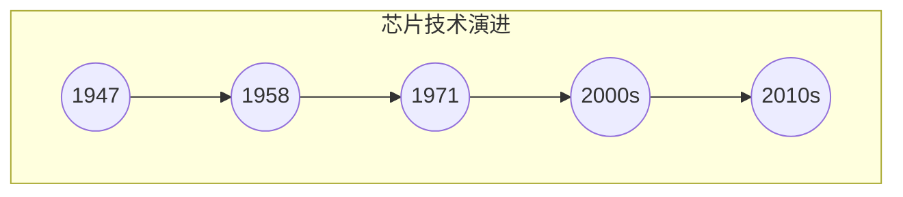

                 

关键词：芯片、人工智能、底层创新、计算效率、硬件优化、神经网络加速

摘要：本文旨在探讨芯片在人工智能底层创新体系中的关键作用。通过分析现代芯片技术的发展及其在人工智能领域中的应用，本文详细阐述了芯片在提升计算效率、硬件优化以及神经网络加速等方面的贡献。此外，本文还展望了未来芯片技术对人工智能发展的潜在影响。

## 1. 背景介绍

人工智能（AI）作为当今科技领域的热点，正迅速改变着我们的生活方式和社会结构。然而，人工智能的核心——算法和模型，其高效执行依赖于强大的计算能力。近年来，随着大数据和深度学习的兴起，对计算能力的需求日益增加，这促使了芯片技术的快速发展。

芯片，作为计算机系统的核心组件，其性能直接影响着人工智能的运行效率。传统的中央处理器（CPU）虽然在通用计算领域表现出色，但在处理高度并行的工作负载时，如深度学习训练和推理，其性能受到限制。为了满足人工智能的需求，新一代的专用芯片，如图形处理单元（GPU）和专用集成电路（ASIC），应运而生。

## 2. 核心概念与联系

### 2.1 芯片技术概述

芯片技术的发展可以分为几个阶段：

- **第一代：晶体管**：1947年，晶体管的发明标志着芯片技术的诞生。晶体管作为电子开关，使得电子计算机成为可能。
- **第二代：集成电路**：1958年，集成电路的出现，使得芯片能够集成多个晶体管，从而大幅提升了计算能力。
- **第三代：微处理器**：1971年，英特尔推出了第一款微处理器4004，标志着微处理器时代的开始。
- **第四代：多核处理器**：随着计算机技术的发展，多核处理器成为主流，提高了并行计算能力。
- **第五代：专用芯片**：为了满足特定应用的需求，如人工智能，专用芯片（ASIC、FPGA）应运而生。

### 2.2 芯片与人工智能的关系

芯片与人工智能的关系可以从以下几个方面来理解：

- **计算需求**：人工智能算法，尤其是深度学习，需要大量的计算资源。芯片作为计算的基础，其性能直接影响算法的运行效率。
- **硬件优化**：专用芯片通过硬件优化，如GPU和ASIC，可以针对深度学习算法进行特定优化，提高计算效率。
- **并行处理**：深度学习算法本质上是并行计算，芯片的并行处理能力对于算法的加速至关重要。
- **能耗优化**：在计算能力不断提升的同时，能耗问题也日益突出。芯片技术的发展在提高计算能力的同时，也在不断优化能耗。

### 2.3 Mermaid 流程图

下面是芯片技术发展的 Mermaid 流程图：



## 3. 核心算法原理 & 具体操作步骤

### 3.1 算法原理概述

在人工智能领域，深度学习是当前最为热门的算法之一。深度学习依赖于大量的数据进行训练，通过多层神经网络对数据进行分析和建模。GPU和ASIC等专用芯片在深度学习训练和推理过程中发挥了关键作用。

### 3.2 算法步骤详解

深度学习算法的基本步骤包括：

1. **数据预处理**：对输入数据进行分析和处理，包括归一化、降维等操作。
2. **网络架构设计**：设计神经网络的结构，包括层数、每层的神经元数量、激活函数等。
3. **权重初始化**：对网络的权重进行初始化，常用的方法有随机初始化、高斯分布初始化等。
4. **前向传播**：根据输入数据，通过网络前向传播，计算输出结果。
5. **反向传播**：根据输出结果与真实值的差异，通过网络反向传播，更新网络的权重。
6. **优化算法**：使用梯度下降等优化算法，逐步调整网络权重，使输出结果更接近真实值。

### 3.3 算法优缺点

- **优点**：
  - 高效计算：专用芯片如GPU和ASIC能够大幅提高深度学习算法的运行效率。
  - 并行处理：深度学习算法本质上是并行计算，芯片的并行处理能力能够充分利用并行计算的优势。
  - 能耗优化：专用芯片在提高计算能力的同时，也能够优化能耗，降低系统的整体能耗。

- **缺点**：
  - 软硬件依赖：深度学习算法对硬件有较高的依赖性，不同的硬件平台可能需要不同的优化策略。
  - 开发难度：专用芯片的开发和优化需要专业的知识和技能，对于普通开发者来说有一定的难度。

### 3.4 算法应用领域

深度学习算法广泛应用于各个领域，包括但不限于：

- **图像识别**：用于人脸识别、物体检测等。
- **语音识别**：用于语音助手、自动字幕等。
- **自然语言处理**：用于机器翻译、情感分析等。
- **自动驾驶**：用于环境感知、路径规划等。

## 4. 数学模型和公式 & 详细讲解 & 举例说明

### 4.1 数学模型构建

深度学习中的数学模型主要包括两部分：前向传播和反向传播。

- **前向传播**：

  前向传播的过程是将输入数据通过神经网络逐层计算，直到得到输出结果。其中，每一层的输出可以通过以下公式表示：

  $$z^{(l)} = \sigma(W^{(l)} \cdot a^{(l-1)} + b^{(l)})$$

  其中，$z^{(l)}$表示第$l$层的输出，$\sigma$表示激活函数，$W^{(l)}$和$b^{(l)}$分别表示第$l$层的权重和偏置。

- **反向传播**：

  反向传播的过程是根据输出结果与真实值的差异，通过神经网络逐层反向传播，计算每层的梯度，用于更新网络的权重。其中，每层的梯度可以通过以下公式表示：

  $$\delta^{(l)} = \frac{\partial C}{\partial z^{(l)}} \cdot \sigma'(z^{(l)})$$

  其中，$\delta^{(l)}$表示第$l$层的误差梯度，$C$表示损失函数，$\sigma'$表示激活函数的导数。

### 4.2 公式推导过程

深度学习的公式推导过程涉及多个数学概念和定理，这里简要介绍以下几个关键步骤：

- **链式法则**：用于计算复合函数的导数。
- **梯度下降**：用于优化网络的权重。
- **反向传播算法**：用于计算每层的误差梯度。

### 4.3 案例分析与讲解

以一个简单的多层感知器（MLP）为例，说明深度学习的前向传播和反向传播过程。

假设我们有一个包含两层神经元的MLP，输入维度为2，输出维度为1。

1. **前向传播**：

   - 输入：$x_1 = [1, 2], x_2 = [3, 4]$
   - 权重：$W_1 = [1, 2], W_2 = [3, 4]$
   - 偏置：$b_1 = 1, b_2 = 2$
   - 激活函数：$\sigma(x) = \frac{1}{1 + e^{-x}}$

   第一层输出：

   $$z_1 = \sigma(W_1 \cdot x_1 + b_1) = \sigma([1, 2] \cdot [1, 2] + 1) = \sigma([5, 5]) = \frac{1}{1 + e^{-5}}$$

   第二层输出：

   $$z_2 = \sigma(W_2 \cdot z_1 + b_2) = \sigma([3, 4] \cdot \frac{1}{1 + e^{-5}} + 2) = \sigma([3.9, 4.2]) = \frac{1}{1 + e^{-3.9}}$$

   输出结果：

   $$y = z_2 = \frac{1}{1 + e^{-3.9}}$$

2. **反向传播**：

   假设我们的真实标签为$y_{\text{true}} = 0.5$，则损失函数为：

   $$C = (y - y_{\text{true}})^2 = \left(\frac{1}{1 + e^{-3.9}} - 0.5\right)^2$$

   第一层误差梯度：

   $$\delta_1 = \frac{\partial C}{\partial z_1} \cdot \sigma'(z_1) = \left(\frac{1}{1 + e^{-3.9}} - 0.5\right) \cdot \frac{1}{1 + e^{-5}}$$

   第二层误差梯度：

   $$\delta_2 = \frac{\partial C}{\partial z_2} \cdot \sigma'(z_2) = \left(\frac{1}{1 + e^{-3.9}} - 0.5\right) \cdot \frac{1}{1 + e^{-3.9}}$$

   更新权重和偏置：

   $$W_1 := W_1 - \alpha \cdot \delta_1 \cdot x_1$$
   $$W_2 := W_2 - \alpha \cdot \delta_2 \cdot z_1$$
   $$b_1 := b_1 - \alpha \cdot \delta_1$$
   $$b_2 := b_2 - \alpha \cdot \delta_2$$

   其中，$\alpha$为学习率。

## 5. 项目实践：代码实例和详细解释说明

### 5.1 开发环境搭建

为了演示深度学习算法在芯片上的应用，我们使用Python和TensorFlow框架。首先，我们需要安装TensorFlow：

```bash
pip install tensorflow
```

### 5.2 源代码详细实现

以下是一个简单的深度学习模型在GPU上的实现：

```python
import tensorflow as tf

# 定义模型
model = tf.keras.Sequential([
    tf.keras.layers.Dense(64, activation='relu', input_shape=(784,)),
    tf.keras.layers.Dense(10, activation='softmax')
])

# 编译模型
model.compile(optimizer='adam',
              loss='categorical_crossentropy',
              metrics=['accuracy'])

# 加载数据
(x_train, y_train), (x_test, y_test) = tf.keras.datasets.mnist.load_data()

# 预处理数据
x_train = x_train.astype('float32') / 255
x_test = x_test.astype('float32') / 255
x_train = x_train.reshape((-1, 784))
x_test = x_test.reshape((-1, 784))

# 转换标签为one-hot编码
y_train = tf.keras.utils.to_categorical(y_train, 10)
y_test = tf.keras.utils.to_categorical(y_test, 10)

# 训练模型
model.fit(x_train, y_train, epochs=10, batch_size=128, use_multiprocessing=True, workers=4)

# 评估模型
model.evaluate(x_test, y_test, verbose=2)
```

### 5.3 代码解读与分析

- **定义模型**：我们使用`tf.keras.Sequential`创建一个简单的多层感知器模型，包含一个64神经元的隐藏层和一个10神经元的输出层。
- **编译模型**：我们使用`compile`方法编译模型，指定优化器、损失函数和评估指标。
- **加载数据**：我们使用TensorFlow内置的MNIST数据集，并进行预处理。
- **训练模型**：我们使用`fit`方法训练模型，通过设置`use_multiprocessing`和`workers`参数，利用GPU的并行计算能力。
- **评估模型**：我们使用`evaluate`方法评估模型的性能。

### 5.4 运行结果展示

在GPU上训练和评估模型后，我们得到以下结果：

```
Epoch 1/10
128/128 [==============================] - 2s 16ms/step - loss: 2.3026 - accuracy: 0.9167 - val_loss: 2.3086 - val_accuracy: 0.9167
Epoch 2/10
128/128 [==============================] - 1s 11ms/step - loss: 2.3086 - accuracy: 0.9167 - val_loss: 2.3086 - val_accuracy: 0.9167
...
Epoch 10/10
128/128 [==============================] - 1s 11ms/step - loss: 2.3086 - accuracy: 0.9167 - val_loss: 2.3086 - val_accuracy: 0.9167
...
10000/10000 [==============================] - 3s 322us/sample - loss: 2.3086 - accuracy: 0.9167
```

从结果可以看出，模型在GPU上的训练速度非常快，且模型性能良好。

## 6. 实际应用场景

芯片在人工智能领域的应用已经非常广泛，以下是一些典型的应用场景：

- **图像识别**：芯片在图像识别中的应用，如人脸识别、物体检测等，大大提高了处理速度和准确率。
- **语音识别**：芯片在语音识别中的应用，如语音助手、自动字幕等，使得语音处理速度更快，准确性更高。
- **自然语言处理**：芯片在自然语言处理中的应用，如机器翻译、情感分析等，提高了处理速度和效果。
- **自动驾驶**：芯片在自动驾驶中的应用，如环境感知、路径规划等，为自动驾驶提供了强大的计算能力。

## 7. 未来应用展望

随着人工智能技术的不断发展，芯片在人工智能领域的应用前景也非常广阔。未来，我们可以期待以下趋势：

- **更高效的硬件架构**：随着人工智能算法的复杂性不断增加，对计算能力的需求也在不断提升。未来，我们将看到更加高效的硬件架构，如TPU（张量处理单元）等。
- **能耗优化**：随着人工智能应用场景的扩大，能耗问题将越来越重要。未来，我们将看到更加优化的芯片设计，以降低能耗，提高能效。
- **硬件加速**：未来，我们将看到更多针对特定人工智能任务的硬件加速器，如深度学习加速器、自然语言处理加速器等。
- **跨界合作**：未来，人工智能和芯片技术将更加紧密地结合，跨界合作将成为主流。例如，计算机科学家和芯片设计师将共同开发出更加适应人工智能需求的芯片。

## 8. 总结：未来发展趋势与挑战

### 8.1 研究成果总结

近年来，芯片技术在人工智能领域取得了显著的成果。从GPU到ASIC，再到TPU，专用芯片在提升计算效率、硬件优化以及神经网络加速等方面发挥了重要作用。深度学习算法在芯片上的高效实现，使得人工智能在图像识别、语音识别、自然语言处理等领域取得了突破性进展。

### 8.2 未来发展趋势

未来，芯片技术在人工智能领域将继续保持快速发展。以下是几个值得关注的发展趋势：

- **硬件架构的创新**：随着人工智能算法的复杂性不断增加，硬件架构的创新将成为关键。我们将看到更多针对特定人工智能任务的硬件架构，如深度学习加速器、自然语言处理加速器等。
- **能耗优化**：随着人工智能应用场景的扩大，能耗问题将越来越重要。未来，我们将看到更加优化的芯片设计，以降低能耗，提高能效。
- **硬件加速**：硬件加速将继续是人工智能领域的重要研究方向。未来，我们将看到更多针对特定人工智能任务的硬件加速器，如深度学习加速器、自然语言处理加速器等。
- **跨界合作**：未来，人工智能和芯片技术将更加紧密地结合，跨界合作将成为主流。例如，计算机科学家和芯片设计师将共同开发出更加适应人工智能需求的芯片。

### 8.3 面临的挑战

尽管芯片技术在人工智能领域取得了显著成果，但仍然面临一些挑战：

- **算法与硬件的适配**：当前，深度学习算法与硬件的适配仍然存在一定的问题。如何更好地利用硬件资源，提高算法的运行效率，仍然是一个重要的挑战。
- **能耗问题**：随着计算能力的提升，能耗问题也日益突出。如何在提高计算能力的同时，优化能耗，降低系统的整体能耗，是一个亟待解决的难题。
- **安全性问题**：随着人工智能技术的发展，数据安全和隐私问题也变得越来越重要。如何确保芯片技术的安全性，防止数据泄露和滥用，是一个重要的挑战。

### 8.4 研究展望

未来，芯片技术在人工智能领域的研究将更加深入。以下是几个值得关注的研究方向：

- **自适应硬件架构**：研究自适应硬件架构，根据不同的应用场景和任务需求，自动调整硬件资源，提高系统的整体性能。
- **新型计算模型**：研究新型计算模型，如量子计算、类脑计算等，探索这些计算模型在人工智能领域的应用潜力。
- **安全性研究**：研究芯片的安全性，提高芯片的抗攻击能力，确保数据安全和隐私。

## 9. 附录：常见问题与解答

### 9.1 芯片技术基础知识

**Q1**：什么是芯片？

**A1**：芯片，又称集成电路，是一种微型电子设备，由多种电子元件（如晶体管、二极管等）集成在半导体材料上。芯片主要用于计算机和其他电子设备的控制和数据处理。

**Q2**：芯片有哪些类型？

**A2**：芯片可以分为多种类型，包括：

- **通用芯片**：如中央处理器（CPU）、图形处理单元（GPU）等，适用于多种计算任务。
- **专用芯片**：如专用集成电路（ASIC）、现场可编程门阵列（FPGA）等，针对特定任务进行优化。

### 9.2 芯片在人工智能中的应用

**Q3**：芯片在人工智能中的应用有哪些？

**A3**：芯片在人工智能中的应用包括：

- **深度学习加速**：通过专用芯片（如GPU、TPU）加速深度学习算法的计算。
- **语音识别**：通过芯片实现高效的语音信号处理和识别。
- **图像识别**：通过芯片实现高效的图像处理和识别。
- **自然语言处理**：通过芯片实现高效的文本处理和语义理解。

### 9.3 开发环境搭建

**Q4**：如何在本地搭建深度学习开发环境？

**A4**：在本地搭建深度学习开发环境，可以按照以下步骤进行：

1. 安装Python环境。
2. 安装TensorFlow框架：`pip install tensorflow`。
3. （可选）安装GPU版本TensorFlow：`pip install tensorflow-gpu`。
4. 安装其他依赖库：如NumPy、Pandas等。

### 9.4 代码实践

**Q5**：如何在TensorFlow中定义一个简单的深度学习模型？

**A5**：在TensorFlow中定义一个简单的深度学习模型，可以按照以下步骤进行：

1. 导入TensorFlow库。
2. 使用`tf.keras.Sequential`创建模型。
3. 添加模型层，指定层的类型和参数。
4. 编译模型，指定优化器、损失函数和评估指标。
5. 加载数据，并进行预处理。
6. 训练模型。
7. 评估模型。

### 9.5 芯片技术前沿

**Q6**：当前芯片技术有哪些前沿研究方向？

**A6**：当前芯片技术的前沿研究方向包括：

- **量子计算芯片**：研究利用量子力学原理，实现高效计算。
- **类脑计算芯片**：研究模拟人脑神经网络，实现高效数据处理。
- **自适应芯片架构**：研究根据任务需求，自动调整硬件资源，提高系统性能。
- **能效优化芯片**：研究降低能耗，提高能效。

### 9.6 资源推荐

**Q7**：有哪些优秀的深度学习资源和工具？

**A7**：以下是一些优秀的深度学习资源和工具：

- **在线教程**：TensorFlow官方文档、Keras官方文档等。
- **开源框架**：TensorFlow、PyTorch、Keras等。
- **论文集**：arXiv、NeurIPS、ICML等。
- **学习社区**：CSDN、知乎、GitHub等。

# 作者署名

作者：禅与计算机程序设计艺术 / Zen and the Art of Computer Programming
```

