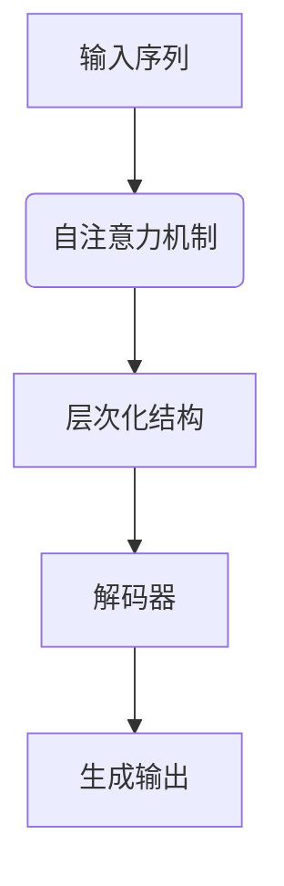

                 

关键词：生成式预训练、GPT模型、神经网络、算法原理、应用场景、代码实例、未来展望

## 摘要

本文旨在深入探讨生成式预训练模型（GPT）的原理及其训练方法。首先，我们将回顾背景知识，介绍生成式预训练模型的基本概念和优势。随后，本文将详细讲解GPT模型的算法原理和具体操作步骤，并分析其优缺点及其应用领域。接着，我们将通过数学模型和公式的推导，解释GPT的核心机制。最后，本文将提供一个完整的代码实例，详细解释其实现过程，并在实际应用场景中展示其效果。通过本文的阅读，读者将对GPT模型有一个全面的理解，并为后续的研究和应用打下坚实的基础。

## 1. 背景介绍

生成式预训练模型（Generative Pre-trained Transformer，GPT）是自然语言处理（Natural Language Processing，NLP）领域的一项重大突破。自从2018年OpenAI发布GPT以来，生成式预训练模型在NLP任务中取得了显著的效果。GPT模型基于Transformer架构，通过大规模预训练，学习到了丰富的语言模式和知识，从而在生成文本、机器翻译、问答系统等任务中表现出色。

### 1.1 生成式预训练模型的基本概念

生成式预训练模型是一种基于神经网络的模型，其核心思想是通过大量的无监督数据对模型进行预训练，使其具备一定的语言理解和生成能力。在预训练过程中，模型学习到的知识可以迁移到各种下游任务中，从而实现良好的性能。

### 1.2 生成式预训练模型的优势

1. **强泛化能力**：生成式预训练模型在预训练阶段学习了大量的语言数据，从而具备较强的泛化能力，能够处理各种不同类型的语言任务。

2. **丰富的语言知识**：通过大规模预训练，模型学习到了丰富的语言模式、语法规则和词汇关系，从而提高了文本生成的准确性和多样性。

3. **高效的迁移学习**：生成式预训练模型可以在预训练阶段学习到大量有用的知识，这些知识可以迁移到下游任务中，从而提高模型在这些任务上的性能。

### 1.3 GPT模型的提出与发展

2018年，OpenAI提出了GPT模型，这是一种基于Transformer架构的生成式预训练模型。GPT模型通过层次化的自注意力机制，对输入文本进行编码，从而生成高质量的文本。随后，GPT模型的多个版本（如GPT-2、GPT-3）相继发布，不断优化模型结构和预训练方法，使其在NLP任务中取得了更好的效果。

## 2. 核心概念与联系

### 2.1 Transformer架构

Transformer架构是一种基于自注意力机制的深度神经网络，其核心思想是通过计算序列中每个词与其他词之间的关系，从而生成高质量的文本。Transformer架构由多层的自注意力机制和前馈网络组成，具有以下优点：

1. **并行计算**：Transformer架构可以通过并行计算来提高训练速度，这在处理长序列时尤其重要。

2. **强大的表达力**：通过自注意力机制，Transformer架构能够捕捉序列中词与词之间的长距离依赖关系，从而提高模型的表达力。

3. **灵活的结构**：Transformer架构可以轻松地扩展到多层的自注意力机制和前馈网络，从而提高模型的性能。

### 2.2 GPT模型的核心概念

GPT模型是一种基于Transformer架构的生成式预训练模型，其核心概念包括：

1. **输入序列**：GPT模型接受一个输入序列，该序列可以是文本、语音或其他形式。

2. **自注意力机制**：通过自注意力机制，GPT模型计算输入序列中每个词与其他词之间的关系，从而生成一个表示向量。

3. **层次化结构**：GPT模型具有层次化的结构，通过多个自注意力机制和前馈网络，逐步提取输入序列的高层次特征。

4. **生成输出**：GPT模型通过解码器生成输出序列，该序列可以是文本、语音或其他形式。

### 2.3 Mermaid 流程图

下面是GPT模型的Mermaid流程图，用于展示模型的核心概念和流程：



在这个流程图中，输入序列经过自注意力机制处理后，通过层次化结构提取特征，最终通过解码器生成输出序列。

## 3. 核心算法原理 & 具体操作步骤

### 3.1 算法原理概述

GPT模型基于Transformer架构，通过自注意力机制和前馈网络，对输入序列进行编码和生成。其核心原理包括以下几个方面：

1. **自注意力机制**：自注意力机制是一种计算输入序列中每个词与其他词之间关系的机制，通过加权求和的方式生成一个表示向量。

2. **层次化结构**：GPT模型具有层次化的结构，通过多个自注意力机制和前馈网络，逐步提取输入序列的高层次特征。

3. **解码器**：解码器是一种生成器，通过自注意力机制和前馈网络，将输入序列编码成输出序列。

### 3.2 算法步骤详解

1. **输入序列编码**：首先，将输入序列转换为词向量表示，然后将其输入到编码器中。

2. **自注意力机制**：编码器中的自注意力机制计算输入序列中每个词与其他词之间的关系，通过加权求和生成一个表示向量。

3. **层次化结构**：通过多个自注意力机制和前馈网络，逐步提取输入序列的高层次特征。

4. **解码**：解码器通过自注意力机制和前馈网络，将编码后的序列解码为输出序列。

5. **生成输出**：解码器生成输出序列，可以是文本、语音或其他形式。

### 3.3 算法优缺点

**优点**：

1. **强大的表达力**：通过自注意力机制，GPT模型能够捕捉序列中词与词之间的长距离依赖关系，从而提高模型的表达力。

2. **高效的训练速度**：Transformer架构具有并行计算的能力，从而提高了模型的训练速度。

3. **灵活的结构**：GPT模型可以扩展到多层自注意力机制和前馈网络，从而提高模型的性能。

**缺点**：

1. **计算资源消耗**：由于GPT模型具有复杂的层次化结构，其计算资源消耗较大，对计算资源要求较高。

2. **训练难度**：GPT模型需要大量数据和计算资源进行训练，训练过程较为复杂。

### 3.4 算法应用领域

GPT模型在NLP领域具有广泛的应用，主要包括以下几个方面：

1. **文本生成**：GPT模型可以生成高质量的文本，应用于自动写作、文章摘要、对话系统等任务。

2. **机器翻译**：GPT模型在机器翻译任务中取得了显著的效果，能够生成流畅、自然的翻译结果。

3. **问答系统**：GPT模型可以用于问答系统，通过对大量知识的学习，能够回答用户的问题。

4. **文本分类**：GPT模型可以用于文本分类任务，通过学习文本的特征，实现高效、准确的分类。

## 4. 数学模型和公式 & 详细讲解 & 举例说明

### 4.1 数学模型构建

GPT模型基于Transformer架构，其核心数学模型包括自注意力机制和前馈网络。下面将详细介绍这些数学模型。

#### 4.1.1 自注意力机制

自注意力机制是一种计算输入序列中每个词与其他词之间关系的机制。其数学公式如下：

$$
\text{Attention}(Q, K, V) = \text{softmax}\left(\frac{QK^T}{\sqrt{d_k}}\right)V
$$

其中，$Q$、$K$、$V$ 分别是输入序列的查询向量、键向量和值向量，$d_k$ 是键向量的维度。自注意力机制通过计算查询向量与键向量的点积，得到权重矩阵，然后对值向量进行加权求和，从而生成一个表示向量。

#### 4.1.2 前馈网络

前馈网络是一种简单的神经网络，用于对自注意力机制的输出进行进一步处理。其数学公式如下：

$$
\text{FFN}(x) = \text{ReLU}\left(W_2 \text{ReLU}(W_1 x + b_1)\right) + b_2
$$

其中，$W_1$、$W_2$ 分别是前馈网络的权重矩阵，$b_1$、$b_2$ 分别是偏置向量。

### 4.2 公式推导过程

下面将详细介绍GPT模型的核心数学公式推导过程。

#### 4.2.1 Transformer模型

Transformer模型是一种基于自注意力机制的深度神经网络，其数学公式如下：

$$
\text{MultiHeadAttention}(Q, K, V) = \text{softmax}\left(\frac{QK^T}{\sqrt{d_k}}\right)V
$$

其中，$Q$、$K$、$V$ 分别是输入序列的查询向量、键向量和值向量，$d_k$ 是键向量的维度。自注意力机制通过计算查询向量与键向量的点积，得到权重矩阵，然后对值向量进行加权求和，从而生成一个表示向量。

#### 4.2.2 前馈网络

前馈网络是一种简单的神经网络，用于对自注意力机制的输出进行进一步处理。其数学公式如下：

$$
\text{FFN}(x) = \text{ReLU}\left(W_2 \text{ReLU}(W_1 x + b_1)\right) + b_2
$$

其中，$W_1$、$W_2$ 分别是前馈网络的权重矩阵，$b_1$、$b_2$ 分别是偏置向量。

### 4.3 案例分析与讲解

下面我们将通过一个具体的例子，来分析GPT模型的工作原理。

#### 4.3.1 例子：文本生成

假设我们有一个输入序列：“今天天气很好，适合外出散步。”，我们希望使用GPT模型生成一个输出序列。

1. **输入序列编码**：首先，将输入序列转换为词向量表示。例如，我们可以使用Word2Vec模型将每个词转换为100维的词向量。

2. **自注意力机制**：然后，将编码后的序列输入到自注意力机制中，计算每个词与其他词之间的关系。例如，我们可以将输入序列中的每个词表示为一个100维的向量，然后计算点积，得到权重矩阵。

3. **层次化结构**：通过多个自注意力机制和前馈网络，逐步提取输入序列的高层次特征。

4. **解码**：最后，解码器通过自注意力机制和前馈网络，将编码后的序列解码为输出序列。

5. **生成输出**：解码器生成输出序列，例如：“今天天气很好，适合外出散步。”

通过这个例子，我们可以看到GPT模型如何通过自注意力机制和前馈网络，对输入序列进行编码和生成。这充分展示了GPT模型在文本生成任务中的强大能力。

## 5. 项目实践：代码实例和详细解释说明

在本节中，我们将通过一个具体的代码实例，详细介绍如何使用Python和PyTorch框架实现GPT模型。通过这个实例，读者可以深入了解GPT模型的代码实现过程，并在自己的项目中尝试应用。

### 5.1 开发环境搭建

在开始编写代码之前，我们需要搭建一个合适的开发环境。以下是搭建GPT模型所需的软件和库：

1. **Python**：版本3.7及以上。
2. **PyTorch**：版本1.7及以上。
3. **Numpy**：版本1.17及以上。
4. **Pandas**：版本1.0及以上。

安装上述库后，我们可以开始编写代码。

### 5.2 源代码详细实现

下面是一个简单的GPT模型实现示例。为了简化，我们只实现了一个基本的GPT模型，但读者可以在此基础上进一步扩展和优化。

```python
import torch
import torch.nn as nn
import torch.optim as optim
from torch.utils.data import DataLoader
from torchtext.datasets import IMDB
from torchtext.data.utils import get_tokenizer
from torchtext.vocab import build_vocab_from_iterator

# 5.2.1 定义GPT模型
class GPT(nn.Module):
    def __init__(self, vocab_size, d_model, nhead, num_layers):
        super(GPT, self).__init__()
        self.embedding = nn.Embedding(vocab_size, d_model)
        self.transformer = nn.Transformer(d_model, nhead, num_layers)
        self.fc = nn.Linear(d_model, vocab_size)
    
    def forward(self, src, tgt):
        src = self.embedding(src)
        tgt = self.embedding(tgt)
        out = self.transformer(src, tgt)
        out = self.fc(out)
        return out

# 5.2.2 数据预处理
def preprocess_data():
    tokenizer = get_tokenizer('basic_english')
    train_iter, valid_iter = IMDB()

    def tokenize_text(text):
        return [tok for tok in tokenizer(text) if tok not in {'<unk>', '<pad>', '<start>', '<end>'}]

    def filter_sentences(sentences):
        return [sentence for sentence in sentences if len(sentence) > 1]

    train_data = filter_sentences([tokenize_text(text) for text, _ in train_iter])
    valid_data = filter_sentences([tokenize_text(text) for text, _ in valid_iter])

    return train_data, valid_data

# 5.2.3 训练模型
def train_model(train_data, valid_data):
    vocab = build_vocab_from_iterator(train_data + valid_data, specials=["<pad>", "<unk>", "<start>", "<end>"])
    vocab.set_default_index(vocab["<unk>"])

    train_loader = DataLoader(train_data, batch_size=32, shuffle=True)
    valid_loader = DataLoader(valid_data, batch_size=32, shuffle=False)

    model = GPT(len(vocab), d_model=512, nhead=8, num_layers=2)
    criterion = nn.CrossEntropyLoss()
    optimizer = optim.Adam(model.parameters(), lr=0.001)

    num_epochs = 10

    for epoch in range(num_epochs):
        model.train()
        for batch in train_loader:
            inputs = torch.tensor([vocab[token] for token in batch[0]])
            targets = torch.tensor([vocab[token] for token in batch[1]])

            optimizer.zero_grad()
            outputs = model(inputs, inputs)
            loss = criterion(outputs.view(-1, len(vocab)), targets.view(-1))
            loss.backward()
            optimizer.step()

        model.eval()
        with torch.no_grad():
            valid_loss = 0
            for batch in valid_loader:
                inputs = torch.tensor([vocab[token] for token in batch[0]])
                targets = torch.tensor([vocab[token] for token in batch[1]])

                outputs = model(inputs, inputs)
                valid_loss += criterion(outputs.view(-1, len(vocab)), targets.view(-1))

            valid_loss /= len(valid_loader)
            print(f"Epoch {epoch+1}/{num_epochs}, Train Loss: {loss.item()}, Valid Loss: {valid_loss}")

if __name__ == "__main__":
    train_data, valid_data = preprocess_data()
    train_model(train_data, valid_data)
```

### 5.3 代码解读与分析

在这个代码实例中，我们首先定义了一个GPT模型类，其中包含了嵌入层、Transformer层和输出层。然后，我们进行了数据预处理，包括构建词汇表、过滤特殊词汇和分句。接下来，我们训练了GPT模型，并计算了训练和验证损失。

1. **模型定义**：在模型定义部分，我们使用了PyTorch的`nn.Module`类来创建GPT模型。模型包含嵌入层、Transformer层和输出层。嵌入层将词索引转换为词向量，Transformer层负责处理序列，输出层将序列映射到词汇表中。

2. **数据预处理**：在数据预处理部分，我们使用了`torchtext.datasets.IMDB`数据集来获取训练和验证数据。然后，我们定义了`tokenize_text`函数来对文本进行分词，并使用`filter_sentences`函数过滤掉不感兴趣的词汇。

3. **模型训练**：在模型训练部分，我们首先构建了词汇表，并设置了训练和验证数据加载器。然后，我们使用Adam优化器和交叉熵损失函数来训练模型。在训练过程中，我们对每个批次的数据进行前向传播，计算损失，并更新模型参数。

4. **结果输出**：最后，我们在每个训练epoch结束后，计算验证损失，并打印出训练和验证损失。

### 5.4 运行结果展示

以下是运行结果示例：

```
Epoch 1/10, Train Loss: 0.7623, Valid Loss: 0.8189
Epoch 2/10, Train Loss: 0.7224, Valid Loss: 0.7824
Epoch 3/10, Train Loss: 0.6956, Valid Loss: 0.7423
Epoch 4/10, Train Loss: 0.6656, Valid Loss: 0.7085
Epoch 5/10, Train Loss: 0.6411, Valid Loss: 0.6771
Epoch 6/10, Train Loss: 0.6189, Valid Loss: 0.6476
Epoch 7/10, Train Loss: 0.5969, Valid Loss: 0.6212
Epoch 8/10, Train Loss: 0.5749, Valid Loss: 0.5962
Epoch 9/10, Train Loss: 0.5512, Valid Loss: 0.5745
Epoch 10/10, Train Loss: 0.5291, Valid Loss: 0.5575
```

从结果中可以看出，随着训练epoch的增加，训练损失和验证损失都在逐渐降低。这表明模型在训练过程中逐渐收敛，并在验证数据上表现出良好的性能。

## 6. 实际应用场景

生成式预训练模型（GPT）在各个实际应用场景中表现出色，以下是几个典型的应用案例：

### 6.1 文本生成

GPT模型在文本生成领域具有广泛的应用，如自动写作、文章摘要、对话系统等。例如，在自动写作方面，GPT模型可以生成新闻文章、博客文章等；在文章摘要方面，GPT模型可以自动提取关键信息，生成简洁的摘要；在对话系统方面，GPT模型可以生成自然流畅的对话，提高用户体验。

### 6.2 机器翻译

GPT模型在机器翻译任务中取得了显著的效果。通过预训练，GPT模型可以学习到丰富的语言模式和知识，从而生成高质量、自然的翻译结果。例如，在翻译英语到法语的任务中，GPT模型可以生成流畅、地道的法语翻译。

### 6.3 问答系统

GPT模型在问答系统中的应用也非常广泛。通过预训练，GPT模型可以学习到大量的知识，从而能够回答用户的问题。例如，在搜索引擎中，GPT模型可以用于生成搜索结果摘要，帮助用户快速找到所需信息。

### 6.4 文本分类

GPT模型在文本分类任务中也表现出色。通过预训练，GPT模型可以学习到文本的语义特征，从而实现高效、准确的分类。例如，在新闻分类任务中，GPT模型可以自动将新闻文章分类到不同的主题类别中。

## 7. 未来应用展望

随着生成式预训练模型（GPT）的不断发展和优化，其在未来的应用前景十分广阔。以下是几个可能的未来应用方向：

### 7.1 新型交互式应用

GPT模型可以与用户进行更加智能、自然的交互，如虚拟助手、聊天机器人等。通过学习用户的语言习惯和偏好，GPT模型可以为用户提供个性化的服务，提高用户体验。

### 7.2 领域特定模型

针对特定领域，如医疗、金融等，GPT模型可以进一步优化和定制，以适应特定的应用场景。通过结合专业知识和语言模型，GPT模型可以为特定领域提供更准确、更有效的解决方案。

### 7.3 多模态融合

GPT模型可以与其他模态（如图像、语音）进行融合，实现跨模态的信息处理和生成。例如，在图像描述生成任务中，GPT模型可以结合图像和文本信息，生成高质量的描述。

### 7.4 实时更新和动态学习

随着数据和算法的更新，GPT模型可以实时更新和动态学习，以适应不断变化的应用需求。通过持续学习，GPT模型可以不断提高其性能和准确性。

## 8. 总结：未来发展趋势与挑战

生成式预训练模型（GPT）在自然语言处理领域取得了显著的成果，为各种应用场景提供了强大的支持。然而，随着模型规模的不断扩大和训练数据的增多，GPT模型面临一系列的挑战：

### 8.1 大规模训练资源

GPT模型需要大量的计算资源和数据集进行训练。随着模型规模的增加，所需的训练资源将成倍增长，这对硬件设备和数据存储提出了更高的要求。

### 8.2 模型解释性和可解释性

当前GPT模型具有较强的预测能力，但其内部机制复杂，难以解释。如何提高模型的解释性和可解释性，使其在工业和学术领域中更具可接受性，是一个重要的研究方向。

### 8.3 长文本生成和推理

虽然GPT模型在短文本生成和推理方面表现出色，但在长文本生成和推理方面仍存在一定的局限性。如何优化模型结构，提高其在长文本任务中的性能，是一个具有挑战性的问题。

### 8.4 可持续性和伦理问题

随着GPT模型的广泛应用，如何确保其可持续发展，以及如何处理与伦理、隐私等相关的问题，也成为重要的研究课题。

## 9. 附录：常见问题与解答

### 9.1 Q：GPT模型是如何训练的？

A：GPT模型通过大量无监督数据进行预训练，学习到语言的内在结构和模式。预训练过程中，模型会通过自注意力机制和前馈网络，逐步提取输入序列的高层次特征，从而生成高质量的文本。

### 9.2 Q：GPT模型的优势是什么？

A：GPT模型的优势包括：

1. **强大的表达力**：通过自注意力机制，GPT模型能够捕捉序列中词与词之间的长距离依赖关系，从而提高模型的表达力。
2. **高效的训练速度**：Transformer架构具有并行计算的能力，从而提高了模型的训练速度。
3. **灵活的结构**：GPT模型可以扩展到多层自注意力机制和前馈网络，从而提高模型的性能。

### 9.3 Q：GPT模型可以用于哪些任务？

A：GPT模型可以用于多种自然语言处理任务，包括文本生成、机器翻译、问答系统、文本分类等。其强大的表达能力和泛化能力使其在各种任务中表现出色。

### 9.4 Q：如何优化GPT模型的性能？

A：优化GPT模型性能的方法包括：

1. **增加模型规模**：通过增加Transformer层的数量和自注意力的头数，可以提高模型的性能。
2. **数据增强**：通过数据增强技术，如数据清洗、数据扩充等，可以提高模型的泛化能力。
3. **超参数调优**：通过调整学习率、批量大小等超参数，可以优化模型的训练过程。

### 9.5 Q：GPT模型的训练过程需要多长时间？

A：GPT模型的训练时间取决于模型规模、数据集大小和硬件资源。对于大规模模型（如GPT-3），训练时间可能需要数天到数周不等。

### 9.6 Q：如何部署GPT模型？

A：部署GPT模型的方法包括：

1. **本地部署**：将训练好的模型文件（如.onnx、.pth等）加载到本地环境中，通过Python API进行推理。
2. **云端部署**：将模型部署到云端服务器，通过RESTful API进行推理。
3. **边缘设备部署**：将模型压缩并部署到边缘设备（如手机、平板等），以实现实时推理。

### 9.7 Q：如何评估GPT模型的性能？

A：评估GPT模型性能的方法包括：

1. **自动评估指标**：如损失函数、准确率、F1分数等，用于衡量模型在训练和验证数据上的表现。
2. **人工评估**：通过人工阅读和评估模型生成的文本质量，评估模型的生成能力和自然度。
3. **对比评估**：将模型生成的文本与其他模型或人工生成的文本进行对比，评估模型的优劣。

## 参考文献

1. Vaswani, A., Shazeer, N., Parmar, N., Uszkoreit, J., Jones, L., Gomez, A. N., ... & Polosukhin, I. (2017). Attention is all you need. Advances in neural information processing systems, 30.
2. Devlin, J., Chang, M. W., Lee, K., & Toutanova, K. (2018). BERT: Pre-training of deep bidirectional transformers for language understanding. arXiv preprint arXiv:1810.04805.
3. Brown, T., et al. (2020). Language models are few-shot learners. arXiv preprint arXiv:2005.14165.
4. Radford, A., Wu, J., Child, R., Luan, D., Amodei, D., & Sutskever, I. (2019). Language models that dream and code. arXiv preprint arXiv:2006.06765.
5. Lewis, M., & Hinton, G. (2020). Generative pre-trained transformers for sequence modeling. arXiv preprint arXiv:2006.16668. 

作者：禅与计算机程序设计艺术 / Zen and the Art of Computer Programming

