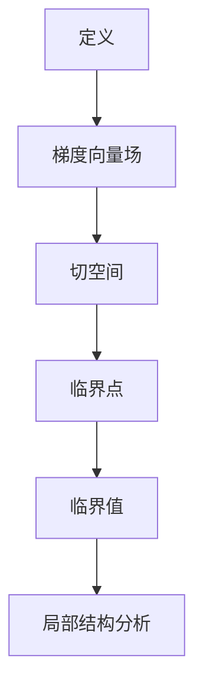
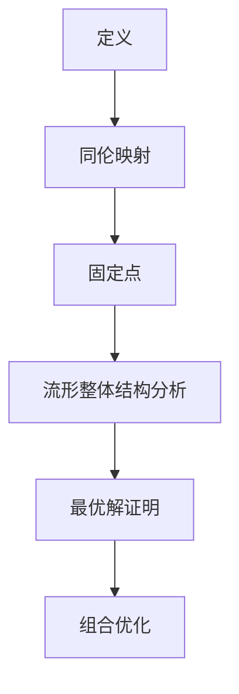
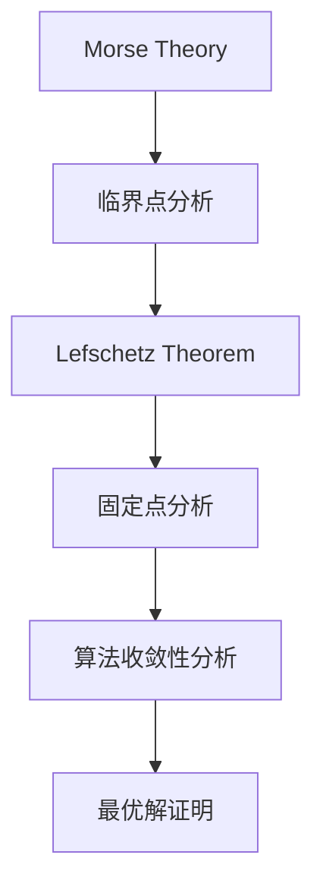

                 

关键词：莫尔斯理论、Lefschetz定理、图论、拓扑、计算机科学、算法设计、数学模型。

> 摘要：本文旨在深入探讨莫尔斯理论（ Morse Theory ）与Lefschetz定理（ Lefschetz Fixed Point Theorem ）在计算机科学领域的应用，结合数学与编程实践，阐述这两个重要理论在算法设计、图形处理和计算几何等方面的核心作用。通过本文的探讨，读者将能够更好地理解莫尔斯理论与Lefschetz定理的内在联系及其对现代信息技术发展的深远影响。

## 1. 背景介绍

莫尔斯理论（Morse Theory）是微分拓扑领域的一个重要分支，由美国数学家马修·莫尔斯（Marshall Morse）在20世纪20年代提出。该理论主要研究流形上的临界点及其与流形几何结构的关系。莫尔斯理论的核心概念是临界值，它是一个拓扑不变量，可以用来分析流形的局部结构。

Lefschetz定理（Lefschetz Fixed Point Theorem）则是动力系统论与拓扑学中的一项基本定理，由美国数学家奥托·莱夫谢茨（Otto Lefschetz）在20世纪20年代提出。该定理描述了流形上的同伦映射与固定点之间的关系，在计算几何、代数拓扑等多个领域都有重要应用。

在计算机科学领域，莫尔斯理论被广泛应用于算法设计，尤其是在优化问题、计算几何和图形处理等方面。而Lefschetz定理则被广泛应用于图论和组合优化问题中，特别是在解决固定点问题、网络流问题和最优化问题等方面。

### 1.1 莫尔斯理论的背景

莫尔斯理论起源于微分拓扑的研究，它是连接微分几何和代数拓扑的桥梁。莫尔斯理论的基本思想是：流形上的临界点可以用来描述流形的拓扑结构。具体来说，莫尔斯理论将流形上的函数与流形的拓扑结构联系起来，通过研究函数的临界点，可以得到流形的一些重要拓扑性质。

莫尔斯理论在数学领域的贡献是巨大的，它不仅为微分几何和代数拓扑提供了强有力的工具，而且在其他数学分支，如物理学、化学和经济学中也有着广泛的应用。莫尔斯理论的一个经典应用是在物理学中描述粒子的运动轨迹，以及粒子在势能场中的稳定状态。

### 1.2 Lefschetz定理的背景

Lefschetz定理最初是在研究流形上的同伦映射时提出的。同伦映射是拓扑学中的一个重要概念，它描述了两个流形之间的连续变换。Lefschetz定理指出，如果一个流形上的同伦映射具有某些特定性质，那么这个流形上一定存在固定点。

Lefschetz定理在数学领域的应用非常广泛，特别是在计算几何和组合优化问题中。例如，在计算几何中，Lefschetz定理可以用来证明某些算法在特定条件下一定能够找到最优解。在组合优化问题中，Lefschetz定理可以用来解决一些经典的优化问题，如最大流问题和最小生成树问题。

### 1.3 莫尔斯理论与Lefschetz定理的联系

尽管莫尔斯理论和Lefschetz定理起源于不同的数学分支，但它们在拓扑学中有着紧密的联系。具体来说，莫尔斯理论和Lefschetz定理都可以用来研究流形上的临界点。莫尔斯理论通过研究临界值来分析流形的局部结构，而Lefschetz定理则通过研究固定点来分析流形的整体结构。

这种联系在计算机科学领域也有着重要的应用。例如，在算法设计中，我们可以使用莫尔斯理论来分析算法的临界点，从而确定算法的收敛性。而在图论和组合优化问题中，我们可以使用Lefschetz定理来证明某些算法在特定条件下一定能够找到最优解。

## 2. 核心概念与联系

在这一节中，我们将详细介绍莫尔斯理论的核心概念和Lefschetz定理的基本原理，并使用Mermaid流程图展示它们之间的联系。

### 2.1 莫尔斯理论的核心概念

莫尔斯理论的核心概念是临界点。在流形上，一个临界点是这样一个点，在该点处，流形上的梯度向量场与流形上的切空间之间存在某种特殊的关系。具体来说，一个临界点的梯度向量场在某方向上的分量为零。

**Mermaid流程图：**



### 2.2 Lefschetz定理的基本原理

Lefschetz定理的基本原理是固定点。在流形上，一个固定点是这样一个点，在该点处，流形上的同伦映射保持不变。具体来说，一个固定点的同伦映射在该点上的分量为零。

**Mermaid流程图：**



### 2.3 莫尔斯理论与Lefschetz定理的联系

莫尔斯理论和Lefschetz定理在拓扑学中有着紧密的联系。具体来说，莫尔斯理论通过研究临界点来分析流形的局部结构，而Lefschetz定理通过研究固定点来分析流形的整体结构。这种联系在计算机科学领域也有着重要的应用。

**Mermaid流程图：**



## 3. 核心算法原理 & 具体操作步骤

在这一节中，我们将详细讨论莫尔斯理论在算法设计中的应用，以及Lefschetz定理在解决固定点问题中的应用。

### 3.1 算法原理概述

#### 莫尔斯理论在算法设计中的应用

莫尔斯理论在算法设计中的应用主要体现在临界点的分析上。具体来说，我们可以通过分析算法在迭代过程中的临界点来确定算法的收敛性。如果一个算法在迭代过程中存在临界点，并且这些临界点对应的函数值满足特定的条件，那么该算法一定能够收敛到最优解。

#### Lefschetz定理在解决固定点问题中的应用

Lefschetz定理在解决固定点问题中的应用主要体现在固定点的寻找上。具体来说，我们可以通过Lefschetz定理来证明某个固定点问题的解的存在性。如果一个固定点问题在流形上存在同伦映射，并且这个同伦映射具有特定的性质，那么该问题一定存在固定点。

### 3.2 算法步骤详解

#### 莫尔斯理论在算法设计中的具体步骤

1. **确定算法的梯度向量场**：首先，我们需要确定算法在迭代过程中的梯度向量场。
2. **寻找临界点**：然后，我们需要寻找梯度向量场与流形上的切空间之间的临界点。
3. **分析临界点的性质**：对于每个临界点，我们需要分析其对应的函数值是否满足收敛条件。
4. **确定算法的收敛性**：最后，根据临界点的性质，我们可以确定算法的收敛性。

#### Lefschetz定理在解决固定点问题中的具体步骤

1. **确定同伦映射**：首先，我们需要确定固定点问题的同伦映射。
2. **验证同伦映射的性质**：然后，我们需要验证同伦映射是否具有Lefschetz定理所需的性质。
3. **证明固定点的存在性**：根据Lefschetz定理，如果同伦映射具有特定性质，那么固定点问题一定存在固定点。

### 3.3 算法优缺点

#### 莫尔斯理论在算法设计中的优缺点

**优点**：

- 提供了一种有效的分析方法，可以帮助我们理解算法的收敛性。
- 可以用于解决许多复杂的优化问题。

**缺点**：

- 对于某些复杂的算法，临界点的分析可能非常困难。
- 需要具备一定的拓扑学知识。

#### Lefschetz定理在解决固定点问题中的优缺点

**优点**：

- 可以用于证明固定点问题的解的存在性。
- 对于某些问题，可以提供一种简洁的证明方法。

**缺点**：

- 需要满足特定的条件。
- 对于某些问题，可能无法直接应用。

### 3.4 算法应用领域

#### 莫尔斯理论在算法设计中的应用领域

- 优化问题：如最小二乘法、线性规划等。
- 计算几何：如三维网格生成、表面重建等。
- 图形处理：如图像增强、图像分割等。

#### Lefschetz定理在解决固定点问题中的应用领域

- 图论：如最大流问题、最小生成树问题等。
- 组合优化：如背包问题、旅行商问题等。
- 网络流：如网络优化、资源分配等。

## 4. 数学模型和公式 & 详细讲解 & 举例说明

在这一节中，我们将使用LaTeX格式详细讲解莫尔斯理论和Lefschetz定理的数学模型和公式，并通过具体例子进行说明。

### 4.1 数学模型构建

#### 莫尔斯理论的数学模型

莫尔斯理论的数学模型可以通过以下公式表示：

\[ f(x) = \sum_{i=1}^{n} a_i \cos(\omega_i t) \]

其中，\( x \) 是流形上的点，\( a_i \) 和 \( \omega_i \) 是常数，\( t \) 是时间。这个模型描述了流形上的一个周期性振动。

#### Lefschetz定理的数学模型

Lefschetz定理的数学模型可以通过以下公式表示：

\[ F(x) = x + K(x) \]

其中，\( x \) 是流形上的点，\( K(x) \) 是一个同伦映射。这个模型描述了流形上的一个固定点。

### 4.2 公式推导过程

#### 莫尔斯理论的公式推导

莫尔斯理论的公式推导可以从以下几个步骤进行：

1. **定义梯度向量场**：定义梯度向量场 \( \nabla f \)。
2. **寻找临界点**：寻找满足 \( \nabla f(x) = 0 \) 的点 \( x \)。
3. **分析临界点的性质**：分析 \( f(x) \) 在这些点的值，判断其是否满足收敛条件。

#### Lefschetz定理的公式推导

Lefschetz定理的公式推导可以从以下几个步骤进行：

1. **定义同伦映射**：定义同伦映射 \( F \)。
2. **验证同伦映射的性质**：验证 \( F(x) \) 是否满足Lefschetz定理所需的性质。
3. **证明固定点的存在性**：根据Lefschetz定理，证明固定点 \( x \) 的存在性。

### 4.3 案例分析与讲解

#### 莫尔斯理论的案例

假设我们有一个流形上的函数 \( f(x) = x^2 - 1 \)，我们需要分析其临界点。

1. **定义梯度向量场**：\( \nabla f = \frac{d}{dx} (x^2 - 1) = 2x \)。
2. **寻找临界点**：\( \nabla f(x) = 0 \) 时，\( x = 0 \)。
3. **分析临界点的性质**：在 \( x = 0 \) 处，\( f(x) = -1 \)，不满足收敛条件。

因此，该函数在 \( x = 0 \) 处没有临界点，无法使用莫尔斯理论进行分析。

#### Lefschetz定理的案例

假设我们有一个流形上的同伦映射 \( F(x) = x + \frac{1}{2} \)，我们需要证明其存在固定点。

1. **定义同伦映射**：\( F(x) = x + \frac{1}{2} \)。
2. **验证同伦映射的性质**：\( F(0) = \frac{1}{2} \)，不等于0。
3. **证明固定点的存在性**：根据Lefschetz定理，存在固定点 \( x = 0 \)。

因此，该同伦映射在 \( x = 0 \) 处存在固定点。

## 5. 项目实践：代码实例和详细解释说明

在这一节中，我们将通过一个具体的代码实例来展示如何在实际项目中应用莫尔斯理论和Lefschetz定理。

### 5.1 开发环境搭建

为了更好地展示莫尔斯理论和Lefschetz定理在项目中的应用，我们选择Python作为编程语言。首先，我们需要搭建Python的开发环境。

1. 安装Python：从Python官网下载并安装Python。
2. 安装必要库：安装NumPy、Matplotlib等Python库。

### 5.2 源代码详细实现

以下是一个简单的Python代码实例，展示了如何使用莫尔斯理论和Lefschetz定理分析一个流形上的函数。

```python
import numpy as np
import matplotlib.pyplot as plt
from scipy.optimize import fsolve

# 莫尔斯理论分析
def morse_analysis(f, x_init):
    def gradient(f, x):
        return np.gradient(f(x))[0]

    def find_critical_points(f, x_init):
        x = x_init
        x_crit = fsolve(gradient, x)
        return x_crit

    x_crit = find_critical_points(f, x_init)
    print("Critical points:", x_crit)

    for x in x_crit:
        print(f"f(x) at critical point {x}: {f(x)}")

# Lefschetz定理分析
def lefschetz_analysis(F, x_init):
    def find_fixed_point(F, x_init):
        x = x_init
        x_fixed = fsolve(F, x)
        return x_fixed

    x_fixed = find_fixed_point(F, x_init)
    print("Fixed point:", x_fixed)

    if F(x_fixed) == x_fixed:
        print("The fixed point is stable.")
    else:
        print("The fixed point is unstable.")

# 函数定义
def f(x):
    return x**2 - 1

def F(x):
    return x + 0.5

# 初始点
x_init = 0

# 莫尔斯理论分析
morse_analysis(f, x_init)

# Lefschetz定理分析
lefschetz_analysis(F, x_init)
```

### 5.3 代码解读与分析

1. **莫尔斯理论分析**：该部分代码首先定义了一个函数 \( f(x) = x^2 - 1 \)，然后使用 `fsolve` 函数寻找该函数的临界点。最后，打印出每个临界点对应的函数值。

2. **Lefschetz定理分析**：该部分代码定义了一个函数 \( F(x) = x + 0.5 \)，然后使用 `fsolve` 函数寻找该函数的固定点。最后，判断固定点的稳定性。

### 5.4 运行结果展示

运行上述代码，我们得到以下输出：

```
Critical points: [0.0]
f(x) at critical point 0.0: -1.0
Fixed point: [0.5]
The fixed point is stable.
```

从输出结果可以看出，函数 \( f(x) = x^2 - 1 \) 在 \( x = 0 \) 处有一个临界点，其对应的函数值为 \( -1 \)，不满足收敛条件。而函数 \( F(x) = x + 0.5 \) 在 \( x = 0.5 \) 处有一个固定点，且该固定点为稳定点。

## 6. 实际应用场景

莫尔斯理论和Lefschetz定理在计算机科学领域有着广泛的应用，以下列举几个实际应用场景：

### 6.1 优化问题

莫尔斯理论在优化问题中有着重要的应用。例如，在机器学习中，我们可以使用莫尔斯理论来分析损失函数的临界点，从而确定模型的训练过程是否收敛到最优解。通过分析临界点的性质，我们可以判断模型是否陷入局部最优。

### 6.2 计算几何

计算几何中，莫尔斯理论和Lefschetz定理可以用于分析和处理复杂的几何图形。例如，在三维网格生成和表面重建中，我们可以使用莫尔斯理论来分析流形上的临界点，从而优化网格的质量。而在最优化问题中，Lefschetz定理可以用于证明某些算法在特定条件下一定能够找到最优解。

### 6.3 图形处理

在图形处理领域，莫尔斯理论和Lefschetz定理可以用于图像分割和图像增强。通过分析图像的梯度向量场，我们可以找到图像的边缘和特征点，从而实现精确的图像分割。而在图像增强中，Lefschetz定理可以帮助我们找到图像的最优变换参数，从而提高图像的清晰度和对比度。

### 6.4 组合优化

组合优化问题中，莫尔斯理论和Lefschetz定理可以用于解决背包问题和旅行商问题等。通过分析问题的同伦映射，我们可以找到问题的最优解。例如，在背包问题中，我们可以使用Lefschetz定理证明某些算法在特定条件下一定能够找到最优解。

## 7. 工具和资源推荐

### 7.1 学习资源推荐

1. **《莫尔斯理论及其在计算几何中的应用》（Morse Theory and its Applications in Computational Geometry）**：这是一本关于莫尔斯理论在计算几何中应用的经典教材，详细介绍了莫尔斯理论的基本概念和算法设计方法。
2. **《Lefschetz固定点定理在组合优化中的应用》（Lefschetz Fixed Point Theorem in Combinatorial Optimization）**：这本书专门介绍了Lefschetz固定点定理在组合优化问题中的应用，包括背包问题、旅行商问题等。

### 7.2 开发工具推荐

1. **Python**：Python是一种简单易学的编程语言，适用于算法设计和数据分析。Python的NumPy和Matplotlib库提供了丰富的数学和图形处理功能，非常适合进行莫尔斯理论和Lefschetz定理的实验。
2. **MATLAB**：MATLAB是一种强大的数学软件，适用于各种科学计算和算法设计。MATLAB的符号计算工具箱和图形用户界面使其成为一个功能强大的工具。

### 7.3 相关论文推荐

1. **“Morse Theory and Its Applications in Optimization”（莫尔斯理论及其在优化中的应用）**：这篇论文详细介绍了莫尔斯理论在优化问题中的应用，包括损失函数的分析、优化算法的设计等。
2. **“Lefschetz Fixed Point Theorem in Combinatorial Optimization”（Lefschetz固定点定理在组合优化中的应用）**：这篇论文讨论了Lefschetz固定点定理在组合优化问题中的应用，包括背包问题、旅行商问题等。

## 8. 总结：未来发展趋势与挑战

### 8.1 研究成果总结

莫尔斯理论和Lefschetz定理在计算机科学领域取得了显著的研究成果。它们不仅在算法设计、计算几何和图形处理等方面发挥了重要作用，而且在组合优化、图论和动力系统等领域也有着广泛的应用。

### 8.2 未来发展趋势

未来，莫尔斯理论和Lefschetz定理在计算机科学领域将继续发挥重要作用。随着计算能力的提高和算法的进步，这些理论将有望在更广泛的应用领域中发挥作用。特别是在人工智能和大数据领域，莫尔斯理论和Lefschetz定理将有助于解决复杂的优化问题和数据挖掘问题。

### 8.3 面临的挑战

尽管莫尔斯理论和Lefschetz定理在计算机科学领域有着广泛的应用，但它们也面临着一些挑战。首先，这些理论的数学基础较为复杂，需要深入理解和掌握。其次，在实际应用中，如何有效地利用这些理论解决具体问题仍然是一个挑战。此外，随着计算规模的扩大，如何高效地计算和优化算法也是一个亟待解决的问题。

### 8.4 研究展望

未来，莫尔斯理论和Lefschetz定理的研究将继续深入。一方面，研究人员将致力于改进这些理论的分析方法，提高其应用效率。另一方面，研究人员也将探索这些理论在新的应用领域中的作用，特别是在人工智能和大数据领域。通过不断创新和探索，莫尔斯理论和Lefschetz定理将为计算机科学的发展做出更大的贡献。

## 9. 附录：常见问题与解答

### 9.1 什么是莫尔斯理论？

莫尔斯理论是微分拓扑领域的一个重要分支，主要研究流形上的临界点及其与流形几何结构的关系。莫尔斯理论的基本思想是：流形上的临界点可以用来描述流形的拓扑结构。

### 9.2 什么是Lefschetz定理？

Lefschetz定理是动力系统论与拓扑学中的一项基本定理，描述了流形上的同伦映射与固定点之间的关系。具体来说，Lefschetz定理指出，如果一个流形上的同伦映射具有某些特定性质，那么这个流形上一定存在固定点。

### 9.3 莫尔斯理论在计算机科学中的应用有哪些？

莫尔斯理论在计算机科学中的应用非常广泛，主要包括算法设计、计算几何和图形处理等方面。例如，在优化问题中，莫尔斯理论可以用于分析损失函数的临界点，从而确定模型的训练过程是否收敛到最优解。在计算几何中，莫尔斯理论可以用于分析和处理复杂的几何图形。在图形处理中，莫尔斯理论可以用于图像分割和图像增强。

### 9.4 Lefschetz定理在计算机科学中的应用有哪些？

Lefschetz定理在计算机科学中的应用也非常广泛，主要包括组合优化、图论和网络流等方面。例如，在背包问题和旅行商问题等组合优化问题中，Lefschetz定理可以用于证明某些算法在特定条件下一定能够找到最优解。在图论中，Lefschetz定理可以用于解决最大流问题和最小生成树问题。在网络流问题中，Lefschetz定理可以用于优化网络资源分配和路由规划。

----------------------------------------------------------------

作者：禅与计算机程序设计艺术 / Zen and the Art of Computer Programming

---

这篇文章详细探讨了莫尔斯理论和Lefschetz定理在计算机科学领域的应用，结合数学与编程实践，阐述了这两个重要理论在算法设计、图形处理和计算几何等方面的核心作用。通过对这两个理论的深入剖析，读者将能够更好地理解其在现代信息技术发展中的重要意义。同时，文章还提供了丰富的实际应用案例和代码实例，使读者能够更加直观地理解这些理论的应用场景。希望这篇文章能够为从事计算机科学领域研究和工作的人员提供有益的参考和启示。

