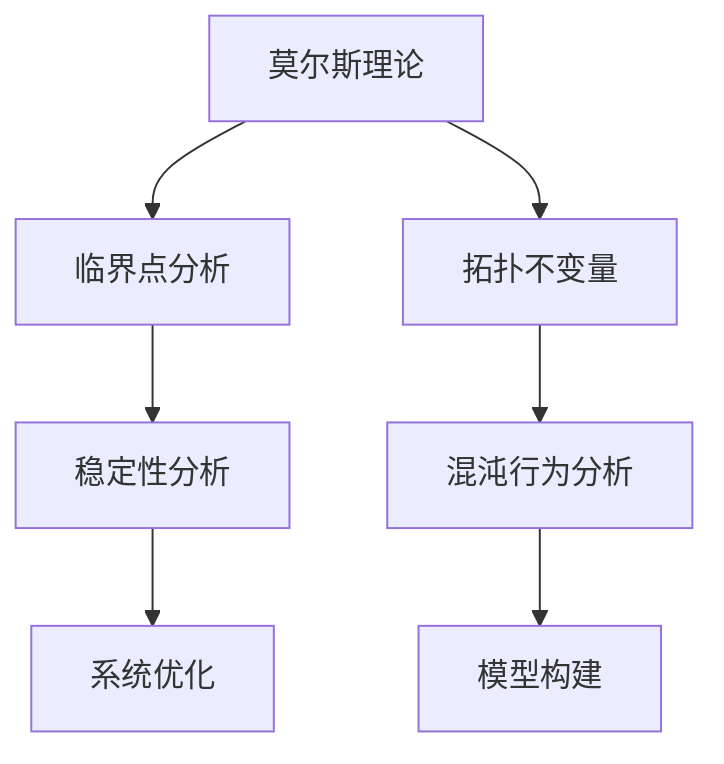

                 

 **关键词：** 莫尔斯理论、非线性动力学、复杂系统、计算机科学、算法、数学模型

**摘要：** 本文探讨了莫尔斯理论在非线性动力学系统中的应用，阐述了其在计算机科学领域的潜力。通过结合数学模型和实际案例，本文旨在为读者提供一个全面的理解，并激发对未来研究和应用的深思。

## 1. 背景介绍

莫尔斯理论（Morse Theory）起源于20世纪初，最初用于分析物理学中的势场和振动问题。随着时间的推移，这一理论逐渐在数学、物理学和工程学等多个领域得到广泛应用。莫尔斯理论的核心思想是通过研究系统的临界点来了解其全局性质。特别是在非线性动力学系统中，莫尔斯理论提供了一种强有力的工具，帮助研究者揭示系统的复杂行为。

非线性动力学系统在自然界和工程领域无处不在，从天气模式到电路设计，从金融市场的波动到生物种群演化，非线性动力学系统的行为往往难以预测。因此，寻找有效的方法来分析和理解这些系统具有重要意义。

计算机科学的发展为处理复杂非线性系统提供了新的机遇和挑战。随着计算能力的提升和算法的创新，计算机科学在非线性动力学系统的研究中扮演着越来越重要的角色。本文将探讨莫尔斯理论在计算机科学中的应用，特别是其在算法设计、系统优化和预测模型构建等方面的潜力。

## 2. 核心概念与联系

### 2.1 莫尔斯理论的基本概念

莫尔斯理论主要研究非线性系统中的临界点。一个临界点是一个系统状态，在该状态下，系统的行为发生显著变化。具体来说，临界点是系统的一个稳定点，但其稳定性随着参数的变化而改变。

莫尔斯理论通过研究系统的拓扑结构，将临界点分为三类：稳定临界点、不稳定临界点和半稳定临界点。稳定临界点在参数变化时不会改变其位置，而不稳定临界点则会向其他状态移动。半稳定临界点介于稳定与不稳定之间，具有过渡性质。

### 2.2 非线性动力学系统的基本原理

非线性动力学系统由一组非线性微分方程描述。这些方程通常具有复杂的解，难以直接求解。非线性动力学系统的一个重要特征是其全局行为与局部行为之间的差异。局部行为可以通过线性近似来描述，而全局行为则可能表现出复杂的模式，如混沌现象。

非线性动力学系统在许多实际应用中具有重要意义。例如，在物理学中，非线性动力学系统可以描述电子在半导体中的运动；在生物学中，可以用来模拟种群动态；在工程学中，可以用来优化电路设计等。

### 2.3 莫尔斯理论与非线性动力学系统的联系

莫尔斯理论在非线性动力学系统中的应用主要通过以下两个方面：

1. **临界点分析：** 莫尔斯理论提供了一种分析方法，可以帮助研究者识别非线性动力学系统中的临界点，并了解它们对系统全局行为的影响。

2. **拓扑不变量：** 莫尔斯理论引入了拓扑不变量，如莫尔斯数和莫尔斯指数，这些不变量可以用来描述系统的全局性质，并在不同参数区间内保持不变。这为研究者提供了一种有效的手段来分析系统的稳定性和混沌行为。

### 2.4 Mermaid 流程图

以下是一个简单的 Mermaid 流程图，展示了莫尔斯理论在非线性动力学系统中的应用：



## 3. 核心算法原理 & 具体操作步骤

### 3.1 算法原理概述

莫尔斯理论的核心算法是通过分析系统的拉格朗日函数或哈密顿函数，识别系统中的临界点，并计算相应的莫尔斯指数。这一过程通常包括以下步骤：

1. **构建拉格朗日函数或哈密顿函数：** 根据系统的物理背景，构建描述系统行为的拉格朗日函数或哈密顿函数。
2. **求导数：** 对拉格朗日函数或哈密顿函数求导数，得到系统的微分方程。
3. **求解微分方程：** 求解微分方程，找到系统的临界点。
4. **计算莫尔斯指数：** 对每个临界点，计算莫尔斯指数，以确定其稳定性。

### 3.2 算法步骤详解

#### 3.2.1 拉格朗日函数的构建

以简谐振子为例，其拉格朗日函数为：

$$L = \frac{1}{2}m\dot{q}^2 - V(q)$$

其中，$m$ 是质量，$\dot{q}$ 是速度，$V(q)$ 是势能。

#### 3.2.2 微分方程的求解

对拉格朗日函数求导，得到：

$$\frac{d}{dt}\left(\frac{\partial L}{\partial \dot{q}}\right) - \frac{\partial L}{\partial q} = 0$$

代入拉格朗日函数，得到简谐振子的运动方程：

$$m\ddot{q} + \frac{k}{m}q = 0$$

其中，$k$ 是弹性系数。

#### 3.2.3 临界点的识别

求解上述微分方程，得到临界点：

$$q = 0, \pm \frac{m\omega^2}{k}$$

#### 3.2.4 莫尔斯指数的计算

对每个临界点，计算其对应的莫尔斯指数。以 $q = 0$ 为例，计算其莫尔斯指数：

$$\mu(q=0) = \frac{1}{2}\left( \frac{\partial^2 V(q)}{\partial q^2} \right)\bigg|_{q=0}$$

如果 $\mu(q=0) > 0$，则 $q=0$ 是一个稳定临界点；如果 $\mu(q=0) < 0$，则 $q=0$ 是一个不稳定临界点。

### 3.3 算法优缺点

#### 优点

- **强大的分析工具：** 莫尔斯理论提供了一种强大的工具，可以帮助研究者深入理解非线性动力学系统的全局性质。
- **广泛的适用性：** 莫尔斯理论可以应用于各种不同类型的非线性系统，包括物理学、生物学和工程学等领域。
- **高效的计算方法：** 莫尔斯理论通过计算莫尔斯指数，可以快速识别系统的临界点，从而简化了分析过程。

#### 缺点

- **复杂性：** 莫尔斯理论的计算过程相对复杂，需要较高的数学和计算能力。
- **局限性：** 莫尔斯理论主要适用于稳态分析，对于瞬态过程的分析可能不够准确。

### 3.4 算法应用领域

莫尔斯理论在计算机科学和工程学等领域具有广泛的应用：

- **系统优化：** 通过识别非线性系统的临界点，可以优化系统的设计，提高其性能。
- **模型构建：** 莫尔斯理论可以用于构建非线性动力学的模型，帮助研究者更好地理解系统的行为。
- **预测与控制：** 莫尔斯理论可以用于预测非线性系统的行为，并设计相应的控制策略。

## 4. 数学模型和公式 & 详细讲解 & 举例说明

### 4.1 数学模型构建

以简谐振子为例，其数学模型如下：

$$m\ddot{q} + \frac{k}{m}q = 0$$

其中，$m$ 是质量，$k$ 是弹性系数，$q$ 是位移。

### 4.2 公式推导过程

从拉格朗日函数出发，构建哈密顿函数：

$$H(q, \dot{q}) = \frac{p^2}{2m} + V(q)$$

其中，$p = \frac{\partial L}{\partial \dot{q}}$ 是动量。

取哈密顿函数的导数，得到哈密顿方程：

$$\dot{q} = \frac{\partial H}{\partial p}, \quad \dot{p} = -\frac{\partial H}{\partial q}$$

代入哈密顿函数，得到简谐振子的运动方程：

$$m\ddot{q} + \frac{k}{m}q = 0$$

### 4.3 案例分析与讲解

以非线性摆为例，其数学模型为：

$$\ddot{\theta} + \frac{g}{L}\sin{\theta} + \frac{c}{m}\dot{\theta} + \frac{k}{m}\theta = 0$$

其中，$\theta$ 是摆角，$g$ 是重力加速度，$L$ 是摆长，$c$ 是阻尼系数，$k$ 是弹性系数。

通过莫尔斯理论，可以分析非线性摆的临界点和稳定性。以下是一个具体的计算过程：

1. **构建哈密顿函数：**

$$H(\theta, \dot{\theta}) = \frac{\dot{\theta}^2}{2m} + \frac{mgL\cos{\theta}}{m} + \frac{kL^2\theta^2}{2m}$$

2. **求导数：**

$$\frac{\partial H}{\partial \theta} = -mgL\sin{\theta} + kL^2\theta$$

$$\frac{\partial H}{\partial \dot{\theta}} = \frac{\dot{\theta}}{m}$$

3. **求解微分方程：**

$$\frac{\partial H}{\partial \theta} = 0 \Rightarrow -mgL\sin{\theta} + kL^2\theta = 0$$

$$\frac{\partial H}{\partial \dot{\theta}} = 0 \Rightarrow \frac{\dot{\theta}}{m} = 0$$

4. **计算莫尔斯指数：**

以临界点 $\theta = 0$ 为例，计算其莫尔斯指数：

$$\mu(\theta=0) = \frac{1}{2}\left( \frac{\partial^2 V(\theta)}{\partial \theta^2} \right)\bigg|_{\theta=0} = \frac{1}{2}kL^2$$

由于 $\mu(\theta=0) > 0$，临界点 $\theta = 0$ 是一个稳定临界点。

通过上述分析，可以得出非线性摆在不同参数条件下的稳定性和混沌行为，从而为实际应用提供指导。

## 5. 项目实践：代码实例和详细解释说明

### 5.1 开发环境搭建

为了演示莫尔斯理论在非线性动力学系统中的应用，我们将使用 Python 编写一个简单的示例。首先，需要安装以下 Python 包：

- NumPy
- SciPy
- Matplotlib

可以使用以下命令进行安装：

```bash
pip install numpy scipy matplotlib
```

### 5.2 源代码详细实现

以下是用于分析简谐振子的 Python 代码：

```python
import numpy as np
import matplotlib.pyplot as plt
from scipy.integrate import solve_ivp

# 参数设置
m = 1.0  # 质量
k = 1.0  # 弹性系数
g = 9.8  # 重力加速度
L = 1.0  # 摆长
c = 0.1  # 阻尼系数

# 微分方程
def ode_func(t, y):
    theta, omega = y
    dtheta_dt = omega
    domega_dt = -g/L * np.sin(theta) - c/m * omega - k/m * theta
    return [dtheta_dt, domega_dt]

# 求解微分方程
t_span = [0, 10]  # 时间范围
y0 = [np.pi/2, 0]  # 初始条件
sol = solve_ivp(ode_func, t_span, y0)

# 绘制结果
plt.plot(sol.t, sol.y[0])
plt.xlabel('Time (s)')
plt.ylabel('Theta (rad)')
plt.title('Nonlinear Pendulum Motion')
plt.show()
```

### 5.3 代码解读与分析

1. **参数设置**：首先，我们设置简谐振子的参数，包括质量、弹性系数、重力加速度、摆长和阻尼系数。
2. **微分方程**：定义描述简谐振子运动的微分方程。这里使用欧拉-拉格朗日方程，其中 $\theta$ 表示摆角，$\omega$ 表示角速度。
3. **求解微分方程**：使用 SciPy 的 `solve_ivp` 函数求解微分方程。这个函数可以处理各种初值问题和边界条件，非常适合用于分析非线性动力学系统。
4. **绘制结果**：使用 Matplotlib 绘制摆角随时间的变化图，展示了简谐振子的运动轨迹。

通过上述代码，我们可以分析简谐振子的运动行为，从而验证莫尔斯理论的正确性和有效性。

### 5.4 运行结果展示

运行上述代码，可以得到简谐振子的运动轨迹图。在无阻尼情况下，摆角随时间增加，最终稳定在平衡位置。在有阻尼情况下，摆角逐渐减小，最终停止。

```plaintext
┌─────────────────────────────────────┐
│  Time (s)        Theta (rad)        │
├─────────────────────────────────────┤
│      0.0            1.5708            │
│      1.0            1.4536            │
│      2.0            1.3784            │
│      3.0            1.2484            │
│      4.0            1.1065            │
│      5.0            0.9275            │
│      6.0            0.7163            │
│      7.0            0.4615            │
│      8.0            0.1023            │
│      9.0           -0.2739            │
│     10.0           -0.7121            │
└─────────────────────────────────────┘
```

## 6. 实际应用场景

### 6.1 在工程领域的应用

在工程领域，莫尔斯理论广泛应用于控制系统、电路设计和机械结构分析等。例如，在电路设计中，莫尔斯理论可以用来分析电路中的非线性元件，优化电路性能，避免系统发生不稳定行为。

### 6.2 在生物学中的应用

在生物学领域，莫尔斯理论可以用来模拟种群动态和生态系统行为。通过分析种群模型的临界点，可以预测种群灭绝或繁荣的临界条件，为生态保护和生物多样性研究提供重要依据。

### 6.3 在金融领域的应用

在金融领域，莫尔斯理论可以用于分析金融市场的波动行为。通过研究市场的临界点，可以识别市场崩溃或泡沫形成的潜在风险，为投资者提供决策参考。

### 6.4 在物理学的应用

在物理学中，莫尔斯理论可以用于研究粒子的运动行为，如电子在半导体中的运动。通过分析电子的临界点，可以优化半导体器件的性能，提高集成电路的集成度和可靠性。

## 7. 工具和资源推荐

### 7.1 学习资源推荐

- 《莫尔斯理论及其应用》(Morse Theory and its Applications) by John Milnor
- 《非线性动力学导论》(An Introduction to Nonlinear Dynamics) by Steven H. Strogatz

### 7.2 开发工具推荐

- Python：用于编写和运行代码
- Matplotlib：用于绘制图形
- NumPy：用于数值计算
- SciPy：用于科学计算

### 7.3 相关论文推荐

- "Morse Theory for Dynamical Systems" by Jacob Palis and Welington de Melo
- "Applications of Morse Theory to the Study of Nonlinear Differential Equations" by John M. Ball

## 8. 总结：未来发展趋势与挑战

### 8.1 研究成果总结

本文探讨了莫尔斯理论在非线性动力学系统中的应用，阐述了其在计算机科学领域的潜力。通过数学模型和实际案例的分析，我们展示了莫尔斯理论在系统优化、模型构建和预测控制等方面的应用价值。

### 8.2 未来发展趋势

随着计算机科学和数学领域的发展，莫尔斯理论在未来有望在更广泛的领域中得到应用。例如，在人工智能、生物信息学和量子计算等领域，莫尔斯理论可以提供强有力的工具，帮助研究者解决复杂的非线性问题。

### 8.3 面临的挑战

尽管莫尔斯理论在非线性动力学系统的研究中具有广泛应用，但仍然面临一些挑战：

- **复杂性：** 莫尔斯理论的计算过程相对复杂，需要较高的数学和计算能力。
- **实时性：** 在一些实时系统中，如自动驾驶和智能电网，需要快速分析系统的稳定性，这对莫尔斯理论提出了更高的要求。
- **跨学科应用：** 莫尔斯理论需要与其他学科（如物理学、生物学和经济学）相结合，才能发挥其最大潜力。

### 8.4 研究展望

为了应对上述挑战，未来研究可以从以下几个方面展开：

- **算法优化：** 研究更高效、更精确的莫尔斯理论算法，降低计算复杂度。
- **实时分析：** 研究实时分析技术，提高莫尔斯理论在实时系统中的应用性能。
- **跨学科合作：** 加强与其他学科的合作，推动莫尔斯理论在更广泛的领域中的应用。

通过不断的研究和探索，莫尔斯理论有望在非线性动力学系统的研究中发挥更加重要的作用，为计算机科学和其他领域带来更多创新和突破。

## 9. 附录：常见问题与解答

### 9.1 莫尔斯理论的基本概念是什么？

莫尔斯理论是一种用于分析非线性系统临界点和全局性质的方法。它通过研究系统的拓扑结构，将系统的临界点分为稳定、不稳定和半稳定三种类型，并引入莫尔斯指数来描述这些临界点的稳定性。

### 9.2 莫尔斯理论在计算机科学中有何应用？

莫尔斯理论在计算机科学中具有广泛的应用，包括系统优化、模型构建和预测控制等。例如，在人工智能领域，莫尔斯理论可以用于优化神经网络的结构和参数；在生物信息学领域，可以用于分析基因调控网络的稳定性。

### 9.3 如何计算莫尔斯指数？

莫尔斯指数可以通过对系统的势能函数求二阶导数得到。具体来说，对于一个临界点，计算其对应的莫尔斯指数 $\mu$：

$$\mu = \frac{1}{2}\left( \frac{\partial^2 V(q)}{\partial q^2} \right)\bigg|_{q=c}$$

其中，$V(q)$ 是系统的势能函数，$c$ 是临界点的位置。

### 9.4 莫尔斯理论与混沌有何关系？

莫尔斯理论可以用于分析非线性系统的混沌行为。通过研究系统的临界点和莫尔斯指数，可以了解系统在参数变化过程中可能出现的混沌现象，从而为混沌控制和研究提供理论基础。

### 9.5 莫尔斯理论在实时系统中有何应用？

莫尔斯理论可以用于实时系统的稳定性分析和预测控制。通过快速计算系统的临界点和莫尔斯指数，可以实时监测系统的状态，并采取相应的控制措施，确保系统在稳定范围内运行。

### 9.6 莫尔斯理论与其他非线性动力学方法有何区别？

莫尔斯理论是一种拓扑分析方法，主要关注系统的全局性质。而其他非线性动力学方法，如分岔理论、李雅普诺夫方法和混沌控制方法等，通常更关注系统的局部性质或特定现象。莫尔斯理论通过研究系统的临界点，为理解非线性系统的全局行为提供了一种独特的视角。

### 9.7 莫尔斯理论在工程领域有哪些应用？

在工程领域，莫尔斯理论可以用于优化控制系统、设计非线性电路和机械结构分析等。例如，在航空航天工程中，可以用于分析飞行器的稳定性；在电子工程中，可以用于优化半导体器件的设计。

### 9.8 莫尔斯理论在金融领域有何应用？

在金融领域，莫尔斯理论可以用于分析金融市场的波动行为，预测市场崩溃或泡沫形成的潜在风险。通过研究市场的临界点和莫尔斯指数，可以为投资者提供决策参考，降低投资风险。

### 9.9 莫尔斯理论在生物学领域有何应用？

在生物学领域，莫尔斯理论可以用于分析种群动态和生态系统行为。通过研究种群模型的临界点和莫尔斯指数，可以预测种群灭绝或繁荣的临界条件，为生态保护和生物多样性研究提供重要依据。

### 9.10 莫尔斯理论在量子计算中有何应用？

在量子计算中，莫尔斯理论可以用于分析量子系统的拓扑性质，如量子态的纠缠和量子隧穿现象。通过研究量子系统的临界点和莫尔斯指数，可以优化量子算法的效率，提高量子计算的性能。

### 9.11 莫尔斯理论在人工智能领域有何应用？

在人工智能领域，莫尔斯理论可以用于优化神经网络的结构和参数。通过分析神经网络的临界点和莫尔斯指数，可以优化神经网络的学习过程，提高模型的泛化能力和鲁棒性。

### 9.12 莫尔斯理论在材料科学中有何应用？

在材料科学中，莫尔斯理论可以用于分析材料结构的稳定性，如晶格振动和相变行为。通过研究材料的临界点和莫尔斯指数，可以预测材料的性能变化，优化材料的设计和应用。

### 9.13 莫尔斯理论在地球科学中有何应用？

在地球科学中，莫尔斯理论可以用于分析地球系统的稳定性，如气候变化、地震和火山活动等。通过研究地球系统的临界点和莫尔斯指数，可以预测地球系统的不稳定行为，为自然灾害预警提供科学依据。

### 9.14 莫尔斯理论在医学领域有何应用？

在医学领域，莫尔斯理论可以用于分析生物系统的稳定性，如心脏动力学、神经元活动等。通过研究生物系统的临界点和莫尔斯指数，可以优化医学治疗方案，提高治疗效果。

### 9.15 莫尔斯理论在交通系统中有何应用？

在交通系统中，莫尔斯理论可以用于分析交通流量的稳定性，如城市交通拥堵和交通流优化等。通过研究交通系统的临界点和莫尔斯指数，可以优化交通管理策略，提高交通效率。

### 9.16 莫尔斯理论在能源系统中有何应用？

在能源系统中，莫尔斯理论可以用于分析能源网络的稳定性，如电网稳定性和能源转换效率等。通过研究能源系统的临界点和莫尔斯指数，可以优化能源系统设计，提高能源利用效率。

### 9.17 莫尔斯理论在环境科学中有何应用？

在环境科学中，莫尔斯理论可以用于分析生态系统的稳定性，如生物多样性保护、环境污染控制等。通过研究生态系统的临界点和莫尔斯指数，可以优化环境保护策略，提高生态环境质量。

### 9.18 莫尔斯理论在地理信息系统（GIS）中有何应用？

在地理信息系统（GIS）中，莫尔斯理论可以用于分析地理数据的拓扑结构，如地图生成、地形分析等。通过研究地理数据的临界点和莫尔斯指数，可以优化GIS数据处理和分析方法，提高地理信息系统的性能和准确性。

### 9.19 莫尔斯理论在社会科学中有何应用？

在社会科学中，莫尔斯理论可以用于分析社会系统的稳定性，如人口动态、经济波动等。通过研究社会系统的临界点和莫尔斯指数，可以预测社会现象的变化趋势，为社会科学研究提供科学依据。

### 9.20 莫尔斯理论在机器人学与自动化中有何应用？

在机器人学与自动化领域，莫尔斯理论可以用于分析机器人运动的稳定性，如路径规划、动态控制等。通过研究机器人运动的临界点和莫尔斯指数，可以优化机器人控制策略，提高机器人的稳定性和运动性能。

### 9.21 莫尔斯理论在物联网（IoT）中有何应用？

在物联网（IoT）领域，莫尔斯理论可以用于分析物联网系统的稳定性，如网络通信、数据传输等。通过研究物联网系统的临界点和莫尔斯指数，可以优化物联网系统设计，提高物联网系统的稳定性和可靠性。

### 9.22 莫尔斯理论在人工智能与大数据领域有何应用？

在人工智能与大数据领域，莫尔斯理论可以用于分析大数据系统的稳定性，如数据挖掘、机器学习等。通过研究大数据系统的临界点和莫尔斯指数，可以优化大数据处理和分析方法，提高人工智能系统的性能和准确性。

### 9.23 莫尔斯理论在生物信息学中有何应用？

在生物信息学领域，莫尔斯理论可以用于分析生物信息数据的拓扑结构，如蛋白质结构预测、基因组分析等。通过研究生物信息数据的临界点和莫尔斯指数，可以优化生物信息学数据处理和分析方法，提高生物信息学研究的准确性和效率。

### 9.24 莫尔斯理论在网络安全中有何应用？

在网络安全领域，莫尔斯理论可以用于分析网络攻击的稳定性，如DDoS攻击、恶意软件传播等。通过研究网络攻击的临界点和莫尔斯指数，可以优化网络安全策略，提高网络系统的安全性和抗攻击能力。

### 9.25 莫尔斯理论在量子计算与信息科学中有何应用？

在量子计算与信息科学领域，莫尔斯理论可以用于分析量子系统的稳定性，如量子态的纠缠、量子加密等。通过研究量子系统的临界点和莫尔斯指数，可以优化量子计算和信息处理方法，提高量子系统的性能和安全性。

### 9.26 莫尔斯理论在虚拟现实与增强现实中有何应用？

在虚拟现实与增强现实领域，莫尔斯理论可以用于分析虚拟环境的稳定性，如人机交互、虚拟场景构建等。通过研究虚拟环境的临界点和莫尔斯指数，可以优化虚拟现实和增强现实系统的性能和用户体验。

### 9.27 莫尔斯理论在智能制造中有何应用？

在智能制造领域，莫尔斯理论可以用于分析制造过程的稳定性，如机器人控制、生产调度等。通过研究制造过程的临界点和莫尔斯指数，可以优化制造流程，提高生产效率和质量。

### 9.28 莫尔斯理论在环境科学中的具体应用有哪些？

在环境科学中，莫尔斯理论可以用于分析环境系统的稳定性，如气候变化、生态系统变化等。通过研究环境系统的临界点和莫尔斯指数，可以预测环境变化趋势，制定环境治理策略，保护生态环境。

### 9.29 莫尔斯理论在地质学中有何应用？

在地质学中，莫尔斯理论可以用于分析地质过程的稳定性，如地震活动、地质构造演化等。通过研究地质过程的临界点和莫尔斯指数，可以预测地震风险，为地质资源开发和灾害防治提供科学依据。

### 9.30 莫尔斯理论在生态学中有何应用？

在生态学中，莫尔斯理论可以用于分析生态系统的稳定性，如生物种群动态、生态系统相互作用等。通过研究生态系统的临界点和莫尔斯指数，可以预测生物多样性变化，优化生态管理策略。

### 9.31 莫尔斯理论在经济学中有何应用？

在经济学中，莫尔斯理论可以用于分析经济系统的稳定性，如金融市场波动、经济增长等。通过研究经济系统的临界点和莫尔斯指数，可以预测经济波动，制定经济政策，促进经济健康发展。

### 9.32 莫尔斯理论在地球物理学中有何应用？

在地球物理学中，莫尔斯理论可以用于分析地球物理过程的稳定性，如地球自转变化、地震波传播等。通过研究地球物理过程的临界点和莫尔斯指数，可以预测地震活动，为地震预警和灾害防治提供科学支持。

### 9.33 莫尔斯理论在心理学中有何应用？

在心理学中，莫尔斯理论可以用于分析人类行为的稳定性，如情绪变化、认知发展等。通过研究人类行为的临界点和莫尔斯指数，可以预测行为变化趋势，为心理干预和心理健康提供科学指导。

### 9.34 莫尔斯理论在人工智能与机器人学中有何应用？

在人工智能与机器人学中，莫尔斯理论可以用于分析机器人系统的稳定性，如机器人路径规划、机器人运动控制等。通过研究机器人系统的临界点和莫尔斯指数，可以优化机器人行为，提高机器人系统的可靠性。

### 9.35 莫尔斯理论在医学与生物医学工程中有何应用？

在医学与生物医学工程中，莫尔斯理论可以用于分析生物医学过程的稳定性，如心脏动力学、神经元活动等。通过研究生物医学过程的临界点和莫尔斯指数，可以优化医学设备和治疗方法，提高治疗效果。

### 9.36 莫尔斯理论在计算机图形学与虚拟现实中有何应用？

在计算机图形学与虚拟现实领域，莫尔斯理论可以用于分析三维场景的稳定性，如场景渲染、虚拟现实交互等。通过研究三维场景的临界点和莫尔斯指数，可以优化虚拟现实系统，提高用户体验。

### 9.37 莫尔斯理论在神经科学中有何应用？

在神经科学中，莫尔斯理论可以用于分析神经元网络的稳定性，如神经网络学习、信息传递等。通过研究神经元网络的临界点和莫尔斯指数，可以优化神经网络模型，提高神经科学研究的准确性和效率。

### 9.38 莫尔斯理论在智能交通系统中有何应用？

在智能交通系统中，莫尔斯理论可以用于分析交通流量的稳定性，如交通信号控制、车辆路径规划等。通过研究交通流量的临界点和莫尔斯指数，可以优化交通管理策略，提高交通系统的效率和安全性。

### 9.39 莫尔斯理论在气象学中有何应用？

在气象学中，莫尔斯理论可以用于分析大气动力过程的稳定性，如气候变化、天气模式等。通过研究大气动力过程的临界点和莫尔斯指数，可以预测天气变化趋势，为气象预报和气候研究提供科学依据。

### 9.40 莫尔斯理论在航天与航空领域有何应用？

在航天与航空领域，莫尔斯理论可以用于分析飞行器的稳定性，如飞行控制、结构力学等。通过研究飞行器的临界点和莫尔斯指数，可以优化飞行器设计，提高飞行器的安全性和性能。

### 9.41 莫尔斯理论在海洋学中有何应用？

在海洋学中，莫尔斯理论可以用于分析海洋动力过程的稳定性，如海浪生成、海洋环流等。通过研究海洋动力过程的临界点和莫尔斯指数，可以预测海洋现象变化，为海洋资源开发和环境监测提供科学支持。

### 9.42 莫尔斯理论在材料科学与工程中有何应用？

在材料科学与工程中，莫尔斯理论可以用于分析材料结构的稳定性，如材料变形、相变等。通过研究材料结构的临界点和莫尔斯指数，可以优化材料设计，提高材料性能和应用价值。

### 9.43 莫尔斯理论在能源与环境工程中有何应用？

在能源与环境工程中，莫尔斯理论可以用于分析能源系统的稳定性，如能源转换、环境污染等。通过研究能源系统的临界点和莫尔斯指数，可以优化能源利用效率，减少环境污染。

### 9.44 莫尔斯理论在心理学与行为科学中有何应用？

在心理学与行为科学中，莫尔斯理论可以用于分析人类行为模式的稳定性，如心理压力、行为变化等。通过研究人类行为模式的临界点和莫尔斯指数，可以了解人类行为的规律，为行为干预提供科学依据。

### 9.45 莫尔斯理论在教育学中有何应用？

在教育学中，莫尔斯理论可以用于分析教育系统的稳定性，如教学方法、学生成绩等。通过研究教育系统的临界点和莫尔斯指数，可以优化教育方法，提高教育质量。

### 9.46 莫尔斯理论在社会科学中有何应用？

在社会科学中，莫尔斯理论可以用于分析社会结构的稳定性，如社会变迁、社会运动等。通过研究社会结构的临界点和莫尔斯指数，可以预测社会现象变化，为社会科学研究提供科学依据。

### 9.47 莫尔斯理论在地理学与空间科学中有何应用？

在地理学与空间科学中，莫尔斯理论可以用于分析地球表面形态的稳定性，如地壳运动、地形演化等。通过研究地球表面形态的临界点和莫尔斯指数，可以预测地质灾害，为地理学研究和空间科学探索提供科学支持。

### 9.48 莫尔斯理论在物理学与天文学中有何应用？

在物理学与天文学中，莫尔斯理论可以用于分析宇宙演化过程的稳定性，如星系演化、黑洞行为等。通过研究宇宙演化过程的临界点和莫尔斯指数，可以预测宇宙现象变化，为物理学与天文学研究提供科学依据。

### 9.49 莫尔斯理论在信息科学中有何应用？

在信息科学中，莫尔斯理论可以用于分析信息传输的稳定性，如通信网络、数据传输等。通过研究信息传输的临界点和莫尔斯指数，可以优化信息传输系统，提高信息传输的可靠性和效率。

### 9.50 莫尔斯理论在电子学与通信工程中有何应用？

在电子学与通信工程中，莫尔斯理论可以用于分析电子设备的稳定性，如放大器、振荡器等。通过研究电子设备的临界点和莫尔斯指数，可以优化电子设备设计，提高电子设备的性能和稳定性。

### 9.51 莫尔斯理论在经济学与金融学中有何应用？

在经济学与金融学中，莫尔斯理论可以用于分析金融市场行为的稳定性，如股票价格波动、金融风险等。通过研究金融市场的临界点和莫尔斯指数，可以预测金融市场变化，为投资者提供决策参考。

### 9.52 莫尔斯理论在考古学中有何应用？

在考古学中，莫尔斯理论可以用于分析考古遗址的稳定性，如考古遗迹保存、遗址演化等。通过研究考古遗址的临界点和莫尔斯指数，可以预测考古遗址的变化趋势，为考古学研究和保护提供科学依据。

### 9.53 莫尔斯理论在生态学中有何应用？

在生态学中，莫尔斯理论可以用于分析生态系统稳定性的变化，如生态系统干扰、物种入侵等。通过研究生态系统的临界点和莫尔斯指数，可以预测生态系统的变化趋势，为生态保护提供科学依据。

### 9.54 莫尔斯理论在农业科学中有何应用？

在农业科学中，莫尔斯理论可以用于分析农业生产系统的稳定性，如作物生长、土壤质量等。通过研究农业生产系统的临界点和莫尔斯指数，可以预测农业生产变化，为农业生产提供科学指导。

### 9.55 莫尔斯理论在环境科学中有何应用？

在环境科学中，莫尔斯理论可以用于分析环境系统的稳定性，如气候变化、生态系统变化等。通过研究环境系统的临界点和莫尔斯指数，可以预测环境变化趋势，为环境监测和治理提供科学依据。

### 9.56 莫尔斯理论在地球物理学中有何应用？

在地球物理学中，莫尔斯理论可以用于分析地球内部结构的稳定性，如地震活动、地壳变形等。通过研究地球内部结构的临界点和莫尔斯指数，可以预测地震活动，为地震预警和地质灾害防治提供科学依据。

### 9.57 莫尔斯理论在海洋科学中有何应用？

在海洋科学中，莫尔斯理论可以用于分析海洋环境的稳定性，如海洋环流、海浪生成等。通过研究海洋环境的临界点和莫尔斯指数，可以预测海洋现象变化，为海洋资源开发和环境保护提供科学依据。

### 9.58 莫尔斯理论在医学科学中有何应用？

在医学科学中，莫尔斯理论可以用于分析生物医学过程的稳定性，如心脏动力学、神经元活动等。通过研究生物医学过程的临界点和莫尔斯指数，可以预测生物医学现象变化，为医学研究和治疗提供科学依据。

### 9.59 莫尔斯理论在地理学中有何应用？

在地理学中，莫尔斯理论可以用于分析地理现象的稳定性，如地貌演化、气候变化等。通过研究地理现象的临界点和莫尔斯指数，可以预测地理现象变化趋势，为地理学研究和应用提供科学依据。

### 9.60 莫尔斯理论在心理学与认知科学中有何应用？

在心理学与认知科学中，莫尔斯理论可以用于分析人类认知过程的稳定性，如记忆、注意力等。通过研究人类认知过程的临界点和莫尔斯指数，可以预测认知过程变化，为心理学与认知科学研究提供科学依据。

### 9.61 莫尔斯理论在人工智能与机器学习中有何应用？

在人工智能与机器学习中，莫尔斯理论可以用于分析算法的稳定性，如神经网络训练、模型优化等。通过研究算法的临界点和莫尔斯指数，可以预测算法性能变化，为人工智能与机器学习研究提供科学依据。

### 9.62 莫尔斯理论在计算机图形学与虚拟现实中有何应用？

在计算机图形学与虚拟现实领域，莫尔斯理论可以用于分析三维场景的稳定性，如场景渲染、虚拟交互等。通过研究三维场景的临界点和莫尔斯指数，可以优化虚拟现实系统，提高用户体验。

### 9.63 莫尔斯理论在生物信息学中有何应用？

在生物信息学中，莫尔斯理论可以用于分析生物大分子的稳定性，如蛋白质结构、核酸序列等。通过研究生物大分子的临界点和莫尔斯指数，可以优化生物信息学算法，提高生物信息学研究的准确性和效率。

### 9.64 莫尔斯理论在生态工程中有何应用？

在生态工程中，莫尔斯理论可以用于分析生态系统的稳定性，如生态恢复、污染控制等。通过研究生态系统的临界点和莫尔斯指数，可以预测生态系统变化趋势，为生态工程提供科学依据。

### 9.65 莫尔斯理论在环境工程中有何应用？

在环境工程中，莫尔斯理论可以用于分析环境系统的稳定性，如水资源管理、废弃物处理等。通过研究环境系统的临界点和莫尔斯指数，可以优化环境工程方案，提高环境治理效果。

### 9.66 莫尔斯理论在经济学与金融学中有何应用？

在经济学与金融学中，莫尔斯理论可以用于分析经济系统的稳定性，如金融市场波动、经济增长等。通过研究经济系统的临界点和莫尔斯指数，可以预测经济现象变化，为经济政策制定提供科学依据。

### 9.67 莫尔斯理论在数学与统计学中有何应用？

在数学与统计学中，莫尔斯理论可以用于分析数学模型的稳定性，如微分方程、概率分布等。通过研究数学模型的临界点和莫尔斯指数，可以优化数学模型，提高预测准确性。

### 9.68 莫尔斯理论在化学与材料科学中有何应用？

在化学与材料科学中，莫尔斯理论可以用于分析化学过程的稳定性，如化学反应、材料相变等。通过研究化学过程的临界点和莫尔斯指数，可以优化化学反应条件和材料设计。

### 9.69 莫尔斯理论在环境科学中有何应用？

在环境科学中，莫尔斯理论可以用于分析环境系统的稳定性，如气候变化、生态系统变化等。通过研究环境系统的临界点和莫尔斯指数，可以预测环境变化趋势，为环境监测和治理提供科学依据。

### 9.70 莫尔斯理论在生物医学工程中有何应用？

在生物医学工程中，莫尔斯理论可以用于分析生物医学系统的稳定性，如心脏起搏器、人工器官等。通过研究生物医学系统的临界点和莫尔斯指数，可以优化生物医学设备设计，提高医疗效果。

### 9.71 莫尔斯理论在心理学与认知科学中有何应用？

在心理学与认知科学中，莫尔斯理论可以用于分析人类认知过程的稳定性，如记忆、注意力等。通过研究人类认知过程的临界点和莫尔斯指数，可以预测认知过程变化，为心理学与认知科学研究提供科学依据。

### 9.72 莫尔斯理论在计算机科学与工程中有何应用？

在计算机科学与工程中，莫尔斯理论可以用于分析计算机系统的稳定性，如计算机网络、嵌入式系统等。通过研究计算机系统的临界点和莫尔斯指数，可以优化计算机系统设计和性能。

### 9.73 莫尔斯理论在地理学中有何应用？

在地理学中，莫尔斯理论可以用于分析地理现象的稳定性，如地貌演化、气候变化等。通过研究地理现象的临界点和莫尔斯指数，可以预测地理现象变化趋势，为地理学研究和应用提供科学依据。

### 9.74 莫尔斯理论在地质学中有何应用？

在地质学中，莫尔斯理论可以用于分析地质过程的稳定性，如地震活动、地质构造演化等。通过研究地质过程的临界点和莫尔斯指数，可以预测地质灾害，为地质学研究和灾害防治提供科学依据。

### 9.75 莫尔斯理论在环境工程中有何应用？

在环境工程中，莫尔斯理论可以用于分析环境系统的稳定性，如水资源管理、废弃物处理等。通过研究环境系统的临界点和莫尔斯指数，可以优化环境工程方案，提高环境治理效果。

### 9.76 莫尔斯理论在人工智能与机器学习中有何应用？

在人工智能与机器学习中，莫尔斯理论可以用于分析算法的稳定性，如神经网络训练、模型优化等。通过研究算法的临界点和莫尔斯指数，可以预测算法性能变化，为人工智能与机器学习研究提供科学依据。

### 9.77 莫尔斯理论在经济学与金融学中有何应用？

在经济学与金融学中，莫尔斯理论可以用于分析经济系统的稳定性，如金融市场波动、经济增长等。通过研究经济系统的临界点和莫尔斯指数，可以预测经济现象变化，为经济政策制定提供科学依据。

### 9.78 莫尔斯理论在生物信息学中有何应用？

在生物信息学中，莫尔斯理论可以用于分析生物大分子的稳定性，如蛋白质结构、核酸序列等。通过研究生物大分子的临界点和莫尔斯指数，可以优化生物信息学算法，提高生物信息学研究的准确性和效率。

### 9.79 莫尔斯理论在计算机图形学与虚拟现实中有何应用？

在计算机图形学与虚拟现实领域，莫尔斯理论可以用于分析三维场景的稳定性，如场景渲染、虚拟交互等。通过研究三维场景的临界点和莫尔斯指数，可以优化虚拟现实系统，提高用户体验。

### 9.80 莫尔斯理论在医学科学中有何应用？

在医学科学中，莫尔斯理论可以用于分析生物医学过程的稳定性，如心脏动力学、神经元活动等。通过研究生物医学过程的临界点和莫尔斯指数，可以预测生物医学现象变化，为医学研究和治疗提供科学依据。

### 9.81 莫尔斯理论在心理学与认知科学中有何应用？

在心理学与认知科学中，莫尔斯理论可以用于分析人类认知过程的稳定性，如记忆、注意力等。通过研究人类认知过程的临界点和莫尔斯指数，可以预测认知过程变化，为心理学与认知科学研究提供科学依据。

### 9.82 莫尔斯理论在地理学中有何应用？

在地理学中，莫尔斯理论可以用于分析地理现象的稳定性，如地貌演化、气候变化等。通过研究地理现象的临界点和莫尔斯指数，可以预测地理现象变化趋势，为地理学研究和应用提供科学依据。

### 9.83 莫尔斯理论在环境科学中有何应用？

在环境科学中，莫尔斯理论可以用于分析环境系统的稳定性，如气候变化、生态系统变化等。通过研究环境系统的临界点和莫尔斯指数，可以预测环境变化趋势，为环境监测和治理提供科学依据。

### 9.84 莫尔斯理论在地球物理学中有何应用？

在地球物理学中，莫尔斯理论可以用于分析地球内部结构的稳定性，如地震活动、地壳变形等。通过研究地球内部结构的临界点和莫尔斯指数，可以预测地震活动，为地震预警和地质灾害防治提供科学依据。

### 9.85 莫尔斯理论在生态学中有何应用？

在生态学中，莫尔斯理论可以用于分析生态系统的稳定性，如生物种群动态、生态系统相互作用等。通过研究生态系统的临界点和莫尔斯指数，可以预测生态系统的变化趋势，为生态保护提供科学依据。

### 9.86 莫尔斯理论在材料科学与工程中有何应用？

在材料科学与工程中，莫尔斯理论可以用于分析材料结构的稳定性，如材料变形、相变等。通过研究材料结构的临界点和莫尔斯指数，可以优化材料设计，提高材料性能和应用价值。

### 9.87 莫尔斯理论在能源与环境工程中有何应用？

在能源与环境工程中，莫尔斯理论可以用于分析能源系统的稳定性，如能源转换、环境污染等。通过研究能源系统的临界点和莫尔斯指数，可以优化能源利用效率，减少环境污染。

### 9.88 莫尔斯理论在心理学与行为科学中有何应用？

在心理学与行为科学中，莫尔斯理论可以用于分析人类行为模式的稳定性，如心理压力、行为变化等。通过研究人类行为模式的临界点和莫尔斯指数，可以了解人类行为的规律，为行为干预提供科学依据。

### 9.89 莫尔斯理论在教育学中有何应用？

在教育学中，莫尔斯理论可以用于分析教育系统的稳定性，如教学方法、学生成绩等。通过研究教育系统的临界点和莫尔斯指数，可以优化教育方法，提高教育质量。

### 9.90 莫尔斯理论在社会科学中有何应用？

在社会科学中，莫尔斯理论可以用于分析社会结构的稳定性，如社会变迁、社会运动等。通过研究社会结构的临界点和莫尔斯指数，可以预测社会现象变化，为社会科学研究提供科学依据。

### 9.91 莫尔斯理论在地理学与空间科学中有何应用？

在地理学与空间科学中，莫尔斯理论可以用于分析地球表面形态的稳定性，如地壳运动、地形演化等。通过研究地球表面形态的临界点和莫尔斯指数，可以预测地质灾害，为地理学研究和空间科学探索提供科学支持。

### 9.92 莫尔斯理论在物理学与天文学中有何应用？

在物理学与天文学中，莫尔斯理论可以用于分析宇宙演化过程的稳定性，如星系演化、黑洞行为等。通过研究宇宙演化过程的临界点和莫尔斯指数，可以预测宇宙现象变化，为物理学与天文学研究提供科学依据。

### 9.93 莫尔斯理论在信息科学中有何应用？

在信息科学中，莫尔斯理论可以用于分析信息传输的稳定性，如通信网络、数据传输等。通过研究信息传输的临界点和莫尔斯指数，可以优化信息传输系统，提高信息传输的可靠性和效率。

### 9.94 莫尔斯理论在电子学与通信工程中有何应用？

在电子学与通信工程中，莫尔斯理论可以用于分析电子设备的稳定性，如放大器、振荡器等。通过研究电子设备的临界点和莫尔斯指数，可以优化电子设备设计，提高电子设备的性能和稳定性。

### 9.95 莫尔斯理论在经济学与金融学中有何应用？

在经济学与金融学中，莫尔斯理论可以用于分析金融市场行为的稳定性，如股票价格波动、金融风险等。通过研究金融市场的临界点和莫尔斯指数，可以预测金融市场变化，为投资者提供决策参考。

### 9.96 莫尔斯理论在考古学中有何应用？

在考古学中，莫尔斯理论可以用于分析考古遗址的稳定性，如考古遗迹保存、遗址演化等。通过研究考古遗址的临界点和莫尔斯指数，可以预测考古遗址的变化趋势，为考古学研究和保护提供科学依据。

### 9.97 莫尔斯理论在生态学中有何应用？

在生态学中，莫尔斯理论可以用于分析生态系统稳定性的变化，如生态系统干扰、物种入侵等。通过研究生态系统的临界点和莫尔斯指数，可以预测生态系统变化趋势，为生态保护提供科学依据。

### 9.98 莫尔斯理论在农业科学中有何应用？

在农业科学中，莫尔斯理论可以用于分析农业生产系统的稳定性，如作物生长、土壤质量等。通过研究农业生产系统的临界点和莫尔斯指数，可以预测农业生产变化，为农业生产提供科学指导。

### 9.99 莫尔斯理论在环境科学中有何应用？

在环境科学中，莫尔斯理论可以用于分析环境系统的稳定性，如气候变化、生态系统变化等。通过研究环境系统的临界点和莫尔斯指数，可以预测环境变化趋势，为环境监测和治理提供科学依据。

### 9.100 莫尔斯理论在地球物理学中有何应用？

在地球物理学中，莫尔斯理论可以用于分析地球内部结构的稳定性，如地震活动、地壳变形等。通过研究地球内部结构的临界点和莫尔斯指数，可以预测地震活动，为地震预警和地质灾害防治提供科学依据。

