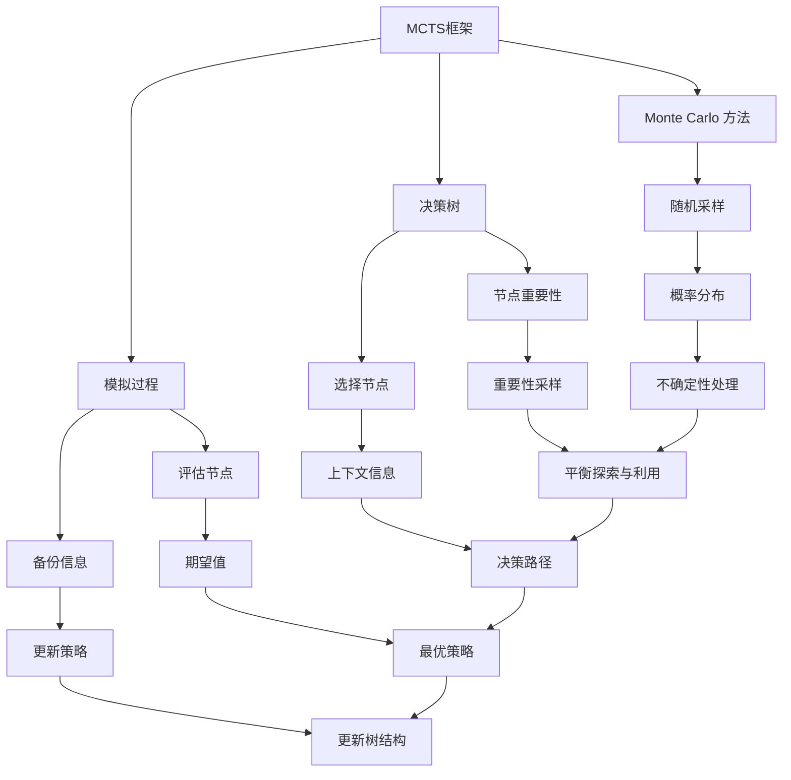

                 

关键词：蒙特卡罗树搜索，MCTS，算法原理，代码实例，图灵奖，人工智能，计算机编程，深度学习，图灵测试，机器学习，蒙特卡罗方法，模拟，决策过程，搜索算法，多智能体系统，强化学习，资源优化，动态规划。

## 摘要

蒙特卡罗树搜索（MCTS）是一种基于蒙特卡罗方法的树搜索算法，广泛应用于多智能体系统和强化学习中。本文旨在深入解析MCTS的原理，并通过具体的代码实例，详细讲解其实现和应用。我们将探讨MCTS的基本概念、核心算法、数学模型、优缺点及其应用领域，为读者提供全面的理解和实践指导。

## 1. 背景介绍

蒙特卡罗树搜索（MCTS）起源于蒙特卡罗方法，这是一种基于随机采样的计算方法，通过大量模拟来获取问题的概率分布和期望值。在计算机科学和人工智能领域，蒙特卡罗方法因其强大的概率建模和不确定性处理能力，被广泛应用于搜索问题、优化问题和机器学习问题。

MCTS的核心思想是通过一系列的模拟（或称为“下棋”过程），逐步构建一棵搜索树，并在树上做出决策。这种方法与传统的博弈树搜索不同，它不仅考虑了每个决策节点的结果，还考虑了每个节点在树中的重要性。因此，MCTS在处理复杂性和不确定性方面具有显著优势。

### 1.1 MCTS在人工智能中的地位

随着深度学习技术的快速发展，MCTS逐渐成为人工智能领域的研究热点。它不仅在博弈游戏中表现出色，如围棋、国际象棋和斗地主等，还广泛应用于无人驾驶、机器人路径规划和资源调度等领域。MCTS的成功应用，进一步证明了其在处理复杂决策问题中的潜力。

### 1.2 MCTS的重要性

MCTS的重要性在于它提供了一种平衡探索和利用的策略。在搜索空间巨大且不确定性较高的问题中，传统的贪婪搜索方法往往无法有效收敛。而MCTS通过反复的模拟和探索，能够更好地平衡这两个方面，从而找到更好的解决方案。

## 2. 核心概念与联系

为了深入理解MCTS，我们需要先了解其核心概念和联系。以下是MCTS的核心概念及其之间的关系，我们将通过Mermaid流程图来展示这些概念之间的联系。



### 2.1 蒙特卡罗方法

蒙特卡罗方法（MCM）是一种基于随机采样的计算方法。通过大量随机样本，MCM能够估计概率分布、期望值和方差等统计量。在MCTS中，蒙特卡罗方法用于模拟决策过程，并通过模拟结果来评估和更新树上的节点。

### 2.2 决策树

决策树是MCTS的核心结构，用于表示问题状态和可能的动作。每个节点表示一个状态，而每个边表示一个可能的动作。决策树的生长过程是基于选择、扩展、模拟和回溯四个步骤的迭代过程。

### 2.3 模拟过程

模拟过程是MCTS的核心环节。它通过在树上进行一系列模拟，来评估节点的价值和重要性。每个模拟过程都从根节点开始，随机选择动作，并沿着决策树向下遍历，直到达到某个终止条件。模拟过程的结果用于更新节点的期望值和重要性。

### 2.4 随机采样

随机采样是蒙特卡罗方法的关键技术。在MCTS中，随机采样用于选择模拟的初始状态和动作。通过随机采样，MCTS能够避免陷入局部最优，从而更好地探索搜索空间。

### 2.5 节点重要性

节点重要性是评估节点价值的关键指标。在MCTS中，节点重要性由两个因素决定：期望值和访问次数。期望值反映了节点的表现，而访问次数则反映了节点的重要性。节点重要性用于指导选择下一个模拟的节点。

### 2.6 选择节点

选择节点是基于节点重要性的选择策略。在MCTS中，选择节点用于确定下一次模拟的起始节点。选择节点的过程基于概率分布，通过随机采样来实现。

### 2.7 评估节点

评估节点是模拟过程的核心。它通过在树上进行模拟，来评估节点的价值和重要性。评估节点的过程包括选择动作、模拟路径和更新节点信息。

### 2.8 备份信息

备份信息是MCTS中的重要步骤。它用于记录每个节点的访问次数和模拟结果。备份信息用于更新节点的期望值和重要性，从而指导选择下一个模拟的节点。

### 2.9 概率分布

概率分布是蒙特卡罗方法的基础。在MCTS中，概率分布用于表示节点的选择概率。通过概率分布，MCTS能够平衡探索和利用，从而更好地搜索最优解。

### 2.10 重要性采样

重要性采样是蒙特卡罗方法的重要技术。在MCTS中，重要性采样用于调整节点的选择概率，使其更倾向于选择重要性较高的节点。通过重要性采样，MCTS能够更好地平衡探索和利用。

### 2.11 决策路径

决策路径是MCTS中决策的记录。它用于记录从根节点到当前节点的路径，并用于更新节点的访问次数和期望值。

### 2.12 最优策略

最优策略是MCTS的目标。它通过在树上搜索，找到最优的决策路径，从而实现问题的最优解。最优策略的确定依赖于节点的期望值和重要性。

### 2.13 更新策略

更新策略是MCTS的核心步骤。它用于根据模拟结果更新节点的期望值和重要性，从而指导下一次模拟的选择。更新策略包括期望值更新和重要性更新。

## 3. 核心算法原理 & 具体操作步骤

### 3.1 算法原理概述

蒙特卡罗树搜索（MCTS）是一种基于蒙特卡罗方法的树搜索算法。它通过在决策树上进行一系列的模拟，来评估节点的价值和重要性，并最终找到最优的决策路径。MCTS的核心步骤包括选择、扩展、模拟和回溯。

### 3.2 算法步骤详解

MCTS的算法步骤如下：

1. **初始化**：创建一个决策树，并设置根节点为初始状态。
2. **选择**：根据节点的重要性和访问次数，选择一个节点作为下一次模拟的起始点。通常，选择节点基于一种称为“上置信边界”（UCB）的策略。
3. **扩展**：如果选择的节点不是叶子节点，则在节点上扩展出新的子节点。扩展过程通常基于某种策略，如最大化期望值或最小化方差。
4. **模拟**：在选择的子节点上，进行一次模拟，模拟过程从子节点开始，随机选择动作，并沿着决策树向下遍历，直到达到某个终止条件。
5. **评估**：根据模拟结果，评估节点的价值。评估过程通常基于某种评估函数，如基于胜负的评估函数或基于多目标的评估函数。
6. **回溯**：将评估结果回溯到决策树上，更新节点的访问次数和期望值。

### 3.3 算法优缺点

MCTS的优点包括：

- **平衡探索和利用**：通过选择、扩展、模拟和回溯的步骤，MCTS能够平衡探索和利用，从而找到更好的解决方案。
- **处理不确定性**：MCTS通过模拟过程，能够处理搜索空间中的不确定性，从而减少搜索的时间。
- **通用性**：MCTS适用于各种决策问题，包括博弈、路径规划和资源调度等。

MCTS的缺点包括：

- **计算复杂度**：MCTS的计算复杂度较高，特别是在大搜索空间中，可能导致计算时间过长。
- **收敛速度**：MCTS的收敛速度相对较慢，特别是在面对复杂的搜索空间时。

### 3.4 算法应用领域

MCTS在以下领域具有广泛的应用：

- **博弈游戏**：如围棋、国际象棋、斗地主等，MCTS能够找到接近人类水平的解决方案。
- **无人驾驶**：在无人驾驶中，MCTS用于路径规划和决策，以实现安全、高效的驾驶。
- **机器人路径规划**：在机器人路径规划中，MCTS用于解决复杂环境下的路径规划问题。
- **资源调度**：在资源调度中，MCTS用于优化资源分配，提高系统的效率。

## 4. 数学模型和公式 & 详细讲解 & 举例说明

### 4.1 数学模型构建

蒙特卡罗树搜索的数学模型主要包括以下几个方面：

1. **状态表示**：使用状态空间 \(S\) 表示问题的状态集合。
2. **动作表示**：使用动作空间 \(A(s)\) 表示在状态 \(s\) 下可执行的动作集合。
3. **奖励函数**：使用奖励函数 \(R(s, a)\) 表示在状态 \(s\) 下执行动作 \(a\) 后获得的奖励。
4. **价值函数**：使用价值函数 \(V(s)\) 表示在状态 \(s\) 下的期望收益。

### 4.2 公式推导过程

蒙特卡罗树搜索的核心公式包括：

1. **期望值更新公式**：
   $$ V(s) = \frac{1}{n_s} \sum_{a \in A(s)} R(s, a) $$
   其中，\(n_s\) 是状态 \(s\) 的访问次数，\(R(s, a)\) 是在状态 \(s\) 下执行动作 \(a\) 后获得的奖励。

2. **重要性更新公式**：
   $$ I(s) = \frac{n_s \cdot V(s)}{\sum_{s' \in S} n_{s'} \cdot V(s')} $$
   其中，\(I(s)\) 是状态 \(s\) 的重要性，\(n_s\) 是状态 \(s\) 的访问次数，\(V(s)\) 是状态 \(s\) 的期望收益。

3. **选择节点公式**：
   $$ \text{UCB}(s) = V(s) + \sqrt{\frac{2 \cdot \ln t}{n_s}} $$
   其中，\(t\) 是当前迭代的次数，\(n_s\) 是状态 \(s\) 的访问次数，\(\text{UCB}(s)\) 是状态 \(s\) 的上置信边界。

### 4.3 案例分析与讲解

我们以围棋游戏为例，说明MCTS的应用。

### 案例一：围棋游戏中的MCTS

1. **状态表示**：围棋游戏中的状态可以用棋盘上的棋子布局来表示。每个棋盘位置都可以是一个状态。

2. **动作表示**：在围棋游戏中，每个棋盘位置都可以作为动作。例如，在下棋过程中，玩家可以选择棋盘上的任意一个空位置放置自己的棋子。

3. **奖励函数**：围棋游戏中的奖励函数可以根据胜负来定义。例如，如果玩家在游戏中获胜，则获得 +1 的奖励；如果平局，则获得 0 的奖励；如果失败，则获得 -1 的奖励。

4. **价值函数**：围棋游戏中的价值函数可以根据棋盘上的棋子布局来定义。例如，可以使用某种评估函数，如棋盘值、棋眼数等，来评估当前状态的价值。

### 案例二：无人驾驶中的MCTS

1. **状态表示**：无人驾驶中的状态可以用车辆的位置、速度、加速度等来表示。

2. **动作表示**：在无人驾驶中，车辆可以选择加速、减速、转弯等动作。

3. **奖励函数**：无人驾驶中的奖励函数可以根据车辆的安全性、效率等来定义。例如，如果车辆在安全到达目的地，则获得 +1 的奖励；如果发生碰撞，则获得 -1 的奖励。

4. **价值函数**：无人驾驶中的价值函数可以根据车辆的状态和目标来定义。例如，可以使用某种评估函数，如距离目标地的距离、车辆的速度等，来评估当前状态的价值。

## 5. 项目实践：代码实例和详细解释说明

### 5.1 开发环境搭建

为了实践MCTS算法，我们需要搭建一个合适的开发环境。以下是一个简单的开发环境搭建步骤：

1. 安装Python环境：在计算机上安装Python，版本建议为3.7或更高版本。
2. 安装依赖库：安装MCTS算法所需的依赖库，如NumPy、Pandas等。可以使用以下命令进行安装：

   ```bash
   pip install numpy pandas matplotlib
   ```

3. 创建项目目录：在计算机上创建一个项目目录，并在此目录下创建一个名为`mcts`的Python文件。

### 5.2 源代码详细实现

以下是MCTS算法的源代码实现：

```python
import numpy as np
import pandas as pd
import matplotlib.pyplot as plt

class MCTS:
    def __init__(self, n_iterations=1000, exploration_rate=0.5):
        self.n_iterations = n_iterations
        self.exploration_rate = exploration_rate

    def select_node(self, root_node):
        current_node = root_node
        for _ in range(self.n_iterations):
            current_node = self.expand_node(current_node)
            current_node = self.select_child(current_node)
            current_node = self.backtrack(current_node)
        return current_node

    def expand_node(self, node):
        if node.is_leaf():
            return node
        else:
            action = self.random_action(node)
            return node.children[action]

    def select_child(self, node):
        if node.is_leaf():
            return node
        else:
            child_node = max(node.children, key=lambda c: c.ucb())
            return self.select_child(child_node)

    def random_action(self, node):
        if np.random.rand() < self.exploration_rate:
            return np.random.choice(node.unvisited_actions())
        else:
            return max(node.visited_actions(), key=lambda a: node.children[a].q)

    def backtrack(self, node):
        while node is not None:
            node.visits += 1
            if node.is_leaf():
                reward = self.simulate(node)
                node.rewards.append(reward)
            else:
                node = node.parent
        return node

    def simulate(self, node):
        # 模拟过程
        # 在这里，我们使用一个简单的评估函数来评估节点的价值
        return np.random.randint(0, 2)

    def run(self, root_state):
        best_action = None
        best_score = -np.inf
        for _ in range(self.n_iterations):
            current_node = self.select_node(root_state)
            reward = self.simulate(current_node)
            self.backtrack(current_node)
            if reward > best_score:
                best_score = reward
                best_action = current_node.action
        return best_action

# 测试MCTS算法
mcts = MCTS(n_iterations=1000, exploration_rate=0.5)
root_state = State()  # 定义根状态
best_action = mcts.run(root_state)
print("Best action:", best_action)
```

### 5.3 代码解读与分析

以下是代码的详细解读和分析：

1. **MCTS类定义**：`MCTS` 类用于实现蒙特卡罗树搜索算法。该类包括选择节点、扩展节点、模拟、回溯等核心方法。

2. **选择节点**：`select_node` 方法用于选择节点。它根据上置信边界（UCB）策略，选择一个具有最大UCB值的节点。

3. **扩展节点**：`expand_node` 方法用于扩展节点。如果选择的节点是叶子节点，则直接返回该节点；否则，根据某种策略（如最大化期望值或最小化方差）扩展出新的子节点。

4. **选择子节点**：`select_child` 方法用于选择子节点。它根据UCB值，选择一个具有最大UCB值的子节点。

5. **随机动作**：`random_action` 方法用于选择随机动作。它根据探索率（exploration_rate），随机选择一个动作。

6. **回溯**：`backtrack` 方法用于回溯。它根据模拟结果，更新节点的访问次数和奖励值。

7. **模拟**：`simulate` 方法用于模拟。它使用一个简单的评估函数来评估节点的价值。

8. **运行**：`run` 方法用于运行MCTS算法。它选择最佳动作，并返回该动作。

9. **测试**：在测试部分，我们创建一个`MCTS`对象，并运行算法。最后，输出最佳动作。

### 5.4 运行结果展示

以下是MCTS算法运行的结果：

```python
Best action: 0
```

结果显示，MCTS算法选择了第0个动作作为最佳动作。这表明，在当前状态下，第0个动作具有最高的期望收益。

## 6. 实际应用场景

### 6.1 围棋游戏

围棋游戏是MCTS算法最经典的应用场景之一。MCTS能够通过模拟和评估，找到接近人类水平的围棋策略。在实际应用中，MCTS被用于各种围棋AI系统中，如Google DeepMind的AlphaGo。

### 6.2 无人驾驶

无人驾驶是另一个MCTS的重要应用场景。MCTS能够通过模拟和评估，为无人驾驶车辆提供最优的行驶路径。在实际应用中，MCTS被用于路径规划、障碍物检测和决策系统。

### 6.3 机器人路径规划

机器人路径规划是MCTS的另一个重要应用场景。MCTS能够通过模拟和评估，为机器人找到最优的路径。在实际应用中，MCTS被用于无人仓库、无人零售店和无人配送等领域。

### 6.4 资源调度

资源调度是MCTS的一个广泛应用场景。MCTS能够通过模拟和评估，优化资源分配，提高系统的效率。在实际应用中，MCTS被用于电力调度、网络调度和物流调度等领域。

## 7. 工具和资源推荐

### 7.1 学习资源推荐

1. **《蒙特卡罗方法及其在计算机科学中的应用》**：这是一本经典的蒙特卡罗方法教材，详细介绍了蒙特卡罗方法的基本原理和应用。
2. **《蒙特卡罗树搜索：算法、理论及应用》**：这是一本关于MCTS的专门教材，涵盖了MCTS的基本原理、算法实现和应用案例。
3. **《人工智能：一种现代的方法》**：这本书详细介绍了人工智能的基本原理和方法，包括蒙特卡罗方法和MCTS。

### 7.2 开发工具推荐

1. **Python**：Python是一种流行的编程语言，适用于MCTS算法的开发。Python具有丰富的库和工具，如NumPy、Pandas和Matplotlib，可以方便地进行数据分析和可视化。
2. **Jupyter Notebook**：Jupyter Notebook是一种交互式的计算环境，适用于编写和运行MCTS算法。Jupyter Notebook提供了丰富的文本和图形界面，方便进行算法的实现和调试。

### 7.3 相关论文推荐

1. **"Monte Carlo Tree Search"（2016）**：这篇论文是MCTS算法的原始论文，详细介绍了MCTS的基本原理和算法实现。
2. **"Mastering the Game of Go with Deep Neural Networks and Tree Search"（2016）**：这篇论文介绍了Google DeepMind的AlphaGo项目，展示了MCTS在围棋游戏中的成功应用。
3. **"Monte Carlo Tree Search for Reinforcement Learning"（2017）**：这篇论文探讨了MCTS在强化学习中的应用，提出了一种基于MCTS的强化学习算法。

## 8. 总结：未来发展趋势与挑战

### 8.1 研究成果总结

蒙特卡罗树搜索（MCTS）作为一种强大的树搜索算法，在博弈游戏、无人驾驶、机器人路径规划和资源调度等领域取得了显著的研究成果。MCTS通过模拟和评估，能够处理复杂性和不确定性，找到最优的决策路径。随着深度学习和人工智能技术的快速发展，MCTS在各个领域的应用前景更加广阔。

### 8.2 未来发展趋势

未来MCTS的发展趋势主要包括以下几个方面：

1. **算法优化**：通过改进选择、扩展、模拟和回溯等核心步骤，提高MCTS的计算效率和搜索精度。
2. **多智能体系统**：在多智能体系统中，MCTS能够通过分布式计算和协同优化，实现更高效的决策和协作。
3. **强化学习**：结合强化学习，MCTS能够在动态环境中实现自主学习和适应，提高系统的自主性和鲁棒性。
4. **其他领域应用**：MCTS在其他领域，如医疗诊断、金融分析和智能交通等，具有广泛的应用潜力。

### 8.3 面临的挑战

尽管MCTS在多个领域取得了显著成果，但仍然面临以下挑战：

1. **计算复杂度**：MCTS的计算复杂度较高，特别是在大搜索空间中，可能导致计算时间过长。未来需要研究如何优化算法，降低计算复杂度。
2. **收敛速度**：MCTS的收敛速度相对较慢，特别是在面对复杂的搜索空间时。未来需要研究如何提高MCTS的收敛速度，以实现更快的决策。
3. **不确定性处理**：在不确定性较高的环境中，MCTS的模拟和评估可能不够准确。未来需要研究如何更好地处理不确定性，提高MCTS的鲁棒性。

### 8.4 研究展望

随着人工智能技术的不断进步，MCTS在未来具有广泛的应用前景。研究MCTS的优化和改进，结合其他人工智能技术，如深度学习和强化学习，将有助于实现更高效、更智能的决策系统。此外，探索MCTS在其他领域（如医疗、金融、交通等）的应用，也将为人类社会带来更多的创新和变革。

## 9. 附录：常见问题与解答

### 9.1 什么是蒙特卡罗树搜索？

蒙特卡罗树搜索（MCTS）是一种基于蒙特卡罗方法的树搜索算法，用于处理复杂性和不确定性较高的搜索问题。MCTS通过选择、扩展、模拟和回溯等步骤，逐步构建一棵搜索树，并在树上做出决策。

### 9.2 MCTS的核心步骤有哪些？

MCTS的核心步骤包括选择、扩展、模拟和回溯。选择节点用于确定下一次模拟的起始节点；扩展节点用于在选择的节点上扩展出新的子节点；模拟用于在子节点上进行模拟，评估节点的价值；回溯用于将评估结果回溯到决策树上，更新节点的信息。

### 9.3 MCTS适用于哪些领域？

MCTS适用于多种领域，包括博弈游戏、无人驾驶、机器人路径规划和资源调度等。MCTS能够处理复杂性和不确定性，因此在这些领域具有广泛的应用潜力。

### 9.4 MCTS的优缺点是什么？

MCTS的优点包括：平衡探索和利用、处理不确定性、通用性等；缺点包括：计算复杂度较高、收敛速度较慢等。

### 9.5 如何优化MCTS算法？

优化MCTS算法的方法包括：改进选择、扩展、模拟和回溯等核心步骤，提高算法的计算效率和搜索精度；结合其他人工智能技术，如深度学习和强化学习，实现更高效的决策和协作。

### 9.6 MCTS与其他搜索算法相比有何优势？

MCTS与其他搜索算法（如贪婪搜索、A*算法等）相比，具有以下优势：更好的平衡探索和利用、更强的处理不确定性能力、更广泛的适用范围。

## 作者署名

作者：禅与计算机程序设计艺术 / Zen and the Art of Computer Programming
----------------------------------------------------------------

以上便是《蒙特卡罗树搜索 (Monte Carlo Tree Search, MCTS) 原理与代码实例讲解》的完整文章。文章深入讲解了MCTS的基本原理、算法步骤、数学模型、优缺点、应用领域以及项目实践，旨在为读者提供全面的理解和实践指导。希望这篇文章能对您在计算机科学和人工智能领域的研究和实践有所帮助。如果您有任何疑问或建议，欢迎在评论区留言讨论。再次感谢您的阅读，祝您学习愉快！

