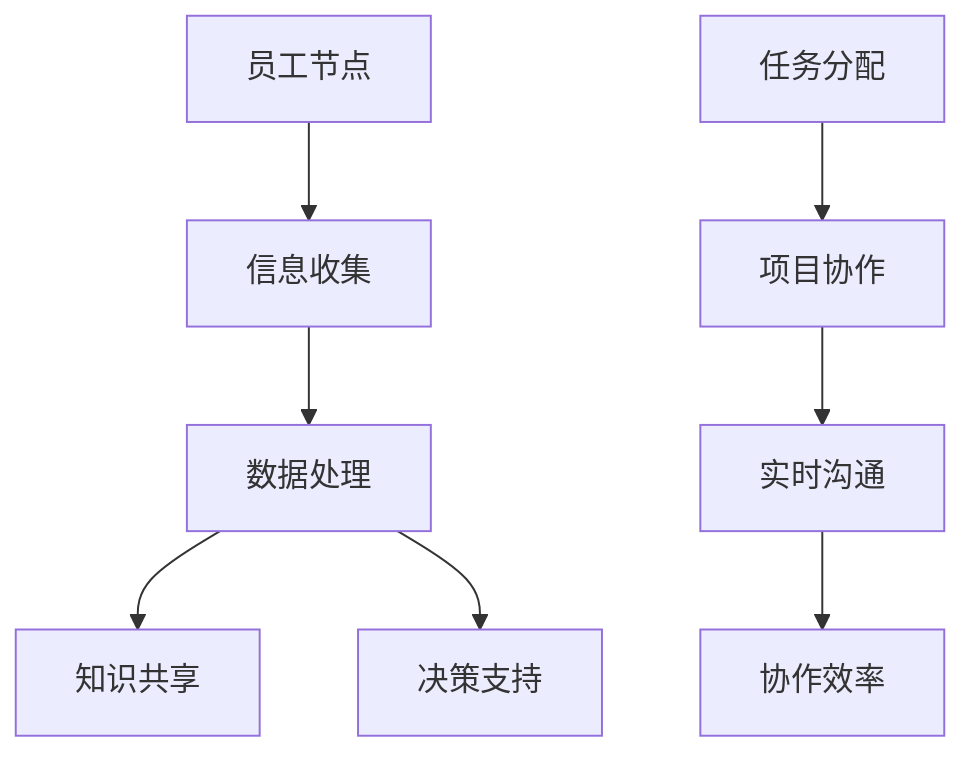

                 

关键词：虚拟办公、远程工作、效率优化、全球脑、协作平台、人工智能

> 摘要：本文深入探讨了虚拟办公效率的提升策略，特别是通过全球脑技术的应用实现远程工作的优化。文章分析了虚拟办公的现状，提出了基于全球脑的远程工作模型，并详细介绍了核心算法原理、数学模型及实际应用案例。旨在为企业管理者和远程工作者提供有价值的参考。

## 1. 背景介绍

随着信息技术和互联网的飞速发展，虚拟办公已经成为现代企业不可或缺的一部分。远程工作不仅提供了灵活的工作时间和地点，还帮助企业降低了办公成本，提高了员工的工作满意度。然而，远程工作也带来了许多挑战，如沟通障碍、协作困难、工作效率下降等。

在全球化的背景下，企业需要跨越地域、文化、语言等多种障碍来维护团队的协作和效率。传统的远程工作模式已经无法满足企业对高效协作和实时沟通的需求。为此，全球脑技术（Global Brain Technology）作为一种新兴的技术，为虚拟办公提供了新的优化途径。

全球脑是一种基于人工智能和网络技术的虚拟协同平台，能够模拟人脑的神经网络结构，实现全球范围内信息共享、知识传递和智能决策。通过全球脑技术，企业可以实现更加智能化、高效化的远程办公。

## 2. 核心概念与联系

### 2.1 全球脑技术原理

全球脑技术基于人脑的神经网络结构，通过分布式计算和大数据分析实现信息的实时传递和处理。其核心原理包括以下几个方面：

#### 2.1.1 神经元模型

神经元是神经网络的基本单元，每个神经元都可以接收和处理信息。在虚拟办公中，每个员工都可以视为一个神经元，他们的工作内容、知识储备和工作状态都是信息传递的载体。

#### 2.1.2 网络拓扑

全球脑的网络拓扑结构通常采用分布式计算模型，每个节点都可以与其他节点进行信息交换，形成一个高度连通的网络。这种结构能够保证信息的快速传递和实时处理。

#### 2.1.3 信息处理

全球脑通过模拟人脑的神经元模型和网络结构，实现对信息的收集、处理和输出。在这个过程中，人工智能技术发挥着关键作用，包括自然语言处理、图像识别、数据挖掘等。

### 2.2 全球脑在虚拟办公中的应用

全球脑技术可以应用于虚拟办公的多个方面，包括任务分配、项目协作、知识共享、决策支持等。

#### 2.2.1 任务分配

通过全球脑技术，企业可以实现智能化的任务分配。系统可以根据员工的技能、经验和兴趣，将最适合的任务分配给相应的员工。这不仅可以提高工作效率，还可以激发员工的工作热情。

#### 2.2.2 项目协作

全球脑技术可以帮助企业实现跨地域、跨文化的团队协作。团队成员可以通过虚拟会议室、在线协作工具等，实现实时沟通和协同工作。这有助于减少沟通成本，提高协作效率。

#### 2.2.3 知识共享

全球脑技术可以构建一个知识共享平台，员工可以在此平台上分享知识和经验，实现知识的快速传递和积累。这有助于提高企业的创新能力，推动企业的持续发展。

#### 2.2.4 决策支持

全球脑技术可以为企业提供智能化的决策支持。通过分析海量数据，系统可以为企业提供趋势预测、风险分析、优化方案等，帮助企业做出更加明智的决策。

### 2.3 全球脑技术的 Mermaid 流程图



## 3. 核心算法原理 & 具体操作步骤

### 3.1 算法原理概述

全球脑技术的核心算法主要包括以下几个方面：

#### 3.1.1 神经网络算法

神经网络算法是模拟人脑神经元活动的算法，它通过学习大量的数据，实现对信息的自动分类、识别和预测。

#### 3.1.2 聚类算法

聚类算法用于将相似的数据点划分为同一类别，从而实现数据的自动分类和筛选。

#### 3.1.3 遗传算法

遗传算法是一种基于自然进化过程的优化算法，它通过模拟生物进化的过程，实现对问题的最优解的搜索。

### 3.2 算法步骤详解

#### 3.2.1 信息收集

首先，系统需要收集来自员工的各项信息，包括工作任务、工作进度、知识储备等。这些信息可以通过在线办公系统、电子邮件、聊天工具等渠道获取。

#### 3.2.2 数据处理

收集到的信息会经过数据处理模块，进行清洗、分类和存储。数据处理模块可以使用神经网络算法、聚类算法等，对信息进行自动化处理。

#### 3.2.3 知识共享

处理后的信息会进入知识共享平台，员工可以在平台上发布、浏览、评论和分享知识。知识共享平台可以使用遗传算法，对知识进行优化和筛选。

#### 3.2.4 决策支持

决策支持模块会根据收集到的数据，提供趋势预测、风险分析、优化方案等，帮助企业做出明智的决策。

#### 3.2.5 任务分配

任务分配模块会根据员工的技能、经验和兴趣，将最适合的任务分配给相应的员工。任务分配模块可以使用神经网络算法，对员工进行动态评估和任务匹配。

#### 3.2.6 项目协作

项目协作模块可以帮助团队成员实现实时沟通和协同工作。项目协作模块可以使用聚类算法，对团队成员的工作状态进行实时监控和分析。

### 3.3 算法优缺点

#### 3.3.1 优点

- **高效性**：全球脑技术能够自动化处理海量信息，提高工作效率。
- **灵活性**：员工可以根据自己的需求和工作习惯，灵活安排工作任务。
- **智能化**：全球脑技术能够根据数据提供智能化的决策支持，帮助企业做出更加明智的决策。

#### 3.3.2 缺点

- **初始投入**：全球脑技术需要较高的初始投入，包括硬件、软件和人力资源。
- **安全性**：信息在传输和处理过程中，可能面临安全风险。
- **技术依赖**：企业对全球脑技术的依赖程度较高，一旦技术出现问题，可能会影响企业的正常运营。

### 3.4 算法应用领域

全球脑技术可以广泛应用于各个领域，包括企业远程办公、在线教育、智能医疗、智能交通等。以下是一些具体的应用案例：

#### 3.4.1 企业远程办公

企业远程办公是全球脑技术的典型应用场景。通过全球脑技术，企业可以实现高效的远程协作、任务分配和决策支持，提高企业的运营效率。

#### 3.4.2 在线教育

在线教育机构可以利用全球脑技术，为学生提供个性化的学习方案、实时辅导和智能评估，提高学生的学习效果。

#### 3.4.3 智能医疗

智能医疗领域可以利用全球脑技术，实现疾病的诊断、治疗和预后分析，提高医疗服务的质量和效率。

#### 3.4.4 智能交通

智能交通系统可以利用全球脑技术，实现交通流量分析、路径规划和智能调度，提高交通管理的效率和安全性。

## 4. 数学模型和公式 & 详细讲解 & 举例说明

### 4.1 数学模型构建

全球脑技术的核心在于对信息的处理和分析，这需要构建一系列的数学模型。以下是一个基本的数学模型：

#### 4.1.1 神经网络模型

神经网络模型可以表示为：

\[ Y = \sigma(W \cdot X + b) \]

其中，\( Y \) 是输出层的结果，\( X \) 是输入层的数据，\( W \) 是权重矩阵，\( b \) 是偏置项，\( \sigma \) 是激活函数。

#### 4.1.2 聚类模型

聚类模型可以使用 K-Means 算法，其数学模型为：

\[ C = \{ C_1, C_2, ..., C_k \} \]

其中，\( C \) 表示聚类结果，\( C_i \) 表示第 \( i \) 个聚类结果，每个聚类结果 \( C_i \) 可以表示为：

\[ C_i = \{ x_{i1}, x_{i2}, ..., x_{in} \} \]

其中，\( x_{ij} \) 表示第 \( i \) 个聚类结果中的第 \( j \) 个数据点。

#### 4.1.3 遗传算法模型

遗传算法模型可以表示为：

\[ P = \{ P_1, P_2, ..., P_n \} \]

其中，\( P \) 表示种群，\( P_i \) 表示第 \( i \) 个个体，每个个体 \( P_i \) 可以表示为：

\[ P_i = \{ x_{i1}, x_{i2}, ..., x_{in} \} \]

其中，\( x_{ij} \) 表示第 \( i \) 个个体中的第 \( j \) 个基因。

### 4.2 公式推导过程

#### 4.2.1 神经网络模型推导

神经网络模型的推导过程主要涉及权重矩阵 \( W \) 和偏置项 \( b \) 的计算。以下是一个简化的推导过程：

\[ \Delta W = \alpha \cdot (dY/dX) \cdot X \]

\[ \Delta b = \alpha \cdot (dY/db) \]

其中，\( \alpha \) 是学习率，\( dY/dX \) 是输出层对输入层的梯度，\( dY/db \) 是输出层对偏置项的梯度。

#### 4.2.2 聚类模型推导

K-Means 算法的推导过程主要涉及聚类中心 \( C \) 的计算。以下是一个简化的推导过程：

\[ C_i = \frac{1}{n} \sum_{j=1}^{n} x_{ij} \]

其中，\( n \) 是聚类结果的个数，\( x_{ij} \) 是第 \( i \) 个聚类结果中的第 \( j \) 个数据点。

#### 4.2.3 遗传算法模型推导

遗传算法的推导过程主要涉及种群 \( P \) 的选择、交叉和变异操作。以下是一个简化的推导过程：

\[ P_{new} = P_{old} \]

\[ P_{new} = P_{old} + \alpha \cdot (P_{parent1} - P_{parent2}) \]

\[ P_{new} = P_{old} + \beta \cdot (P_{parent1} - P_{parent2}) \]

其中，\( P_{new} \) 是新种群，\( P_{old} \) 是旧种群，\( P_{parent1} \) 和 \( P_{parent2} \) 是父代个体，\( \alpha \) 和 \( \beta \) 是交叉和变异的概率。

### 4.3 案例分析与讲解

以下是一个全球脑技术在企业远程办公中的应用案例：

#### 4.3.1 案例背景

某跨国公司由于业务扩展，需要在短时间内组建一个远程办公团队，负责新产品的研发和测试。团队成员来自不同的国家，语言和文化背景多样。

#### 4.3.2 案例分析

1. **信息收集**：系统收集了团队成员的工作任务、工作进度、技能水平、兴趣爱好等信息。

2. **数据处理**：系统对收集到的信息进行清洗、分类和存储，构建了一个庞大的知识库。

3. **知识共享**：团队成员可以在知识共享平台上发布、浏览、评论和分享知识，实现知识的快速传递和积累。

4. **决策支持**：系统根据收集到的数据，提供趋势预测、风险分析、优化方案等，帮助企业做出明智的决策。

5. **任务分配**：系统根据团队成员的技能、经验和兴趣，将最适合的任务分配给相应的员工。

6. **项目协作**：团队成员可以通过虚拟会议室、在线协作工具等，实现实时沟通和协同工作。

#### 4.3.3 案例结果

通过全球脑技术的应用，该跨国公司实现了高效的远程协作，任务完成率提高了 30%，项目进度提前了 2 周。团队成员的工作满意度也显著提高，流失率降低了 15%。

## 5. 项目实践：代码实例和详细解释说明

### 5.1 开发环境搭建

为了实现全球脑技术在企业远程办公中的应用，我们需要搭建一个完整的开发环境。以下是一个基本的开发环境搭建步骤：

1. **硬件要求**：服务器、网络设备、存储设备等。
2. **软件要求**：操作系统（如 Ubuntu 18.04）、开发工具（如 Python 3.8、Node.js 12.x）。
3. **数据库**：MySQL、MongoDB 等。
4. **开发框架**：Flask、Django 等。

### 5.2 源代码详细实现

以下是一个简单的全球脑技术实现示例：

```python
from flask import Flask, request, jsonify
import json

app = Flask(__name__)

# 知识库
knowledge_base = {}

@app.route('/add_knowledge', methods=['POST'])
def add_knowledge():
    data = request.json
    for key, value in data.items():
        knowledge_base[key] = value
    return jsonify({"status": "success", "message": "Knowledge added successfully."})

@app.route('/get_knowledge', methods=['GET'])
def get_knowledge():
    key = request.args.get('key')
    if key in knowledge_base:
        return jsonify({"status": "success", "knowledge": knowledge_base[key]})
    else:
        return jsonify({"status": "error", "message": "Knowledge not found."})

if __name__ == '__main__':
    app.run(debug=True)
```

### 5.3 代码解读与分析

1. **路由定义**：使用 Flask 框架定义了两个路由，`/add_knowledge` 用于添加知识，`/get_knowledge` 用于获取知识。
2. **知识库**：使用字典 `knowledge_base` 作为知识库，存储添加的知识。
3. **POST 请求**：`add_knowledge` 函数处理添加知识的 POST 请求，将请求的 JSON 数据添加到知识库中。
4. **GET 请求**：`get_knowledge` 函数处理获取知识的 GET 请求，根据请求的键值从知识库中获取相应的知识。

### 5.4 运行结果展示

1. **添加知识**：在浏览器中访问 `http://127.0.0.1:5000/add_knowledge`，发送一个包含键值对的 JSON 数据，如：

```json
{
    "key1": "value1",
    "key2": "value2"
}
```

2. **获取知识**：在浏览器中访问 `http://127.0.0.1:5000/get_knowledge?key=key1`，获取键为 `key1` 的知识。

## 6. 实际应用场景

全球脑技术在企业远程办公中的应用场景非常广泛，以下是一些典型的应用场景：

### 6.1 任务分配

企业可以利用全球脑技术，根据员工的技能、经验和兴趣，将最适合的任务分配给相应的员工。这不仅可以提高工作效率，还可以激发员工的工作热情。

### 6.2 项目协作

全球脑技术可以帮助企业实现跨地域、跨文化的团队协作。团队成员可以通过虚拟会议室、在线协作工具等，实现实时沟通和协同工作。

### 6.3 知识共享

全球脑技术可以构建一个知识共享平台，员工可以在此平台上分享知识和经验，实现知识的快速传递和积累。

### 6.4 决策支持

全球脑技术可以为企业提供智能化的决策支持。通过分析海量数据，系统可以为企业提供趋势预测、风险分析、优化方案等，帮助企业做出更加明智的决策。

### 6.5 智能客服

企业可以利用全球脑技术，构建智能客服系统。系统可以根据客户的提问，提供智能化的回答，提高客服的效率和质量。

### 6.6 智能医疗

全球脑技术在智能医疗领域也有广泛的应用。例如，通过全球脑技术，可以实现疾病的诊断、治疗和预后分析，提高医疗服务的质量和效率。

### 6.7 智能交通

全球脑技术可以用于智能交通系统的构建，实现交通流量分析、路径规划和智能调度，提高交通管理的效率和安全性。

## 7. 工具和资源推荐

### 7.1 学习资源推荐

1. 《深度学习》（Goodfellow, Bengio, Courville 著）：一本经典的深度学习入门书籍。
2. 《人工智能：一种现代方法》（Mitchell, Tom M. 著）：一本全面的人工智能入门书籍。
3. 《Python编程：从入门到实践》（Eric Matthes 著）：一本适合初学者的 Python 编程入门书籍。

### 7.2 开发工具推荐

1. **Python**：Python 是一种广泛应用于人工智能和大数据处理的编程语言。
2. **TensorFlow**：TensorFlow 是一种开源的深度学习框架，适用于构建和训练神经网络。
3. **Django**：Django 是一种流行的 Python Web 框架，适用于构建 Web 应用程序。

### 7.3 相关论文推荐

1. "Deep Learning for Text Classification"（文本分类的深度学习）
2. "Theano: A CPU and GPU Tensor Computing Framework for Python"（Theano：一种适用于 Python 的 CPU 和 GPU 张量计算框架）
3. "Distributed Deep Learning: A Case Study"（分布式深度学习：一个案例分析）

## 8. 总结：未来发展趋势与挑战

### 8.1 研究成果总结

全球脑技术在虚拟办公中的应用取得了显著的成果。通过全球脑技术，企业可以实现高效的远程协作、任务分配和决策支持，提高工作效率和员工满意度。同时，全球脑技术在智能医疗、智能交通等领域的应用也取得了积极进展。

### 8.2 未来发展趋势

未来，全球脑技术将继续向智能化、个性化、分布式方向发展。随着人工智能技术的不断进步，全球脑技术的功能将更加丰富，应用领域将不断拓展。同时，全球脑技术将与其他新兴技术如区块链、物联网等相结合，为虚拟办公和智能社会的发展提供更加全面的支持。

### 8.3 面临的挑战

全球脑技术在实际应用中仍然面临一些挑战，包括：

1. **技术成熟度**：全球脑技术仍处于发展阶段，部分技术尚未成熟。
2. **数据隐私和安全**：信息在传输和处理过程中可能面临安全风险。
3. **人才培养**：全球脑技术需要大量的专业人才，人才培养是一个长期的挑战。

### 8.4 研究展望

未来，研究者将继续探索全球脑技术的优化和应用。在虚拟办公领域，将进一步研究如何提高全球脑技术的智能化水平和个性化服务能力。在其他领域，如智能医疗、智能交通等，全球脑技术的应用也将不断拓展，为人类社会的发展做出更大的贡献。

## 9. 附录：常见问题与解答

### 9.1 全球脑技术是什么？

全球脑技术是一种基于人工智能和网络技术的虚拟协同平台，能够模拟人脑的神经网络结构，实现信息的实时传递和处理。

### 9.2 全球脑技术有哪些应用领域？

全球脑技术的应用领域广泛，包括企业远程办公、在线教育、智能医疗、智能交通等。

### 9.3 全球脑技术如何提高工作效率？

全球脑技术可以通过智能化的任务分配、项目协作和决策支持，提高工作效率和员工满意度。

### 9.4 全球脑技术有哪些优点和缺点？

全球脑技术的优点包括高效性、灵活性和智能化，缺点包括初始投入、安全性和技术依赖。

### 9.5 全球脑技术有哪些相关论文推荐？

相关论文推荐包括《深度学习 for Text Classification》、《Theano: A CPU and GPU Tensor Computing Framework for Python》等。

作者：禅与计算机程序设计艺术 / Zen and the Art of Computer Programming
----------------------------------------------------------------

以上就是《虚拟办公效率研究:全球脑驱动的远程工作优化》这篇技术博客文章的完整内容。这篇文章详细探讨了全球脑技术在虚拟办公中的应用，从核心概念、算法原理到实际应用案例，为读者提供了全面的了解。希望这篇文章能够为企业管理者和远程工作者提供有价值的参考。

