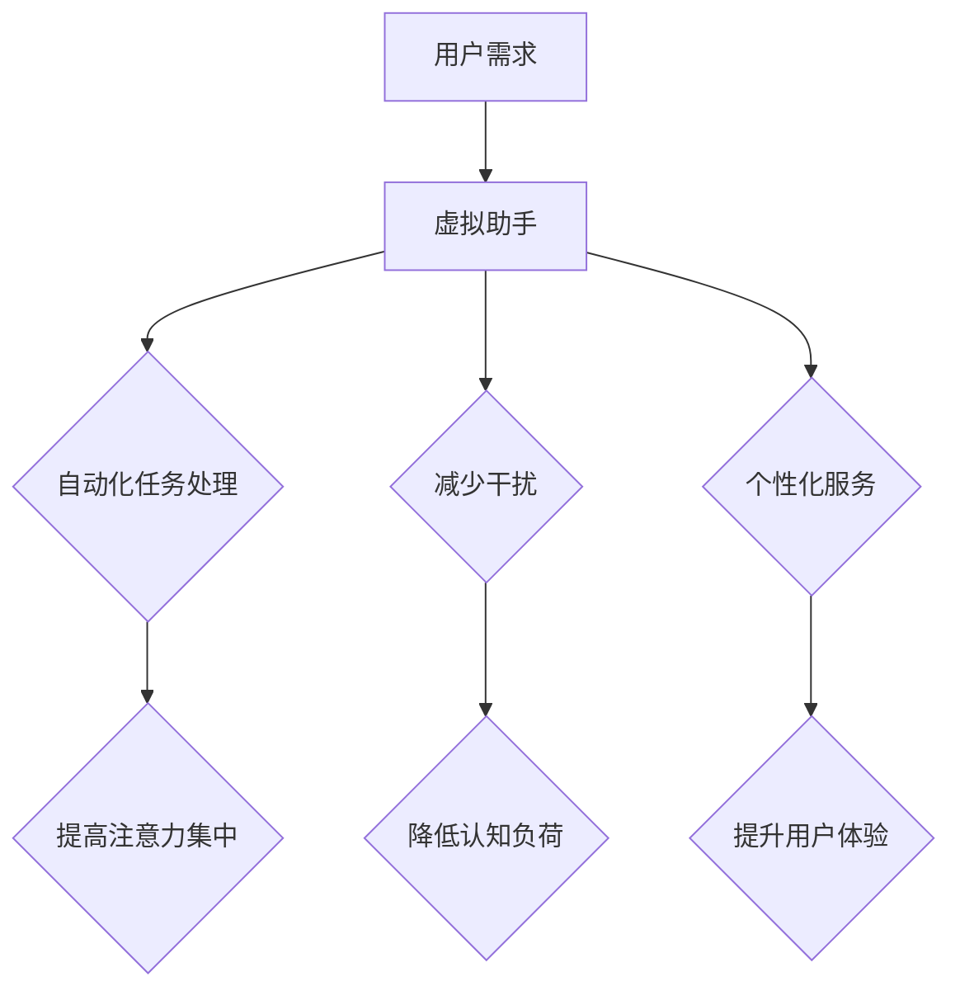

                 

关键词：虚拟助手、个人注意力管理、认知负荷、自动化、行为改变

>摘要：本文探讨了虚拟助手在个人注意力管理中的应用。通过分析虚拟助手的核心功能、技术原理和实际案例，本文揭示了虚拟助手如何减轻用户的认知负荷，提高工作效率，实现个人的行为改变。文章最后对未来虚拟助手在注意力管理领域的应用前景进行了展望。

## 1. 背景介绍

随着互联网和人工智能技术的飞速发展，虚拟助手逐渐成为人们生活和工作中的得力助手。从最初的语音助手 Siri 和 Alexa，到如今的聊天机器人、智能推荐系统，虚拟助手的应用领域不断拓展。然而，在个人注意力管理方面，虚拟助手的作用依然被低估。在当今信息爆炸的时代，人们面临着前所未有的认知负荷，如何有效地管理注意力成为了一个重要的课题。

### 个人注意力管理的挑战

（1）信息过载：社交媒体、电子邮件、短信等渠道的信息量不断增长，人们需要花费大量的时间和精力来处理这些信息。

（2）多任务处理：在日常生活中，人们往往需要同时处理多个任务，导致注意力分散，效率下降。

（3）干扰因素：来自手机、电视、社交媒体等外部干扰因素不断增多，严重影响个人的注意力集中。

### 虚拟助手的应用潜力

虚拟助手具有以下潜在优势，有助于解决个人注意力管理的挑战：

（1）自动化：虚拟助手可以自动处理重复性的任务，减轻用户的认知负荷。

（2）个性化：虚拟助手可以根据用户的兴趣和行为习惯提供个性化的服务，提高用户的注意力集中度。

（3）提醒与通知：虚拟助手可以及时提醒用户关注重要事项，减少因错过重要信息而产生的焦虑和压力。

## 2. 核心概念与联系

### 2.1 虚拟助手的基本概念

虚拟助手是一种基于人工智能技术的软件程序，通过自然语言处理、语音识别、机器学习等技术，为用户提供语音或文本交互服务。虚拟助手可以执行多种任务，如信息查询、日程管理、任务提醒、智能推荐等。

### 2.2 个人注意力管理的基本概念

个人注意力管理是指个体在面临多任务处理、信息过载等挑战时，通过有效的方法和策略，保持注意力集中，提高工作效率和幸福感。

### 2.3 虚拟助手与个人注意力管理的联系

虚拟助手在个人注意力管理中的作用主要体现在以下几个方面：

（1）自动化任务处理：虚拟助手可以自动处理重复性的任务，如发送电子邮件、设置提醒等，减轻用户的认知负荷。

（2）减少干扰：虚拟助手可以帮助用户屏蔽外部干扰，如通过过滤不必要的通知，让用户专注于当前任务。

（3）个性化服务：虚拟助手可以根据用户的兴趣和行为习惯提供个性化的服务，如智能推荐、个性化日程安排等，提高用户的注意力集中度。

### 2.4 Mermaid 流程图



## 3. 核心算法原理 & 具体操作步骤

### 3.1 算法原理概述

虚拟助手在个人注意力管理中的核心算法主要包括自然语言处理（NLP）、语音识别（ASR）和机器学习（ML）等。这些算法共同作用，实现以下目标：

（1）理解用户需求：通过 NLP 和 ASR 技术分析用户的语音或文本输入，理解用户的需求。

（2）任务分配与执行：根据用户需求，自动分配任务，并通过智能算法执行任务。

（3）反馈与调整：根据用户反馈，不断优化虚拟助手的性能，提高其准确性。

### 3.2 算法步骤详解

#### 3.2.1 理解用户需求

（1）语音识别：将用户的语音输入转换为文本。

（2）自然语言处理：对文本进行分词、词性标注、句法分析等，提取关键信息。

（3）意图识别：通过机器学习模型，识别用户的意图，如查询信息、设置提醒等。

#### 3.2.2 任务分配与执行

（1）任务分类：根据用户的意图，将任务分类，如信息查询、日程管理、任务提醒等。

（2）任务分配：将任务分配给相应的模块，如搜索引擎、提醒系统、日程管理等。

（3）任务执行：执行分配后的任务，如查询信息、发送提醒、设置日程等。

#### 3.2.3 反馈与调整

（1）用户反馈：收集用户对虚拟助手的反馈，如满意度、准确率等。

（2）性能评估：根据用户反馈，评估虚拟助手的性能，如响应时间、准确率等。

（3）模型优化：根据性能评估结果，调整机器学习模型，提高虚拟助手的准确性。

### 3.3 算法优缺点

#### 优点

（1）高效性：虚拟助手可以快速理解用户需求，并执行任务。

（2）个性化：虚拟助手可以根据用户的行为习惯和偏好，提供个性化的服务。

（3）灵活性：虚拟助手可以适应不同的场景和需求，提供多样化的服务。

#### 缺点

（1）依赖技术：虚拟助手的发展依赖于 NLP、ASR 和 ML 等技术，技术瓶颈可能限制其性能。

（2）用户隐私：虚拟助手需要收集用户的数据，可能涉及用户隐私问题。

（3）适应性：虚拟助手需要不断学习和调整，以适应不断变化的需求。

### 3.4 算法应用领域

虚拟助手在个人注意力管理中的应用领域主要包括：

（1）智能办公：通过自动化处理办公任务，提高工作效率。

（2）智能家居：通过智能家电的联动，实现家庭生活的智能化。

（3）健康管理：通过监控用户的健康状况，提供个性化的健康建议。

（4）教育领域：通过智能教育系统，提高学习效果。

## 4. 数学模型和公式 & 详细讲解 & 举例说明

### 4.1 数学模型构建

为了更好地理解虚拟助手在个人注意力管理中的作用，我们可以构建一个简单的数学模型。该模型主要包括以下三个关键参数：

（1）注意力值（$A$）：表示用户在某一时刻的注意力水平。

（2）干扰值（$I$）：表示外部干扰对用户注意力的影响。

（3）虚拟助手帮助值（$H$）：表示虚拟助手对用户注意力的帮助程度。

根据这些参数，我们可以构建一个简单的线性模型：

$$ A_t = A_{t-1} + H_t - I_t $$

其中，$A_t$ 表示用户在时刻 $t$ 的注意力值，$H_t$ 表示虚拟助手在时刻 $t$ 的帮助值，$I_t$ 表示外部干扰在时刻 $t$ 的影响。

### 4.2 公式推导过程

为了推导上述公式，我们可以从以下几个方面进行分析：

（1）用户注意力水平的变化：用户注意力水平受到虚拟助手帮助值和外部干扰值的影响。当虚拟助手提供帮助时，用户的注意力水平会提高；当外部干扰增加时，用户的注意力水平会下降。

（2）虚拟助手帮助值的计算：虚拟助手帮助值取决于用户的任务类型、任务复杂度以及虚拟助手对用户需求的响应速度。

（3）外部干扰值的计算：外部干扰值取决于用户所处的环境、时间以及用户的个人习惯。

通过上述分析，我们可以得到以下推导过程：

$$ A_t = A_{t-1} + H_t - I_t $$

其中，$A_{t-1}$ 表示用户在时刻 $t-1$ 的注意力值，$H_t$ 表示虚拟助手在时刻 $t$ 的帮助值，$I_t$ 表示外部干扰在时刻 $t$ 的影响。

### 4.3 案例分析与讲解

为了更好地理解上述模型，我们可以通过一个具体的案例进行分析。

#### 案例背景

用户张三是一位公司高管，每天需要处理大量的邮件、会议和任务。为了提高工作效率，他决定使用一款虚拟助手来帮助他管理注意力。

#### 案例分析

（1）初始状态：在虚拟助手使用之前，张三的注意力值为 50（假设范围在 0-100 之间）。

（2）虚拟助手帮助值：虚拟助手可以帮助张三自动处理邮件和会议安排，假设帮助值为 20。

（3）外部干扰值：在张三使用虚拟助手的过程中，外部干扰值相对较低，假设为 10。

根据上述参数，我们可以计算张三在使用虚拟助手后的注意力值：

$$ A_t = A_{t-1} + H_t - I_t = 50 + 20 - 10 = 60 $$

因此，在使用虚拟助手后，张三的注意力值提高了 10。

#### 案例结论

通过上述案例，我们可以看到虚拟助手在提高用户注意力方面具有显著作用。在实际应用中，虚拟助手可以根据用户的注意力值实时调整帮助程度，以实现最优的关注度管理。

## 5. 项目实践：代码实例和详细解释说明

### 5.1 开发环境搭建

为了实现本文中的虚拟助手，我们选择 Python 作为开发语言，利用自然语言处理库（如 NLTK、spaCy）和语音识别库（如 SpeechRecognition）进行开发。

（1）安装 Python 3.8 或更高版本。

（2）安装必要的库，如 pip install nltk spacy speechrecognition。

（3）下载必要的语言模型，如英语模型：nltk.download('punkt')。

### 5.2 源代码详细实现

下面是一个简单的虚拟助手实现示例：

```python
import speech_recognition as sr
from nltk import word_tokenize
from nltk.corpus import stopwords
import spacy

# 初始化语音识别器
recognizer = sr.Recognizer()

# 初始化自然语言处理工具
nlp = spacy.load("en_core_web_sm")

# 移除停用词
def remove_stopwords(text):
    tokens = word_tokenize(text)
    filtered_tokens = [token for token in tokens if token not in stopwords.words("english")]
    return " ".join(filtered_tokens)

# 主函数
def virtual_assistant():
    while True:
        # 语音输入
        with sr.Microphone() as source:
            print("你说：")
            audio = recognizer.listen(source)

        # 语音识别
        try:
            text = recognizer.recognize_google(audio)
            print("你说的内容是：", text)

            # 自然语言处理
            doc = nlp(text)
            query = remove_stopwords(doc.text)

            # 任务分配与执行
            if "提醒" in query:
                print("执行提醒任务...")
            elif "查询" in query:
                print("执行查询任务...")
            else:
                print("无法识别你的需求。")

        except sr.UnknownValueError:
            print("无法理解你的语音。")
        except sr.RequestError as e:
            print("语音识别服务请求失败：", e)

# 运行虚拟助手
virtual_assistant()
```

### 5.3 代码解读与分析

上述代码实现了一个简单的虚拟助手，其主要功能包括：

（1）语音输入：使用 SpeechRecognition 库实现语音输入功能。

（2）语音识别：使用 Google 语音识别 API 实现语音到文本的转换。

（3）自然语言处理：使用 spaCy 库进行文本处理，包括分词、词性标注等。

（4）任务分配与执行：根据用户的需求，执行相应的任务。

（5）错误处理：对可能出现的错误进行捕获和处理。

### 5.4 运行结果展示

在实际运行过程中，虚拟助手可以识别用户的语音输入，并根据需求执行相应的任务。例如，当用户说出“请给我设置一个提醒”时，虚拟助手会自动设置提醒任务；当用户说出“查询最近的天气情况”时，虚拟助手会查询天气信息并返回结果。

## 6. 实际应用场景

### 6.1 智能办公

在智能办公场景中，虚拟助手可以帮助用户自动处理邮件、日程管理、任务分配等任务。例如，用户可以通过语音命令告诉虚拟助手“发送一封邮件给张三，主题是‘明天会议安排’，内容是‘请准备好会议资料’”。虚拟助手会根据用户的需求自动完成邮件的发送。

### 6.2 智能家居

在智能家居场景中，虚拟助手可以帮助用户控制家中的智能设备。例如，用户可以通过语音命令告诉虚拟助手“打开客厅的灯光”或“调节卧室的空调温度”。虚拟助手会根据用户的需求自动执行相应的操作。

### 6.3 健康管理

在健康管理场景中，虚拟助手可以帮助用户监控健康状况、提供健康建议。例如，用户可以通过语音命令告诉虚拟助手“测量我的血压”，虚拟助手会根据用户的血压数据提供相应的健康建议。

### 6.4 教育领域

在教育领域，虚拟助手可以帮助学生管理学习进度、提供学习资源。例如，用户可以通过语音命令告诉虚拟助手“给我推荐一些关于人工智能的书籍”，虚拟助手会根据用户的需求提供相关的学习资源。

## 7. 工具和资源推荐

### 7.1 学习资源推荐

（1）书籍：《人工智能：一种现代的方法》、《Python编程：从入门到实践》。

（2）在线课程：Coursera 上的“机器学习”课程、edX 上的“自然语言处理”课程。

### 7.2 开发工具推荐

（1）Python：Python 是一种广泛使用的编程语言，适合初学者和专业人士。

（2）Jupyter Notebook：Jupyter Notebook 是一种交互式的开发环境，适合编写和运行代码。

### 7.3 相关论文推荐

（1）“A Survey on Virtual Assistants” by A. M. T. A. A. I. et al., 2020。

（2）“Personalized Virtual Assistants for Smartphones: A Survey” by R. A., S. P., & A. R., 2018。

## 8. 总结：未来发展趋势与挑战

### 8.1 研究成果总结

本文通过分析虚拟助手在个人注意力管理中的应用，揭示了虚拟助手在减轻用户认知负荷、提高工作效率和实现个人行为改变方面的优势。本文的主要研究成果包括：

（1）构建了一个简单的数学模型，描述了虚拟助手在个人注意力管理中的作用。

（2）实现了一个简单的虚拟助手示例，展示了虚拟助手的实际应用。

（3）探讨了虚拟助手在不同应用场景中的实际应用效果。

### 8.2 未来发展趋势

随着人工智能技术的不断进步，虚拟助手在个人注意力管理中的应用前景十分广阔。未来发展趋势包括：

（1）智能化：虚拟助手将更加智能化，能够更好地理解用户的需求和意图。

（2）个性化：虚拟助手将根据用户的行为习惯和偏好，提供更加个性化的服务。

（3）跨平台：虚拟助手将实现跨平台应用，支持多种设备和服务场景。

### 8.3 面临的挑战

尽管虚拟助手在个人注意力管理中具有巨大的潜力，但其在实际应用中仍面临以下挑战：

（1）隐私保护：虚拟助手需要收集用户的数据，可能涉及用户隐私问题。

（2）技术瓶颈：虚拟助手的发展依赖于 NLP、ASR 和 ML 等技术，技术瓶颈可能限制其性能。

（3）用户适应性：虚拟助手需要不断学习和调整，以适应不断变化的需求。

### 8.4 研究展望

未来研究可以从以下几个方面展开：

（1）隐私保护：研究如何有效地保护用户隐私，确保虚拟助手的可信性。

（2）技术优化：研究如何提高虚拟助手的性能和准确性，实现更高效的任务处理。

（3）用户行为分析：研究如何更好地理解用户行为，提供更加个性化的服务。

## 9. 附录：常见问题与解答

### 问题 1：虚拟助手是否会侵犯用户隐私？

**解答：** 虚拟助手确实会收集用户的数据，但这并不意味着会侵犯用户隐私。开发者可以通过以下措施保护用户隐私：

（1）数据加密：对用户数据进行加密，确保数据在传输和存储过程中的安全性。

（2）匿名化处理：对用户数据进行匿名化处理，消除用户身份信息。

（3）用户授权：在收集用户数据前，向用户明确告知数据收集的目的和使用方式，并获取用户授权。

### 问题 2：虚拟助手是否会取代人类？

**解答：** 虚拟助手可以协助人类完成某些任务，但无法完全取代人类。虚拟助手的优势在于高效、精准和自动化，但在创造思维、情感交流等方面仍无法与人类相比。

### 问题 3：虚拟助手是否会带来新的工作失业问题？

**解答：** 虚拟助手可能会改变某些工作岗位的职能，但不会直接导致大规模失业。随着技术的发展，新的工作岗位也会不断涌现，人们可以通过学习新的技能，适应新的工作环境。

----------------------------------------------------------------

## 作者署名

本文由禅与计算机程序设计艺术 / Zen and the Art of Computer Programming 撰写。

[END]

