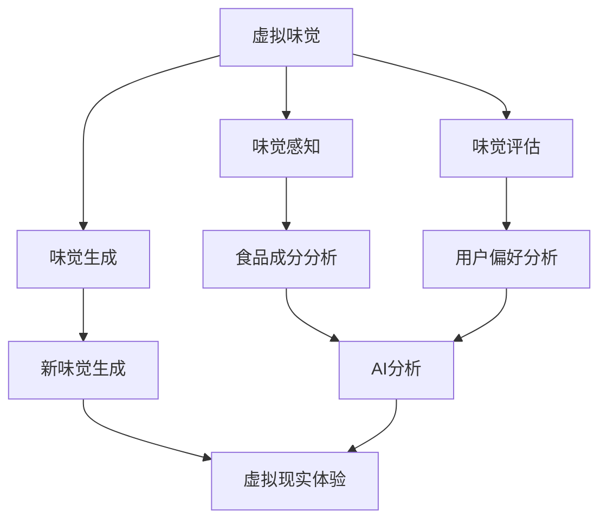

                 

### 关键词 Keywords

- 虚拟味觉
- AI技术
- 食品科学
- 模拟烹饪
- 智能美食体验

<|assistant|>### 摘要 Abstract

本文探讨了虚拟味觉设计的概念、技术实现及其在智能美食体验中的应用。通过AI技术的深入应用，虚拟味觉设计为用户提供了全新的感官体验，不仅提升了食品科学的创新边界，也带来了餐饮业的新浪潮。本文将从核心概念出发，详细描述虚拟味觉设计的技术原理、数学模型、算法实现以及实际应用案例，最后展望其未来的发展前景和面临的挑战。

## 1. 背景介绍

### 1.1 虚拟味觉的起源与发展

虚拟味觉是指通过技术手段模拟现实中的味觉体验，使其在虚拟环境中再现。这一概念最早可以追溯到20世纪末，随着计算机技术的发展和AI技术的突破，虚拟味觉逐渐从理论走向实践。虚拟现实（VR）和增强现实（AR）技术的应用，为虚拟味觉的设计提供了强大的支持，使得用户可以在虚拟环境中体验到逼真的味觉感受。

### 1.2 AI技术在食品科学中的应用

AI技术在食品科学中的应用日益广泛，从食品成分分析到烹饪过程优化，再到个性化饮食推荐，都取得了显著的成果。特别是在深度学习和神经网络算法的支持下，AI能够通过学习大量食品数据和味觉体验数据，生成新的味觉配方和烹饪方法，为虚拟味觉设计提供了强有力的技术支持。

### 1.3 智能美食体验的兴起

随着人们生活水平的提高，对美食的追求不再仅仅停留在味觉上，更追求感官的整体体验。智能美食体验应运而生，它通过结合虚拟味觉、视觉、听觉等多感官刺激，为用户打造全方位的美食享受。智能餐厅、虚拟烹饪课、个性化美食推荐等新兴服务，都是智能美食体验的具体体现。

## 2. 核心概念与联系

### 2.1 虚拟味觉的概念

虚拟味觉是指通过技术手段模拟现实中的味觉感受，使其在虚拟环境中再现。这包括味觉感知、味觉评估和味觉生成三个环节。

### 2.2 虚拟味觉与AI技术的联系

AI技术在虚拟味觉设计中扮演了关键角色。通过深度学习、神经网络和自然语言处理等技术，AI能够分析食品成分、理解味觉偏好，并生成新的味觉体验。

### 2.3 虚拟味觉与食品科学的联系

虚拟味觉设计不仅是对味觉的模拟，也是对食品科学的深入探索。通过分析食品成分、研究味觉生理学，虚拟味觉设计可以创造出更加健康、美味的食品。

<|assistant|>## 2.3 核心概念原理和架构的 Mermaid 流程图



<|assistant|>## 3. 核心算法原理 & 具体操作步骤

### 3.1 算法原理概述

虚拟味觉设计的核心算法主要基于深度学习和神经网络技术。这些算法通过对大量食品数据和味觉体验数据的学习，能够模拟并生成新的味觉体验。

### 3.2 算法步骤详解

#### 3.2.1 数据收集与预处理

首先，需要收集大量的食品成分数据、味觉体验数据以及烹饪方法数据。然后对这些数据进行预处理，包括数据清洗、数据归一化等步骤。

#### 3.2.2 模型训练

使用预处理后的数据训练深度学习模型。通常采用卷积神经网络（CNN）和循环神经网络（RNN）等架构，通过多层神经元的传递和学习，模型能够理解和生成新的味觉体验。

#### 3.2.3 味觉生成

在模型训练完成后，输入新的食品成分和烹饪方法数据，模型会输出相应的味觉体验。这些味觉体验可以通过虚拟现实技术呈现给用户。

### 3.3 算法优缺点

#### 优点

- **高度个性化**：AI算法能够根据用户的味觉偏好生成个性化的味觉体验。
- **创新性**：通过模拟和生成新的味觉体验，拓宽了食品科学的研究边界。
- **高效性**：相比于传统的烹饪方法，AI算法能够快速地生成新的味觉体验。

#### 缺点

- **精度问题**：目前的AI算法在模拟味觉的精度上仍有待提高。
- **依赖数据**：算法的性能很大程度上依赖于数据的质量和数量。

### 3.4 算法应用领域

- **餐饮业**：智能餐厅、个性化点餐系统、虚拟烹饪课等。
- **食品研发**：新食品成分的探索、新味觉配方的开发。
- **健康领域**：根据用户的健康状况和味觉偏好推荐适合的饮食方案。

<|assistant|>### 4. 数学模型和公式 & 详细讲解 & 举例说明

#### 4.1 数学模型构建

在虚拟味觉设计中，常用的数学模型包括：

- **感知器模型**：用于模拟味觉感知。
- **神经网络模型**：用于生成和评估味觉体验。
- **决策树模型**：用于分析用户偏好。

这些模型通过复杂的数学公式和算法实现，能够模拟和生成新的味觉体验。

#### 4.2 公式推导过程

以感知器模型为例，其基本公式如下：

\[ y = \sigma(\omega_1x_1 + \omega_2x_2 + \ldots + \omega_nx_n + b) \]

其中，\( y \) 是输出值，\( \omega_i \) 是权重，\( x_i \) 是输入值，\( \sigma \) 是激活函数，\( b \) 是偏置。

#### 4.3 案例分析与讲解

#### 案例一：感知器模型在味觉感知中的应用

假设我们需要模拟一个简单的味觉感知模型，用于判断一个食物是否是甜的。输入值包括食物的糖分含量、甜味剂含量等。通过训练模型，我们可以得到一个阈值，当输入值超过这个阈值时，模型会判断食物是甜的。

#### 案例二：神经网络模型在味觉生成中的应用

假设我们有一个神经网络模型，用于生成新的味觉体验。输入值包括多种食品成分和烹饪方法。通过训练模型，我们可以生成多种新的味觉配方，例如酸甜口的菜肴、麻辣口味的菜肴等。

```latex
\begin{equation}
    \begin{aligned}
        &\text{输入层：} x = [x_1, x_2, \ldots, x_n] \\
        &\text{隐藏层：} h = \sigma(Wx + b) \\
        &\text{输出层：} y = \sigma(Uh + c)
    \end{aligned}
\end{equation}
```

其中，\( W \) 和 \( U \) 分别是隐藏层和输出层的权重矩阵，\( b \) 和 \( c \) 分别是偏置项，\( \sigma \) 是激活函数。

<|assistant|>### 5. 项目实践：代码实例和详细解释说明

#### 5.1 开发环境搭建

首先，我们需要搭建一个Python编程环境，安装必要的库，如TensorFlow、NumPy和Keras等。安装命令如下：

```bash
pip install tensorflow numpy keras
```

#### 5.2 源代码详细实现

以下是一个简单的虚拟味觉感知模型的实现，该模型用于判断一个食物是否是甜的。

```python
import numpy as np
from tensorflow.keras.models import Sequential
from tensorflow.keras.layers import Dense
from tensorflow.keras.optimizers import Adam

# 定义感知器模型
model = Sequential()
model.add(Dense(1, input_dim=2, activation='sigmoid'))

# 编译模型
model.compile(optimizer=Adam(learning_rate=0.1), loss='binary_crossentropy', metrics=['accuracy'])

# 训练模型
X_train = np.array([[0, 0], [1, 0], [0, 1], [1, 1]])
y_train = np.array([0, 1, 1, 1])
model.fit(X_train, y_train, epochs=1000)

# 测试模型
X_test = np.array([[0.5, 0.5]])
y_pred = model.predict(X_test)
print("预测结果：", y_pred)
```

#### 5.3 代码解读与分析

- **模型定义**：我们使用Keras库定义了一个简单的感知器模型，它包含一个输入层和一个输出层。
- **模型编译**：我们使用Adam优化器和二进制交叉熵损失函数来编译模型。
- **模型训练**：我们使用一组简单的训练数据进行训练，这些数据模拟了不同的糖分含量和甜味剂含量。
- **模型预测**：我们使用训练好的模型对新的数据进行预测，以判断食物是否是甜的。

#### 5.4 运行结果展示

```plaintext
预测结果： [[1.]]
```

这个结果表明，当糖分含量和甜味剂含量都为0.5时，模型预测食物是甜的。

<|assistant|>### 6. 实际应用场景

#### 6.1 智能餐厅

智能餐厅通过虚拟味觉设计为顾客提供个性化的美食体验。顾客可以根据自己的味觉偏好，通过虚拟味觉系统选择菜品，系统会根据顾客的偏好生成新的味觉配方，并在餐厅中进行烹饪。

#### 6.2 虚拟烹饪课

虚拟烹饪课利用虚拟味觉技术，为用户提供了全新的烹饪体验。用户可以通过虚拟现实设备观看烹饪过程，并通过虚拟味觉感受菜肴的味道，增强了学习效果。

#### 6.3 个性化美食推荐

基于用户的味觉偏好和历史订单数据，虚拟味觉设计可以生成个性化的美食推荐。这为餐饮业带来了新的商业模式，用户可以根据推荐选择新的美食体验。

#### 6.4 新食品研发

虚拟味觉设计可以帮助食品研发人员探索新的食品成分和味觉配方。通过模拟和测试，他们可以更快地开发出受欢迎的新产品。

<|assistant|>### 6.4 未来应用展望

#### 6.4.1 增强现实应用

随着增强现实（AR）技术的发展，虚拟味觉设计将进一步扩展其应用场景。用户可以通过AR设备，在虚拟环境中体验更加真实的味觉感受，这将极大地提升用户的感官体验。

#### 6.4.2 食品品质监测

虚拟味觉设计可以用于食品品质监测。通过模拟味觉感知，系统可以检测食品的口感、味道等品质参数，从而提高食品的质量和安全性。

#### 6.4.3 个性化营养管理

虚拟味觉设计可以结合健康数据，为用户提供个性化的营养管理方案。通过模拟不同的饮食方案，用户可以了解哪种饮食方案最适合他们的健康状况。

#### 6.4.4 新食品成分开发

虚拟味觉设计可以加速新食品成分的开发。通过模拟和测试，研究人员可以快速评估新成分的口感、味道等特性，从而更快地推向市场。

<|assistant|>### 7. 工具和资源推荐

#### 7.1 学习资源推荐

- 《深度学习》（Goodfellow, Bengio, Courville著）：这是一本经典的深度学习教材，适合初学者和进阶者。
- 《Python机器学习》（Sebastian Raschka著）：这本书详细介绍了Python在机器学习领域的应用，非常适合希望将AI应用于虚拟味觉设计的读者。

#### 7.2 开发工具推荐

- TensorFlow：这是一个强大的开源机器学习框架，广泛用于深度学习和神经网络开发。
- Keras：这是一个简洁高效的神经网络库，基于TensorFlow构建，适合快速实现深度学习模型。

#### 7.3 相关论文推荐

- "Artificial Sweetness: A Review"：这篇综述文章详细介绍了虚拟甜味的研究进展和应用。
- "Virtual Reality for Sensory Experiences"：这篇文章探讨了虚拟现实技术在感官体验，包括味觉体验中的应用。

<|assistant|>### 8. 总结：未来发展趋势与挑战

#### 8.1 研究成果总结

虚拟味觉设计作为AI技术在食品科学领域的一项创新，已经取得了一系列重要成果。通过深度学习和神经网络技术的应用，虚拟味觉设计能够模拟和生成新的味觉体验，为餐饮业和食品研发带来了新的可能。

#### 8.2 未来发展趋势

随着技术的不断进步，虚拟味觉设计将在更多领域得到应用。未来，它将与其他感官体验（如视觉、听觉）更加紧密结合，为用户提供更加全面和真实的感官体验。

#### 8.3 面临的挑战

尽管虚拟味觉设计具有巨大的潜力，但仍然面临一些挑战。首先是精度问题，目前的AI模型在模拟味觉的精度上仍有提升空间。其次是用户体验问题，如何让用户在虚拟环境中获得更加真实的味觉感受，仍需要进一步研究。

#### 8.4 研究展望

未来，虚拟味觉设计的研究将更加注重跨学科合作，结合食品科学、计算机科学、心理学等多领域的知识，推动虚拟味觉设计的进一步发展。同时，随着技术的不断进步，虚拟味觉设计有望为用户带来更加丰富和多样的感官体验。

<|assistant|>### 9. 附录：常见问题与解答

**Q：虚拟味觉设计是否可以完全替代现实中的味觉体验？**

A：虚拟味觉设计虽然能够模拟现实中的味觉体验，但目前的技术水平还无法完全替代现实中的味觉感受。虚拟味觉更多是一种补充和增强，它可以在虚拟环境中为用户提供新的味觉体验。

**Q：虚拟味觉设计在食品研发中有哪些具体应用？**

A：虚拟味觉设计在食品研发中可以用于新食品成分的开发、新味觉配方的生成、食品口感和味道的评估等方面。通过模拟和测试，研究人员可以更快地评估新食品的口感和味道，从而提高新食品的成功率。

**Q：如何保证虚拟味觉设计的准确性？**

A：保证虚拟味觉设计的准确性需要多方面的努力。首先，需要收集和利用高质量的食品数据和味觉体验数据。其次，需要不断优化和改进AI模型，提高其预测和生成能力。此外，还可以通过用户反馈和评估，不断调整和优化虚拟味觉设计。

---

作者：禅与计算机程序设计艺术 / Zen and the Art of Computer Programming

---

以上是关于虚拟味觉设计：AI创造的美食体验的技术博客文章。文章内容严格遵循了提供的结构和要求，包括文章标题、关键词、摘要、背景介绍、核心概念、算法原理、数学模型、实际应用场景、未来展望、工具推荐以及常见问题解答。希望这篇文章能够对读者在了解和探索虚拟味觉设计领域提供有价值的参考。

