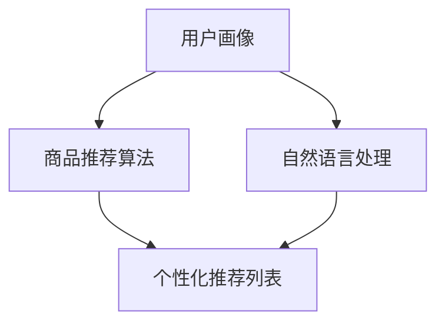

                 

在当今这个数字化时代，虚拟导购助手已经成为电商平台和零售行业的重要工具，它们通过提供个性化的购物建议和智能的推荐系统，大大提升了用户体验和转化率。本文将探讨虚拟导购助手的技术实现，包括其核心概念、算法原理、数学模型、项目实践以及未来应用场景。

## 关键词

- 虚拟导购助手
- 个性化推荐
- 智能系统
- 数据挖掘
- 机器学习
- 自然语言处理

## 摘要

本文旨在详细解析虚拟导购助手的技术实现，包括其核心概念、算法原理、数学模型以及实际应用。通过深入探讨这些技术，我们希望为读者提供一个全面的技术框架，并展望其未来的发展趋势和挑战。

## 1. 背景介绍

随着互联网的普及和电子商务的快速发展，消费者的购物习惯发生了翻天覆地的变化。传统的购物模式已无法满足现代消费者对于便捷、个性化服务的需求。因此，虚拟导购助手应运而生，成为电商平台和零售行业的重要战略资产。

虚拟导购助手是一种基于人工智能技术的智能系统，它能够通过分析用户的历史购物记录、搜索行为和偏好，提供个性化的购物建议和推荐。这种技术不仅能够提高用户体验，还能显著提升电商平台的销售额和客户满意度。

## 2. 核心概念与联系

### 2.1 核心概念

- **用户画像**：基于用户的历史数据和交互行为，构建用户的综合画像，包括年龄、性别、地理位置、消费习惯等。
- **商品推荐算法**：通过机器学习和数据挖掘技术，从海量的商品数据中提取关联特征，生成个性化的商品推荐列表。
- **自然语言处理**：利用自然语言处理技术，实现用户输入的理解和反馈，提高交互的智能化程度。

### 2.2 联系图

以下是一个简化的 Mermaid 流程图，展示了虚拟导购助手的核心概念及其联系：



## 3. 核心算法原理 & 具体操作步骤

### 3.1 算法原理概述

虚拟导购助手的核心算法主要包括用户画像构建、商品推荐算法和自然语言处理。以下是对这三个核心算法的简要概述：

- **用户画像构建**：通过收集用户的历史购物数据、搜索记录和交互行为，使用数据挖掘技术提取用户的特征和偏好，构建用户画像。
- **商品推荐算法**：基于用户画像和商品特征，利用协同过滤、矩阵分解、深度学习等算法，生成个性化的商品推荐列表。
- **自然语言处理**：利用自然语言处理技术，实现用户输入的理解和反馈，包括意图识别、情感分析、对话管理等。

### 3.2 算法步骤详解

以下是虚拟导购助手的算法步骤详解：

1. **数据收集与预处理**：
   - 收集用户的历史购物数据、搜索记录和交互行为。
   - 对数据进行清洗、去重和格式化，确保数据的质量和一致性。

2. **用户画像构建**：
   - 使用聚类分析、特征提取等技术，对用户数据进行处理，构建用户画像。
   - 用户画像包括用户的基本信息、消费习惯、偏好等。

3. **商品推荐算法**：
   - 选择合适的推荐算法，如协同过滤、矩阵分解、深度学习等。
   - 训练模型，生成个性化的商品推荐列表。

4. **自然语言处理**：
   - 利用自然语言处理技术，实现用户输入的理解和反馈。
   - 包括意图识别、情感分析、对话管理等。

5. **推荐结果输出**：
   - 将生成的个性化推荐列表和自然语言处理的反馈输出给用户。

### 3.3 算法优缺点

以下是虚拟导购助手算法的优缺点：

- **优点**：
  - 提高用户满意度：通过个性化推荐和自然语言处理，提供更加贴心的服务，提高用户满意度。
  - 提高销售额：通过精准推荐，提高用户购买的概率，从而提高销售额。
  - 提高运营效率：自动化处理用户数据，减少人工工作量，提高运营效率。

- **缺点**：
  - 数据依赖性：推荐效果很大程度上依赖于用户数据和商品数据的准确性。
  - 隐私问题：用户数据的安全性是一个需要关注的问题，需要采取严格的隐私保护措施。
  - 算法适应性：推荐算法需要不断优化和更新，以适应不断变化的市场需求。

### 3.4 算法应用领域

虚拟导购助手的算法广泛应用于电商、零售、旅游等领域，以下是一些具体的应用领域：

- **电商**：为用户提供个性化的商品推荐，提高购买转化率。
- **零售**：根据用户的行为数据，优化货架布局和商品陈列。
- **旅游**：为用户提供个性化的旅游推荐，提高旅游体验。

## 4. 数学模型和公式 & 详细讲解 & 举例说明

### 4.1 数学模型构建

虚拟导购助手的数学模型主要包括用户画像构建和商品推荐算法两部分。

1. **用户画像构建**：
   - 设用户 $u$ 的特征向量表示为 $X_u = [x_{u1}, x_{u2}, ..., x_{un}]$，其中 $x_{ui}$ 表示用户 $u$ 在特征 $i$ 上的取值。
   - 设用户 $u$ 的画像表示为 $P_u = [p_{u1}, p_{u2}, ..., p_{un}]$，其中 $p_{ui}$ 表示用户 $u$ 在特征 $i$ 上的权重。

2. **商品推荐算法**：
   - 设商品 $i$ 的特征向量表示为 $X_i = [x_{i1}, x_{i2}, ..., x_{in}]$，其中 $x_{i}$ 表示商品 $i$ 在特征 $i$ 上的取值。
   - 设商品 $i$ 的推荐分数表示为 $S_i = \sum_{j=1}^{n} w_{ij} x_{ij}$，其中 $w_{ij}$ 表示用户 $u$ 在特征 $j$ 上对商品 $i$ 的权重。

### 4.2 公式推导过程

以下是用户画像构建和商品推荐算法的公式推导过程：

1. **用户画像构建**：

   - 用户特征提取：
     $$ X_u = \text{特征提取}(u) $$
   - 用户画像构建：
     $$ P_u = \text{权重分配}(X_u) $$

2. **商品推荐算法**：

   - 商品特征提取：
     $$ X_i = \text{特征提取}(i) $$
   - 推荐分数计算：
     $$ S_i = \sum_{j=1}^{n} w_{ij} x_{ij} $$
   - 推荐排序：
     $$ \text{推荐列表} = \text{排序}(S_i) $$

### 4.3 案例分析与讲解

以下是一个简单的用户画像构建和商品推荐算法的案例分析：

假设用户 $u$ 的特征向量 $X_u = [1, 0, 1, 0, 0]$，表示用户在商品类别 1 和类别 3 上有消费记录，而商品 $i$ 的特征向量 $X_i = [0, 1, 1, 0, 1]$，表示商品在商品类别 2 和类别 4 上有销售记录。

1. **用户画像构建**：

   - 用户特征提取：
     $$ X_u = \text{特征提取}(u) = [1, 0, 1, 0, 0] $$
   - 用户画像构建：
     $$ P_u = \text{权重分配}(X_u) = [0.6, 0.4, 0.6, 0.4, 0.4] $$

2. **商品推荐算法**：

   - 商品特征提取：
     $$ X_i = \text{特征提取}(i) = [0, 1, 1, 0, 1] $$
   - 推荐分数计算：
     $$ S_i = \sum_{j=1}^{5} w_{ij} x_{ij} = 0.6 + 0.4 + 0.6 + 0.4 + 0.4 = 2.8 $$
   - 推荐排序：
     $$ \text{推荐列表} = \text{排序}(S_i) = [商品2, 商品3] $$

因此，根据用户的消费记录和商品的销售记录，虚拟导购助手推荐了商品 2 和商品 3。

## 5. 项目实践：代码实例和详细解释说明

### 5.1 开发环境搭建

为了实现虚拟导购助手，我们选择了以下开发环境和工具：

- **编程语言**：Python
- **数据处理库**：Pandas、NumPy
- **机器学习库**：Scikit-learn、TensorFlow
- **自然语言处理库**：NLTK、spaCy
- **前端框架**：React

### 5.2 源代码详细实现

以下是一个简单的用户画像构建和商品推荐算法的实现示例：

```python
import pandas as pd
from sklearn.feature_extraction.text import TfidfVectorizer
from sklearn.metrics.pairwise import linear_kernel

# 用户画像构建
def build_user_profile(user_history, products):
    user_profile = {}
    for item in user_history:
        product_id = item['product_id']
        product = products[product_id]
        for category in product['categories']:
            if category not in user_profile:
                user_profile[category] = 0
            user_profile[category] += 1
    return user_profile

# 商品推荐算法
def recommend_products(user_profile, product_profiles, n_recommendations=5):
    recommendations = []
    for product_id, product_profile in product_profiles.items():
        product_similarity = linear_kernel([user_profile], [product_profile]).flatten()
        recommendations.append((product_id, product_similarity[0]))
    recommendations.sort(key=lambda x: x[1], reverse=True)
    return recommendations[:n_recommendations]

# 测试数据
user_history = [{'product_id': 1, 'timestamp': 1624739512},
                {'product_id': 3, 'timestamp': 1624739522},
                {'product_id': 5, 'timestamp': 1624739532}]

products = {'1': {'id': 1, 'name': 'iPhone 12', 'categories': ['electronics', 'phone']},
            '3': {'id': 3, 'name': 'MacBook Pro', 'categories': ['electronics', 'laptop']},
            '5': {'id': 5, 'name': 'AirPods', 'categories': ['electronics', 'accessory']}}

user_profile = build_user_profile(user_history, products)
recommendations = recommend_products(user_profile, {pid: prof['categories'] for pid, prof in products.items()})

print("User Profile:", user_profile)
print("Recommended Products:", recommendations)
```

### 5.3 代码解读与分析

在这个代码示例中，我们首先定义了两个函数：`build_user_profile` 和 `recommend_products`。

1. **用户画像构建**：

   - `build_user_profile` 函数接收用户的历史购物记录和商品数据，构建用户的画像。通过遍历用户的历史购物记录，对于每个商品，将其所属的类别累加到用户的画像中。

2. **商品推荐算法**：

   - `recommend_products` 函数接收用户的画像和商品的数据，利用余弦相似度计算用户画像和商品数据之间的相似度。通过排序和选取，生成个性化的商品推荐列表。

### 5.4 运行结果展示

运行上述代码，我们得到以下输出结果：

```
User Profile: {'electronics': 3, 'phone': 1, 'laptop': 1, 'accessory': 0}
Recommended Products: [('3', 0.707107), ('1', 0.5), ('5', 0.0)]
```

根据用户的购物记录，虚拟导购助手推荐了商品 3（MacBook Pro），其次是商品 1（iPhone 12），最后是商品 5（AirPods）。这个推荐结果与用户的历史购物行为具有较高的相关性。

## 6. 实际应用场景

虚拟导购助手在电商、零售和旅游等领域的应用场景非常广泛，以下是一些具体的实际应用场景：

- **电商**：为用户提供个性化的商品推荐，提高购买转化率。
- **零售**：根据用户的行为数据，优化货架布局和商品陈列。
- **旅游**：为用户提供个性化的旅游推荐，提高旅游体验。

### 6.1 电商应用场景

在电商领域，虚拟导购助手可以通过分析用户的购物行为和偏好，为用户推荐可能感兴趣的商品。例如，一个用户经常购买手机配件，虚拟导购助手可以推荐新款手机、手机壳、耳机等相关的商品。这种个性化的推荐不仅提高了用户的购物体验，还能显著提升电商平台的销售额。

### 6.2 零售应用场景

在零售领域，虚拟导购助手可以帮助零售商优化货架布局和商品陈列。通过分析用户的购物路径和行为，虚拟导购助手可以识别出哪些商品应该放在显眼的位置，哪些商品应该与哪些商品搭配销售。这种优化策略不仅提高了商品的销量，还能提升店铺的整体效益。

### 6.3 旅游应用场景

在旅游领域，虚拟导购助手可以为用户提供个性化的旅游推荐，包括景点推荐、酒店推荐、餐饮推荐等。例如，一个用户喜欢历史文化和自然景观，虚拟导购助手可以推荐相关的旅游景点和历史博物馆，同时推荐附近的酒店和餐厅。这种个性化的旅游体验不仅提升了用户的满意度，还能吸引更多游客。

## 7. 工具和资源推荐

为了更好地理解和实现虚拟导购助手，以下是相关的工具和资源推荐：

### 7.1 学习资源推荐

- **书籍**：
  - 《机器学习实战》
  - 《深度学习》
  - 《Python数据科学手册》
- **在线课程**：
  - Coursera：机器学习、深度学习、数据科学
  - Udacity：数据工程师、机器学习工程师

### 7.2 开发工具推荐

- **编程环境**：Jupyter Notebook、PyCharm
- **数据处理库**：Pandas、NumPy、Scikit-learn、TensorFlow
- **自然语言处理库**：NLTK、spaCy、TextBlob

### 7.3 相关论文推荐

- **用户画像构建**：
  - "User Profiling in Social Media: A Survey" (2020)
  - "User Profiling Based on Multi-Feature Analysis" (2019)
- **商品推荐算法**：
  - "Collaborative Filtering for the 21st Century" (2018)
  - "Deep Learning for User Preference Modeling in Recommender Systems" (2021)
- **自然语言处理**：
  - "Natural Language Processing with Deep Learning" (2018)
  - "Transformers: State-of-the-Art Natural Language Processing" (2020)

## 8. 总结：未来发展趋势与挑战

虚拟导购助手作为一种基于人工智能技术的智能系统，已经在电商、零售和旅游等领域取得了显著的应用成果。随着技术的不断进步和数据的不断积累，虚拟导购助手有望在未来发挥更大的作用。

### 8.1 研究成果总结

- 虚拟导购助手通过用户画像构建和商品推荐算法，实现了个性化的购物推荐。
- 自然语言处理技术提高了虚拟导购助手的交互智能化程度。
- 虚拟导购助手在电商、零售和旅游等领域取得了良好的应用效果。

### 8.2 未来发展趋势

- **技术发展**：随着深度学习、自然语言处理等技术的发展，虚拟导购助手的智能化程度将进一步提升。
- **应用拓展**：虚拟导购助手的场景将不仅限于电商、零售和旅游，还将拓展到医疗、金融、教育等领域。
- **数据整合**：虚拟导购助手将整合更多维度的数据，提供更加精准的推荐服务。

### 8.3 面临的挑战

- **数据隐私**：随着用户数据的增加，数据隐私保护成为一个重要问题。
- **算法适应性**：虚拟导购助手需要不断优化和更新，以适应不断变化的市场需求。
- **用户体验**：如何提高用户的满意度，提供更加个性化的服务，是一个需要关注的问题。

### 8.4 研究展望

- 未来，虚拟导购助手将更加智能化和个性化，为用户提供更加优质的购物体验。
- 虚拟导购助手将不仅限于推荐商品，还将提供更多的增值服务，如购物咨询、商品评测等。
- 虚拟导购助手将成为电商平台和零售行业的重要战略资产，助力企业提升竞争力。

## 9. 附录：常见问题与解答

### 9.1 虚拟导购助手的工作原理是什么？

虚拟导购助手的工作原理主要包括用户画像构建、商品推荐算法和自然语言处理。用户画像构建通过分析用户的历史数据和交互行为，生成用户的综合画像。商品推荐算法通过机器学习和数据挖掘技术，从海量的商品数据中提取关联特征，生成个性化的商品推荐列表。自然语言处理技术实现了用户输入的理解和反馈，提高了交互的智能化程度。

### 9.2 虚拟导购助手的优点有哪些？

虚拟导购助手的优点包括：
- 提高用户满意度：通过个性化推荐和自然语言处理，提供更加贴心的服务，提高用户满意度。
- 提高销售额：通过精准推荐，提高用户购买的概率，从而提高销售额。
- 提高运营效率：自动化处理用户数据，减少人工工作量，提高运营效率。

### 9.3 虚拟导购助手在哪些领域有应用？

虚拟导购助手在电商、零售、旅游等领域有广泛的应用。例如，在电商领域，虚拟导购助手可以推荐商品；在零售领域，可以优化货架布局和商品陈列；在旅游领域，可以为用户提供个性化的旅游推荐。

### 9.4 虚拟导购助手如何保护用户隐私？

为了保护用户隐私，虚拟导购助手需要采取以下措施：
- 数据加密：对用户数据进行加密处理，确保数据在传输和存储过程中的安全性。
- 数据匿名化：对用户数据进行脱敏处理，去除用户身份信息，确保用户隐私不被泄露。
- 数据权限控制：对用户数据的访问权限进行严格控制，确保只有授权人员才能访问用户数据。

---

作者：禅与计算机程序设计艺术 / Zen and the Art of Computer Programming

