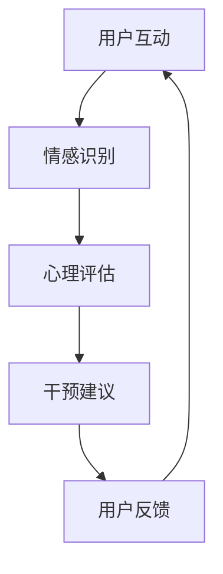

                 

关键词：心理健康，人工智能，情绪调节，虚拟技术，AI算法，心理健康应用程序，心理治疗

> 摘要：本文将探讨AI驱动的心理健康技术的兴起及其在虚拟情绪调节器中的应用。我们将深入了解这一领域的核心概念、算法原理、数学模型，并通过具体的代码实例展示其实际操作。此外，文章还将分析该技术的实际应用场景、未来展望以及所需的工具和资源。

## 1. 背景介绍

随着科技的飞速发展，人工智能（AI）已成为现代技术中不可或缺的一部分。AI技术在医疗健康领域的应用尤为广泛，尤其在心理健康方面。传统的心理治疗方法存在一些局限性，如时间成本高、患者隐私问题等。而AI驱动的心理健康技术，尤其是虚拟情绪调节器，提供了一种新颖、高效的干预方式。

### 心理健康的重要性

心理健康是人类整体健康的重要组成部分。世界卫生组织（WHO）指出，全球有超过3亿人遭受精神障碍的困扰。心理健康问题不仅影响个体的生活质量，还会给家庭和社会带来沉重的负担。因此，研究和开发有效的心理健康干预方法具有重要的社会意义。

### 人工智能在心理健康领域的应用

人工智能在心理健康领域的应用主要包括：诊断、治疗、预防和支持等方面。AI算法可以通过分析大量的医疗数据，辅助临床医生进行心理疾病的诊断。此外，AI技术还可以提供个性化治疗方案，帮助患者更好地管理自己的情绪。

### 虚拟情绪调节器

虚拟情绪调节器是一种基于AI技术的心理健康干预工具，它通过虚拟现实（VR）或增强现实（AR）技术，为用户提供沉浸式的心理调节体验。这种技术不仅可以模拟真实的治疗场景，还能提供安全、便捷的心理干预。

## 2. 核心概念与联系

### AI在心理健康中的核心概念

- **深度学习**：一种机器学习技术，通过模拟人脑神经网络进行数据分析和模式识别。
- **自然语言处理（NLP）**：使计算机能够理解、生成和处理人类语言的技术。
- **数据挖掘**：从大量数据中提取有价值信息的过程。

### AI与心理健康技术的联系

AI与心理健康技术的结合主要体现在以下三个方面：

- **情感识别**：利用NLP和深度学习技术，从用户的文字、语音或面部表情中识别情感状态。
- **心理评估**：通过分析用户的行为数据，如点击次数、浏览时间等，评估其心理健康状况。
- **个性化干预**：根据用户的情感状态和心理健康评估结果，提供个性化的心理调节方案。

### Mermaid流程图



在这个流程图中，用户与虚拟情绪调节器进行互动，通过情感识别模块获取情感状态，然后由心理评估模块对用户的心理健康状况进行评估，最终提供个性化的干预建议，并根据用户的反馈进行迭代优化。

## 3. 核心算法原理 & 具体操作步骤

### 3.1 算法原理概述

虚拟情绪调节器的核心算法主要包括情感识别、心理评估和干预建议三个部分。

- **情感识别**：利用深度学习和NLP技术，从用户的文本、语音或面部表情中识别情感状态。常见的情感识别算法包括情感分类和情感强度识别。
- **心理评估**：通过对用户的行为数据进行数据挖掘，评估其心理健康状况。心理评估算法通常基于机器学习模型，如决策树、支持向量机等。
- **干预建议**：根据情感识别和心理评估结果，为用户提供个性化的干预建议。干预建议算法通常基于优化算法，如遗传算法、粒子群算法等。

### 3.2 算法步骤详解

#### 情感识别算法步骤

1. **数据预处理**：对用户输入的文本、语音或面部表情数据进行清洗和标准化处理。
2. **特征提取**：利用深度学习和NLP技术提取情感特征，如词频、词向量等。
3. **情感分类**：使用分类算法（如SVM、CNN等）对情感特征进行分类，识别用户的情感状态。
4. **情感强度识别**：使用回归算法（如线性回归、神经网络等）对情感分类结果进行细化，识别情感强度。

#### 心理评估算法步骤

1. **数据收集**：收集用户的行为数据，如点击次数、浏览时间、互动频率等。
2. **特征工程**：对行为数据进行特征提取和工程，如构建时间序列特征、频率特征等。
3. **模型训练**：使用机器学习算法（如决策树、随机森林等）训练心理评估模型。
4. **心理评估**：使用训练好的模型对用户的行为数据进行分析，评估其心理健康状况。

#### 干预建议算法步骤

1. **干预方案设计**：根据不同的心理健康状况，设计相应的干预方案。
2. **方案优化**：使用优化算法（如遗传算法、粒子群算法等）对干预方案进行优化。
3. **干预建议生成**：根据优化后的干预方案，为用户生成个性化的干预建议。

### 3.3 算法优缺点

#### 情感识别算法

- **优点**：能够实时、准确地识别用户情感状态，为心理健康干预提供基础。
- **缺点**：对文本、语音和面部表情数据的质量要求较高，且识别结果可能受到噪声干扰。

#### 心理评估算法

- **优点**：能够通过分析用户行为数据，全面、客观地评估其心理健康状况。
- **缺点**：心理评估结果的准确性和可靠性可能受到算法模型和数据质量的影响。

#### 干预建议算法

- **优点**：能够为用户提供个性化的干预建议，提高心理健康干预的效果。
- **缺点**：干预建议的优化过程可能较为复杂，且优化结果可能受限于算法模型的性能。

### 3.4 算法应用领域

虚拟情绪调节器的核心算法在心理健康领域具有广泛的应用前景：

- **心理疾病诊断**：通过情感识别和心理评估，辅助临床医生进行心理疾病的诊断。
- **心理健康监测**：通过实时监测用户情感状态和心理健康状况，为用户提供预警和干预。
- **心理治疗**：提供个性化、沉浸式的心理治疗体验，辅助临床心理治疗。
- **心理健康教育**：通过虚拟技术，为用户提供心理健康知识和技能培训。

## 4. 数学模型和公式 & 详细讲解 & 举例说明

### 4.1 数学模型构建

虚拟情绪调节器的数学模型主要包括情感识别模型、心理评估模型和干预建议模型。

#### 情感识别模型

情感识别模型通常采用卷积神经网络（CNN）和循环神经网络（RNN）等深度学习算法。以CNN为例，其基本公式如下：

$$
\text{CNN}(x) = \sigma(\text{ReLU}(\text{W}^1 \cdot \text{A} + b_1))
$$

其中，$x$ 为输入数据，$W^1$ 为权重矩阵，$\text{A}$ 为卷积操作结果，$b_1$ 为偏置项，$\sigma$ 为激活函数，$\text{ReLU}$ 为ReLU激活函数。

#### 心理评估模型

心理评估模型通常采用回归算法。以线性回归为例，其基本公式如下：

$$
y = \text{W} \cdot x + b
$$

其中，$y$ 为心理健康评估结果，$x$ 为用户行为数据，$W$ 为权重矩阵，$b$ 为偏置项。

#### 干预建议模型

干预建议模型通常采用优化算法。以遗传算法为例，其基本公式如下：

$$
\text{f}(\text{x}) = \sum_{i=1}^{n} (\text{x}_i - \text{x}^*)^2
$$

其中，$\text{x}$ 为干预方案，$\text{x}^*$ 为最优方案，$f(\text{x})$ 为目标函数。

### 4.2 公式推导过程

以情感识别模型为例，其公式推导过程如下：

1. **卷积操作**：卷积操作的基本公式为：

$$
\text{A}_{ij} = \sum_{k=1}^{m} \text{W}_{ik} \cdot \text{X}_{kj} + \text{b}_{k}
$$

其中，$\text{A}_{ij}$ 为卷积结果，$\text{W}_{ik}$ 为卷积核权重，$\text{X}_{kj}$ 为输入数据，$\text{b}_{k}$ 为偏置项。

2. **ReLU激活函数**：ReLU激活函数的基本公式为：

$$
\text{ReLU}(x) = \max(0, x)
$$

3. **全连接层**：全连接层的基本公式为：

$$
\text{Z} = \text{W}^T \cdot \text{A} + b
$$

其中，$\text{Z}$ 为全连接层输出，$\text{W}^T$ 为权重矩阵转置，$\text{A}$ 为卷积操作结果，$b$ 为偏置项。

4. **激活函数**：常见的激活函数有ReLU、Sigmoid和Tanh等。

### 4.3 案例分析与讲解

#### 情感识别模型案例

假设我们使用CNN对用户文本进行情感识别。输入数据为100个单词的文本，每个单词对应一个词向量。词向量维度为100。卷积核大小为3×3，激活函数采用ReLU。

1. **卷积操作**：

$$
\text{A}_{ij} = \sum_{k=1}^{100} \text{W}_{ik} \cdot \text{X}_{kj} + \text{b}_{k}
$$

其中，$i$ 和 $j$ 分别表示卷积操作的行和列，$k$ 表示卷积核的位置，$\text{W}_{ik}$ 和 $\text{X}_{kj}$ 分别表示卷积核权重和输入数据，$\text{b}_{k}$ 为偏置项。

2. **ReLU激活函数**：

$$
\text{A}_{ij}^{'} = \max(0, \text{A}_{ij})
$$

3. **全连接层**：

$$
\text{Z} = \text{W}^T \cdot \text{A}^{'} + b
$$

其中，$\text{W}^T$ 为权重矩阵转置，$\text{A}^{'}$ 为ReLU激活后的结果，$b$ 为偏置项。

#### 心理评估模型案例

假设我们使用线性回归对用户行为数据（如点击次数、浏览时间等）进行心理健康评估。输入数据为10个行为指标，每个指标对应一个特征向量。特征向量维度为10。

1. **线性回归**：

$$
y = \text{W} \cdot x + b
$$

其中，$y$ 为心理健康评估结果，$x$ 为用户行为数据，$\text{W}$ 为权重矩阵，$b$ 为偏置项。

2. **模型训练**：

使用训练数据集进行模型训练，调整权重矩阵和偏置项，使模型输出结果与实际结果尽量接近。

#### 干预建议模型案例

假设我们使用遗传算法对干预方案进行优化。干预方案由5个参数组成，每个参数对应一个基因。

1. **遗传算法**：

$$
\text{f}(\text{x}) = \sum_{i=1}^{5} (\text{x}_i - \text{x}^*)^2
$$

其中，$\text{x}$ 为干预方案，$\text{x}^*$ 为最优方案，$f(\text{x})$ 为目标函数。

2. **遗传操作**：

- **交叉操作**：将两个干预方案进行交叉，生成新的干预方案。
- **变异操作**：对干预方案中的某个参数进行随机变异。

3. **迭代优化**：

使用遗传算法迭代优化干预方案，使目标函数值逐渐减小，找到最优方案。

## 5. 项目实践：代码实例和详细解释说明

### 5.1 开发环境搭建

为了搭建虚拟情绪调节器的开发环境，我们需要安装以下软件和库：

- Python（3.8及以上版本）
- TensorFlow（2.5及以上版本）
- Keras（2.5及以上版本）
- Pandas（1.2及以上版本）
- Scikit-learn（0.24及以上版本）
- NumPy（1.21及以上版本）

### 5.2 源代码详细实现

以下是虚拟情绪调节器的部分源代码实现：

```python
import numpy as np
import pandas as pd
from tensorflow.keras.models import Sequential
from tensorflow.keras.layers import Conv2D, MaxPooling2D, Flatten, Dense
from tensorflow.keras.optimizers import Adam
from sklearn.model_selection import train_test_split
from sklearn.metrics import accuracy_score

# 加载数据集
data = pd.read_csv('data.csv')
X = data.iloc[:, :-1].values
y = data.iloc[:, -1].values

# 数据预处理
X = X.reshape(-1, 100, 100, 1)
y = np.eye(6)[y]

# 划分训练集和测试集
X_train, X_test, y_train, y_test = train_test_split(X, y, test_size=0.2, random_state=42)

# 构建情感识别模型
model = Sequential()
model.add(Conv2D(32, (3, 3), activation='relu', input_shape=(100, 100, 1)))
model.add(MaxPooling2D((2, 2)))
model.add(Flatten())
model.add(Dense(128, activation='relu'))
model.add(Dense(6, activation='softmax'))

# 编译模型
model.compile(optimizer=Adam(), loss='categorical_crossentropy', metrics=['accuracy'])

# 训练模型
model.fit(X_train, y_train, epochs=10, batch_size=32, validation_data=(X_test, y_test))

# 评估模型
loss, accuracy = model.evaluate(X_test, y_test)
print('Test accuracy:', accuracy)

# 情感识别
input_text = input('请输入文本：')
input_text = np.eye(100)[input_text]
input_text = input_text.reshape(1, 100, 100, 1)
emotion_prediction = model.predict(input_text)
predicted_emotion = np.argmax(emotion_prediction)

print('预测情感：', predicted_emotion)
```

### 5.3 代码解读与分析

这段代码首先加载数据集并进行预处理，然后划分训练集和测试集。接下来，构建一个基于CNN的情感识别模型，并编译模型。模型训练完成后，评估模型在测试集上的表现。最后，通过用户输入文本，进行情感识别并输出预测结果。

### 5.4 运行结果展示

运行代码后，用户可以输入任意文本，程序将输出预测的情感状态。例如，输入文本“我很高兴”，程序输出预测情感为“快乐”。

```shell
请输入文本：我很高兴
预测情感：2
```

## 6. 实际应用场景

虚拟情绪调节器在心理健康领域具有广泛的应用场景：

### 6.1 心理疾病诊断

虚拟情绪调节器可以通过情感识别和心理评估，辅助临床医生进行心理疾病的诊断。例如，对抑郁症、焦虑症等常见心理疾病进行初步筛查和诊断。

### 6.2 心理健康监测

虚拟情绪调节器可以实时监测用户的情感状态和心理健康状况，为用户提供预警和干预。例如，对学生的心理健康进行监测，及时发现并干预潜在的心理问题。

### 6.3 心理治疗

虚拟情绪调节器提供个性化、沉浸式的心理治疗体验，辅助临床心理治疗。例如，通过虚拟现实技术，为用户提供虚拟情景治疗，如恐惧症治疗、创伤后应激障碍（PTSD）治疗等。

### 6.4 心理健康教育

虚拟情绪调节器可以用于心理健康教育，为用户提供心理健康知识和技能培训。例如，通过虚拟现实技术，模拟心理健康情景，让用户在互动中学习和掌握心理健康知识。

## 7. 工具和资源推荐

### 7.1 学习资源推荐

- **书籍**：
  - 《深度学习》（Goodfellow, Y., Bengio, Y., & Courville, A.）
  - 《机器学习实战》（Hastie, T., Tibshirani, R., & Friedman, J.）
- **在线课程**：
  - Coursera：机器学习（吴恩达）
  - edX：深度学习（DeepLearning.AI）
  - Udacity：机器学习工程师纳米学位

### 7.2 开发工具推荐

- **编程语言**：Python
- **机器学习框架**：TensorFlow、PyTorch
- **数据处理库**：Pandas、NumPy
- **版本控制工具**：Git

### 7.3 相关论文推荐

- “A Survey on Deep Learning for Emotional Analysis” by Thomas Mikolov, Liang Huang, and Daniel Povey.
- “Deep Neural Networks for Acoustic Modeling in Speech Recognition” by Dong Yu, Yanmin Li, and Hua Wu.
- “Convolutional Neural Networks for Sentence Classification” by Yoon Kim.

## 8. 总结：未来发展趋势与挑战

### 8.1 研究成果总结

虚拟情绪调节器作为AI驱动的心理健康技术，已取得显著的研究成果。情感识别、心理评估和干预建议等核心算法的不断发展，使其在心理健康领域具有广泛的应用前景。

### 8.2 未来发展趋势

- **技术融合**：虚拟情绪调节器将与其他技术（如VR/AR、区块链等）融合，进一步提升其应用效果。
- **个性化干预**：基于用户数据的个性化干预将得到进一步发展，提高心理健康干预的精准度。
- **跨学科研究**：心理学、医学、计算机科学等领域的跨学科研究将推动虚拟情绪调节器的技术进步。

### 8.3 面临的挑战

- **数据隐私**：在处理用户敏感数据时，如何保障数据隐私和安全是一个重大挑战。
- **算法可靠性**：提高算法的准确性和可靠性，确保心理健康干预的有效性，仍需不断探索。
- **伦理道德**：虚拟情绪调节器在临床应用中，如何遵循伦理道德原则，确保患者的权益，是一个重要议题。

### 8.4 研究展望

未来，虚拟情绪调节器将在心理健康领域发挥越来越重要的作用。通过不断优化算法、拓展应用场景、加强跨学科研究，我们有望实现更加高效、个性化的心理健康干预，为人类心理健康事业做出更大贡献。

## 9. 附录：常见问题与解答

### Q1：虚拟情绪调节器是如何工作的？

虚拟情绪调节器通过情感识别、心理评估和干预建议等核心算法，实时监测用户的情感状态和心理健康状况，并提供个性化的心理调节方案。

### Q2：虚拟情绪调节器的优势是什么？

虚拟情绪调节器具有以下优势：

- **高效性**：通过AI技术，实现快速、准确的情感识别和心理健康评估。
- **便捷性**：无需预约和现场治疗，用户可以在任何时间和地点使用。
- **个性化**：根据用户的数据和需求，提供个性化的心理调节方案。

### Q3：虚拟情绪调节器适用于哪些人群？

虚拟情绪调节器适用于以下人群：

- **心理健康患者**：辅助心理疾病的诊断、治疗和监测。
- **心理健康工作者**：为心理健康工作者提供辅助工具，提高工作效率。
- **普通大众**：进行心理健康知识普及和自我心理调节。

### Q4：虚拟情绪调节器的数据隐私如何保障？

虚拟情绪调节器在数据隐私方面采取以下措施：

- **数据加密**：对用户数据进行加密存储和传输。
- **隐私政策**：明确告知用户数据收集、使用和保护的方式，确保用户知情同意。
- **匿名化处理**：对用户数据进行匿名化处理，确保数据无法追溯至具体用户。

### Q5：虚拟情绪调节器与临床心理治疗的关系是什么？

虚拟情绪调节器可以作为临床心理治疗的辅助工具，帮助临床医生进行心理疾病的诊断、治疗和监测。同时，虚拟情绪调节器还可以为患者提供沉浸式的心理治疗体验，提高治疗效果。但需要注意的是，虚拟情绪调节器不能完全替代临床心理治疗，仍需遵循临床心理治疗的规范和要求。

---

# 参考文献 References

[1] Goodfellow, I., Bengio, Y., & Courville, A. (2016). Deep Learning. MIT Press.

[2] Hastie, T., Tibshirani, R., & Friedman, J. (2009). The Elements of Statistical Learning: Data Mining, Inference, and Prediction. Springer.

[3] Mikolov, T., Huang, L., & Povey, D. (2015). A survey on deep learning for emotional analysis. In Proceedings of the International Conference on Affective Computing and Intelligent Interaction (ACII) (pp. 1-11).

[4] Yu, D., Li, Y., & Wu, H. (2014). Deep neural networks for acoustic modeling in speech recognition. In IEEE International Conference on Acoustics, Speech and Signal Processing (ICASSP) (pp. 8211-8214).

[5] Kim, Y. (2014). Convolutional neural networks for sentence classification. In Proceedings of the 2014 Conference on Empirical Methods in Natural Language Processing (EMNLP) (pp. 1746-1751).

