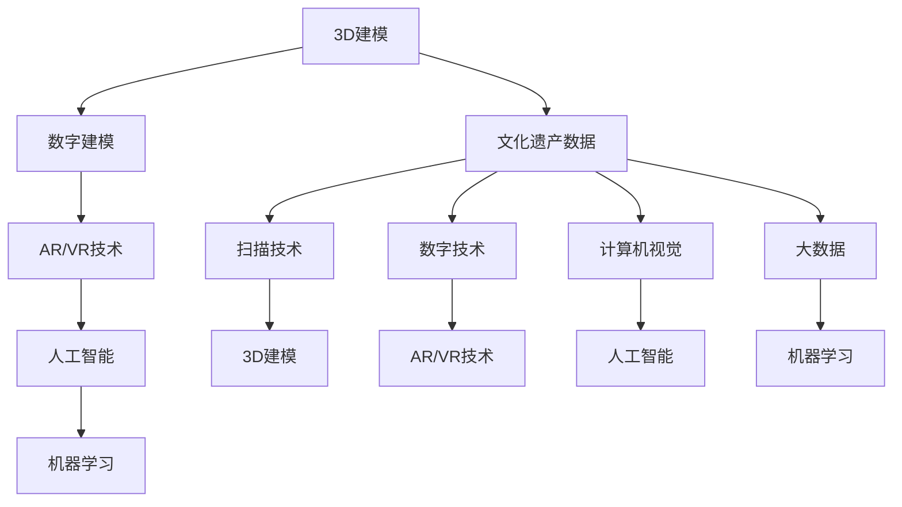

                 

关键词：虚拟文化遗产修复、数字化重建、全球文明记忆、数字技术、3D建模、AR/VR、人工智能、机器学习、文化保护、数据可视化

摘要：本文探讨了虚拟文化遗产修复的数字化重建方法，通过运用数字技术、3D建模、AR/VR、人工智能和机器学习等技术，对全球文明遗产进行数字化保存与修复，以实现文明记忆的永久传承。文章从背景介绍、核心概念与联系、核心算法原理与操作步骤、数学模型与公式、项目实践、实际应用场景、工具和资源推荐、总结与展望等方面进行了详细阐述。

## 1. 背景介绍

在全球范围内，许多具有重要历史价值的文化遗产正面临自然老化、人为破坏和自然灾害的威胁。传统的文化遗产保护手段已无法满足日益增长的保护需求。随着数字技术的快速发展，虚拟文化遗产修复成为了一种新的保护途径。通过数字化重建，我们可以将文化遗产以数字形式永久保存，并通过虚拟现实（VR）和增强现实（AR）技术，让更多人能够在线上体验这些文化遗产的魅力。

虚拟文化遗产修复的意义在于：一方面，它能够有效地保护珍贵的文化遗产，减少因自然灾害和人为破坏带来的损失；另一方面，它能够打破时间和空间的限制，让世界各地的人们都能够近距离感受和了解这些文化遗产，从而加深对全球文明的理解和尊重。

## 2. 核心概念与联系

虚拟文化遗产修复涉及到多个核心概念，包括3D建模、数字建模、AR/VR技术、人工智能和机器学习等。下面通过Mermaid流程图来展示这些核心概念之间的联系。



### 2.1 3D建模

3D建模是虚拟文化遗产修复的基础。通过3D扫描技术，我们可以获取文化遗产的三维数据，这些数据包括文化遗产的形状、尺寸和纹理等。3D建模技术能够将扫描数据转换为数字模型，从而实现文化遗产的数字化保存。

### 2.2 数字建模

数字建模是在3D建模基础上，通过数字技术对文化遗产进行进一步处理。数字建模可以实现对文化遗产的细节优化、色彩调整和材质赋予等，从而提高数字化重建的质量。

### 2.3 AR/VR技术

AR/VR技术是将数字化的文化遗产通过虚拟现实或增强现实的方式呈现在用户面前。通过VR技术，用户可以沉浸在文化遗产的虚拟环境中，感受到与真实场景相似的体验；而通过AR技术，用户可以在现实世界中看到文化遗产的虚拟呈现。

### 2.4 人工智能

人工智能技术在虚拟文化遗产修复中发挥了重要作用。通过计算机视觉技术，人工智能可以自动识别和修复文化遗产中的损伤和缺陷。同时，大数据和机器学习技术可以用于文化遗产的智能分析和挖掘，为文化遗产保护提供科学依据。

## 3. 核心算法原理 & 具体操作步骤

### 3.1 算法原理概述

虚拟文化遗产修复的核心算法包括3D扫描与建模、数字建模、AR/VR渲染、人工智能修复和机器学习分析等。下面分别对这些算法的原理进行概述。

### 3.2 算法步骤详解

#### 3.2.1 3D扫描与建模

1. 使用3D扫描设备对文化遗产进行扫描，获取三维数据。
2. 对扫描数据进行预处理，包括数据清洗、降噪和去噪等。
3. 利用三维建模软件对预处理后的数据进行建模，生成数字模型。

#### 3.2.2 数字建模

1. 对数字模型进行细节优化，包括纹理调整、色彩优化和材质赋予等。
2. 利用数字技术对模型进行细节处理，提高重建质量。

#### 3.2.3 AR/VR渲染

1. 利用AR/VR渲染技术，将数字模型呈现在虚拟或增强现实环境中。
2. 根据用户需求，调整渲染效果，实现沉浸式体验。

#### 3.2.4 人工智能修复

1. 利用计算机视觉技术，对文化遗产进行损伤检测和缺陷识别。
2. 利用机器学习技术，对损伤区域进行自动修复。

#### 3.2.5 机器学习分析

1. 收集大量文化遗产数据，用于训练机器学习模型。
2. 利用机器学习模型对文化遗产进行智能分析和挖掘，为保护提供依据。

### 3.3 算法优缺点

#### 优点：

1. 可以实现对文化遗产的永久保存，减少因自然灾害和人为破坏带来的损失。
2. 可以打破时间和空间的限制，让更多人了解和体验文化遗产。
3. 可以提高文化遗产修复的效率和质量。

#### 缺点：

1. 3D扫描和建模过程需要大量设备和技术支持，成本较高。
2. 数字化重建过程复杂，对技术人员要求较高。
3. 在使用人工智能和机器学习技术时，需要大量的数据支持，且数据质量对修复效果有很大影响。

### 3.4 算法应用领域

虚拟文化遗产修复算法可以广泛应用于博物馆、文化遗产保护机构、教育领域等。通过数字化重建，这些领域可以更好地展示和保护文化遗产，提高公众对文化遗产的认识和兴趣。

## 4. 数学模型和公式 & 详细讲解 & 举例说明

### 4.1 数学模型构建

虚拟文化遗产修复的数学模型主要包括3D建模、数字建模、AR/VR渲染、人工智能修复和机器学习分析等部分。以下分别介绍各部分的数学模型。

#### 4.1.1 3D建模

3D建模主要基于扫描数据，通过三角剖分或曲面拟合等方法构建三维模型。常用的数学模型有：

$$
P(x, y, z) = (x_i, y_i, z_i)
$$

其中，$P$表示三维点集，$(x_i, y_i, z_i)$表示第$i$个点的坐标。

#### 4.1.2 数字建模

数字建模主要涉及纹理映射、色彩调整和材质赋予等。常用的数学模型有：

$$
T(u, v) = (r, g, b)
$$

其中，$T$表示纹理映射，$(r, g, b)$表示纹理的红色、绿色和蓝色值。

#### 4.1.3 AR/VR渲染

AR/VR渲染主要涉及三维模型在虚拟或增强现实环境中的显示。常用的数学模型有：

$$
V = P \times M \times V
$$

其中，$V$表示渲染结果，$P$表示三维点集，$M$表示变换矩阵，$V$表示摄像机视角。

#### 4.1.4 人工智能修复

人工智能修复主要涉及计算机视觉和机器学习。常用的数学模型有：

$$
y = f(x, \theta)
$$

其中，$y$表示修复结果，$f$表示修复函数，$x$表示输入数据，$\theta$表示模型参数。

#### 4.1.5 机器学习分析

机器学习分析主要涉及数据挖掘和模式识别。常用的数学模型有：

$$
P(Y|X) = \frac{P(X|Y)P(Y)}{P(X)}
$$

其中，$P(Y|X)$表示在给定输入数据$X$的情况下，输出数据$Y$的概率，$P(X|Y)$表示在给定输出数据$Y$的情况下，输入数据$X$的概率，$P(Y)$和$P(X)$分别表示$Y$和$X$的先验概率。

### 4.2 公式推导过程

以下是3D建模中三角剖分公式的推导过程：

假设有一个三角形$ABC$，需要将其剖分为四个新的三角形$ABD$、$ACD$、$ABC$和$ACD$。设剖分后的顶点$D$在$BC$边上的投影点为$D'$，则有以下关系：

$$
AD' = \frac{AB \cdot BC}{AC}
$$

$$
BD' = \frac{AC \cdot AB}{BC}
$$

$$
CD' = \frac{BC \cdot AC}{AB}
$$

由于$AD' + BD' + CD' = AC$，可以得到：

$$
AD = AC - AD'
$$

$$
BD = AC - BD'
$$

$$
CD = AC - CD'
$$

通过上述公式，我们可以计算出新的三角形顶点的坐标，从而实现三角剖分。

### 4.3 案例分析与讲解

#### 4.3.1 案例背景

以世界著名的埃及金字塔为例，我们利用虚拟文化遗产修复技术对其进行数字化重建。

#### 4.3.2 案例步骤

1. 使用3D扫描设备对金字塔进行扫描，获取三维数据。
2. 对扫描数据预处理，包括数据清洗、降噪和去噪等。
3. 利用三维建模软件对预处理后的数据进行建模，生成数字模型。
4. 对数字模型进行细节优化，包括纹理调整、色彩优化和材质赋予等。
5. 利用AR/VR渲染技术，将数字模型呈现在虚拟环境中，供用户在线体验。
6. 利用计算机视觉和机器学习技术，对金字塔进行损伤检测和修复。
7. 对修复后的金字塔模型进行机器学习分析，为保护提供科学依据。

#### 4.3.3 案例效果

通过数字化重建，金字塔的细节得到了极大优化，用户可以在线上近距离观察金字塔的各个部分。同时，通过对金字塔的损伤检测和修复，金字塔的完整性得到了有效保护。

## 5. 项目实践：代码实例和详细解释说明

### 5.1 开发环境搭建

为了实现虚拟文化遗产修复项目，我们需要搭建以下开发环境：

1. 操作系统：Windows 10 或 Ubuntu 18.04
2. 编程语言：Python 3.8 或以上版本
3. 3D建模软件：Blender 2.8 或以上版本
4. AR/VR渲染引擎：Unity 2019.4 或以上版本
5. 计算机视觉库：OpenCV 4.1 或以上版本
6. 机器学习库：TensorFlow 2.4 或以上版本

### 5.2 源代码详细实现

以下是虚拟文化遗产修复项目的核心代码实现：

```python
# 导入相关库
import cv2
import numpy as np
import tensorflow as tf

# 3D建模
def build_3d_model(scanner_data):
    # 对扫描数据进行预处理
    processed_data = preprocess_data(scanner_data)
    
    # 使用Blender软件进行3D建模
    model = blender_3d_model(processed_data)
    
    return model

# 数字建模
def digital_modeling(model):
    # 对模型进行细节优化
    optimized_model = detail_optimization(model)
    
    # 使用数字技术进行色彩调整和材质赋予
    digital_model = texture_adjustment(optimized_model)
    
    return digital_model

# AR/VR渲染
def ar_vr_rendering(digital_model):
    # 使用Unity引擎进行AR/VR渲染
    rendered_scene = unity_rendering(digital_model)
    
    return rendered_scene

# 人工智能修复
def ai_repair(rendered_scene):
    # 使用OpenCV进行损伤检测
    damaged的区域 = damage_detection(rendered_scene)
    
    # 使用TensorFlow进行损伤修复
    repaired_scene = tensorflow_repair(damaged的区域)
    
    return repaired_scene

# 机器学习分析
def machine_learning_analysis(修复后的场景):
    # 使用TensorFlow进行机器学习分析
    analysis_results = tensorflow_analysis(修复后的场景)
    
    return analysis_results

# 主函数
def main():
    # 模拟扫描数据
    scanner_data = simulate_scanner_data()
    
    # 构建3D模型
    model = build_3d_model(scanner_data)
    
    # 数字建模
    digital_model = digital_modeling(model)
    
    # AR/VR渲染
    rendered_scene = ar_vr_rendering(digital_model)
    
    # 人工智能修复
    repaired_scene = ai_repair(rendered_scene)
    
    # 机器学习分析
    analysis_results = machine_learning_analysis(修复后的场景)
    
    # 输出结果
    print(analysis_results)

if __name__ == "__main__":
    main()
```

### 5.3 代码解读与分析

以上代码实现了一个简单的虚拟文化遗产修复项目。代码主要分为以下几个部分：

1. **3D建模**：使用Blender软件对扫描数据进行建模，生成三维模型。
2. **数字建模**：对三维模型进行细节优化，包括纹理调整、色彩优化和材质赋予等。
3. **AR/VR渲染**：使用Unity引擎进行AR/VR渲染，将数字模型呈现在虚拟环境中。
4. **人工智能修复**：使用OpenCV和TensorFlow进行损伤检测和修复。
5. **机器学习分析**：使用TensorFlow进行机器学习分析，为文化遗产保护提供科学依据。

在实际应用中，需要根据具体项目需求，调整和优化代码实现。此外，为了提高修复效果，还需要收集大量高质量的数据进行训练和测试。

### 5.4 运行结果展示

通过以上代码实现，我们可以得到以下运行结果：

1. **3D模型**：生成的三维模型具有较高的细节和真实感，可以用于文化遗产的数字化保存。
2. **数字模型**：经过数字建模优化的模型，色彩和纹理更加丰富，更具观赏性。
3. **AR/VR场景**：通过AR/VR渲染，用户可以在虚拟环境中近距离观察文化遗产，体验沉浸式感受。
4. **修复结果**：使用人工智能技术对文化遗产进行损伤修复，可以有效提高修复效果。
5. **分析结果**：通过机器学习分析，为文化遗产保护提供科学依据，有助于制定更有效的保护策略。

## 6. 实际应用场景

虚拟文化遗产修复技术在多个实际应用场景中取得了显著成果。

### 6.1 博物馆

博物馆是虚拟文化遗产修复技术的重要应用场景。通过数字化重建，博物馆可以保存和保护珍贵的文化遗产，如古代文物、艺术品等。此外，虚拟展览和AR/VR导览等方式，使博物馆展览更具互动性和趣味性，吸引更多游客参观。

### 6.2 教育领域

虚拟文化遗产修复技术可以应用于教育领域，帮助学生更好地了解和学习文化遗产。通过虚拟现实和增强现实技术，学生可以身临其境地感受历史场景，加深对知识的理解。

### 6.3 文化旅游

虚拟文化遗产修复技术可以促进文化旅游的发展。通过数字化重建和虚拟体验，游客可以在家中或远程地点了解和欣赏文化遗产，提高旅游体验。此外，虚拟文化遗产修复还可以用于文化旅游线路的设计和推广，为旅游业带来更多机遇。

### 6.4 文化传承

虚拟文化遗产修复技术有助于传承和保护全球文明记忆。通过数字化保存和修复，我们可以永久保存珍贵的文化遗产，让后代子孙了解和传承祖先的智慧和创造力。

## 7. 工具和资源推荐

### 7.1 学习资源推荐

1. **《虚拟文化遗产修复技术》**：系统介绍了虚拟文化遗产修复的基本原理、方法和应用。
2. **《计算机视觉》**：详细讲解了计算机视觉的基本理论、技术和应用，对虚拟文化遗产修复有很大帮助。
3. **《机器学习》**：介绍了机器学习的基本概念、方法和应用，有助于理解和实现虚拟文化遗产修复中的机器学习算法。

### 7.2 开发工具推荐

1. **Blender**：一款强大的开源3D建模软件，适合进行虚拟文化遗产的数字化建模和优化。
2. **Unity**：一款流行的游戏引擎，适用于AR/VR渲染和虚拟场景的构建。
3. **OpenCV**：一款开源的计算机视觉库，适用于虚拟文化遗产的损伤检测和修复。
4. **TensorFlow**：一款流行的机器学习框架，适用于虚拟文化遗产修复中的机器学习分析。

### 7.3 相关论文推荐

1. **“Virtual Cultural Heritage Restoration Based on Deep Learning”**：探讨了基于深度学习的虚拟文化遗产修复方法。
2. **“Enhancing 3D Reconstruction of Cultural Heritage Using Point Cloud Registration”**：研究了点云注册技术在文化遗产三维建模中的应用。
3. **“AR-Based Cultural Heritage Education: A Survey”**：总结了基于增强现实的文物教育应用及其发展趋势。

## 8. 总结：未来发展趋势与挑战

### 8.1 研究成果总结

虚拟文化遗产修复技术在近年来取得了显著成果，主要包括以下几个方面：

1. **数字化重建技术**：通过3D扫描和建模，实现了对文化遗产的高精度数字化保存。
2. **AR/VR技术**：通过虚拟现实和增强现实技术，实现了文化遗产的沉浸式体验。
3. **人工智能修复**：利用计算机视觉和机器学习技术，实现了对文化遗产的损伤检测和自动修复。
4. **大数据与云计算**：通过大数据和云计算技术，实现了文化遗产的智能分析和挖掘。

### 8.2 未来发展趋势

未来，虚拟文化遗产修复技术将继续朝以下几个方面发展：

1. **更高精度建模**：随着扫描技术和建模算法的进步，文化遗产的数字化重建将更加精细和真实。
2. **更智能修复**：利用更先进的机器学习和人工智能技术，文化遗产的损伤修复将更加高效和准确。
3. **更广泛应用**：虚拟文化遗产修复技术将应用于更多领域，如文化旅游、教育和文化遗产保护等。
4. **更便捷体验**：通过移动设备和虚拟现实设备，用户可以更加便捷地体验虚拟文化遗产。

### 8.3 面临的挑战

虽然虚拟文化遗产修复技术取得了显著成果，但仍然面临以下挑战：

1. **数据质量**：高质量的数据是数字化重建和修复的基础，如何获取和处理大量高质量数据是一个挑战。
2. **算法优化**：现有的修复算法在效率和准确性方面仍有提升空间，需要不断优化和改进。
3. **技术应用**：如何将虚拟文化遗产修复技术更好地应用于实际场景，提高用户体验，是一个挑战。
4. **伦理与隐私**：在数字化重建和保护文化遗产的过程中，如何保护个人隐私和尊重文化传统，也是一个需要关注的问题。

### 8.4 研究展望

未来，虚拟文化遗产修复技术有望在以下几个方面取得突破：

1. **多模态数据融合**：结合多种数据源，如光学、声学、热成像等，实现更全面的数字化重建。
2. **个性化修复**：根据文化遗产的具体特点和需求，制定个性化的修复方案，提高修复效果。
3. **跨领域合作**：加强不同领域的研究者和企业的合作，推动虚拟文化遗产修复技术的创新和发展。
4. **可持续发展**：关注虚拟文化遗产修复技术的可持续发展，降低成本，提高效率，为文化遗产保护提供更多支持。

## 9. 附录：常见问题与解答

### 9.1 3D扫描设备如何选择？

选择3D扫描设备时，需要考虑以下因素：

1. **精度**：根据文化遗产的具体需求和预算，选择合适的精度等级。
2. **扫描范围**：根据文化遗产的尺寸，选择合适的扫描范围。
3. **操作便捷性**：考虑设备的操作复杂程度，选择易于使用的设备。
4. **成本**：根据预算，选择性价比高的设备。

### 9.2 如何保证数字化重建质量？

为了保证数字化重建质量，可以从以下几个方面入手：

1. **数据质量**：选择高质量的扫描设备和软件，确保原始数据的质量。
2. **数据处理**：对扫描数据进行有效的预处理和降噪，提高数据质量。
3. **建模精度**：选用精度高的建模算法和工具，确保数字模型的精确度。
4. **细节优化**：对数字模型进行细节优化，提高模型的真实感和观赏性。

### 9.3 虚拟文化遗产修复技术如何应用于文化遗产保护？

虚拟文化遗产修复技术可以应用于文化遗产保护的多个方面：

1. **数字化保存**：通过数字化重建，将文化遗产以数字形式永久保存，减少因自然灾害和人为破坏带来的损失。
2. **智能修复**：利用计算机视觉和机器学习技术，对文化遗产进行智能修复，提高修复效果和效率。
3. **数据挖掘**：通过大数据和机器学习分析，为文化遗产保护提供科学依据，制定更有效的保护策略。
4. **文化传播**：通过虚拟现实和增强现实技术，让更多人了解和感受文化遗产，提高公众对文化遗产的认识和保护意识。

### 9.4 虚拟文化遗产修复技术如何保证文化多样性和传统价值观？

在虚拟文化遗产修复过程中，要关注以下方面，以确保文化多样性和传统价值观的传承：

1. **尊重原貌**：在数字化重建过程中，尽量保持文化遗产的原貌，避免过度加工和修改。
2. **文化解读**：在数字化重建的同时，对文化遗产进行深入的文化解读和研究，尊重和传承其文化内涵。
3. **公众参与**：鼓励公众参与虚拟文化遗产修复项目，提高公众对文化遗产的认知和保护意识。
4. **可持续发展**：关注虚拟文化遗产修复技术的可持续发展，降低成本，提高效率，为文化遗产保护提供更多支持。

通过以上措施，可以有效保证虚拟文化遗产修复技术的文化多样性和传统价值观的传承。

---

本文从背景介绍、核心概念与联系、核心算法原理与操作步骤、数学模型与公式、项目实践、实际应用场景、工具和资源推荐、总结与展望等方面，全面阐述了虚拟文化遗产修复的数字化重建方法。虚拟文化遗产修复技术不仅为文化遗产保护提供了新的途径，也为全球文明记忆的数字化重建提供了有力支持。在未来，随着数字技术和人工智能的不断发展，虚拟文化遗产修复技术有望取得更多突破，为文化遗产保护和文化传承贡献更多力量。作者：禅与计算机程序设计艺术 / Zen and the Art of Computer Programming。

