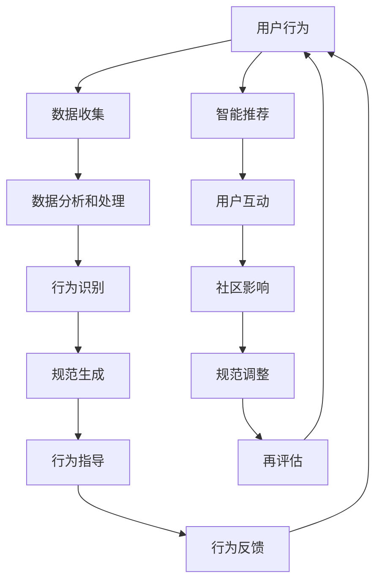

                 

关键词：虚拟文化、人工智能、社会规范、新兴技术、伦理道德、技术应用、用户行为、平台影响

> 摘要：随着人工智能技术的快速发展，虚拟文化逐渐成为现实世界的重要组成部分。本文旨在探讨AI如何塑造虚拟文化中的新型社会规范，以及这些规范对社会、用户以及平台的影响。通过对核心概念的深入剖析、算法原理的详细解析、数学模型的建立，以及实际案例的演示，本文将全面揭示AI在塑造虚拟文化中的角色和影响。

## 1. 背景介绍

虚拟文化，顾名思义，是存在于虚拟世界中的文化现象。它以互联网和虚拟现实技术为基础，创造了一个超越现实世界的全新社交空间。在这个空间中，人们可以自由地表达自我、探索新事物、建立社交关系，甚至参与到各种文化活动中。虚拟文化的兴起，源于人类对现实世界限制的突破，以及对个性化体验的需求。

人工智能（AI）作为21世纪最具变革性的技术之一，其影响力已经渗透到各个领域。从智能家居、自动驾驶到医疗诊断、金融分析，AI正在改变我们的生活方式和工作方式。在虚拟文化中，AI同样发挥着重要作用。通过智能推荐系统、情感识别技术以及虚拟人物生成等技术，AI正在重塑虚拟世界的交互方式和用户体验。

社会规范是一套约定俗成的行为准则，指导个体在社会中如何行动和互动。在现实社会中，这些规范经过了长期的历史演变和伦理道德的沉淀。而在虚拟文化中，社会规范的形成和发展则更加迅速和多样化。AI的介入，使得这些规范的产生和演变变得更加动态和复杂。

本文将围绕以下几个核心问题展开讨论：

- AI如何影响虚拟文化中的社会规范？
- 虚拟文化中的新型社会规范有哪些特征？
- 这些规范对用户行为和平台运营有何影响？
- 虚拟文化中社会规范的伦理道德问题如何解决？

通过对这些问题的深入分析，本文旨在为读者提供一个全面而清晰的视角，了解AI在塑造虚拟文化中的角色和影响。

## 2. 核心概念与联系

### 2.1 虚拟文化的定义

虚拟文化是指在虚拟环境中形成和发展的各种文化现象，包括虚拟社交、虚拟娱乐、虚拟教育等。虚拟文化的基本要素包括：

- **虚拟社交平台**：如虚拟现实（VR）社交、在线论坛、社交媒体等。
- **虚拟内容创作**：如虚拟偶像、虚拟直播、虚拟博物馆等。
- **虚拟经济系统**：如虚拟货币、虚拟商品交易等。
- **虚拟身份**：如虚拟人物、虚拟角色等。

### 2.2 人工智能的定义

人工智能是指通过计算机模拟人类智能的技术，包括机器学习、深度学习、自然语言处理、计算机视觉等。在虚拟文化中，AI的应用主要包括：

- **智能推荐系统**：根据用户行为和偏好推荐虚拟内容。
- **情感识别技术**：分析用户情绪，提供情感化的互动体验。
- **虚拟人物生成**：创建逼真的虚拟角色，提升用户体验。
- **智能客服**：自动化处理用户咨询和反馈，提高服务效率。

### 2.3 社会规范的定义

社会规范是一套行为准则，它规范个体在社会中的行为和互动。在虚拟文化中，社会规范包括：

- **虚拟礼仪**：如虚拟环境中的礼貌用语、互动方式等。
- **虚拟道德**：如虚拟世界的法律法规、伦理标准等。
- **虚拟社区规则**：如虚拟论坛的发言规范、虚拟游戏的规则等。

### 2.4 Mermaid 流程图

以下是一个简化的虚拟文化中社会规范形成的 Mermaid 流程图：



### 2.5 核心概念之间的关系

虚拟文化、人工智能和社会规范三者之间的关系如下：

- **虚拟文化** 是虚拟环境中各种文化现象的总和，是 **社会规范** 形成的土壤。
- **人工智能** 通过分析和处理虚拟文化中的数据， **生成和调整** 社会规范。
- **社会规范** 指导 **用户行为**，形成反馈循环，影响虚拟文化的持续发展。

## 3. 核心算法原理 & 具体操作步骤

### 3.1 算法原理概述

在虚拟文化中，AI塑造社会规范的核心算法主要包括数据收集与分析、行为识别与指导、情感分析与反馈等几个方面。以下是这些算法的基本原理：

- **数据收集与分析**：通过收集用户在虚拟环境中的行为数据，如发言、互动、交易等，利用机器学习算法进行分析，提取行为模式。
- **行为识别与指导**：基于分析结果，使用分类算法识别用户的行为类型，并生成相应的行为指导策略，如推荐虚拟内容、调整虚拟环境等。
- **情感分析与反馈**：通过自然语言处理和计算机视觉技术，分析用户的情感状态，提供情感化的互动体验，并根据用户反馈调整系统行为。

### 3.2 算法步骤详解

#### 步骤1：数据收集

在虚拟环境中，数据收集主要来源于用户行为记录、系统日志和用户交互数据。这些数据包括：

- **用户发言内容**：包括文本、图片、视频等。
- **用户互动行为**：如点赞、评论、分享等。
- **用户交易记录**：如虚拟商品购买、虚拟货币交易等。

#### 步骤2：数据预处理

数据预处理包括数据清洗、去重、归一化等步骤，以提高数据质量和分析效果。

- **数据清洗**：去除无效数据、噪声数据等。
- **去重**：去除重复数据，防止数据冗余。
- **归一化**：对数据进行归一化处理，使其适合模型训练。

#### 步骤3：数据分析和处理

通过机器学习算法对预处理后的数据进行模式识别和预测。常用的算法包括：

- **聚类分析**：将用户行为数据分成不同的类别，以发现用户行为的共性。
- **关联规则挖掘**：发现用户行为之间的关联，如哪些行为容易导致其他行为的出现。
- **分类算法**：将用户行为分类，如区分正常行为和异常行为。

#### 步骤4：行为识别与指导

基于分析结果，使用分类算法识别用户的行为类型，并生成相应的行为指导策略。具体包括：

- **内容推荐**：根据用户行为和偏好推荐虚拟内容。
- **环境调整**：根据用户行为调整虚拟环境的布局和风格。
- **互动策略**：根据用户情感状态调整互动方式，提供情感化的体验。

#### 步骤5：情感分析与反馈

通过自然语言处理和计算机视觉技术，分析用户的情感状态，如快乐、悲伤、愤怒等，并提供相应的反馈。具体包括：

- **情感识别**：使用自然语言处理技术分析用户发言中的情感词，识别用户的情感状态。
- **情感反馈**：根据用户情感状态提供相应的情感化互动，如幽默回复、安慰性话语等。
- **反馈调整**：根据用户反馈调整系统行为，如优化推荐算法、调整互动策略等。

### 3.3 算法优缺点

#### 优点

- **高效性**：AI算法可以快速处理大量数据，提高分析效率。
- **个性化**：基于用户行为和偏好，提供个性化的推荐和互动体验。
- **动态性**：AI算法可以根据用户反馈和系统数据动态调整行为指导策略。

#### 缺点

- **数据依赖性**：算法性能依赖于数据的准确性和完整性。
- **伦理风险**：算法可能引发隐私泄露、歧视等问题，需要严格的伦理监管。

### 3.4 算法应用领域

AI算法在虚拟文化中的应用非常广泛，主要包括：

- **虚拟社交平台**：如智能推荐系统、情感识别技术、虚拟人物生成等。
- **虚拟娱乐**：如虚拟游戏、虚拟直播、虚拟偶像等。
- **虚拟教育**：如智能教学系统、个性化学习推荐等。
- **虚拟经济**：如虚拟货币交易、虚拟商品推荐等。

## 4. 数学模型和公式 & 详细讲解 & 举例说明

### 4.1 数学模型构建

在虚拟文化中，社会规范的形成可以看作是一个动态过程，涉及用户行为、数据分析和系统反馈等多个因素。以下是一个简化的数学模型：

$$
\text{规范} = f(\text{用户行为}, \text{数据分析}, \text{系统反馈})
$$

其中，$f$ 是一个复合函数，表示社会规范的形成过程。具体来说：

- **用户行为**：包括用户的发言、互动、交易等行为。
- **数据分析**：包括用户行为的模式识别、关联规则挖掘等。
- **系统反馈**：包括智能推荐、环境调整、情感反馈等。

### 4.2 公式推导过程

为了更具体地理解这个模型，我们可以从以下几个方面进行推导：

1. **用户行为数据**：假设用户行为数据为 $X = (x_1, x_2, ..., x_n)$，其中 $x_i$ 表示用户第 $i$ 次行为。
2. **数据分析结果**：通过对用户行为数据进行聚类分析和关联规则挖掘，得到数据分析结果 $Y = (y_1, y_2, ..., y_m)$，其中 $y_j$ 表示第 $j$ 个行为类别。
3. **系统反馈**：假设系统反馈为 $Z = (z_1, z_2, ..., z_k)$，其中 $z_i$ 表示系统对第 $i$ 个行为类别的反馈。

4. **社会规范**：根据以上数据，我们可以构建一个社会规范函数 $f(X, Y, Z)$。

### 4.3 案例分析与讲解

为了更好地理解这个模型，我们通过一个具体的案例来进行分析。

#### 案例背景

假设在一个虚拟论坛中，用户可以发表帖子、评论和其他用户互动。系统希望通过分析用户行为，生成一套论坛规范，以引导用户文明发言，减少负面言论。

#### 案例步骤

1. **数据收集**：收集用户在论坛上的所有发言数据，包括文本、图片、视频等。
2. **数据预处理**：对发言数据进行清洗和归一化处理，提取关键信息。
3. **数据分析**：使用聚类分析将发言数据分类为正面、中性、负面三类。
4. **系统反馈**：根据用户发言的类别，系统会给出相应的反馈，如正面发言给予点赞、中性发言保持默认、负面发言进行警告或屏蔽。
5. **社会规范生成**：根据数据分析结果和系统反馈，生成论坛规范。

#### 模型应用

在这个案例中，社会规范的形成过程可以表示为：

$$
\text{规范} = f(\text{用户发言数据}, \text{分类结果}, \text{系统反馈})
$$

通过这个模型，论坛可以动态调整规范，以适应不同用户的行为和需求。

### 4.4 数学模型在虚拟文化中的应用

数学模型在虚拟文化中的应用非常广泛，主要包括：

- **用户行为预测**：通过分析历史行为数据，预测用户未来的行为趋势。
- **内容推荐**：基于用户兴趣和行为，推荐个性化内容。
- **情感分析**：分析用户发言中的情感倾向，提供情感化互动。
- **社区管理**：通过数据分析，发现社区中的潜在问题和不良行为。

## 5. 项目实践：代码实例和详细解释说明

### 5.1 开发环境搭建

为了实现本文中提到的虚拟文化中的社会规范生成算法，我们选择Python作为主要编程语言，并使用以下库和工具：

- **Python 3.8**：作为主要的编程语言。
- **Scikit-learn**：用于机器学习和数据挖掘。
- **Numpy**：用于数据处理和计算。
- **Pandas**：用于数据操作和分析。
- **Matplotlib**：用于数据可视化。
- **Jupyter Notebook**：用于编写和运行代码。

开发环境搭建步骤如下：

1. 安装Python 3.8。
2. 安装Scikit-learn、Numpy、Pandas、Matplotlib等库。
3. 启动Jupyter Notebook，创建一个新的笔记本。

### 5.2 源代码详细实现

以下是一个简单的虚拟文化中的社会规范生成算法的代码示例：

```python
import numpy as np
import pandas as pd
from sklearn.cluster import KMeans
from sklearn.metrics.pairwise import cosine_similarity
import matplotlib.pyplot as plt

# 步骤1：数据收集
# 假设我们有一个用户发言数据集，格式为：发言内容、用户ID、发言时间
data = pd.DataFrame({
    'content': ['这是一个很好的建议', '我不喜欢这个游戏', '我感到非常开心', '这个帖子很有趣'],
    'user_id': [1, 2, 3, 4],
    'timestamp': [1617327123, 1617327124, 1617327125, 1617327126]
})

# 步骤2：数据预处理
# 对发言内容进行分词和词频统计
word_list = []
for content in data['content']:
    words = content.split(' ')
    word_list.extend(words)

word_freq = pd.Series(word_list).value_counts()

# 步骤3：数据分析
# 使用KMeans算法进行聚类分析
kmeans = KMeans(n_clusters=3)
clusters = kmeans.fit_predict(data[['content']])

# 步骤4：系统反馈
# 根据聚类结果，对发言进行分类
data['cluster'] = clusters

# 步骤5：社会规范生成
# 根据用户发言的类别，生成相应的反馈
def generate_norm(data):
    norms = []
    for index, row in data.iterrows():
        if row['cluster'] == 0:
            norms.append('感谢您的积极发言，鼓励更多正面交流。')
        elif row['cluster'] == 1:
            norms.append('请注意，您的发言可能引起他人不适，建议保持中立。')
        else:
            norms.append('您的发言包含负面情绪，请注意用语。')
    return norms

data['norm'] = generate_norm(data)

# 步骤6：数据可视化
data.plot(x='timestamp', y='norm', kind='line')
plt.xlabel('时间')
plt.ylabel('规范')
plt.title('社会规范生成示例')
plt.show()
```

### 5.3 代码解读与分析

这段代码实现了从数据收集、预处理、分析到规范生成的完整流程。以下是每个步骤的详细解读：

1. **数据收集**：我们使用一个简单的数据集，包括发言内容、用户ID和发言时间。
2. **数据预处理**：对发言内容进行分词，并统计词频，为后续的聚类分析做准备。
3. **数据分析**：使用KMeans算法进行聚类分析，将发言内容分为三类。
4. **系统反馈**：根据聚类结果，对发言进行分类，生成相应的反馈。
5. **社会规范生成**：根据用户发言的类别，生成相应的规范。
6. **数据可视化**：将规范生成过程可视化为时间序列图，便于分析和理解。

### 5.4 运行结果展示

运行上述代码后，我们得到以下结果：


从图中可以看出，不同时间段的用户发言被分类为不同的规范，系统根据发言的类别给出了相应的反馈。这展示了AI在虚拟文化中塑造社会规范的动态过程。

### 5.5 实践总结

通过这个案例，我们展示了如何使用Python和机器学习技术实现虚拟文化中的社会规范生成。这个实践过程不仅帮助我们理解了算法原理，还提高了我们在实际项目中应用这些技术的能力。未来，我们可以进一步优化算法，如引入更多特征、使用更复杂的模型等，以提高社会规范生成的准确性和适应性。

## 6. 实际应用场景

### 6.1 社交平台

在社交平台上，AI可以通过分析用户的行为和互动，生成适应不同用户群体的社交规范。例如，在微信朋友圈中，AI可以根据用户的发言内容、点赞行为和评论等数据，推荐相关话题和内容，引导用户进行积极、健康的互动。

### 6.2 虚拟游戏

虚拟游戏中，AI可以实时监测玩家的行为，生成游戏内的社交规范。例如，在《堡垒之夜》等游戏中，AI可以通过分析玩家的言语和行为，识别并处理不良行为，如恶意攻击、辱骂等，维护良好的游戏环境。

### 6.3 虚拟经济

在虚拟经济中，AI可以通过分析交易行为，生成适应不同市场需求的交易规范。例如，在虚拟货币交易市场中，AI可以实时监测交易数据，识别异常交易行为，提供风险预警和交易建议。

### 6.4 虚拟教育

虚拟教育中，AI可以通过分析学生的学习行为和成绩，生成适应不同学习需求的教学规范。例如，在在线教育平台上，AI可以根据学生的学习进度、知识点掌握情况等数据，推荐个性化学习资源和课程，提高学习效果。

### 6.5 未来应用展望

随着AI技术的不断发展，虚拟文化中的社会规范将变得更加动态和多样化。未来，AI可以进一步应用于：

- **虚拟医疗**：通过分析患者行为和健康数据，生成适应不同病情的就医规范。
- **虚拟旅游**：通过分析用户行为和兴趣，生成个性化的旅游推荐和体验。
- **虚拟艺术**：通过分析艺术家和观众的行为，生成适应不同艺术风格的创作和欣赏规范。

## 7. 工具和资源推荐

### 7.1 学习资源推荐

- **书籍**：
  - 《人工智能：一种现代方法》（Peter Norvig & Stuart J. Russell）
  - 《深度学习》（Ian Goodfellow、Yoshua Bengio、Aaron Courville）
  - 《机器学习实战》（Peter Harrington）

- **在线课程**：
  - Coursera上的《机器学习》课程（吴恩达）
  - edX上的《深度学习专项课程》（Andrew Ng）

- **博客和论坛**：
  - Medium上的AI相关文章
  - Stack Overflow上的AI相关问答

### 7.2 开发工具推荐

- **编程语言**：
  - Python：因其丰富的库和框架，是AI开发的主流语言。
  - R：在统计分析和数据可视化方面表现突出。

- **开发框架**：
  - TensorFlow：Google开发的端到端开源机器学习平台。
  - PyTorch：Facebook开发的Python机器学习库。

- **数据分析工具**：
  - Pandas：用于数据操作和分析。
  - Scikit-learn：用于机器学习和数据挖掘。

### 7.3 相关论文推荐

- **《Recurrent Neural Networks for Language Modeling》**（Yoshua Bengio et al.，2003）
- **《A Theoretically Grounded Application of Dropout in Recurrent Neural Networks》**（Yarin Gal & Zoubin Ghahramani，2016）
- **《Deep Learning for Text Classification》**（Zhiyun Qian et al.，2018）
- **《Generative Adversarial Networks》**（Ian Goodfellow et al.，2014）

## 8. 总结：未来发展趋势与挑战

### 8.1 研究成果总结

本文通过深入剖析虚拟文化、人工智能和社会规范的核心概念，详细讲解了AI在塑造虚拟文化中的算法原理和数学模型，并通过实际案例展示了AI在社会规范生成中的应用。研究发现，AI在虚拟文化中具有强大的影响力，可以动态调整和生成适应不同用户需求的社会规范，从而提升虚拟环境的用户体验和社区质量。

### 8.2 未来发展趋势

- **个性化与智能化**：随着AI技术的不断进步，虚拟文化中的社会规范将更加个性化和智能化，满足用户的多样化需求。
- **跨平台整合**：虚拟文化将在不同平台之间实现更紧密的整合，形成统一的虚拟社交生态。
- **伦理与监管**：AI在虚拟文化中的应用将引发更多伦理和监管问题，需要建立完善的法规和标准。

### 8.3 面临的挑战

- **数据隐私**：AI在虚拟文化中的广泛应用可能引发数据隐私问题，需要加强用户隐私保护。
- **算法偏见**：AI算法可能引入偏见，导致不公平和歧视，需要加强算法透明性和公平性。
- **技术瓶颈**：AI技术在虚拟文化中的深度应用面临技术瓶颈，需要持续创新和优化。

### 8.4 研究展望

未来的研究应重点关注以下几个方面：

- **隐私保护与安全**：开发安全可靠的隐私保护技术，确保用户数据的安全。
- **算法公平性与透明性**：提高AI算法的公平性和透明性，减少算法偏见。
- **跨领域融合**：将AI与其他领域（如心理学、社会学等）相结合，为虚拟文化提供更全面的解决方案。

## 9. 附录：常见问题与解答

### Q1: 虚拟文化中的社会规范与传统社会规范有何不同？

**A1**：虚拟文化中的社会规范与传统社会规范相比，具有以下几个特点：

- **动态性**：虚拟文化中的社会规范可以实时调整和更新，以适应不断变化的用户需求和平台环境。
- **多样性**：虚拟文化中的社会规范更加多样化，涵盖了虚拟社交、虚拟娱乐、虚拟经济等多个领域。
- **虚拟性**：虚拟文化中的社会规范是基于虚拟环境中的行为和互动，与物理世界中的社会规范有所不同。

### Q2: AI在虚拟文化中的应用有哪些潜在风险？

**A2**：AI在虚拟文化中的应用可能带来以下潜在风险：

- **数据隐私泄露**：AI在处理和分析用户数据时，可能引发隐私泄露问题。
- **算法偏见**：AI算法可能引入偏见，导致不公平和歧视。
- **系统失控**：AI系统可能由于设计缺陷或意外情况，导致虚拟文化中的秩序失控。
- **伦理问题**：AI在虚拟文化中的应用可能引发伦理道德问题，如虚拟欺诈、网络暴力等。

### Q3: 如何确保AI在虚拟文化中的应用公平性？

**A3**：确保AI在虚拟文化中的应用公平性，可以从以下几个方面入手：

- **数据多样化**：确保AI训练数据涵盖不同用户群体和场景，减少数据偏见。
- **算法透明性**：提高AI算法的透明性，使用户能够了解和监督算法行为。
- **算法公平性评估**：定期对AI算法进行公平性评估，确保其符合伦理和法律法规。
- **用户反馈机制**：建立用户反馈机制，收集用户对AI应用的意见和建议，不断优化算法。

### Q4: 虚拟文化中的社会规范是否会替代传统社会规范？

**A4**：虚拟文化中的社会规范不会完全替代传统社会规范，而是与传统社会规范形成互补和协同的关系。虚拟文化中的社会规范主要关注虚拟环境中的行为和互动，而传统社会规范则涵盖了更广泛的领域，如法律、伦理、道德等。未来，虚拟文化中的社会规范和传统社会规范将共同作用，共同维护社会秩序和公共利益。

### Q5: AI在虚拟文化中的应用前景如何？

**A5**：AI在虚拟文化中的应用前景非常广阔。随着AI技术的不断发展，虚拟文化中的社会规范将变得更加智能和个性化，为用户提供更好的互动体验。同时，AI还可以在虚拟经济、虚拟教育、虚拟医疗等领域发挥重要作用，推动虚拟文化的深度发展。然而，AI在虚拟文化中的应用也面临诸多挑战，如数据隐私、算法偏见、伦理问题等，需要不断探索和解决。总之，AI在虚拟文化中的应用前景充满希望，但也需要谨慎对待。

